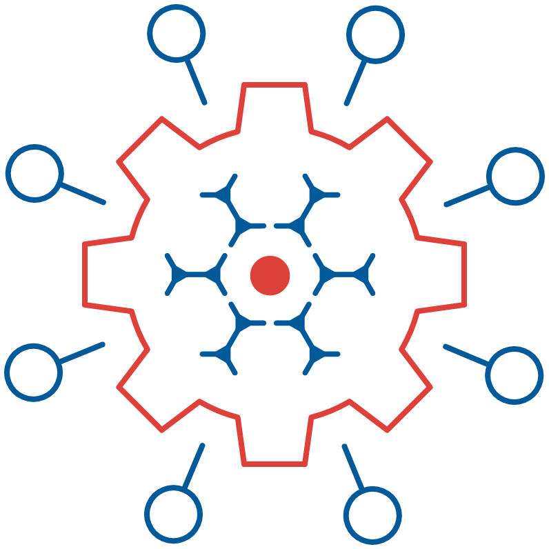


{% column width="70%" valign="middle" %}

### <mark style="color:#DE413A;"><strong>WELCOME TO THE</strong></mark>

# **<code class="expression">space.vars.CAPS_SITENAME</code> DOCUMENTATION**
This site provides complete and up-to-date documentation to help you install, configure, and operate <code class="expression">space.vars.SITENAME</code>(<code class="expression">space.vars.PRODUCT_SHORTNAME</code>) effectively. Whether you're setting up your first integration, developing custom connectors, or troubleshooting issues, this documentation is structured to guide you through every step.
  

{% column width="30%" valign="middle" %}
<figure><figcaption></figcaption></figure>




***

<table data-view="cards">
   <thead>
      <tr>
         <th align="center"></th>
         <th data-hidden data-card-cover data-type="image">Cover image</th>
         <th data-hidden data-card-target data-type="content-ref"></th>
      </tr>
   </thead>
   <tbody>
      <tr>
         <td align="center"><h3><mark style="color:#233C5D"><strong>Getting Started</strong></mark></h3></td>
         <td><a href="docs/assets/Site_Images/Getting_Started.png">Getting Started</a></td>
         <td><a href="docs/getting-started/README.md">getting-started</a></td>
      </tr>
      <tr>
         <td align="center"><mark style="color:#233C5D"><strong>Manage</strong></mark></td>
         <td><a href="docs/assets/Site_Images/Manage.png">Manage</a></td>
         <td><a href="docs/manage/README.md">Manage</a></td>
      </tr>
      <tr>
         <td align="center"><mark style="color:#233C5D"><strong>Help Center</strong></mark></td>
         <td><a href="docs/assets/Site_Images/Help _Center.png">Help Center</a></td>
         <td><a href="docs/help-center/README.md">Help Center</a></td>
      </tr>
      <tr>
         <td align="center"><mark style="color:#233C5D"><strong>Supported Connector</strong></mark></td>
         <td><a href="docs/assets/Site_Images/Supported_Connectors.png">Supported Connectors</a></td>
         <td><a href="docs/supported-connectors/systems-supported.md">Supported Connectors</a></td>
      </tr>
      <tr>
         <td align="center"><mark style="color:#233C5D"><strong>Connector Documentation</strong></mark></td>
         <td><a href="docs/assets/Site_Images/Connector_Documentation.png">Connector Documentation</a></td>
         <td><a href="docs/connectors/connectors.md">Connectors</a></td>
      </tr>
      <tr>
         <td align="center"><mark style="color:#233C5D"><strong>Connector SDK</strong></mark></td>
         <td><a href="docs/assets/Site_Images/Connector_SDK.png">Connector SDK</a></td>
         <td><a href="docs/connector-sdk/README.md">Connector SDK</a></td>
      </tr>
      <tr>
         <td align="center"><mark style="color:#233C5D"><strong>Release Note</strong></mark></td>
         <td><a href="docs/assets/Site_Images/Release_Note.png">Release Note</a></td>
         <td><a href="docs/release-notes/release-notes.md">Release Note</a></td>
      </tr>
      <tr>
         <td align="center"><mark style="color:#233C5D"><strong>Knowledge Resources</strong></mark></td>
         <td><a href="docs/assets/Site_Images/Knowledge_Resources.png">Knowledge Resources</a></td>
         <td><a href="docs/knowledge-resources/README.md">Knowledge Resource</a></td>
      </tr>
      <tr>
         <td align="center"><mark style="color:#233C5D"><strong>Contact Us</strong></mark></td>
         <td><a href="docs/assets/Site_Images/Contact_US.png">Contact US</a></td>
         <td><a href="https://www.opshub.com/contact-us/">Contact Us</a></td>
      </tr>
   </tbody>
</table>  

