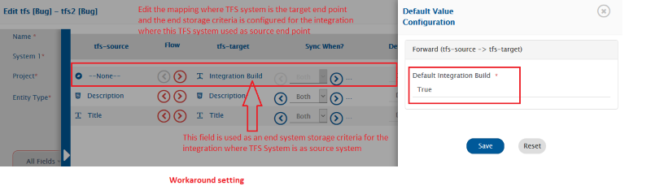

# known-limitations-behavior

### Common

1. For the user type of fields synchronization, make sure all the users have signed in the organization at least once or are assigned to any work-item.
   * Reason: ADO\TFS API Limitations.
   * The above behavior has been confirmed with Microsoft. Please refer to the thread for more information:\
     https://developercommunity2.visualstudio.com/t/all-aad-users-not-coming-in-response/1243303?from=email\&viewtype=all#T-ND1246993
2. For Team Foundation Server as the target system, if the attachment file name contains **Windows invalid file name characters** (`<`, `>`, `:`, `"`, `/`, `\`, `|`, `?`, `*`), then the invalid Windows characters will be replaced by an underscore (`_`).
   * Reason: ADO\TFS API Limitations.
   * To avoid this replacement, it is recommended to follow file naming conventions as mentioned in [Microsoft File Naming Conventions](https://docs.microsoft.com/en-us/windows/win32/fileio/naming-a-file#naming-conventions).
3. For the rich text type of field (HTML) or comments:
   * Entity mention synchronization is not supported for entity type(s) Test Suite, and Test Plan.
   * Entity mention synchronization is not supported for the Team Foundation Server ALM with version < 2015.
   * Default entity mention synchronization option is **Sync source id**. So, migration will migrate source mentioned entity as source id in target. \{% if "OpsHub Migrator for Microsoft Azure DevOps" === space.vars.SITENAME %\} \* Default entity mention synchronization option is **Sync source id**. So, migration will migrate source mentioned entity as source id in target.\{% endif %\} \{% if "OpsHub Integration Manager" === space.vars.SITENAME %\} \* Refer ["**Mention Sync Option**"](../../integrate/mapping-configuration.md#mention-configuration) for more details.\{% endif %\}
4.
   * Area Id, Attached File Count, Authorized As, Authorized Date, Board Lane, External Link Count, Hyperlink Count, ID, Iteration Id, Node Name, Related Link Count, Rev, Revised Date, Team Project, Work Item Type, Board Column, Board Column Done\*\*

5\. \{{SITENAME\}} does not support entity type change in TFS/Azure DevOps. Hence, below will be the behavior in case work item type is changed when TFS/Azure DevOps is the source system: \*\*For ADO/TFS version 2017 and above\*\*:

* If entity type of a work item is changed during active sync, the revisions still pending to be sync will be skipped. The synced of changed entity type will start from the revision wherein work item type was changed. Below example will help in better understanding of the known behavior:
  1. Let's say there is Work item 1 created with type Epic.
  2. Work item 1 is updated at T1 time \[Revision R1]
  3. Work item 1 is updated at T2 time \[Revision R2]
  4. Work item 1 type is changed to Feature at T3 time. Also, a comment is added to the feature in the same revision. \[Revision R3]
  5. \{% if "OpsHub Integration Manager" === space.vars.SITENAME %\} The integration is started with the polling time, T0 \{% endif %\}
  * Case 1:
    * If \{% if "OpsHub Migrator for Microsoft Azure DevOps" === space.vars.SITENAME %\} migration \{% endif %\} \{% if "OpsHub Integration Manager" === space.vars.SITENAME %\} integration \{% endif %\} of both entity types is activated, Work item 1 is synchronized to target as Feature with Revision R3 (except the work item change), R4.
  * Case 2:
    * If a work item has already been synchronized to the target system and its type is changed post \{% if "OpsHub Migrator for Microsoft Azure DevOps" === space.vars.SITENAME %\} migration \{% endif %\} \{% if "OpsHub Integration Manager" === space.vars.SITENAME %\} synchronization \{% endif %\}, a new entity will be created in the target system with a new work item type.
    * Specifically, before changing the type in the source, if the comments were added to that entity, then user impersonation for those comments won't occur. Instead, the integration/migration user will add the comment to the target. \{% if "OpsHub Integration Manager" === space.vars.SITENAME %\}
    * If the integration of both entity types is activated after step #3 and before Step #4, then Work item 1 will be synchronized to target as Epic with revisions R1, R2. Post step #4 and step #5, a new Feature with R3 (except the work item change), R4 will be created in target. \{% endif %\} **For TFS version below 2017**:
* For the entities whose types are changed, the entity type at the time of migration will be considered for migration. Below example will help in better understanding of the known behavior:
  1. Let's say there is Work item 1 created with type Epic.
  2. Work item 1 is updated at T1 time \[Revision R1]
  3. Work item 1 is updated at T2 time \[Revision R2]
  4. Work item 1 type is changed to Feature at T3 time. Also, a comment is added to the feature in the same revision. \[Revision R3]
  5. Work item 1 is updated at T4 time \[Revisions R4] \{% if "OpsHub Integration Manager" === space.vars.SITENAME %\} 6. The integration is started with the polling time, T0.\{% endif %\}
  * Case 1:
    * Work item 1 is synchronized to target as Feature with Revision R1, R2, R3 (except the work item change), R4.
    * For R3 revision, a comment is added in target but work item type change is skipped.
  * Case 2:
    * If a work item has already been synchronized to the target system and its type is changed post \{% if "OpsHub Migrator for Microsoft Azure DevOps" === space.vars.SITENAME %\} migration \{% endif %\} \{% if "OpsHub Integration Manager" === space.vars.SITENAME %\} synchronization \{% endif %\}, a new entity is created in the target system with a new work item type. \{% if "OpsHub Integration Manager" === space.vars.SITENAME %\} In above example, if the integration is activated after step #3, then target will have Epic with R1, R2. Post step #5, a new Feature with R1, R2, R3 (except the work item Change), R4 will be created in target. \{% endif %\} \{% if "OpsHub Migrator for Microsoft Azure DevOps" === space.vars.SITENAME %\}

6.  To maintain correct relationships and references \[available among the source data] into target \[through migration], \{{SITENAME\}} migration follows a specific sequence in which the migration is undertaken. The below list will help understand this sequence.

    1. Meta Entities \[User, Group and Team, Area, Iteration]
    2. Work Item Entities \[Bug, User Story, Task, etc., Test Case, Shared Steps]
    3. Test Plan
    4. Test Suite
    5. Test Run
    6. Test Result
    7. Query, Dashboard
    8. Widgets
    9. Commit Information \[Changesets] for TFVC (Team Foundation Version Control) Repos

    **Note**: Above sequence will also consider the processing failures. The below example will help you understand it.

    * If there is any processing failure for 4. \[Test Suite migration], then the migration for 5. \[Test Run] and 6. \[Test Result] will not be started until failures of Test Suite migration are resolved. \{% endif %\}

### Specific Authentication Mode

#### Service Principal - Client Secret & Service Principal - Client Certificate

* When these are selected as authentication mode, the available entity types are **Work Items**, **Build**, **Pipeline** & **Git Commit Information**.
  * Reason: Currently, only these entities use REST APIs, whereas other entities use REST APIs and Object Model.
  * > **Note**: Queries can't be performed on any other entity types for which Service Principal authentication mode is not applicable.
* The User Mention functionality can be used to mention **User**, but it does not work for **Service Principal**.
  * Reason: Azure DevOps does not allow to mention **Service Principal** on UI.
  * > **Note**: When Azure DevOps is configured as the target system, it is recommended that the default user is mapped instead of the Service Principal for **User Mention**. If the Service Principal is mapped, it will not result in failure. However, an email will be sent by Azure DevOps, saying "**ServicePrincipalName** cannot be mentioned. The identity is not configured to receive notifications."

***

**Specific Entity**

Following are the limitations and behaviors specific to the individual entities in addition to the common:

### Work Item Entities (Bug, User Story, Task, etc)

1. Inline images that are added using the Microsoft's "Test & Feedback" tool and identity images (user profile images) will not be synchronized.
2. When TFS\ADO is a source end point, any change performed in link/relationship among entities, will be synchronized to target with next Update on those entities.
   * Reason: ADO\TFS API Limitations.
3. If link/relationship's comment is updated in TFS/ADO, then this comment update will not be synchronized to the target system.
   * In above mentioned case, the processing failure will be observed in the \{{SITENAME\}}.
4. Links of 'Build', 'Integrated in Release', 'Pull Request', 'Tag' (Repository Tag), 'Versioned Item', 'Wiki page', 'GitHub Commit', 'GitHub pull request' and 'GitHub Issue' are not supported.
5. Synchronization of Kanban Board field is supported for ADO/TFS version 2019 and above.
6. Comment Author details in case of 3-way integration with Team Foundation Server as middle system \[System 1 -> Team Foundation Server -> System 2]
   * This limitation is only applicable only in case integrations have more than 2 systems involved. For example, if we have 1 integration from System 1 to Team Foundation Server and then Team Foundation Server to System 2.
   * In this case, if Impersonation is configured for Team Foundation Server \[and in system configuration username given is IntegrationUser] and Changed By field is mapped in System 1 -> Team Foundation Server integration, then if user1 adds a comment in System 1 and if that gets synchronized to Team Foundation Server with user1 \[Assumption: user1 is present in System 1 and TFS], but the Team Foundation Server to System 2 will still have Comment author as IntegrationUser (Not user1).
7. Entity created by an integration user won't get polled if that particular entity does not meet the criteria.
   * This limitation is applicable when bi-directional integration is configured and the criteria is configured with an end system storage settings. Further, only if the bypass rule is enabled for the system Azure DevOps.
   * OIM polls the entity created by an integration user even though the entity does not meet the criteria. But due to certain API limitations this won't be possible for the system with above configuration.
   * Example: Suppose bi-directional integration is being configured between X system and TFS system. Further, criteria with end system storage is configured for the integration between **TFS Bug to X System Bug**, and the bypass rule is enabled for the TFS system used with integration between **X System Bug to TFS Bug**. Those entities which are created by OIM into TFS system via integration **X System Bug to TFS Bug** won't get polled by integration of **TFS Bug to X System Bug**, given those entities are not meeting the criteria configured for the integration **TFS Bug to X System Bug**. Refer the below screenshots for more clarity on the configuration along with the workaround.
   * **Workaround:** Edit the mapping of the **X System Bug to TFS Bug** to map the field used for an end system storage criteria setting on integration **TFS Bug to X System Bug** to -NONE- with value as 'True'.

<div align="center"></div>

<div align="center"></div>

<div align="center"></div>

8. For Team Foundation Server with version equal to or above 2017, the Remote URL will be different from the remote URLs of the older versions of Team Foundation Server. Also, for Azure DevOps, the Remote URLs will be different.

### Test Entities (Test Case, Test Plan, Test Suite, Test Result, Test Run)

#### Common

* Impersonation is not supported.

**Entity Specific**

Following are the limitations and behaviors specific to the individual entities in addition to the common:

#### Test Case

* Test Parameters having only numeric characters in their name are not supported.
* If Test Case step field like Action or Expected Result contains only image and no text, then Azure DevOps does not render the inline image on user interface. However, the inline image can be seen from history.
* If Test Case step field contains a hyperlink, then Azure DevOps does not allow to click on the link from user interface.
* When updating only test case steps, parameters, and parameter values - Updating only these fields won't be synced to target. To overcome this limitation, it is always recommended to use overwrite option for all these fields while configuring field mapping.

#### Test Plan

* Synchronization is not supported with REST APIs.
* Inline image synchronization is not supported.
* Links of 'Remote Work', 'Release pipeline', 'Build', 'GitHub', 'Git' and 'Wiki' with Test Plan are not supported.
* Test Run settings, Outcome settings, MTM settings and MTM environments are not supported in Test Plan.
* For TFS version below 2013-Update 3, Test Plan is not supported as a separate entity. Test Plan with few fields will synchronize with Test Suite synchronization. Also, Test Plan with duplicate name will not get synchronized.
* Test Plan as a separate entity is supported from OIM version 7.46. For fresh project synchronization, it is recommended to synchronize Test Plan separately, followed by Test Suite, Test Run and Test Result. After migrating to OIM version >= 7.46 from older version, if you want to synchronize Test Plan separately in running integrations, please refer to [post migration guideline for Test Plan entity support](../post-migration_checklist/#test_plan_entity_support_for_tfs.azure_devops).

#### Test Suite

* Synchronization is not supported with REST APIs.
* Inline image synchronization is not supported.
* Test Suite will migrate current state. Any changes in the target system after synchronization may show inconsistency in data in both end points.
* Synchronization of Test Case chart and Test Result chart created within test suite is not supported
* Query-Based Suite or Requirement-Based Suite.\

  *   Once a Query-Based Suite or Requirement-Based Suite synced to target system, then after any new linkage of Test-Case with test suite added due to modification in test case. Hence newly added Test-Case linkage of Test Suite will not

      to the target system and any Test Run with corresponding test point will resulted into processing failure. In such case do following. click [here](../../connectors/team-foundation-server.md-troubleshoot) for troubleshoot.
*   Any update in Test Suite Configuration will

    only when test suite is updated.
* Ordering in Test Cases which are added to Test Suite is supported only for version 2019 onwards for on-premise deployments (i.e. Team Foundation Server) and all cloud deployments (i.e. Azure DevOps). In addition to that, ordering is only possible when the user has selected authentication type as Personal Access Token in the system configuration. Refer section [Create Personal Access Token](../../connectors/team-foundation-server.md-create-personal-access-token).
* If source endpoint is Team Foundation Server with version lower than 2017 or target endpoint is not an Azure DevOps, all types of Test Suite (Static/Query based/Requirement) will be migrated as Static Suite.
* If source endpoint is Azure DevOps or on-premise deployment (i.e Team Foundation Server) with version 2017 onwards and target endpoint is Azure DevOps, then the Static suite is \{{-ifeq: \{{SITENAME\}} | OpsHub Migrator for Microsoft Azure DevOps |migrated|synchronized\}} as Static Test Suite. The Requirement-based test suite is \{{-ifeq: \{{SITENAME\}} | OpsHub Migrator for Microsoft Azure DevOps |migrated|synchronized\}} as Requirement-based test suite and Query-based test suite is \{{-ifeq: \{{SITENAME\}} | OpsHub Migrator for Microsoft Azure DevOps |migrated|synchronized\}} as Query-based test suite.
  *   The

      user of source and target endpoint requires desired access level Basic + Test Plans in end system to synchronize query-based and requirement-based suite. Refer [Access Level](https://docs.microsoft.com/en-us/azure/devops/organizations/security/access-levels?view=azure-devops) to know more about this access level or subscription for the \{{-ifeq: \{{SITENAME\}} | OpsHub Migrator for Microsoft Azure DevOps |migration|integration\}} user. Otherwise, Test Suite synchronization will be resulted in to job error/sync failure as "You are not authorized to access this API. Please contact your project administrator".
* Synchronization Behavior of **Query Text** field of Query based Test Suite:
  * The Query based test suite has a field **Query Text** that represents the actual criteria that has been given in the Query Suite entity. The **Query Text** follows a specific format for which you can refer to [WIQL syntax](https://docs.microsoft.com/en-us/azure/devops/boards/queries/wiql-syntax?view=azure-devops).
  * Refer to the section [Synchronization Behavior of fields with WIQL format](../..connectors/team-foundation-server.md#synchronization-behavior-of-fields-with-wiql-format) to know general synchronization behavior applicable to this type of field. Following are the behavior specific to Query Text field of Test Suite entity:
  * It is recommended to have both source and target endpoints having identical templates (fields, lookups, iteration, areas, etc.) to synchronize the Query Text field of the Query-based suite. Any differences in the template could lead to a mismatch in Test Case association and cause the Test Suite sync failure. It may require the end-user to manually correct the Query Text field of Test Suite in the source or target end system to retry the failure.
    * **User values mentioned in Query Text**
      * Query Text Field with a user type of field clause will be restricted to transform the user(s) not the Group or Team present as part of clause value. \{% if "OpsHub Migrator for Microsoft Azure DevOps" === space.vars.SITENAME %\} The user will be transformed to corresponding target end system user as per user mapping of migration.\{% endif %\} \{% if "OpsHub Integration Manager" === space.vars.SITENAME %\} The user will be transformed to corresponding target end system user as per user mentions mapping of field **Query Text** .\{% endif %\}
    * **Id values mentioned in Query Text**
      * In the **Query Text** field, an id clause can refer to a particular or set of a work item of type Test Case.
      * The synchronized test case will have a different id in target system than the source entity. Henceforth it is required to transform the id clause as per the target end system to avoid mismatch in the association of Test Case(s) with Test Suite between the source system and target system. By default, the Query Text field with ID field clause will not be changed as per target entity id. Perform following configuration(s) in order to transform ID as per the target end system. \{% if "OpsHub Migrator for Microsoft Azure DevOps" === space.vars.SITENAME %\}
        * Create a custom field with the name as **Source Workitem ID** and type as _Integer_ for the Test Case entity in the target system prior to migration to transform the ID as per the target entity. So, target query-based test suite gets populated with the desired test cases.
        * In the absence of this custom field **Source Workitem ID** in the target end system the Query based test suite will be migrated as static suite.
        * If a Custom field named "Source Workitem ID" exists before migration for Test Case entity in target endpoint, then Query Text field with ID field Clause will be migrated as "Source Workitem ID" clause instead ID clause in Query Text. For Example, \[ID] = 1234 is the id clause in the source end system, then this id clause migrated in target as \[Source Workitem ID] = 1234.
        * It is recommended to have the "Source Workitem ID" field in Test Case for the target entity with Type "Integer" to avoid mismatch in the association of Test Case(s) with Test Suite between the source endpoint and target endpoint after migration.
        * If the Type of the field "Source Workitem ID" is "String", then migration of Query Text field with ID clause is restricted to synchronize certain operators which are compatible with String type of field. For example, >, <, =, <=, >=, <>, In, Not In etc. The operator(s) which are only compatible with the Integer type of field and not compatible with the String type of field will cause the sync failure for Test Suite. Such incompatible operators are \[=Field], \[>Field], \[>=Field], \[<=Field], \[<>Field], etc. The custom field used to replace ID field is of String type requires compatible operator and value. \{% endif %\}

\- Create a custom field with any name but type as \`Integer\` for the Test Case entity in the target system. - Configure the Remote Id field for Test Case integration using above created custom field prior to synchronize Test Case(s). - Configure the following advance mapping for field \*\*Query Text\*\* to replace \`ID\` field with created custom field. Sample provided later in this document. - If the Type of the above created custom field is \`String\` then: - The synchronization of \*\*Query Text\*\* field with ID clause is restricted to synchronize certain operators which are compatible with String type of field. For example, \`>\`, \`<\`, \`=\`, \`<=\`, \`>=\`, \`<>\`, \`In\`, \`Not In\` etc. - It is required to use the advance workflow of \`Default Integration Workflow For TFS to TFS Test Suit.xml\` to synchronize the Query Text with ID clause when target end system has custom field \`Source Workitem ID\` of String type.

**Sample Advance Mapping to replace ID field to custom id field name Source Workitem ID**

```xml
<Query-space-Text  xmlns:xsl="http://www.w3.org/1999/XSL/Transform">
  <xsl:value-of select="utils:transformIdMentioned('Query Text',SourceXML/updatedFields/Property/Query-space-Text,'(\\[ID\\])','[Source Workitem ID]')"/>
</Query-space-Text>
```

* **Transform the field clause of Query Text field having different source and target field value(s)**
  * Scenario: Different lookups of field in source and target end system for test case entity.
  * Example, Suppose valid lookups of priority field of source system are 1,2,3,4. whereas priority lookups of target system are 1,2,3. As per the test case mapping the missing look up 4 in target system is mapped to 3.

**Sample Query Text of test suite entity of source system** Following is the sample mapping which will transform the Priority field clause of query text field of Test Suite entity as per the given Test Case mapping. After transformation using the below sample mapping, the field clause of **\[Priority] = 4** will be transformed as **\[Priority] = 3**.

```sql
select [System.Id], [System.Title], [System.AssignedTo], [System.AreaPath] 
from WorkItems 
where [System.TeamProject] = @project 
  and [System.WorkItemType] in group 'Test Case Category' 
  and [Microsoft.VSTS.Common.Priority] = 4 
  and [System.Id] >= 1 
  and [System.State] = 'Closed' 
  and [System.Reason] = 'Duplicate' 
order by [System.Id]
```

**Expected Query Text to be synchronized in target system**

```sql
select [System.Id], [System.Title], [System.AssignedTo], [System.AreaPath] 
from WorkItems 
where [System.TeamProject] = @project 
  and [System.WorkItemType] in group 'Test Case Category' 
  and [Microsoft.VSTS.Common.Priority] = 3 
  and [System.Id] >= 1 
  and [System.State] = 'Closed' 
  and [System.Reason] = 'Duplicate' 
order by [System.Id]
```

**Sample Advance mapping for query text for above transformation**

```xml
<Query-space-Text>
  <xsl:variable name="xpathQueryText" select="SourceXML/updatedFields/Property/Query-space-Text"/>
  <xsl:variable name="xapthFieldPriority" select="utils:transformWIQLClauseAsPerMapping($xpathQueryText,'Priority','\\[Priority\\] = ([0-9]+),\\[Priority\\] in ([0-9]+)','Test Case Mapping',false(),$sourceSystemId,$targetSystemId)"/>
  <xsl:value-of select="$xapthFieldPriority"/>
</Query-space-Text>
```

> **About utility method `transformWIQLClauseAsPerMapping`**

This method requires the following inputs as mentioned in the following sequence:

* **Query Text:** Source value of Query Text field which field clause is required to transform as per the target system.
* **Clause Field Name:** Name of the field which clause needs to match against the following RegEx input.
* **Clause Match RegExSet:** Comma-separated RegEx to match the possible value part of the given field clause to extract the value from the source query and replace it as per the test case mapping input.
* **Mapping Name:** Name of valid test case mapping to transform given field clause. This mapping is expected to have mapping for the field name given as part of the second input parameter.
* **Enclosed Value With Quote:** Boolean parameter indicating whether to have the transformed value within single quotes or not. If invoked as `true()`, the value will be enclosed in single quotes in the resulting query text. If `false()`, then the transformed value will not be enclosed.
* **Source System Id:** System id of the source end system.
* **Target System Id:** System id of the target end system. \{% endif %\}

**Test Result and Test Run**

* Synchronization is not supported with REST APIs.
* Test Run and Test Result will migrate current state. Any changes in the target system after synchronization may show inconsistency in data in both end points.
* Following Test Result and Test Run will not synchronize (these Run and Result are logged in \{{SITENAME\}} logs):
  * Run and Result created with Test Suite not existing in the source.
  * Run and Result created with Test Case not associated with the Test Suite while synchronization was performed.
  * Any Run and Result created with Test Case/Configuration, associated with Test Suite after synchronization.
  * Run and Result existing in Plan (e) Automated Run and Result are not supported.
* Below are only for Test Result:
  * Test Result Attachment link is not supported.
  * of video format attachment of Result Steps and Result is not supported.
  * Synchronization of Parameter Values for Step Results is not happening.
    * Reason: ADO/TFS API limitations.
  * 'Duration' field will get synchronized only when the value of 'Status' field is 'completed'.

### Meta Entities (User, Group and Team, Area, Iteration)

* Impersonation is not supported.
* of Meta Entities for Team Foundation Server 2010 or lower is not supported.
* \{{SITENAME\}} will not sync the following two permissions at collection level for Group and Users due to lack of API:
  * Delete team project
  * Delete team project collection\
    However, the first permissions for a group or a user will be set at the project level.
*   of the groups with reserved name is only possible if they are present in the target system. If such groups are not present in the target system, processing failures will be observed in \{{SITENAME\}}. - Reason: Groups cannot be created with reserved names, i.e., Group name 'Endpoint Creators' is reserved by the end system. While trying to create this group, a failure error message will be generated, 'Cannot complete the operation because the group name 'Endpoint Creators' is reserved by the system.' - User needs to manually delete this failure and start the

    again.
*   If integration user is not a member of **Project Collection Administrators** group, collection level permissions will not be

    .
* Following are the limitations of \{{SITENAME\}}, if you are syncing Area or Iteration:
  * Target Lookup Query is supported for only one field i.e. Path and the query must be Path=@Path@ for Team Foundation Server to Team Foundation Server integration.
  * Recovery functionality is effective only when Manual Conflict Detection is put off for field Path. It could be set to 'disable conflict detection' or enabled with either 'Source Wins' or 'Target Wins'.
  * Restart Team Foundation Server and OpsHubTFSService.
  *

#### Dashboard/Query/Widgets Entities

**Common**

* Impersonation is not supported.
* These entities do not have Attachments, Comments, and Inline images, hence these details are not supported.
* These entities do not have historical data, hence historical data synchronization is not supported.


\- Criteria based synchronization and target lookup is not supported for Dashboard and Query entity. Refer to \[Criteria Configuration in integration]\(integration-configuration#criteria\_configuration) and \[Search in Target Before Sync]\(../integrate/integration-configuration.md#search-in-target-before-sync) to know more on these features. - Criteria based synchronization is not supported for Query entity. Target lookup is only supported for 'Folder' field, please refer to \[Target lookup query format]\(../../connectors/team-foundation-server.md#supported-target-lookup-query-for-query-entity) for its target lookup query format.


**Entity Specific**

Following are the limitations and behaviors specific to the individual entities in addition to the common:

**Dashboard Entity**

* Dashboard can be marked as **Favorite**. Synchronization of this **Favorite** attribute is not supported.
  * Reason: ADO/TFS API unavailability


- Dashboard can be created with **Dashboard Type** as **Project Dashboard** or a **Team Dashboard**.
  * For Team Dashboard, **Owned by team** will be applicable and for **Project Dashboard**, **Owner** field will be applicable.
  * When Azure DevOps is source:
    * Dashboard type details will be available in **Dashboard Type** field (read-only field)
    * In case of Project Dashboard, owner details will be available in **Owner** field and **Owned by team** field will contain no value.
    * In case of Team Dashboard, owner details will be available in **Owned by team** field and **Owner** field will contain no value.
  * When Azure DevOps is target:
    * If **Owner** field contains a value, then the dashboard will be created with type **Project Dashboard**.
    * If **Owned by team** field contains a value, then the dashboard will be created with type **Team Dashboard**.
    * If both fields contain value, then you will get a processing error \[OH-TFS/AzureDevOps-1119].


**Query Entity**

* The Queries can contain Fields, Lookup Values, Users, Ids etc. Hence for Query synchronization, please make sure the source and target projects have the same template \[Same fields, lookup values, Users etc ..].
* Synchronization of **Personal Queries** of user is not supported. Only the queries within **Shared Queries** folder & its sub-folders to which integration user has access to will be synchronized.
* A query can be marked as **Favorite**. Synchronization of this **Favorite** attribute is not supported.\
  **Reason:** ADO/TFS API unavailability.
* TFS Query Charts synchronization is not supported.\
  **Reason:** ADO/TFS API unavailability.
* Synchronization Behavior of **WIQL** field:
  * The Query entity has a field WIQL that represents the actual criteria that are given in the Query. The WIQL follows a specific format for which you can refer to [WIQL syntax](https://docs.microsoft.com/en-us/azure/devops/boards/queries/wiql-syntax?view=azure-devops).
  *   Refer to section [Synchronization Behavior of fields with WIQL format](Team_Foundation_server/#synchronization_behavior_of_fields_with_wiql_format) to know general sync behavior applicable to this type of field. Following are the behavior specific to the WIQL field of the Query entity.

      **User values mentioned in WIQL**

      * Azure DevOps End point Format - User Display Name . **Example:** demouser1 [demouser1@opshub.com](mailto:demouser1@opshub.com)
      * Format being used for processing/synchronization - User Display Name . **Example:** demouser1 [demouser1@opshub.com](mailto:demouser1@opshub.com)\
        [No change is done here and hence it's expected that User Display Name is same in Source and Target End Point and based on that the user values will be synchronized/visible in the target end point]
        In case the user with same display name is not available in target end point then the source user display name will be synchronized as text in the WIQL field in the target end system.
        **For example -**
        Consider a WIQL:
        `select [System.ID], [System.WorkItemType] from WorkItems where [System.State] = 'Active' and [System.AssignedTo] in ('demouser1 <demouser1@opshub.com>', 'demouser2 <demouser2@opshub.com>')`
        This will be synchronized as:
        `select [System.ID], [System.WorkItemType] from WorkItems where [System.State] = 'Active' and [System.AssignedTo] in ('demouser1 <demouser1@opshub.com>', demouser2)`
        if no user with user name **demouser2** exists in target end system.

      **Id values mentioned in WIQL**

      * In WIQL, an id of a work item can be referred in the field value.
      * Azure DevOps End point Format - [ID] [=, <, >, <=, >=, <>, in] [Source entity id]. **Example:** `[ID] = [12345]`
      * Format being used for processing/synchronization - `[ID] = [12345]`
        \[No change is done here and hence the source work item id will be synchronized/visible in the target end point]
        In case, you want the Source workitem id to be replaced with its corresponding target id [Which is synchronized by <code class="expression">space.vars.SITENAME</code>], please use a customized workflow - **Default Integration Workflow - TFS to TFS - Query.xml**
        **For example **
        Consider a WIQL:
        `select [System.ID], [System.WorkItemType] from WorkItems where [System.ID] = 1234 and [System.AssignedTo]`
        This will be synchronized as:
        `select [System.ID], [System.WorkItemType] from WorkItems where [System.ID] = 6789 and [System.AssignedTo]`
        Here, "1234" is the source workitem id and "6789" is the corresponding target work item id.
* Azure DevOps is configured as target:
  * **Folder synchronization**
    * In Azure DevOps, **Query** entities can be organized in different folders.
    * In <code class="expression">space.vars.SITENAME</code>, the field **Folder** corresponds to the folders present in the end system.
    * While Query synchronization, if the Query's folder is not available in target, then <code class="expression">space.vars.SITENAME</code> will first create the folder and then the query will be synchronized to that folder.

#### Widget Entity

* **Remote Entity Link** is not supported for Widget entity because in Azure DevOps itself there is no independent URL to access a widget. Refer to [Tracking Link of Entities Across Systems](../../integrate/integration-configuration.md#tracking-id-and-link-of-entities-across-systems) for more information on this feature.
* When Azure DevOps is configured as target:
  * In Azure DevOps, a widget can be only created within a dashboard. Hence, configuring a relationship of type **Dashboard** is mandatory so that widget gets created within that dashboard.
    * A failure [OH-Connector-0059] will be generated in case a dashboard is not synchronized and its widget is getting synchronized. In such cases, dashboard must be synchronized first and then widget creation failure should be retried.
* **Configuration field behavior**
  * There can be variety of widgets and each widget can have its own configuration. Widget configuration can be synchronized using **Configuration** field in <code class="expression">space.vars.SITENAME</code>.
* **Widgets re-positioning behavior**
  * A Dashboard has pre-defined number of tiles where widgets can be added or re-positioned.
  * As long as the source and target dashboard have same widgets positioning i.e same position and size, the synchronization will work as per expectation. If the widget positioning differs, synchronization will fail with "widget collision" exception.

| **Target Widgets operation**                                                                  | **Synchronization Behavior**                                                                 |
| --------------------------------------------------------------------------------------------- | -------------------------------------------------------------------------------------------- |
| Target widgets are not re-positioned                                                          | Source changes will be synchronized to target                                                |
| Target widgets are re-positioned and any target change is not conflicting with source changes | Source changes will be synchronized to target                                                |
| Target widgets are re-positioned and any target change is conflicting with source changes     | Re-positioning will fail with widget collision exception                                     |
| When target has some new widgets added at non-conflicting positions with source changes       | Sources changed will be synchronized to target and the target added widgets will be retained |
| When target has some new widgets added at conflicting positions with source changes           | Re-positioning will fail with widget collision exception                                     |

*   **Handling widget collisions:**

    * When widgets are re-positioned in source, the dashboard in target needs to be re-positioned as well using following configuration:
      * The **Widget** link must be configured in Dashboard mapping.
    * The dashboard must be re-synchronized through <code class="expression">space.vars.SITENAME</code>.
    * In case of widget collision failure, the user will have to move the existing widget in target to another position, and then retry the processing failure of Dashboard integration in <code class="expression">space.vars.SITENAME</code> to synchronize the widget re-positioning.

    > **Note** Any update on fields - **Position Row, Position Column, Size Row Span and Size Column Span** will be ignored during widget update synchronization.
* **Query Charts used as Dashboard Widgets:**
  * When a chart created using a query is directly added to dashboard without any additional configuration, then the widget will be synchronized without any query link.
    * **Reason:** The API for widget does not provide the required query link information in the above use case.
    * **Solution:** The issue can be resolved by saving these type of widgets on source side without any changes. This will unlink the widget from the chart and link to the original query, providing the correct query link information.
* For accurate ID transformation using [Transformation JSON](../../connectors/team-foundation-server.md#json-structure-overview), these items must have corresponding target items with the same name - Release, Project, Team, Repository. If not present, those configurations will be synchronized with empty values.
* For widgets with team configurations where the selected teams belong to projects different from the one being synchronized, values for these cross-project teams will be synchronized only in version 2018 and above.
  **Reason:** API to fetch teams across-project teams is available from version 2018.
* From the widgets provided by Azure DevOps out-of-the-box, following widgets synchronization have some limitations:
  * The Cumulative Flow Diagram widget will be synchronized with empty values in Backlog, Swimlane, and Column fields.
  * The following widgets are not supported by default:
    * Requirements Quality
    * Test Results Trend
    * Test Results Trend (Advanced)
    *   Deployment Status

        > **Note** Since the JSON path for some referenced IDs is not fixed in the above widgets, it is recommended to use regex-based search as given in [Transformation JSON](../../connectors/team-foundation-server.md#json-structure-overview) section for more accurate results.

### Pull Request

* The Pull Request will get synchronized based on the current state (Non-revision based).
* Pull Request will have source and target branch. Details of the source and target branches can be synchronized to the target using following fields - Branch Name, Url, ObjectId, Creator for source and target branch respectively.
* Criteria configuration with [Storage type 'In End System'](../../integrate/criteria-information-storage.md) is not supported.
* Comments operations like add/update will synchronize to the target with the change in any other field of the Pull Request.
* In Pull Request comments are of two types : 1) system 2) text, by default both the type of comments will synchronize to the target. But we do have an option to select any specific type from the comments mapping.
* The first default comment, i.e., **`<user>` created the pull request** won't sync to the target because they are not available through AzureDevOps/TFS APIs.
* For Reviewers, Pull Request will have two fields **Required Reviewers** and **Optional Reviewers**. In AzureDevOps both the fields are visible but in TFS On-Premise only one field is visible i.e., **Reviewers**. To synchronize **Reviewers** field of TFS On-Premise map the field **Optional Reviewers** with the required target system field.
* Inline images/documents and user mentions are not supported in Description and Comments.
* Description and Comments' content will be synchronized as Markdown text to the target because AzureDevOps/TFS APIs provide only Markdown format content.\
  **For example -** Let say Description field's content in the Pull Request is bold, then AzureDevOps/TFS provides this bold content in the format `**<content>**` because bold is being represented in this way in Markdown text. So, if we synchronize the Description then `**<content>**` will be synchronized to the target.

#### Git Repositories Selection

To synchronize Pull Request, you need to select the repositories of the respective projects selected for the synchronization as shown in the screenshot:

<div align="center"></div>

#### Configuring Related Workitem Regex

User can provide the target entity Ids in the Pull Request fields like Title/Description against which the entity will sync to the target. To extract the target entity Ids **Regex** is required in the input **Related Workitem Regex** while configuring integration (as shown in the screenshot below). By default, "-1" will be passed if there is no match in the Title/Description.

**For example**, for Pull Request, if its title is "PR against TEST-123" and the target related work item id on which you want to synchronize Pull Request is TEST-123, then Regex for your input will be:

```
[A-Za-z]+-\d+
```

<div align="center"></div>

### Build Entity

* Build data is supported for all cloud deployment (AzureDevOps) and version 2019 onwards for on-premise deployment(i.e. Team Foundation Server).
* Build entity does not have Attachments, Comments, and Inline images, hence these details are not supported.
* Build entity is only synchronized for finished, not started and in-progress states.
* Build entity does not have historical data, hence historical data are not supported.
* Stage update will be synchronized to target system.
*   If user wants to sync the Build only after particular stage of the pipeline, it can be achieved via the OpsHub Workflow changes and utility functions defined into com.opshub.eai.tfs.buildentity.TFSBuildUtility class \[for example getMatchedNodes function from the TFSBuildUtility can be called from the advanced integration workflow to get the builds that matches with particular stage mentioned into argument].
  > **Note** For Workflow changes and utility function, contact the OpsHub Sales team.
* Criteria configuration with Select criteria storage type as In End System not supported due to build entity does not have custom fields.
* **Shelveset name** and **drop location root** field details will not be available for synchronization.
  * Reason: ADO/TFS API Limitation.
* To sync the stages' approvals, the following points must be considered:
  * Three text types of the fields need to be created for stage identifier(in YML file of pipeline for particular stage), approval status, approval comments in source system, from which the data will be synced to Build entity.
  * To approve the build stage, user needs to give the above three values in the above fields.
  * Map the 'None' field of the source system to the OH_StageApproval field of build entity in <code class="expression">space.vars.SITENAME</code>. The following advance mapping should be utilized for mapping the 'None' field to OH_StageApproval:
    
```xml
<oh_stageApproval xmlns:xsl="http://www.w3.org/1999/XSL/Transform">
  <xsl:variable name="sap" select="'SEPARATOR'"/>
  <xsl:variable name="stages" select="tokenize(normalize-space(SourceXML/updatedFields/Property/FIELD_INTERNAL_NAME_OF_STAGE_IDENTIFIER), $sap)"/>
  <xsl:variable name="status" select="tokenize(normalize-space(SourceXML/updatedFields/Property/FIELD_INTERNAL_NAME_OF_STATUS), $sap)"/>
  <xsl:variable name="comments" select="tokenize(normalize-space(SourceXML/updatedFields/Property/FIELD_INTERNAL_NAME_OF_COMMENTS), $sap)"/>
  <xsl:for-each select="$stages">
    <op_list>
      <xsl:variable name="vPosition" select="position()" />
      <stage><xsl:value-of select="$stages[$vPosition]"/></stage>
      <status><xsl:value-of select="$status[$vPosition]"/></status>
      <comment><xsl:value-of select="$comments[$vPosition]"/></comment>
    </op_list>
  </xsl:for-each>
</oh_stageApproval>
```

* Put the field's internal name of stage identifier, approval status, approval comments in the advanced mapping in place of FIELD_INTERNAL_NAME_OF_STAGE_IDENTIFIER, FIELD_INTERNAL_NAME_OF_STATUS, FIELD_INTERNAL_NAME_OF_COMMENTS respectively.
* Put any separator in place of SEPARATOR. In multiple stage approvals, user needs to give three fields' data with SEPARATOR separated value in the opposite entity.
* The approval sync requires the status and stage identifier to approve the stage. For example, if there is ',' as SEPARATOR in advanced mapping, to approve stage 1 and stage 2 at a time, the following values must be inserted:
* Put **stage1Identifier,stage2Identifier** value in FIELD_INTERNAL_NAME_OF_STAGE_IDENTIFIER
* Put **comment1,comment2** value in FIELD_INTERNAL_NAME_OF_COMMENTS (here comment1 is for stage 1 and comment2 is for stage 2 approval)
* Put **approved,rejected** value in FIELD_INTERNAL_NAME_OF_STATUS (here stage 1 will be approved and stage 2 will be rejected)
* The user needs to insert these three values at the time of stages' approval for the build.

### Pipeline Entity

* Attachments, Comments, and Inline images' synchronization is not supported.
  * Reason: Pipeline does not have Attachments, Comments, and Inline images.
* End System Criteria Storage is not supported.
  * Reason: Pipeline does not have any custom fields.
* Service Connections, Agent Pools, Secure Files, Task Groups, and Azure Git Repositories with the same names in the source system must be present in the target system to avoid any sync failures.
* Impersonation is not supported.
* Release Pipeline is not supported [only Build Pipeline is supported].
* For on-premise deployment, there is a Retention tab in the Pipeline entity [not available in cloud deployment]. This Retention tab synchronization is not supported.
* Process parameters are not supported.
* During the Pipeline entity synchronization, the processing failure may come while syncing the Service Connection for the below mentioned use case. For more details around the next steps, refer to [this](How_to_resolve_processing_failure_for_Pipeline_integration_when_there_is_a_Service_Connection_which_is_deleted_in_the_end_system) section.
  * Use case: Service Connection 1 was associated with some steps of any job in the Pipeline entity. The user changed the Service Connection from Service Connection 1 to Service Connection 2 and deleted the Service Connection 1 from the end system.
    


* Actual revision time and user email are suffixed to the comment of that particular revision.





## Version Control Entity (TFS Commit Information)

* Original commit date will not be migrated.
  * Commit date will be added by default in Commit Comments.
* Commit with Rollback operation is not supported.
* Change set ID would be suffixed to Commit comment.
* Original committer user would be suffixed to Commit comment.
* For all the merges in source which are performed only on particular changesets and not on latest version, there is a possibility that there can be difference in the merge history (not the file content) for those files after sync. Difference like certain number of changeset pending in source might be seen merged in target or certain changesets merged in source might be seen pending in target.
* If a folder is created and later converted to a branch in the source, then the branch will be synced as a folder in the target system. Please contact the support team for post migration to reconcile branches and folders.
  

