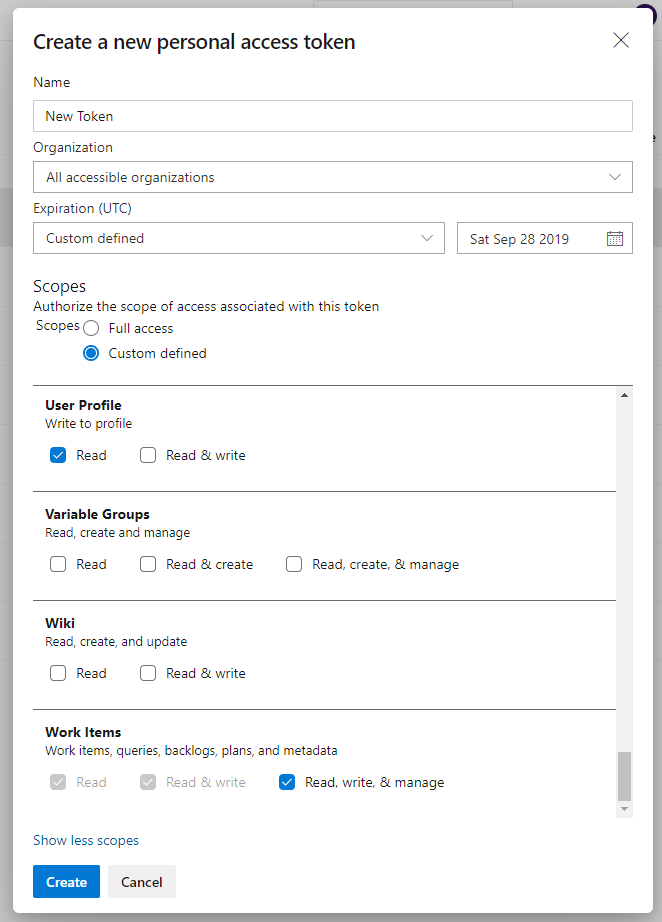

# Privileges for User

These are the common privileges for **user**. To know specific privileges required for user, refer to [User Privileges](tfs-prerequisites.md#user-privileges).

* Add a user in Azure DevOps that is dedicated for <code class="expression">space.vars.SITENAME</code>. This user shouldn't perform any other action from Azure DevOps user interface. Please make sure this user or Service Principal has a unique display name across the instance.
* User must be a member of **Project Administrators** group for work item entities and Build entity migration. For Meta entities like Group, User entities, integration user must be a member of **Project Collection Administrators** group or **Project Administrators** group. Refer section [How to Add User or Service Principal in group](../../connectors/team-foundation-server.md#how-to-add-user-or-service-principal-in-group).

> **Note**: If integration user is not a member of **Project Collection Administrators** group, collection level permissions will not be synchronized.

* **Bypass rules on work item updates** in Boards section of the permissions must be **Allow** to impersonate the comment author.

> If you are using Service Principal Authentication, the steps described above for user will be applicable for Service Principal Authentication. For more information refer to [Service Principal Privileges](tfs-prerequisites.md#service-principal-privileges).

## User Privileges

* User can use **Basic** Authentication or **Personal Access Token** authentication method to communicate with API for Azure DevOps.
  * In case of **Personal Access Token** authentication, please check [Personal Access Token Permission](tfs-prerequisites.md#personal-access-token-minimum-required-permission) section for the required permission details. Personal Access Token is supported for Team foundation Server On-Premise (TFS instance with **HTTPS** installation only) with version 2017 and above and Azure DevOps.
  * For On-Premises deployment, either Basic authentication or PAT authentication needs to be enabled on server. Please refer to [Internet Information Services(IIS) Configurations](tfs-prerequisites.md#internet-information-services-iis-configurations) to learn more about enabling the Basic/PAT authentication in IIS.
* In case user want to synchronize User type fields of Azure DevOps with any other system with default <code class="expression">space.vars.SITENAME</code> generated mapping, it is necsessary that all users have their preferred e-mail address set in Azure DevOps.
*   The

    user for both the source and target systems requires a minimum access level of **Basic + Test Plans** to synchronize both query-based and requirement-based suites. Additionally, the

    user of the target system must also have at least **Basic** access to synchronize new tags. Refer to the [Access Level](https://docs.microsoft.com/en-us/azure/devops/organizations/security/access-levels?view=azure-devops) documentation to know more about this access level or subscription for the

user. Otherwise, Test Suite synchronization will be resulted in to job error/sync failure as "You are not authorized to access this API. Please contact your project administrator".

* If your Azure DevOps is configured with SSO, then the above mentioned privileges and permissions are sufficient.
* If Bypass Rules is set to **Yes** in the system configuration, make sure the user or Service Principal has the **Bypass rules on work item updates permission** set to Allow at the project level in Azure DevOps.

### Personal Access Token Minimum Required Permission

Refer [Create Personal Access Token](../../connectors/team-foundation-server.md#create-personal-access-token) section to learn about how to create Personal Access Token.

#### For On-Cloud Deployment

* For On-Cloud deployment, Personal Access Token should be created with **Full access** scope for entities such as Test Plan, Test Result, Test Suite, Test Run, Build, Team, User, Group & Permission. For other entities, user can create a Personal Access Token with **Full access** scope if possible, otherwise user can create Personal Access Token with **Custom defined** scope with essential permissions specified below.

**Least required permissions for all entity types (except Version Control and Git)**

| **Permission Types**          | **Required Permission Values** |
| ----------------------------- | ------------------------------ |
| Identity                      | Read & Manage                  |
| Member Entitlement Management | Read & Write                   |
| Project and Team              | Read, Write & Manage           |
| Service Connections           | Read, Write & Manage           |
| Work Items                    | Read, Write & Manage           |
| Graph                         | Read                           |

**Additional permissions for specific entities (except Version Control and Git)**

| **Entity Types**                           | **Permission Types** | **Required Permission Values** |
| ------------------------------------------ | -------------------- | ------------------------------ |
| Build                                      | Build                | Read                           |
| Test Case, Shared Parameters & Shared Step | Test Management      | Read & Write                   |
| Dashboard & Widget                         | Tokens               | Read & manage                  |

**Permissions required for Version Control and Git**

| **Permission Types** | **Required Permission Values** |
| -------------------- | ------------------------------ |
| Code                 | Full                           |
| Identity             | Read & Manage                  |
| Project and Team     | Read, Write & Manage           |
| Security             | Manage                         |

**Permissions required for Pipeline**

| **Permission Types** | **Required Permission Values** |
| -------------------- | ------------------------------ |
| Build                | Read & Execute                 |
| Secure Files         | Read                           |
| Task Groups          | Read                           |
| Variable Groups      | Read & Create                  |
| Agent Pools          | Read                           |

\

> **Note**: In case build pipeline is created with TFSGit as source code, you will need to provide additional permission for Git (as specified in Additional permissions for specific entities) data while creating Personal access token.

#### For On-Premises Deployment

* Personal Access Token should be created with **Full access** scope for all entities if user is using On-Premises deployed server.


### Service Principal Privileges

* It is applicable when the authentication mode is set to **Service Principal - Client Secret** or **Service Principal - Client Certificate**.
* These authentication types are only supported for **on-cloud deployment** for which the available entity types are **Work Items** & **Build**.
* Azure DevOps collection must be connected to Microsoft Entra (Azure Active Directory) for which Service Principal is being used.
* Refer to [Secret key & Certificate](../../connectors/team-foundation-server.md#secret-key-and-certificate-in-microsoft-entra-azure-active-directory) section to generate **Secret key** or to upload **Certificate** in Microsoft Entra (Azure Active Directory).

## Service configuration

<code class="expression">space.vars.SITENAME</code> requires this service to communicate with the Azure DevOps. It acts as a translation layer between Azure DevOps and <code class="expression">space.vars.SITENAME</code> and must be configured for synchronization with Azure DevOps.

### Service pre-requisites

* Operating System (Tested On): Windows Server 2008 R2, Windows Server 2012, Windows Server 2012 R2, Windows Server 2016, Windows 7, Windows 8, Windows 8.1, Windows 10
* It is recommended to install Service on a machine having quad-core processor and minimum 4 GB RAM.
* Required disk space for the service depends upon the data size of the source control data. It is recommended to have disk space greater than the total data size of source control.
* It is recommended to install Service on different machine where Team Foundation Server is not installed.
* The <code class="expression">space.vars.SITENAME</code> Service requires the machine to have .NET framework 4.7.2 or higher installed on it.

> **Note**: Refer to the table below to check which entity types require this pre-requisite. A check mark indicates a mandatory pre-requisite, while a cross mark indicates an optional one.

| **Entity Type**            | **Azure DevOps Services** | **Azure DevOps Server (version >= 2020)** | **Azure DevOps Server (version < 2020)** |
| -------------------------- | ------------------------- | ----------------------------------------- | ---------------------------------------- |
| **Work Items**             | ❌                         | ❌                                         | ✅                                        |
| **Git Commit Information** | ❌                         | ❌                                         | ✅                                        |
| **Pipeline**               | ❌                         | ❌                                         | ✅                                        |
| **Build**                  | ❌                         | ❌                                         | ❌                                        |
| **Other entities**         | ✅                         | ✅                                         | ✅                                        |

Follow the steps given below for installation:

* Navigate to the path `<OPSHUB_INSTALLATION_PATH>\Other_Resources\Resources`.
* Extract the `OpsHubTFSService.zip` package.
* Service will be installed on port **<9090>** by default. Please check the port available for service which you configure for the service (Default port is <9090>). Refer section [How to change the port of service](../../connectors/team-foundation-server.md#how-to-change-the-port-of-service) to learn how to change the default port of service.
* Open the command prompt as _Run As Administrator_ and navigate to the extracted folder in which the `registerTFSWCFService.bat` is placed and execute `registerTFSWCFService.bat`.
* Once the command is executed, go to Windows Services, and look for a service with the name **OpsHubTFSService**. Check if the service has started or not. If it has not started, then start the service.
* Test the web service by opening this URL in browser: `http://<hostname>:<port>/TFSService`.\
  E.g. `http://localhost:9090/TFSService`. For Troubleshooting, refer [Service Troubleshooting](../../connectors/service-troubleshooting.md) section.

In case the machine on which <code class="expression">space.vars.SITENAME</code> installed is behind the proxy (network proxy), then perform the steps mentioned in the [Proxy settings](../../manage/administrator/proxy-setting.md) section.

It is also required to configure the proxy settings for <code class="expression">space.vars.SITENAME</code> Service, refer to [Proxy settings](../../connectors/team-foundation-server.md#proxy-settings-for-the-service) in appendix section for the <code class="expression">space.vars.SITENAME</code> Service to learn the configuration steps.


## Internet Information Services (IIS) Configurations

### For Team Foundation Server \[TFS On-Premise]

* **When TFS System is to be configured with 'Basic Authentication' in <code class="expression">space.vars.SITENAME</code>**
  * If TFS Server Version is >=2015, the IIS setting for **Basic Authentication** needs to **Enable**, for the steps to enable basic authentication on IIS, please refer [this](https://docs.microsoft.com/en-us/iis/configuration/system.webserver/security/authentication/basicauthentication#how-to)
  * **Note**: If we use Basic Authentication and this option is **Disabled** in the IIS Manager, then you might receive a processing failure of 'Unauthorized Access'.
* **When TFS System is to be configured with Personal Access Token in <code class="expression">space.vars.SITENAME</code>**
  * The IIS setting for **Basic Authentication** needs to be kept **Disabled**.
  * **Note**: If we use Personal Access Token and **Basic Authentication** option is **Enabled** in the IIS Manager, then you might receive a processing failure of 'Unauthorized Access'.
  * Please refer [this](https://docs.microsoft.com/en-us/azure/devops/integrate/get-started/authentication/iis-basic-auth?view=azure-devops) link for more information.
