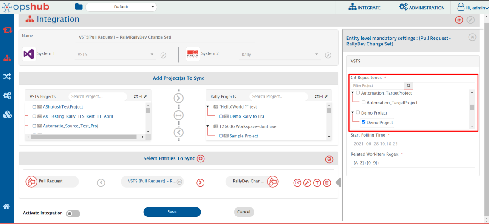
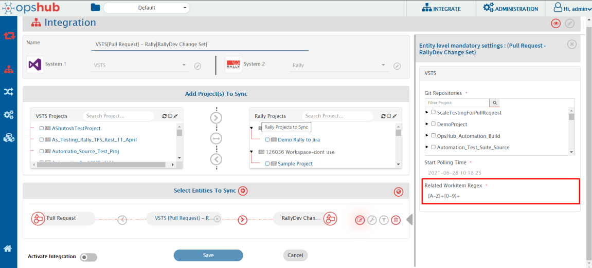

# Pull Request

* The Pull Request will get synchronized based on the current state (Non-revision based).
* Pull Request will have source and target branch. Details of the source and target branches can be synchronized to the target using following fields - Branch Name, Url, ObjectId, Creator for source and target branch respectively.
* Criteria configuration with [Storage type 'In End System'](../../integrate/criteria-information-storage.md) is not supported.
* Comments operations like add/update will synchronize to the target with the change in any other field of the Pull Request.
* In Pull Request comments are of two types : 1) system 2) text, by default both the type of comments will synchronize to the target. But we do have an option to select any specific type from the comments mapping.
* The first default comment, i.e., **`<user>` created the pull request** won't sync to the target because they are not available through AzureDevOps/TFS APIs.
* For Reviewers, Pull Request will have two fields **Required Reviewers** and **Optional Reviewers**. In AzureDevOps both the fields are visible but in TFS On-Premise only one field is visible i.e., **Reviewers**. To synchronize **Reviewers** field of TFS On-Premise map the field **Optional Reviewers** with the required target system field.
* Inline images/documents and user mentions are not supported in Description and Comments.
* Description and Comments' content will be synchronized as Markdown text to the target because AzureDevOps/TFS APIs provide only Markdown format content.
  **For example -** Let say Description field's content in the Pull Request is bold, then AzureDevOps/TFS provides this bold content in the format `**<content>**` because bold is being represented in this way in Markdown text. So, if we synchronize the Description then `**<content>**` will be synchronized to the target.

## Git Repositories Selection

To synchronize Pull Request, you need to select the repositories of the respective projects selected for the synchronization as shown in the screenshot:

<div align="center"></div>

## Configuring Related Workitem Regex

User can provide the target entity Ids in the Pull Request fields like Title/Description against which the entity will sync to the target. To extract the target entity Ids **Regex** is required in the input **Related Workitem Regex** while configuring integration (as shown in the screenshot below). By default, "-1" will be passed if there is no match in the Title/Description.

**For example**, for Pull Request, if its title is "PR against TEST-123" and the target related work item id on which you want to synchronize Pull Request is TEST-123, then Regex for your input will be:

```
[A-Za-z]+-\d+
```

<div align="center"></div>
