# Prerequisites

## Recovery Handling

* OpsHub Integration Manager requires a custom field of text type in Aha! system for recovery purpose.
* Field with the internal name **oh _last _update** needs to be created for the entity type which is configured in OpsHub Integration Manager for the sync purpose and for the entity type which is configured in the default link configuration.
* Refer [Add Custom Fields section](aha.md#add-custom-fields) in appendix for details on how to create custom fields.

## User privileges

* Create one user in Aha! that is dedicated for OpsHub Integration Manager. This user shouldn't perform any other action from Aha!'s user interface. This user is referred as 'Integration User' in the document.
  * Please refer to [Add User](aha.md#add-user) section to create a user in Aha!.
* To synchronize entities to and from any systems to Aha!, Integration User must have **Contributor** permission at project level and **Customizations** role  [which needs be selected from project's Administrator roles]. Refer to [Grant permissions to Aha! user](aha.md#grant-permissions-to-aha-user) section for step-wise details on how to grant permissions to a Aha! user.

# System Configuration

* As you kickstart with the integration, you must first configure Aha! system in OpsHub Integration Manager.
* Click [System Configuration](../integrate/system-configuration.md) to learn the step-by-step process to configure a system.

Refer to the following screenshot for reference:

<div align="center">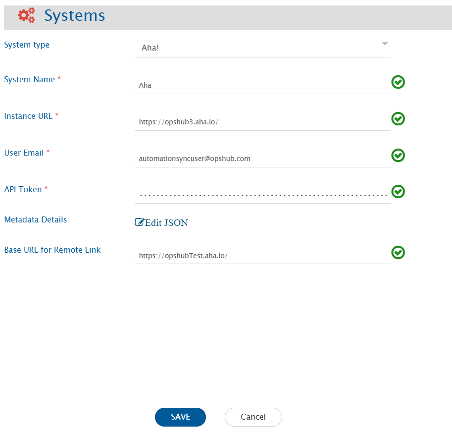</div>

**Aha! System form details** 


| **Field Name**               | **Description**                                                                                                                                                                                                                                                                                                                                                                                                                       |
| ---------------------------- | ------------------------------------------------------------------------------------------------------------------------------------------------------------------------------------------------------------------------------------------------------------------------------------------------------------------------------------------------------------------------------------------------------------------------------------- |
| **System Name**              | Provide the system's name                                                                                                                                                                                                                                                                                                                                                                                                             |
| **Instance URL**             | Provide Instance URL of the Aha! instance. This URL will be used for communicating to Aha! API. The format of the URL is: https:// <company _name>.aha.io Example: https://opshub-inc.aha.io                                                                                                                                                                                                                                          |
| **User Email**               | Provide the email Id of a dedicated user who will be used for communicating with Aha! API. This user should have the required privileges to use the Aha! API. For more details on the required privileges, please refer to [User privileges](aha.md#user-privileges) section.                                                                                                                                                         |
| **API Token**                | Provide the bearer API Token generated in Aha! for the user given in "User Email" field. Please refer to [Steps for generating the API token](aha.md#steps-for-generating-the-api-token) section for generating the API token.                                                                                                                                                                                                        |
| **Metadata Details**         | This data is pre-populated in JSON format based on our knowledge of system metadata (entity type, field names, lookup...). The user can edit entity types based on his/her Aha! instance details for system metadata. For the format and guidance related to filling these details in JSON form, please refer to [Understanding JSON Input](aha.md#understanding-json-input) section.                                                 |
| **Base URL for Remote Link** | Provide different Instance URL of the Aha! instance. This URL is used for generating the Remote Link. E.g., if the Instance URL is https://opshubTest33.aha.io/ or any API node URL, but Remote Link needs to be generated with a different Instance URL such as https://opshubTest.aha.io/. **Note** : If "Base URL for Remote Link" is empty, it will use Instance/Server URL to generate Remote Link if configured on Integration. |

**Understanding JSON Input**

* The entity metadata details can be provided at the time of system configuration in the field 'Metadata details'  [in the form of JSON] in the below mentioned use case:
  * Use case: In Aha!, the entity display name can be changed. Hence, if this is the case at your end, then changes are needed to be performed in the entity display name of JSON input. Below is the example of the JSON input:

```json
{
  "entities": [
    {
      "internalName": "capabilities",
      "displayName": "Capability"
    },
    {
      "internalName": "features",
      "displayName": "Feature"
    },
    {
      "internalName": "requirements",
      "displayName": "Requirement"
    },
    {
      "internalName": "pages",
      "displayName": "Note"
    },
    {
      "internalName": "releases",
      "displayName": "Release"
    },
    {
      "internalName": "tasks",
      "displayName": "To-do"
    },
    {
      "internalName": "initiatives",
      "displayName": "Initiative"
    }
  ]
}
```

# Mapping Configuration

Map the fields between Aha! and the other system to be integrated to ensure that the data between both the systems synchronize correctly.

<div align="center"></div>

Click [Mapping Configuration](../integrate/mapping-configuration.md) to learn the step-by-step process to configure mapping between the systems.

In Aha!, entity type selection in mapping configuration depends on the project/product selection. For more details, please refer to [Project Selection](aha.md#project-selection) section.

> **Note**: In OpsHub Integration Manager, for the sync of Parking lots, the Release entity needs to be seleted at mapping level {as Parking lots are considered as Release by OpsHub Integration Manager}.

## Comments Configuration

* Aha! as source system:
  * If comments are mapped in Mapping Configuration, then all the comments will be synchronized to target system. Additionally, the attachments & inline images from the comment will sync to the target system based on its attachment behaviour. For example, if the target conatins the comment with attachment functionality, then attachment will sync to attachment section and the reference to that attachment will be added inside the comment.
* Aha! as target system:
  * If comments are mapped in Mapping Configuration, then comments will be synced to Aha! system. Here, the inline images and attachments will be synced to Aha! description field and reference to those attachements will be added in the comment.

## Attachments Configuration

* Each Rich Text type field supports attchements in Aha!.
* Aha! as source system:
  * Attachments from all rich text and attachment type fields will sync to the target system.
* Aha! as target system:
  * Attachment mapping can be configured to decide the field of Aha! to which the attachment needs to be synced.
    * If only attachment mapping toggle is enabled but the attachment type mapping is not configured, then attachment will sync to description field of Aha! as a part of default attachment behavior sync.

<div align="center">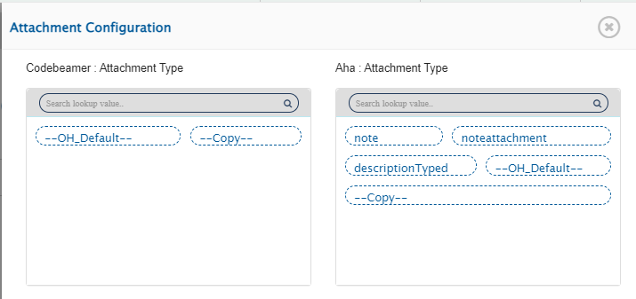</div>

## Relationship Configuration

In Aha!, Record links and Reference fields will be supported as relationships.

### Mandatory Links

* For Feature and Epic type of entities, the Release is a mandatory relationship linkage as feature and epic can only be created inside the release/parking lot.
* For Requirement type of entities, Feature is a mandatory relationship linkage as requirements can only be created inside the feature.
* For To-do type of entities, the Parent is a mandatory relationship linkage as we support the creation of a to-do entity inside the other entity only. Here, the parent entity can be any other entity.

## Reference Fields

* Reference fields are the fields that refer to some other Aha! entity we support.
* Reference fields [System/Custom fields] will be synchronized through relationships. For references, the names of the Reference fields will be shown in link type mapping of the Relationship Configuration, as shown in the screenshot below:

<div align="center">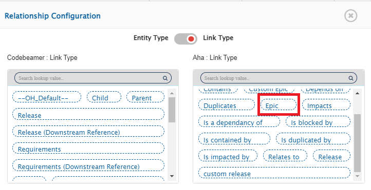</div>

# Integration Configuration

Set a time to synchronize data between Aha! and the other system to be integrated. Also, define parameters and conditions (if any) for integration. Refer to [Integration Configuration](../integrate/integration-configuration.md) to learn the step-by-step process to configure the integration between two systems. Refer to the screenshot given below:

<div align="center">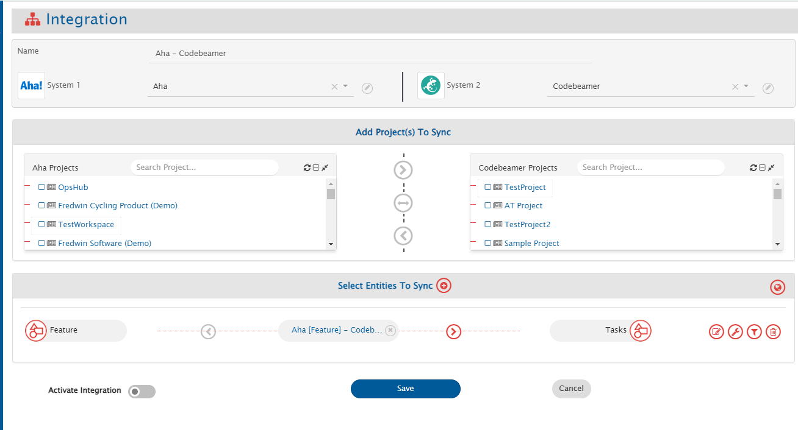</div>

In Aha!, the entity type selection in integration configuration depends on the project selection. For more details, please refer to [Project Selection](aha.md#project-selection) section.

## Criteria Configuration

If the user wants to specify conditions for synchronizing an entity from Aha! as source system to the other system, the criteria must be configured. Navigate to Criteria Configuration section on [Integration Configuration](../integrate/integration-configuration.md) page to learn in detail about Criteria Configuration. 
Set the **Query** as per Aha! encoded query format. Criteria is only applicable to given four fields. Given below are the sample snippets of how the Aha! queries can be used as criteria query in OpsHub Integration Manager:

**Criteria samples:**

| **Field Type**           | **Criteria Description**                                             | **Criteria snippet**                                                                      |
| ------------------------ | -------------------------------------------------------------------- | ----------------------------------------------------------------------------------------- |
| `q`                      | Synchronize all entities named as 'test feature'                     | q=test%20feature                                                                          |
| `updated_since`          | Synchronize all entities updated after 10 March 2021                 | <p>updated_since=2021-03-10T00%3A00%3A00.000Z<br>Format: yyyy-MM-dd'T'HH:mm:ss.SSS'Z'</p> |
| `tag`                    | Synchronize all entities associated with the tag 'need review'       | tag=need%20review                                                                         |
| `assigned_to_user`       | Synchronize all entities assigned to user 'ABC'                      | <p>assigned_to_user=7163902316942030700<br>or<br>assigned_to_user=email%40opshub.com</p>  |
| `updated_since` + `name` | Synchronize entities named 'test r &d' and updated after 10 Mar 2021 | updated _since=2021-03-10T00%3A00%3A00.000Z &q=test%20r%26d                               |

## Target LookUp Configuration

* Provide Query in Target Search Query field such that it is possible to search the entity in the Aha! as the target system. In the target search query field, the user can provide a placeholder for the source system's field value in the '@'
* Go to **Search in Target Before Sync** section on [Integration Configuration](../integrate/integration-configuration.md) page to learn in detail about how to configure Target LookUp.
* Overall, Target LookUp Query is similar to [Criteria Configuration](aha.md#criteria-configuration), except that the value part contains a field name with '@' instead of static value.

**Target LookUp query samples:**

| **Field Type** | **Target lookup usecase**                                       | **Snippet**              |
| -------------- | --------------------------------------------------------------- | ------------------------ |
| `q`            | Target lookup on entity having source entity's id in name field | q='@source _system _id@' |

# Known Behaviour

* From Aha! UI, issue type can be changed for entity. Currently, such conversions will create a new entity in the target and the previous one will be orphaned.
* From Aha! UI, the entity can be deleted. However, for Aha! as the source system, the deleted entity will not sync by OpsHub Integration Manager. The corresponding target entity will remain orphan in target system on Aha! entity deletion. Also, Aha! entity deletion is not supported by OpsHub Integration Manager, when Aha! is the target system.
* To update the "Progress" field through synchronization, the progress source must be set to "manual" (from Aha! UI or field mapping of OpsHub Integration Manager) due to Aha! API behavior.
* Goals and Initiative System fields will be available as lookup fields in the field mapping, even though they are not available in Aha! Develop UI.
  * **The above fields are available in Aha! Develop UI when the Aha! Develop instance is combined with Aha! Roadmap.**
* Hierarchy sync is not supported. Hence, the synchronization of ranking the requirements and to-dos will not be supported.

## Project Selection

* For Aha! system, users can organize their data at different types of workspaces, i.e., Project, Products or Teams. Different entities can reside in different workspaces, for e.g., the Feature can belong to the Product while Activity can belong to the Project.

## API Rate Limitation in Aha!

* Aha! has limitation on API access per minute for a single user. Due to this, OpsHub Integration Manager can access Aha! API within a limit. When the limit exceeds, the Aha! API stops responding for certain amount of time, and no API calls can be done by OpsHub Integration Manager during that time until Aha! resets the limit for that user.
  * **Up to 300 requests per minute and 20 requets per second are allowed in Aha!.**
* To address this issue, wait time (given by Aha! API) will be considered for entity synchronization. Thus, there might be some delay in synchronization in case of API rate limit issue.

# Known Limitations

* Below Custom fields are not supported by OpsHub Integration Manager:
  * Score card field
  * Table field
  * Worksheet field
* Limitations due to the lack of Aha! API:
  * Entities will be synced without history.
  * Metadata is not available for the system fields. So, we are providing static metadata in the system itself. Here, the user can change the display name of the entity. User can provide the entity name using the JSON input, and if any user doesn't provide any JSON input, an inbuild entity display name will be considered.
  * In Aha! Develop instance, for **Epic & Feature** type of entities, **Workspace** field is not available for synchronization.
  * In Aha! Develop instance, for **Requirement** type of entity, **Initial estimate, Detailed estimate & Actual effort** fields will not be synced.
  * Score field is not supported as it is a complex field and it can be calculated according to different equations.
  * State transition is not supported as API doesn't give the infomation about state transitions.
  * Attachment field: If Aha! is the target system and the attachment mapping is configured to use field-type attachments, at least one attachment should be present in the corresponding field.
* For Aha! as the target system, the fields below will not unset via OpsHub Integration Manager due to Aha!'s API limitation: **Effort, Value, Duration Source, Progress Source, Status, Type, Complete by date (internal), Round date to, Complete by date (external), Presented, and Description.**
* For Comment synchronization, when you add inline image/attachment to comment, the user needs to update one field  [System/Custom field] or needs to add normal text comment to sync the comment with inline image/attachment. **Reason: In Aha!, entity modified time does not get updated with inline image/attachment addition in comment.**
* **To-dos** present at user level will not synced by OpsHub Integration Manager. **To-dos** present in other entities can only be synchronized.

## Troubleshooting Guide

If you are getting an **Internal Server Error** with **Status Code: 500**, then you should retry the failures. There is a limitation of the Aha! API that if we perform updates on entities from same project at the same time, deadlocks occur in their database. It can cause the above-mentioned error.

# Appendix

## Add User

1. Login to Aha! using the user with privileges to create a new user.
2. Navigate to Settings given at the top right corner and go to Account section.

<div align="center">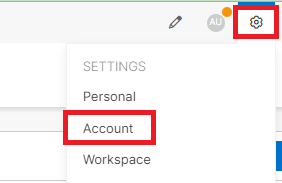</div>

3 . Navigate to Users

<div align="center">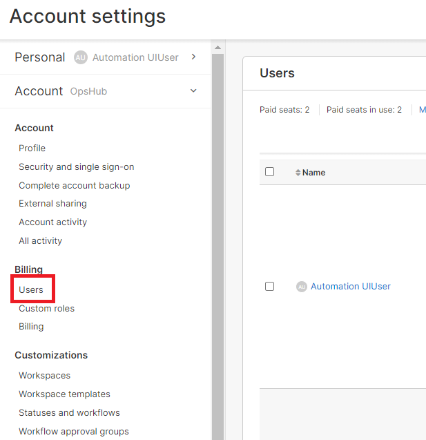</div>

4 . Click on the Add User button given at the top right corner of the users' list.

<div align="center">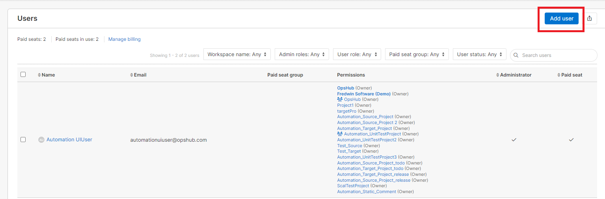</div>

5 . Fill the details regarding the user. For the Administration Role and Permissions for different workspaces, select the roles having permissions mentioned in  [User privileges] (#user-privileges) section.

<div align="center">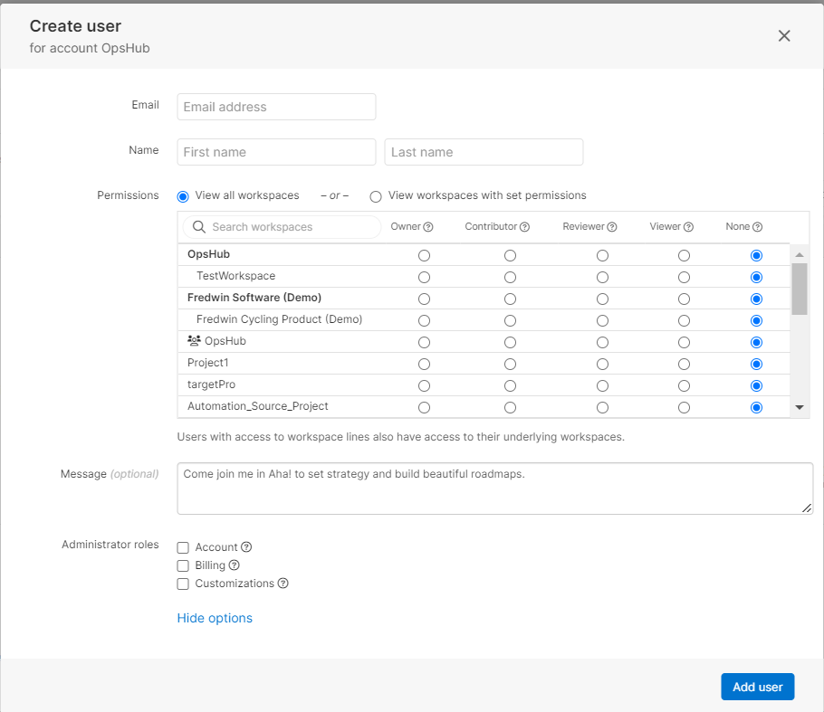</div>

6 . Save changes

## Grant permissions to Aha! user

1. Login to Aha! using the user with privileges to grant permissions to any user.
2. Navigate to Settings and go to **Account->Users** section.
3. Navigate to **Users** and select the user for which you want to change the permissions.

<div align="center">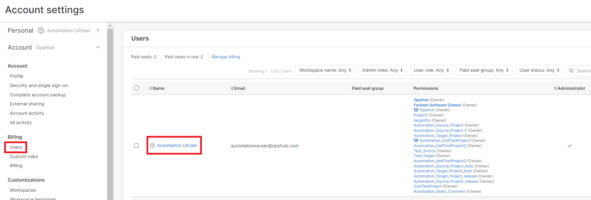</div>

4 . Select Administrator roles and Permissions for different workspaces you want to give to integration user.

<div align="center">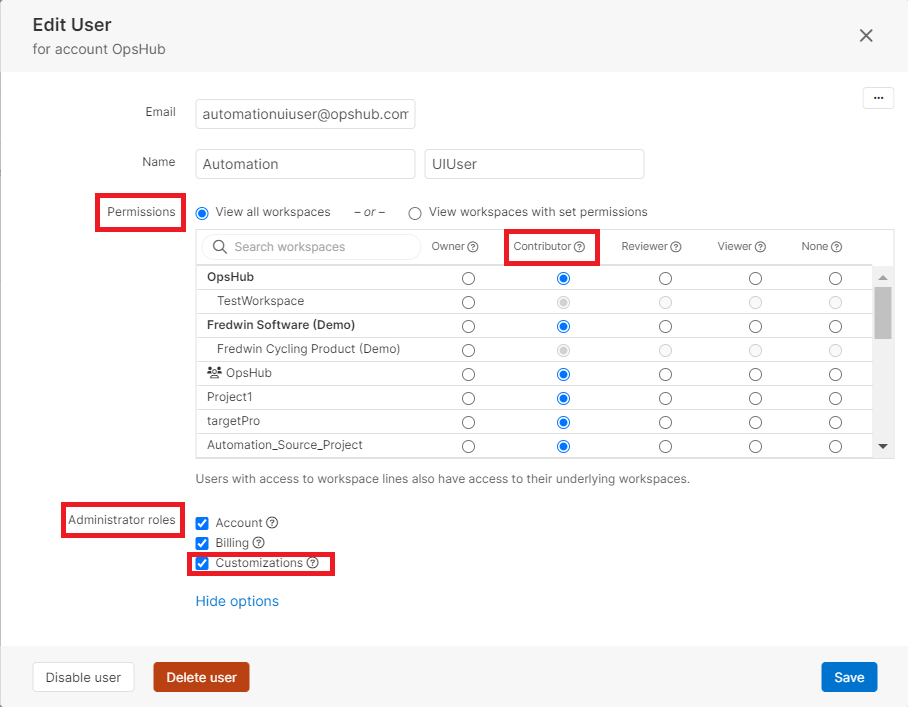</div>

5 . Save changes

## Add Custom Fields

1. Navigate to Settings given at the top right corner and go to Personal section.

<div align="center">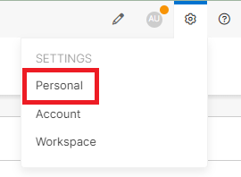</div>

2 . Navigate to Custom fields section.

<div align="center">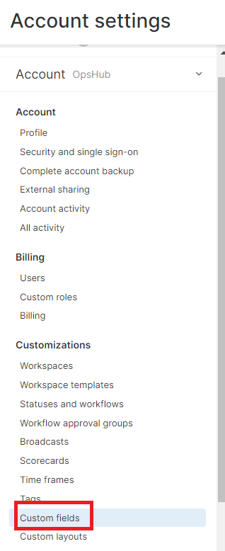</div>

3 . Select the entity for which you want to create the custom field, and click Add custom field.

<div align="center">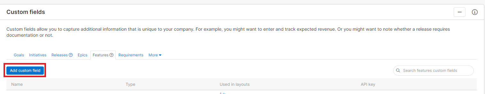</div>

4 . Choose custom field type from the list and click Next.

<div align="center">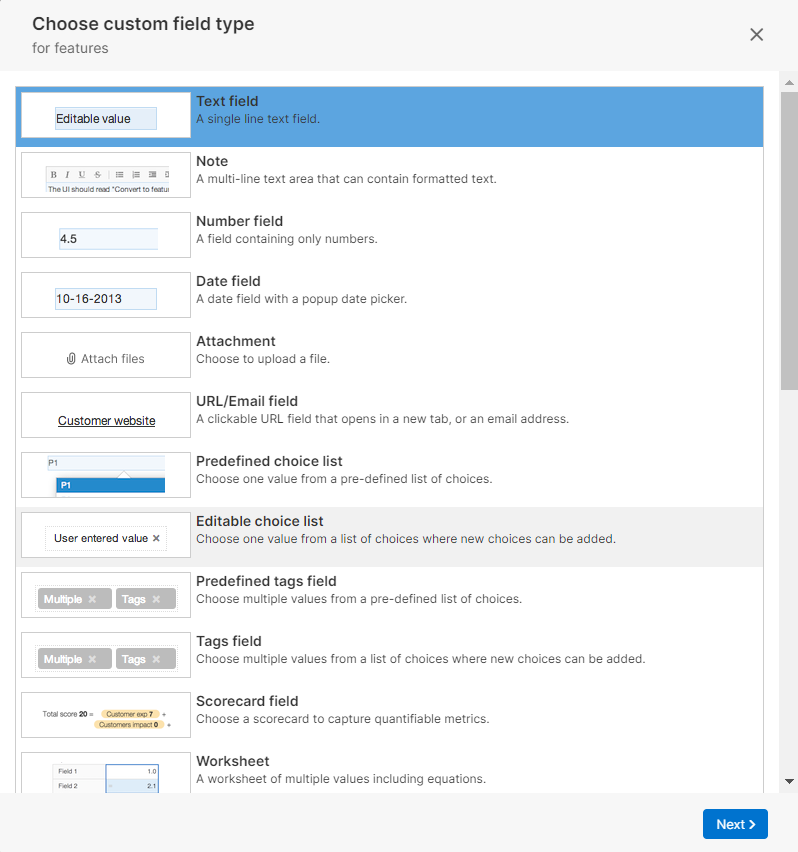</div>

5 . Fill the details for creating the selected custom field.

<div align="center">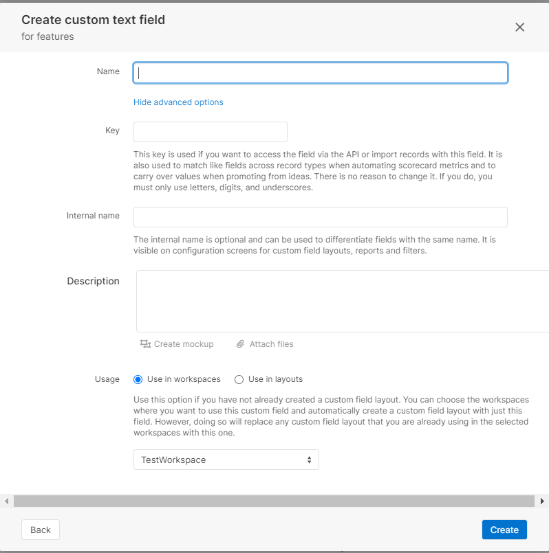</div>

## Add Custom Layout

1. Navigate to Settings given at the top right corner and go to Personal section.

<div align="center"></div>

2 . Navigate to Custom layouts section.

<div align="center">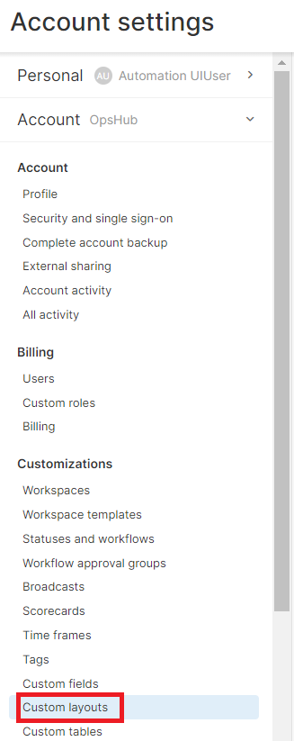</div>

3 . Select the entity for which you want to create the custom layout, and click Add custom layout.

<div align="center">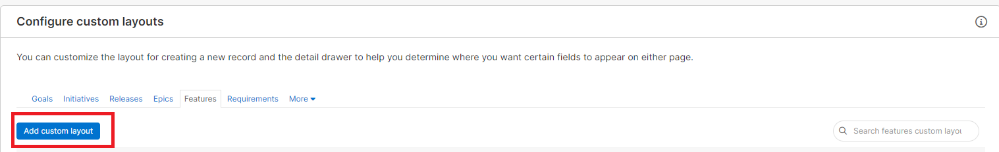</div>

4 . You can choose to create a new custom field or select from the existing custom field from the list.

<div align="center">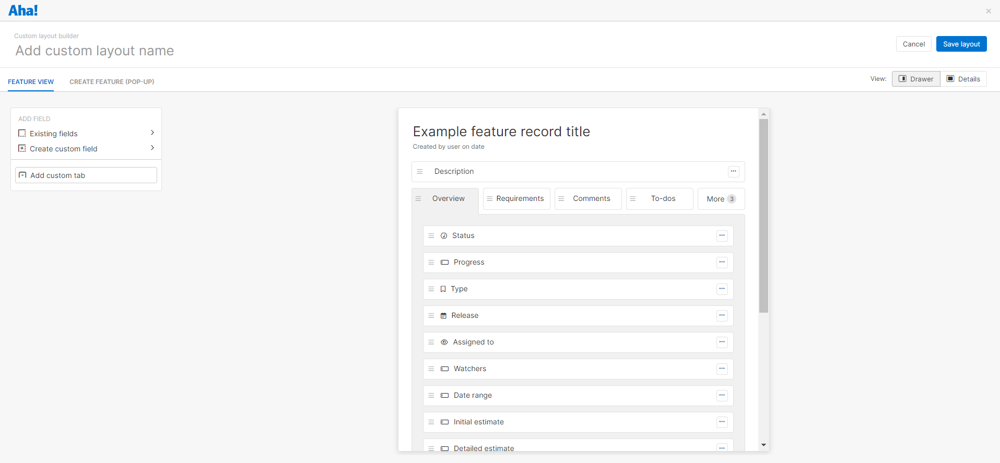</div>

5 . If you choose to use an existing custom field, you can drag and drop it to the fields list given on the right side.

<div align="center">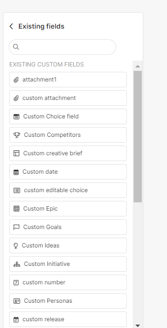</div>

6 . If you choose to create a custom field, you can drag and drop it to the fields list given on the right side. Fill the details for creating the custom fields.

<div align="center">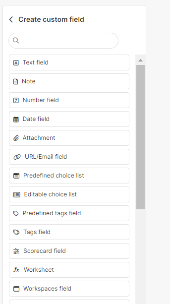</div>

7 . Give the name to the layout and save it.

## Steps for generating the API token

1. Navigate to Settings given at the top right corner and go to Personal section.

<div align="center"></div>

2 . Navigate to the Developer section.

<div align="center">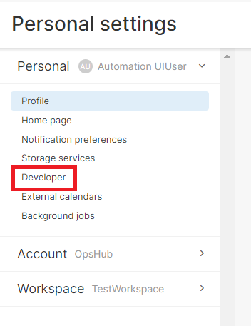</div>

3 . In the API keys section, click Generate API key.

<div align="center">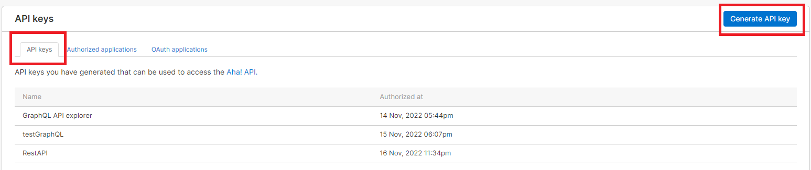</div>

4 . Give name to the key and click on Generate API key.

<div align="center">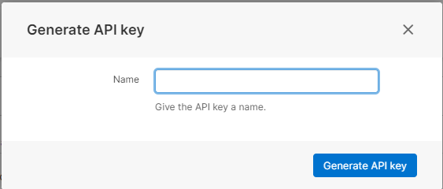</div>

5 . Copy the generated API key and save it for future reference.
