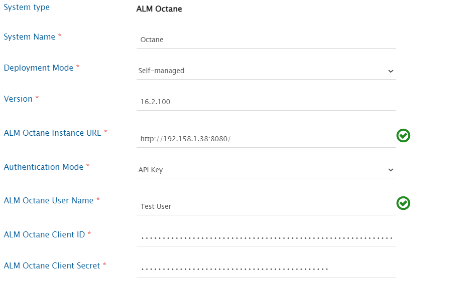
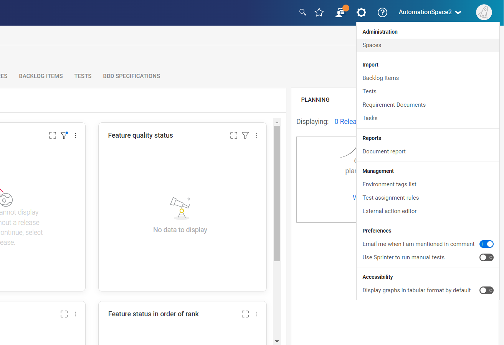
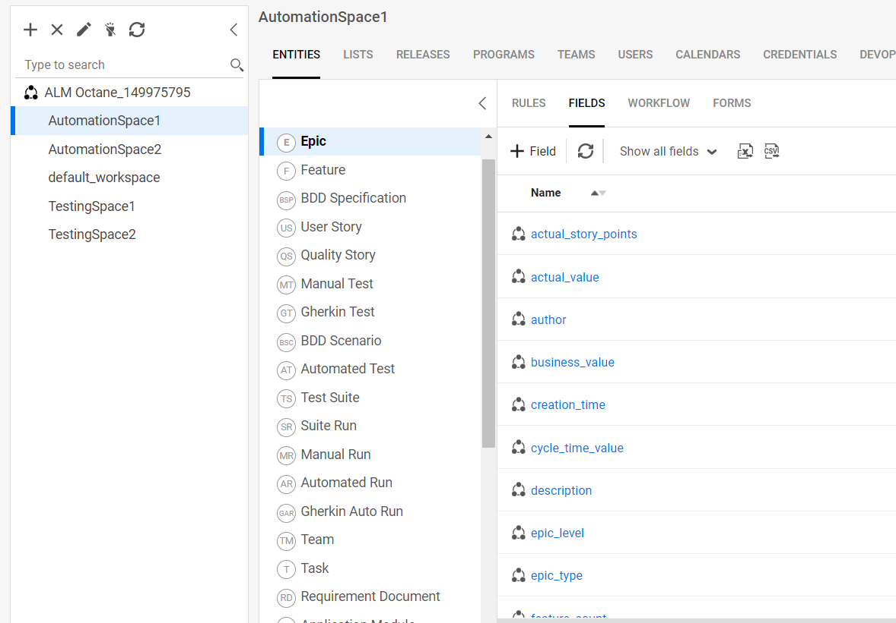
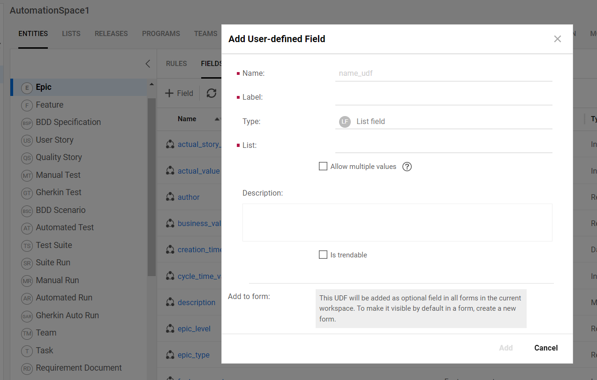
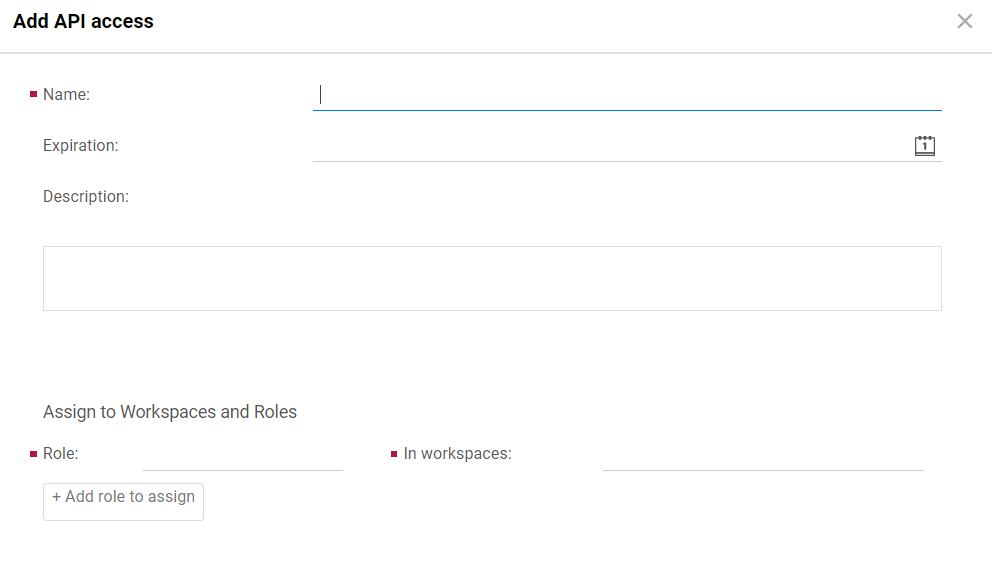

# Prerequisites

## Required custom field
User must create one special field to be configured in all target ALM Octane workspace(s) for each workitem type. This field is required to ensure system recovery in case of failure or abrupt exit from the integration.

| Field Name         | Field Type |
|--------------------|------------|
| oh_last_update_udf | String     |

For adding a custom field in any entity in ALM Octane, please follow the link: [Custom Fields Creation](#create-custom-fields).

## User Privileges
* Create one ALM Octane user for workspace(s) that is a part of synchronization. User should be dedicated to OpsHub Integration Manager and should not be used to do any other operations from the system's user interface.
* Given below are the set of required permissions/roles for synchronizing entities in ALM Octane. Integration user used for system configurations should be assigned, at least, with the following roles for successful and correct synchronization of data:
  * **Leader role**: For reading/writing standard work items such as Defect, Story, Quality Story, Requirement Folders, Requirement Documents, Feature, Epic, Test Manual, Gherkin Test, Test Suite, Run Manual, etc.
  * **Workspace Admin role**: For reading/writing Meta entities that includes Release, Sprint, Team, Milestone

# System Configuration

* A system can be configured using either Basic or API Key authentication for both on-prem and SaaS (on-demand) environments.
  * Click [System Configuration](../integrate/system-configuration.md) to learn the step-by-step process to configure a system. Refer the screenshot given below for reference.

  

| **Field Name**              | **When field is visible on the System form**         | **Description** |
|----------------------------|------------------------------------------------------|------------------|
| **System Name**            | Always                                               | Provide system name. |
| **Deployment Mode**        | Always                                               | Select Deployment Type as per the deployed instance. For on-premises instance, select **Self-Managed**. For SaaS (on-demand) instance, select **Cloud** from the dropdown list. |
| **Version**                | Only for On-Premise                                  | Provide versions like 16.1.100, 16.2.100 |
| **ALM Octane Instance URL**| Always                                               | * Format when On-Premise instance: `http://[OctaneServerHost]:[OctaneServerPort]`    * Format when On-Demand instance: `https://[nameOfYourOctaneInstance].saas.microfocus.com` |
| **Authentication Mode**    | Two types of authentications supported for both 'Self-managed' and 'SaaS (on-demand)' | * **For configuring a system using Basic Authentication**      - User needs to provide a username and password.      - Before accessing Basic Authentication, the user must complete some prerequisites in end system. For steps, refer to [Steps to activating Basic Authentication in ALM Octane](#steps-to-activating-basic-authentication-in-alm-octane).      > **Note** : Cross-space access is available only through basic authentication.    * **For configuring a system using API Key**      - To configure the Client ID and Client Secret in ALM Octane, navigate to [Create Client ID and Client Secret](#create-client-id-and-client-secret). |
| **ALM Octane User Name**   | For all authentication modes.                        | Provide the username.   **Note** : For SaaS (on-demand) basic authentication, provide email ID as the username. |
| **User Password**          | Only when Basic Authentication is selected.          | Provide ALM Octane user password. |
| **ALM Octane Client ID**   | Only when 'API Key' authentication is selected.      | Provide the Client ID. |
| **ALM Octane Client Secret**| Only when 'API Key' authentication is selected.     | Provide the Client Secret. |

* If the system is deployed on HTTPS and a self-signed certificate is used, then you will have to import the SSL Certificate to be able to access the system from OpsHub Integration Manager. Click [Import SSL Certificates](../getting-started/ssl-certificate-configuration.md) to learn how to import SSL certificate.

# Mapping Configuration

Map the fields between ALM Octane and the other system to be integrated to ensure that the data between both the systems synchronizes correctly.  
Click [Mapping Configuration](../integrate/mapping-configuration.md) to learn the step-by-step process to configure mapping between the systems.

# Integration Configuration

Set a time to synchronize data between ALM Octane and the other system to be integrated. Also, define parameters and conditions, if any, for integration.  
Click [Integration Configuration](../integrate/integration-configuration.md) to learn the step-by-step process to configure integration between two systems.

# Criteria Configuration

Criteria-based polling is supported on all system and custom fields for ALM Octane.  
Provide queries in a format that is acceptable by ALM Octane API.  

For example:
* `release EQ {name EQ ^release1^}`
* `Severity EQ 'High'`

Query 1 will synchronize entities that have value `release1` under Release field and query 2 will synchronize entities that have value `High` for Severity field.  
For more details on query-able fields and values, refer the REST API documentation of ALM Octane from the link given below.  
https://admhelp.microfocus.com/octane/en/16.1.100-16.1.200/Online/Content/API/query_Clause.htm  

>  This URL is for ALM Octane version 16.2.100.33.

# Known Behaviors and Limitations

* ALM Octane does not support creation of requirement documents and requirement folders at the same hierarchy level. Therefore, every requirement document will be created in ALM Octane in a default requirement folder named REQUIREMENTS_CONTAINER maintaining the parent hierarchy above.
* ALM Octane supports a hierarchy depth of only 3 levels. Application module is checked, created, and separated based on `\` separator. If an entity with a hierarchy greater than 3 levels is coming from the source system, due to the imposed limitation of ALM Octane, the entity will be created at the 3rd hierarchy level.
* No testrun-link-to-defect support at Run Manual steps level (Run Manual entity level support exists for the mentioned items).
* When Octane is the target system, the link between **Run Manual** and **Run Suite** will not be synced.  
  * **Reason:** The required API is not available.
* The **Script** field of a Gherkin Test entity will be synced as **plain text only**.  
  > **Note** : Formatting in the **Script** field will not be synced due to API limitations.
* To synchronize the **Add Call Step**, a customized workflow is required. Please reach out to the opshub support team for assistance in setting this up.
  * If you are using **OpenText ALM Quality Center** as the source system and **OpenText ALM Octane** as the target system—where **Call to Step** functionality is needed—you can use the pre-bundled default workflow: **Default Integration Workflow – HP Test to Octane Manual Test – Call to Step**.
* Shared Epics cannot be created.  
  **Reason:** API unavailability.

# Appendix

## Create Custom Fields
Follow the steps given below for creating custom fields in any entity in a specific workspace in ALM Octane.  
* Navigate to the ALM Octane homepage. A drop-down menu appears on the top-right corner. Click **Settings Spaces**. It will navigate the user to the settings and configurations page.

  

* Navigate to the workspace navigation pane on the left, click the **required workspace**. Select the entity in which new custom field is to be added.

  

* In the sections displayed at center of the page, go to **Field** section.
* Click **Add New Field** icon. The **Add User-defined Field** pop-up will appear. Add the required details such as name, label, and sub-type of the custom field. Select the display forms in which the user wants to enable the visibility of the new custom field to be added.
* Click OK and the new custom-field is added into the selected entity and selected workspace.

  

## Steps to activating Basic Authentication in ALM Octane
The value of the **SUPPORTS_BASIC_AUTHENTICATION** parameter must be set to **true** to enable Basic Authentication.  
There are two ways to change this parameter: **site level** and **space level**.

*Using **site level***:
* Log in as a site administrator
* Navigate **Settings > Site > Parameters**
* Now select **Scope**:
  * To activate basic authentication for all available spaces, select **Site**
  * To activate basic authentication for a specific space, select the corresponding **space** name
* After selecting **Scope**, try to find a parameter with ID **SUPPORTS_BASIC_AUTHENTICATION**
* Edit the value field and set the value to **true** and click **Save**

*Using **space level***:
* Log in as a space administrator
* Navigate **Settings > Spaces > Parameters**
* Try to find a parameter with ID **SUPPORTS_BASIC_AUTHENTICATION**
* Edit the value field and set the value to **true** and click **Save**

## Create Client ID and Client Secret
* Navigate to the ALM Octane homepage. A dropdown menu will appear on clicking settings icon.
* Select spaces in settings and navigate to the left panel.
* Navigate to your ALM Octane Shared Workspace and navigate to the API ACCESS tab.
* Credentials for Access key can also be used if they are already known.

  

* If no such access key has been generated, a new API ACCESS key can be generated with the below steps:
  * On selecting **add new API access**, the following form will pop up on your screen.
  * Enter the details for name and the roles to be assigned to the API access key. Refer to [User Privileges](#user-privileges) to learn more about the types of roles to assign.
  * Store the Client Id and secret for using it during system configuration.  
  > **Note** : Expiration date can be set. In such cases, API access key will have to be generated again after the date of expiration.

  

