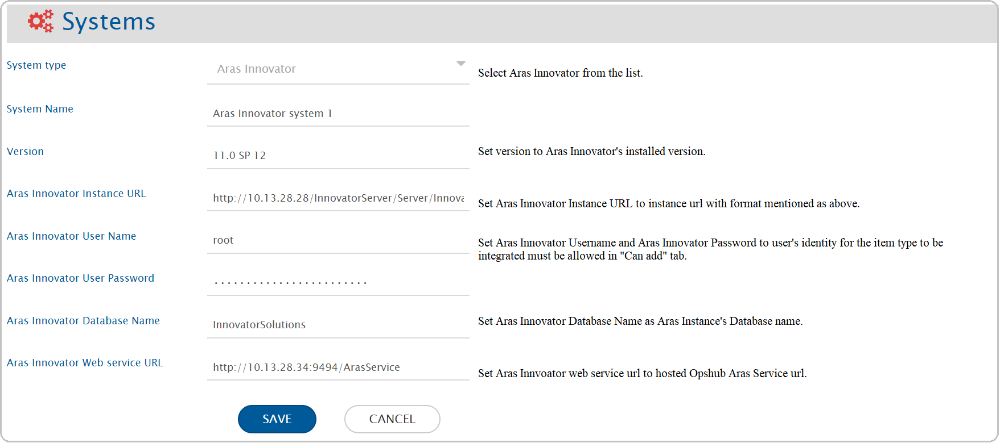
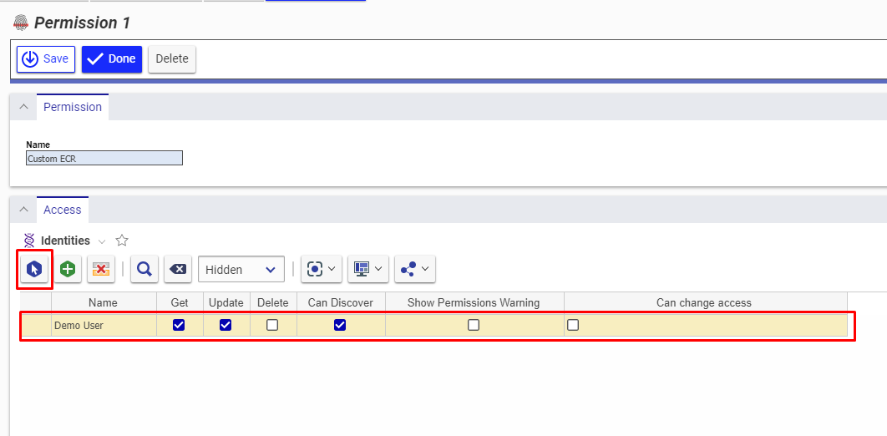
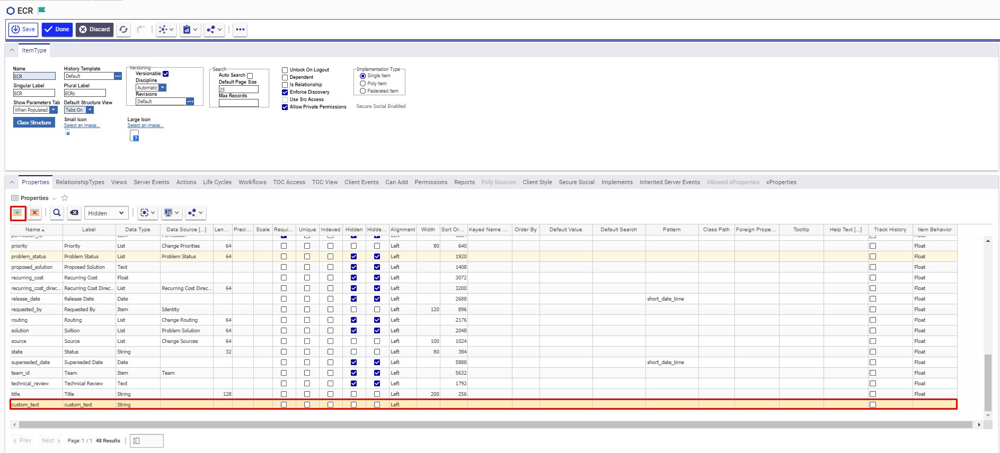
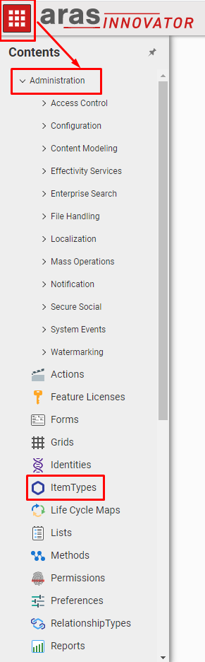

# Prerequisites

## User Privileges

* Create a user in Aras Innovator that is dedicated for <code class="expression">space.vars.SITENAME</code>. The user shouldn't perform any other action from Aras Innovator user interface. Refer to [Add User in Aras Innovator](aras.md#add-users) section to learn how to add a new user in Aras Innovator.
* The user identity of the user dedicated for <code class="expression">space.vars.SITENAME</code> must have the following permissions for the 'item type' to be integrated:

| **Permission Types**        | **Justification**                                                                                                                                                                          | **Needed When**                                                                                                                                                                                                                                                                                                                                                             | **How To**                                                                                                                                                                                                                   |
| --------------------------- | ------------------------------------------------------------------------------------------------------------------------------------------------------------------------------------------ | --------------------------------------------------------------------------------------------------------------------------------------------------------------------------------------------------------------------------------------------------------------------------------------------------------------------------------------------------------------------------- | ---------------------------------------------------------------------------------------------------------------------------------------------------------------------------------------------------------------------------- |
| Get                         | To get values of each field for particular item of 'item type' to be integrated                                                                                                            | Aras Innovator is source system,target system or both.                                                                                                                                                                                                                                                                                                                      | To learn how to provide user with the Get permission, refer to [Give Necessary Permissions to User for Itemtype](aras.md#give-necessary-permissions-to-user-for-itemtype) section.                                           |
| Can Discover                | To get the list of items present for a given itemtype.                                                                                                                                     | Aras Innovator is source system,target system or both.                                                                                                                                                                                                                                                                                                                      | To learn how to provide user with the Can Discover permission, refer to [Give Necessary Permissions to User for Itemtype](aras.md#give-necessary-permissions-to-user-for-itemtype) section.                                  |
| Update                      | To update an item.                                                                                                                                                                         | Aras Innovator is target system. Also,when Aras Innovator is source system and Update Permission is required for Remote Id or Remote Link configuration in Integration .Please check '''Tracking Id and Link of Entities Across Systems''' section on [Integration Configuration](../integrate/integration-configuration.md) page to learn about Remote Id and Remote Link. | To learn how to provide user with the Update permission, refer to [Give Necessary Permissions to User for Itemtype](aras.md#give-necessary-permissions-to-user-for-itemtype) section.                                        |
| Can Add                     | To create an item: The user is allowed to create record from the Aras Innovator System (through the UI and API both) only when the user's identity is allowed in the "Can Add" tab         | Aras Innovator is target system.                                                                                                                                                                                                                                                                                                                                            | To learn how to assign "Can Add" permission to user's identity on particular itemtype, refer to [Allow Can Add permission to User](aras.md#assign-identity-on-item-type) section.                                            |
| Life Cycle State Transition | To update the state during transition, the role in Life Cycle transition needs to be set as '''Administrators''' for the Integration User \[configured in the <code class="expression">space.vars.SITENAME</code>]. | When Aras is the target system.                                                                                                                                                                                                                                                                                                                                             | To learn how to provide user with the Lifecycle State Transition permission, refer to [Assign Life Cycle Transition Permission for Item Type](aras.md#assign-life-cycle-state-transition-permissions-for-item-type) section. |

## Versionable Item Type 

* For any Item Type in Aras Innovator, the versions/history for the item gets generated only when the item is versionable. Hence for <code class="expression">space.vars.SITENAME</code> to synchronize the items with their revisions, they need to be versionable.
* In case they are not versionable, <code class="expression">space.vars.SITENAME</code> will synchronize the item as per the current state of that item, available at the time of synchronization. Follow [Make Item Type Versionable](aras.md#make-item-type-versionable) in the Appendix section to learn how to make item types versionable.

## Hosting Opshub Aras Service 

<code class="expression">space.vars.SITENAME</code> requires this service to communicate with Aras Innovator server. It acts as a communication layer between Aras Innovator and <code class="expression">space.vars.SITENAME</code>.

### System Prerequisites

* Configure <code class="expression">space.vars.SITENAME</code> Aras Service on a machine that has .NET Framework version 4.7.2 or a higher version installed.
* Please refer to the following link for information on software and hardware requirements for installing .NET Framework 4.7.2 :
  https://docs.microsoft.com/en-us/dotnet/framework/get-started/system-requirements

### Installation Steps



# System Configuration

Before the user continues with the integration, he/she must first configure Aras Innovator System. Refer to [System Configuration](../integrate/system-configuration.md) to learn step-by-step process to configure a system. See the screenshot given below for reference:

| **Field Name**                     | **Description**                                                                                                                                                                                                              |
| ---------------------------------- | ---------------------------------------------------------------------------------------------------------------------------------------------------------------------------------------------------------------------------- |
| **System Name**                    | Provide a unique name to the Aras Innovator System.                                                                                                                                                                          |
| **Version**                        | Provide version for Aras Innovator Instance. Check [Get Aras Innovator Version](aras.md#get-aras-innovator-version) in the Appendix section to learn how to get Aras Innovator version.                                      |
| **Aras Innovator Instance URL**    | Provide URL for Aras Innovator Instance. Example: `<hostname>/InnovatorServer/Server/InnovatorServer.aspx`                                                                                                                   |
| **Aras Innovator User Name**       | Provide username of the user dedicated for <code class="expression">space.vars.SITENAME</code>. Please ensure that user has the necessary permissions. Refer to [User privileges](aras.md#user-privileges) for permissions required by user identity. |
| **Aras Innovator User Password**   | Provide password of user dedicated for <code class="expression">space.vars.SITENAME</code> - use plain text if FIPS is disabled, or MD5-hashed if FIPS is enabled. |
| **Aras Innovator Database name**   | Provide Aras Innovator Database name to which the connection needs to be done. Refer to [Get Database Name](aras.md#get-database-name) in the Appendix section to learn how to get Database name.                            |
| **Aras Innovator Web Service URL** | Provide URL for the hosted OpsHubArasService. Refer to [Hosting opshub Aras service](aras.md#hosting-opshub-aras-service) to learn how to host <code class="expression">space.vars.SITENAME</code> Aras Webservice.                                   |

* If the system is deployed on HTTPS and a self-signed certificate is used, then the user should import the SSL Certificate to be able to access the system from <code class="expression">space.vars.SITENAME</code>. Check [Import SSL Certificates](../getting-started/ssl-certificate-configuration.md) to learn how to import SSL certificate.

# Mapping Configuration

Map the fields between Aras Innovator and the other system to be integrated to ensure that the data between both the systems synchronize correctly.
Check [Mapping Configuration](../integrate/mapping-configuration.md) to learn the step-by-step process to configure mapping between the systems.

# Integration Configuration

Set polling time as the time after which the user wants to synchronize data between Aras Innovator and the other system to be integrated. Also, define parameters and conditions, for integration, if any. Check [Integration Configuration](../integrate/integration-configruation.md) to learn the step-by-step process to configure integration between two systems.

## Criteria Configuration 

* If the user wants to specify conditions for synchronizing an entity between Aras Innovator and the other system to be integrated, he/she can use the **Criteria Configuration** feature.
* To configure criteria in Aras Innovator, integration needs to be created with Aras Innovator as the source system. The user can set a query on a particular ItemType.
* Go to Criteria Configuration section on [Integration Configuration](../integrate/integration-configuration.md) page to learn in detail about Criteria Configuration.
* Aras Innovator Query format is **`[ItemType].<field_internal_name>='<value>'`**

**Criteria samples**

| **Field Type**          | **Criteria Description**                                                  | **Criteria snippet**                                                    |
| ----------------------- | ------------------------------------------------------------------------- | ----------------------------------------------------------------------- |
| **Lookup**              | Synchronize all ECR with priority set to 1                                | [ECR].priority = '1'                                                   |
| **Date**                | Synchronize all entities created after certain date                       | [ECR].created_on > '2020-01-31T00:00:00'                              |
| **Text**                | Synchronize all ECR with Title Demo entity                                | [ECR].title = 'Demo entity'                                            |
| **Text** and **Lookup** | Synchronize all ECR with unit EA and Status new                           | [ECR].unit = 'EA' AND [ECR].status = 'New'                            |
| **Lookup** or **Date**  | Synchronize all ECR with priority set to 1 or Effective Date greater than | [ECR].priority = '1' or [ECR].effective_date > '2020-01-31T00:00:00' |

## Target LookUp Configuration 

* Provide Query in Target Search Query field so that it is possible to search the entity in Aras Innovator when it is the target system.
* Go to **Search in Target Before Sync** section on[Integration Configuration](../integrate/integration-configuration.md) page to learn in detail about how to configure Target LookUp.
* Target LookUp configuration is similar to the [Criteria Configuration](aras.md#criteria-configuration) where in the Target Search Query field, the user can provide a placeholder for the source system’s field value in-between ‘@’.
* Target Look Up Query based on internal id of source itemtype:
  **Example query:** `[ECR].custom_text='@oh_internal_id@'`

# Known Behaviors

**Remote ID Synchronization**

* In Aras, custom entity types don't have Item Number (which stores Display Id) field by default. Hence, in such cases, <code class="expression">space.vars.SITENAME</code> will use entity's Internal Id as Remote Id to be synchronized to the other end system.
* To show the 'Display Id' as Remote Id, it is required to add the Item Number field in Aras.
  Refer to [Add Item Number Field](aras.md#set-item-number-for-custom-entity) for more details.

# Known Limitations

* Only English alphabets(A-Z,a-z), numeric digits(0-9) and special characters (Example:- :,<,?,>,],\[,!,@ etc.) are supported for Criteria Configuration.
* Attachment as a field is not supported.
* "No Related" Relationship Type is not supported.
* For Aras Innovator as Target System, if the attachment filename contains Windows special characters (/,,",:,\*,?,<,>), then file will not be added in Aras Innovator. As a result, the user will encounter a processing failure. This is because Aras Innovator does not support Windows special characters in filename.
  Please check [Synchronise file with Windows special characters](../help-center/troubleshooting/errors/aras/oh-aras-1502.md) to find how to synchronise attachment with Windows special characters in filename.

## Limitations to be Resolved in Upcoming Releases of <code class="expression">space.vars.SITENAME</code>

* To synchronise File as Attachment to Itemtype being synchronised, there should be unique relationship type between Itemtype and File.
* Comments with attachments are not supported.
* Synchronisation of Inline image in a Formatted text field is only **supported** for **External Files of Image type**.
  Inline image synchronisation in Formatted text fields is **not supported** for **Aras Innovator's Internal Images**.

# Appendix

## Add Users

1. Login to the Aras Innovator with user having Administrator Privileges (by default root/admin user has Administrator Privileges).
2. Navigate to **Administration → Users → Create New User**. Refer to [Check Administration Tab](aras.md#check-administration-tab) to learn where to find Administration tab.
3. Provide necessary details for fields like Login Name, Password, First Name and so on
4. Check the **Logon Enabled** box so that user can login from the UI

## How to Change the Port of Service

1. Open file explorer and navigate to the service installation folder (Ex: `C:\Program Files\OpsHub\Other_Resources\Resources\OpsHubArasService`).
2. Open the file named `ArasService.exe.config` in any text editor.
3. Search `<baseAddresses>` tag in the file. In `<add baseAddress>` tag, change the `<9494>` with the port on which you want to deploy service. Save the changes. Refer to the image below for reference.

## How to Check Availability for Port 9494 for Aras Service

1. Open the Command Prompt in administrator mode.
2. Type `netstat -ano | findStr "9494"` and press Enter.
3. If the port is being used by any application, it will show the application’s detail. The last column is the PID (process ID).
4. If the port is available, there will be empty output for this command.

## Assign Identity in "Can Add" Tab of Item Type

1. Login to the Aras Innovator with user having administrator privileges.
2. Navigate to **Administration → ItemTypes**. Refer [Check Administration Tab](aras.md#check-administration-tab) to learn where to find Administration tab.
3. Search for the ItemType to which you want to assign an identity.
4. Open the Item Type in the edit mode.
5. Click **Can Add** tab.
6. Click .
7. Select the identity of the user from the pop-up.

## Assign Life Cycle State Transition Permissions for Item Type

1. Login to the Aras Innovator with user having administrator privileges.
2. Navigate to **Administration → ItemTypes**. Refer [Check Administration Tab](aras.md#check-administration-tab) for more details.
3. Search for the ItemType for which the user wants to give permission to user identity.
4. Open the Item Type in the edit mode.
5. Click **Life Cycles** tab.
6. Open the Life Cycle you want to edit.

7. Click on the arrow of transition state you want to edit.

8. Change the role to **Administrators** so that the Integration user is allowed to update the state.
9. Save the changes made in Life Cycle Transition.

## Give Necessary Permissions to User for Itemtype

1. Login to the Aras Innovator with user having Administrator Privileges (by default root/admin user has Administrator Privileges).
2. Navigate to **Administration → ItemTypes**. Refer to[Check Administration Tab](aras.md#check-administration-tab) to learn where to find Administration tab.
3. Search for the ItemType for which the user wants to give permissions to user identity.
4. Open the Item Type in edit mode.
5. Click **Permissions** tab.
6. Click  to select from existing permissions. Refer to [Add Identities to Permissions](aras.md#add-identities-to-permissions) to add new identities.
7. Click  to create new permissions.

### Add Identities to Permissions

1. Double-click the existing permission or click  in the Permission tab of Itemtype.
2. Give a name for the permission (for new only).
3. Click .
4. Select the identity of the user from the pop-up.
5. Tick checkboxes for **Get**, **Update**, and **Can Discover** for the user identity.
6. Click **Done** to apply the permissions.

## Make Item Type Versionable

1. Login to the Aras Innovator with user having Administrator Privileges.
2. Navigate to **Administration → ItemTypes**.
3. Search for the ItemType that you want to make versionable.
4. Open the Item Type in edit mode.
5. Check the **Versionable** checkbox under Versioning.

## Create Custom Entity

1. Login to the Aras Innovator with Administrator Privileges.
2. Navigate to **Administration → ItemTypes → Create New Itemtype**.
3. Fill in all mandatory fields and ensure **Versionable** is enabled.
4. Assign TOC View and TOC Access.

> Refer to [Create custom property](aras.md#create-custom-property) to add properties after creating ItemType.

## Set Item Number for Custom Entity

1. Navigate to **Dashboard**.
2. Open **ItemTypes** page.
3. Select the entity type and open in edit mode.
4. Under **Properties** tab, add a row named `item_number` with **Sequence** data type.
5. Set **Keyed Name Order** to `1` and save it.

## Create Custom Property

1. Login to the Aras Innovator with Administrator Privileges.
2. Navigate to **Administration → ItemTypes**.
3. Search for the ItemType where you want to add the property.
4. Open the Item Type in edit mode.
5. Click **Properties** tab.
6. Click  icon.
7. Assign Name, Data Type, Data Source and other required fields.

## Get Database Name

1. Open Aras Innovator's client login page.
2. The available database name is shown on the page.

## Get Aras Innovator Version

1. Open Aras Innovator's client login page.
2. The version of the instance is shown on the page.

## Check Administration Tab

1. After login, click the **TOC** button at the top left of the screen.
2. Expand the **Administration** tab to find ItemTypes, Users, Identities, etc.

> Refer to the screenshot below for reference:

