# Prerequisites

## User Privileges
1. Create one dedicated user in Blueprint system. User should not be used to do any operations from Blueprint User-Interface.
2. If the dedicated user has Instance Administrator Role **Default Instance Administrator** then no other privileges check is required, but in case if the user is not having this role, you can refer to section [Add User](#add-user) to grant minimum required privileges to the user.

## Custom Field Configuration
Blueprint system requires one special field to be defined on the entity that is being synchronized. These must be set up so that integration can track the status of each item:

| **Property Name** | **Type** |
|-------------------|----------|
| OH_Last_Update    | Text     |

For more details on adding custom fields refer appendix [Create Custom Field](#create-custom-field).

# System Configuration
Before you continue to the integration, you must first configure Blueprint system.

Click [System Configuration](../integrate/system-configuration.md) to learn the step-by-step process to configure a system.

Refer the screenshot given below for reference.

  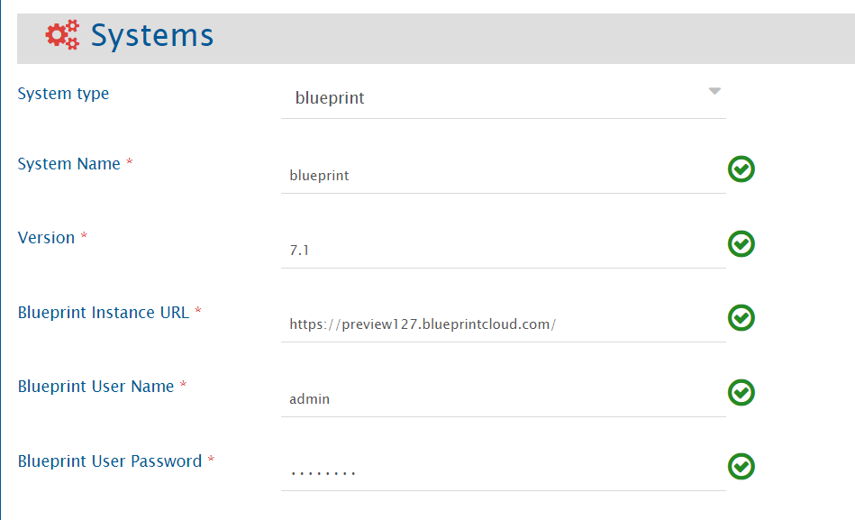

1. Set **System Name** to name you would like to give.
2. Set Blueprint **Version** for your Blueprint instance.
3. Set **Enable OIM** to **‘Yes’**.
4. Set **Blueprint Instance URL** to the URL of your blueprint instance.
5. Set **Blueprint User Name** to the admin user name of Blueprint.
6. Set **Blueprint User Password** to the corresponding password of the user account that is used in the synchronization.

> **Note**: If the system is deployed on HTTPS and a self-signed certificate is used, then you will have to import the SSL Certificate to be able to access the system from OpsHub Integration Manager. Click [Import SSL Certificates](../getting-started/ssl-certificate-configuration.md) to learn how to import SSL certificate.

# Integration Configuration
In this step, set a time to synchronize data between Blueprint and the other system to be integrated. Also, define parameters and conditions, if any, for integration.

Click [Integration Configuration](../integrate/integration-configuration.md) to learn the step-by-step process to configure integration between two systems.

## Integration recommendations & assumptions

### Diagram content synchronization
Diagram content sync is supported for some artifact types. So while integrating Blueprint with any other system, please do not add attachment with the name `BlueprintDiagramImage.png` in the entities of any of the two systems, as this name is reserved for diagram content sync for following base artifact types:

- GenericDiagram
- BusinessProcess
- UseCase
- UIMockup
- Storyboard
- DomainDiagram
- UseCaseDiagram

## Inline image synchronization
You can add inline images in rich text type of fields from Blueprint UI (Blueprint version 8.0 onward), but such inline images will not get synchronized from Blueprint to other end systems (due to the limitations with Blueprint system API).

If an inline image is present in a rich text type of field in Blueprint, and the field is mapped as part of synchronization, then a tag describing the image code (e.g. `[Image = 664e7713-490d-e711-8145-12c125a2500f]`) will be visible in the target field (which is mapped corresponding to Blueprint Rich Text field) instead of the inline image.

For example if an inline image is added in blueprint description field as below:

  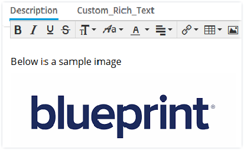

It will be visible as below in target system:

  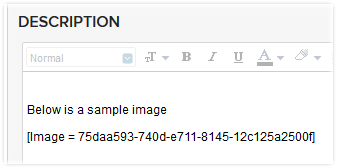

# Criteria Configuration

**Query**

Blueprint query can be formed using any of the following Parameters:

- Artifact-Id
- Artifact-Type
- Artifact-HasAttachments
- Artifact-HasComments
- Property-[Name] (Here Name is the custom/system field name)

The Query Format is: `Parameter [Supported Operator] value`

  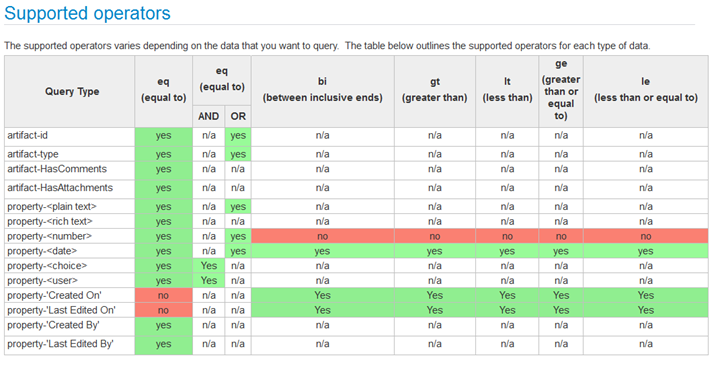

For more details on writing query please refer Blueprint Search Query API.

**Sample Query**

* An example of criteria with one 'Lookup field
  * Example: `property-Priority eq ('Medium')`
* An example of criteria with one 'Lookup field

# Appendix

## Create Custom Field
To create a new custom field in the blueprint, follow the steps given below:

1. Log in into Blueprint as a user with the **Project Administration** permissions.
2. Bring up the project administration page for the project in which you want to add the custom field by selecting **Menu → Manage → <Project Name>**.
3. Click on **Custom Properties** under **Customize Project.**
4. Click on New to add the field and set the details in the Properties Details in the Right panel like  
   - Name : OH_Last_Update  
   - Type: Text
5. Select Artifact types in which you want to add the field under **Applies to Artifact Types**.
6. Click on **Save**.

  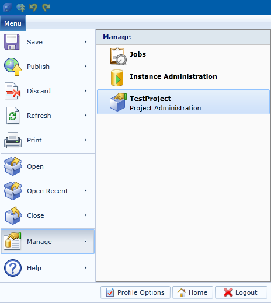

  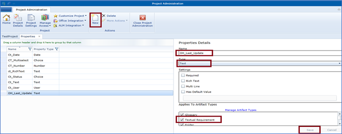

## Add User
To add new user to the blueprint, follow the steps given below:

- Log in into Blueprint.
- Bring up the Instance Administration page by selecting **Menu → Manage → Instance Administration**.

  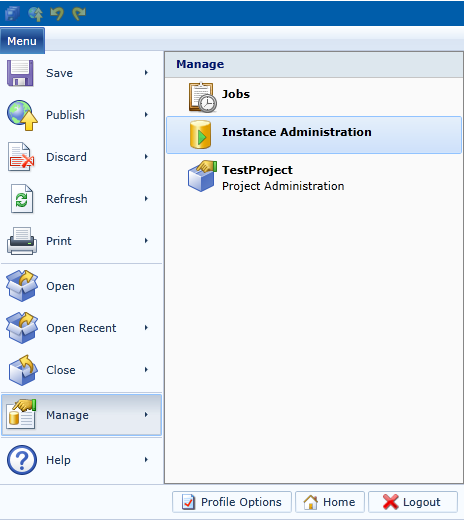

- Click on **Users** under **Manage Users and Group** on top panel. Click on **New → New Database/Windows User.**

  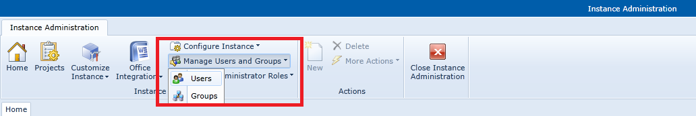

- Provide details as shown below.  
  There are various **Instance Administrator Roles** and the allowed accesses to them are mentioned there, for example **Default Instance Administrator** is an *Instance administrator role with all instance privileges for managing the instance, all projects and access to all project data*. This is the highest level of privileges that can be given to a user. For minimum required privileges do not assign any **Instance Administrator Role** to the user and continue with the steps below.

  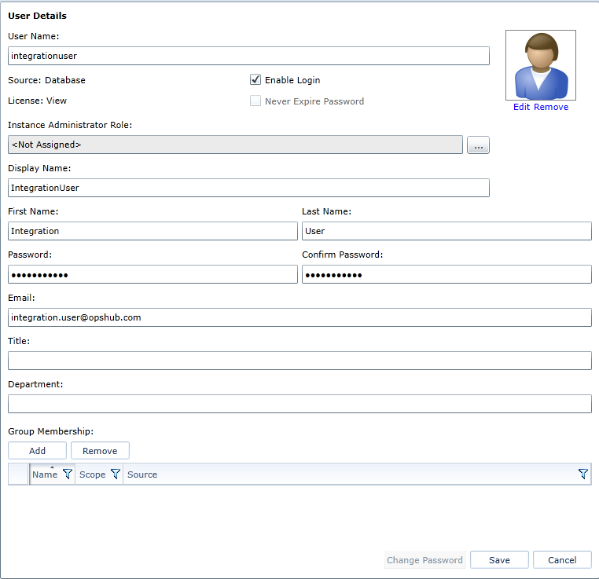

- Click on **Add** and add the user to a group with License Author as shown below and click **OK**.

If no such group is present then on the top panel click on **Manage Users and Groups** and then click on **Groups**.

A new window will open up where you can click on **New** to create a group with **Author** license. After the group has been created add the user to it.

  

  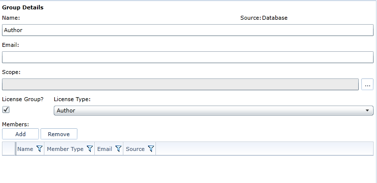

- Now click on **Projects** in the top panel (or **Home → Projects**), then **right click on the project** that you want the user to manage and select **Launch Project Administration**.

  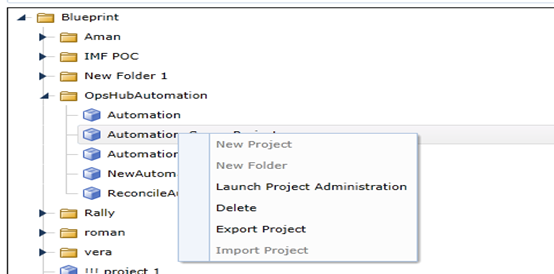

- Click on **Project Roles**, here you can check all the roles that can be assigned to a user.  
  You can edit the roles already present or create a new role with minimum required privileges as following:  
  **Create**, **Trace**, **Comment**, **Reuse**, and **Create and edit rapid review.**  
  Let us suppose **Author** has the required minimum privileges which are mentioned above.

  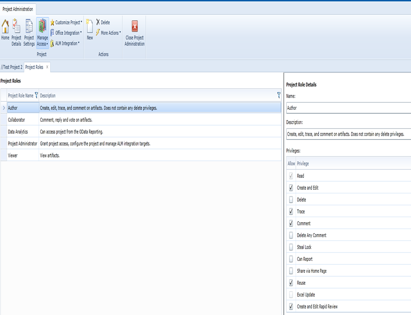

- Click on **Home → Project Role Assignments** in Project Administration and click on **New.**  
  A new window will open up where you can select the group in which you added the user previously and select the **Project Role** as **Author** which has the minimum required privileges.

  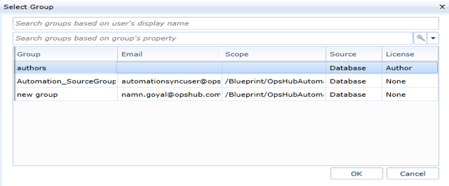

  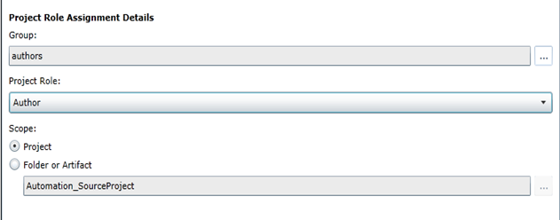

- Click **Save** and you are done.

