# Pre-Requisites

## User Privileges

### For Basic authentication
* Create one user of Bugzilla system, dedicated to OpsHub Integration Manager. User should not be used to do any operations from System's User-Interface.
* User must have all privileges to call web-service and read, write permissions on the entity.
* User must be a member of the 'editbug' and the 'canconfirm' groups. At the time of create user or edit user action in Bugzilla, one can select these groups.  
For details on how to create user with privileges or edit user privileges, please refer to Appendix section [How to add or edit user with privileges](#how-to-add-or-edit-user-with-privileges).

### For Anonymous authentication
* Disable the **requirelogin** option from Administration → Parameters → User Authentication.  
For details on how to enable Anonymous login, please refer to Appendix section [How to enable Anonymous login](#how-to-enable-anonymous-login).

## Bugzilla Database Requirement

* If version of Bugzilla you are using is 5.0.2 or above, then OpsHub Integration Manager does not need Database Connection. Version 5.0.2 and above versions are supported using the Native Rest API.
* To check which Bugzilla version you are using, click [Find Version](#find-version).
* If Bugzilla version is lower than 5.0.2, then Database connection is mandatory.

Bugzilla database should be installed either on MySQL or Oracle for integration. Following database configuration parameters will be required for creating integration configuration for Bugzilla:

* Bugzilla database host name  
* Bugzilla database port  
* Bugzilla database name  
* Bugzilla database username (with read privileges)  
* Bugzilla database password for the above user  

## Bugzilla Rest Enabled

For Bugzilla versions below 5.0, the REST API Version 1.3 should be enabled. For more information on how to enable Bugzilla REST, please refer this link: https://wiki.mozilla.org/Bugzilla:BzAPI section.

> **Note** : Do not use ',' in field value for multi-select and drop-down options.

## System Configuration

Before you continue to the integration, you must first configure Bugzilla. Click [System Configuration](system-configuration) to learn the step-by-step process to configure a system.  
Refer the screenshot given below for reference.

<div align="center">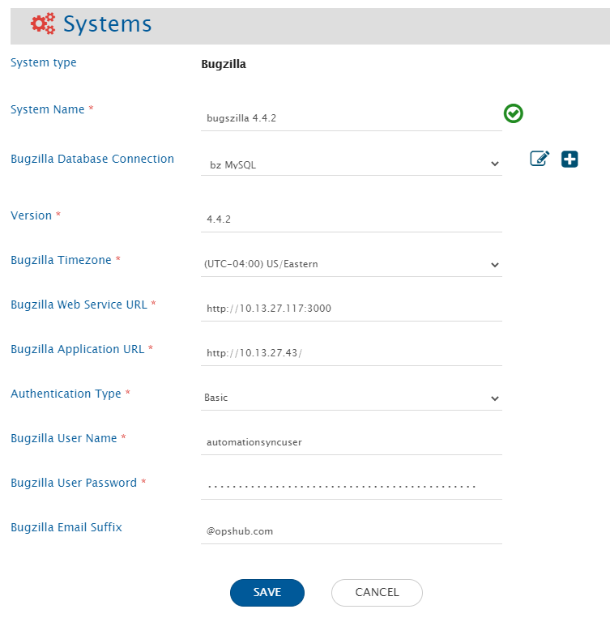</div>

<span style="color:blue">**Bugzilla System form details**</span>

| **Field Name** | **When field is required/visible on the System form** | **Description** |
|----------------|--------------------------------------------------------|------------------|
| **System Name** | Always | Provide System name |
| **Bugzilla Database Connection** | Only when Bugzilla version is less than 5 | If Bugzilla version is greater than 5.0 then you don't need datanase connection, otherwise select database connection configured for Bugzilla database in Database Connection. If database connection is not configured for Bugzilla system then click the plus sign & follow steps given in appendix to create database connection. |
| **Version** | Always | Provide Bugzilla system version like 4.4.2, 5.0.2. |
| **Bugzilla Timezone** | Only when Bugzilla version is less than 5 | Set Bugzilla Timezone as the timezone of the Bugzilla System. |
| **Bugzilla Web Service URL** | Always | This URL points to the REST API, configured for Bugzilla. |
| **Bugzilla Application URL** | Always | This URL points to the Bugzilla Home Page. |
| **Authentication Type** | Always | Set Authentication Type to Basic or Anonymous as per requirement. |
| **Bugzilla User Name** | Only when **Authentication Type** is **Basic** | Set Bugzilla User Name to the login user name of the corresponding user account being used in the synchronization (e.g. 'oimuser@opshub.com'). |
| **Bugzilla User Password** | Only when **Authentication Type** is **Basic** | Set Bugzilla User Password to the corresponding password of the user account that is used in the synchronization. |
| **Bugzilla Email Suffix** | Only when Bugzilla version is less than 5 | Provide the email suffix that is configured on Bugzilla instance. |

> **Note** :If the system is deployed on HTTPS and a self-signed certificate is used, then you will have to import the SSL Certificate to be able to access the system from OpsHub Integration Manager. Click [Import SSL Certificates](../getting-started/ssl-certificate-configuration.md) to learn how to import SSL certificate.

# Mapping Configuration

Map the fields between Bugzilla and the other system to be integrated to ensure that the data between both the systems synchronizes correctly. Click [Mapping Configuration](../integrate/mapping-configuration.md) to learn the step-by-step process to configure mapping between the systems.  
Read more about [Mapping Checkpoints](#mapping-checkpoints-for-bugzilla-as-the-target-system) and [How to know field name](#how-to-know-field-name-used-in-mapping) in the Appendix Section.

# Integration Configuration

Set a time to synchronize data between Bugzilla and the other system to be integrated. Also, define parameters and conditions, if any, for integration.  
Click [Integration Configuration](../integrate/integration-configuration.md) to learn the step-by-step process to configure integration between two systems.

# Criteria Configuration

**Query:** Query on Bugzilla System is valid query string accepted by Bugzilla REST API.  
Example: `status=RESOLVED&priority=High`

> > **Note** :
> If field value itself contain '&', then it should be replaced with `@OH_AND@` to make correct query.  
> *Example: If product field has value 'R&D' then the query will be `product=R@OH_AND@D&priority=High`.*

> > **Note** :
> Bugzilla uses fields' internal name for query.  
> *For example in `status=RESOLVED&priority=High` query, status is the internal name of field 'Status'. Refer [Custom Field Internal Name](#custom-field-internal-name) section to know the internal name of Bugzilla Custom Fields.*

> > **Note** :
> Criteria is not supported for versions **5.0 or greater**.

## Known Behaviors and Limitations

* When **Anonymous** is used as authentication type:
  * Bugzilla can only be used as source system.
  * Functionalities like remote link, remote id and end system criteria are not supported.
  * Following fields are not supported with **Anonymous** authentication type:
    * Orig. Est.
    * Current Est.
    * Hours Worked
    * Hours Left
    * %Complete
    * Gain
    * Deadline
* Synchronization of 'OH Updated By' [It's a 'Read Only' field to indicate the user who performed the last update in the system] is not supported.
* The below mentioned fields are supported as 'Text' type fields in the synchronization:
  * Orig.Est, Hours Worked, Hours Left, %Complete
* Synchronization of 'Comment Link' [i.e., mentioned as 'Comment 1' in the below image] is not supported.  
  <div align="center"></div>
* Only the comments added by user will be synchronized and not the system generated comments.  
  <div align="center">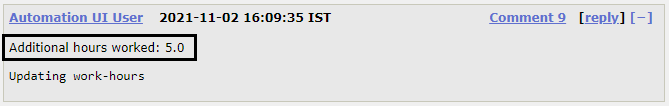</div>
* Only the comment added by user while adding attachment will be synchronized and not the system generated comment.  
  <div align="center">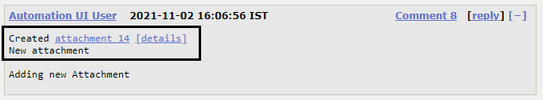</div>
* OpsHub Integration Manager supports synchronization of Comments, within which if you have provided the Comment mentions, Bug mentions or Hyperlink, then those details will be synchronized as 'plain text' to the target.
* When BugZilla is the **source** system:
  * For Bugzilla version **greater than 5.0**: Synchronization will always be 'History' based [except for Attachments].
  * For Bugzilla version **less than 5.0**: 'History' based synchronization and [Sync_Only_Current_State](../integrate/integration-configuration.md#sync_only_current_state) option are supported.
  * For 'Attachment' synchronization:
    * OpsHub Integration Manager supports synchronization of Attachment. Bugzilla allows adding the Attachment details like File, Description, Obsoletes, Comments... out of which only File will be synchronized with the Attachment synchronization. Comments added within the Attachment details will be synchronized, if you have enabled the Comment synchronization.
    * If the Attachment filename contains '\', the characters after '\' will only be considered as filename.  
      *Example: If you have uploaded an attachment with the name, `Testing\Validation.txt` on a Bugzilla Bug, then it will sync to the target as `Validation.txt`.*
  * For the 'Large Text Boxes' type of field, if the field content contains more than 255 characters, the user might see extra space in the content after approximately 255 characters post synchronization.  
    *Reason: Bugzilla History API gives details with such extra space.*
  * 'Tags' field is supported only for Bugzilla version less than 5.
    * 'Tags' field doesn't support history and only the current state of it will be synchronized.
    * Any update in 'Tags' field will only be synchronized when any other update is done for the entity.
    * 'Tags' field is supported as read-only field.
* When BugZilla is the **target** system:
  * For 'Free Text' Data Type of fields [e.g : Summary], Bugzilla only accepts 255 characters. Hence, you will observe a processing failure with error message:

    ```
    OH-Bugzilla-0301: Error from Bugzilla server... code : 104 Message : The text you entered in the Summary field is too long (256 characters, above the maximum length allowed of 255 characters)
    ```

    In this case, you can write an Advanced mapping to truncate the characters to 255 only.
  * Bugzilla allows you to set the value for 'Description' field only with Bug creation. Hence, we recommend to set 'create' for [Sync When configuration](../integrate/mapping-configuration.md#sync-when) of mapping for Description Field.
* The below mentioned functionalities are not supported by Bugzilla itself. Hence, OpsHub Integration Manager does not synchronize them:
  * User Mentions, Inline Images, HTML formatting for Fields/Comments

# Appendix

## How to add or edit user with privileges

For adding an existing user to the `editbugs` and `canconfirm` groups, follow the steps below:

<p align="center">
  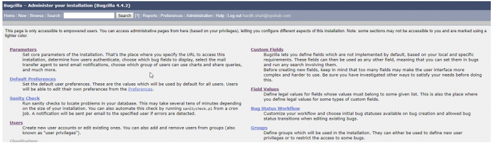
</p>

**Bugzilla User Privilege Step 1**

<p align="center">
  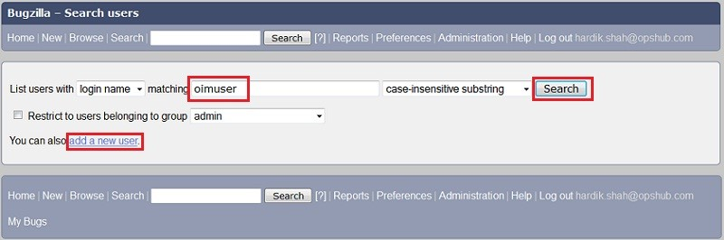
</p>

**Bugzilla User Privilege Step 2**

<p align="center">
  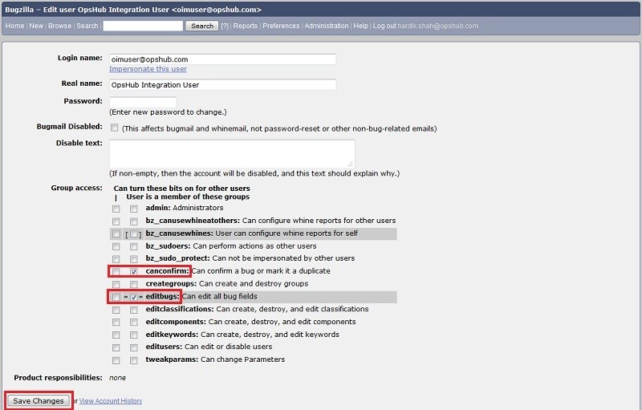
</p>

**Bugzilla User Privilege Step 3**

Steps:

- Log in to Bugzilla with the administrator account.
- Navigate to **Administration** at the top of the page. (Step 1)
- Click **Users** on the left side. (Step 1)
- Search for the user by entering the username in the *matching* field. (Step 2)
- In the search results, click the username under the **Edit User…** column.
- Tick the checkboxes for **canconfirm** and **editbugs**. (Step 3)

> 📝 *If the user needs both privileges, tick both checkboxes. If only partial access is needed, select the appropriate box.*

- Scroll to the bottom and click **Save Changes**.

For **creating a new user** with the `editbugs` and `canconfirm` groups:

- Log in to Bugzilla with the administrator account.
- Navigate to **Administration**.
- Click **Users** → **Add a New User**.
- Enter the login name, real name, and password.
- Click **Add**.
- In *Group access*, tick **canconfirm** and **editbugs**. (Step 3)

> 📝 *If the user needs both privileges, tick both checkboxes. Otherwise, choose accordingly.*

- Scroll down and click **Save Changes**.

---

## How to enable Anonymous login

To enable Anonymous login:

- Log in with an administrator account.
- Click **Administration** at the top.
- Click **Parameters**.

<p align="center">
  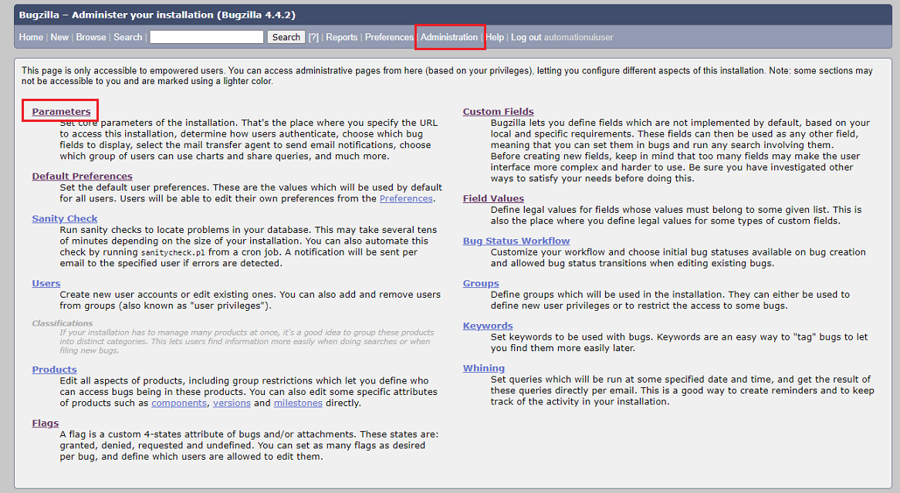
</p>

- Select **User Authentication** from the left menu.

<p align="center">
  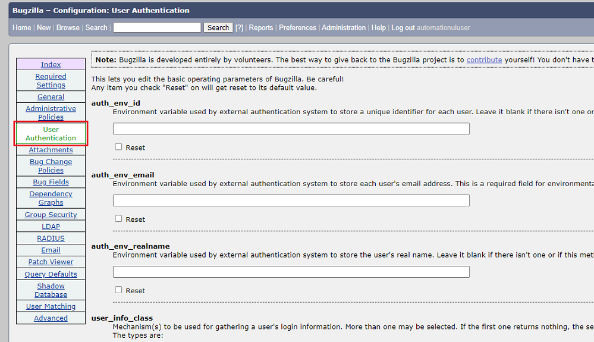
</p>

- Scroll to the **requirelogin** option and select **off**.

<p align="center">
  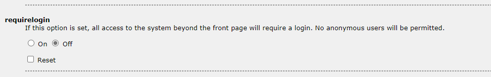
</p>

- Click **Save Changes**.

---

## Custom Fields

To add a custom field:

<p align="center">
  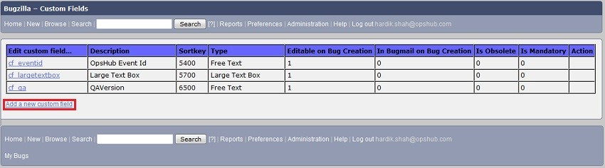
</p>

<p align="center">
  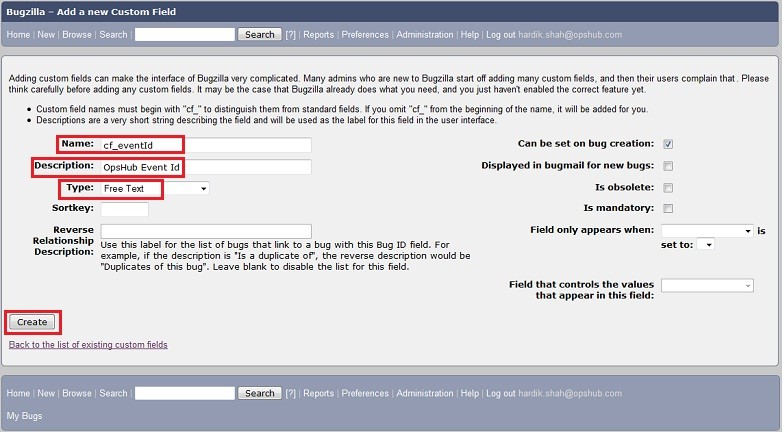
</p>

- Log in as administrator.
- Go to **Administration**.
- Click **Custom Fields**.
- Click **Add a new custom field**.
- Fill in the name and description.
- Select the field type.
- Click **Create**.

Repeat for each custom field required.

---

## How to know field name used in Mapping

Bugzilla’s API uses **internal names**, not display names.

To find custom field internal names:

- Go to **Administration**.
- Click **Custom Fields** – all configured fields are listed here.

<p align="center">
  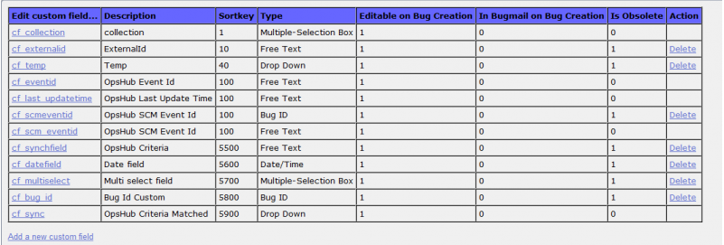
</p>

For system fields, refer to: [Bugzilla REST API Objects – Bug](https://wiki.mozilla.org/Bugzilla:REST_API:Objects#Bug)

---

## Find Version

- Log in to Bugzilla.
- On the **Home** tab, the Bugzilla version appears at the top-right.

<p align="center">
  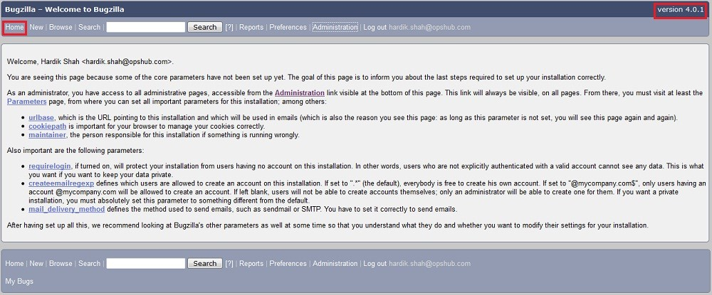
</p>

---

## Custom Field Internal Name

- Log in as administrator.
- Go to **Administration** → **Custom Fields**.
- The internal name is shown in **Edit Custom Field** view.

---

## Find Email Suffix

- Log in with admin credentials.
- Go to **Administration** → **Parameters**.
- Select **User Authentication** from the left panel.
- You’ll see the `emailsuffix` configuration:

<p align="center">
  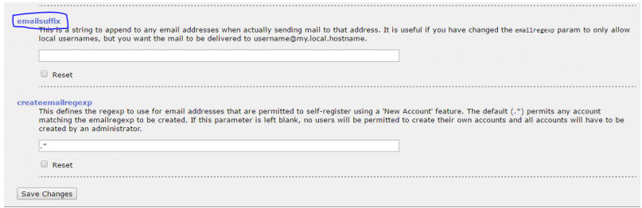
</p>

---

## Mapping checkpoints for Bugzilla as the target system

The following **mandatory fields** must be hardcoded into mappings when Bugzilla is the **target system**:

- `Product`
- `Component`
- `Version`
- `op_sys`
- `Platform`

> ✅ Use correct values according to your Bugzilla instance configuration.

