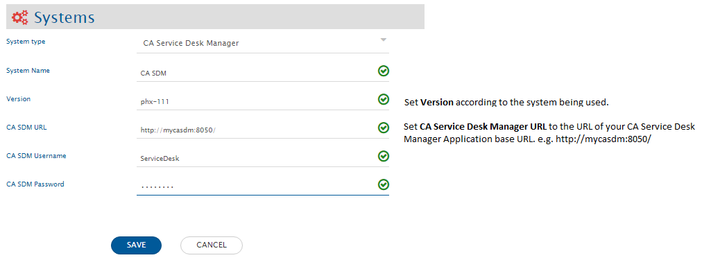
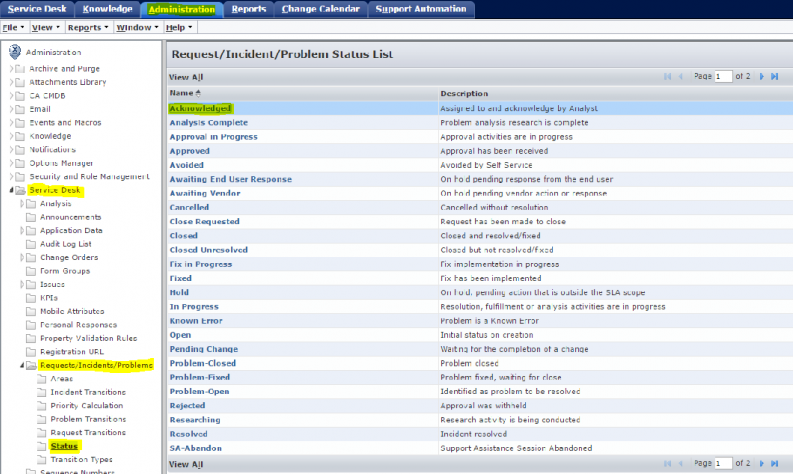
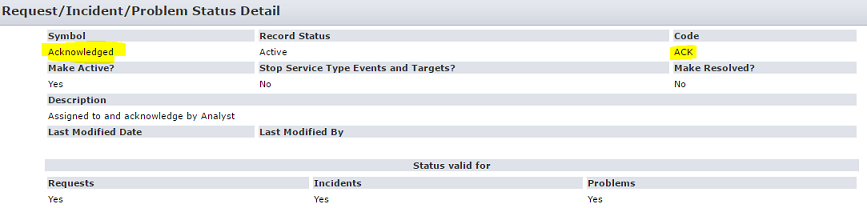
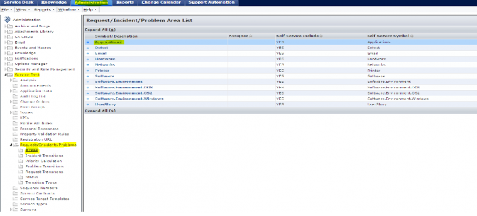
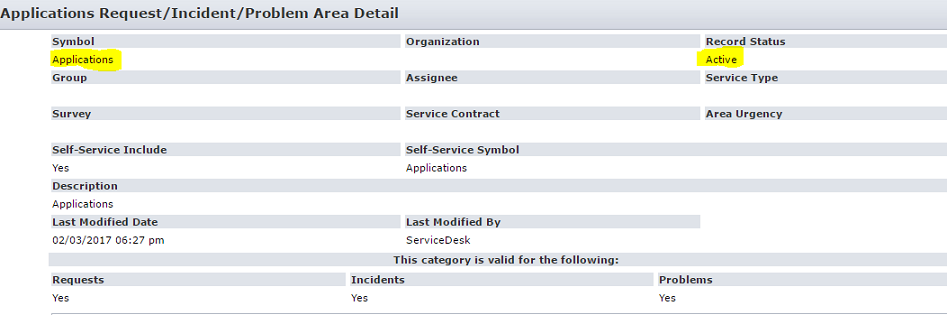

# Prerequisites

## User Privileges

* Create one user for CA Service Desk Manager, dedicated to integration. User should not be used to do any operations from CA Service Desk Manager's user interface.
* User must have administrator-level access to access the REST web-services API. 
* User must set User Id field on CA Service Desk Manager for user synchronization. 

# System Configuration

Before you continue to the integration, you must first configure CA Service Desk Manager.  
Click [System Configuration](../integrate/system-configuration.md) to learn the step-by-step process to configure a system.  
Refer the screenshot given below for reference.

  

If the system is deployed on HTTPS and a self-signed certificate is used, then you will have to import the SSL Certificate to be able to access the system from OpsHub Integration Manager. Click [Import SSL Certificates](../getting-started/ssl-certificate-configuration.md) to learn how to import SSL certificate.

# Mapping Configuration

In this step, map the fields between CA Service Desk Manager and the other system to be integrated to ensure that the data between both the systems synchronizes correctly.  
Click [Mapping Configuration](../integrate/mapping-configuration.md) to learn the step-by-step process to configure mapping between the systems.

# Integration Configuration

In this step, set a time to synchronize data between CA Service Desk Manager and the other system to be integrated. Also, define parameters and conditions, if any, for integration.  
Click [Integration Configuration](../integrate/integration-configuration.md) to learn the step-by-step process to configure integration between two systems.

# Criteria Configuration

If you want to specify conditions for synchronizing an entity between CA Service Desk Manager and the other system to be integrated, you can use the **Criteria Configuration** feature.  
To configure criteria in CA Service Desk Manager, integration needs to be created with CA Service Desk Manager as the source system.

**Query Format:**  
`Fieldname = value`

**Sample Queries:**

* Polling all projects with status set to Acknowledged  
  E.g. `(status='ACK')` where `ACK` = code for status value *Acknowledged*  
  User can view the status list of Request/ Incident/ Problem by  
  *Administration → Service Desk → Requests/Incidents/Problems → Status*

  

  

* Polling all projects with Areas set to Applications  
  For example, `(Areas='Active')` where `Active` = Record Status for symbol *Applications*  
  User can view the Areas list of Request/Incident/Problem by  
  *Administration → Service Desk → Requests/Incidents/Problems → Areas*

  

  

Go to the Criteria Configuration section on the [Integration Configuration](integration-configuration) page to learn more.

---

# Known Limitations

* Fields under properties tab of Additional Information are not supported for integration.
* For synchronization from CA Service Desk Manager to any other system, entity update is needed when the comment is added from API to the source entity. This situation can occur for three-end systems integration where CA Service Desk Manager is the middle system. For example, integration from system A to CA Service Desk Manager and from CA Service Desk Manager to system B. So, if comment is added in CA Service Desk Manager from A system, then entity update is needed in CA Service Desk Manager to sync that comment to C system.
* Special characters are not supported in CA Service Desk Manager for attachment file name.
* Link type attachments are not supported in CA Service Desk Manager. These types of attachments need to be skipped by using appropriate advance mapping.
* If other complex objects are created in CA Service Desk Manager schema, these complex objects are also displayed as lookup at field mapping.
* If property fields are mapped and problem area (for problem entity), incident area (for incident entity), request area (for request entity), or category for change order entity, issue category for issue entity are not mapped, property fields will be added to the entity rather than the corresponding area.
* Property fields that belong to other area (Hardware, application, network) or category (hardware.pc.install, software.pc.install) than the selected ones will not be synchronized to the target system even when they are mapped. For example, property p1, p2 belong to application area and property p3, p4 belong to hardware area and one mapped property fields p3, p4 along with p1, p2. Then, only p1 and p2 are synchronized to the target system.
