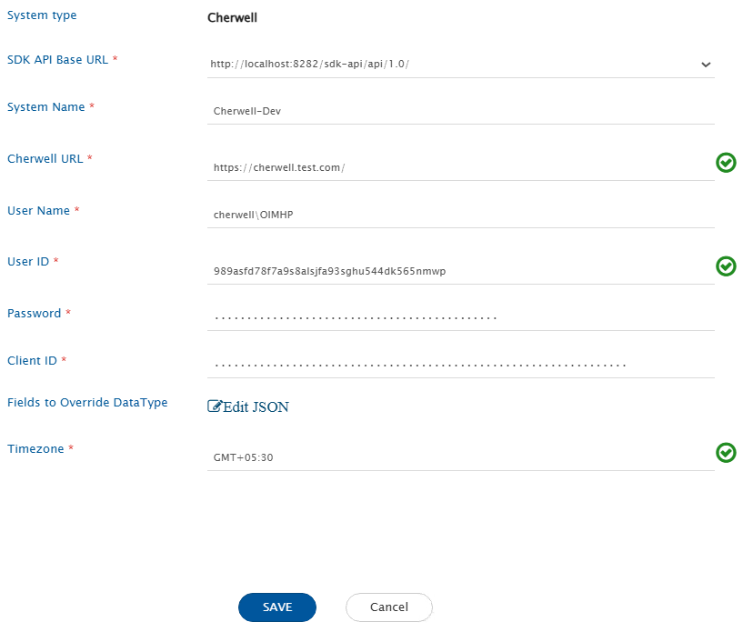

# Prerequisites

## Service User

* Cherwell supports OAuth-based authentication. Users will need to generate a client ID and secret by following these steps:
* Follow the official Cherwell documentation: [Obtaining Client IDs](https://help.ivanti.com/ch/help/en_US/CSM/10.1.0/documentation_bundle/system_administration/rest_api/csm_rest_obtaining_client_ids.html)
* The system requires the service user's ID to be provided in the system form because the username used for authentication cannot be used to identify the service user.

# System Configuration

Before configuring the integration, you must first configure Cherwell. Refer to [System Configuration](../integrate/system-configuration.md) page to learn the step-by-step process to configure a system.

Refer to the following screenshot with each field value chosen

<div align="center"></div>

| **Field Name**                  | **When is the field visible** | **Description**                                                                                                                                                                                                       |
| ------------------------------- | ----------------------------- | --------------------------------------------------------------------------------------------------------------------------------------------------------------------------------------------------------------------- |
| **System Name**                 | Always                        | Provide a name to the Cherwell system.                                                                                                                                                                                |
| **Server URL**                  | Always                        | Provide Server URL of the Cherwell instance. This URL will be used for communicating with Cherwell system API. The format: (http(s))://hostname:port/                                                                 |
| **Username**                    | Always                        | User name, this should be Domain/username. Example: cherwell/integration_user                                                                                                                                        |
| **User ID**                     | Always                        | ID of the user. Required as username used for authentication can't uniquely identify the integrated user.                                                                                                             |
| **Password**                    | Always                        | Password of the user.                                                                                                                                                                                                 |
| **Client ID**                   | Always                        | Provide the Client ID generated by user. For details on how to generate Client ID, refer to [Obtaining Client IDs](https://help.ivanti.com/ch/help/en_US/CSM/10.1.0/documentation_bundle/system_administration/rest_api/csm_rest_obtaining_client_ids.html) |
| **Fields to Override DataType** | Always                        | Provide the JSON where key is Field's internal name (If field ID has BO: and FI: then provide ID after FI:) and its DataType to be configured. For detailed explanation on JSON structure and usage, refer to JSON Configuration section. |
| **Timezone**                    | Always                        | We take timezone input as this is a system level configuration and information is not available from the API. API response has the date time value in this timezone. Example: For system with Eastern Standard Time provide GMT-05:00.  |

## JSON Configuration

The following is the structure of the JSON configuration for the "Fields to Override DataType" field:

```json
{
 "entityTypeId": {
  "fieldId": {
   "dataType": "ANY_DATA_TYPE",
   "lookupValues": [
       "value 1",
       "value 2"
    ],
    "dependsOn": [
       "field_id_1",
       "field_id_2"
    ],
    "dateFormat": "M/d/yyyy"
  }
 }
}
```

### JSON Configuration Parameters

**dataType**
* This parameter can be used to change the datatype of the field, since the API only provide enough information to determine following data types: Date, Boolean, Number, Text.

**lookupValues**
* Used to specify lookup values for a field. Note that only 200 lookup values can be retrieved via API call. If a field has more than 200 lookups, use the JSON configuration to specify all values.
   * Recommendation: Consider using Excel for mapping instead of writing those values in JSON.

**dependsOn**
* In Cherwell, some fields require other field values to be passed along when getting updated. Each field can specify a list of dependent fields using this parameter.

**dateFormat**
* Some date fields return data in different date formats than the default. Use this parameter to overwrite the default date format when necessary..

#### Example

```json
{
  "6dd53665c0c24cab86870a21cf6434ae": {
    "252b836fc72c4149915053ca1131d138": {
      "dataType": "HTML"
    },
    "9e0b434034e94781ab29598150f388aa": {
      "dataType": "LOOKUP",
      "dependsOn": [
        "1163fda7e6a44f40bb94d2b47cc58f46",
        "83c36313e97b4e6b9028aff3b401b71c"
      ],
      "lookupValues": [
        "Issue",
        "Request"
      ]
    },
    "9378aba4eb664c75b19162486199a67ac141aa8dad": {
      "dateFormat": "M/d/yyyy"
    }
  }
}
```

# Supported Entities

* Incident

# Integration Configuration
## Criteria Configuration

* Cherwell supports OpsHub Query Format. To learn how to form a query, please refer to this [OpsHub Query format](../integrate/opshub-query-format.md)
* Note that only the following operations are supported in Cherwell: EQUALS, IS, GREATER_THAN, GREATER_THAN_EQUALS, LESS_THAN, LESS_THAN_EQUALS, AND, IN
* Go to [riteria\_Configuration](../integrate/integration-configuration.md#criteria-configuration)
* **Important**: Only date fields can have two filters with AND condition between them. For all other field types, if two filters are applied on the same field, it will use an OR operation due to API limitations.
* Field ID must be passed for the field on which the filter is being applied.

### Sample Query

Query to search entities where incident ID equals a specific value:

| **Value**            | **Query**                                                                                     |
| -------------------- | --------------------------------------------------------------------------------------------- |
| Incident ID = 000001 | `[{"field": "6ae282c55e8e4266ae66ffc070c17fa3", "condition": "EQUALS", "value": "14779275"}]` |

Query to search entities belonging to specific teams:

| **Value**               | **Query**                                                                                                   |
| ----------------------- | ----------------------------------------------------------------------------------------------------------- |
| Team = Team 1 or Team 2 | `[{"condition": "IN","field": "9339fc404e8d5299b7a7c64de79ab81a1c1ff4306c","values": ["Team 1","Team 2"]}]` |

## Target LookUp Configuration

* Provide query in Target Search Query field to be able to search the entity in Cherwell when it is the target system.
* Go to [Search in Target Before Sync](../integrate/integration-configuration.md#search-in-target-before-sync) section on Integration Configuration page to learn in detail on how to configure the Target Lookup.
* The Target LookUp configuration is similar to the Criteria configuration where in the target search query field, you can provide a placeholder for the source system's field value between '@' and '@'. Refer to the examples below:
* Example: [{"condition":"EQUALS","field":"93e8ea93ff67fd95118255419690a50ef2d56f910c","value":"@Title@"}]
* This query will select only those entities whose short description field value is same as the source system's "Title" field value

# Known Behaviors

* Only the last saved state of the tickets will synchronize to target.
    * Last modified time and field values are not updated until ticket is not saved.
* End system criteria storage is not supported.
    * Cherwell search API does not support NOT EQUALS operator which is necessary for supporting this feature.
* Attatchments with filenames containing any of these characters: #, %, + will not be synchronized to Cherwell.
    * Cherwell APIs don't allow these characters in file name when uploading attatchment.
* Comments added by service users will not be visible in journal note history field.
    * Comments added via APIs don't reflect in that field.
* Multilingual characters are not supported in fields and attachment file names.
    * Cherwell APIs don't return those characters.
* If a field has more than 200 lookup values, use the JSON input to override lookup values.
    * Only 200 lookup values are accessible from Cherwell APIs.

# Limitations

* History support is not available
* Inline images in base64 format are not supported by OpsHub Integration Manager currently
* Linkages are not supported
* Only Incident Note type of Journals will be synchronized as comments
* Only file type of attatchments are supported

