# Prerequisites

## User Privileges
* Create a user in Clarity that is dedicated for OpsHub Integration Manager. The user mustn't perform any other action from Clarity user interface. This user is referred as 'Integration User' in this documentation.
* To synchronize entities to and from any systems to Clarity, Integration User must have the following global access rights:
  * Create
  * View All
  * Edit All

## Custom Field Configuration
* One field must be defined on the entity that is being synchronized. This must be set up so that OpsHub Integration Manager can track the synchronization status of each item.
* This field's "API Attribute ID" needs to be set to "**o_ohlastUpdate**". Here is the custom field details:

| **Property Name**                  | **Type** | **Size** |
|-----------------------------------|----------|----------|
| API Attribute ID: o_ohLastUpdate  | String   | 255      |

* For step-by-step guide to create a custom field, refer to [How to add custom field](#how-to-add-custom-field) section.

# System Configuration

> **Note** : OpsHub Integration Manager supports basic authentication.

Before the user starts with the integration configuration, he/she must first configure Clarity system in OpsHub Integration Manager.  
Click [../integrate/system-configuration.md](../integrate/system-configuration.md) to learn the step-by-step process to configure a system.  
Refer to the screenshot given below:

<p align="center">
  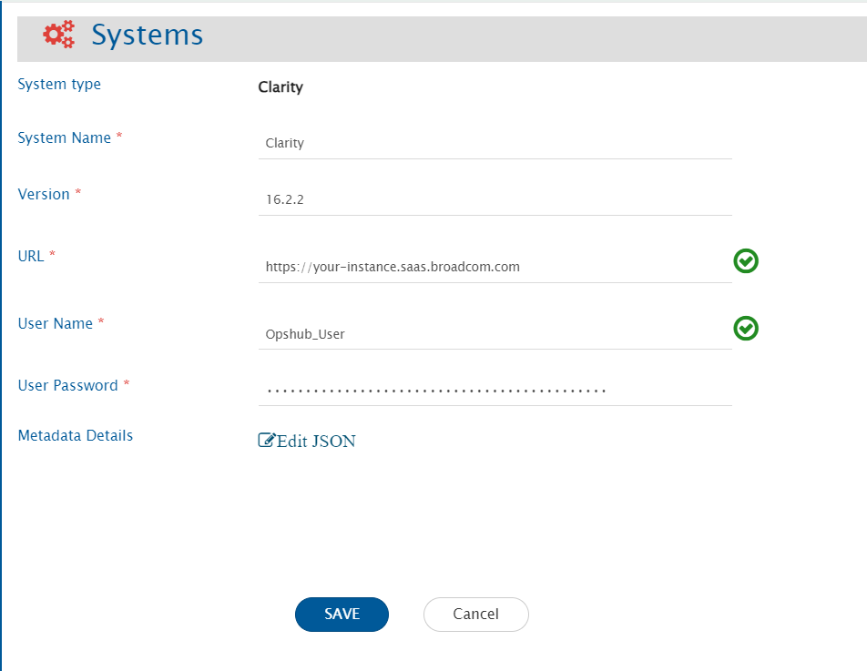
</p>


**Clarity form details**

| **Field Name**       | **Description**                                                                                   |
|----------------------|---------------------------------------------------------------------------------------------------|
| System Name          | Provide the system name                                                                            |
| Version              | Provide the version of Clarity. To know the version of the Clarity system, refer to [How to find Clarity Version](#how-to-find-clarity-version) in Appendix. |
| URL                  | The URL is used for connecting to Clarity REST API. For example: https://[domainOfYourClarityPPMInstance] |
| User Name            | Provide a dedicated user (Enter User Name not email id in this field) for API communication with the Clarity instance. This user should have the required privileges to use the Clarity API. For required privileges, refer to [[#User Privileges | User Privileges]] section. |
| User Password        | Provide the password for the user given in "User Name" field.                                     |
| Metadata Details     | This data is required in case the user wants to configure synchronization behaviour for specific entities. For the format and guidance related to filling these details in JSON form, refer to [Understanding JSON Input](#understanding-json-input) section. |

## Understanding JSON Input

> **Note**: Metadata details can be provided during system configuration in the field 'Metadata details' (in JSON format) for the following use cases:

* **Use case 1**: For synchronization of comments, by default the value of "enableCommentSync" is set to true for Project and Task entities as Comment synchronization is supported for those entities only. In case the user doesn't want to synchronize comments, the following configuration can be changed by setting the value of "enableCommentSync" to false using JSON input.
* **Use case 2**: For synchronization of attachments, by default the value of "enableAttachmentSync" is set to true for all the entities. In case the user doesn't want to synchronize attachments, the following configuration can be changed by setting the value of "enableAttachmentSync" to false using JSON input.
* **Use case 3**: Due to API limitation, OpsHub Integration Manager is not able to identify the derived object type of the custom investment object. Hence, to synchronize the Remote Entity Link for custom investment object, value for derived object type is required for parameter "customObjectType". Refer to [How to find Custom object's type](#how-to-find-custom-objects-type)  type section for more details.

Sample JSON input:

```json
{
  "entities": [
    {
      "internalName": "projects",
      "displayName": "Project",
      "systemSpecific": {
        "enableAttachmentSync": true,
        "enableCommentSync": true
      }
    },
    {
      "internalName": "tasks",
      "displayName": "Task",
      "systemSpecific": {
        "enableAttachmentSync": true,
        "enableCommentSync": true
      }
    },
    {
      "internalName": "obaTodos",
      "displayName": "To Do",
      "systemSpecific": {
        "enableAttachmentSync": true
      }
    },
    {
      "internalName": "custStrategicEpics",
      "displayName": "Strategic Epic",
      "systemSpecific": {
        "customObjectType": "investments",
        "enableAttachmentSync": true
      }
    }
  ],
  "projects": []
}
```

# Mapping Configuration

* Map the fields between Clarity and the other system to be integrated to ensure that the data between both the systems synchronize correctly.  
Refer to [../integrate/mapping-configuration.md](../integrate/mapping-configuration.md) page to learn the step-by-step process to configure mapping between the systems.

## Relationship Configuration

* In Clarity, Task entity can only exist under a Project or Custom Investment Object. Similarly, To Do entity can only exist under a Task.
* Hence, to synchronize 'Task/To Do' when Clarity is target system, the default link must be configured in relationship mapping where link type must be 'Parent' and entity type must be 'Custom Investment Object/Project/Task'. Please refer to [../integrate/default-link-settings.md](../integrate/default-link-settings.md) for more details.

<p align="center">
  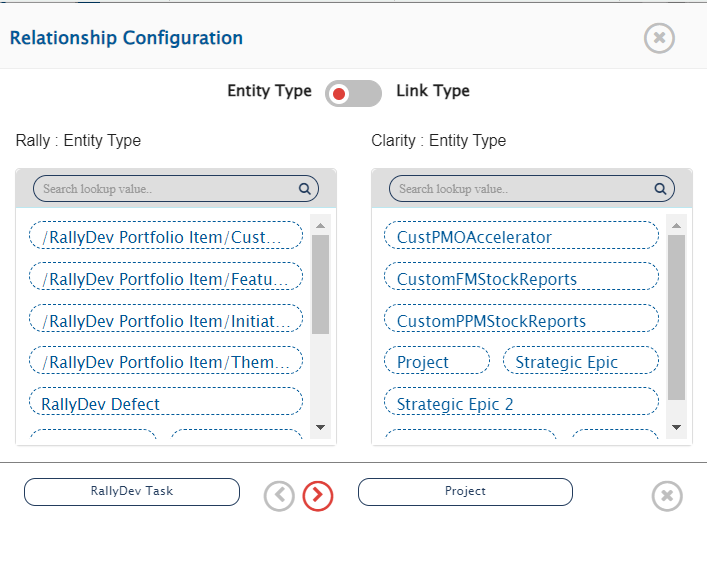
</p>

<p align="center">
  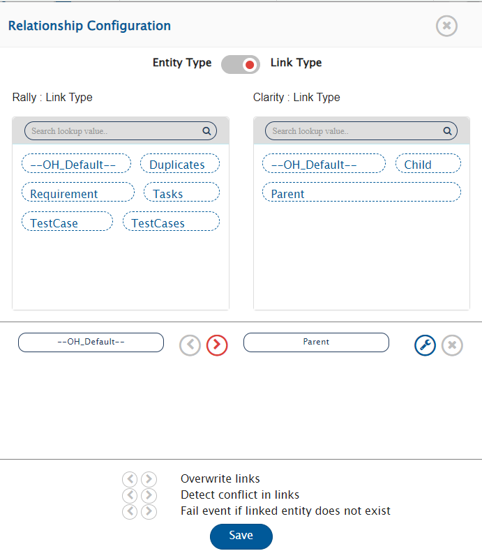
</p>

<p align="center">
  
</p>


## Attachment Configuration

* When Clarity is the target system:
  * It has a limitation to add maximum 10 attachments to an attachment type field. Advanced mapping is required to add more than 10 attachments. Below is the example of advanced mapping to be used where after adding the 10 attachments to the one field, another field will be selected for adding an attachment according to the mapping.
  * For Project entity, by default the attachments will be added in the **Documents** section. For all other entities, first attachment field from the available attachment fields list will be selected for adding the attachments, if advanced mapping is not specified.

```xml
<OHAttachments xmlns:xsl="http://www.w3.org/1999/XSL/Transform">
  <!-- Reverse the order by sorting by position in descending order -->
  <xsl:for-each select="SourceXML/updatedFields/Property/OHAttachments/OHAttachment">
    <xsl:sort select="position()" order="descending"/>
    <xsl:element name="{concat('attachment_', position())}">
      <filename><xsl:value-of select="fileName"/></filename>
      <addedByUser><xsl:value-of select="addedByUser"/></addedByUser>
      <contentLength><xsl:value-of select="contentLength"/></contentLength>
      <contentType><xsl:value-of select="contentType"/></contentType>
      <contentBase64><xsl:value-of select="contentBase64"/></contentBase64>
      <attachmentURI><xsl:value-of select="attachmentURI"/></attachmentURI>
      <updateTimeStamp><xsl:value-of select="updateTimeStamp"/></updateTimeStamp>
      <label><xsl:value-of select="label"/></label>
      <fileComment><xsl:value-of select="fileComment"/></fileComment>
      <attachmentReferenceType><xsl:value-of select="attachmentReferenceType"/></attachmentReferenceType>
      <uniqueCode><xsl:value-of select="uniqueCode"/></uniqueCode>
      <attachmentType>
        <xsl:variable name="xPathVariable" select="attachmentType"/>
        <xsl:choose>
          <xsl:when test="position() &gt;= 1 and position() &lt;= 10">
            <xsl:value-of select="'p_attachment_3'"/>
          </xsl:when>
          <xsl:when test="position() &gt;= 11 and position() &lt;= 20">
            <xsl:value-of select="'p_attachment_2'"/>
          </xsl:when>
          <xsl:when test="position() &gt;= 21 and position() &lt;= 30">
            <xsl:value-of select="'p_custom_attchment'"/>
          </xsl:when>
          <xsl:otherwise>
            <xsl:value-of select="attachmentType"/>
          </xsl:otherwise>
        </xsl:choose>
      </attachmentType>
    </xsl:element>
  </xsl:for-each>
</OHAttachments>
```
* When Clarity is the source system:
  * All the attachments will be synchronized from Clarity to the target system.
  * No advanced mapping is required when Clarity is configured as the source system.
  * Attachment type can optionally be mapped to the corresponding attachment type field in the target system using one-to-one mapping (if required).

## Best Practice for Mapping
* To import mapping, **API Attribute ID** of mapped fields must be same in Clarity as **API Attribute ID** of the fields used during exporting the mapping.

# Integration Configuration
Set a time to synchronize data between Clarity and the other system to be integrated. Also, define parameters and conditions, if any, for integration.

Click [Integration Configuration](../integrate/integration-configuration.md) to learn the step-by-step process to configure integration between two systems.

<p align="center">
  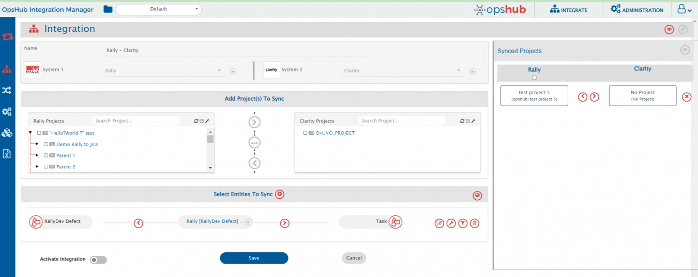
</p>

# Criteria Configuration
* If the user wants to specify conditions for synchronizing an entity between Clarity and the other system to be integrated, he/she can use the Criteria Configuration feature.
* Go to Criteria Configuration section on [Integration Configuration](../integrate/integration-configuration.md) page to learn in detail about Criteria Configuration.
* To configure criteria in Clarity, integration needs to be created with Clarity as the source system.

**Query Samples:**

* Clarity provides filters in its REST API. The same filter format needs to be specified in the criteria and filter queries in OpsHub Integration Manager.
  * **Syntax of a single filter**: ` (<attribute> <operator> <value>)`  
    > **Note**: Parenthesis is required as part of filter.
  * **Syntax to have multiple filters**: `<filter1> and/or <filter2> and/or <filter2>`

* For fetching internal name for queries, refer to [How to get field's Internal name](#how-to-get-fields-internal-name).

| **Field Type**       | **Criteria Description**                                                                 | **Criteria snippet**                                |
|----------------------|------------------------------------------------------------------------------------------|------------------------------------------------------|
| Lookup               | Synchronize all entities which have certain value in Lookup. Value = internal id        | (status = 1)                                         |
| Text                 | Synchronize all entities which has 'UI' in a custom text field 'Effected Area'          | (c_effectedarea = 'UI')                              |
| Boolean              | Synchronize all entities which have true in 'In Plan' Boolean type of field             | (inPlan = true)                                      |
| Date/Time            | Synchronize all entities created on or after certain Date/Time                          | (createdDate >= '2020-08-26T00:00:00')               |
| User                 | Synchronize all entities created by User with user display name 'Shawn, Robert'         | (createdBy = 'Shawn, Robert')                        |
| User and Lookup      | Created by 'Shawn, Robert' and has value in Status                                      | (createdBy = 'Shawn, Robert') and (status = 1)       |
| Lookup or Text       | Value in Status or 'UI' in custom text field                                            | (status = 2) or (c_effectedarea = 'UI')              |

# Target Lookup Configuration

Provide Query in Target Search Query field such that it is possible to search the entity in the Clarity as a destination system. In the target search query field, user can provide a placeholder for the source system's field value in the '@' . Go to Search in Target Before Sync section on  [Integration Configuration](../integrate/integration-configuration.md) page to learn in detail about how to configure target lookup.

For example there is an use case to search an entity in Clarity(Destination system), which has the entity id of the source system in a field named 'TargetCustomField'. The source system's entity id is stored in 'source_system_id'. If the Target Search Query is given as: (TargetCustomField = '@source_system_id@'), then while processing this query @source_system_id@ will be substituted with the value of source_system_id from the source system's entity and then the query will be made to Clarity.

Given below are the sample snippets of how the queries can be used as target entity lookup query in OpsHub Integration Manager:

**Target lookup query samples:**

| **Field Type**     | **Target lookup use case**                                                                                          | **Snippet**                                                |
|--------------------|----------------------------------------------------------------------------------------------------------------------|-------------------------------------------------------------|
| Text               | The id information of the source system entity id is stored in source_system_id. Target lookup on the entity which has source entity's id in 'remoteEntityIdFieldText' field                 | (remoteEntityIdFieldText = '@source_system_id@')            |
| Text and Lookup    | Target lookup on the entity which has source entity's id in 'remoteEntityIdFieldText' field and has certain value in Status   | (remoteEntityIdFieldText = '@source_system_id@') and (status = 1) |
| Lookup or Text     | Target lookup on the entity which has certain value in Status field or has source entity's id in 'remoteEntityIdFieldText' field | (status = 2) or (remoteEntityIdFieldText = '@source_system_id@') |

> **Note**: For more query samples, refer to 'Query Samples' section of Criteria Configuration.


# Known Behaviors

* Conversations are supported as comments by OpsHub Integration Manager.
* Comment synchronization is only supported for Project and Task entities.
* Field-level attachments and documents are supported as attachments by OpsHub Integration Manager.  
  **In case of Project entity**, by default, the attachments will be synced to the **Documents** section.
* To synchronize the Remote Entity Link for the custom investment object or Tasks under the custom investment object, user needs to provide the JSON metadata.  
  For more details, refer to [Understanding JSON Input](#understanding-json-input) section.
* Fields having lookups as user or resource in Clarity attribute configuration are considered as user-type fields in OpsHub Integration Manager.  
  **OpsHub Integration Manager** considers only those users that are visible on the **Users** page of Clarity UI.  
  Refer to [How to find Users list](#how-to-find-users-list) section for more details.
* Entity Mention is not supported by Clarity itself. Therefore, OpsHub Integration Manager does not support it as well.

# Known Limitations

**Limitations due to lack of Clarity API:**
* Entities will be synced without history.

* **Attachments field**:  
  If Clarity is the target system, the attachment mapping should be configured to sync data to different attachment type fields.

* **Comment synchronization**:  
  After adding the comment, the user needs to update one field (System/Custom field) to sync the comment.  
  > **Reason**: In Clarity, entity modified time does not get updated with addition of comment.

* **Attachment synchronization**:  
  After adding the attachment in the **Documents** section for Project entity, the user needs to update one field (System/Custom field) to sync the attachment.  
  > **Reason**: In Clarity, entity modified time does not get updated with addition of document.

* Fields with data type `Time-varying (TSV)` are not supported.
* Weblink synchronization is not supported by OpsHub Integration Manager.

**Inline file synchronization:**
* **When Clarity is the source system**:
  * Inline file/image sync is not supported for HTML fields.
* **When Clarity is the target system**:
  * Inline file/image sync is supported for Task and Project entities **only when comment sync is enabled**.

**Remote Entity Link:**
* **When Task entity is configured**:
  * Remote Entity Link will be generated only up to the parent entity’s task tab, as Clarity does not provide a direct URL to Task.
* **When To Do entity is configured**:
  * Remote Entity Link is not supported.  
    It can only be navigated to through its parent Task, and Clarity does not provide a direct navigation URL for To Do.

# Troubleshooting

* [Clarity FAQs](../help-center/faqs/clarity-faqs.md)
* [Clarity Error Solutions](../help-center/troubleshooting/errors/clarity-error-solutions.md)

# Appendix

## How to add custom field

1. Follow steps in [How to find Attribute list of Specific Object/Entity type](#how-to-find-attribute-list-of-specific-objectentity-type).
2. Click the highlighted **New** button to open the new attribute form.

<p align="center">
  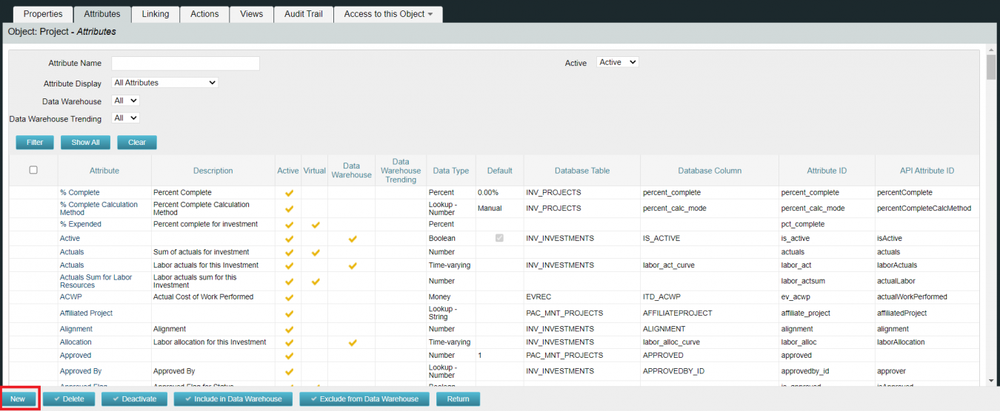
</p>

3. Fill in the form as per your requirements and save it.

<p align="center">
  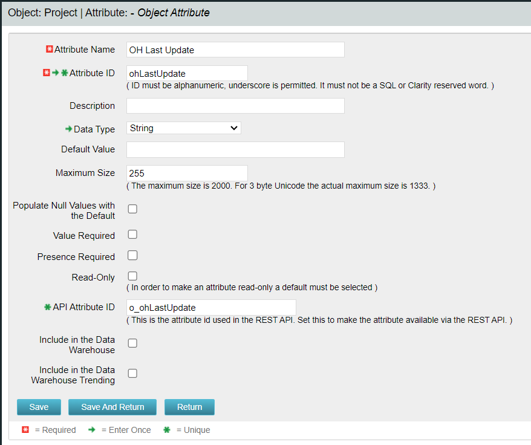
</p>

## How to find Clarity version

1. Log in to Clarity.
2. Click the **Username** icon → Click the **About** option.

<p align="center">
  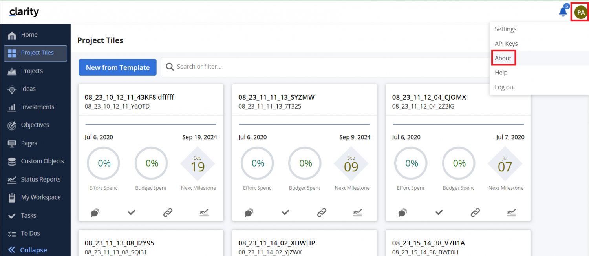
</p>

3. A popup opens. Use the **Modern User Experience Build Number** as your version.

<p align="center">
  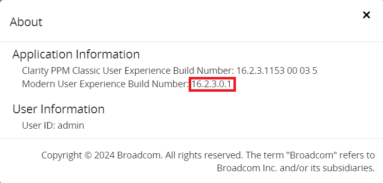
</p>


## How to get field's Internal name

1. Follow steps in [How to find Attribute list of Specific Object/Entity type](#how-to-find-attribute-list-of-specific-objectentity-type).
2. Search for the field in **Attribute Name**, then click the filter.

<p align="center">
  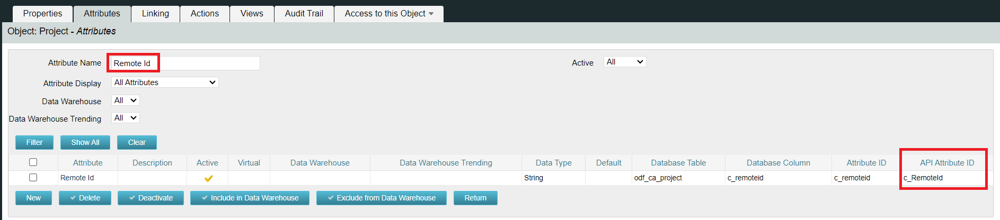
</p>

3. The **API Attribute ID** is the internal name.


## How to find Attribute list of Specific Object/Entity type

1. Log in to Clarity with **Administration Privileges**.
2. Click the **Classic PPM** icon.

<p align="center">
  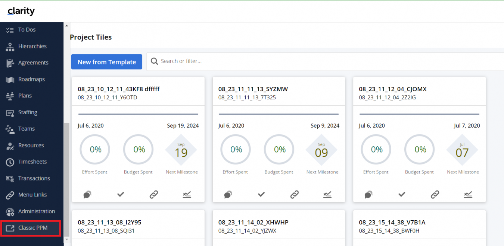
</p>

3. Click the **Administration** icon → Go to **Studio → Objects**.

<p align="center">
  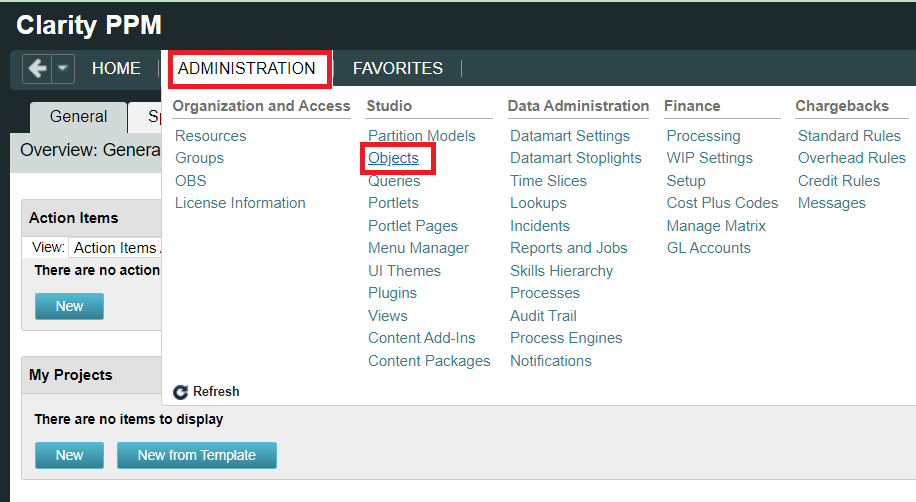
</p>

4. A list of entity types appears.

<p align="center">
  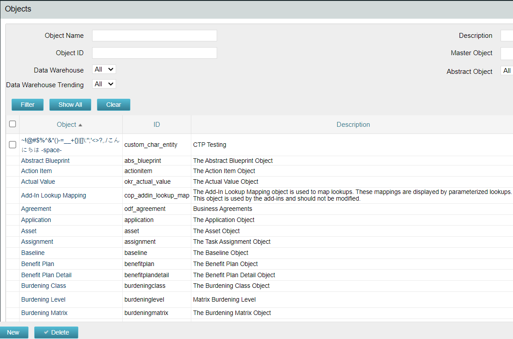
</p>

5. Search (e.g. `Project`) → Filter → Select desired entity.

<p align="center">
  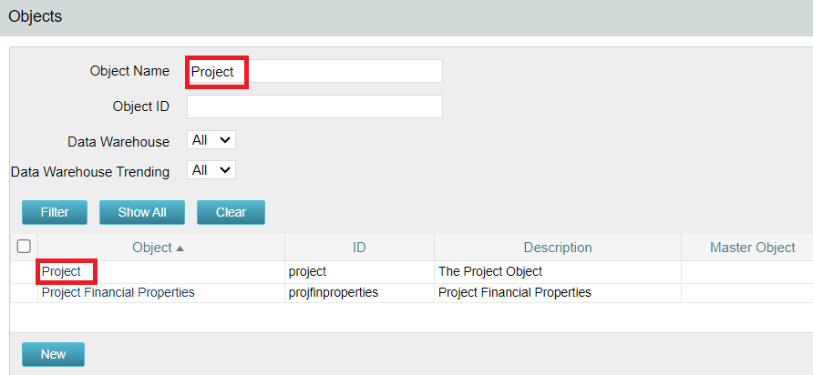
</p>

6. Go to the **Attributes** tab.

<p align="center">
  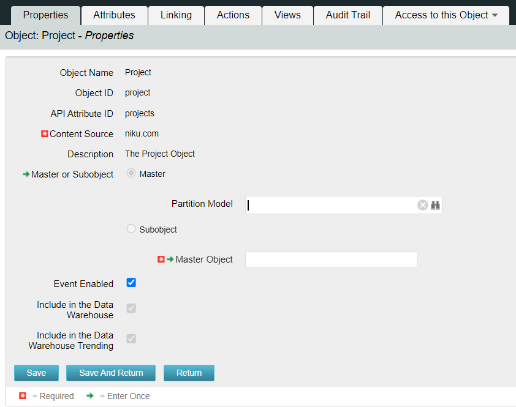
</p>

7. Attributes will be listed.

<p align="center">
  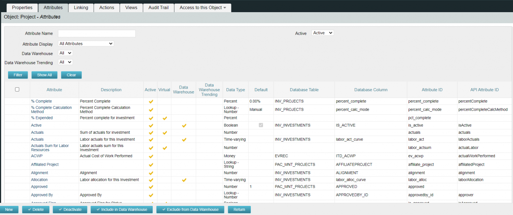
</p>

## How to find Users list

1. Log in to Clarity with **Administration Privileges**.
2. Click the **Administration** icon.
3. Go to the **Users** tab.

<p align="center">
  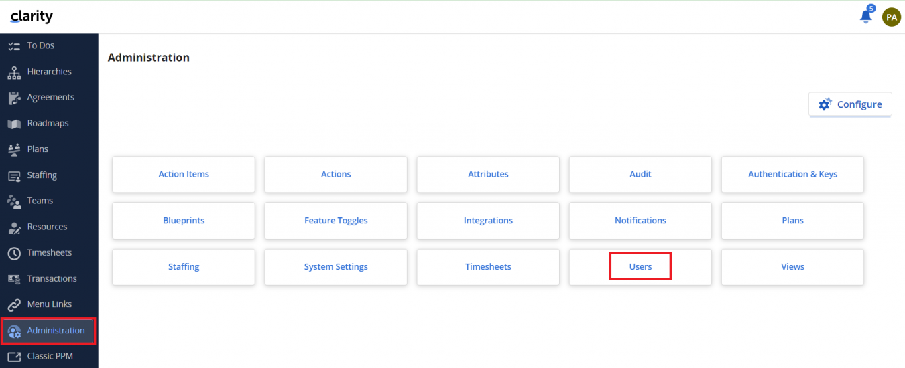
</p>

4. A list of **Active Users** will be displayed.

<p align="center">
  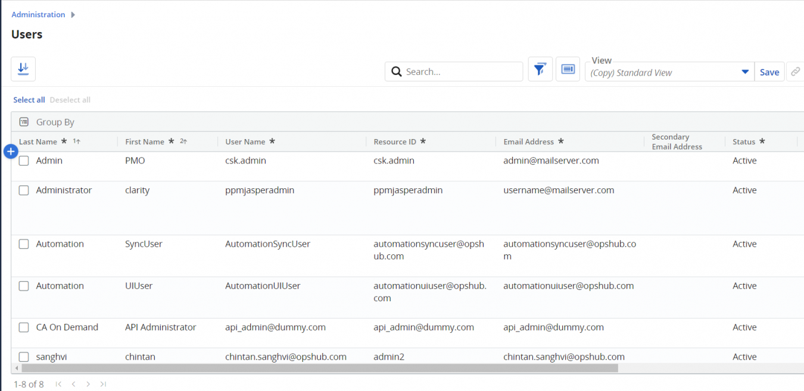
</p>

---

## How to find Custom object's type

1. Log in to Clarity.
2. Click the **Investments** icon from the left panel.

<p align="center">
  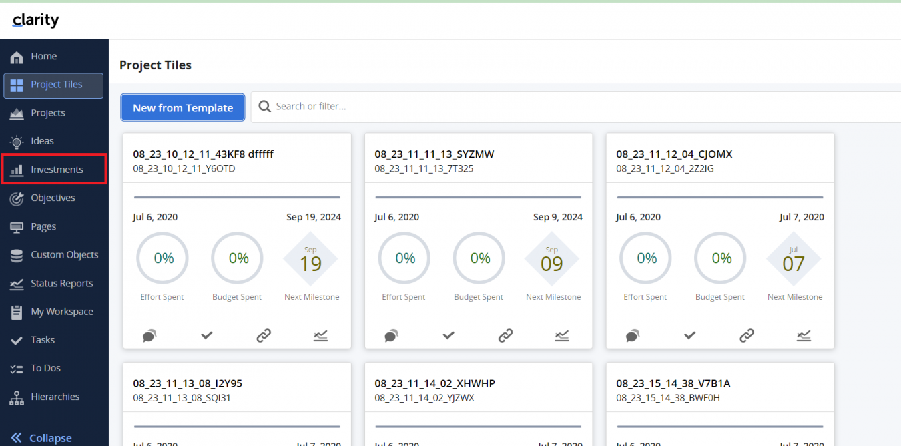
</p>

3. Select the custom object.

<p align="center">
  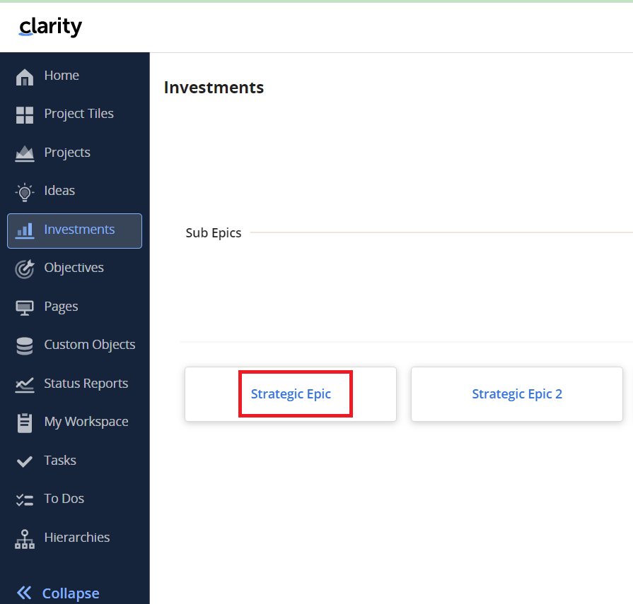
</p>

4. From the URL, get the object type value.

<p align="center">
  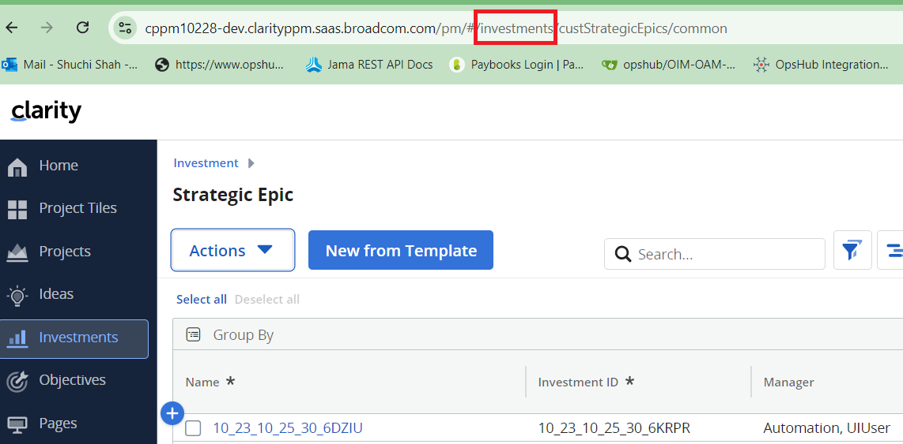
</p>

