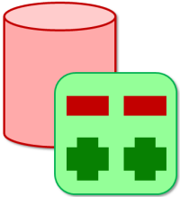

<!-- 

  

    
    <a href="aha.md">Aha!</a>
  

<!-- 

    
    <a href="aha.md" style="  margin-bottom: 08px; color: #005999; font-weight: 500; text-decoration: none; font-size: 10px; transition: color 0.2s ease;">Aha!</a>
  
 -->

  

    
    <a href="aras.md.md">Aras</a>
  

  

    
    <a href="azure-devops.md">Azure DevOps</a>
  

  

    
    <a href="blueprint.md">Blueprint</a>
  

  

    
    <a href="remedy.md">BMC Remedy</a>
  

    
    <a href="clarity.md">Broadcom Clarity</a>

    
    <a href="rally.md">Broadcom Rally Software</a>

    
    <a href="clarity.md">Broadcom Service Desk Manager</a>

    
    <a href="bugzilla.md">Bugzilla</a>

    
    <a href="cherwell.md">Cherwell</a>

    
    <a href="codebeamer.md">Codebeamer</a>

    
    <a href="codebeamer.md">CodebeamerX</a>

    
    <a href="database">Database</a>

    
    <a href="digital.ai-agility.md">Digital.ai Agility</a>

    
    <a href="teamforge.md">Digital.ai TeamForge</a>

    
    <a href="enterprise-architect.md">Enterprise Architect</a>

    
    <a href="fogbuz.md">FogBugz</a>

    
    <a href="gerrit.md">Gerrit</a>

    
    <a href="git.md">Git</a>

    
    <a href="github.md">GitHub</a>

    
    <a href="gitlab.md">GitLab</a>

    
    <a href="helix-alm.md">Helix ALM</a>

    
    <a href="hubspot.md">HubSpot</a>

    
    <a href="ibm-rational-doors-next-generation.md">IBM Engineering Requirements Management(DOORS NextGen)</a>

    
    <a href="etm.md">IBM Engineering Test Management</a>

    
    <a href="ibm-ewm.md">IBM Engineering Workflow Management</a>

    
    <a href="ibm-rational-clearquest.md">IBM Rational ClearQuest</a>

    
    <a href="doors.md">IBM Rational DOORS</a>

    
    <a href="jama.md">Jama Connect</a>

    
    <a href="jenkins.md">Jenkins</a>

    
    <a href="jira-align.md">Jira Align</a>

    
    <a href="jira.md">Jira Cloud / Data Center</a>

    
    <a href="jirazephyrscale.md">Jira Zephyr</a>

    
    <a href="msdynamics.md">Microsoft Dynamics 365</a>

    
    <a href="almoctane.md">OpenText ALM Octane</a>

    
    <a href="micro-focus-alm-qc.md">OpenText ALM Quality Center</a>

    
    <a href="caliberrm.md">OpenText Project & Portfolio Management</a>

    
    <a href="pagerduty.md">PagerDuty</a>

    
    <a href="planviewadaptivework.md">Planview AdaptiveWork</a>

    
    <a href="readyone.md">ReadyOne</a>

    
    <a href="redmine.md">Redmine</a>

    
    <a href="salesforce.md">Salesforce</a>

    
    <a href="sap.md">SAP</a>

    
    <a href="selenium.md">Selenium</a>

    
    <a href="servicenow.md">ServiceNow</a>

    
    <a href="servicenow-express.md">ServiceNow Quick Connect</a>

    
    <a href="slack.md">Slack</a>

    
    <a href="snowflake.md">Snowflake</a>

    
    <a href="broken">Subversion</a>

    
    <a href="testrail.md">TestRail</a>

    
    <a href="trac.md">Trac</a>

    
    <a href="tricentis-qTest.md">Tricentis qTest</a>

    
    <a href="tricentis-tosca.md">Tricentis Tosca</a>

    
    <a href="vManager.md">Verisium Manager</a>

    
    <a href="windchillrv&s.md">Windchill RV&S</a>

    
    <a href="zendesk.md">Zendesk</a>

-->

<table data-view="cards">
   <thead>
      <tr>
         <th></th>
         <th data-hidden data-type="content-ref"></th>
         <th data-hidden data-card-target data-type="content-ref"></th>
      </tr>
   </thead>
   <tbody>
      <tr>
         <td>Aha!</td>
         <td><a href="aha.md">Aha!</a></td>
         <td><a href="aha.md">Aha!</a></td>
      </tr>
      <tr>
         <td>Aha!</td>
         <td><a href="aha.md">Aha!</a></td>
         <td><a href="aha.md">Aha!</a></td>
      </tr>
      <tr>
         <td>Aha!</td>
         <td><a href="aha.md">Aha!</a></td>
         <td><a href="aha.md">Aha!</a></td>
      </tr>
      <tr>
         <td>Aha!</td>
         <td><a href="aha.md">Aha!</a></td>
         <td><a href="aha.md">Aha!</a></td>
      </tr>
   </tbody>
</table>

<!--

Marking table hide.

| [Aha!](aha.md)                                  | [Aras](aras.md)                                    | [Azure DevOps](azure-devops.md)                                     |
|-------------------------------------------------|----------------------------------------------------|---------------------------------------------------------------------|
| [Blueprint](blueprint.md)                       | [BMC Remedy](remedy.md)                            | [Clarity](ca_ppm.md)                                                |
| [Rally Software](rally.md)                      | [Service Desk Manager](ca_service_desk_manager.md) | [Bugzilla](bugzilla.md)                                             |
| [Cherwell](cherwell.md)                         | [Codebeamer](codebeamer.md)                        | [Codebeamer X](codebeamerx.md)                                      |
| [Database](database_integration.md)             | [Digital.ai Agility](digital.ai_agility.md)        | [TeamForge](teamforge.md)                                           |
| [Enterprise Architect](enterprise_architect.md) | [Fogbugz](fogbugz.md)                              | [Gerrit](gerrit.md)                                                 |
| [Git](git.md)                                   | [GitHub](github.md)                                | [GitLab](gitlab.md)                                                 |
| [Helix ALM](helix_alm.md)                       | [HubSpot](hubspot.md)                              | [DOORS Next](ibm_engineering_requirements_management_doors_next.md) |
| [ETM](etm.md)                                   | [EWM](ibm_ewm.md)                                  | [ClearQuest](ibm_rational_clearquest.md)                            |
| [Rational DOORS](ibm_rational_doors.md)         | [Jama Connect](jama.md)                            | [Jenkins](jenkins.md)                                               |
| [Jira Align](jira_align.md)                     | [Jira](jira.md)                                    | [MS Dynamics 365](ms_dynamics_365.md)                               |
| [ALM Octane](alm_octane.md)                     | [ALM/QC](micro_focus_alm_qc.md)                    | [PPM](caliber_rm.md)                                                |
| [PagerDuty](pagerduty.md)                       | [AdaptiveWork](planview_adaptivework.md)           | [ReadyOne](readyone.md)                                             |
| [Redmine](redmine.md)                           | [Salesforce](salesforce.md)                        | [SAP](sap.md)                                                       |
| [Selenium](selenium.md)                         | [ServiceNow](servicenow.md)                        | [SN Quick Connect](servicenow_quick_connect.md)                     |
| [Slack](slack.md)                               | [Snowflake](snowflake.md)                          | [Subversion](subversion.md)                                         |
| [TestRail](testrail.md)                         | [Trac](trac.md)                                    | [Tricentis qTest](tricentis_qtest.md)                               |
| [Tricentis Tosca](tricentis_tosca.md)           | [Verisium Manager](verisium_manager.md)            | [Windchill RV&S](windchill_rvs.md)                                  |
| [Zendesk](zendesk.md)                           |                                                    |                                                                     |

-->
