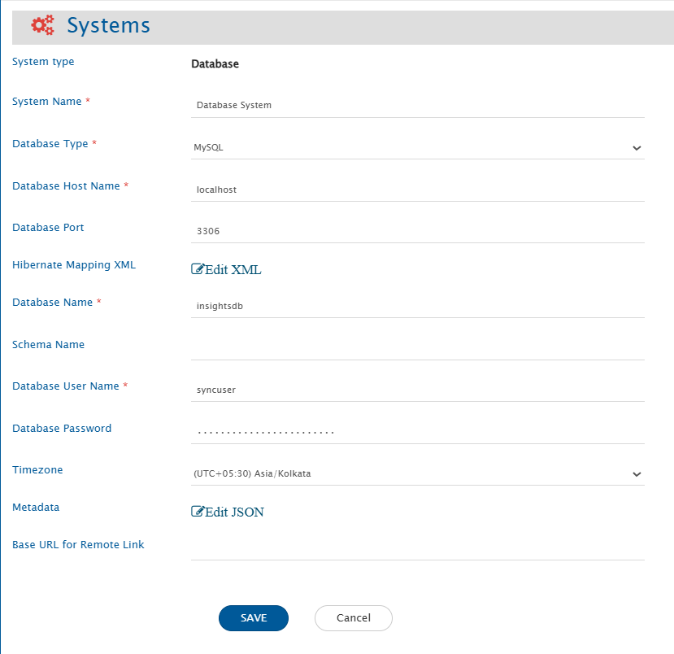
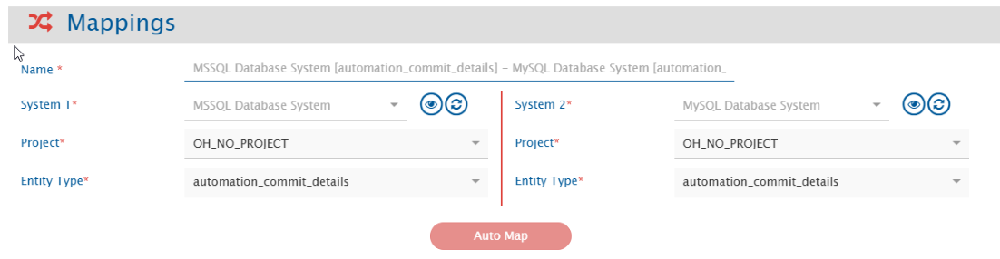
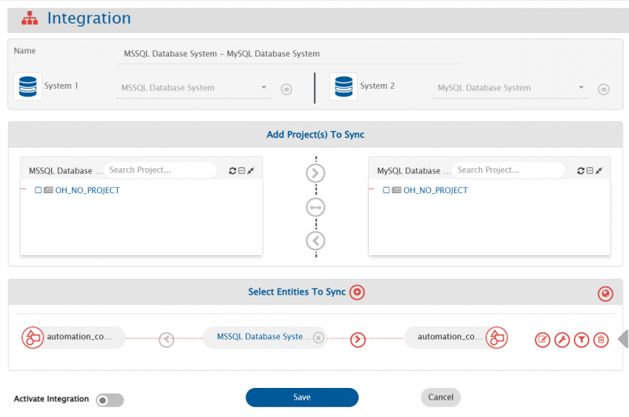

# Prerequisites

## Integration user
- A dedicated user should be created for the database integration. This user must have read and write access on the database table and read access on the view that needs to be integrated.  
- This user should not be used to perform any other operations on the database.

## When database integration is required to communicate to a new database server
If a database system is needed to be integrated with a database type other than the type of database on which OpsHub Integration Manager is deployed, follow the steps given below:
- Download the required database driver on which new database connection is to be created. Refer [this](Installation_Prerequisites#Download-Database-Connector-jar) to get the link of database connector jar.
- Stop the OpsHub Integration Manager server.
- Copy the downloaded driver into `Opshub installation directory]\OpsHubServer\lib` folder.
- Start OpsHub Integration Manager server.

## Fields requirement
- **Primary-key**: There must be a primary key field or a field which doesn't allow duplicate or null values.
- **Updated Time**: There should be a datetime or timestamp column storing last updated time of the record. It is mandatory to have this column when using database system at source side of integration. However, this column is optional when using database system at target side of integration.
- **Created Time**: It is required when bi-directional sync needs to be performed using the database system. There should be a datetime or timestamp column storing the time of creation of the record. However, this column is optional in all the scenarios other than the bi-directional sync scenario.
- **Created/Updated By (Optional)**: A column to store the username of the person who created or last updated the record.
- **OH_Last_Update (Optional)**: A text column to store required information for the recovery.

> **Note**: The columns storing "created/updated by" and "OH_Last_Update" are required by OpsHub Integration Manager to ensure smooth data synchronization, especially if something goes wrong during the sync process.  
> Without these columns, during the synchronization, all record field values are compared with the existing values, which is inefficient.

# System Configuration
- Before you start the integration configuration, you must first configure database system.  
- Click [System Configuration](../integrate/system-configuration.md) to learn the step-by-step process to configure a system.

Here is the screenshot: 
 
<p align="center">
  
</p>


## Database System form details

| **Field Name** | **Description** |
|----------------|-----------------|
| **System Name** | Provide the system's name |
| **Database Type** | Select the database type for which you want to create a new database system. Currently supported databases are: 1. MySQL 2. MS SQL Server/Azure SQL 3. Oracle 4. PostgreSQL 5. MariaDB |
| **Database Host Name** | The name of the host machine where the database server is deployed |
| **Database Port** | Port number on which database server is deployed. Generally, default ports for MySQL/MariaDB is 3306, MS SQL Server/Azure SQL is 1433, Oracle is 1521, and PostgreSQL is 5432 |
| **Instance Name** | Instance name of the MS SQL Server/Azure SQL, if it is a named instance. Applicable to MS SQL Server only |
| **Database Name** | Name of the database to connect with |
| **Schema Name** | Default schema of the database to connect with. Mandatory for MS SQL Server/Azure SQL and PostgreSQL |
| **Database User Name** | Provide the user name of a dedicated user that will be used for communicating with database. User should have the read and write permission on database |
| **Database Password** | Provide the password for the user provided in Database User Name |
| **Timezone** | Select the timezone for date and time values. If not selected, UTC timezone will be considered by default |
| **Hibernate Mapping XML** | XML mapping required to map the columns of database table with some properties. For more details, refer to [Understanding Hibernate XML Input](#understanding-hibernate-xml-input) section. |
| **Metadata** | Provide the table name and column which is used to sync links, comments, or attachments. Refer to the [Understanding Metadata JSON Input](#understanding-metadata-json-input) section for details on format and JSON structure. |

## Understanding Hibernate XML Input

- This is hibernate XML mapping for tables in which data needs to be integrated. If multiple tables need to be integrated then add one class element for each table in this input widget.
- The tables that are mapped in hibernate mapping XML will be visible in mapping and integration screens.
- Properties that are mapped with column names of table will be visible as fields.
- The column name of primary column can be anything but the property name must be `id`.
- If no value needs to be mapped with the ID column and an auto-generated value is to be added to it, the generator class can be set to `'increment'`. The data type of the ID column must be an integer when the generator class is added.  
  Example:
  ```xml
  <id name="id" type="integer">
      <column name="sr_no"/>
      <generator class="increment"/>
  </id>
  ```
* The column in the table which stores time of the last update on the record needs to be mapped with the 'updated_time' property. It is optional when there is no need to read data using database system.
* The column in the table which stores time of the creation of the record needs to be mapped with 'created_time' property. It is required only when bi-directional sync needs to be set-up for the database system.
* For the efficient recovery, the following columns need to be mapped correctly:
  * There should be a column in the table to store username of user who created or last updated that record. This column needs to be mapped with created_updated_by property. The data type for created_updated_by field should be varchar(100).
  * There should be a column in the table that needs to be mapped with OH_Last_Update property. The data type for OH_Last_Update field should be varchar(100).
* Here is the sample Hibernate XML:
```xml
<?xml version="1.0"?>
<!DOCTYPE hibernate-mapping PUBLIC "-//Hibernate/Hibernate Mapping DTD 3.0//EN" "http://www.hibernate.org/dtd/hibernate-mapping-3.0.dtd">
<hibernate-mapping>
  <class entity-name="automation_commit_details" table="automation_commit_details">
    <id name="x_oh_uuid" type="string">
      <column name="x_oh_uuid"/>
    </id>
    <property name="event_uuid" column="event_uuid" type="string" />
    <property name="oh_system_id" column="oh_system_id" type="integer" />
    <property name="commit_id" column="commit_id" type="string" />
    <property name="commit_time" column="commit_time" type="timestamp" />
    <property name="author_email" column="author_email" type="string" />
    <property name="committer_email" column="committer_email" type="string" />
    <property name="reviewer" column="reviewer" type="string" />
    <property name="oh_commit_type" column="oh_commit_type" type="string" />
    <property name="commit_message" column="commit_message" type="string" />
    <property name="entity_id" column="entity_id" type="string" />
    <property name="created_time" column="created_time" type="timestamp" />
    <property name="updated_time" column="updated_time" type="timestamp" />
    <property name="created_updated_by" column="created_updated_by" type="string" />
    <property name="OH_Last_Update" column="OH_Last_Update" type="string" />
  </class>
</hibernate-mapping>
```

## Understanding Metadata JSON Input

* You can provide metadata for complex data types, such as links, comments, and attachments associated with a record, in JSON format here.

An example input for the metadata JSON:



# Mapping Configuration

* Map the fields between the database and the other system to be integrated to ensure that the data between both the systems synchronize correctly.  
* Refer to [Mapping Configuration](../integrate/mapping-integration.md) page to learn the step-by-step process to configure mapping between the systems.

* Here is the screenshot:  

<p align="center">
  
</p>


> **Note** Field having foreign key constraint will be shown as Reference type of field. It should contain valid ID value of the table it refers to.  
>
> **Note** Workflow Transition is not applicable for database connector.

# Integration Configuration

* In this step, set a time to synchronize data between the database and the other system to be integrated. Also, define parameters and conditions, if any, for integration.  
* Refer to [Integration Configuration](../integrate/integration-configuration.md) page to learn the step-by-step process to configure integration between two systems.

Here is the screenshot:  

<p align="center">
  
</p>


## Criteria Configuration

* If the user wants to specify conditions for synchronizing an entity from database as source system to the other system, the criteria must be configured. Navigate to [Integration Configuration → Criteria Configuration](../integrate/integration-configuration.md#criteria-configuration) section on [Integration Configuration](../integrate/integration-configuration.md) page to learn in detail about Criteria Configuration.  

* Set the query as per database supported query format. Criteria is applicable to any column in table. Only the where clause part of the SQL query is supported.

**Criteria query samples**

| Field Name   | Criteria query usecase                                      | Snippet                             |
|--------------|-------------------------------------------------------------|-------------------------------------|
| order_value  | Need to fetch only those records having order_value > 5000  | `order_value > 5000`                |
| order_status | Need to fetch only those records having status = 'Active'   | `order_status = 'Active'`           |
| order_date   | Fetch only records where order_date is after a date         | `order_date >= '2024-08-15 12:00:00'` <br> Here datetime format needs to be same as the format of the field |

> Here datetime format needs to be same as the format of the field.

* User can also add composite query consisting of more than one columns. For example:  
  `order_value > 5000 AND order_status = 'Active'`

> **Note** The name of the field mentioned in criteria query should be same as the actual name of the field in table.

## Target LookUp Configuration

* Provide query in Target Search Query field such that it is possible to search the entity in the database as the target system. In the target search query field, the user can provide a placeholder for the source system's field value between the '@'.

* Go to [Search in Target Before Sync](../integrate/integration-configuration.md#search-in-target-before-sync) section on [Integration Configuration](../integrate/integration-configuration.md) page to learn in detail about how to configure Target LookUp.

* Overall, Target LookUp Query is similar to [Criteria Configuration](#criteria-configuration), except that the value part contains a field name between '@' instead of static value.

**Target LookUp query samples**

| Field Name | Target lookup usecase                                                | Snippet                             |
|------------|----------------------------------------------------------------------|-------------------------------------|
| order_id   | Target lookup on entity with matching source entity id in order_id   | `order_id = '@source_entity_id@'`   |

> **Note** The name of the field mentioned in target lookup query should be same as actual name of the field in table.

# Known Behavior and Limitations

* The `id` field can be mapped to any other field in another system. However, when using a database system as the target system and mapping the `id` field of a database table to a field may generate duplicate values. As a result, an error will occur, since databases do not allow duplicate values in the primary key column.

* When using database system as source system, it will fetch the records from table based on `id` and the field is mapped to `updated_time`. A record will be fetched from the table only if its `updated_time` value meets one of the these conditions:
  * It is greater than or equal to the time of the last processed record.
  * It is greater than or equal to the time specified in the "Start Polling Time" field on the advance integration configuration.

* If a table's username column mapped to `created_updated_by` is the same as the username in the database system form, records will be skipped during polling time.

* For Attachment sync, attachment file names must not contain characters that are unsupported by the operating system on which the `OpsHub Integration Manager` is installed.  
  For example, on Windows, characters such as `\ / : * ? " < > |` are not allowed in file names.


