<span style="color:#DE413A;">Digital.ai Agility (Formerly known as VersionOne).</span>

# Prerequisites 

## User privileges

* Create one user of Digital.ai Agility system, dedicated to integration. User should not be used to do any operations from Digital.ai Agility's user interface. 
* Integration user should have atleast the minimum **Team Member** role through which he/she must be able to create/update work item.
* If Digital.ai Agility Project/Release Entity needs to be created/updated through integration, then Integration user should have at the minimum **Project Admin** role.
* For further information on how to set the access rights on project, please refer to the Appendix section [How to add permissions on Project](#how-to-add-permissions-on-project).

## Linking BuildRuns with ChangeSets

* A special build parameter needs to be created in the source system, for example, Jenkins project which is used for synchronization. The parameter's name and type are specified below. 
* The same source system's build parameter created above should be mapped with Digital.ai Agility's field 'ChangeSets.ID' during field mapping configuration of Digital.ai Agility BuildRuns.

| **Parameter Name** | **Parameter Type** |
|--------------------|--------------------|
| ChangeSetId        | String             |

# System Configuration

Before you continue with the integration, you must first configure Digital.ai Agility. Click [System Configuration](../integrate/system-configuration.md) to learn the step-by-step process to configure a system. Refer to the screenshot given below:

<p align="center">
  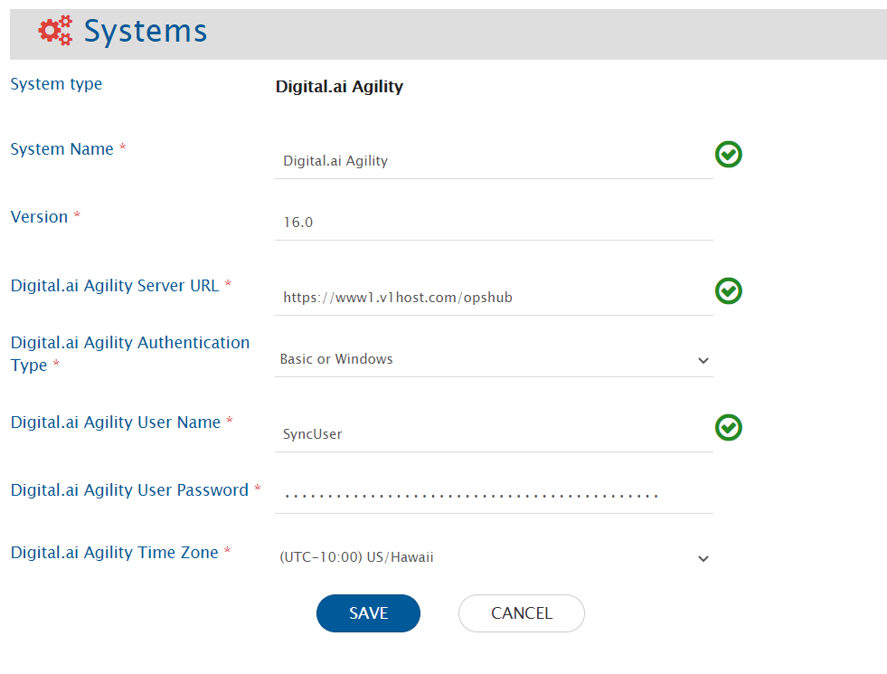
</p>


If the system is deployed on HTTPS and a self-signed certificate is used, then you will have to import the SSL Certificate to be able to access the system from OpsHub Integration Manager. Click [Import SSL Certificates](../getting-started/how-to-import-a-certificate.md) to learn how to import SSL certificate.

<span style="color:blue">**Digital.ai Agility System form details**</span>

| **Field Name**                     | **Description** |
|-----------------------------------|-----------------|
| **System type**                   | Select the system type you want to configure |
| **System Name**                   | Give a unique name to the system |
| **Version**                       | Provide the version of your Digital.ai Instance. To find out the version of Digital.ai Agility, refer to [Find the version of Digital.ai Agility](#find-the-version-of-digital.ai-agility-instance) |
| **Digital.ai Agility Server URL** | Digital.ai Agility Server URL is used for connecting to Digital.ai Agility application |
| **Digital.ai Agility Authentication Type** | Digital.ai Agility Authentication Type to be used for authentication |
| **Digital.ai Agility Time Zone**  | Digital.ai Agility Time Zone-you can find this information from /config.v1. Based on this information, you can accordingly select the timezone. E.g., if TimeZoneId field in /config.v1 is shown as Eastern Time, then you need to select 'USEastern'. If TimeZoneId field has some other value, then select appropriate value accordingly |

# Mapping Configuration

Map the fields between Digital.ai Agility and the other system to be integrated to ensure that the data between both the systems synchronize correctly.  
Click [Mapping Configuration](../integrate/mapping-configuration.md) to learn the step-by-step process to configure mapping between the systems.

>**Note**: When Digital.ai Agility system is the destination system , it is mandatory to set **Project Path** field. In this field, you can select the Digital.ai Agility Project to be integrated.

## Advanced Mapping Use Case

* If the user wants to take the decision based on the **unmapped** field in the **advanced mapping** of any **mapped** field, then the unmapped field's Xpath can be configured using the specific XSL patterns.

For example, **Description** field is mapped in the mapping, and the **ComplexityRank** field is not mapped in the mapping. If the user wants to take decision based on **ComplexityRank** field in the advanced mapping of **Description** field, then the user can define the source Xpath for ComplexityRank, using the below XSL patterns:

### XSL Pattern: Any tag where prefix is XSL and Attribute is `select`

**Example:**
```xml
<Description>
  <xsl:variable name="Value" xmlns:xsl="http://www.w3.org/1999/XSL/Transform"
    select="SourceXML/updatedFields/Property/ComplexityRank" />
  <xsl:value-of xmlns:xsl="http://www.w3.org/1999/XSL/Transform"
    select="concat(SourceXML/updatedFields/Property/Description,$Value)"/>
</Description>
```

---

### XSL Pattern: Tag is `<xsl:if>` and Attribute is `test`

**Example:**
```xml
<Description>
  <xsl:if xmlns:xsl="http://www.w3.org/1999/XSL/Transform"
    test="SourceXML/updatedFields/Property/ComplexityRank != ''">
    <xsl:value-of xmlns:xsl="http://www.w3.org/1999/XSL/Transform"
      select="SourceXML/updatedFields/Property/Description"/>
  </xsl:if>
</Description>
```

---

### XSL Pattern: Tag is `<xsl:when>` and Attribute is `test`

**Example:**
```xml
<Description>
  <xsl:choose xmlns:xsl="http://www.w3.org/1999/XSL/Transform">
    <xsl:when test="SourceXML/updatedFields/Property/ComplexityRank != ''">
      <xsl:value-of xmlns:xsl="http://www.w3.org/1999/XSL/Transform"
        select="SourceXML/updatedFields/Property/Description"/>
    </xsl:when>
  </xsl:choose>
</Description>
```


## Mapping for Soft Delete Configuration

* When Digital.ai Agility is the target system in the integration, the Soft delete operation is performed by default in the synchronization of the [Source Delete event](../integrate/source-delete-synchronization.md).
* After the soft delete operation is performed by OpsHub Integration Manager in Digital.ai Agility, the entity will be deleted in the Digital.ai Agility.
* To only enable the logical delete operation in the target, "IsDeleted" field shall be mapped with the default value "No" in the [Delete Mode](../integrate/mapping-configuration.md#delete-mode) mapping.

>**Note**: For the "Actual" entity, the Soft delete operation is not available due to API limitation.

# Integration Configuration

Set a time to synchronize data between Digital.ai Agility and the other system to be integrated. Also, define parameters and conditions, if any, for integration.  
Click [Integration Configuration](../integrate/integration-configuration.md) to learn the step-by-step process to configure integration between two systems.

<p align="center">
  
</p>


**Note:** As per OpsHub Integration Manager's default behavior, when you integrate projects that have child projects, child projects' entities also sync when integration starts.

Look at the sample below. The 'Demo Project' shown here has two child projects as well. That means when you integrate 'Demo Project', child projects within it - CAB Approval and eCAB Approval - will also sync by default.

<p align="center">
  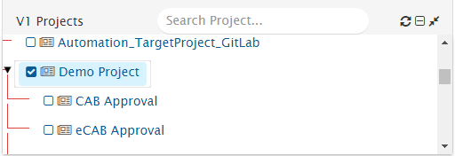
</p>

To avoid this behavior, you can configure criteria in a manner that child projects are excluded during the integration. For example, you can set a query that specifies that data from only the project in the given integration's scope has to be synchronized.

The criteria query, in this case, should be:  
**Scope.Name = 'Project Name for which entities needs to be sync'.**

Example:  
**Scope.Name = 'Demo Project'**

<p align="center">
  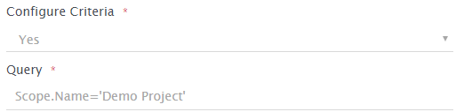
</p>


To sync multiple projects, the criteria query should be:  
**Scope.Name='Project 1'\|Scope.Name='Project 2'**

<p align="center">
  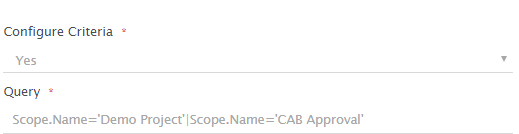
</p>


Click [Criteria Configuration](#criteria-configuration) to learn how to configure criteria.

## Additional Settings

### Actuals Sync

Digital.ai Agility's Actuals allow users to log time that they spend working on issues. Actuals can be created on Story, Defect, and Task.

#### Ways to Sync Actuals

There are two ways to sync Actuals.  
* Actuals as a field of the parent entity (Defect, Task, Story)  
* Actuals as a separate entity with the parent entity, for example child relation between Actuals and parent entity

>**Note**: Actual as entity is the preferred approach. Do not use both the approaches together as it will lead to inconsistent data in end system.

##### Sync Actuals as a field of parent entity

If you want to sync Actuals, then you can map the following fields during field mapping of the parent entities.

| **Actual Field Name** | **Data Type** | **Is Read-Only?** | **Description** |
|-----------------------|---------------|-------------------|------------------|
| Estimate              | [Timeunit]    | No                | Original Estimate to complete the work |
| ToDo                  | [Timeunit]    | No                | Remaining time left to complete the work |
| Actuals.Value         | [Timeunit]    | No                | Time spent working on an issue i.e. Time logged in actual. |
| Actuals.Date          | Date          | No                | Date on which the work was logged |
| Actuals.Member        | User          | No                | User who logged the work and created actual |

Please ensure to turn off the **Conflict Detection** flag for these fields, and turn on the **Overwrite** flag when configuring field mapping. For further details, please refer to [Field Mapping Configuration](field-mapping-configuration).

##### Known Limitations

1. Conflict Detection will not work on Worklog fields.  
2. If overwrite flag is turned off for actual fields, new value will not be written in the target.  
3. If an update is made on one Actual, the update will not synchronize to the corresponding worklog created in target system.

##### Sync Actuals as a different entity

If you want to sync Actuals as a different entity, then you can map the following fields during field mapping of Digital.ai Agility entities:

| **Actual Field Name** | **Data Type** | **Is Read-Only?** | **Description** |
|-----------------------|---------------|-------------------|------------------|
| Date                  | Date          | No                | Date on which actual was logged |
| Member                | User          | No                | User who logged the actual |
| Value                 | [Timeunit]    | No                | Time spent working on an issue i.e. time logged in actual. |
| Project Path          | Date          | Yes               | Project path of parent work item |
| Workitem.Number       | Text          | Yes               | Display Id of parent entity |

To sync Actuals as a different entity, you need to configure a different integration for Actuals and provide issue relationship in the field mapping.  
* Give parent entity relationship in **issue relationship** during Actuals field mapping.  
* Select parent entities whose Actuals you want to sync during integration configuration of Actuals.

##### Default Behavior

* If Actuals.Date is not mapped, Actuals will be created on current date.  
* If Actuals.Member is not mapped or mapped with an incorrect value (user email does not exist in Digital.ai Agility), Actuals will be created by the integration user.

# Criteria Configuration

## Query

Query in **Digital.ai Agility** system is the valid **Digital.ai Agility** Rest API based criteria query, which is valid against **Digital.ai Agility** metadata. To validate metadata, refer to Rest API URL e.g [https://www12.v1host.com/<appinstance>/meta.v1/Story]. Within that one can get property name from `DisplayAttribute` tag.

For example:
```xml
<DisplayByAttribute href="https://www12.v1host.com/partner_opshub2/meta.v1/Story/Priority.Name" tokenref="Story.Priority.Name"/>
```
Where `Priority.Name` is a valid field on which one can specify query.

## Sample Query

- **Priority.Name="High";ChangeDate&gt;="2010-09-24T14:35:35.041"**

* An example of criteria with one 'Lookup field (System Lookup field)':  
  `Priority.Name="High"`

* An example of criteria with one custom Lookup field and one date field:  
  `Custom_StartDate="2010-09-24T14:35:35.041";Custom_Effort="1"`

* An example of criteria with 'contains on text field or created by (or some other user field) = some user':  
  `CreatedBy.Username="syncuser"`

---

# Known Limitations

## Epic Planned End Date or Sprint End Date

Digital.ai Agility API returns actual date + 1 in Planned end date field of Epic and end date of Sprint. Therefore, there will be a difference of 1 day when synchronizing this field.
When Digital.ai Agility is the source system, following sample Advance XSL can be used to overcome this limitation:

### When Digital.ai Agility is the source system:

```xml
<Target_Field>
  <xsl:if xmlns:xsl="http://www.w3.org/1999/XSL/Transform" test="SourceXML/updatedFields/Property/PlannedEnd">
    <xsl:variable name="sourceFormat" select="'yyyy-MM-dd'"/>
    <xsl:variable name="targetFormat" select="'yyyy-MM-dd'"/>
    <xsl:variable name="calendarVar" select="utils:getCalendar(SourceXML/updatedFields/Property/PlannedEnd,$sourceFormat)"/>
    <xsl:value-of select="cal:add($calendarVar,5, -1)"/>
    <xsl:value-of select="utils:transformCalender($calendarVar, $targetFormat)"/>
  </xsl:if>
</Target_Field>
```
Replace Target_Field with the internal name of target field.

When Digital.ai Agility is target system, following sample Advance XSL can be used to overcome this limitation:

### When Digital.ai Agility is the target system:

```xml
<PlannedEnd>
  <xsl:if xmlns:xsl="http://www.w3.org/1999/XSL/Transform" test="SourceXML/updatedFields/Property/Source_Field">
    <xsl:variable name="sourceFormat" select="'yyyy-MM-dd'"/>
    <xsl:variable name="targetFormat" select="'yyyy-MM-dd'"/>
    <xsl:variable name="calendarVar" select="utils:getCalendar(SourceXML/updatedFields/Property/Source_Field,$sourceFormat)"/>
    <xsl:value-of select="cal:add($calendarVar,5, 1)"/>
    <xsl:value-of select="utils:transformCalender($calendarVar, $targetFormat)"/>
  </xsl:if>
</PlannedEnd>
```
Replace `Source_Field` from above XSL with the internal name of source field.

## Username of the User if not set

When Digital.ai Agility is the source system, and the user type field is mapped for sync, and the username of that user is not set. Then, in that case, the user will be read as empty, and synchronization will happen according to the mapping configuration.


# Appendix

## Find the version of Digital.ai Agility Instance

1. Open Digital.ai Agility instance login page e.g.,  
   [https://www1.v1host.com/<appinstance>](https://www1.v1host.com/<appinstance>)

2. You can find the version of Digital.ai Agility instance on this page as shown in the image below:
   
<p align="center">
  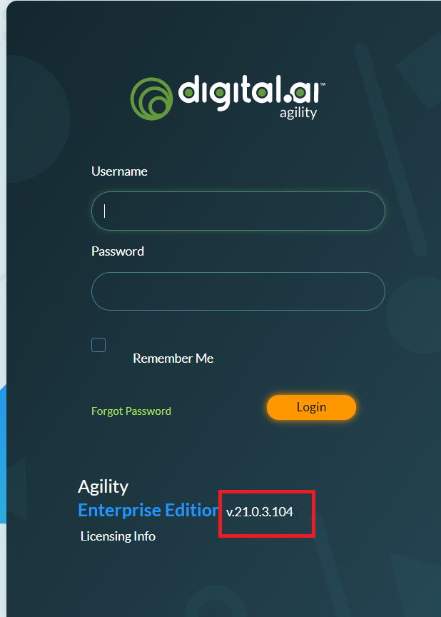
</p>


---

## How to add permissions on Project

1. Log-in to **Digital.ai Agility** with user having administrative privileges.  
2. Navigate to **Admin** tab.  
3. In **Projects** tab navigate to **Member Roles** tab and find the project on which permission need to be granted.

<p align="center">
  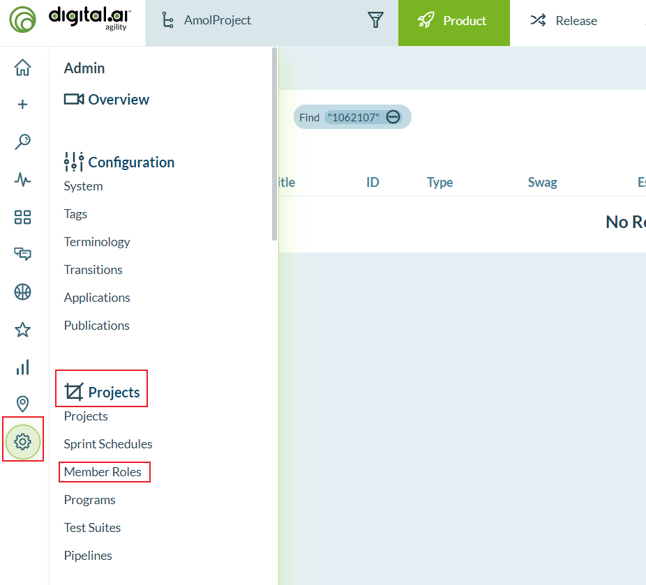
</p>


4. Click on **Manage** button in front of the project.

<p align="center">
  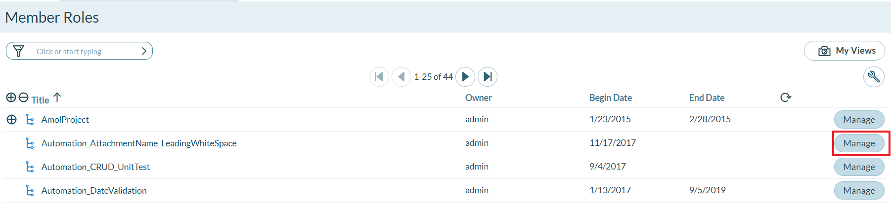
</p>


5. For the user, select the role and click on **Apply** on the right-hand corner of the pop-up to save the changes.

<p align="center">
  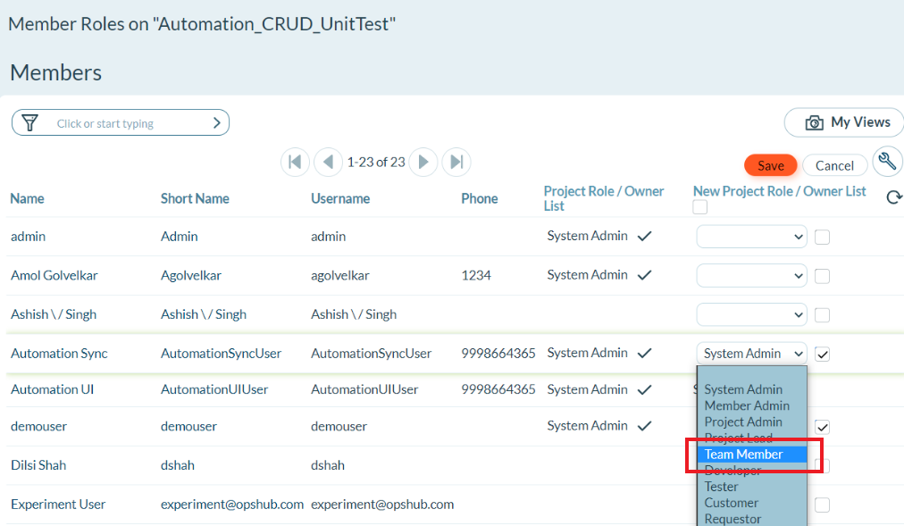
</p>


---

## Custom Fields

To create a custom field in **Digital.ai Agility**:

1. Load the **Digital.ai Agility** User Interface in browser using the Server URL.  
2. Log in with a user having administrative rights.  
3. Click on the **Admin** on the top.  
4. Select **Configuration > Custom Fields**.
   
<p align="center">
  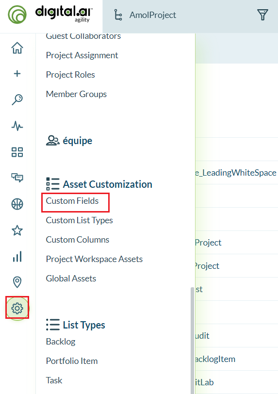
</p>


5. Click on the **Add Field** button in the row of the relevant asset in which you want to add the custom field (this is the story type configured in integration).

<p align="center">
  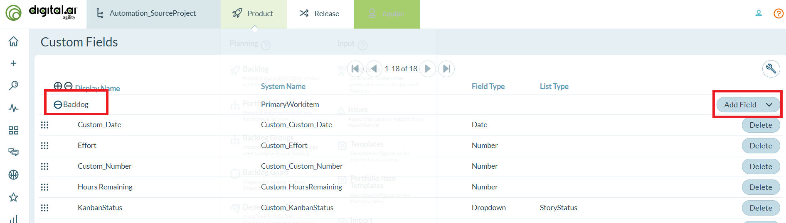
</p>


6. Enter the **Display Name** of the new custom field (**SyncEntity** in this case).  
7. Select appropriate Field Type for the custom field (**Text** in this case).  
8. Click on OK.

<p align="center">
  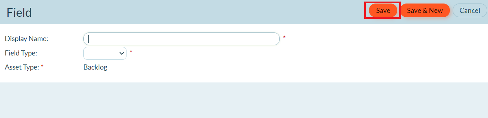
</p>


9. Click on **Publish Changes**, shown in the previous window.  
10. After field is created, System Name of the field is the Internal Name of custom fields.

---

## Inline Image Support for Digital.ai Agility

You can add inline images in rich text type of fields from Digital.ai Agility UI. Such inline images will get synchronized from Digital.ai Agility to the target system. When Digital.ai Agility is your target system, then an inline image is just visible in the rich text type fields and not as an attachment.

---

## How to find out the project id

* Navigate to Admin > Projects as shown in the image below.

<p align="center">
  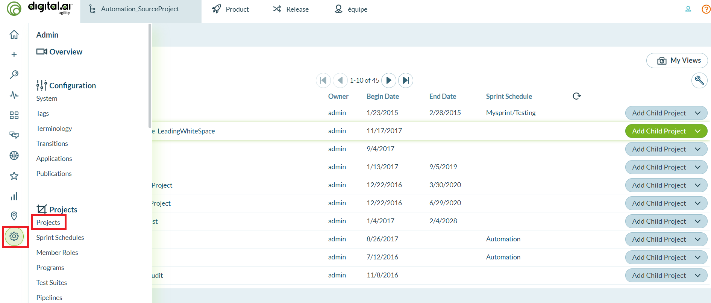
</p>
 

* Open the project in a new tab, which is configured in integration as shown in the image below:

<p align="center">
  
</p>


* Copy the project id from Digital.ai Agility URL as shown in the image below:

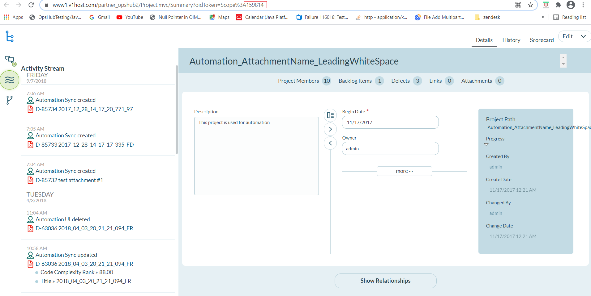  
<center>*Digital.ai Agility Project Management*</center>


