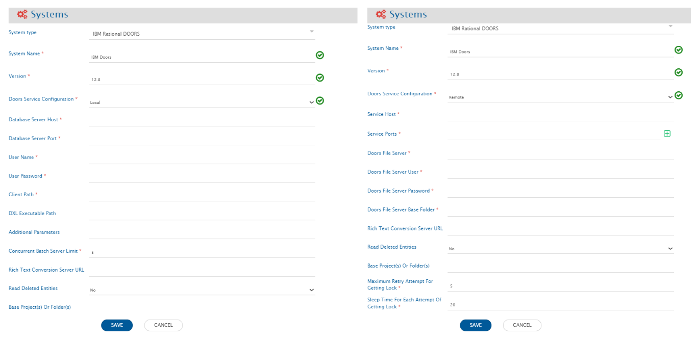
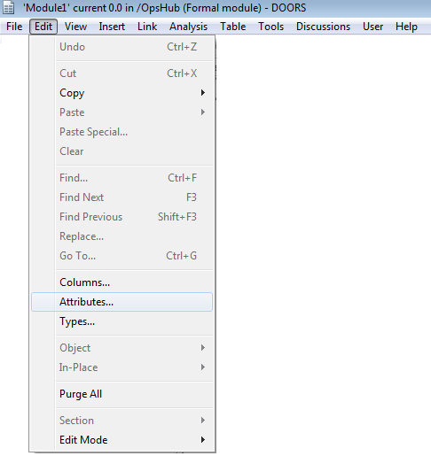
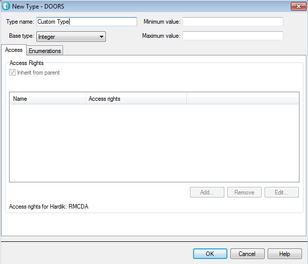
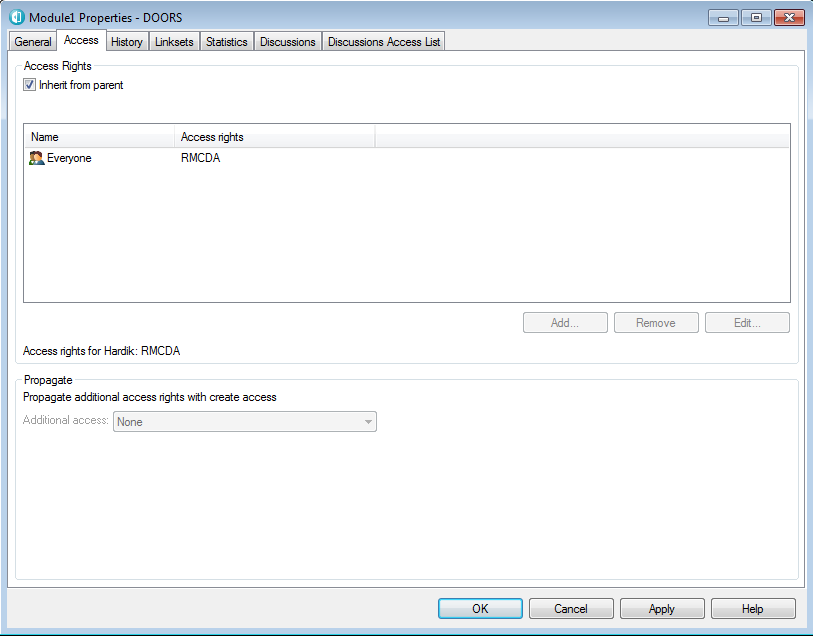
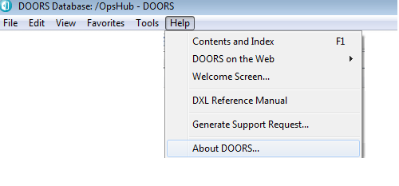

# Pre-requisites

## User privileges
* Create one user of DOORS System, dedicated to OpsHub Integration Manager. User should not be used to do any operations from system's user interface.
* User should have Read (R), Modify (M), Create(C) access rights for each module of the project that required synchronization. For more details on setting access rights, please refer [How to add permissions on module](#how-to-add-permissions-on-module) in appendix.

## DOORS client
* Install DOORS client on the machine where OpsHub Integration Manager is deployed (Recommended) OR install DOORS client on machine where OpsHub DOORS services can be configured (This machine should be in the same network of DOORS server).
* Tested on Operating Systems (OS): Windows XP, Windows 7, Windows 8.1, Windows Server 2012, Windows 10

## Set Log On User for OpsHub Server Service

If you had installed OpsHub Integration Manager on a Windows machine and you are running OpsHub Integration Manager through service, then in some cases, it may be possible that service account doesn't have access to DOORS client. In this case, you will not be able to access DOORS on OpsHub Integration Manager and you will get error related to DOORS connection. To resolve this issue, you may need to set log on user for OpsHub Server Service to the Windows user who has access to the DOORS client.

Please click here to learn -- how to [Set Log On User for OpsHub Server Service](#set-log-on-user-for-opshub-server-service).

## Restart OpsHub Integration Manager on DOORS metadata change

If any field/project added/renamed/deleted or access rights of fields/projects are changed:

- If DOORS service configuration is set as 'LOCAL' in OpsHub Integration Manager, DOORS server needs to be restarted.
- If DOORS service configuration is set as 'REMOTE' in OpsHub Integration Manager, OpsHub DOORS Services need to be restarted.

### For OLE Object

- OpsHub Integration Manager supports synchronization of OLE Objects when DOORS is a source system but for Microsoft Office document (.docx, .xlsx, .pptx, .doc, .xls, .ppt etc.) type of OLE Objects, Microsoft Office 2007 or higher must be installed on the machine where OpsHub Integration Manager is installed.
  - If Microsoft Office is not installed and a Microsoft Office file (such as .docx, .xlsx) are added from a system which has Microsoft Office installed and OpsHub Integration Manager instance does not have it installed, then only Microsoft Office icon will sync as inline image and the actual file will not get synchronized to target.
- OpsHub Integration Manager supports synchronization of OLE Objects when DOORS is a source system but for Microsoft Visio Drawing (.vsdx, .vsd) type of OLE Objects, Microsoft Visio 2013 or higher must be installed on the machine where OpsHub Integration Manager is installed.
  - If Microsoft Visio is not installed and a Microsoft Visio drawing file (such as .vsdx, .vsd) are added from a system which has Microsoft Visio installed and OpsHub Integration Manager instance does not have it installed, then such files will not get synchronized to target.

### For Rich Text Formatting

DOORS system allows users to add Rich Text formatting to Text/String type of fields. OpsHub Integration Manager supports synchronization of such formatting to target end system if following prerequisites are met:

- For support of full Rich Text, a conversion server is needed. The user needs to configure the conversion server and set its URL in [DOORS System Configuration](#system-configuration) of OpsHub Integration Manager. The conversion server must be up and running for usage in OpsHub Integration Manager.
- The [Documents4J Remote Conversion Server](https://documents4j.com/#/) is being used as the Rich Text Conversion Server. For the configuration of this Remote Converter Server, refer to sub-section **Microsoft Word Converter** in the section **Local converter** [here](https://documents4j.com/#/).
- This Rich Text Conversion Server can be set up on the machine where OpsHub Integration Manager is installed or on any remote machine where it can be accessed by the OpsHub Integration Manager setup machine. Refer to [Rich Text Conversion Server configuration](#rich-text-conversion-server-configuration) to set up the Rich Text Conversion Server. It is recommended to keep both on same machine to avoid the maintenance and network communication.

- Following are the prerequisites to set up the Rich Text Conversion Server:
  - A licensed Microsoft Word instance with version 2007 or higher is required to be installed. The user must ensure that the proper licensing and compliance terms for Microsoft Word are met completely. Also, Microsoft Word is properly activated and configured for the user who will be starting the OpsHub Integration Manager server.
  - The installed Microsoft Word instance must be set as the default app for opening and editing .rtf as well as .docx documents. Refer to [this guide](https://support.microsoft.com/en-us/windows/change-default-programs-in-windows-10-e5d82cad-17d1-c53b-3505-f10a32e1894d#:~:text=On%20the%20Start%20menu%2C%20select,set%20them%20as%20the%20default) to set defaults for an app.
  - Ensure that this Microsoft Word instance is dedicated to the Rich Text Conversion Server only when it is up and running (i.e., before starting the server. When the Rich Text Conversion Server is running, make sure that Microsoft Word is not already open before starting the Rich Text Conversion Server and OpsHub Integration Manager server)

> **Note** Synchronization of such full Rich Text formatting (i.e., tables, text highlights, font size, and colors, etc.) is only supported when DOORS is the source endpoint. In case the prerequisites are not met, or DOORS is the target endpoint, then only the formatting which is possible to perform from the DOORS UI will be synchronized.

# System Configuration

Before you continue to the integration, you must first configure the DOORS system. Click [System Configuration](../integrate/system-configuration.md) to learn the step-by-step process to configure a system. Refer to the screenshot given below for reference. 

<p align="center">
  
</p>


<span style="color:blue">**DOORS System form details**</span>

| **Field Name** | **When field is visible on the System form** | **Description** |
|----------------|---------------------------------------------|-----------------|
| **System Name** | Always | Provide System name |
| **Version** | Always | Set Version to version of your IBM Rational DOORS instance. |
| **DOORS Service Configuration** | Always | Location where OpsHub's DOORS Services are configured. i.e., 'LOCAL' or 'REMOTE'. |
| **Database Server Host** | When DOORS service configuration is set as 'LOCAL' | Set Database Server Host to the host name/IP Address where DOORS Database Server is hosted |
| **Database Server Port** | When DOORS service configuration is set as 'LOCAL' | Set Database Server Port to The port that is used by DOORS Database server, by default it is 36677. If your DOORS database Server is using different port then specify that port |
| **User Name** | When DOORS service configuration is set as 'LOCAL' | Set User Name to the name of the user account being used in the synchronization |
| **User Password** | When DOORS service configuration is set as 'LOCAL' | Set User Password to the corresponding password of the user account being used in the synchronization |
| **Client Path** | When DOORS service configuration is set as 'LOCAL' | Set Client Path to The Absolute DOORS client Path on the machine where OpsHub is installed, e.g. C:\Program Files (x86)\IBM\Rational\DOORS\9.2\bin |
| **Service Host** | When DOORS service configuration is set as 'REMOTE' | Host address where OpsHub's DOORS services are configured. Example:10.10.10.1. |
| **Service Ports** | When DOORS service configuration is set as 'REMOTE' | Host ports on which OpsHub's DOORS services are configured. Example:4454,4456. |
| **DOORS File Server** | When DOORS service configuration is set as 'REMOTE' | Enter URL where OpsHub's file server for DOORS is configured. Format: http://<host>:<port>. Example: http://localhost:8990. The given file server URL will be used to perform files and folders operation at the remote OpsHub DOORS service location. |
| **DOORS File Server User** | When DOORS service configuration is set as 'REMOTE' | Enter UserName for OpsHub's file server for DOORS. This UserName will be used to access the DOORS file server. |
| **DOORS File Server Password** | When DOORS service configuration is set as 'REMOTE' | Enter OpsHub's file server's password for DOORS for the above UserName. |
| **DOORS File Server Base Folder** | When DOORS service configuration is set as 'REMOTE' | Enter the Base Folder's path for OpsHub's file server for DOORS. Example: C:/OIMDoorsService. |
| **Rich Text Conversion Server URL** | Always | Enter URL for Rich Text Conversion Server URL. Format: http://<host>:<port>. Example: http://localhost:9898. If the URL is entered then this server will be used to convert DOORS RTF content to HTML. If this field is blank then no additional conversion will be performed for fields with Rich Text data and only the minimal formatting which is possible from within the DOORS UI will be synchronized. For optimal conversion, few details are being cached, hence if the URL is changed then the OpsHub server needs to be restarted to ensure updated server URL is used for conversion. |
| **Read Deleted Entities** | Always | Select Yes to read the deleted entities (so, deleted entities will be taken into consideration), No to skip deleted entities (so, deleted entities won't be taken into consideration). It is only applicable when Doors is the source system for the integration. |
| **Base Project(s) or Folder(s)** | Always | Set Base Project(s) Or Folder(s). If empty then All DOORS will be loaded on Filed Mapping and Integration Page, if specified then Modules from given Path only will loaded on Fled Mapping and Integration Page. You can specify multiple Path with comma separated. |
| **DXL Executable Path** | When DOORS service configuration is set as 'LOCAL' | Default path for DXL scripts will be OpsHub Installation Directory if value is not provided. Set DOORS DXL Executable Path to the directory path from where DXL can be executed (if user needs to change the path to different folder). You can provide absolute path as well as relative path (relative path from DOORS Home Folder). |
| **Additional Parameters** | When DOORS service configuration is set as 'LOCAL' | Set Additional Parameters if you have configured like keydb, certdb, home, localdata etc, e.g. "-home" You can provide multiple parameters with space delimiter. So, mainly while launching the Doors Batch Server, if the user need to pass some additional parameters, then also it can be added here. |
| **Concurrent Batch Server Limit** | When DOORS service configuration is set as 'LOCAL' | Set Concurrent Batch Server Limit to the number of Batch Server which can run concurrently, Setting this number higher will improve the performance, but it should be set according to machine infrastructure where OpsHub is installed, default value is 5 |
| **Maximum Retry Attempt For Getting Lock** | Always | Set Maximum Retry Attempt For Getting Lock to number of times failed lock attempt retried |
| **Sleep Time For Each Attempt Of Getting Lock** | Always | Set Sleep Time For Each Attempt Of Getting Lock to number of seconds wait for each failed lock attempt |


To know the version of DOORS, refer to [Find version](#find-version)

If the system is deployed over HTTPS with a self-signed certificate, you must import the SSL certificate to access the system from OpsHub Integration Manager. Click [Import SSL Certificates](../getting-started/ssl-certificate-configuration.md) to learn more.

# Mapping Configuration

Map the fields between DOORS and the other system to ensure correct synchronization. Click [Mapping Configuration](../integrate/mapping-configuration.md) for detailed instructions.

## Synchronization of formatting present in style attribute

When DOORS is the target system:
- DOORS is not able to render the formatting present in the style attribute of an HTML element.
  - This can happen when formatted content is copied from external applications like MS Word, MS Excel, etc., to the source system.
- To preserve the formatting, OpsHub Integration Manager provides a utility method, convertStyleAttributeToHTMLTags.This method can convert the rich text formatting present in the style attribute of an HTML element to HTML tags.
  - For example, consider the following advance mapping to synchronize Repro Steps field of TFS to Object Text field in DOORS:

```xml
<Object-space-Text>
  <xsl:value-of xmlns:xsl="http://www.w3.org/1999/XSL/Transform" 
    select="utils:convertStyleAttributeToHTMLTags(SourceXML/updatedFields/Property/Repro-space-Steps)" />
</Object-space-Text>
```
From DOORS UI, only the following formatting is supported. Hence, OpsHub Integration Manager will convert the following formatting present in style attribute to HTML tags:
- **Bold**
- **Italic**
- **Underline**
- **Strikethrough**
- **Subscript**
- **Superscript**

## Rank

* Doors allows to organize the Requirements in tree structure. To synchronize the Requirement maintaining the tree structure, below configurations need to be performed in OpsHub Integration Manager.
- Map `OH_ChildIds` and `OH_ParentId` relationship as per standard [Relationship Configuration](../integrate/mapping-configuration.md#relationship-configuration).
- Enable rank sync as described in [Rank configuration](../integrate/mapping-configuration.md#rank-configuration).

# Integration Configuration

In this step, set a time to synchronize data between DOORS and the other system to be integrated. Also, define parameters and conditions, if any, for integration. See [Integration Configuration](../integrate/integration-configuration.md)  to learn the step-by-step process to configure integration between two systems.

## Event Detection & Generation

- DOORS support event detection on Object Number attribute: Please check [Event Detection & Generation](../integration/integration-configuration.md#event-detection-generation) section to learn more on how to enable the Event Detection & Generation feature.
- In DOORS, Object Number is a system and a calculated attribute. This attribute value is changed by add/move/remove operation on other object within the same module. However, Object's Last Modified Time does not get updated for such scenarios.
- When DOORS is the source system and is running on history based sychronization, then the additional user credentials should be provided. The additional user credentials will be used to update the object in the source system. For current state synchronization, the additional user credentials are not required.

> **Note**: Additional user credentials should not be same as the integration user [provided in the system configuration form] credentials. Also, additional user credentials should be dedicated for the OpsHub Integration Manager only. It should not perform any operation in DOORS system.

**Limitations:**  
- In the below mentioned cases, the Doors object movement history will get deleted, and the event detection will not occur:
    1. When object is purged from DOORS.
    2. When baseline is deleted from DOORS.

# Criteria Configuration
Set configure criteria to as per requirement of integration.

* Query
  * Query in DOORS system is the valid filter query on any attribute.
  * Query in OIM should be given as expected in DOORS
    
## Sample Query Snippets

Where, **attr:** The display name of the attribute .  
**operator:** One of ==, !=, <, <=, >, >= .  
**text:** attribute value .  

| **Syntax** | **Description** | **Snippet** |
|------------|-----------------|-------------|
| (attribute 'attr' operator 'text') | Syntax for attribute comparison on 'Status'(Lookup type), 'Last Modified On'(Date type) and 'Created By'(User type) fields | (attribute 'Status' == 'Active')  <br><br> (attribute 'Last Modified On' > '05/25/2018')  <br><br> ((attribute 'Status' == 'Active') && (attribute 'Created By' == 'User1'))  <br><br> ((attribute 'Status' == 'Active') \|\| (attribute 'Created By' == 'User1')) |
| includes(attribute 'attr', 'text') | Syntax for multi-valued attribute | includes(attribute 'MultiProject','Project1') |
| excludes(attribute 'attr', 'text') | Syntax for multi-valued attribute | excludes(attribute 'MultiProject','Project1') |
| ((attribute 'attr' operator 'text') && includes(attribute 'attr', 'text')) | Syntax for multi-valued attribute and comparison operator | ((attribute 'Status' == 'Active') && includes(attribute 'MultiProject','Project1')) |

## Criteria Using Special Characters
* While using **'(single quote)'** in query, user will have to provide the escaping for it. i.e., the character **\\'** should be used instead of **'** wherever needed.
  * Example: `(attribute 'Object Heading' == 'This object contains \' in Heading').`
  * Here, the query for **Object Heading** in DOORS is: **This object contains ' in Heading'**, but the query to be used in {{SITENAME}} is: **This object contains \' in Heading'**.

---

# Configure OpsHub's DOORS Remote Services

When user wants to install OpsHub's DOORS Remote Services on any machine (which is locally connected with a machine having DOORS Server configured), the below steps need to be followed:

* Download "OpsHub DOORS Remote Service utility" from [here](https://opshubtrial-my.sharepoint.com/:u:/g/personal/support_opshub_com/EeqVoEYk3gVHsQT8Y4_CrRsB-iNWvSZd8KS3ebHYWYVIgg?e=DMZO3y)
* This utility requires the following files to be copied from location `(OIM installation directory)\OpsHubServer\webapps\OpsHubWS\WEB-INF\classes\com\opshub\eai\doors\common\resources` to utility's resources folder:
  * OIM_DoorsBatchServer_Template.dxl
  * OIM_DoorsScripts.dxl
* Fill the configuration data in `resources/config.properties`:

| **Field Name** | **Description** |
|----------------|-----------------|
| **protocol** | Enter protocol type to be used by File Server. The File Server can run on http/https. |
| **port** | Enter port to be used by File Server. |
| **keyStorePath** | keyStorePath settings is only considered for protocol=https. You can use your CA certified certificate file OR self-signed certificate file. The sample command to generate self-signed certificate : `keytool -genkeypair -alias OIMFileServerCert -keyalg RSA -keysize 2048 -validity 365 -storetype PKCS12 -keystore keystore.p12`. |
| **resourceBase** | Provide directory path whose files and folders can be served as resources. |
| **userName** | Enter the userName used for file web server. |
| **dbHost** | Enter Host name or IP address of machine where DOORS database server is running. |
| **dbPort** | Enter Port number on which DOORS database server is running. Example: 36677 |
| **dbUser** | Enter DOORS Database User having Read(R), Modify (M), Create(C) access rights for each module of the project which requires syncing via OpsHub. |
| **doorsClientPath** | Enter the absolute DOORS client path. Example: `C:/Program Files/IBM/Rational/DOORS/9.2/bin/doors.exe` |
| **servicePorts** | Enter ports on which DOORS services need to be configured. Example: 4454,4456 |
| **additionalParams** | Enter if any additional parameters (Commandline Switches) are required to launch the DOORS client. Example: `"-home" "C:/Program Files/IBM/Rational/DOORS/9.6"`. You can provide multiple parameters with space delimiter. |

* **To run the Utility, follow the below mentioned steps:**
  * Open the command prompt with admin access and navigate to the utility folder.
  * Run `OpsHubDoorsRemoteServiceUtility.bat`.

---

# Known Synchronization Behavior
## Picture Object as Inline Image

* Picture Object as Inline Image is only supported for DOORS as Source system.
* To sync Picture Object as Inline image in Target System, user needs to map the Picture field in OpsHub Integration Manager.
* As no revision is created for updating/deletion of image in Picture Object, to sync any update in image in Picture Object, an update in any of the other fields for which revision created is required.
* As per DOORS documentation, some pictures when exported/read using API, may have a black border.
* The only supported export format is format PNG, so on the target side, the PNG image is always synced
---

## Object Number and Object Level

* 'The Object Number' and 'Object Level' are calculated fields. OpsHub Integration Manager will synchronize with the value present at the time of entity synchronization. These fields don't have history so, if there is any change after synchronization, it will get reflected in other end systems only when it becomes eligible.
* The field value of these fields also depends on the settings configured on the system page of DOORS under the field name, 'DOORS Sync Deleted Entities' option. If selected 'yes', OpsHub Integration Manager will take into consideration the deleted entities also, and if selected 'no', the field values will be synchronized accordingly.
---

## Fields Limitation

* Synchronization of 'RTF NonShpPict' and 'RTF ShpPict' fields are not supported.
  * Reason: The above mentioned fields store large internal binary data at the time of RTF import, which causes the performance issues in the synchronization.
---

## OLE Object as Inline Image/Document

* OLE objects will not be synchronized through Reconciliations.
* Synchronization for OLE Object as Inline Image/Inline Document is only supported when DOORS is Source end point
* OLE Object will synchronize to target system as per the current status available (in DOORS) at the time of synchronization.
  * Its history will not be maintained in target for the source revisions.
  * As a result, the OLE Object details in the target will be available in the last revision synchronized for the given Object for a synchronization cycle.
* Microsoft Excel document synchronization behavior :
  * Once the .xlsx file is synchronized to the target system, by default, the data for this file will be hidden.
  * To view data, open the file with Microsoft Excel, go into view Tab and click unhide. Then save this file so that the file opens directly next time.
* Open Office document synchronization behavior :
  * The .odp(OpenDocument Presentation) & .odt(OpenDocument Text) documents are supported. Microsoft Office should be used to open these files in target after synchronization.
  * Other open office document types are not supported. They will get synchronized in target but the data may be corrupted and user may not be able to open the file.
* For a given field in DOORS object, if any of the OLE Object size is greater than approx. 20mb :
  * All OLE files or inline images for that object's field won't sync. Only Text data for that object field will sync.
  * In such cases, additionally, one prefix message will be there stating, '#DOORS OLE(s) data is not synchronized, as one of the OLE size is too big (approx more than 20MB)#'
* BMP file OR OLE Object inserted through Paintbrush application:
  * All files will go as inline document even though there is inline bmp image.
* All Open Office(.ods,.odt) & Older Office documents(.doc,.xls,.rtf,.ppt) :
  * For integration setup (not applicable for one time migration):
    * If user adds an OLE Object within the field getting synchronized, where the newly added file has the same type and content length as one of the existing OLE Object Files for same field, the OLE Objects' File(s) on target may refer to wrong attachments within entity.
* In DOORS, any type of file can be added as OLE object. Below are the formats which are tested and supported:  
  **`.bmp,.png,.jpg,.jpeg,.gif,.ico,.exe,.jar,.cer,.properties,.txt,.mkv,.3g2,.3gp,.avi,.flv,.mov,.mp3,.mp4,.webm,.wmv,.pdf,.odp,.odt,.docx,.xlsx,.pptx,.vsdx,.doc,.ppt,.xls,.vsd,.pptm,.xlsb,.dll,.java,.apk,.7z,.zip,.css,.dat,.eml,.log,.xml,.yaml,.html,.htm and .xhtml`**
  * For two of the supported file formats namely, .rtf and .csv , The file synchronized in target will have different file extension than that in the source. Though the data is preserved and will get synchronized properly.  
    For eg: .rtf will synchronize as .doc and .csv will synchronize as .xlsm.  
  * An OLE object shown as a Picture (Enhanced Metafile) will synchronize as a blank image in the other end system. That is due to API limitations. To find out the OLE Object type, right-click on OLE Object and see the type in 'OLE Object Properties...'.

{width=20px} If you are trying to synchronize any other file formats, then it is suggested to validate on test instance first. In case of any queries, please reach out to OpsHub Support.

---

## Synchronizing Rich Text Data with Full Formatting

* Full Rich Text formatting such as tables, font size and color, etc. is only supported when DOORS is the source system and its pre-requisites are met.
* Full Rich Text data will be available to target only in the last revision getting synchronized for a given entity in an execution cycle. In all events except the last event, only the formatting which is possible from the DOORS UI will be synchronized.
* The Rich Text formatting of a table copied through a third party tool (i.e., Microsoft Excel or Microsoft Word): If the table has border 0, then the borders for such tables will not be visible in the target system even if they are visible in the DOORS UI.
* If the URL for the Rich Text Conversion Server is changed, then it needs to be changed in the DOORS System configuration page in OpsHub Integration Manager as well. After the change, the OpsHub Integration Manager Server needs to be restarted for the changes to take effect.
* For links inside RTF fields, only the links' urls will be synchronized, and the text inside which the url is embedded won't be synchronized.
* Conflict detection will result into false positives, where HTML fields containing advanced tags like links, table etc., are synchronized to DOORS.

> **Note** : If the user wants to verify or visualize the output of the conversion, then refer to section [Verify output of Rich Text conversion from Rich Text Conversion Server](#verify-output-of-rich-text-conversion-from-rich-text-conversion-server).

---

## Synchronizing Entities with Deleted History
* When DOORS system is the source:
  * If the history of a particular entity is deleted, and if it is last modified/updated by the integration user, then for such use case, the entity will not be synchronized by OpsHub Integration Manager.
    * Baseline deletion is an example of entity history deletion.
  * If the history needs to be deleted during the synchronization process, it is recommended to let the synchronization complete first and then delete the history.

---

# Appendix

## DOORS Reserved Keywords (Do Not Use as Field Names)

Following names are reserved with OpsHub Integration Manager-DOORS integration, please do not use any name from following list for creating custom filed in DOORS.

```
OH_ModuleName
OH_eventType
OH_ObjectURL
OH_objectId
OH_CreateUpdateTime
OH_attributeName
OH_oldValue
OH_newValue
OH_oldRtfValue
OH_newRtfValue
OH_ParentId
OH_OldBaseline
OH_NewBaseline
OH_discussionTitle
OH_discussionCreator
OH_discussionCreationTime
OH_commentBody
OH_commentCreator
OH_LAST_MODIFIED_TIME
OH_UpdatedBy
OH_Baseline
OH_OutLink
OH_InLink
```

---

## Custom Field Configuration

* Login into DOORS desktop client with the user who has admin access.
* Open the module in which field should require addition.
* Navigate to the edit menu and click on Attributes.

<p align="center">
  
</p>

* Then, click the 'new button. Now, set attribute name (Do not use the name specified in DOORS Reserved keyword list section), select the appropriate type and if needed, set the appropriate default value.

<p align="center">
  
</p>

* Finally, click OK and save the module.

---

## How to Add Permissions on Module

* Login into DOORS desktop client with the user who has admin access on that module.
* Right click on the module in which access rights needs to be set. Then, click on Properties.
* Navigate to Access tab and set appropriate rights.

<p align="center">
  
</p>

## Find version
* Login into DOORS desktop client.
* Navigate to help menu, and click About DOORS

<p align="center">
  
</p>


* It will open a separate window that will show DOORS server version.

<p align="center">
  
</p>


## Notes on Custom Field sync
* Custom Field that requires to be synced must have 'Attribute scope' as Objects or Objects & Module (Only 'Module Scope attribute' can't be synced)
* DXL Attribute can only be used for reading; such attributes can't be written.
* DXL Attribute doesn't have any history, so when other fields are changed and OpsHub Integration Manager syncing those events, the value of the DXL attribute as of sync time will be sync to target.

Learn how to create [Custom Field Configuration](#custom-field-configuration).

## OLE configuration
* To sync OLE object data, you need advance configuration for the field that is mapped with OLE type field. The sample XSL for the configuration is given below:
This is the sample XSL:  
```
<@description@ xmlns:xsl="http://www.w3.org/1999/XSL/Transform" >
  <xsl:element name="oleFieldValue">
    <xsl:value-of select="SourceXML/updatedFields/Property/@Object-space-Text@/oleFieldValue"/>
  </xsl:element>
  <xsl:if test="SourceXML/updatedFields/Property/@Object-space-Text@/oleAttachments">
    <oleAttachments>
      <xsl:for-each select="SourceXML/updatedFields/Property/@Object-space-Text@/oleAttachments/OHAttachment">
        <xsl:element name="{concat('attachment_',position())}">
          <filename><xsl:value-of select="fileName"/></filename>
          <contentLength><xsl:value-of select="contentLength"/></contentLength>
          <attachmentURI><xsl:value-of select="attachmentURI"/></attachmentURI>
          <attachmentReferenceType><xsl:value-of select="attachmentReferenceType"/></attachmentReferenceType>
        </xsl:element>
      </xsl:for-each>
    </oleAttachments>
  </xsl:if>
  <OLE.Object-space-Text>
    <OH_Embedded.OLE>true</OH_Embedded.OLE>
    <OH_Embedded.Picture>true</OH_Embedded.Picture>
    <OH_Embedded.Reference>true</OH_Embedded.Reference>
  </OLE.Object-space-Text>
</@description@>
```

* Change the XSL according to your environment. In the given case, the source field is an 'Object Text' and the Target Field is 'Description'. Therefore, we need to make changes in XSL according to the field mapped in the source and the target systems.
* Content we need to replace in above XSL is highlighted in the format shown below:
  * For source field: `@Object-space-Text@`
  * For Target field: `@description@`
* In the above XSL - OLE, picture and reference to the OLE file is configured. If we don't want the reference or picture object to sync, you need to pass 'false' value. For eg: `<OH_Embedded.Picture>false</OH_Embedded.Picture>`.

## Rich Text Conversion Server configuration
The Rich Text Conversion Server communicates with the Microsoft Word instance, which performs the actual conversion for the supplied Rich Text. To configure this server, following steps need to be followed:

* Download the `documents4j-server-standalone-shaded.jar` from [here](https://documents4j.com/#/) from the *Download* sub-section in the *Getting documents4j* section;
* Open the Command Prompt and run the below command to configure and start the Rich Text Conversion Server (make sure that the user has sufficient privileges to access below folders, else open Command Prompt as Administrator):

```
<OpsHub Integration Manager installation path>\OpsHub_Resources\jre\bin\java -jar <path_to_jar>\documents4j-server-standalone-shaded.jar http://<host_address>:<port_no>
```

* For example, if the port number is selected as 9998 to be configured locally, then the command will be:

```
"C:\Program Files\OpsHub\OpsHub_Resources\jre\bin\java" -jar "C:\Downloads\documents4j-server-standalone-shaded.jar" http://localhost:9998
```

* If the Rich Text Conversion Server is set up on a separate machine, then while using the above command, the user needs to input the IP Address of that machine instead of localhost. For example, if the IP Address of the machine is 10.13.28.123 then the command would be:

```
"C:\Program Files\OpsHub\OpsHub_Resources\jre\bin\java" -jar "C:\Downloads\documents4j-server-standalone-shaded.jar" http://10.13.28.123:9998
```

* The configured URL for this server needs to be given on the [DOORS System Configuration](#system-configuration) page.

## Recommended Practices
To ensure the document4j's server functions correctly:

* Do not open or close Microsoft Office on the same server machine where document4j is running. Doing so can cause document processing failures and can lead to errors such as:com.documents4j.throwables.ConverterAccessException: The converter could not process the request.
* To resolve the ConverterAccessException, you need to restart the document4j's server.

By following these practices, you can avoid errors and ensure smooth operation of the Document4j server.

### Verify output of Rich Text conversion from Rich Text Conversion Server
To verify the output of Rich Text conversion and visualize how the text will be displayed in the target system, a DXL script needs to be executed. This DXL script will download an RTF file at the specified location. This file can then be provided to Microsoft Word to convert to HTML to verify the output of the conversion. The resultant HTML file will display how the Rich Text displays in the target system. Here is the DXL:

```dxl
  Module initModule(string modulePath){
       Module m = read(modulePath,false)
       View v= view("Standard view")
       load(m,v)
       showDeletedObjects(true)
       showTables(true)
       return m
   }
   string downLoadRTFFile(int objectId,string modulePath, string doorsResourcePath,string attributeName)
   {
       noError()
       string error = null
       Module m = initModule(modulePath)
       Object o = object(objectId,m)
       string response =  ""
       string isSuccess="false"
       EmbeddedOleObject ole
       string s = ""
       RichText rtf
       s = richTextWithOle o.attributeName
       Stream oStream = write(doorsResourcePath)
       oStream << s
       close(oStream)
       isSuccess = "true"
       close(m)
       if(error==null)
           error = lastError()	
       response = isSuccess
       return response
   }
   downLoadRTFFile(<object_id>, "<module_path>", "<absolute_path_to_download>", "<name_of_rich_text_supporting_field>")
   print "DONE"
```

Steps to execute and verify:

1. To execute this DXL, open the DOORS UI, click on **Tools** menu and select **Edit DXL...**;
2. Copy the above DXL and paste it into the DXL input in the DXL Editor;
3. Modify the arguments for the `downLoadRTFFile` function call in the following order:
   1. `object_id`: The id of the object for which RTF file has to be downloaded;
   2. `module_path`: The full path of the module in which the object is present, e.g. if the object is in `/QA/QA Module`, then input should be the full path;
   3. `absolute_path_to_download`: The path where the file has to be downloaded along with name and extension, for eg:  `C:/Users/Admin/Downloads/SampleFile.rtf;`
   4. `name_of_rich_text_supporting_field`: The display name of the field for which the file has to be downloaded, for eg: Object Text or some other field supporting Rich Text;
4. Click on Run to execute the DXL. If the download is successful, then DONE will be printed in the DXL output window, and an RTF file will be generated at the specified path;
5. Now open this generated RTF file using Microsoft Word. Click on File menu then click on Save as. Save this file as HTML;
6. Open the saved HTML file. This file's output is how the data of this field will be displayed in the target system's field.


