# Prerequisites

## User privileges

- Create a dedicated integration user in ETM. This user shouldn't perform any other action from ETM interface.
- User must be a member of projects used to synchronize entities/artifacts.
- User can use **Forms-based authentication** or **OAuth 1.0** authentication mode to communicate with API for ETM.  
  * Refer to [OAuth Configuration](#oauth-configuration) section to learn how to create OAuth token.

## Required Permissions

Required **Repository Permissions** for user:

| Section                | Name      |
|------------------------|-----------|
| Repository Permissions  | JazzUsers |

> **Note**: To enable permissions, refer to [Repository Permissions Configuration](#repository-permission) section.

Required **Client Access Licenses** for user:

| Section               | Name                                         |
|-----------------------|----------------------------------------------|
| Client Access Licenses | IBM Engineering Test Management - Connector  |
|                       | IBM Engineering Test Management - Contributor|
|                       | IBM Engineering Test Management - Quality Professional |

> **Note**: To enable licenses, refer to [Client Access Licenses Configuration](#license-configuration) section.

Required **Permissions** for user:

| Section           | Permissions        | Description                                              |
|-------------------|--------------------|----------------------------------------------------------|
| Quality Management| XML Export         | To read any object                                       |
|                   | XML Import         | To create, update or delete any object                  |
|                   | Save {Entity_Type}  | To create, update or delete any entity type, i.e. Test Plan, Test Case, etc |
|                   | Save Attachment    | To delete the entities with attachment                   |

> **Note**: To enable permissions, refer to [User Permission Configuration](#user-permission-configuration) section.

## Custom field configuration

OpsHub Integration Manager requires one custom field to be defined on the entity that is being synchronized to ETM. This must be set up under **Custom Attribute** tab on **Manage Project Properties** page to track the integration status of each item. Name & data type of the field to be configured:

| Custom Field Name | Type        |
|-------------------|-------------|
| oh_last_update    | Text(small) |

> **Note**: To configure this custom field, refer to [Custom Field Configuration](#custom-field-configuration) section.

## Fine-tuning Pagination

- In ETM, maximum entries that can be configured per page in the admin panel is between 1-512.
- It is recommended to set the page size to 512 (maximum capacity per page) for performance optimization.
- Refer to [Page-size Configuration](#page-size-configuration) section to update the page size.

# System Configuration

Before configuring the integration, you must first configure ETM. Refer to [System Configuration](../integrate/system-configuration.md) page to learn the step-by-step process to configure a system.

Refer to the following screenshot below with **Authentication Type** as Form-based authentication:

<p align="center">
  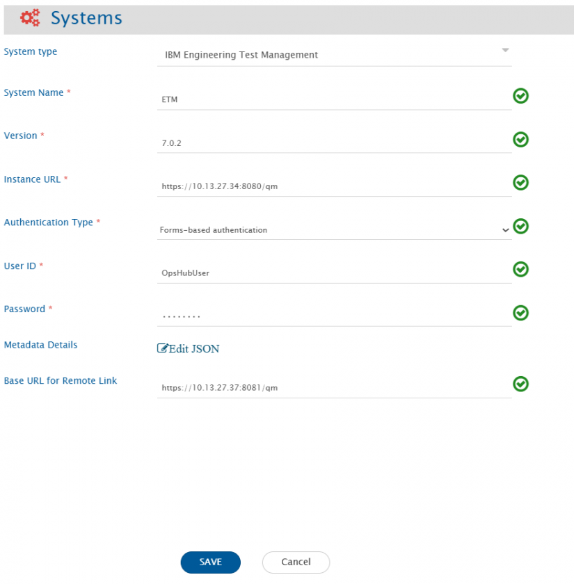
</p>


Refer to the following screenshot below with **Authentication Type** as OAuth 1.0:

<p align="center">
  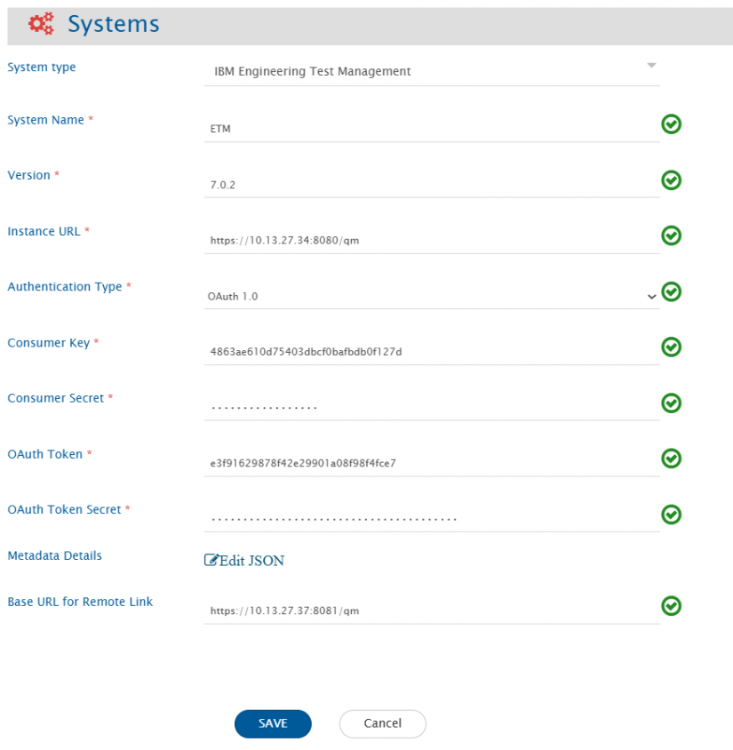
</p>


| **Field Name**           | **When is the field visible**                    | **Description**                                                                                                                                                                                                                                                                             |
|--------------------------|-------------------------------------------------|---------------------------------------------------------------------------------------------------------------------------------------------------------------------------------------------------------------------------------------------------------------------------------------------|
| System Name              | Always                                          | Provide a name to the ETM system.                                                                                                                                                                                                                                                          |
| Version                  | Always                                          | Provide the version for the ETM system. For example, 7.0.2.                                                                                                                                                                                                                                |
| Instance URL             | Always                                          | Provide the URL of the ETM instance. The format of the URL would be: https://{instance}:{port}/qm. For example: https://opshub:1234/qm.                                                                                                                                                     |
| Authentication Type      | Always                                          | Select the authentication type you would like to use for communicating with ETM API.                                                                                                                                                                                                      |
| User ID                  | Authentication type is Forms-based authentication | Provide the user id of a dedicated user. This user must have the required privileges.                                                                                                                                                                                                       |
| Password                 | Authentication type is Forms-based authentication | Provide the password of the user added in **User ID**.                                                                                                                                                                                                                                     |
| Consumer Key             | Authentication type is OAuth 1.0                 | Provide the consumer key of a dedicated user. This user should have the required privileges. Refer [OAuth Configuration](#oauth-configuration) section to learn how to create OAuth Token.                                                                                                 |
| Consumer Secret          | Authentication type is OAuth 1.0                 | Provide the consumer secret for the consumer key added in **Consumer Key**.                                                                                                                                                                                                                |
| OAuth Token              | Authentication type is OAuth 1.0                 | Provide the generated OAuth token.                                                                                                                                                                                                                                                         |
| OAuth Token Secret       | Authentication type is OAuth 1.0                 | Provide the generated OAuth token secret.                                                                                                                                                                                                                                                  |
| Metadata Details         | Always                                          | Provide the custom fields for specific projects & entity types in JSON format. Refer to [Metadata Configuration](#metadata-configuration) section.                                                                                                                                     |
| Base URL for Remote Link | Always                                          | Provide different Instance URL of the ETM instance. This URL is used for generating the Remote Link. For example, if the Instance URL is http://opshub:1234/qm or any API node URL, but Remote Link needs to be generated with a different Instance URL such as http://domain:8081/qm. <br> > **Note**: If "Base URL for Remote Link" is empty, It will use Instance/Server URL to generate Remote Link if configured on Integration. |

# Mapping Configuration

Map the fields between ETM and the other system to be integrated to ensure that the data between both the systems synchronizes correctly. Refer to [Mapping Configuration](../integrate/mapping-configuration.md) page to learn the step-by-step process to configure mapping between the systems.

<p align="center">
  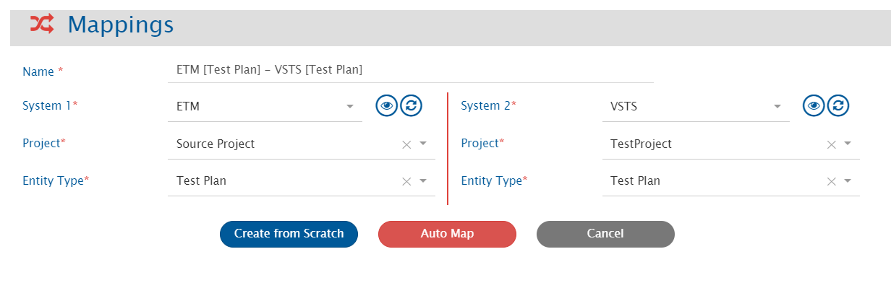
</p>


## 'Manual Steps' & 'Step Result Details' fields configuration

- While synchronizing the **Manual Steps** field for **Test Script** and **Step Result Details** field for **Test Case Result**, advanced mapping is required in OpsHub Integration Manager to synchronize **Comment** & **Assisted Data Entry** (added to 'Manual Steps' & 'Step Result Details' fields).
- Here is the sample advanced mapping required to append to the existing XSLT after `</OHAttachments>` tag between ETM (source) to ETM (target) systems.

To synchronize **Comment**:

```xml
<xsl:element name="additionalFields">
  <xsl:element name="comment">
    <xsl:value-of select="additionalFields/comment"/>
  </xsl:element>
</xsl:element>
```

To synchronize '''Assisted Data Entry''':

```xml
 <xsl:element name="additionalFields">
  <xsl:element name="compare">
   <xsl:value-of select="additionalFields/compare"/>
  </xsl:element>
 </xsl:element>
```

## Synchronization of Keywords

When **ETM is the source** and the **target system does not support Keywords**, ETM Keywords are synced as regular test steps.

OpsHub **preserves a reference** to the original keyword by appending a special identifier to the step description.

This allows:
- Syncing **steps back to keywords** when syncing back to ETM.
- Maintaining **step-level traceability** across systems.

**Keyword Identifier**
- **Format:** `<code>[OH_KY_DO_NOT_EDIT:keyword:&lt;ID&gt;]</code>`
- Example:  [OH_KY_DO_NOT_EDIT:keyword:38]

- Placed at the **end of the step description**.
- Used to track keyword-to-step mapping.

**Guidelines**
- You **can edit** the step content, but:
- **Do not delete or change** the identifier.
- Add custom content **before** the identifier if needed.
- Modifying or removing the identifier may **break reverse sync** or lead to **loss of traceability**.


## Mapping for Soft Delete Configuration

- When ETM is the target system, the Soft delete operation is performed by default in the synchronization of the [Source Delete event](../integrate/source-delete-synchronization,md)
- After the Soft Delete operation is performed by OpsHub Integration Manager in ETM, the entity will be deleted in ETM. The deleted entity goes to the "Trash".
- To only enable the logical delete operation in the target, "OH Soft Delete" field shall be mapped with the default value "No" in the [Delete Mode](../integrate/mapping-configuration.md#delete-mode) mapping.


## Cross-System Linkage with Other IBM Systems

- For more information on configuring cross-system linkages, refer to the following document: [**Cross System Linkages for IBM System**](../help-center/faqs/general/how-to-configure-cross-system-linkage-in-ibm-systems.md)

# Integration Configuration

Select projects & entities to be synchronized between ETM and the other system to be integrated. Also, define parameters and conditions, if any, for integration. Refer to [Integration Configuration](..integrate/integration-configuration.md) page to learn the step-by-step process to configure integration between two systems.

<p align="center">
  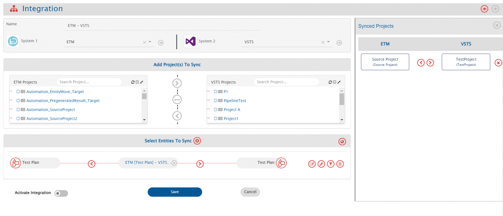
</p>


## Criteria Configuration

If you want to specify conditions for synchronizing entity(s) between ETM and the other system to be integrated, use the Criteria Configuration feature.  
ETM query is a normal SQL type query where you can frame simple queries on the basis of field names.

### Sample Query

* Queries to search entities with different values of 'State':

| Value        | Query                                     |
|--------------|-------------------------------------------|
| Draft        | state='com.ibm.rqm.planning.common.new'   |
| Under Review | state='com.ibm.rqm.planning.common.underreview' |
| Approved     | state='com.ibm.rqm.planning.common.approved' |
| Retired      | state='com.ibm.rqm.planning.common.retired' |

* Query to search entities with different values of 'Owner' (for user type of fields, provide 'userId' as the value):

| Value      | Query              |
|------------|--------------------|
| OpsHubUser | owner='OpsHubUser' |

* Query to search entities with different values of custom field 'CustomFieldName':

| Value       | Query                                                                                  |
|-------------|----------------------------------------------------------------------------------------|
| Custom Text | customAttributes/customAttribute/name='CustomFieldName' and customAttributes/customAttribute/value='Custom Text' |

* Query to search entities with different values of 'Owner' & 'State':

| Value                                         | Query                                                                                                  |
|-----------------------------------------------|--------------------------------------------------------------------------------------------------------|
| Owner = OpsHubUser and State = Approved       | owner='OpsHubUser' and state='com.ibm.rqm.planning.common.approved'                                    |
| Owner = OpsHubUser or State = Approved        | owner='OpsHubUser' or state='com.ibm.rqm.planning.common.approved'                                     |
| (State = Approved or State = Retired) and Owner = OpsHubUser | (state='com.ibm.rqm.planning.common.approved' or state='com.ibm.rqm.planning.common.retired') and owner='OpsHubUser' |

## Target Lookup Configuration

Provide query in Target Search Query field to be able to search the entity in ETM when it is the target system. Go to [**Search in Target Before Sync**](../integrate/integration-configuration.md#search-in-target-before-sync) section on Integration Configuration page to learn in detail on how to configure the Target Lookup. The Target LookUp configuration is similar to the Criteria configuration where in the target search query field, you can provide a placeholder for the source system’s field value between ‘@’ and '@'. Refer to the examples below:

### Sample Query

*Target Lookup Query for the constraint on a **single & multiple fields**:*

| Constraint     | Query                                         | Description                                                                                                               |
|----------------|-----------------------------------------------|---------------------------------------------------------------------------------------------------------------------------|
| Single field   | title='@title@'                               | This query will select only those entities whose "title" field value is same as the source system's "title" field value    |
| Multiple fields| title='@title@' and description='@description@' | This query will select only those entities whose "title" field value is same as the source system's "title" field value & "description" field value is same as the source system's "description" field value |

# Known Behaviors
- **Comments**, **Entity Mention** & **User Mention** are not supported by ETM itself. Therefore, OpsHub Integration Manager does not support them as well.
- If **Parent Test Plans** link is added to **Test Case** artifact, it will be synchronized to target system with next update.  
  **Reason:** After adding this link, instead of **Test Case**, **Test Plan** is being updated on ETM interface.
- If **Parent Test Cases** link is added to **Test Script** artifact, it will be synchronized to target system with next update.  
  **Reason:** After adding this link, instead of **Test Script**, **Test Case** is being updated on ETM interface.

## OAuth Access Token Timeout
- On ETM admin panel, you can specify the timeout seconds for the OAuth Access Token.
- The number of seconds provided here specifies that token will stay valid (till the number of seconds specified) while not being used. It is recommended to set this value based on usage. In case of token regeneration, refer to [OAuth Configuration](#oauth-configuration) section.

## Behavior of 'Link' type field
- Custom link type of field can be added in **Metadata Details**. For JSON format, refer to [Metadata Configuration](#metadata-configuration) section.
- After adding this field at system configuration level, 2 subfields will be visible at mapping configuration level to synchronize label & value of link separately.
- Example:
  - Link type of custom field with name: CustomLink
  - 2 subfields created from CustomLink:
    1. CustomLink.label (datatype - Text)
    2. CustomLink.value (datatype - Link)

## Custom lookup values for Priority
- In each project, Priority field can have different custom lookup values.
- All the custom lookup values along with default values are needed to be provided in **Metadata Details** while system configuration. Refer [Metadata JSON to provide system & custom fields](#system-custom-configuration) section for required JSON format to provide custom lookup values for **Priority** field.
- If custom lookup values are not provided, then Priority field will have these default lookup values for each project:
  - Unassigned
  - Low
  - Medium
  - High
- If there are multiple projects configured at integration level & each project has custom lookup values, then custom & default's combined lookup values should be provided in Metadata Details.
- To identify the associated custom priority lookup value, set the custom priority value in the test plan. Read the test plan using the RQM Reportable REST API, (https://jazz.net/wiki/bin/view/Main/RqmApi#ReadResource).

# Known Limitations
- **History-based synchronization** is not supported for ETM by OpsHub Integration Manager.
- **Locked** field is supported as Read-only.
- Following fields are not supported:

| Artifact                | Not supported fields                                                                                                                      |
|------------------------|-------------------------------------------------------------------------------------------------------------------------------------------|
| Test Plan              | Development Plan Links, Test Environment, Test Suite Execution Records, Test Suite Results, Test Suite, Test Team, Risk Assessment, Test Schedule, Resources, Normative and Informative Documents, Formal Review, Quality Objectives, Exit Criteria, Entry Criteria, Application Security, Associated Electronic Signatures, Subscribers |
| Test Case              | Development Items, Architecture Element Links, Risk Assessment, Execution Variables, Normative and Informative Documents, Formal Review, Associated Electronic Signatures, Subscribers |
| Test Script            | Test Data, Formal Review, Quality Task, Associated Electronic Signatures, Subscribers                                                      |
| Test Case Execution Record | Blocking Defects, Deployment plan, Test Environment, Iteration, rolled-up result, Subscribers                                             |
| Test Case Result       | Defect, Test Environment, Build, Test Data, Iteration, Custom properties, Weight Distribution, Formal Review, Execution Variables, Associated Electronic Signatures |

# Appendix
## Permission Configuration
### Repository Permissions Configuration
- Log in to Admin panel (`<ETM URL>`/qm/admin).
- Navigate to Users > Active Users > select OpsHub Integration Manager's dedicated user.
- Provide required **Repository Permissions**. Click **Save**.

<p align="center">
  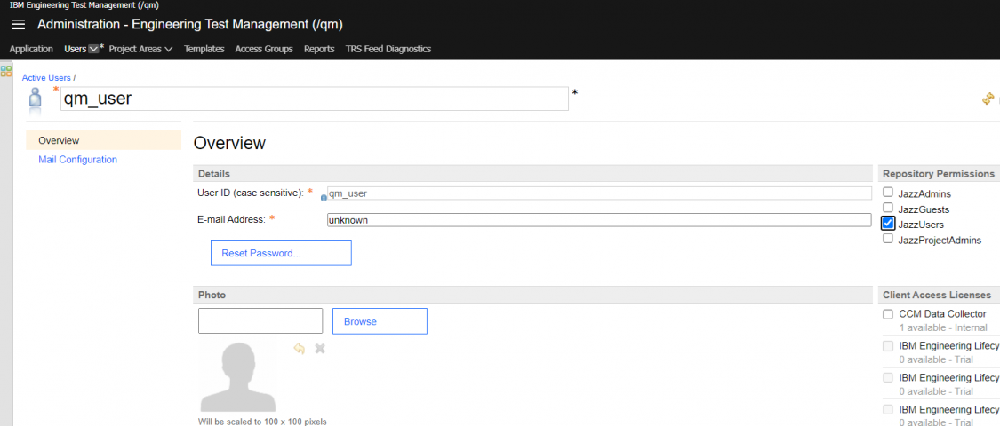
</p>


### Client Access Licenses Configuration
- Log in to Admin panel (`<ETM URL>`/qm/admin).
- Navigate to Users > Active Users > select OpsHub Integration Manager's dedicated user.
- Provide required **Client Access Licenses**. Click **Save**.
  
<p align="center">
  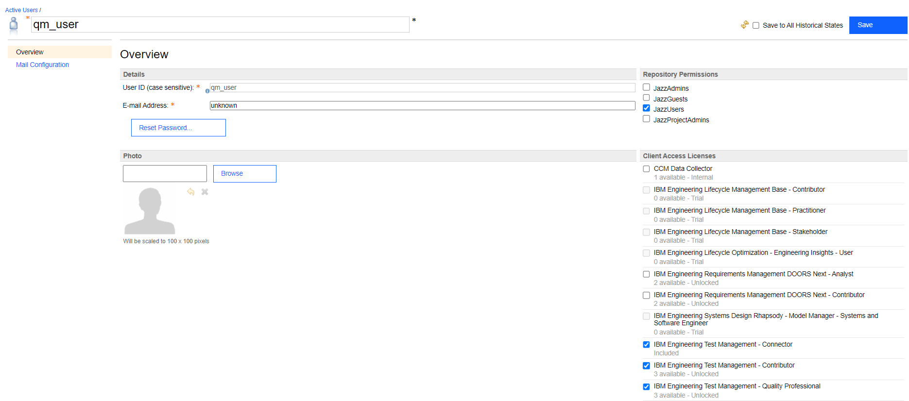
</p>


### User Permission Configuration
- Log in to Admin panel (`<ETM URL>`/qm/admin).
- Navigate to Project Areas > Active Project Areas > select project > Permissions.
- Provide required **Permissions** to a role which is added to OpsHub Integration Manager's dedicated user. Click **Save**.

<p align="center">
  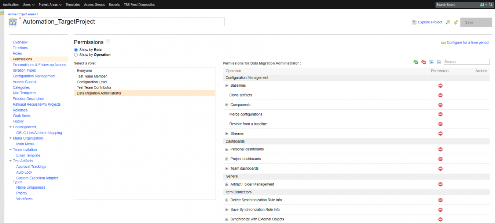
</p>

## Page-size Configuration
- Log in to Admin panel (`<ETM URL>`/qm/admin).
- Navigate to Application > Advanced Properties > ETM Integration Component.
- Provide required page-size to **Max Feed Entries/Page** (maximum page size - 512). Click **Save**.

<p align="center">
  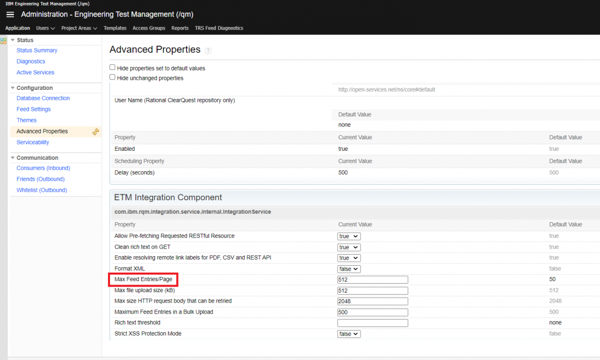
</p>


## OAuth Configuration

Following are the steps to be performed for generating OAuth token for ETM system:

### Generate Customer Key & Consumer Secret
- Log in to Admin panel (`<ETM URL>`/qm/admin) with user whose OAuth token needs to be generated.
- Navigate to Application > Consumers (Inbound) > OAuth Consumers section.
- Enter the **Consumer Name**, **Consumer Secret**, and click **Register**. A **Consumer Key** will be auto generated.
- After successfully registering the consumer, the Consumer Name and Consumer Key will be added in the **Authorized Keys** section.

<p align="center">
  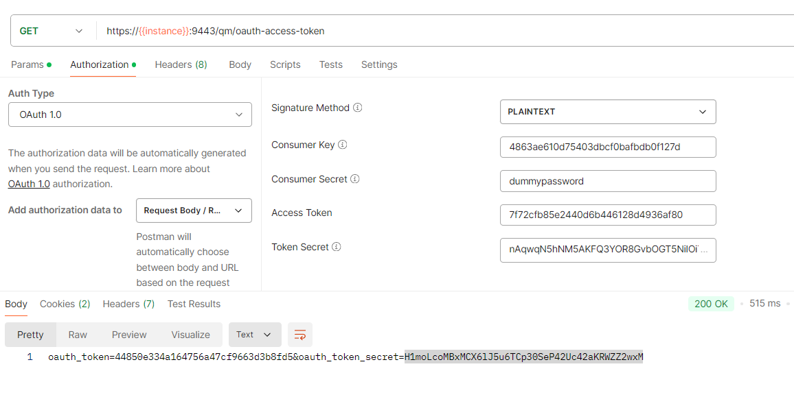
</p>


### Generate OAuth Token and OAuth Token Secret for the generated Consumer Key
Generate an OAuth token using a third-party REST client such as Postman. Once consumer key and consumer secret are generated in end system, following are the 3 steps to be performed: 

**Get the OAuth Request Token**  
- Open Postman or REST client to send the request for OAuth Token.  
- Set the **GET** method with URL as `<ETM URL>/qm/oauth-request-token` & set the Authentication Type as **OAuth 1.0**.  
- Set **Consumer Key** and **Consumer Secret** in the request. Click **Send**.  
- In the response, OAuth token and OAuth token secret will be generated.

<p align="center">
  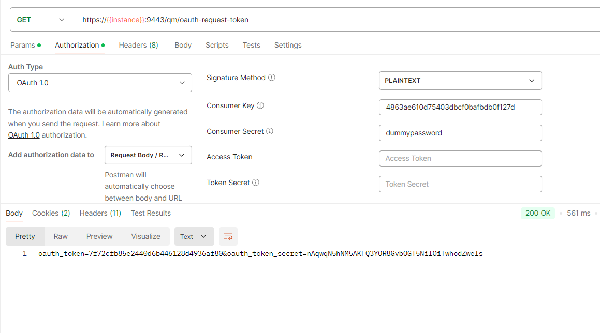
</p>


**Authorize OAuth Request Token**  
- To authorize OAuth Request Token, prepare the request mentioned below and open it in the browser. It requires login with a user who has admin privileges.  
- Authorize URL:  
  `<ETM URL>/qm/oauth-authorize?oauth_token=<oauth_token generated in previous request>&oauth_consumer_key=<consumer key generated in first step>`  
- Example:  
  `https://10.13.28.26:9443/qm/oauth-authorize?oauth_token=795c926555f0433488e1211ccc8fa953&oauth_consumer_key=0efec206ae034e309c8470ca9779c128`

**Get the OAuth Access Token**  
- Open Postman or REST client to send the request for OAuth Token.  
- Set the **GET** method with URL as `<ETM URL>/qm/oauth-access-token` & set the Authentication Type as **OAuth 1.0**.  
- Set the required fields, i.e., **Customer Key** & **Customer Secret**. Provide the **OAuth token** and **OAuth token secret** that was generated in previous step. Click **Send**.  
- In the response, OAuth token and OAuth token secret will be generated.
  
<p align="center">
  
</p>


While creating/updating ETM system configuration in OpsHub Integration Manager, select **OAuth 1.0** as Authentication Type. Also, provide these 4 inputs:  
- Consumer Key & Consumer Secret (generated in [Generate Customer Key & Consumer Secret](#consumer-key-secret))  
- OAuth Token & OAuth Token Secret (generated in [Get the OAuth Access Token](#oauth-token-secret))  

## Custom Field Configuration
- Log in to ETM.
- Select project for which custom field needs to be configured.
- Go to **Administration** > **Manage Project Properties** > **Custom Attributes** > select entity.
- Provide **Attribute Name** & **Type**. Click **Save**.

<p align="center">
  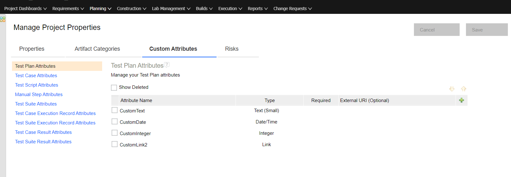
</p>

## Metadata Configuration
- If any custom field is added in ETM that requires synchronization via OpsHub Integration Manager, provide that in the custom field details of **Metadata Details** at system configuration level.
- System fields are provided by default. If they need to be overwritten, provide the details in **Metadata Details** at the system configuration level. Refer to [Metadata JSON to provide system & custom fields](#system-custom-configuration) section for a sample JSON.
- This details are required in specific JSON format. Below is the format of metadata:

```json
{
  "projects": [
    {
      "internalName": "project_internal_name",
      "entities": [
        {
          "internalName": "entity_internal_name",
          "fields": {
            "custom": [
              {
                "internalName": "custom_field_name",
                "displayName": "custom_field_name",
                "dataType": "custom_field_datatype"
              }
            ]
          }
        }
      ]
    }
  ]
}
```
* Refer to [Identify internal name of projects](#identify-internal-name-of-projects)section to get the internal names of each project 

### Metadata JSON to provide custom fields with different datatypes

```json
{
  "projects": [
    {
      "internalName": "ETM+Project+1",
      "entities": [
        {
          "internalName": "testplan",
          "fields": {
            "custom": [
              {
                "internalName": "CustomText",
                "displayName": "CustomText",
                "dataType": "text",
                "mandatory": true
              },
              {
                "internalName": "CustomLink",
                "displayName": "CustomLink",
                "dataType": "link"
              }
            ]
          }
        },
        {
          "internalName": "testcase",
          "fields": {
            "custom": [
              {
                "internalName": "CustomInteger",
                "displayName": "CustomInteger",
                "dataType": "numeric"
              }
            ]
          }
        },
        {
          "internalName": "testscript",
          "fields": {
            "custom": [
              {
                "internalName": "CustomDate",
                "displayName": "CustomDate",
                "dataType": "date_string",
                "dateFormat": "yyyy-MM-dd'T'HH:mm:ss.SSS'Z'"
              }
            ]
          }
        }
      ]
    },
    {
      "internalName": "ETM+Project+2",
      "entities": [
        {
          "internalName": "executionworkitem",
          "fields": {
            "custom": [
              {
                "internalName": "CustomLink",
                "displayName": "CustomLink",
                "dataType": "link"
              }
            ]
          }
        },
        {
          "internalName": "executionresult",
          "fields": {
            "custom": [
              {
                "internalName": "CustomInteger",
                "displayName": "CustomInteger",
                "dataType": "numeric"
              }
            ]
          }
        }
      ]
    }
  ]
}
```

### Metadata JSON to provide custom Artifact Categories
```json
{
  "projects": [
    {
      "internalName": "ETM+Project+1",
      "entities": [
        {
          "internalName": "testplan",
          "fields": {
            "custom": [
              {
                "internalName": "Custom Category",
                "displayName": "Custom Category",
                "dataType": "text",
                "multiselect": true,
                "systemSpecific": {
                  "isCategory": "true"
                }
              }
            ]
          }
        }
      ]
    }
  ]
}
```

### Metadata JSON to provide system & custom fields
```json

{
  "projects": [
    {
      "internalName": "ETM+Project+1",
      "entities": [
        {
          "internalName": "testplan",
          "fields": {
            "system": [
              {
                "internalName": "priority",
                "displayName": "Priority",
                "dataType": "lookup",
                "lookUpValues": {
                  "literal.priority.101": "Unassigned",
                  "literal.priority.110": "Low",
                  "literal.priority.120": "Medium",
                  "literal.priority.130": "High",
                  "literal.priority.115": "custom lookup 1",
                  "literal.priority.118": "custom lookup 2"
                },
                "systemSpecific": {
                  "namespace": "ns2"
                }
              }
            ],
            "custom": [
              {
                "internalName": "Custom Category",
                "displayName": "Custom Category",
                "dataType": "text",
                "multiselect": true,
                "systemSpecific": {
                  "isCategory": "true"
                }
              }
            ]
          }
        }
      ]
    }
  ]
}
```

## Identify internal name of projects

* Prepare the following request and open it in the browser.  
  * List project URL: https://{instance}:{port}/qm/service/com.ibm.rqm.integration.service.IIntegrationService/projects
* From the response, get the internal value of each project from `feed > entry > content > project > alias`.


