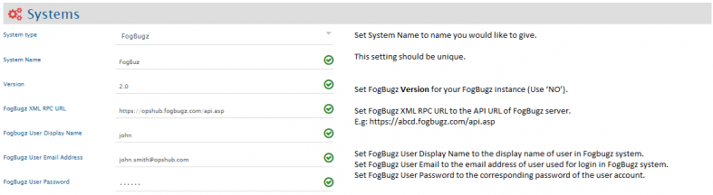
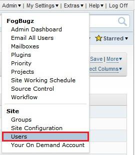
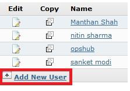
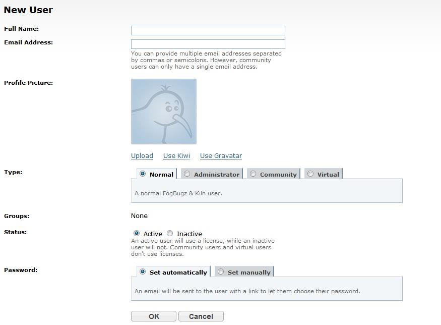
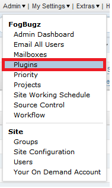
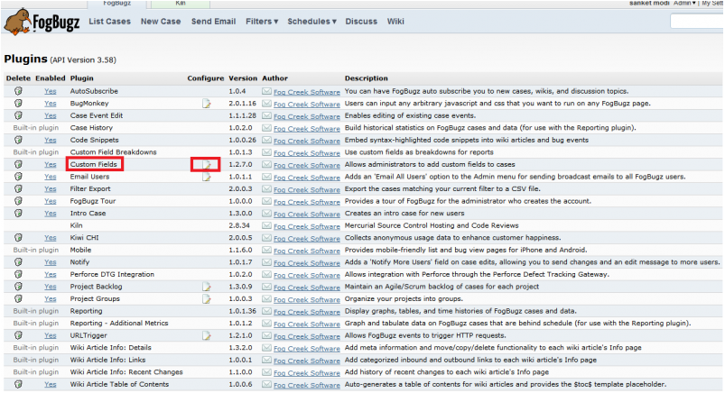
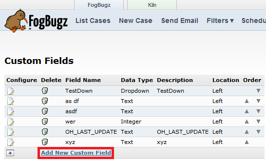
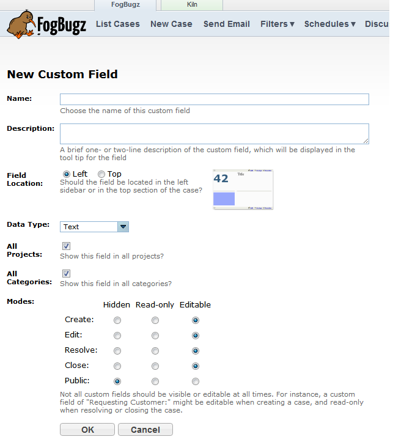

# Prerequisites

## User privileges

* Create one user of FogBugz of type 'Normal' and set User Time Zone, dedicated to OpsHub Integration Manager. User should do any operations from FogBugz's user interface.  
* For adding user and setting time zone in FogBugz, refer [Add User](#add-user) section in appendix.  
* Ensure the user's time zone is set to UTC (also known as Coordinated Universal Time). Refer [Set User Time Zone](#set-user-time-zone) for details.
* If you are not using SAAS instance of FogBugz, you might need to import SSL certificate to the server. To know how to import certificate, refer [Import HTTPS Certificate To Server](../getting-started/ssl-certificate-configuration.md) page.

# System Configuration

Before you continue to the integration, you must first configure FogBugz. Click [System Configuration](../integrate/system-configuration.md) to learn the step-by-step process to configure a system.  
Refer the screenshot given below for reference.  

  

For checking version and api_key, refer [How to get API URL and Version?](#how-to-get-api-url-and-version) section in appendix.

If the system is deployed on HTTPS and a self-signed certificate is used, then you will have to import the SSL Certificate to be able to access the system from OpsHub Integration Manager. Click [Import SSL Certificates](../getting-started/ssl-certificate-configuration.md) to learn how to import SSL certificate.

# Mapping Configuration

Map the fields between FogBugz and the other system to be integrated to ensure that the data between both the systems synchronizes correctly.  
Click [Mapping Configuration](../integrate/mapping-configuration.md) to learn the step-by-step process to configure mapping between the systems.

## Integration Configuration

In this step, set a time to synchronize data between FogBugz and the other system to be integrated. Also, define parameters and conditions, if any, for integration.  
Click [Integration Configuration](../integrate/integration-configuration.md) to learn the step-by-step process to configure integration between two systems.

## Criteria Configuration

**For System Fields**:  
* Refer http://fogbugz.stackexchange.com/questions/4399/and and navigate to 'Axes for searching cases'. Now, find the name of the field on which you want to configure the criteria.
* Put the name of the field, then put a colon (:) and the value of that field, for example `Status:Active`.

**For Custom Fields**:  
* Refer http://help.fogcreek.com/7747/custom-fields-track-your-own-case-attributes and navigate to 'Searching Custom Fields'.
* For Custom Field and CustomValue, query should start with the custom field's name followed by a colon and the custom value, for example `CustomxField: "CustomValue"`.

Click [Create Custom Fields](#create-custom-fields) to learn how to create custom fields.

# Appendix
## Add user

* Login to FogBugz server.
* Click on **Admin** on the right top corner and select **Users**.

  

* Click on **Add New User Account**.

  

* Click on **Add New User Account.**

  

## Set User Time Zone

* Log into **FogBugz** server.
* Click **Admin** tab on the top-right corner and select **Users**.

  

* Select the user from the user list. Click **Edit**.
* Set Time Zone to: **(UTC) Coordinated Universal Time**.

  

## Create Custom Fields

* Login to FogBugz server.
* Click on **Admin** menu.

  

* Select **Plugins** from menu.
* Check if Custom Fields is enabled, if it is enabled, click on 'edit' symbol.
* Click **Add New Custom Field**.

  

  

  

## How to get API URL and Version?

Go to http://fogbugz.stackexchange.com/fogbugz-xml-api and see **Checking the API version and location**.
