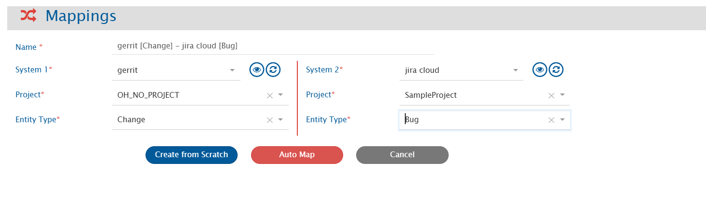
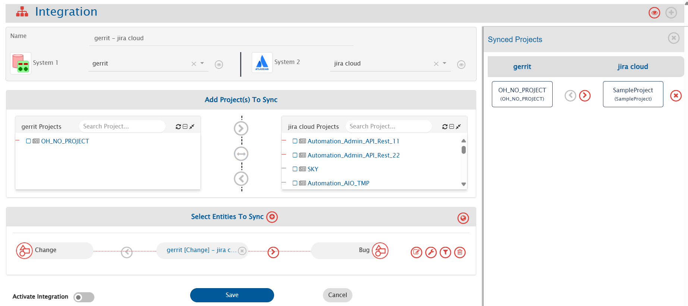
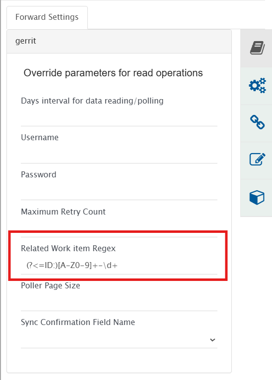
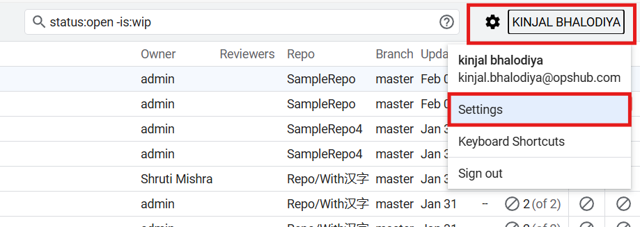
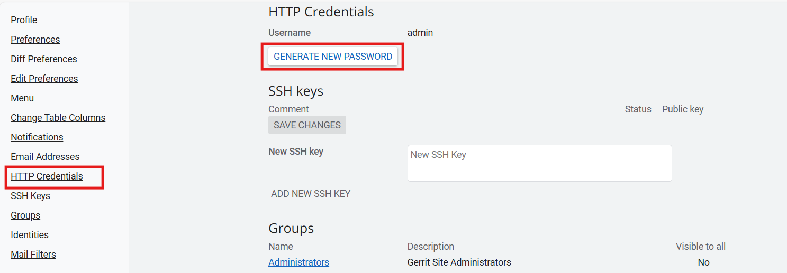

# Prerequisites

## User Privileges

* Create a dedicated integration user in Gerrit. This user shouldn't perform any other action from Gerrit interface.
* Users can authenticate using HTTP credentials to communicate with Gerrit APIs. Refer to [HTTP Password Generation](#http-password-generation) for details on setting up and using HTTP credentials.
* User must have Read permission of repositories used to synchronize entities.

# System Configuration

Before configuring the integration, user must first configure Gerrit. Refer to [System Configuration](../integrate/system-configuration.md) page to learn the step-by-step process to configure a system.

<p align="center">
  
</p>

## Gerrit System Form Details

| **Field Name**                | **When is the field visible** | **Description** |
|------------------------------|-------------------------------|-----------------|
| **System Name**              | Always                        | Provide a name to the Gerrit system. |
| **Instance URL**             | Always                        | Provide the URL of the Gerrit instance. The format of the URL would be: https://{instance}:{port}/. For example: https://opshub:1234/. |
| **Username**                 | Always                        | Provide the username of a dedicated user. This user must have the required [privileges](#user-privileges). |
| **Password**                 | Always                        | Provide the password of the user added in **Username**. This would be the password generated from **HTTP Credentials** section of user settings in Gerrit. Refer to [HTTP Password Generation](#http-password-generation). |
| **Review Labels**            | Always                        | Provide the Review Labels that are configured in Gerrit in JSON format. "Code-Review" label is added by default. Refer to [Review Labels](#review-labels) section for more information. |
| **Base URL for Remote Link** | Always                        | Provide a different instance URL for the Gerrit instance. This URL will be used to generate the Remote Link. For instance, if the original instance URL is http://opshub:1234/ or any API node URL, the Remote Link should be generated using a different instance URL, such as http://domain:8081/.  
> **Note** : If the "Base URL for Remote Link" field is empty, the system will use the configured instance/server URL to generate the Remote Link.</p> |

## Review Labels

Review Labels configured in Gerrit can be given in the system form if required to synchronize. Review Labels mentioned here will be visible on [Mapping Configuration](../integrate/mapping-configuration) screen. The "Code-Review" label will be added by default in {{SITENAME}}. Refer to [this documentation](https://gerrit-review.googlesource.com/Documentation/config-labels.html) for more details.  
A sample JSON for Review Label is given below:

```json
{
  "labels": [
    {
      "displayName": "Code-Review",
      "lookUpValues": [-2, -1, 0, 1, 2]
    }
  ]
}
```

# Mapping Configuration

Map the fields between Gerrit and the other system to be integrated to ensure data synchronizes correctly. Refer to [Mapping Configuration](../integrate/mapping-configuration.md) page for step-by-step process to configure mapping between the systems.

<p align="center">
  
</p>

# Integration Configuration

In this step, set a time to synchronize data between Gerrit and the other system to be integrated. Also, define parameters and conditions, if any, for integration. Refer to [Integration Configuration](../integrate/integration-configuration.md) page for step-by-step process to configure integration.

<p align="center">
  
</p>

### Configuring Related Work item Regex

For synchronization, the user needs to specify a **Related Work item Regex** (Regular Expression) while configuring integration for picking related work item id from the commit message of the Change entity. The extracted work item IDs will be available in "Related Work Item ID" field.

For example, if the commit message is:  
`committing against TEST-123, added login feature for my website`  
and the related work item id on which you want to synchronize the Change entity information is TEST-123, then RegEx for your input will be:[A-Za-z]+-\d+

* **Use case 1**: Create/Update against specific workitem:  
  * If user wants to create entity against a work item in the target system, then specify a [Target Lookup Query](../integrate/integration-configuration.md#search-in-target-before-sync) for the target system. The parameter for specifying related work item id is @Related Work Item ID@. Following are the two scenarios:
    * **Update against existing workitem**: This query searches the related work item (for which RegEx has been specified). If the entity is found, the information will be updated on that entity according to the field mapping.
    * **Create new work item**: If this entity is not found in the target system and the user wants integration to create this entity first, and  synchronize source entity with it, then set the "If no entity found matching above query?" option in Target Lookup Query to "Create new entity in target".
* **Use case 2**: Create a new work item everytime:  
  * If user wants integration to synchronize and create an entity in the target system for every entity in source system, **Related Work item Regex** should be empty. There is no need to enter a Target Lookup Query in this case.

**Related Work Item ID** field behavior:  
* If multiple work item IDs match the **Related Work item Regex**, list of all matching IDs will be given as a comma separated value. If using [Target Lookup Query](../integrate/integration-configuration.md#search-in-target-before-sync) on this field, the query should handle the value accordingly.
* If no match is found, this field will have "-1" value.



## Criteria Configuration

If user wants to specify conditions for synchronizing entity(s) between Gerrit and the other system to be integrated, use the Criteria Configuration feature.  
Refer to [this](https://gerrit-review.googlesource.com/Documentation/user-search.html#search-operators) page for details about Search Operators in Gerrit.

### Sample Criteria Examples

| **Criteria Description**                                              | **Criteria Snippet**                        |
|----------------------------------------------------------------------|---------------------------------------------|
| Synchronize Changes which have branch as "DevBranch"                | `branch:"DevBranch"`                        |
| Synchronize Changes which have project as "DevProject"              | `project:"DevProject"`                      |
| Synchronize Changes which have status as "MERGED"                   | `status:"merged"`                           |
| Synchronize Changes which have status as "MERGED" and project match | `status:"merged" AND project:"DevProject"`  |

# Known Behavior & Limitations

## Common

* History-based sync is not supported.
  * Reason: API limitation.
* Gerrit can be used as source system only in the integration.
  * Target Lookup and end system criteria storage is not supported.
* Synchronization of comments, attachments and links is not supported.

## Entity Specific

### Change

* The commit Hash and commit message will be synced from latest PatchSet only.

# Appendix

## HTTP Password Generation

1. Go to Settings menu for the logged-in user from the user menu at top right corner.  
   

2. Go to "HTTP Credentials" section and click "GENERATE NEW PASSWORD".  
   

3. Copy the password displayed, and use it as password for the user in the system configuration.
