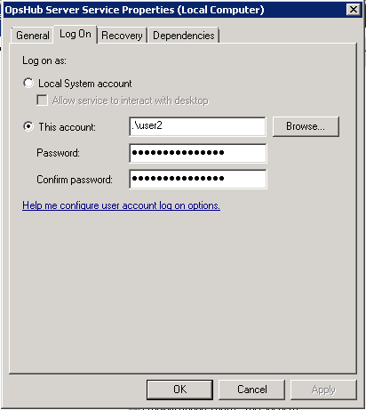

# Prerequisites

## User privileges
For integration, OpsHub Integration Manager requires user which is authorized to connect to Git Repository Server and can pull check-in information.

## Other Prerequisites
If the OpsHub Integration Manager is installed as a service in Linux distributed system, this service will get started with the **opshub** user. This user should have permission to Git repository path.

## Clone Git repository
Git must be installed on the machine where OpsHub Integration Manager server is running. Clone the Git repository which you want to synchronize on the same machine where the server is installed. This repository will be used by OpsHub Integration Manager only.

## Install python and required modules
* For hook configuration python and required modules are required, refer [Python Configuration](#configuration-python-2-6-0) under Appendix for installation.  
* Validate Git configuration: Some Git clients do not add branch information on Git clone repositories. In such cases, you need to add it manually after Git repository is cloned to validate this behavior.  

Follow the steps given below to learn how to go about it:  
*  Steps for validating branch section:  
   *  Navigate to the cloned repository.  
   *  Go to the `.git` folder.  
   *  Open `config` file and if you find branch section like this:  
 [branch "master"] <br>
 remote = origin <br>
 merge = refs/heads/master <br>
Here `"master"` is branch name, it could be other name as well depending on your clone repository path but if there is no section for branch then execute the command given below:  
```sh
git branch -u origin/<branch_name> <branch_name>
```
For example:  git branch -u origin/master master
(If your branch name is master)

# System Configuration

Before you continue to the integration, you must first configure Git. Click [System Configuration](../integrate/system-configuration.md) to learn the step-by-step process to configure a system. Refer the screenshot given below for reference.  

<p align="center">
  
</p>

If the system is deployed on HTTPS and a self-signed certificate is used, then you will have to import the SSL Certificate to be able to access the system from OpsHub Integration Manager. Click [Import SSL Certificates](../getting-started/ssl-certificate-configuration.md) to learn how to import SSL certificate.

## Configure commit template

* Clicking the Template will show you a table in a new pop-up window. The table will allow you to configure commit template for the system. Please note that out of the attributes shown in the image below, **Bug Id** represented by `issueid_int`/`issueid_str` attribute and **Reviewer** represented by `reviewer_usr` attribute are mandatory. Without these two attributes in the commit template, commit/check-in is not allowed. You may also specify pre/post commit default values for the attributes. Post-commit values are needed if no template is configured at SCM level. The values provided under **Attribute Display Name** are case sensitive and are compulsory to be provided while checking-in any file from the repository. For example, for the configured template shown here, you need to specify commit template as follows:  
   * BugId::9999  
   * Comments::A file is checked-in  
   * EOT::5  
   * Reviewer::admin  
   * Status::Done

<p align="center">
  
</p>

* Here number 9999 against the attribute **Bug Id** should be the actual id of entity against which the SCM integration is configured. For example, for Git to QAComplete Requirement Traceability, 9999 should be the requirement id existing in QAComplete.
* **Comments** attribute accept any comments given runtime, single line or multi-line.
* **EOT** is the Effort required to check-in the code. It can be provided runtime by the check-in user.
* **Reviewer** attribute accepts the name of the reviewer who reviewed the files going to be checked-in.
* **Status** symbolizes the status of the **Requirement** to be changed once the code is checked-in.
> **Note** :To know the version of Git you are using, refer [Find Version](#find-version) in Appendix.
* Set SCM Repository Path Separator to `/` if OpsHub Integration Manager is installed on Linux and set `\\` if OpsHub Integration Manager is installed on Windows.
* Leave ALM System set to 'Select' by default. In case, you need to configure any pre-commit rules before checking-in the files in the SCM system, you need to specify the ALM system from the drop-down list.
> **Note**: For specifying the ALM system, create an ALM system. All the rules such as Bug id verification, etc. will be validated by the data existing in the specified ALM system.
* Leave **Entity Type** blank by default. In case, the above ALM system option specifies any ALM system, provide the name of the entity against which the rules are configured. For example, Defect, Requirement, etc.
> **Note**: The entity type accepts the internal name of the entity. Kindly contact your sales/support POC for getting the internal name of the entity. This input is required only when you want to enable policy enforcement rules.
* Set Pre-Commit Parse to `Template` or `Regex`. Default selection is `Template`.
  * Pre-Commit Parse value should be set to `Template` when commit message follows the SCM Commit Template configured on the Git.
  * Pre-Commit Parse value should be set to `Regex` when commit message needs to be customized, once you set this option then you can set regex in SCM Commit Template configured on the Git.
* Set Git Executable Path to absolute Git Client Path where OpsHub Integration Manager is installed, for example `C:\Program Files\Git\bin`.
* Set Git Repository Path to the absolute path where Git repository is cloned.
> **Note** :It should be on the same machine where OpsHub Integration Manager is installed.

## PasswordAuthentication

* Set Git User Name to the user that you want to authenticate and use for synchronization.
* Set Git User Password to the password of the corresponding user account that is used in the synchronization.

## RSAAuthentication

* Select Git Authentication Type as per the configuration done on the Git server in order to connect to it. As per the Authentication Type selected, you will be asked to enter the credentials.
* Set PassPhrase for the user with which you have logged on the machine. This user should have atleast R (Read) access for this Repository.
* To setup SSH Key for RSA authentication, refer to [SetUp SSH Key for RSA authentication](#setup-ssh-key-for-rsa-authentication) section under Appendix.
> **Note** :Clone the Repository using SSH clone.  
> **Note** :If you have selected RSAAuthentication and OpsHub Integration Manager is running with the service, set the Windows user/password in service LogOn. For that refer [Set Windows User/Password in Service](#set-windows-userpassword-in-service) under Appendix.
* Click on **Save** button to save the System Configuration form.
* To enable SCM check-in policy, refer [Git Hook Configuration](#git-hook-configuration) section under Appendix.

# Mapping Configuration
Please contact your support/sales POC for Git mapping.

# Integration Configuration
Set a time to synchronize data between Git and the other system to be integrated. Also, define parameters and conditions, if any, for integration. Click [Integration Configuration](../integrate/integration-configuration.md) to learn the step-by-step process to configure integration between two systems.  
> **Note** :Select Git **Entity Type** to Git **Commit Information**.  
> **Note** :Set **Start Processing Event Id** to the **Checked in changeset Id** from where the Integration will start (Events with checked-in changeset Id less than this will not be synchronized).

To find the **Event Id** (Commit Id) in Git repository, refer [Find Commit Id](#find-commit-id) section under Appendix.

# Appendix
## Find version
Following are the steps to know the version of a Git instance.  
* Open command prompt and fire command `git --version`.  
> **Note** :For Linux, fire the command on terminal.  
* This will display the version of the server installed on your machine.

## Git hook configuration
* Navigate to `<OpsHub_Installation_Directory>\Other_Resources\Hooks` directory.
* Extract `Hooks_Git.zip` from above directory to some directory.
* Configuring server hook:
  * Copy all the files of Git/ServerHooks directory to the Git Server repository hooks folder.
  * Copy `property.txt.sample` to `property.txt` in the hooks folder.
  * Give full permission to all the files under hooks folder in Git server repository. For example, `chmod 777 hooks/*`
  * Open `property.txt` file and edit the value of properties. Mostly, the default value will work. But it is recommended to reset them one by one.
    * `url:=` WSDL URL of OpsHubwebservice. Edit localhost by the server name/server ip.  
      `http://<opshub Host>:<opshubport>/OpsHubWS/services/CommitVerify?wsdl`
    * `logfile:=` Place to write the logfile. Make sure git user has write permission
    * `CompanyId:=1` Company id, leave the default 1
    * `username:=admin` Webservice user name, leave the default value
    * `password:=` password for above
    * `repositoryName:=` Display Name of system given at System Configuration
    * `commitOnConnectionFailure:=True` — makes SCM working even in absence of OpsHub Integration Manager server
  * Edit `template.txt` file in hooks folder to define default commit template message

## Configuring client hook
### Pre-requisite
If you commit using Git repository through eclipse, then you need to follow the below-mentioned pre-requisites.  
* EGIT (Eclipse plugin for git) version should be 4.3.1 or greater.
* On Windows machine, Cygwin (32/64 bit as per your machine) must be installed with Git packages and add `<cygwin_home>/bin` in path environment variable.
* Copy all the files of Git/ClientHooks directory to the Git Client repository `.git/hooks/` folder.  
  Example: `chmod 777 .git/hooks/*`
* Copy `property.txt.sample` to `property.txt` in the `.git/hooks/` folder.
* Give full permission to all the files under `.git/hooks/` folder in Git client repository.
* Open `property.txt` file and edit the value of properties.
  * `url:= http://<opshub Host>:<opshubport>/OpsHubWS/services/CommitVerify?wsdl`
  * `logfile:=` Place to write the logfile. Make sure git user has write permission
  * `CompanyId:=1`
  * `username:=admin`
  * `password:=` password for above
  * `repositoryName:=` Display Name of system given at System Configuration
  * `commitOnConnectionFailure:=True`
* Edit `template.txt` file in `.git/hooks/` folder to define default commit template message

## Set Windows user/password in service
* To set Windows user/password in service:  
  Go to **Services**, in the services, select **OpsHub Integration Manager Server Service → Properties → Log On tab → Log on as: This account → add Windows user and its Password → Apply → Ok**.
* After this, restart the server service.

<p align="center">
  
</p>

## Find Commit Id
* To find the Commit Id for a particular repository, open Git Bash at the location of the cloned repository.  
  Example: `C:\Git_Testing\FORClientusage\DevlopmentRepo`. Now, fire command git log. This will show all the commits.
  Choose the desired Commit Id:
```sh
git log
```
This will show all the commits.
* Choose the desired Commit Id.
<p align="center">

</p>
> **Note** : If you want only last commit information you can fire:
```sh
git log -1
```

## SetUp SSH Key for RSA authentication
**Generate Git Key**:  
* In Git Bash, the following command should be used to generate RSA key. Write your email in place of "your_email@domain.com" within double quotes.:  
```sh
ssh-keygen -t rsa -b 4096 -C "your_email@domain.com"
```
* When you're prompted to "Enter a file in which to save the key", press Enter to accept the default file location. Please note that if you have already created SSH keys before, ssh-keygen may ask you to rewrite another key. In that case, enter 'y' if you want to generate a new private-public key pair. Else, if you want to use the existing private-public key pair, then enter 'n' and go to 'Convert to RSA format' step.
```sh
Enter a  file in which to save the key (/c/Users/You/.ssh/id_rsa): [Press Enter]
```
* When asked to enter passphrase, type a secure passphrase:
```sh
       Enter passphrase (empty for no passphrase): [Type a passphrase]
       Enter same passphrase again: [Type same passphrase again]
```

**Convert to RSA format**:  
* To convert the format of RSA key from OPENSSH format to RSA format, type the following command in Git Bash. While converting the format of the SSH key, it will ask you to enter the old passphrase, type the passphrase which was provided while generating the SSH key. It will also ask for the new passphrasew which should be provided as well
```sh
ssh-keygen -p -f ~/.ssh/id_rsa -m pem
```

**Copy public key**:  
* If you have used the already existing private-public key pair and have public key in your Git Provider, then do not configure the public key again. Else, in case of newly generated private-public key pair, configure the public key of the key generated in your Git Provider. You can use the following command to copy public key and configure it in your Git Provider.:
```sh
clip < ~/.ssh/id_rsa.pub
```

## Configuration python 2.6.0
Download, install, and configure Python 2.6.0 with SOAPpy, fpconst and PyXml.

### Download links
* Python 2.6.6: http://www.python.org/download/releases/2.6.6/
* PyXML-0.8.4: ftp://mirror.rit.edu/gentoo/distfiles/PyXML-0.8.4.tar.gz
* SOAPPy0.12.0: http://sourceforge.net/projects/pywebsvcs/files/SOAP.py/0.12.0_rc1/
* fpconst-0.7.2: http://pypi.python.org/pypi/fpconst

### Installation instruction
**Install Python 2.6.2 1.1**  
* Set the environment variable for class path : Ex: classpath='c:\python26'

**Install fpconst 2.1**  
* Extract the zip file fpconst-0.7.2.tar.gz
* Open command prompt and go the folder till where fpconst is extracted
* Cd fpconst-0.7.2
* Execute command: python setup.py install

**Install PyXML 3.1**  
* Extract the zip file PyXML-0.8.4.tar.gz
* Open command prompt and go the folder till where PyXML is extracted
* Cd PyXML-0.8.4
* Execute command: python setup.py install - force - skip-build

**Install SOAPpy 4.1**  
* Extract the zip file SOAPpy-0.12.0.zip
* Extract the zip file SOAPpy-0.12.0.zip
* Open command prompt and go the folder till where SOAPpy is extracted
* Cd SOAPpy-0.12.0
* Go to the SOAPpy-0.12.0\SOAPpy directory
* Edit the Client.py file 4.5.1. find 'from __future__ import nested_scopes' line
* Cut it and paste it at the first line of file
* Edit the Server.py file 4.6.1. find 'from __future__ import nested_scopes' line
* Cut it and paste it at the first line of file
* Edit the Types.py file 4.7.1. find 'from __future__ import nested_scopes' line
* Cut it and paste it at the first line of file
* Execute command: python setup.py install

### Verifications
Open python ( type : python on command line):

Verify PyXml
```python
>>> import xml
>>> xml.__version__
'0.8.4'

Verify fpConstants
>>> import fpconst
>>> fpconst.__version__
'0.7.2'

Verify SOAPpy
>>> import SOAPpy
>>> SOAPpy.__version__
'0.12.0'


