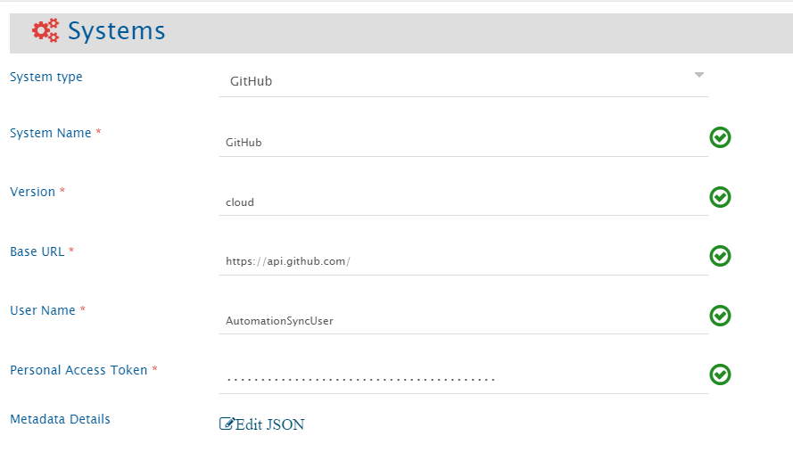
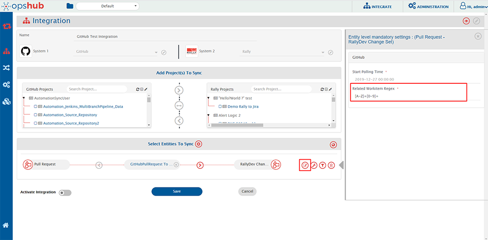
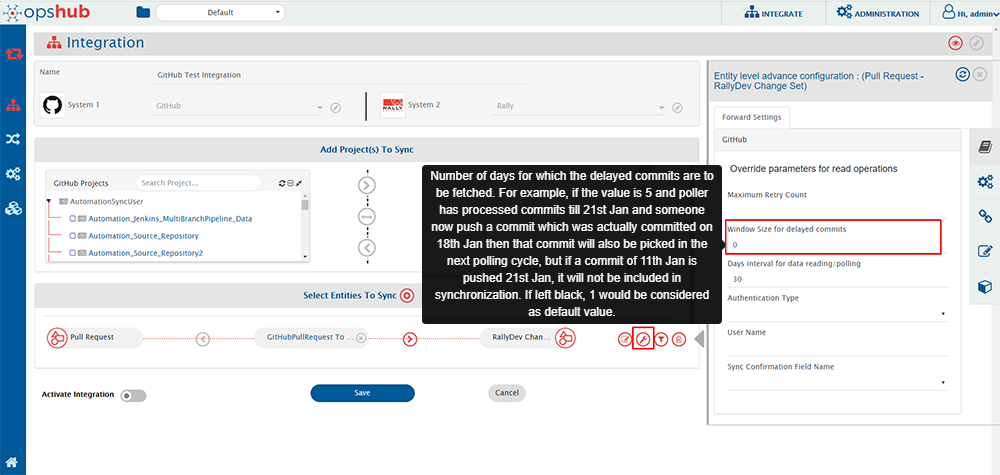
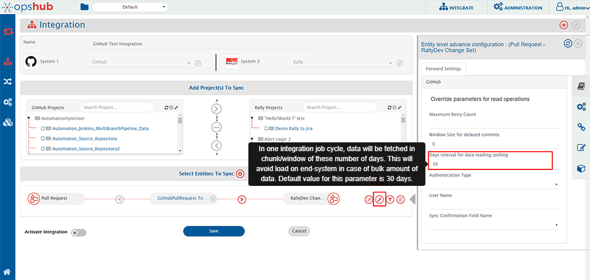
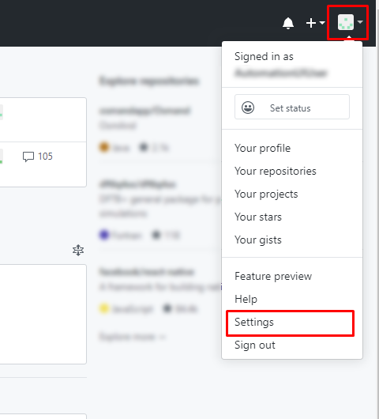
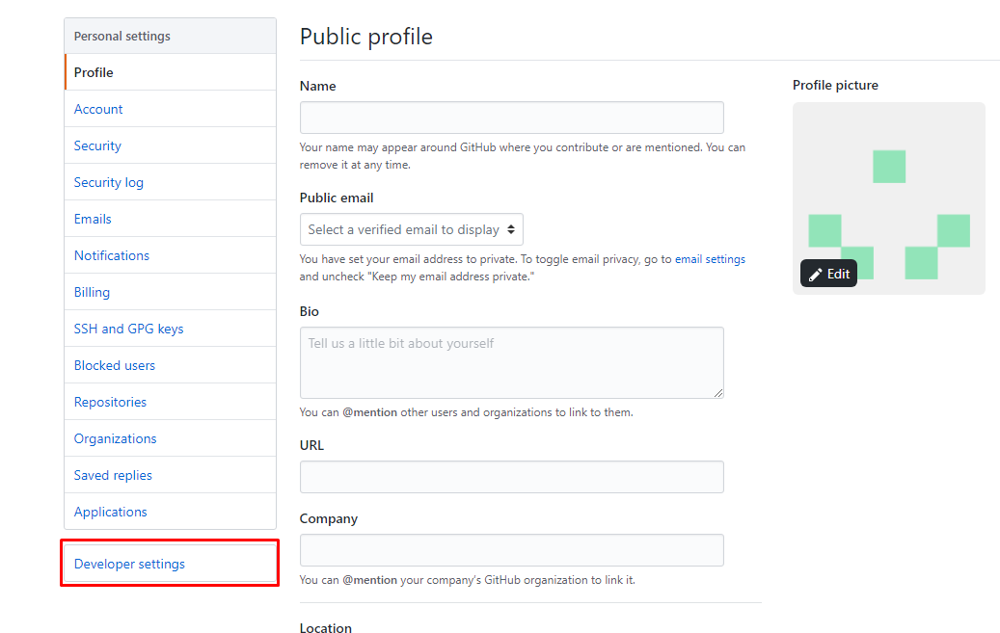
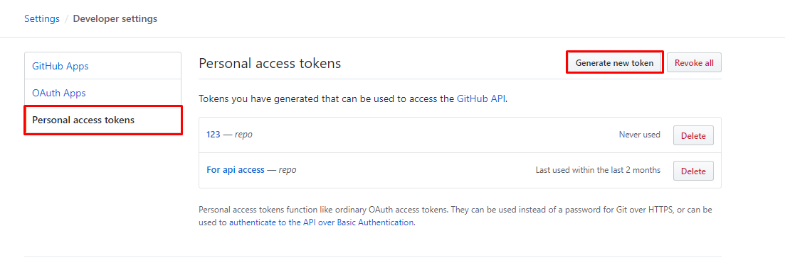
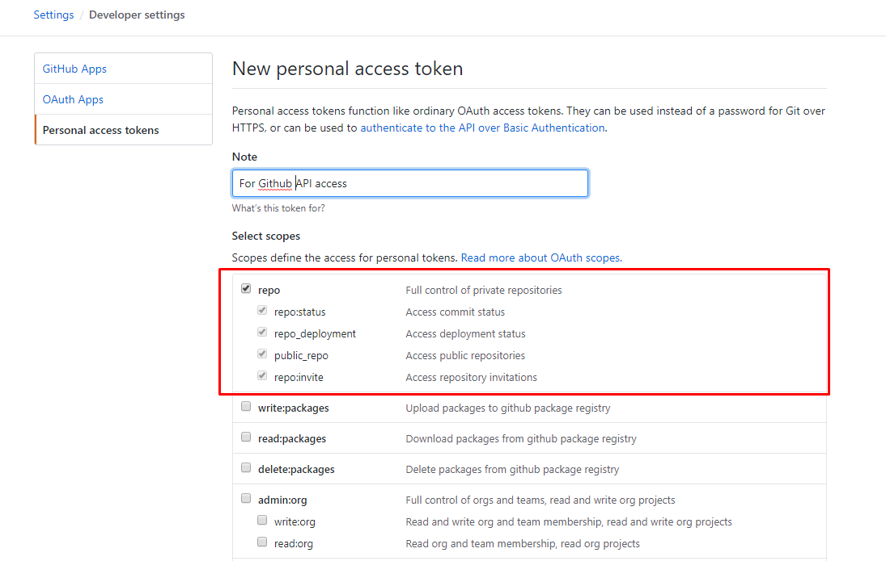
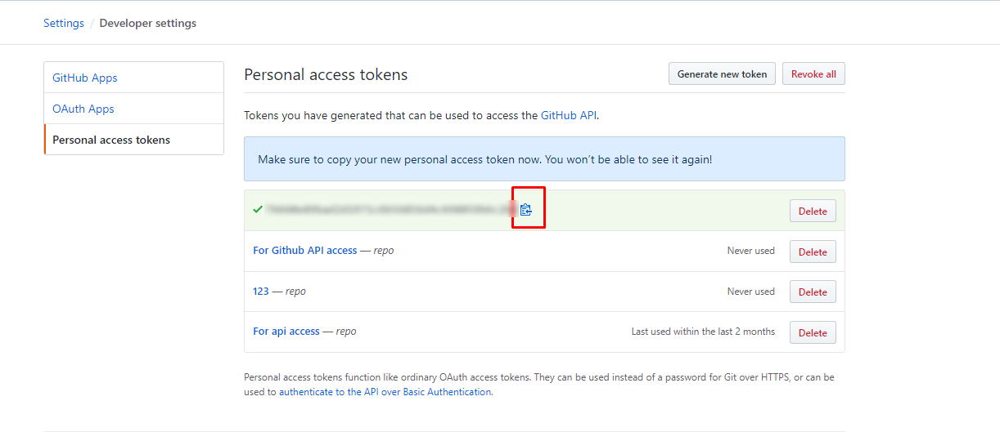

# Prerequisites

## User privileges

Create one GitHub user for the repository(s) that is a part of synchronization. User should be dedicated to **OpsHub Integration Manager** and should not be used for any other operations from system's user interface.  
GitHub supports only Personal Access Token Authentication:  
* Personal Access Token Authentication - The integration user should be added as a collaborator in the repository which is to be synced. Additionally, the following set of scopes are required while creating Personal Access Token for synchronization.

| **Entity Type** | **Permission/Role** |
|------------------|---------------------|
| **Commit** | repo: repo:status and public_repo |
| **Pull Request** | repo: repo:status, repo_deployment, public_repo and repo:invite |
| **Issue** | User should be added as a collaborator for the repository |


Refer to section [Creating Personal Access Token](#create-personal-access-token) of appendix on how to create Personal Access Token.

# System Configuration

Before you start with the integration, you must first configure GitHub end system.  
Click [System Configuration](../integrate/system-configuration.md) to learn the step-by-step process to configure a system.  
Refer to the screenshot given below:  

<p align="center">
  
</p>

<br>

If the system is deployed on HTTPS and a self-signed certificate is used, then you will have to import the SSL Certificate to be able to access the system from TEST MEDIAWIKI. Refer to [Import SSL Certificates](../getting-started/ssl-certificate-configuration.md) page for further details.

**Understanding Metadata Details JSON Input**

* The field **metadata details** is required for synchronization of GitHub Issue entity type.  
* This field data is pre-populated in JSON format according to our knowledge of system metadata (entity type, field names, lookup...). However, the user can edit it, based on his/her GitHub instance details for system/custom metadata.  
* Please refer to [Understanding JSON Metadata Input](#understanding-json-metadata-input) section for further details on the JSON input.

# Mapping Configuration

Map the fields between GitHub and the other system to be integrated to ensure that the data between both the systems synchronize correctly.  
<br>
Click [Mapping Configuration](../integrate/mapping-configuration.md) to learn the step-by-step process to configure mapping between the systems.  

## Fields available in GitHub

Following is the description of fields that are available in GitHub for mapping configuration:

| **Entity Type** | **Field Type** | **Field Name** | **Description** |
|------------------|----------------|----------------|-----------------|
| **Commit** | Text fields | Commit ID | Each commit gets a unique identifier in GitHub. This field represents this unique identifier, often called SHA of commit. |
|  |  | Files Committed | Files that were changed/committed in the commit. |
|  |  | Branch Name | Name of branch in which that commit was done. |
|  |  | Related Workitem Id(s) | Related workitem id given in Commit message is based on the regex given in integration configuration. For more details on regex configuration, refer to section [Regex configuration in Integration](#configuring-related-workitem-regex). |
|  | Single-valued user field | Author | Details of user who is author of that commit. |
|  |  | Committer | Details of user who did the commit. Note: Author and Committer can be different or they can be same. |
|  | Date type field | Commit Date | Time the commit was done in repository. |
| **Pull Request** | Number type fields | Number of Commits | Number of commits that are present in the created Pull Request. |
|  |  | Files Changed | Number of files changed in the commits for which the Pull Request is created. |
|  |  | Additions/Deletions | Number of lines added or deleted in the commits respectively for which the Pull Request is created. |
|  | Boolean type fields | Merged | It shows whether the Pull Request is merged with the base branch or not. |
|  | Text type fields | URL | GitHub URL of Pull Request: When clicked on the URL, the user gets redirected to the Pull Request on GitHub server. |
|  |  | Number | Pull Request display id in GitHub. |
|  |  | Title | Pull Request title. |
|  |  | Merge Commit SHA | When Pull Request is merged from head branch to base branch, a merge commit is added in the head branch. This field contains the SHA of that merge commit. For more information on value of merge commit sha, kindly refer to section, **Get a single Pull Request** of document [Merge Commit SHA](https://developer.github.com/v3/pulls/#get-a-single-pull-request). |
|  |  | Head Branch Name | Name of the branch in which the Pull Request was created. This is known as Head branch. |
|  |  | Base Branch Name | Name of the branch in which the Pull Request is merged or is going to be merged. This is known as Base branch. |
|  |  | Head Branch Repository | Repository name of the head branch of Pull Request (Branch from which the Pull Request is created). |
|  |  | Base Branch Repository | Repository name of the base branch of Pull Request (Branch to which the Pull Request is merged). |
|  |  | Milestone Name | Name of the milestone associated with the Pull Request. |
|  |  | Related Workitem Id(s) | Related workitem id given in Pull Request title/description based on the regex given in integration configuration. For more details on regex configuration, refer to section [Regex configuration in Integration](#configuring-related-workitem-regex). |
|  | HTML fields | Description | First comment added while creating the Pull Request. |
|  | Single-valued lookup field | State | State of Pull Request: The current state available for lookup are Open and Closed. If a Pull Request is not merged, then the state is Open and if a Pull Request is merged or rejected, then the state changes to Closed. |
|  | Multi-valued lookup field | Labels | Labels that can be added to Pull Request: The lookup contains all the labels present in your repository. |
|  |  | Reviewer Teams | Teams that can be added as a Reviewer in Pull Request. The lookup contains all the teams that are added in your organization. |
|  | Single-valued user field | Created By | Details of the user who created the Pull Request. |
|  |  | Merged By | Details of the user who merged the Pull Request. |
|  |  | Head Branch Created By | Details of the user who created the head branch of the Pull Request. |
|  |  | Base Branch Created By | Details of the user who created the base branch of the Pull Request. |
|  | Multi-valued user field | Assignees | Details of the users assigned to this Pull Request. |
|  |  | Reviewer Users | Details of the reviewers that are added to this Pull Request. |
|  | Date type field | Created At | Date when the Pull Request was created in head branch. |
|  |  | Updated At | Date when the Pull Request was updated. |
|  |  | Closed At | Date when the Pull Request was closed. If a Pull Request is in Open state, then Closed At will be null. |
|  |  | Merged At | Date when the Pull Request was merged. If a Pull Request is in Open state or is in Closed state and is rejected, then Merged At will be null. |
| **Issue** | Text type fields | Title | Issue entity title. |
|  |  | Entity Id | The id of the Issue Entity. |
|  |  | Event Type | Read only field indicating the type of the event. |
|  |  | Project Key | Denotes the key of the project. |
|  |  | Project Name | Denotes the name of the project. |
|  |  | OH Comment | Indicates comment in entity. |
|  | Lookup type fields | Labels | Labels that can be added to Issue: The lookup contains all the labels present in your repository. |
|  |  | Projects | Contains the list of the projects contained in the instance. |
|  |  | Status | Indicates the state of the entity. It could be either in open state or in closed state. |
|  |  | State_reason | Indicates the state reason of the entity. It could be 'Completed', 'Not_Planned' or 'Reopened'. For more details, refer to [Known Behavior](#known-behaviors) section. |
|  | HTML type fields | Body | Contains the description of the entity. |

---

## Inline attachments synchronization

For HTML fields in **OpsHub Integration Manager**, GitHub allows to synchronization of inline images. Such content can be synchronized for GitHub with the following behavior:  
* Images and other type of files are synced to the target system depending on whether the target system supports inline images or not.  

For **limitations** of Inline image synchronization, refer to [Limitations](#known-limitations) section.

## User Mapping Configuration
**Pull Request entity:**  
* By default, user field synchronization in **OpsHub Integration Manager** works on user email added in both source and target end systems.  
* To make user mapping to work on username instead of email address, the username in both source and target end systems must be same. Otherwise, excel mapping will be required for one-to-one user mapping. Refer below mentioned sample examples.

**Issue entity:**  
* User Lookup based on **Email** is not supported. Hence, to perform the user mapping based on username instead of email address, the username in both source and target end systems must be same. Otherwise, excel mapping will be required for one-to-one user mapping. Refer below mentioned sample examples.

**Below are few samples of user mapping:**  
<br>  
**Sample 1 - This mapping will work when username in both source and target end systems are same.**

```xml
<Author>
  <xsl:choose xmlns:xsl="http://www.w3.org/1999/XSL/Transform">
    <xsl:when test="SourceXML/updatedFields/Property/user/userEmail">
      <xsl:value-of select="SourceXML/updatedFields/Property/user/userName"/>
    </xsl:when>
    <xsl:otherwise>
      <xsl:value-of select="defaultUserName"/>
    </xsl:otherwise>
  </xsl:choose>
</Author>
```

**Sample 2 - This is an excel mapping example where we need to have an excel file which will have one-to-one user mapping. This will get the username of a user in target end system corresponding to the source system user's username from excel sheet.**

```xml
<Author xmlns:xsl="http://www.w3.org/1999/XSL/Transform" xmlns:xslUtils="http://com.opshub.utils.xslutils.excel.ExcelSheetValueLookup">
  <xsl:choose>
    <xsl:when test="SourceXML/updatedFields/Property/userEmail!=''">
      <xsl:variable name="lookUpEmail" select="xslUtils:lookup('///home///UserEmail information list.xlsx','GitHub to Rally User info list','C','D',SourceXML/updatedFields/Property/userEmail)"></xsl:variable>
      <xsl:choose>
        <xsl:when test="$lookUpEmail !=''">
          <xsl:value-of select="$lookUpEmail"/>
        </xsl:when>
        <xsl:otherwise>
          <xsl:value-of select="SourceXML/updatedFields/Property/user/userName"/>
        </xsl:otherwise>
      </xsl:choose>
    </xsl:when>
    <xsl:otherwise>
      <xsl:value-of select="defaultUserName"/>
    </xsl:otherwise>
  </xsl:choose>
</Author>
```

# Integration Configuration

In this step, we need to set a time to synchronize data between GitHub and the other system to be integrated.  
Also, define parameters and conditions, that are needed to be configured for integration.  

Click [Integration Configuration](../integrate/integration-configuration.md) to learn the step-by-step process to configure integration between two systems.


## Configuring Related Workitem Regex

For synchronization, you need to specify a **Related Workitem Regex** (Regular Expression) while configuring integration for picking related work item id from the commit message in case of Commit Information and Title/Description in case of Pull Requests.

For example, for commit information, if your commit message is:  
“commiting against TEST-123, added login feature for my website” and the related work item id on which you want to synchronize commit information is TEST-123, then RegEx for your input will be:

```regex
[A-Za-z]+-\d+
```

* Use Case 1 - Create/Update against specific workitem: If you want to create entity against a work item in your target system, then you need to specify a [Target Lookup Query](../integrate/integration-configuration.md#search-in-target-before-sync) for your target system. The parameter for specifying related work item id is @Related Workitem Id(s)@.
  	* Update against existing workitem: This query searches the related work item (for which you specified a RegEx) and will add the entity to TEST-123 according to the field mapping configured. If the entity is found, then the information will be updated on that entity according to the field mapping.
  	* Create new work item, then update: If this entity is not found in your target system and you want integration to create this entity first, and then synchronize source entity to it, then you can set the "If no entity found matching above query?" option in Target Lookup Query to "Create new entity in target".
* Use Case 2 - Create new work item everytime: If you want integration to synchronize and create an entity in your target system for every entity in source system, then provide an incorrect RegEx which will not match your work item id in your commit message. For example, you can provide RegEx as $OpsHub$. Since $OpsHub$ does not match your work item id, the integration will create a new entity in your target system according to the mapping configured. There is no need to enter a Target Lookup Query in this case.

<p align="center">
  
</p>

For knowing the behavior on RegEx matching multiple work items ids, please refer to section [RegEx Known Behavior](#known-behaviors).

## Configuring Window Size for delayed commits

Window size for delayed commits is used to fill in the gap between the day commit was done and when the commit was actually pushed into a repository.

Window size for delay commit means the number of days for which the delayed commits are to be synced. For example, if the value is 5 and the poller has processed commits till 21st Jan and someone now pushes a commit that was actually committed on 18th Jan, then that commit will also be picked in the next polling cycle. However, if a commit of 11th Jan is pushed on 21st Jan, it will not be included in the synchronization. If this field is left blank, **1** would be considered as the default value.

<p align="center">
  
</p>

>**Note**: This parameter is only applicable for Commit Information.

## Configuring Days interval for data reading/polling

Days interval for data reading configures the window for which entities will be polled in one job cycle. For example, if the value is 10, then the data will be polled in intervals of 10 days in one job cycle. The default polling window is 30 days, i.e. entities will be polled for 30 days in one job cycle. This parameter helps in reducing the load on end system.

<p align="center">
  
</p>

## Criteria Configuration

If you want to specify conditions for synchronizing an entity between GitHub and the other system to be integrated, you can use the **Criteria Configuration** feature.

>**Note**: GitHub Commit Information entity doesn't support any criteria polling.

To configure criteria in GitHub, integration needs to be created with GitHub as the source system. The criteria query in GitHub system is a valid GitHub search query that can be used in the GitHub end system UI for search in a repository.

Criteria configuration can be done on fields-State, Author, Assignee, Labels, Milestones, etc. Refer to the document [Searching Issues & Pull Requests](https://help.github.com/en/github/searching-for-information-on-github/searching-issues-and-pull-requests) for more fields on which criteria can be configured.

| Field Type | Criteria Description | Criteria snippet |
|------------|-------------------|----------------|
| **Lookup** | Synchronize all entities which have state as Open | state:open |
| **Lookup** | Synchronize all entities which do not have state Closed | -state:closed |
| **Date** | Synchronize all entities closed after certain date | closed:>2018-04-14 |
| **Text** | Synchronize all entities which contain 'PR' in title field | PR in:title |
| **User** | Synchronize all entities which were created by user 'Robert' | author:Robert |
| **User** and **Text** | Synchronize all entities that were created by user 'Robert' and have 'PR' in title | PR in:title author:Robert |
| **Multivalued lookup** and **Text** | Synchronize all entities that have Label set as 'bug' but not 'invalid' and which have text 'pull' in 'title' or 'description' field | pull in:title,body label:bug -label:invalid |
| **OR criteria using AND and NOT** | Consider that there are following labels in a repository - bug, abc, duplicate, documentation and invalid. This will synchronize all entities that have label documentation or invalid or both. | -label:bug -label:abc -label:duplicate |
| **OR criteria** | Synchronize all entities which are in Closed state and have either 'PR' in title or 'ER' in description(body) fields | is:closed PR in:title OR ER in:body |

In GitHub, search can be done on either text in a field or for some value of a lookup field. When doing search for a text in a field, we can add AND, OR and NOT operators in search criteria. Refer to criteria sample 'OR criteria' in the above table. For searching a particular value of a lookup field like label or user, then we can only provide AND and NOT operators in criteria query. Refer to criteria sample 'OR criteria using AND and NOT' in the above table.

Refer to document [Search Syntax in GitHub](https://help.github.com/en/github/searching-for-information-on-github/understanding-the-search-syntax) for more information on constructing search query.

# Known Behaviors

* API Rate Limitation in GitHub:
  * GitHub has limitation on API access per minute for a single user. Due to this, {{SITENAME}} can access GitHub API within a limit. When the limit exceeds, the GitHub API stops responding for certain amount of time, and no API calls can be done by {{SITENAME}} during that time until GitHub resets the limit for that user.
  * For GitHub Cloud instance, the rate limit for Search API is 30 requests per minute, and other APIs have the rate limit of 5000 requests per hour whereas for GitHub on-premise instance, the rate limit is configurable. For configuring rate limit on GitHub on-premise, refer to the document [Configuring Rate Limits](https://help.github.com/en/enterprise/2.20/admin/installation/configuring-rate-limits).
  * To address this issue, we have added wait time in entity synchronization. Thus, there might be some delay in synchronization. For more information on API rate limitations, refer to document [Rate Limits](https://developer.github.com/v3/#rate-limiting).
  * There are some measures that can be taken to experience less delay in synchronization.
    * We can configure multiple integrations for synchronizing multiple GitHub repositories with different set of GitHub users, so that rate limit has less impact on synchronization time.
    * If you have an on-premise GitHub instance, then you can either have no rate limit for API or you can have a large API rate limit to experience less delay in synchronization.
* Related Workitem Id(s) field behavior:
  	* If multiple work item ids are found in commit message/title/description that satisfy the Regex provided in integration configuration, by default, the first one gets picked up in Related Workitem Id(s) and is sent forward for synchronization.
  	* If any workitem id is not found, then it shows -1 in field Related Workitem Id(s).
* **State_reason** field behavior for **Issue** entity:
  	* This field is dependant on **Status** field.
   		 * Reason: For closing status, we have two options in GitHub **Completed** & **Not_Planned**. For opening an issue from close state, the reason will be **reopen**. Hence, State_reason field is mandatory, if we want to sync the states properly.  Or else, the Status field will be synced with the default behaviour of GitHub.

# Known Limitations

## Common
* For GitHub HTML fields:
	  * Content less than 400 KB will only be synchronized. If the field content is greater than 400 KB, then the field value will not be transformed correctly by {{SITENAME}}.
	  * Synchronization of inline document is not supported for HTML fields of GitHub.
	  * For synchronization of inline image which refers to the checked-in files of a repository, {{SITENAME}} is using keyword "blob" for processing the URL of such images. Thus, username and repositories with such inline images must not have "blob" keyword in their name. Otherwise, inline images which refer to the checked-in files in the repository won't be synchronized by {{SITENAME}}. In such cases, the source inline image URL will be written in the target system as it is.
	  * Inline image synchronization for comments is not supported currently for GitHub as a target system due to API limitation. It will sync as a inline file.
	  * Inline document synchronization for comments is not supported currently for GitHub as a target system due to API limitation.
* GitHub doesn't give Updated By user information through API. Hence, this field won't be present in fields in mapping.

## Commit
* GitHub Commit information entity doesn't support any criteria-based polling.

## Pull Request
* For GitHub Pull Request, the current values for status field are Open and Closed.
  * Going forward, if GitHub introduces a new status, then user can use it with the help of advanced mapping.
* By default, user field synchronization in {{SITENAME}} works on user email added in both source and target end systems.
  * For Pull Requests, the user mapping in {{SITENAME}} will work on the email address of users. In case the user email for any user is not publicly available in GitHub, then the mapping will work on a username by default for that user. In such a case, the username of source user and target user must be the same, otherwise, there will be a failure in synchronization. This is because GitHub API provides an email address only when the user has made his/her email address publicly available. Thus, {{SITENAME}} can access the email of any user if it's visible as a public email.
    * In case the source username is not found in the target system and failure occurs, then one-to-one username mapping will be required. For more information, refer to section [User Mapping Configuration](#user-mapping-configuration). 
* For Pull Requests, we can synchronize Commits entity as links. GitHub API gives the latest 250 commits in a Pull Requests. Thus, when links are configured for Pull Request integration, only the latest 250 commits will be in sync with the target system i.e. The 1st commit link will be removed in target system when 251st commit is added in source system and the target system will have links of commit 2 to 251.

## Issue entity
* Attachment synchronization is not supported.
* Relationship synchronization is not supported because of API unavailability.
* History based synchronization is not supported because of API unavailability.
* Fields need to be given in JSON input at the system configuration level. Based on configurations, the fields will be loaded in the mapping.
  * Custom fields are not supported by GitHub, hence they will be not supported by {{SITENAME}}.
* User Lookup based on **Email** is not supported due to API unavailability. For more information, refer to [User Mapping Configuration](#user-mapping-configuration) section.

## Entity Mention
**Github as Source**:
* Any text in GitHub that follows the entity mention format will be treated as an entity mention, even if the entity does not exist in the target system. The GitHub API returns issue references as they appear, without distinguishing whether they have been auto-linked. This can result in non-existent issue numbers being treated as valid mentions, potentially leading to URLs in the target system that redirect to a 404 page on GitHub.

**Github as Target**:
* When synchronizing rich text from a source system to GitHub, any text formatted as a supported entity mention will be automatically converted to an entity mention if a corresponding issue exists in GitHub.
* In a bidirectional synchronization scenario, if an entity mention is unintentionally created due to GitHub’s auto-linking, it will be treated as a valid mention when syncing back, behaving as if GitHub is the source.
* When synchronizing rich text that contains adjacent entity mentions (without spaces between them), GitHub may generate a hyperlink only for the last mention, even if both correct links are sent to the GitHub API. This can lead to incomplete or inaccurate linking in the final output.

**Example**: In Source System A, the text is "#1#2". After synchronization, GitHub will display this as "12" with a hyperlink redirecting to the URL of the entity with identifier "2," assuming the mention settings include the source URL option.

# Appendix
## Create Personal Access Token

* Log in with the integration user in GitHub Cloud.  
* Click on your user name at top right corner and select **Settings** option.

<p align="center">
  
</p>

* Select **Developer Settings** as shown below:

<p align="center">
  
</p>

* Select **Personal access tokens** and click **Generate new token** option:

<p align="center">
  
</p>

* Provide the Note for the token and select **repo** scope. Then click **Generate token** button at the bottom:

<p align="center">
  
</p>

* Copy the token value and save it for future use:

<p align="center">
  
</p>

## Understanding JSON Metadata Input

* Sample example of JSON Metadata input for Issue entity.

```json

{
	"entities": [
		{
			"internalName": "entityInternalName1",
			"displayName": "Entity Display Name1",
			"readMechanism ": "HISTORY",
			"hasReadSupport ": true,
			"hasWriteSupport": true,
			"entityScope": "Global",
			"systemSpecific": {
				"OH_LastUpdatedField": "fieldInternalname",
				"isProjectSupported": true
			},
			"fields": {
				"system": [
					{
						"internalName": "title",
						"displayName": "Title",
						"systemSpecific": {
							"timeUnitInSystem ": "Hours"
						},
						"dataType": "text",
						"multiselect": false,
						"readOnly": false,
						"mandatory": false,
						"historyEnabled": false
					},
					{
						"internalName": "body",
						"displayName": "Body",
						"dataType": "html",
						"multiselect": false,
						"readOnly": false,
						"mandatory": false,
						"historyEnabled": false
					},
					{
						"internalName": "state_reason",
						"displayName": "State_reason",
						"dataType": "lookup",
						"multiselect": false,
						"readOnly": false,
						"mandatory": false,
						"historyEnabled": false
					},
					{
						"internalName": "state",
						"displayName": "Status",
						"dataType": "lookup",
						"multiselect": false,
						"readOnly": false,
						"mandatory": false,
						"historyEnabled": false
					},
					{
						"internalName": "labels",
						"displayName": "Labels",
						"dataType": "lookup",
						"multiselect": true,
						"readOnly": false,
						"mandatory": false,
						"historyEnabled": false
					},
					{
						"internalName": "milestone",
						"displayName": "Milestone",
						"dataType": "text",
						"multiselect": false,
						"readOnly": false,
						"mandatory": false,
						"historyEnabled": false
					},
					{
						"internalName": "assignee",
						"displayName": "Assignee",
						"dataType": "user",
						"multiselect": false,
						"readOnly": false,
						"mandatory": false,
						"historyEnabled": false
					},
					{
						"internalName": "assignees",
						"displayName": "Assignees",
						"dataType": "user",
						"multiselect": true,
						"readOnly": false,
						"mandatory": false,
						"historyEnabled": false
					}
				],
				"custom": []
			},
			"relationship": {
				"entities": [
					{
						"internalName": "supportedEntityInternalName1",
						"displayName": "Supported Entity Display  Name1",
						"isSupportedAsSource": true,
						"isSupportedAsTarget": true
					},
					{
						"internalName": "supportedEntityInternalName2",
						"displayName": "Supported Entity Display Name2"
					}
				],
				"linkTypes": []
			}
		}
	],
	"projects": [
		{
			"internalName": "",
			"displayName": "Project 1",
			"entities": []
		}
	]
}
```


