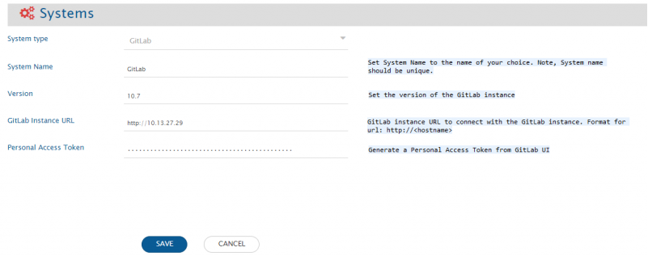
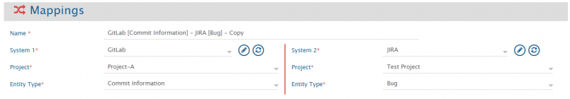
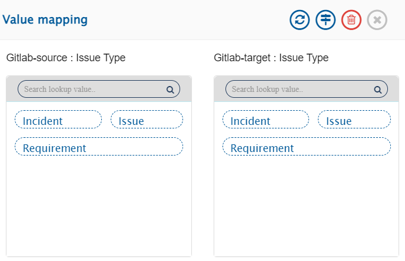
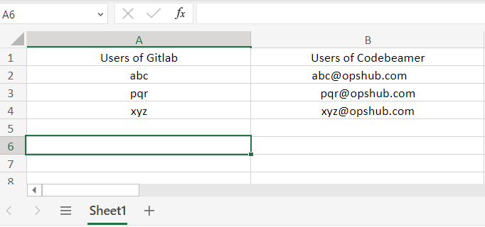
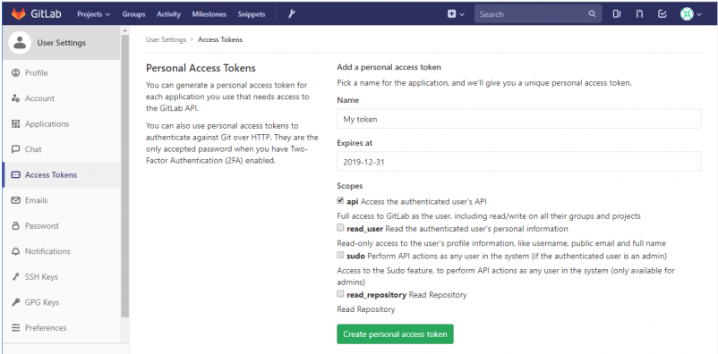

# Prerequisites

## Personal Access Token

OpsHub Integration Manager Integration Configuration requires Personal Access Token to authenticate with GitLab's API.  
Refer [Generating Personal Access Token](#generating-personal-access-token) in appendix for the steps to generate Personal Access Token.

# System Configuration

Before you proceed to the integration, you must first configure GitLab onto OpsHub Integration Manager.  

Click [System Configuration](../integrate/system-integration.md) to learn the step-by-step process to configure a system.  

Refer to the screenshot given below for reference:

<p align="center">
  
</p>

If the system is deployed on HTTPS and a self-signed certificate is used, then you will have to import the SSL Certificate to be able to access the system from OpsHub Integration Manager. Click [Import SSL Certificates](../getting-started/ssl-certificate-configuration.md) to learn how to import SSL certificate.

# Mapping Configuration

Map the fields between GitLab and the other system to be integrated to ensure that the data between both the systems synchronizes correctly.  

<p align="center">
  
</p>

* Synchronization of Issue Types:
  * Issue Type field is to be configured where the Issue Type you want to sync to Gitlab is mapped.

<p align="center">
  
</p>

Click [Mapping Configuration](../integrate/mapping-configuration.md) to learn the step-by-step process to configure mapping between the systems.

* Synchronization of Start Date and End Date for Epic:
  * A Date Type lookup field should be mapped to "Fixed" to synchronize the start and end date values.
  * The possible values for Date Type fields are "Fixed" and "Inherited".
  * If set to "Fixed", the start and end date values will be synchronized according to the mapping configuration.
  * If set to "Inherited", the start and end date values will be populated based on GitLab's behavior for the linked milestone of the child issues.
  * A processing failure may be observed in the following scenarios when start or end dates are mapped:
    * The Date Type value is set to "Inherited".
    * The Date Type value is not mapped, and the date fields are set to "Inherited" in the end system.

# Integration Configuration

In this step, set a time to synchronize data between GitLab and the other system to be integrated. Also, define parameters and conditions, if any, for integration.  

<p align="center">
  
</p>

Click [Integration Configuration](../integrate/integration-configuration.md) to learn the step-by-step process to configure integration between two systems.

## Commit Information

To synchronize **Commit Information**, you need to specify a **Related Workitem Regex** (Regular Expression) while configuring integration for picking Related WorkItem ID from the commit message.

For example, if your commit message is: "commiting against TEST-123, added login feature for my website"

And the related workitem ID on which you want to synchronize commit information is TEST-123, then RegEx for your input will be:  
`[A-Za-z]+-\d+`

* Use Case 1 - Create/Update against specific workitem: If you want to commit against a workitem ID in your target system, then you will need to specify a [Target Lookup Query](../integrate/integration-configuration.md#search-in-target-before-sync) for your target system. The parameter of specifying Related Workitem ID is @Related Workitem Id(s)@.
  * Update against existing workitem: This query will search the Related WorkItem ID (for which you specified a RegEx) and will add the commit information to TEST-123 according to the field mappings configured. If the entity is found, then commit information will be updated on that entity according to the field mapping.
  * Create new workitem then update: If this entity is not found in your target system and if you want integration to create this entity first and then synchronize commit information to it, then you can set the "If no entity found matching above query?" option in Target Lookup Query to "Create new entity in target".
* Use Case 2 - Create new workitem everytime: If you want integration to synchronize and create an entity in your target system for every commit information, then provide an incorrect RegEx which will not match your workitem ID in your commit message. For example, you can provide RegEx as $OpsHub$. Since $OpsHub$ will not match your workitem ID, the integration will create a new entity in your target system according to the mapping configured. There is no need to enter a Target Lookup Query in this case.

## Project/Group-specific entities

### In case of Group

OpsHub Integration Manager supports "Epic" entity of Group.

### In case of Project

OpsHub Integration Manager supports two entities of Project: Commit Information, Issues (Incident, Requirements).

## Criteria Configuration

If you want to specify conditions for synchronizing an entity between GitLab and the other system to be integrated, you can use the Criteria Configuration feature.

Go to Criteria Configuration section on [Integration Configuration](../integrate/integration-configuration.md#criteria-configuration) page to learn in detail about Criteria Configuration.

To configure criteria in GitLab, integration needs to be created with GitLab as the source system.

### Query

Set 'Query' as given below. For Example:

* **state=opened**
* **state=closed**
* **labels=foo**
* **labels=foo,bar**
* **labels=foo,bar&state=opened**
* **search=issue+title+or+description**
* **assignee_id=5**

# Known Limitations and Behavior

## Issues

### Common for On Premise and On Cloud

* End System criteria is not supported.
* Comment Synchronization:
  * To synchronize comments to the target system, an additional update on any field of Issues entity is required.
    * Reason: When comments are added, the last updated time of Issues entity doesn't get updated.
* UserMention sync is not supported.

### GitLab On Premise

* GitLab as the source system and version is prior to 11.0:
  * Description field will be synchronized to the target system without any formatting.
    * Reason: Unavailability of API.

### GitLab On Cloud

* Severity, Health Status fields are supported as read only in OpsHub Integration Manager.
  * Reason: Write API unavailability.
* Milestones and Iterations sync is not supported.
* Synchronization of User fields:
  * For the user sync, the advanced mapping needs to be configured in the OpsHub Integration Manager where the excel based look-up can be used for user mapping.
    * Reason: GitLab Cloud API does not provide the user email.
  * User mapping can be set in the advanced mapping as follows:

```xml
<xsl:when test="userName">
  <xsl:variable name="targetemail" select="excel:lookup('FilePath','SheetName','SourceColumnName','TargetColumnName', userName)"/>
  <xsl:variable name="emailTarget" select="userUtils:getUserNameFromEmail($workflowId, $targetSystemId, $targetemail, 'false', 'false')"/>
</xsl:when>
```

* Excel sheet entries for user look-up can be done as follows:

<p align="center">
  
</p>

* Excel based look-up in advanced mapping for the above will be:

```xml
<xsl:variable name="targetemail" select="excel:lookup('FilePath','Sheet1','A','B', userName)"/>
```

## Commit Information

* GitLab as a source system:
  * OpsHub Integration Manager cannot synchronize commits older than 1 year for a specific project.
    * Reason: GitLab removes pushed commit events older than 1 year from their records for performance reasons.
  * Criteria configuration is not supported.
  * Synchronization of Commit Discussions are not supported.
  * Synchronization of Commit, which is imported from other sources is not supported.

## Epics

* A prefix is added along with the sync of description field for recovery purpose. Do not delete this prefix.
* For Epic entity, only read support of inline image/document is supported.
  * API to upload attachment is not working for Epic.

# Appendix

## Generating Personal Access Token

For generating Personal Access Token, follow the steps given below:
1. Log in to your GitLab account.
2. In the upper-right corner, click your avatar and select **Settings**.
3. On the User Settings menu, select **Access Tokens**.
4. Choose a name and an expiry date for the token.
5. Choose the desired scopes. **api** must be selected in scope for enabling full access to GitLab and its projects.
6. Click the **Create personal access token** button.
7. Save the personal access token somewhere safe.  
> **Note** : you leave or refresh the page, you will not be able to access the Personal Access Token again.

<p align="center">
  
</p>
