# Prerequisites

## User privileges

* Create one user of Engineering Workflow Management (EWM), dedicated to OpsHub Integration Manager. User should not be used to do any operations from system's user interface.
* User should be member of a Project Area with permission to create/modify work-items. For help on how to assign membership and role, please refer [Assign Membership and Role](#assign-membership-and-role).
* Integration User must have at least one out of 'Contributor Client Access License', 'Developer Client Access License' and 'Stakeholder Client Access License' assigned, and 'Repository' permissions should have at least one of the 'JazzUsers', 'JazzProjectAdmins' and 'JazzAdmins' marked. For step-by-step guide, please refer to [User Privileges](#user-privileges).
* Permissions are required for Delete and Modify attachments features. For help on how to set permission for attachments, please refer [User Privileges for Attachment Operations](#user-privileges-for-attachment-operations).
* For syncing user type of fields from source system to target system - EWM, it is necessary for the mapped user (in field value mapping of user type fields) to be a member of the corresponding project. For help on how to assign membership and role, please refer [Assign Membership and Role](#assign-membership-and-role).

# System Configuration

Before you continue to the integration, you must first configure EWM. Click [System Configuration](../integrate/system-configuration) to learn the step-by-step process to configure a system.  
Refer the screenshot given below for reference.

<p align="center">
  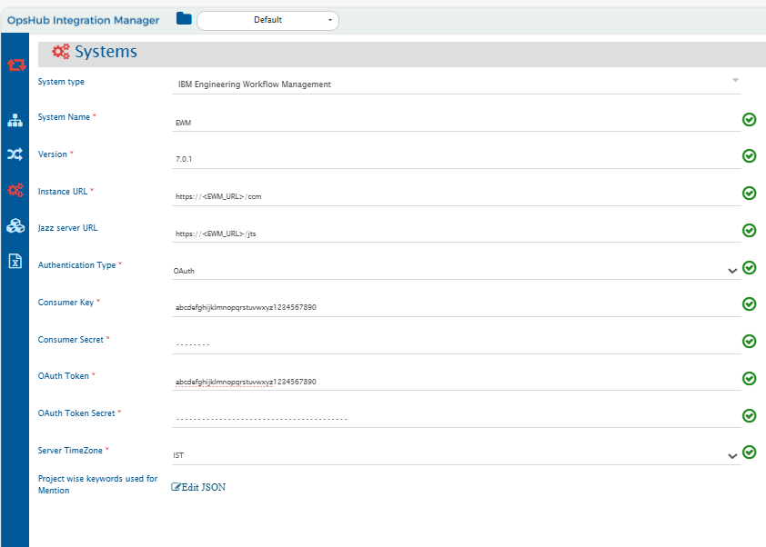
</p>


If the system is deployed on HTTPS and a self-signed certificate is used, then you will have to import the SSL Certificate to be able to access the system from OpsHub Integration Manager. Click [Import SSL Certificates](../getting-started/ssl-certificate-configuration.md) to learn how to import SSL certificate.

If user wants to configure EWM as source endpoint of the integration and wants to migrate entity mention details, Click [Entity mention detection configuration](#entity-mention-detection-configuration) to learn how to configure entity mention for EWM system.

**IBM Engineering Workflow Management system form details**

| **Field Name** | **When field is visible on the System form** | **Description** |
|----------------|----------------------------------------------|------------------|
| **System Name** | Always | Set **System Name** to **IBM Engineering Workflow Management** or any other name you want. This name will appear throughout the application<br>**Note:** **System Name** should be unique |
| **Version** | Always | Provide the supported version of IBM Engineering Workflow Management Example: 7.0.1. |
| **Instance URL** | Always | Set **Instance URL** to the **IBM Engineering Workflow Management** application base URL. Example: https://10.13.35.875:9443/ccm |
| **Jazz server URL** | Always | Set **Jazz server URL** to the **IBM Engineering Workflow Management** Jazz server URL. Example: https://10.13.35.875:9443/jts |
| **Server TimeZone** | Always | Set **TimeZone** as per the Engineering Workflow Management server |
| **Project wise keywords used for Mention** | Always | Provide keywords that could be used to mention an entity. Refer to [Entity mention detection configuration](#entity-mention-detection-configuration) section |
| **Metadata Details** | Always | This data is required if the user wants to add or overwrite link metadata. For the format and guidance related to filling these details in JSON form, refer to the [Understanding Metadata Detail Input](#understanding-metadata-detail-input) section. |
| **Authentication Type** | Always | Set **Authentication Type** to Basic or OAuth as per requirement |
| **User Name** | Only when Basic Authentication is selected | Set **User Name** to the user id of the user that you want to authenticate and use for synchronization |
| **User Password** | Only when Basic Authentication is selected | Set **User Password** for the corresponding user |
| **Consumer Key** | Only when OAuth Authentication is selected | Set **OAuth Consumer Key** as generated by the IBM Engineering Workflow Management admin and jazz server |
| **Consumer Secret** | Only when OAuth Authentication is selected | Set **OAuth Consumer Secret** for the corresponding consumer key |
| **OAuth Token** | Only when OAuth Authentication is selected | Set **OAuth Token** as generated using the [OAuth configuration](#oauth-configuration) with corresponding consumer key |
| **OAuth Token Secret** | Only when OAuth Authentication is selected | Set **OAuth Token Secret Key** for the corresponding token and consumer key |

> **Note:** Refer to [OAuth configuration](#oauth-configuration) section to configure OAuth authentication for IBM Engineering Workflow Management.

# Mapping Configuration

Map the fields between EWM and the other system to be integrated to ensure that the data between both the systems synchronizes correctly. Click [Mapping Configuration](../integrate/mapping-configuration.md) to learn the step-by-step process to configure mapping between the systems.

## Approvals Field Configuration

* **Approvals** field is supported as Read-only in OpsHub Integration Manager.
* Here is the sample advanced mapping that can be used to access the Approvals field. The mapping should be changed based on the target field:

```xml
<target-field-name>
  <xsl:for-each xmlns:xsl="http://www.w3.org/1999/XSL/Transform"  select="SourceXML/updatedFields/Property/approvalDescriptors/com.opshub.eai.rtc.model.ApprovalDescriptors_-ApprovalDescriptor">
    <op_list>
      <id>
        <xsl:value-of select="id"/>
      </id>
      <typeIdentifier>
        <xsl:value-of select="typeIdentifier"/>
      </typeIdentifier>
      <typeName>
        <xsl:value-of select="typeName"/>
      </typeName>
      <name>
        <xsl:value-of select="name"/>
      </name>
      <cumulativeStateIdentifier>
        <xsl:value-of select="cumulativeStateIdentifier"/>
      </cumulativeStateIdentifier>
      <cumulativeStateName>
        <xsl:value-of select="cumulativeStateName"/>
      </cumulativeStateName>
      <dueDate>
        <xsl:value-of select="dueDate"/>
      </dueDate>
      <approvals>
        <xsl:for-each select="approvals/com.opshub.eai.rtc.model.ApprovalDescriptors_-Approval">
          <op_list>
            <stateIdentifier>
              <xsl:value-of select="stateIdentifier"/>
            </stateIdentifier>
            <stateDate>
              <xsl:value-of select="stateDate"/>
            </stateDate>
            <stateName>
              <xsl:value-of select="stateName"/>
            </stateName>
            <approver>
              <name>
                <xsl:value-of select="approver/name"/>
              </name>
              <emailAddress>
                <xsl:value-of select="approver/emailAddress"/>
              </emailAddress>
              <userId>
                <xsl:value-of select="approver/userId"/>
              </userId>
            </approver>
          </op_list>
        </xsl:for-each>
      </approvals>
    </op_list>
  </xsl:for-each>
</target-field-name>
```

# Integration Configuration

In this step, set a time to synchronize data between EWM and the other system to be integrated. Also, define parameters and conditions, if any, for integration. Click [Integration Configuration](../integration/integration-configuration.md) to learn the step-by-step process to configure integration between two systems.

## Criteria Configuration

If you want to specify conditions for synchronizing an entity between EWM and the other system to be integrated, you can use the Criteria Configuration feature.

Refer to Criteria Configuration section on [Integration Configuration](../integration/integration-configuration.md) for more details.

The criteria query for EWM can be either in JSON or Connector format. For details, refer to page [OpsHub Query format] for specific JSON format and [Criteria query in connector format](#criteria-query-in-connector-format) section.

### Conditions supported

EWM supports the following conditions (operators) for querying in end system: **=, !=, >, <, >=, <=, in, and**

**_EWM system Operators Usage_**

| Operator supported | Operator usage |
|--------------------|----------------|
| =                  | When criteria needs to be added on single value for text, numeric or lookup type fields of EWM. |
| !=                 | When criteria needs to be added on single value for text, numeric or lookup type fields of EWM. |
| > and >=           | When criteria needs to be added on single value for numeric or date/datetime/time type fields of EWM. |
| < and <=           | When criteria needs to be added on single value for numeric or date/datetime/time type fields of EWM. |
| in                 | When criteria needs to be added on multiple value for text, numeric or lookup type fields of EWM. |
| and                | When there are multiple criteria or conditions to apply. |

### Guidelines for Query in JSON format

* **Query on fields and values with special characters**
  * Fields and values with special characters like **\\** (backslash) and **"** (double quotes) should be escaped.  
    **For example:** Fields or values having special characters like `Special[]\:"text` will become `Special[]\\:\"text` in JSON criteria query.
  * **Example queries with special characters:**
    * Query on field name `Special[]\:"` will be like:  
      `{"condition":"=","field":"Special[]\\:\\"","value":"special"}`
    * Query on field `SpecialField` and value with special characters `value\Low` will be like:  
      `{"condition":"=","field":"SpecialField","value":"value\\Low"}`

**_Sample queries for Criteria Configuration_**

| Criteria Description | Criteria snippet |
|----------------------|------------------|
| Sync all artifacts with Major severity | `{"condition":"=","field":"Severity","value":"Major"}` |
| Sync all artifacts with Minor or Normal severity | `{"condition":"in","field":"Severity","values":["Minor","Normal"]}` |
| Sync all artifacts with a start date before a specific date and time | `{"condition":"<","field":"Start Date","value":"2011-07-06T18:13:35.336Z"}` |
| Sync all artifacts where Time Spent is either 5 or 10 | `{"condition":"in","field":"Time Spent","values":[5, 10]}` |
| Sync all artifacts where Summary contains 'summary' | `{"condition":"=","field":"Summary","value":"summary*"}` |
| Sync all artifacts where Verified field's value is true | `{"condition":"=","field":"Verified","value":true}` |
| Sync all artifacts with CustomTime within a given range | `{"condition":"and","criterias":[{"condition":">","field":"CustomTime","value":"2011-07-06T18:13:35.336Z"},{"condition":"<","field":"CustomTime","value":"2012-07-06T18:13:35.336Z"}]}` |
| Sync all artifacts created by the user 'Robert' | `{"condition":"=","field":"Created By","value":"Robert"}` |

# Limitations

* EWM supports Entity Mention only in HTML fields and unidirectional integration configurations for Rest API configuration.
* Entity Mention is detected using  
  `(?<![\w@~$^_+=\\|])(?i)\b(?:[{User_Provided_Keywords}])(?:#| #| )(\d+)\b(?![a-zA-Z~$^_+=\\|])` Regex.  
  If there is an Entity Mention that doesn't follow this Regex rule, those Mentions won't be processed.
* If a work item had multiple revisions simultaneously with exact modified time with millisecond precision, only one of those revisions would be processed and data loss might occur.
* Wiki type of field is supported as Read-only text field.
  * The list of vulnerabilities depends on OpsHub Integration Manager version, your EWM version, and its system configuration.

Here are the known limitations of EWM REST API based connector:

* For criteria configuration in string type field, 'System Criteria' Query will work only if the datatype of string field is selected as 'medium string'.
* The criteria configuration query format on the field is not user-friendly.
* The criteria query should not exceed 7000 characters after encoding.
* **Approvals** field is supported as Read-only text field.

Following types of fields are not supported for unset/remove operations. This means if you remove a value from a field in the source work item, the field value won't be removed in the target's work item due to API limitation. Due to this, conflict detection will also not work for the field types given below:

* Contributor List
* Enumeration List
* Enumeration
* Contributor
* Team Area List
* Project Area List
* Work Item List

Following types of fields are not supported:

* TimeLine
* E-Signature
* Time Tracking

# Appendix

## Assign membership and role

To assign membership and role to integration user in project area follow the steps given below:

* Log in to CCM admin (https://<host>:<port>/ccm/admin).  
* Navigate to the Project Areas menu.  
* In Active Project Areas, select project area for synchronization.  
* Move to the Overview tab and in section Members, click 'Add'.  

<p align="center">
  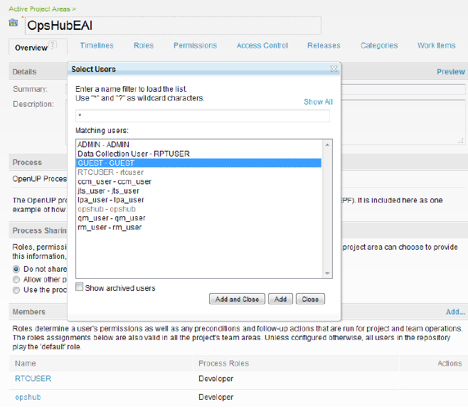
</p>

* In the pop-up search and select integration user. Then, click 'Add'.  
* After the selected user appears as a member, click the 'Process Roles' image (appears on hover).  

<p align="center">
  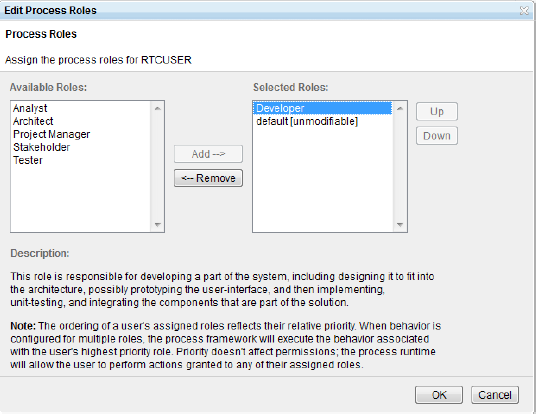
</p>

* In the dialog box (as displayed), select roles from the available roles and click 'OK'.

## User privileges 

For giving privileges to integration user, follow the steps given below:  
* Log in to CCM admin (https://<host>:<port>/ccm/admin).  
* Navigate to the Project Areas menu.  
* In Active Project Areas, select the project area for synchronization.  
* Move to the 'Permissions' tab.  
* In 'Configuration' select Team Configuration.  
* In Roles: section under Details, select role of the integration user.  

<p align="center">
  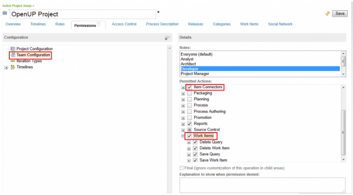
</p>

* Check-in Permitted Actions: Work Items and Item Connectors are checked, if not then check it.

For assigning Client Access Licenses and Repository Permissions, follow the steps given below:  
* Log in to CCM admin (https://<host>:<port>/ccm/admin).  
* Navigate to **Users** menu.  
* From Active Users, select integration user.  
* In **Repository Permissions** section, check at least one of the **JazzUsers**, **JazzProjectAdmins** and **JazzAdmins**.  
* The Integration User must have at least one out of 'Contributor Client Access License', 'Developer Client Access License' and 'Stakeholder Client Access License' to be able to create/modify work items (details of licenses can be read from tool-tip appearing on hover).  

<p align="center">
  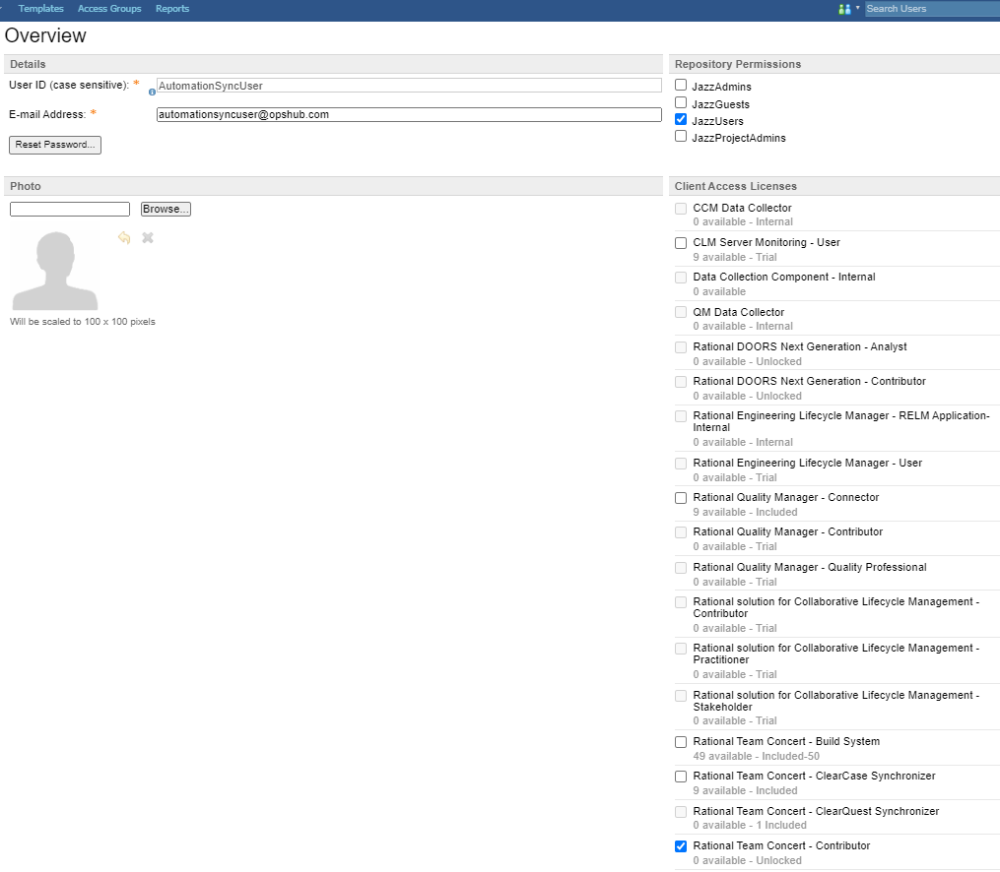
</p>

## Custom field configuration

A few special fields must be defined on the entity that is being synchronized. These must be set up so that the integration status of each item can be tracked.  
* Log in to CCM admin (https://<host>:<port>/ccm/admin).  
* Navigate to the Project Areas menu.  
* In Active Project Areas, select the project area for synchronization.  
* Go to the **Work Items** tab.  
* In Types and Attributes, select **Work Item Type** for which integration need to be configured.  
* In the **Attributes section** click the **Add...** link.  

<p align="center">
  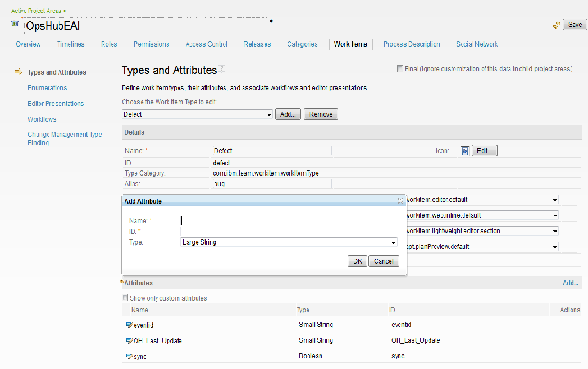
</p>

## Find version

For getting EWM version, follow the steps given below:  
* Log in to CCM admin (https://<host>:<port>/ccm/admin).  

<p align="center">
  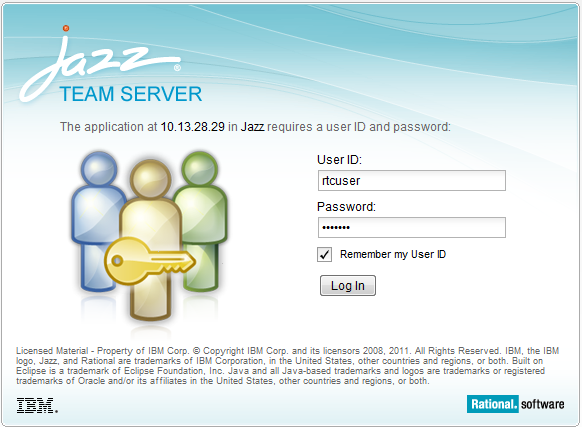
</p>

* After successful login, version should be displayed as in above screen.  

<p align="center">
  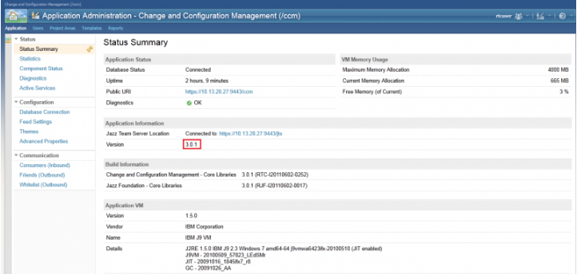
</p>

## Entity mention detection configuration

* To mention an entity in the EWM system, the user must write an entity type and the entity id that they want to mention.  
<p align="center">
  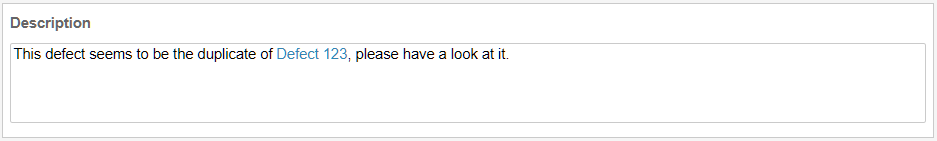
</p>

* When EWM is configured as a source system, the user must provide keywords that could be used to mention an entity. As seen in the above screenshot, 'Defect' is used to mention an entity with id 123.  
* The user is required to provide those keywords in JSON format. The project key should be the key and the string array list of the keywords should be the value in the JSON map. Refer to the example below:  
```json
 {
        "_dFZrkdw684usLkKuTwQ": [
            "defect",
            "task",
            "story",
            "epic",
            "work item",
            "workitem",
            "item"
        ],
        "_o1O6vvGnEe6FHv18q8e87g": [
            "retrospective",
            "adoption",
            "impediment",
            "buildtrackingitem",
            "work item",
            "workitem",
            "item"
        ]
    }
```
* To obtain the project's key, fetch all project details from {User EWM Instance URL}/ccm/oslc/workitems/catalog api endpoint. Look at the value of rdf:resource inside oslc_disc:details/oslc:details. It contains the URL of the project and its id.
* Possible keywords that can be used to mention an entity in EWM include the name of the entity type and its alias.
* If the above field input is not provided, only those Entities Mentions will be detected that are mentioned using workitem, work item, and item keywords.

## Understanding Metadata Detail Input

* Below is the sample JSON for link metadata. The JSON can be modified as needed — it allows users to define or override link metadata based on their specific use case.

```json
{
  "entities": [
    {
      "relationship": {
        "linkTypes": [
          {
            "linkType": "affects requirement",
            "reverseLinkType": "",
            "isExternalLink": true,
            "linkName": "oslc_cm:affectsRequirement"
          }
        ]
      }
    }
  ]
}
```

**Steps to get internal link name for any entity are mentioned below**  

* Identify the work item for which the link needs to be added  
* Construct the API URL for the work item using the following format:  
  _https://<RTC_URL>/ccm/resource/itemName/com.ibm.team.workitem.WorkItem/<RTC_ENTITY_ID>_  
* Inspect the response, and locate tags that represent existing internal links. These typically appear under elements such as:  
  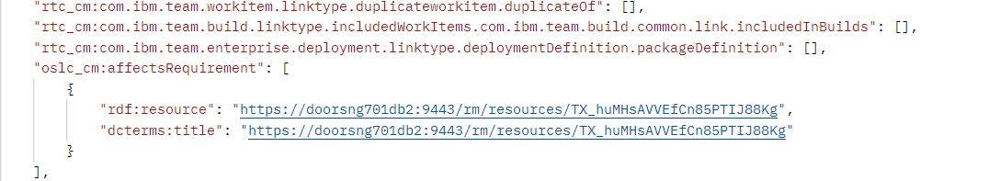  
* Copy the link name, this value must be used as the linkName field in your metadata configuration.  
* Example for the link name is given below:  
  * **Format**: <prefix_name>:<link internal name>  
  * **Example**: oslc_cm:affectsRequirement  

## Supported link types  

### Reading-side supported link types  
* REST API: duplicates, duplicateOf, successor, predecessor, children, parent, blocks, dependsOn, related, resolves, resolvedBy, copies, copiedFrom, affected by defect, custom links of type Work Item, and Work Item List  

### Writing-side supported link types  
* REST API: duplicates, duplicateOf, successor, predecessor, children, parent, blocks, dependsOn, related, resolves, resolvedBy, copies, copiedFrom, affected by defect, custom links of type Work Item, and Work Item List  

## HTML description support  

### Reading-side HTML description  
EWM as a source system, description will be read as HTML.  

### Writing-side HTML description  
EWM as a target system, description will be written as plain text.  

## User Privileges for Attachment Operations  

For giving privileges to integration user, follow the steps given below:  

* Log in to the CCM admin (https://<host>:<port>/ccm/admin).  
* Navigate to the Project Areas menu.  
* In Active Project Areas, select the project area for synchronization.  
* Move to the **Permissions** tab.  
* Select **Show by Role** in the **Permissions** tab and **Everyone (default)** in the **Select a role** tab.  
* Navigate down to **Save Attachment** in Workitems section displayed on right.  
* Expand it and enable the permissions for **Modify attachment** and **Delete attachment**.  

This will give access for modifying and deleting attachments to all users for the selected project.  

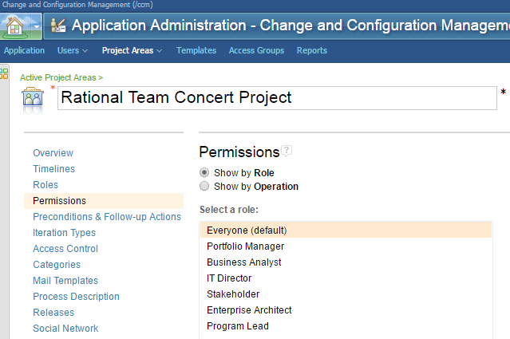  

  


# Appendix

## OAuth configuration

### Steps for OAuth token generation

Following are the steps to generate OAuth token for IBM Engineering Workflow Management.

**'''Generate Customer Key:'''**

* Log in to **Admin panel (<IBM EWM URL>/JTS/admin)** with user whose OAuth token needs to be generated.
* Navigate to **Server** > **Consumers (Inbound)** in **Communication** section.
* Enter the **Consumer Name**, **Consumer Secret**, and click **Register**. A **Consumer Key** will be generated.
* After successfully registeration, the **Consumer Name** and **Consumer Key** will be added in the **Authorized Keys** section. Refer to the screenshot:  
  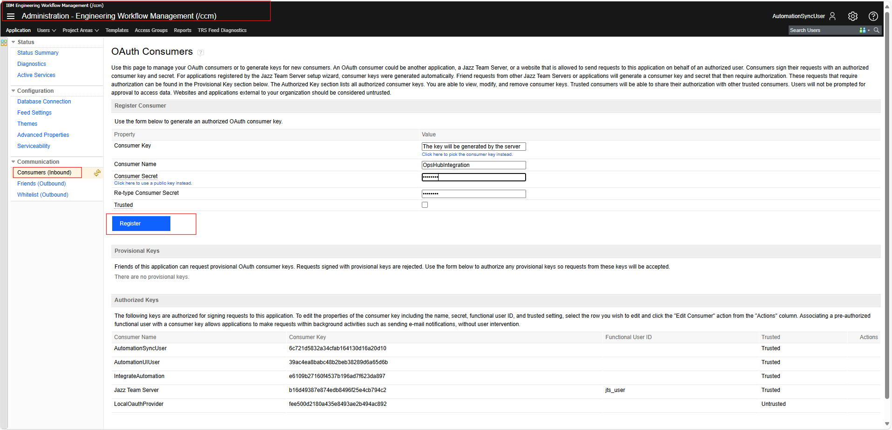

**'''Generate OAuth Token and OAuth Secret for given consumer key'''**

* Generate the OAuth token for IBM Engineering Workflow Management system using third-party rest client [Postman](IBM_Rational_Doors_Next_OAuth_Generation#Generate_Token_Using_Rest_Client_(Postman)).

> **Note**: The behavior of "OAuth" token:  
> * The OAuth token will be expired, if it is not used for the given time duration configured in the "OAuth access token timeout" of IBM Engineering Workflow Management.  
> * Suppose the token mentioned in the System Configuration form in the OpsHub Integration Manager gets expired, then it must be updated by re-performing the above steps.  
> * To avoid the above case, it is recommended to set the value of the "OAuth access token timeout" configuration to the maximum time duration allowed in the system.

## Criteria query in connector format

The syntax of the end system criteria query depends on the connector API that is being used in EWM configuration.

**REST API**:  
The query includes expressions joined with `and` operator. Expression are in the format mentioned below, where operator is `=` or `!=` and for integer and Timestamp values `>` and `<` are also supported.

**'''Steps to generate format for criteria for any field are as mentioned below''':**

* Install any REST client
* Fire the API for getting the information about any entity in EWM based on the entity ID  
  * **Request URL**:  
    _https://<EWM_URL>/ccm/resource/itemName/com.ibm.team.workitem.WorkItem/<EWM_ENTITY_ID>_
  * **Headers**: Give values for following headers in the REST client  
    * OSLC-Core-Version: 2.0  
    * Accept: application/json
  * Hit the API query and search for the required field in the response that you get
  * Copy the format in which the concerned field is assigned value in the API response and use that format to get the criteria query format for that field

* Example for the priority field criteria configuration is given below:  
  * **Format:** `<prefix_name>:<attribute internal name><operator><field value>`  
  * **Example:** `dcterms:created>"2017-03-26T12:11:08.183Z" and oslc_cmx:priority=priority.literal.l02`

> **Note**:  'Large String' attribute type is not supported while configuring criteria query.  
> **Note**: In the criteria query for enumeration fields such as priority, severity, etc., the criteria query should be formed as: `oslc_cmx:priority="priority.literal.l3"`. Here the `priority.literal.l3` is the internal name of the field value.  
> **Note**: In multi-project polling, if the criteria query is on custom enumeration field, the lookup values of the custom enumeration field should be of the same name for the criteria to work across multi-projects.


