# clearquest

## Pre-requisites

### User privileges

* Create one user of IBM Rational ClearQuest dedicated to OpsHub Integration Manager. This user shouldn't be able to do any operation from system's user interface.
* Integration user should have privileges of an 'Active User', through which they must be able to create/update records and create/execute queries.

### Enable Team Web 

For OpsHub Integration Manager to integrate with IBM Rational ClearQuest, IBM Rational ClearQuest team server must be installed and running.

### CM API jar(s) configuration

Given below is the list of libraries required to put in `<OpsHub_Installation>/AppData/bundle_config/CQ_LIB`:

* remote\_core.jar
* stpcmmn.jar
* stpcq.jar
* stpwvcm.jar
* commons-httpclient.jar
* commons-codec.jar
* cqjni.jar
* You can find all the above jar(s) files in the IBM installation directory. For complete guidance to locate these jars, refer to [IBM Rational ClearQuest document](https://www.ibm.com/docs/bg/rational-clearquest/8.0.1?topic=tutorial-setting-up-installing-clearquest-cm-api). If jar(s) are not found with these documentation steps, search for jar(s) on the following path. These jar(s) could be found in one of the following locations:
  * `C:\Program Files (x86)\IBM\RationalSDLC\ClearQuest`
  * `C:\Program Files (x86)\IBM\RationalSDLC\ClearQuest\cqweb`
  * `C:\Program Files (x86)\IBM\RationalSDLC\ClearQuest\common`
  * `C:\Program Files (x86)\IBM\RationalSDLC\ClearQuest\cqweb\cqwebprofile\installedApps\dfltCell\TeamEAR.ear\cqweb.war\WEB-INF\lib`
* Copy above required libraries to `<OpsHub_Installation>\AppData\bundle_config\CQ_LIB` directory.
* Restart OpsHub Integration Manager server after copy.

### API response length setting for Multiline text field(s)

* IBM OSLC API truncates text for the multiline text field when the length is more than configured allowed character length (Default max length allowed is 2000) and hence require(s) to adjust the length setting so that complete text for multiline text field resulted in API response. This setting depends on the possibility of field maximum value length as per the IBM Rational ClearQuest's end user usage.
* This settings is applicable for following case(s):
  * When any multiline text field of IBM Rational ClearQuest required to read or write. i.e. for any multiline field mapped either as source or target field.
  * When IBM Rational ClearQuest is a source end point and the **Audit Trail Package** is enabled for the repository for which integration is configured. As audit trail text is multiline text field and it is supported as read only field in OpsHub Integration Manager when Audit Trail Package enabled in end system.
* To override the default API setting, refer to [OSLC API Truncates Issue Of Multiline Field](https://www.ibm.com/support/pages/oslc-cm-rest-api-truncates-multiline-fields)

### Queries Configuration

To integrate, OpsHub Integration Manager requires few queries to be created in IBM Rational ClearQuest that can be accessed by the integration user only.

* All the required queries need to be created under **Personal Queries** using integration user ID.
* Queries should be named as: **\<OpsHub\_QUERYNAME> +** .
* Follow the given order of fields in Filters, and Query Presentation.
* Follow the naming convention of the title and the appropriate sort type in the Query Presentation as shown in the screenshot below.
* The screenshots of queries give details of the required Fields and Filters to be added in the query.
* In each query, select **Dynamic Filter** for every Field given in the Filters section.
* For more details on how to configure queries, refer to [How to Add Queries](clearquest.md#how-to-add-queries) section in the Appendix.

Following are the required queries and their names are given with respect to 'Defect' record type.

**Common Queries required**

* **OpsHub\_MaxTimeDefect**
  * Create a query, `OpsHub_MaxTimeDefect` with the following configuration. This Query is required to get the time of the last update.

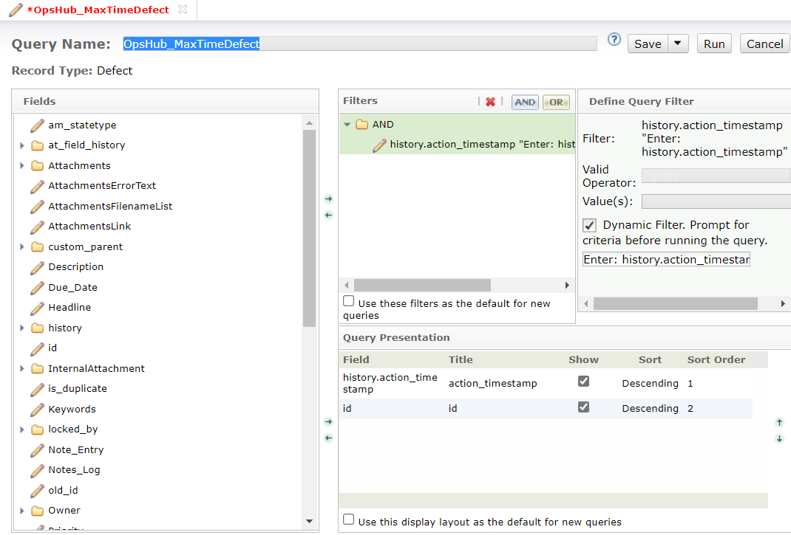

* **OpsHub\_emptyQuery**
  * Create a query, `OpsHub_emptyQuery`. Do not select any field or filters for this query.

**Queries required when IBM Rational ClearQuest is used as Source System**

* **OpsHub\_PollQueryDefect**
  * Create a query, `OpsHub_PollQueryDefect` with the following configuration. This is required to poll data from the entity which has been updated.

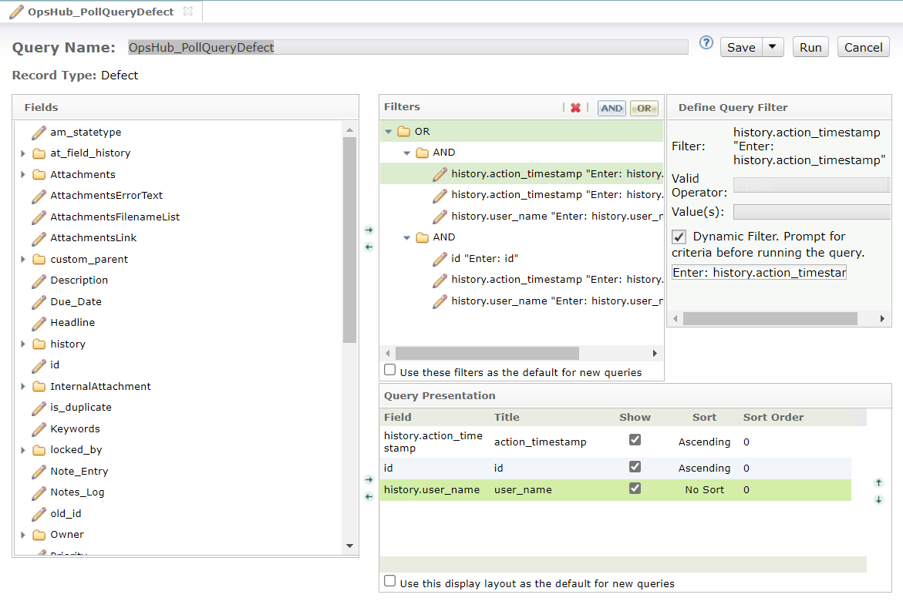

**Queries required when IBM Rational ClearQuest is used as Target System**

* **OpsHub\_LastCreatedByIntegrationDefect**
  * Create a query, `OpsHub_LastCreatedByIntegrationDefect` with the following configuration. This query is required for finding the maximum update time of an entity lastly updated during integration.

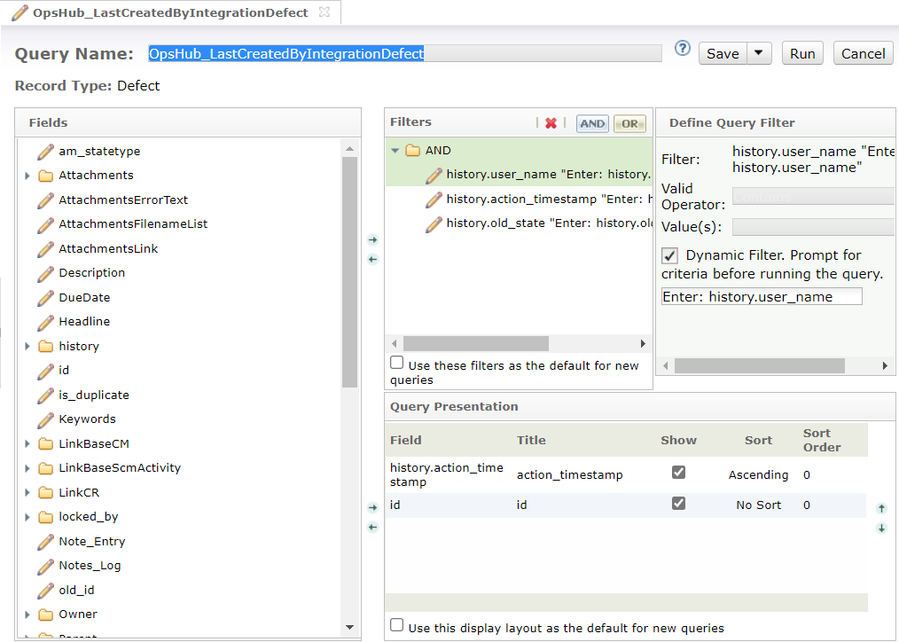

* **OpsHub\_GetLastChangeDefect**
  * Create a query, `OpsHub_GetLastChangeDefect` with the following configuration. This query is required for finding the maximum update time of an entity lastly updated during integration.

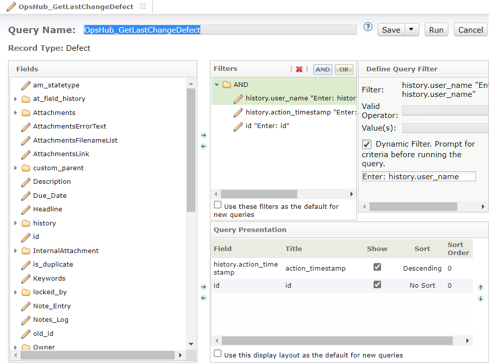

## System Configuration

Before the user resumes the integration, he/she must first configure IBM Rational ClearQuest. Click [System Configuration](../integrate/system-configuration.md) to learn the step-by-step process to configure a system. Refer the screenshot given below for reference.

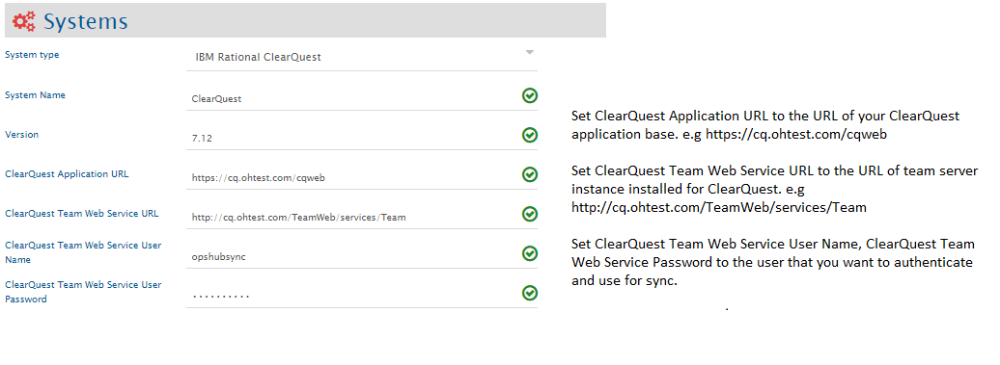

If the system is deployed on HTTPS and a self-signed certificate is used, then you will have to import the SSL Certificate to be able to access the system from OpsHub Integration Manager. Click [Import SSL Certificates](../getting-started/ssl-certificate-configuration.md) to learn how to import SSL certificate.

## Mapping Configuration

Map the fields between IBM Rational ClearQuest and the other system to be integrated to ensure that the data between both the systems synchronizes correctly.\
Click [Mapping Configuration](../integrate/mapping-configuration.md) to learn the step-by-step process to configure mapping between the systems.

### Multi-Select Type Fields

* When IBM Rational ClearQuest is used as target system and multi-select field(s) is/are mapped, ensure that **Limit to List** option is not selected for these fields.
* Check this setting from the field properties:

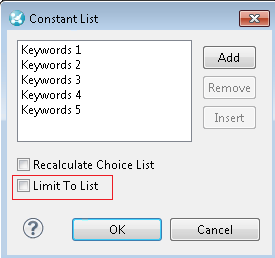

### Default Link Setting

When IBM Rational ClearQuest is the target system, the Default link can be configured in relationship mapping for different link types and entity types. Please refer to [Default Link Settings](default_link_settings.md) to learn about default link usage and configuration.

* Configure the personal query with dynamic filter for the user which is used in IBM Rational ClearQuest system configuration for OpsHub Integration Manager. Refer [How to Create Look Up Personal Query](clearquest.md#look-up-personal-query) section for how to configure the personal query for the default link.
* Provide the query in JSON format that corresponds to an above configured personal query as the default link query in mapping. Refer [How to Create Look Up Json Query](clearquest.md#look-up-json-query) section for more information about JSON query format.

> **Note** : **The curly braces in the JSON query need to be escaped by double curly braces for the default link query**. The curly braces of dynamic expression value, i.e. field XPath like this `{SourceXML/updatedFields/Property/<field name>}` doesn't need to be escaped.

Below are the sample snippets of how the JSON query can be used as the default link query in OpsHub Integration Manager.

**Default Link query samples along with corresponding personal query in IBM Rational ClearQuest**

| **Default Link usecase**                                                                                                                                  | **Person Query Configuration**                                                                                                         | **Json Query Format for mapping**                                                                                                                                                   |
| --------------------------------------------------------------------------------------------------------------------------------------------------------- | -------------------------------------------------------------------------------------------------------------------------------------- | ----------------------------------------------------------------------------------------------------------------------------------------------------------------------------------- |
| Search for the entity in IBM Rational ClearQuest(target system) whose Id is 'SAMPL00000004' to link all synchronized entities to the found target entity. | [Search Entity In Target With Entity Id](clearquest.md#search-entity-in-target-with-entity-id)                                         | `{{"query":"Personal Queries/lookUpEntityIdQuery","operations":[{{"value":"IS_EQUAL"}}],"parameters":[{{"value":"SAMPL00000004"}}]}}`                                               |
| Search for entity in IBM Rational ClearQuest(target system) which has given source entity's id in 'RemoteId' field.                                       | [Search Entity In Target With Field Having Source Entity Id](clearquest.md#search-entity-in-target-with-field-having-source-entity-id) | `{{"query":"Personal Queries/lookUpEntityWithSourceIdQuery","operations":[{{"value":"IS_EQUAL"}}],"parameters":[{{"value":"SourceXML/updatedFields/Property/source_system_id"}}]}}` |

### Advance Workflow Transition

#### Need for handling workflow transition

* Consider the following example to understand the need for handling workflow transition in IBM Rational ClearQuest (Target system):
  * A record type **Defect**, when created should be in **New** state. It can then be moved to **Active** state, then to **Resolved** state, and finally to **Closed** state. However, it cannot be directly marked as **Closed** from **New** state because of the state transition constraints enforced through IBM Rational ClearQuest workflow configuration.
  * In such scenarios, simply mapping the **State** field and their look-up values can cause failure(s). The possible scenarios in which the failure can occur are:
    * **Scenario 1**: If an IBM Rational ClearQuest Defect is in **Active** state, the user will get failure error message that **Active** is an invalid state as the defect can only be created in **New** state.
    * **Scenario 2**: If an IBM Rational ClearQuest Defect is in **New** state and the integration tries to update its state to **Resolved**. In that case, the user will get failure error message that this item cannot be updated because of an invalid state.

#### Solution for handling workflow transition

It can be resolved by any of the following approaches:

* **Add/Edit Workflow transition XML in Mapping Configuration of OpsHub Integration Manager**
  * With this option, OpsHub Integration Manager makes the required intermediate status transition automatically as per the transition(s) configuration on the end system.
  * Click [Workflow Transition](../integrate/mapping-configuration.md#workflow-transition) to learn when and how to configure workflow transition XML mapping.
* **Change State Transition Configuration in IBM Rational ClearQuest**
  * IBM Rational ClearQuest allows to change **State Transition** configuration. Use this configuration to configure any-to-any transition(s). Workflow transition mapping is not required to be configured in OpsHub Integration Manager if any-to-any state transition is configured.
  * OpsHub Integration Manager will be able to perform direct transition of the state field to the desired state as this option works when any-to-any transition is configured for an integration user.
  * For step-by-step instructions for configuring any-to-any transition, refer to [Configuration to allow all state transitions](clearquest.md#configuration-to-allow-all-state-transitions) section.

## Integration Configuration

In this step, set a time to synchronize data between IBM Rational ClearQuest and the other system to be integrated. Also, define parameters and conditions, if any, for integration.\
Click [Integration Configuration](../integrate/integration-configuration.md) to learn the step-by-step process to configure integration between two systems.

> **Note** : Select IBM Rational ClearQuest Repository Name to the repository within which databases resides for different record types, for example: 7.0.0, opshub, test\
> **Note** : Set IBM Rational ClearQuest Project to the database name which is created under repository, for example, in 7.0.0/SAMPL which is the default repository provided by IBM Rational ClearQuest, 7.0.0 is the repository and SAMPL is the IBM Rational ClearQuest Project or database

### Criteria Configuration

If you want to specify conditions for synchronizing an entity between IBM Rational ClearQuest and the other system to be integrated, you can use the Criteria Configuration feature.\
Go to Criteria Configuration section on the [Integration Configuration](../integrate/integration-configuration.md) page to learn in detail about Criteria Configuration.

#### Criteria Configuration Query

**Storage Type : In Database**

* Criteria Query is the valid 'IBM Rational ClearQuest QueryName' that specifies the actual criteria.
* Ensure that two filters of type **history.action\_timestamp** are added with **Dynamic filter** option selected.
* Ensure that **Dynamic filter** option is not selected for any other filter except the two filters mentioned above.
* For more details on adding queries in IBM Rational ClearQuest, refer to [How to Add Queries](clearquest.md#how-to-add-queries) section in the Appendix.

Refer to the below screenshot for sample Criteria Configuration Query:

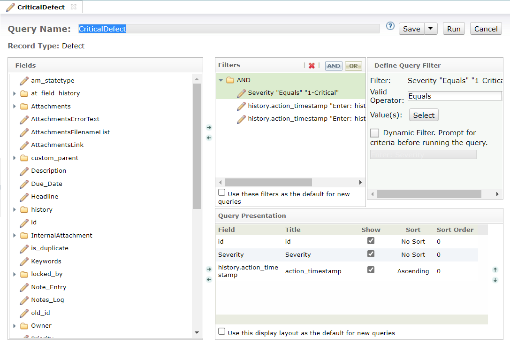

**Storage Type : In End-System**

In addition to the above steps, follow the additional steps given below:

* Create a custom text-field **CriteriaField**. Refer to [Custom field configuration](clearquest.md#custom-field-configuration) section for details.
* Add **CriteriaField** to the criteria query filters with the **Dynamic filter** option selected.
* Create the **OpsHub\_GetLastChangeDefect** query \[This query is required even when IBM Rational ClearQuest is the source system]. Refer to [Queries Configuration](clearquest.md#queries-configuration) section for details.
* Change the **OpsHub\_PollQueryDefect** as follows:

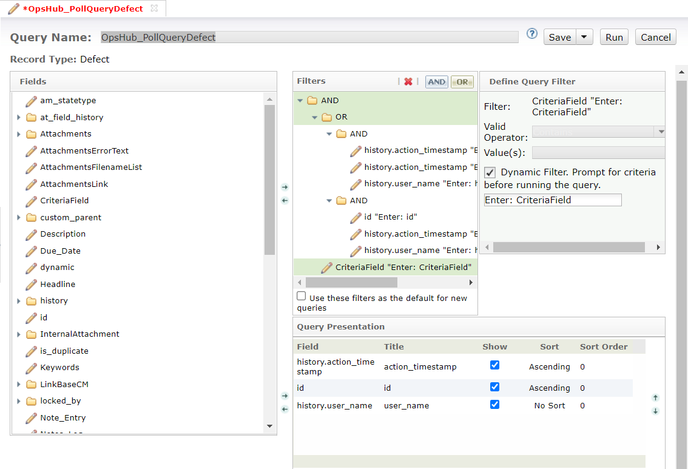

* Sample Criteria Configuration Query:

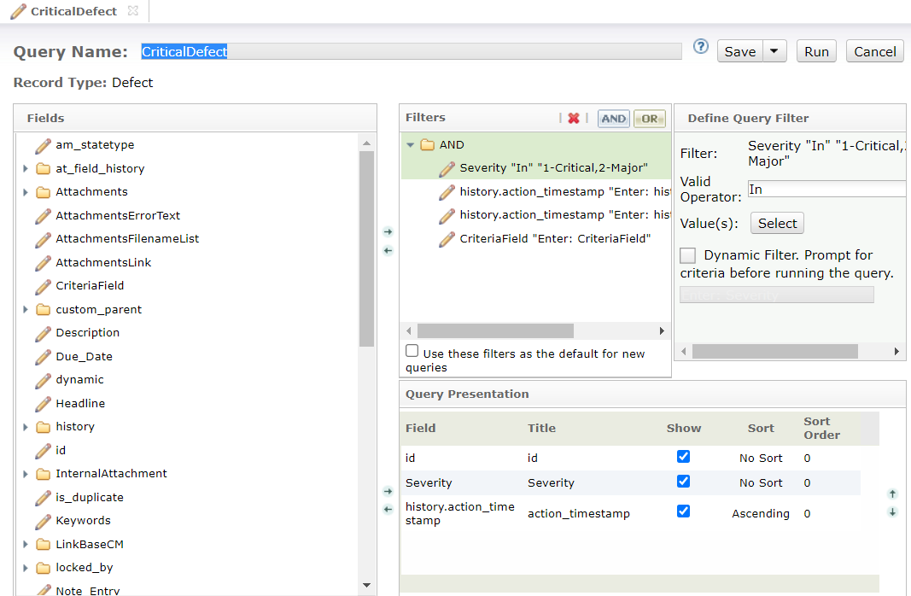

### Target LookUp Configuration

* Provide the query in **Target Search Query** field such that it is possible to search the entity in IBM Rational ClearQuest as a target system. You can provide a placeholder for the source system's field value in the target search query field between `@`.
* Go to the **Search in Target Before Sync** section on the [Integration Configuration](../integrate/integration-configuration.md) page to learn how to configure target lookup.
* The target lookup query for IBM Rational ClearQuest must be in a specific JSON format defined by OpsHub Integration Manager due to a particular IBM Rational ClearQuest API behaviour. Refer to section [How to Create Look Up Json Query](clearquest.md#look-up-json-query) for details on particular JSON format.
* It is required to create a personal query with dynamic filter(s) in your IBM Rational ClearQuest end system that corresponds to the JSON query given in **Target Search Query** and make sure filters in query matching with parameters and operations specified in JSON query. Refer [How to Create Look Up Personal Query](clearquest.md#look-up-personal-query) for details on personal query configuration for target lookup.

Example use case:\
Consider a use case to search an entity in IBM Rational ClearQuest (target system), which has the entity id of the source system in a field named `TargetCustomField`. The source system's entity id is stored in `source_system_id`. Suppose the Target Search Query is configured on-field `TargetCustomField`. In that case, while processing this query, `@source_system_id@` will be substituted with the value of `source_system_id` from the source system's entity, and then the query will be made to IBM Rational ClearQuest.

* For IBM Rational ClearQuest as a source system, if any field (other than ID) is used in target lookup query, then that field needs to be mapped.

#### Target lookup query samples

| **Target lookup usecase**                                                                                       | **Personal Query**                                                                                                                                           | **Json Query Snippet**                                                                                                                                                                                    |
| --------------------------------------------------------------------------------------------------------------- | ------------------------------------------------------------------------------------------------------------------------------------------------------------ | --------------------------------------------------------------------------------------------------------------------------------------------------------------------------------------------------------- |
| Target lookup on the entity which has source entity's id in `RemoteId` field                                    | [Search Entity In Target With Field Having Source Entity Id](clearquest.md#search-entity-in-target-with-field-having-source-entity-id)                       | `{"query":"Personal Queries/lookUpEntityWithSourceIdQuery","operations":[{"value":"IS_EQUAL"}],"parameters":[{"value":"@source_system_id@"}]}`                                                            |
| Target lookup on the entity which has source entity's id in `RemoteId` field and `Status` field is not `Closed` | [Search Entity In Target With Source Entity Id And State is not Closed](clearquest.md#search-entity-in-target-with-source-entity-id-and-state-is-not-closed) | `{"query":"Personal Queries/lookUpEntityWithSourceEntityIdAndStatusQuery","operations":[{"value":"IS_EQUAL"},{"value":"IS_NOT_EQUAL"}],"parameters":[{"value":"@source_system_id@"},{"value":"Closed"}]}` |

#### Look up Json Query

The JSON query syntax has the following keys: `query`, `operations`, `parameters`. Any expected missing key or any key input other than these will result in query execution error.\
Below is the JSON syntax for the criteria query: {"query":"Personal Queries/", "operations":\[{"value":""}], "parameters":\[{"value":""}]}

**Query Format breakdown**

**Key - query**

* The `query` key represents the name of the query which is configured as personal query for integration user in end system. Query needs to be created under `Personal Queries` folder.
* Syntax: `Personal Queries/<QueryName>`

**Key - operations**

* The `operations` key represents the list of operator(s) of the query corresponds to personal query in end system. Actual Operators might not be defined in query in end system as filter needs to be configured with **Dynamic Filter** option.
* The key `operations` expects the valid operators supported in personal query filter(s) for the field(s) used in filter.

**Operator Mapping Table for Personal Query and Json Query**

| **Personal Query Operator(s)**                                                                                                                                 | **JSON Query Operation(s)**                                                                                                                                                                                       |
| -------------------------------------------------------------------------------------------------------------------------------------------------------------- | ----------------------------------------------------------------------------------------------------------------------------------------------------------------------------------------------------------------- |
| Equals, Does Not Equal, Less Than, Less Than Or Equal To, Greater Than, Greater Than Or Equal To, In, Not In, Is Null, Is Not Null, Contains, Does Not Contain | IS\_EQUAL, IS\_NOT\_EQUAL, IS\_LESS\_THAN, IS\_LESS\_THAN\_OR\_EQUAL, IS\_GREATER\_THAN, IS\_GREATER\_THAN\_OR\_EQUAL, IS\_IN\_SET, IS\_NOT\_IN\_SET, IS\_NULL, IS\_NOT\_NULL, HAS\_SUBSTRING, HAS\_NO\_SUBSTRING |

**Key - parameters**

* The `parameters` key represents the list of parameter(s) value need to be supplied to filter(s) of configured personal query during query execution.
* Suppose, query configured for ID with dynamic filter `Equals` then this key `parameters` represents the value corresponds to ID field needed for query execution like `SAMPL00000623`.

**Query Sample with Json Format**

* Query with single field, like ID Equals `"SAMPL00000623"` {"query":"Personal Queries/SampleQuery1", "operations":\[{"value":"IS\_EQUAL"}], "parameters":\[{"value":"SAMPL00000623"}]}
* Query with multiple field(s) criteria with AND operation like `State is Closed and Priority is either High or Medium`\
  (Note: Logical conjunction operators like AND, OR are not required to be defined in Json Query but they do present on personal query in end system. See: [Search in Target with multiple fields criteria](clearquest.md#search-in-target-with-multiple-fields-criteria)) {"query":"Personal Queries/SampleQuery2", "operations":\[{"value":"IS\_EQUAL"},{"value":"IS\_IN\_SET"}], "parameters":\[{"value":"Closed"},{"value":"High,Medium"}]}

#### Look Up Personal Query

* Actual query defined in end system corresponds to query name used in Json query for target lookup and default link settings.
* This query is configured on end system for the integration user under `Personal Queries` folder.
* Refer [How to Add Queries](clearquest.md#how-to-add-queries) for configuration steps.

**Sample(s) of Personal Query**

**Search Entity In Target With Entity Id**

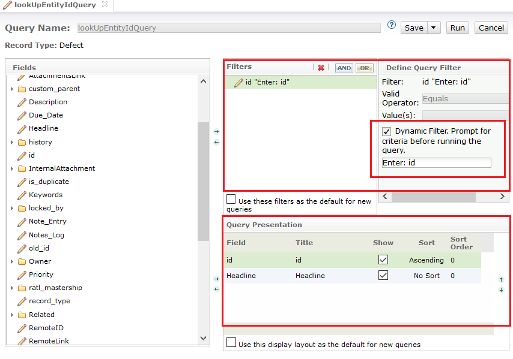

**Search Entity In Target With Field Having Source Entity Id**

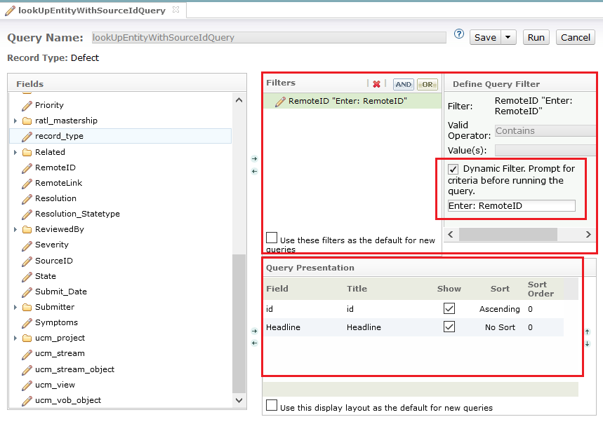

**Search Entity In Target With Source Entity Id And State is not Closed**

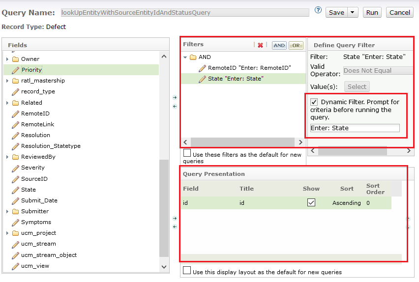

**Search in Target with multiple fields criteria**

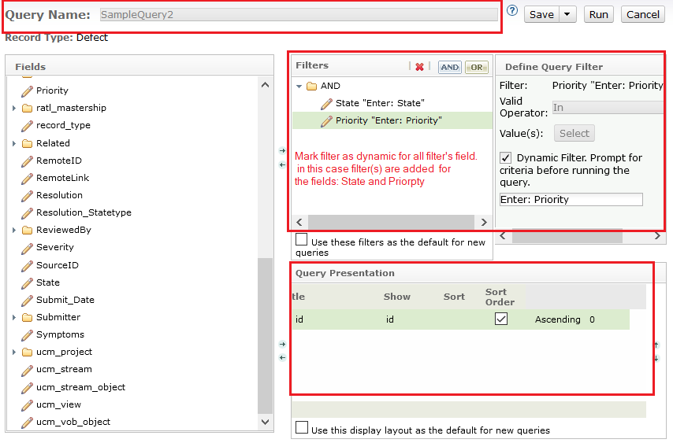

## Known Behavior

* For fields that are showing read only in mapping of OpsHub Integration Manager, it is possible that such fields' Default Behavior is configured as read-only in Field Behavior section of ClearQuest Designer.
  * Such fields are writeable if they are marked mandatory for any state in ClearQuest Designer, then they can be provided as dependent fields in Transition XML in OpsHub Integration Manager.
* OIM will need 2 active connections / HTTP sessions per direction for ClearQuest integration.
  * So, if ClearQuest is involved in bi-directional integration, it will require 4 active connections per integration.
  * 2 connections will be required for OIM UI regardless of number of integrations.
  * From ClearQuest web UI, following settings can be set accordingly:
    * Site Administration > ClearQuest Web Server Options
      * Active ClearQuest Session Threshold
      * Maximum Active Servers
    * Refer to following document for details: [Modifying MBean attributes by using the Site Configuration window](https://www.ibm.com/docs/en/rational-clearquest/8.0.0?topic=ccws-modifying-mbean-attributes-by-using-site-configuration-window)

***

## Known Limitations

* When IBM Rational ClearQuest is used as source system, only mapped fields will be polled.
* Only basic authentication is supported in OpsHub Integration Manager.
* Comments will be synchronized only for the default **Notes** fields in IBM Rational ClearQuest end system.
  * The comments will be read from the Notes field having the name, **Notes\_Log** and written to the Notes field having the name, **Note\_Entry**.
  * If any other comment field enabled with different name, those will not be part of comments synchronization of OpsHub Integration Manager.

***

## Appendix

### How to Add Queries

* Log-in to IBM Rational ClearQuest with the sync user.
* Navigate to IBM Rational ClearQuest **Navigator** section.
* Right click on **Personal Queries** → Click on **New Query**.
* Select **Record type** on which synchronization to be done.
* Click the **Ok** button. This will redirect to Query Creation wizard.

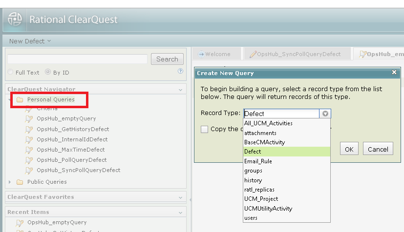

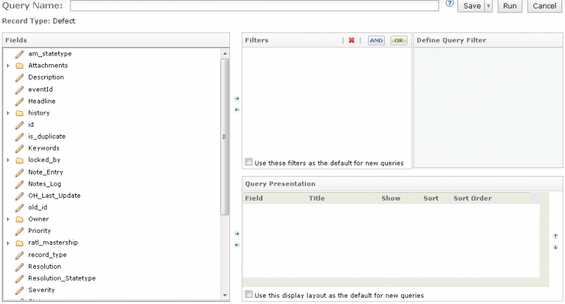

***

### Checkout Schema

Follow the below steps to Checkout Schema:

* Load IBM Rational ClearQuest Designer Application.
* Log in with a user having **Schema Designer** privileges.
* Click on the **Admin** on the top.
* Check out the schema in which custom field needs to be created.

***

### Checkin Schema

Follow the below steps to Checkin Schema:

* Right click the schema version and click the **Save All** option.

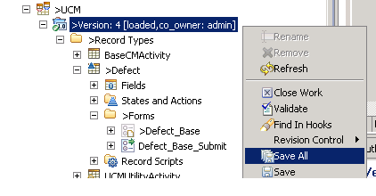

* It is advisable to validate changes before Checking-in the applied changes. Right click the schema version and click the **Validate** option.
* If validation results in success, then right click the schema version → Click **Revision Control** → Click **Check-In**.
* After Check-In, click the **Upgrade Database** in IBM Rational ClearQuest Database Admin tab by right clicking on the database under which this whole set of configurations is done.

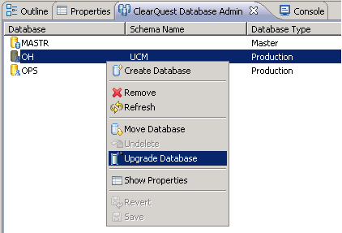

***

### Custom Field Configuration

To create a custom field in IBM Rational ClearQuest:

* Checkout the desired Schema, refer: [Checkout Schema](clearquest.md#checkout-schema)

* Right click on **Fields**, under record type **Defect** or any other record type in which new field needs to be added.

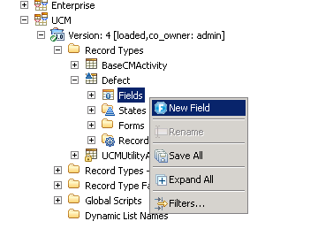

* Set **Field Name** to the required field name and select **SHORT\_STRING**.
* Click the **Visible In Query** check box.
* Click the **Next** button.
* Set Max Length of field.

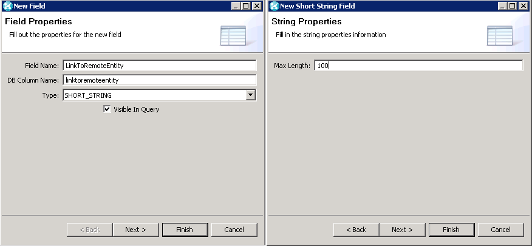

* Click the **Finish** Button.
* Now, click on **Defect Base** under **Forms** folder. This will open **Defect form** layout on right.

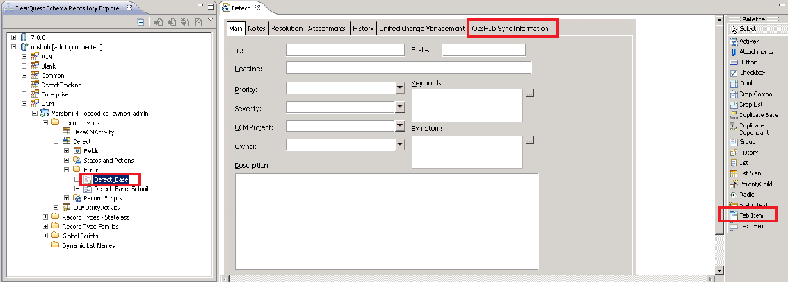

* From the **Palette**, click on **Tab Item**. Now, drag it beside last tab of form.
* Add the display field information such as label, static text in which field values need to be displayed. Also, prepare form according to the requirement, for example: following form shows information regarding three fields.

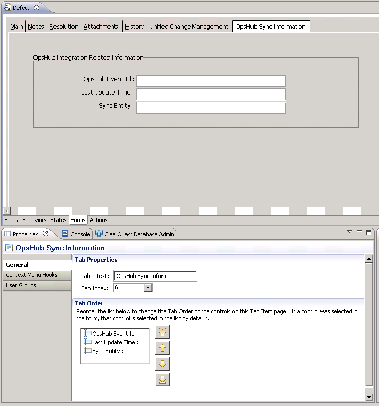

* Associate 'display field item' with the data field that is created by selecting field from properties window after clicking the display field item.

* Checkin the changed Schema, refer: [Checkin Schema](clearquest.md#checkin-schema)

***

### Configuration to Allow All State Transitions

Follow the below steps to change state transitions:

* Checkout the desired Schema. Refer to [Checkout Schema](clearquest.md#checkout-schema) section for details.
* Double click the required record type from the navigation pane.
* Click the **States** tab to view the state transition matrix.
* Transform this State Transition Matrix to allow all possible transitions, i.e., from each state to every other remaining state. Refer to the screenshot below:

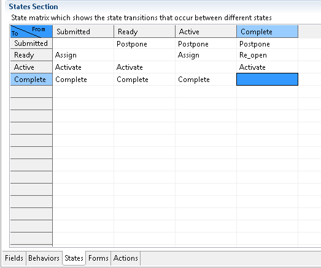

* Checkin the changed Schema. Refer to [Checkin Schema](clearquest.md#checkin-schema) section for details.
