# Prerequisites

## User privileges

* Create one user of DOORS Next system, dedicated to OpsHub Integration Manager. Refer to section [Create User](#how-to-create-a-user) for steps on creating a user. This user should not be used to do any operations from end system's user interface.  
  Following are the privileges required by the dedicated integration user for synchronization of the artifacts by OpsHub Integration Manager.

## DOORS Next Permissions for synchronization

| **Permission Types** | **Justification** | **Needed When** | **How To** |
|----------------------|-------------------|------------------|------------|
| **Read** | This is the minimal permission required by the user for reading the artifacts from DOORS Next project | DOORS Next is source system, target system or both | To learn how to provide user with the read permissions for a project, refer to section [Access Control in project](#access-control) |
| **Save artifact**<br> Create an artifact<br> Modify an artifact | This is the minimal permission required by the user's role for creating/updating an artifact in DOORS Next | DOORS Next is target system. Also, when DOORS Next is source system, then **Modify an artifact** permission is required for [Remote Id or Remote Link configuration](integration_configuration#tracking_id_and_link_of_entities_across_systems) in integration. | rowspan="4" | To learn how to provide user with these permissions for a project, refer to section [Permissions in project](#permissions) |
| **Save Comment**<br>* Modify | This is the minimal permission required by the user's role for adding comments to an artifact in DOORS Next | DOORS Next is target system and comments needs to be synchronized | |
| **Save Folder**<br> Create a folder | This is the minimal permission required by the user's role for creating folders in DOORS Next stream. | DOORS Next is target system with **In Folder** field mapped in mapping and the folders are not already present in target stream(folders gets auto-created by OpsHub Integration Manager if not found in target stream). Refer to section [In Folder field](#fields-available-in-doors-next) to learn more about this field | |
| **Save Link**<br> Create a Link<br> Delete a Link<br> Modify a Link | This is the minimal permission required by the user's role for modifying links between artifacts in DOORS Next | DOORS Next is target system and [relationships](mapping_configuration#relationships) is configured in field mapping. | |

> **Note**: The permissions in DOORS Next can be configured per project. Thus, only those projects will be visible in mapping and integration for which sync user has read permission. Refer to section [Read access in project](#access-control) for more information on giving read permissions to sync user.

# Important Things to consider for Synchronization

## DOORS Next end system behavior

* DOORS Next has **"Configuration Management"** settings from where the configuration management feature can be enabled.
* **If this setting is enabled**, multiple streams and components can be created in a project.
* **If this setting is not enabled**, then project has a default component and inside that component, a default stream will be present.

Refer to section [Enable Configuration Management](#enable-configuration-management) to enable configuration management for your project. For complete guidance, refer to [DOORS Next document](https://www.ibm.com/support/knowledgecenter/SSYMRC_6.0.6/com.ibm.jazz.vvc.doc/topics/t_admin_enbl-cm.html#t_admin_enbl-cm)

> **Note**: Once Configuration Management is enabled for a project, you can't disable it.

## OpsHub Integration Manager behaviour

* **Projects in OpsHub Integration Manager**
  * For OpsHub Integration Manager, **Streams** are considered as Projects. Hence user can configure bidirectional integration with any other end system with context of DOORS Next streams and the other system's projects.
  * The Projects in OpsHub Integration Manager are shown as a combination of **Project, Component and Stream**. All the streams are displayed in a hierarchy of its parent stream.
    * **For example -**  
      If there exists a project "ProjectA" with component "ComponentA" and stream "StreamA", then in OpsHub Integration Manager, the project is shown as a hierarchy of "ProjectA/ComponentA/StreamA".  
      If there are other streams "StreamA.1" and "StreamA.2" created from "Stream A", then these streams are displayed as "ProjectA/ComponentA/StreamA/StreamA.1" and "ProjectA/ComponentA/StreamA/StreamA.2".

    > **Note**: The streams in DOORS Next are considered as projects. Thus, considering the above example, there will be 3 projects in OpsHub Integration Manager - **ProjectA/ComponentA/StreamA**, **ProjectA/ComponentA/StreamA/StreamA.1** and **ProjectA/ComponentA/StreamA/StreamA.2**.

* **Synchronization in OpsHub Integration Manager**
  * In DOORS Next, there are two types of artifacts. One is the [core artifact](#glossary) and the other one is the [shared artifact](#glossary).
  * By default, OpsHub Integration Manager synchronizes both core artifacts and shared artifacts present in stream.
    * **For example:** There exists a core artifact E1 in a stream. The artifact E1 is added in two modules "Module 1" and "Module 2". Then there will be two shared artifacts created. One in "Module 1" and the other in "Module 2".

      > **Note**: In this case, OpsHub Integration Manager will treat and synchronize all the 3 artifacts as individual entities.

  * OpsHub Integration Manager provides a provision to restrict the synchronization to only shared artifacts i.e. synchronize only the shared artifacts present in the stream.
    * **Restrict reading of artifacts from the DOORS Next module(s)** - An additional input is required to be added in integration configuration. Refer to section [Synchronize artifacts from specific module](#synchronize-artifacts-from-specific-module) for knowing the input usage and how to configure it.
    * **Restrict writing of artifacts to DOORS Next module(s)** - OpsHub Integration Manager supports writing of any artifact in a specific module. This is done through field mapping in DOORS Next system. The field purpose is to decide which module is used to create the shared artifacts. Refer to **Field - Module** section of [Fields available in DOORS Next](#fields-available-in-doors-next).

    > **Note**: Refer to section [Known Limitation](#known-limitation) for knowing the synchronization limitation.

# System Configuration

Before you continue to the integration, you must first configure DOORS Next system. Refer to [System Configuration](../integrate/system-configuration.md) to learn the step-by-step process to configure a system. Refer the screenshot given below for reference.

<p style="text-align: center;">
  
</p>


## **DOORS Next System form details**

| **Field Name** | **When field is visible on the System form** | **Description** |
|----------------|----------------------------------------------|------------------|
| **System Name** | Always | Set **System Name** to **IBM Engineering Requirements Management DOORS Next** or any other name you want. This name will appear throughout the application. Note: **System Name** should be unique |
| **Version** | Always | Provide Version of DOORS Next. For example - 6.0.6. For knowing your version refer to section [Finding DOORS Next's version](#how-to-find-doors-next-version) |
| **Instance URL** | Always | Set **Instance URL** to the URL of **DOORS Next** application base URL. e.g. https://10.13.35.875:9443/rm |
| **Jazz server URL** | Always | Set **Jazz server URL** to the URL of **DOORS Next** Jazz server URL. e.g. https://10.13.35.875:9443/jts |
| **Authentication Type** | Always | Set **Authentication Type** to Basic or OAuth as per requirement. |
| **User Name** | Only when Basic Authentication is selected | Set **User Name** to the user id of the user that you want to authenticate and use for synchronization. |
| **User Password** | Only when Basic Authentication is selected | Set **User Password** for the corresponding user. |
| **OAuth Consumer Key** | Only when OAuth Authentication is selected | Set **OAuth Consumer Key** that is generated by the DOORS Next admin and jazz server. |
| **OAuth Consumer Secret** | Only when OAuth Authentication is selected | Set **OAuth Consumer Secret** for the corresponding Consumer Key. |
| **OAuth Token** | Only when OAuth Authentication is selected | Set **OAuth Token** that has been generated using the [OAuth setting](#oauth-configuration) with corresponding Consumer Key. |
| **OAuth Token Secret Key** | Only when OAuth Authentication is selected | Set **OAuth Token Secret Key** for the corresponding Token and Consumer Key. |
| **API Date Format For Artifacts** | Always | Set **API Date Format For Artifacts** for the date format given by DOORS Next API response for the modified time of the artifacts. It is only required when the default date formats do not match API response of the instance, and there are errors related to date parsing. If not set, OpsHub Integration Manager will try to parse the API date with these formats yyyy-MM-dd'T'HH:mm:ss.SSS'Z', yyyy-MM-dd'T'HH:mm:ss'Z', yyyy-MM-dd'T'HH:mm:ssXXX. |
| **API Date Format For Comments** | Always | Set **API Date Format For Comments** for the date format given by DOORS Next API response for the modified time of comments. It is only required when the default date formats do not match API response of the instance, and there are errors related to date parsing. If not set, OpsHub Integration Manager will try to parse the API date with these formats MMMM d, yyyy 'at' hh:mm:ss aaa z, yyyy-MM-dd'T'HH:mm:ss.SSSZ. |

> **Note**: Refer to section [OAuth setting](#oauth-configuration) for configuring OAuth authentication for DOORS Next system.

# Mapping Configuration

Map the fields between DOORS Next and the other system to be integrated to ensure that the data between both the systems synchronizes correctly. Refer to [Mapping Configuration](../integrate/mapping-configuration.md) to learn the step-by-step process to configure mapping between the systems.

<p align="center">
  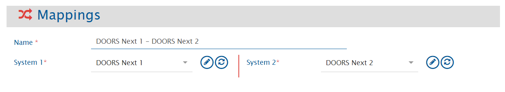
</p>

<p align="center">
  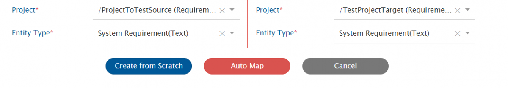
</p>


## Fields available in DOORS Next

All the system and custom attributes will be loaded in field mapping for a particular artifact type selected in **"Entity Type"** input and stream selected in **"Project"** input.

Along with above fields, there are few fields which are added by OpsHub Integration Manager in fields mapping for synchronization purpose. Following are the list of fields and the synchronization behavior when these fields are mapped.

* **Field Name : In Folder**  
  * In DOORS Next, the artifacts are organized in folders.  
  * In OpsHub Integration Manager, when DOORS Next is a source system, **"In Folder"** is used to represent the folder path of artifacts being synchronized.  
  * In OpsHub Integration Manager, when DOORS Next is a target system, **"In Folder"** is used to represent the folder path where the artifacts needs to be created.  
  * The datatype of this field in OpsHub Integration Manager is **Hierarchy**. The value mappings for this is displayed in a tree structure. For more information on value mapping, refer to document [Value mapping](mapping-configuration#value-mapping)  
  * The top level represents the stream path. The hierarchy of folders gets loaded when the stream path is expanded. All folders in stream are shown along with their path.  
  * **For example -** If there is a root folder "Component 1" and child folder "Folder A" with another child folder "Child Folder A", then in value mapping, there will be three folders displayed - "Component 1", "Component 1/Folder A" and "Component 1/Folder A/Child Folder A". Refer to below image for the value mapping on OpsHub Integration Manager UI.

		<p align="center">
		  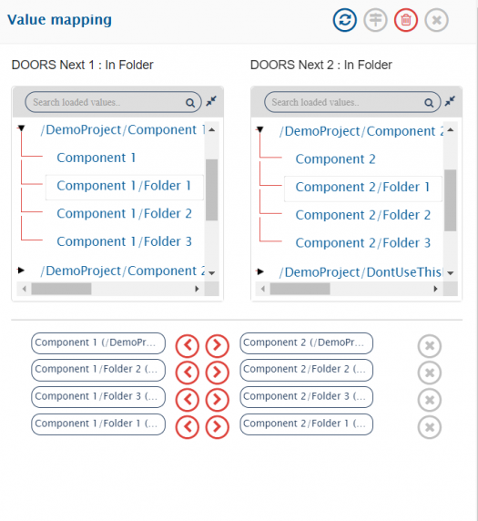
		</p>


  > **Note**: Refer to section [In Folder field Behavior](#in-folder-and-module-field-behavior) for more information on how "In Folder" field impacts synchronization.

* **Field Name : Module**  
  * **"Module"** field represents the modules that are visible on DOORS Next UI in any stream.  
  * The field purpose to decide the module where artifacts needs to be synchronized.  
  * In OpsHub Integration Manager, when DOORS Next is a source system, **"Module"** is used to represent the module name of artifacts being synchronized.  
    * If artifact is a [core artifact](#glossary), then module name will be empty as core artifacts doesn't belong to any module in end system.  
    * If artifact is a [shared artifact](#glossary), then module field represents the name of the module in which the shared artifact is present.  
  * In OpsHub Integration Manager, when DOORS Next is a target system, **"Module"** is used to represent the module name where the artifacts needs to be created.  
  * The datatype of this field in OpsHub Integration Manager is **Hierarchy**. The value mappings for this field is displayed in a tree structure. For more information on value mapping, refer to document [Value mapping](mapping-configuration#value-mapping)  
  * The top level represents the stream path. The modules of the stream gets loaded when the stream path is expanded.  
  * **For example -** If there are two modules "Module 1" and "Module 2" in stream, then in value mapping, there will be two modules displayed under that stream - "Module 1", "Module 2". Refer to below image for the value mapping on OpsHub Integration Manager UI.

	  <p align="center">
	  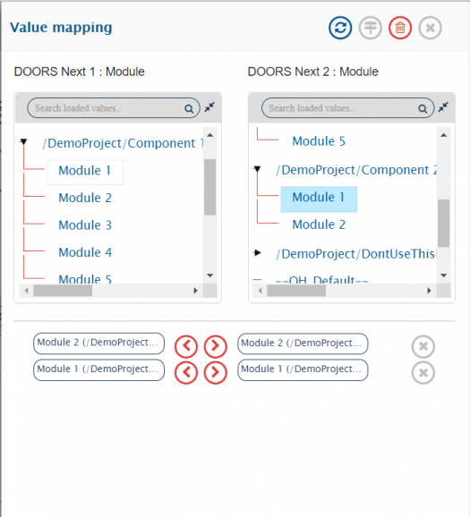
	  </p>


  > **Note**: If multiple modules with same name are found, then OpsHub Integration Manager will create the entity in the first found module.

  > **Note**: For **"Module"** field, it's recommended to have **"Sync When?"** settings set to **"Create"** in field mapping. Otherwise, OpsHub Integration Manager will throw an error for which artifacts are getting updated in a module. For more information on the error thrown, refer to error document [OH-DOORS Next-0043].

  > **Note**: Refer to section [In Folder and Module field Behavior](#in-folder-and-module-field-behavior) for more information on how "Module" field impacts synchronization along with "In Folder" field.

* **Field Name : DOORS Next Project**  
  * This field represents the Project name of DOORS Next where the stream that is configured in integration belongs to.  
  * This is a read-only field in OpsHub Integration Manager.

* **Field Name : Component**  
  * This field represents the Component name of DOORS Next where the stream that is in synchronization belongs to.  
  * This is a read-only field in OpsHub Integration Manager.

* **Field Name : Artifact Type**  
  * This field is a lookup field that represents the types of artifacts that are present in any stream.  
  * The field purpose is to tell the type of the artifact that needs to be synchronized.  
  * This is a read-only field in OpsHub Integration Manager.

* **Field Name : Artifact Format**  
  * This field is a lookup field that represents the formats of artifacts that can be created in the stream.  
  * The field purpose is to tell the format of the artifact that needs to be synchronized.  
  * This is a read-only field in OpsHub Integration Manager.

> **Note**: The **Entity Type** in mapping and integration configuration for DOORS Next is a combination of **Artifact Type** and **Artifact Format**. For Example - If Artifact Type is **Requirement**, and Artifact Format is **Text**, then, Entity Type will display **Requirement(Text)**.


## Virtual field to get new entity Id

* After upgrading to DOORS NG version 7.0.x, the entity internal Ids are changed for the entities. Hence, in any use case, if there is a need to get the new entity internal Id based on the old entity internal Id, here are the steps:  
  1. OpsHub has introduced the virtual field: **oh_artifact_new_id**  
  2. In the X field mapping, the getEntityFieldValue method can be used to get the new entity internal Id.  
  3. Below is the sample advanced mapping for getting new internal id based on old entity internal Id.

```xml
<Description xmlns:eaiutils="http://com.opshub.eai.EaiUtility" xmlns:xsl="http://www.w3.org/1999/XSL/Transform" >
  <xsl:for-each select="/SourceXML/updatedFields/Property/OHEntityReferences/OHEntityReference[linkType='REQ_COVERAGE']/links/EAILinkEntityItem">
    <xsl:if test="entityType='requirements'">
      <xsl:variable name="id" select="entityInternalId"/>
      <xsl:variable name="projectId" select="/SourceXML/opshubProjectKey"/>
      <xsl:value-of select="utils:getEntityFieldValue($workflowId,$sourceSystemId,$projectId,'requirements',$id,'oh_artifact_new_id')"/>
    </xsl:if>
  </xsl:for-each>
</Description>
```
> **Note**: The advanced mapping will vary as per the use case. However, the process of getting the new internal Id is same.

* The virtual field will not be available in mapping itself. It needs to be used in advanced mapping of the X field.

## Default Link Setting

Default link can be configured in relationship mapping for different link types and entity types. Please refer to [Default Link Settings](../integrate/default-link-settings.md) to learn about default link usage and configuration.

The default link query for DOORS Next has to be in a [OpsHub Query format](../integrate/opshub-query-format.md).

**The curly braces in OpsHub query needs to be escaped by double curly braces i.e. `{{` or `}}` for default link query**. For default link query with dynamic values, the placeholder `{SourceXML/updatedFields/Property/<field name>}` doesn't need to be escaped, i.e. the value part in query is not required to be escaped by double braces.

Given below are the sample snippets of how the OpsHub query can be used as default link query in OpsHub Integration Manager. For the examples below, the id information of the source system entity id is stored in source_system_id.

**Default Link query samples**

| **Field Type** | **Default Link usecase** | **Snippet** |
|----------------|---------------------------|-------------|
| **Text** | Search for artifact in DOORS Next(target system) whose Id is '58785' to link all synchronized artifacts to the found target artifact | `{{"field":"Identifier","condition":"=","value":"58785"}}` |
| **Text** | Search for artifact in DOORS Next which has source entity's id in 'RemoteEntityIdFieldText' field | `{{"field":"RemoteEntityIdFieldText","condition":"=","value":"{SourceXML/updatedFields/Property/source_system_id}"}}` |
| **Text** | Search for artifact whose display id(identifier) is stored in source_system_id field | `{{"field":"Identifier","condition":"=","value":"{SourceXML/updatedFields/Property/source_system_id}"}}` |
| **Lookup** and **Text** | Search for artifact which has source entity's id in 'RemoteEntityIdFieldText' field and 'Status' field is not 'Closed' | `{{"condition":"and","criterias":[{{"field":"RemoteEntityIdFieldText","condition":"=","value":"{SourceXML/updatedFields/Property/source_system_id}"}},{{"field":"Status","condition":"!=","value":"Closed"}}]}}` |

## Review Link Type

* When configuring the link for any artifact type, Reviews link type will be displayed in LOCAL TEST MEDIAWIKI, representing associated reviews with the artifact.
* To bring the associated reviews' data along with the artifact, user can configure **Reviews** link type with any entity type in the link configuration.
* Using the following advanced mapping, the LOCAL TEST MEDIAWIKI can retrieve the **reviewParticipants** data from the associated reviews of the artifact.

```xml
<TargetField xmlns:xsl="http://www.w3.org/1999/XSL/Transform">
  <xsl:variable xmlns:xsl="http://www.w3.org/1999/XSL/Transform" name="entityReferencecontext" select="/SourceXML/updatedFields/Property/OHEntityReferences/OHEntityReference"/>
  <xsl:variable name="projectKey1" select="SourceXML/opshubProjectKey"/>
  <op_list>
    <xsl:for-each select="/SourceXML/updatedFields/Property/OHEntityReferences/OHEntityReference/links/EAILinkEntityItem">
      <xsl:if test="entityType='Reviews'">
        <xsl:element name="value">
          <xsl:value-of select="utils:getEntityFieldValueAsObject($workflowId,$sourceSystemId,$projectKey1,'Reviews',entityInternalId,'reviewParticipants')"/>
        </xsl:element>
      </xsl:if>
    </xsl:for-each>
  </op_list>
</TargetField>
```

* Similarly, we can bring the following data related to the associated review mentioned in the table:

## Field Name Table

| **Field Name**                  | **Field Name Representation**                                                                 |
|-------------------------------|----------------------------------------------------------------------------------------------|
| title                         | Review title                                                                                 |
| description                   | Review description                                                                           |
| identifier                    | Review id                                                                                    |
| collaboration                 | Review creator information, create and update time                                          |
| dueDate                       | Due date of the review                                                                       |
| startDate                     | Review start date                                                                            |
| instructions                  | Review instructions data                                                                     |
| state                         | State of the review                                                                          |
| reviewParticipants            | Normalized review participants data to the review                                           |
| reviewArtifacts               | Normalized associated artifact data to the review                                           |
| reviewComments                | Link of the review comments                                                                  |
| project                       | Project data under which the review is present                                               |
| ParticipantWiseArtifactStatus | Normalized data for the status of each artifact's review given by participants, derived from hasParticipantResult |

## Advanced Workflow Transition

To understand the need for handling workflow transition in DOORS Next, let us take an example: A 'Requirement' in DOORS Next, when created should be in 'New' state. It can then be moved to 'Start Working' state and then to 'Submit for Review' state and then to 'Approved' or 'Rejected', but it cannot be directly marked as 'Approved' from 'New' state because of the state transition constraints enforced through DOORS Next artifacts state transitions (workflows).

### Need for handling workflow transition

> **Note**: For more information on DOORS Next workflow configuration, refer to [Requirement workflows](https://www.ibm.com/support/knowledgecenter/SSYMRC_6.0.3/com.ibm.rational.rrm.help.doc/topics/c_req_workflows.html).

Here is a screenshot of workflow transitions in DOORS Next:

<p align="center">
  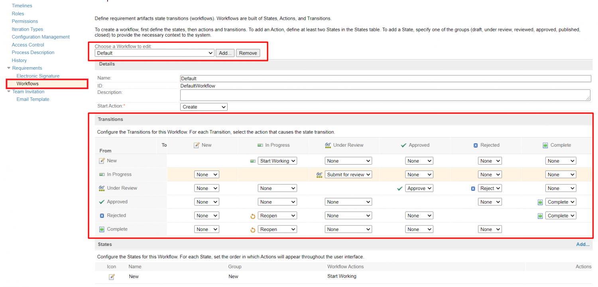
</p>

In such scenarios, simply mapping State (Default) field and their look-up values can cause failure(s), if given transition is not available. The possible scenarios in which the failure can happen are listed below.

- **Scenario 1:** If user tries to create a DOORS Next artifact with 'Start Working' status, user will get an error that this status transition is not possible and DOORS Next artifact can be created only in 'New' state.
- **Scenario 2:** If a DOORS Next artifact is in 'New' state and the integration is attempting to update the state to 'Approved', then DOORS Next will throw an error that the possible transition for artifact is from 'New' to 'Start Working'.

### Solution for handling workflow transition

This issue can be resolved by adding **Workflow Transition** XML in mapping configuration of OpsHub Integration Manager.

Refer to [Workflow Transition](../integrate/mapping-configuration.md#workflow-transition) to learn when and how to configure workflow transition xml mapping.  
With this option, OpsHub Integration Manager makes the required intermediate status transition automatically as per the transition(s) configuration in the end system.


# Integration Configuration

Set a time to synchronize data between DOORS Next and the other system to be integrated. Also, define parameters and conditions, if any, for integration. Click [Integration Configuration](../integrate/integration-configuration.md) to learn the step-by-step process to configure integration between two systems.

For DOORS Next system, on the first level, projects are displayed. On the second level, components of the project are displayed. On the third level of hierarchy initial stream of components is listed for associated project. Streams created from the initial stream will be displayed below the initial stream as child streams in a hierarchy. User can select the initial streams or child streams for synchronization.

<p align="center">
  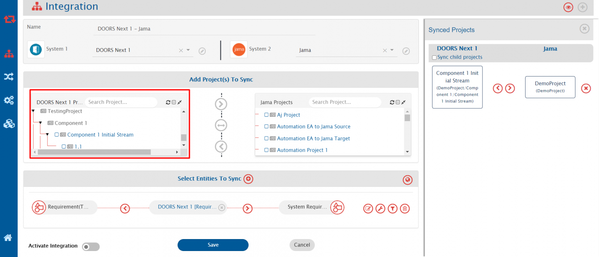
</p>

In the above image, for the source system **DOORS Next**, **Demo Project** at the first-level hierarchy is a Project of DOORS Next, **Demo Project** at second-level hierarchy is a Component of DOORS Next, **Demo Project Initial Stream** at the third-level hierarchy is the initial stream present in the component "Demo Project" and **Demo Stream 1** is the child stream of Initial Stream i.e. the stream created from **Demo Project Initial Stream**.

## Synchronize artifacts from specific module(s)

When DOORS Next is a source system, OpsHub Integration Manager supports synchronization of data from specific module(s).  
**For example:** If there are multiple module(s) in your stream and you want to synchronize artifacts from some specific module(s) only, then you can do so by configuring input **Module Filter Query**.

For synchronizing the artifacts from specific module(s), a JSON query needs to be specified in the input **Module Filter Query**. The query will be used to select the module(s) from which the artifacts are to be synchronized. The artifacts which belong to these module(s) would only be considered for the synchronization. Refer to page [OpsHub Query format](../integrate/opshub-query-format.md) for details on specific JSON format. Given below is the screenshot for the input.

<p align="center">
  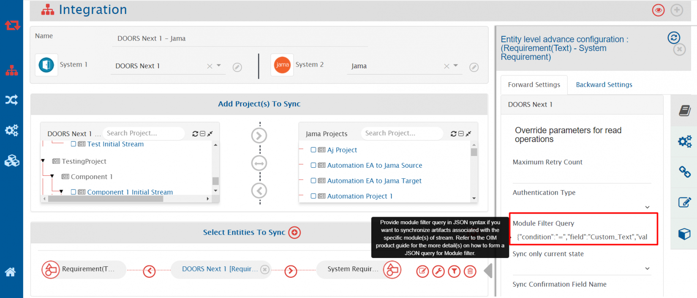
</p>

In the above configuration, the filter given is `{"condition":"=","field":"Custom_Text","value":"Sync This Module"}`. This will filter out module(s) whose **Custom_Text** is **Sync This Module** and the integration will synchronize all the artifacts from those filtered module(s).

> **Note**: The **Module Filter Query** input is common for all the streams selected for this integration configuration.

> **Note**: The **Module Filter Query** will behave similar to criteria query. Refer to sections [#Conditions supported](#conditions-supported) and [#Guidelines for Query](#guidelines-for-query) for more information on module query formation.

> **Note**: For all the custom field(s) used in **Module Filter Query** input, those custom field(s) are required as a field(s) in the end system for the artifact type for which integration is configured, as artifact type of module entities could be different than the integration's entity type.  
For example, the integration configured for the "User Requirement (Text)" and all those requirements are created in modules which are of type "Structure Requirement(Module)" then all the custom field(s) used in this query is required in end system for the entity type "User Requirement" too, otherwise 'global failure for the field not found' error will occur.

## Synchronize order changes of artifacts from module(s)

- The artifacts are organized in hierarchical order within the module, and OpsHub Integration Manager supports the synchronization of artifacts, maintaining the Hierarchical ordering to target with the help of [Hierarchy configuration](Mapping Configuration#Hierarchy).
- When the Hierarchical ordering is updated (Artifacts rearranged) within a module, this change neither updates the Artifact "Modified On" nor generates a "Revision" for this change. Hence by default, this order change operation gets processed with the synchronization of the next update operation (operation which updates either "Modified On" or generates the "Revision") of the artifact.
- To avoid this wait time and manual additional updates on the artifact, OpsHub Integration Manager can process the hierarchical order change by reading the module history in which this reordering is performed.  
To benefit from this functionality, the user can set the value **Yes** for the option, **Read module history to detect an artifact order change** available in the integration configuration when DOORS Next acts as a source endpoint.  
By default, this option is considered **No**, which means OpsHub Integration Manager will not read the module history, and the user can expect the ordering change to be synchronized with the next update operation on the artifact.

<p align="center">
  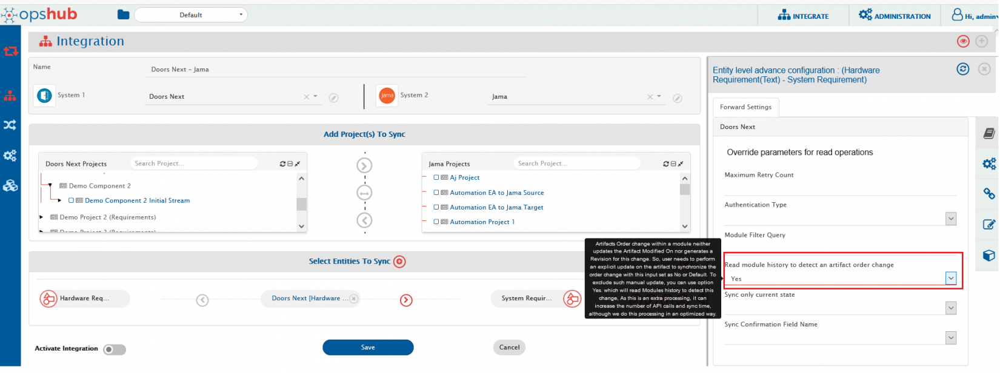
</p>


## Criteria Configuration

If you want to specify conditions for synchronizing an entity from DOORS Next to the other system to be integrated, you can use the **Criteria Configuration** feature.

Go to **Criteria Configuration** section on [Criteria Configuration in integration](../integrate/integration-configuration.md#criteria-configuration) page to learn in detail about Criteria Configuration.

The criteria query for DOORS Next has to be in a specific JSON format. Refer to page [OpsHub Query format](../integrate/opshub-query-format.md) for details on specific JSON format.

### Conditions supported

DOORS Next supports the following conditions (operators) for querying in end system: **=, !=, >, <, >=, <=, in, and**

### DOORS Next system Operators Usage

| **Operator supported** | **When to use the operators?** |
|------------------------|--------------------------------|
| =                      | When criteria needs to be added on single value for text, numeric or lookup type fields of DOORS Next. |
| !=                     | When criteria needs to be added on single value for text, numeric or lookup type fields of DOORS Next. |
| > and >=               | When criteria needs to be added on single value for numeric or date/datetime/time type fields of DOORS Next. |
| < and <=               | When criteria needs to be added on single value for numeric or date/datetime/time type fields of DOORS Next. |
| in                     | When criteria needs to be added on multiple value for text, numeric or lookup type fields of DOORS Next. |
| and                    | When there are multiple criterias or conditions to apply. |

### Guidelines for Query

- For querying in DOORS Next, the fields and lookup display values configured in query should be present in all the streams configured in integration for synchronization. If not present, then error will occur.

- **Query with User fields**  
  The criteria query or target lookup query on user field takes user id of the DOORS Next user. If the user id is invalid or is not present, then error is thrown by DOORS Next connector. For knowing user id, click on "User Profile", and take "User ID". Refer to below image for more information.

  <p align="center">
  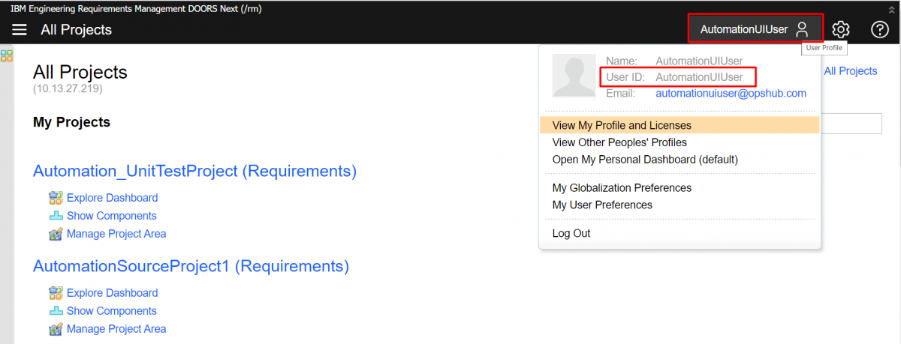
  </p>

- Criteria with **In Folder** field  
  - When query is configured on **In Folder** field, then the folder that is configured, must be present in all the streams that are configured in integration.
  - Each stream has a root folder (which is same as the component name of the stream).
  - When query needs to be done with root folder, then the value for lookup should be empty.  
    **For example –** There is a stream **Stream A** in component **Component A**, then the root folder name will be **Component A**. The JSON query for criteria and target lookup will be:
    ```json
    {"condition":"=","field":"In Folder","value":""}
    ```
  - When query needs to be done with **FolderA** present in root folder, then the value for lookup should be **FolderA**.  
    **For example –** Extending the above example, consider that in root folder **Component A**, there is another folder **FolderA**. In this case, the JSON query for criteria and target lookup will be:
    ```json
    {"condition":"=","field":"In Folder","value":"FolderA"}
    ```
  - When query needs to be done with folder path **FolderA/FolderA.A** present in root folder, then the value for lookup should be **FolderA/FolderA.A**.  
    **For example –** Extending the above example, consider that in folder **FolderA**, there is another folder **FolderA.A**. In this case, the JSON query for criteria and target lookup will be:
    ```json
    {"condition":"=","field":"In Folder","value":"FolderA/FolderA.A"}
    ```

- **Query on fields and values with special characters**  
  - For fields and values with special characters like **backslash \\ and double quotes "** need to be escaped.  
    **For example –** Fields or values with special characters like `Special[]\:"` will become `Special[]\\:\"` in JSON criteria query.

  - **Example queries with special characters –**  
    - Query on field name `Special[]\:"` will be like:  
      ```json
      {"condition":"=","field":"Special[]\\:\\\"","value":"special"}
      ```
    - Query on field `SpecialField` and value with special characters `value\:"Low` will be like:  
      ```json
      {"condition":"=","field":"SpecialField","value":"value\\:\\\"Low"}
      ```

### Sample queries for Criteria Configuration

| **Field Type**                        | **Criteria Description**                                                                 | **Criteria snippet** |
|--------------------------------------|------------------------------------------------------------------------------------------|-----------------------|
| **Lookup**                           | Synchronize all artifacts which have Severity as Major                                   | `{"condition":"=","field":"Severity","value":"Major"}` |
| **Lookup with multiple values check**| Synchronize all artifacts which have Severity either Minor or Normal                     | `{"condition":"in","field":"Severity","values":["Minor","Normal"]}` |
| **Date**                             | Synchronize all artifacts due after certain date                                         | `{"condition":">=","field":"Due On","value":"2020-10-01"}` |
| **Date Time**                        | Synchronize all artifacts which are closed before certain date and time                  | `{"condition":"<","field":"QM Closed Time","value":"2020-10-01T03:00:00+05:30"}` |
| **Text**                             | Synchronize all artifacts where Title is either Title1 or Title2                         | `{"condition":"in","field":"Title","values":["Title1","Title2"]}` |
| **Number**                           | Synchronize all artifacts where CustomInteger is not equal to 100                        | `{"condition":"!=","field":"CustomInteger","value":"100"}` |
| **Float**                            | Synchronize all artifacts where CustomFloat is greater than or equal to 100.0            | `{"condition":">=","field":"CustomFloat","value":"100.0"}` |
| **Boolean**                          | Synchronize all artifacts where EntitiesSync is true                                     | `{"condition":"=","field":"EntitiesSync","value":"true"}` |
| **Time**                             | Synchronize all artifacts which have CustomTime between 02:00:00 and 02:15:00            | `{"condition":"and","criterias":[{"condition":">","field":"CustomTime","value":"02:00:00"},{"condition":"<","field":"CustomTime","value":"02:15:00"}]}` |
| **User**                             | Synchronize all artifacts which were created by user 'Robert' or 'Mark'                  | `{"condition":"in","field":"Created By","values":["Robert","Mark"]}` |
| **User and Text**                    | Synchronize all artifacts that were created by user 'Robert' and have 'Title1' in Title | `{"condition":"and","criterias":[{"condition":"=","field":"Title","value":"Title1"},{"condition":"=","field":"Created By","value":"Robert"}]}` |
| **Folder**                           | Synchronize all artifacts from folder path 'Folder 2 artifacts/Folder 2.1'               | `{"condition":"=","field":"In Folder","value":"Folder 2 artifacts/Folder 2.1"}` |
| **Fields or values with special characters** | Synchronize all artifacts where field Special[]\:" has value Special              | `{"condition":"=","field":"Special[]\\:\\\"","value":"special"}` |

> **Note**: Criteria query for **Module** field is not supported.  
> Providing criteria on **Module** field of DOORS Next is not supported.  
> If criteria is provided on "Module" field, then error is thrown from DOORS Next connector.

## Target LookUp Configuration

Provide the query in **Target Search Query** field such that it is possible to search the entity in DOORS Next as a destination system. In the target search query field, you can provide a placeholder for the source system's field value between `@`.

Go to **Search in Target Before Sync** section in [Integration Configuration](../integrate/integration-configuration.md) to learn in detail on how to configure target lookup.

The target lookup query for DOORS Next has to be in a specific JSON format. Refer to page [OpsHub Query format](../integrate/opshub-query-format.md) for details on specific JSON format.

Consider a use case to search an entity in DOORS Next (Destination system), which has the entity id of the source system in a field named `TargetCustomField`. The source system's entity id is stored in `source_system_id`. If the Target Search Query is configured on field `TargetCustomField`, then while processing this query `@source_system_id@` will be substituted with the value of `source_system_id` from the source system's entity and then the query will be made to DOORS Next.

Given below are the sample snippets of how the JSON query can be used as target entity lookup query in OpsHub Integration Manager.  
For the examples below, the id information of the source system entity id is stored in `source_system_id`.

**Target lookup query samples**

| **Field Type** | **Target lookup usecase** | **Snippet** |
|----------------|---------------------------|-------------|
| **Text** | Target lookup on the entity which has source entity's id in `RemoteEntityIdFieldText` field | `{"field":"RemoteEntityIdFieldText","condition":"=","value":"@source_system_id@"}` |
| **Text** | Target lookup for entities whose display id (identifier) is stored in `source_system_id` field | `{"field":"Identifier","condition":"=","value":"@source_system_id@"}` |
| **Lookup** and **Text** | Target lookup on the entity which has source entity's id in `RemoteEntityIdFieldText` field and `Status` field is not `Closed` | `{"condition":"and","criterias":[{"field":"RemoteEntityIdFieldText","condition":"=","value":"@source_system_id@"},{"field":"Status","condition":"!=","value":"Closed"}]}` |


## Child Project Synchronization

Enabling this feature will synchronize entities from selected streams and their child streams to other system. Refer to document [Child Project Synchronization](..integrate/integration-configuration.md#child-project-synchronization) for more information of this feature.

User can synchronize all the streams of the project by selecting the initial stream and enabling the child project polling feature. This will automatically keep synchronizing all the artifacts of existing child streams of project in the integration as well as if any new child stream is added later in end system.

<p align="center">
  
</p>


> **Note:** For this feature to work properly, all the child streams must have the same permission and configuration as the parent stream. i.e. all the prerequisites that are applicable for parent streams will also be applicable to child streams.

## Other Advance Settings

### Input: Comment Date Format

- DOORS Next API returns the comment's updated time in a different format as per the end system version or setting of the end system's advance property `RDMPublishUseLocaleForCommentsTimeStamp`.  
  OpsHub Integration Manager uses this default format(s): `[MMMM d, yyyy at hh:mm:ss aaa z, yyyy-MM-dd'T'HH:mm:ss.SSSZ]` for date parsing.  
  In case the comment's updated time is not coming in specified default format(s), the error encountered is:

  `Unparseable date: "<Updated Time Date>"`  
  due to OpsHub Integration Manager being unable to parse unknown format.

- Configure the **Comment Date Format** input on the integration level to override the default date format used by OpsHub Integration Manager with the date format corresponding to the date format of updated time to resolve the parsing error.

### Input: Avoid time filter usage

- DOORS Next API throws the "time out" error intermittently, which gets auto resolved at its own. However, in some cases, where the data volume on the IBM Doors Next server it too large, such errors occurred frequently and it persists for long time.
- It was observed that, if the time filters are avoided in the Doors Next API queries of IBM Doors Next, frequency of such failures get reduced.
- Hence, to avoid such failures, this setting can be used. Select `Yes` value in below section of advanced settings:
  - The `Override parameters for read operations` of the `Entity level advance` setting of integration in OpsHub Integration Manager, when IBM Doors Next is source system in OpsHub Integration Manager  
  - The `Override parameters for write operations` of the `Entity level advance` setting of integration in OpsHub Integration Manager, when IBM Doors Next is target system in OpsHub Integration Manager

- Please note that this setting shall be enabled with the [current state sync mode](../integrate/integration-configuration.md#sync-only-current-state).
- Additionally, this setting shall not be enabled in the migration use case.


# Known Synchronization Behavior

## When DOORS Next is configured as source system

### Stream Merge

**End System behaviour**

- In DOORS Next, users can work in their respective [streams](#glossary) and then can merge their streams as per need. Please refer to [DOORS Next Stream merge](https://www.ibm.com/support/knowledgecenter/SSYMRC_6.0.6/com.ibm.jazz.vvc.doc/topics/t_accept_chgs.html) for more understanding on stream merge in DOORS Next.
- Let's consider that there are two streams `Stream A` and `Stream A.1` (where `Stream A.1` is created from `Stream A`). Now users have worked on `Stream A.1` and few new artifacts are created and/or some of the existing artifacts are updated. So now when the `Stream A.1` is merged with `Stream A`, then in `Stream A`, users will only see a single update/merge revision for all the create/update operations performed in `Stream A.1` (not the complete history of the actions performed in `Stream A.1`).

**Synchronization behaviour**

With respect to the above end system behavior, following will be the synchronization behavior.

Let's say there are 3 streams, `Stream A`, `Stream A.1` and `Stream A.2` (`Stream A.1` and `Stream A.2` have been created from `Stream A`). `Stream A` and `Stream A.1` are configured in integration for synchronization and `Stream A.2` is not configured for synchronization.

- **Scenario 1** - There are few revisions in artifacts of `Stream A.1`. Those revisions will get synchronized in the entities of target system (entities in the target project corresponding to `Stream A.1`).  
  When `Stream A.1` gets merged to `Stream A`, then a single revision gets added in artifacts of `Stream A`. OpsHub Integration Manager will synchronize that revision and subsequent revisions of artifacts in `Stream A` to the entities in target project corresponding to `Stream A`.

- **Scenario 2** - Now consider, there are few revisions in artifacts of `Stream A.2`. As `Stream A.2` is not configured for synchronization, the artifacts of `Stream A.2` will not get synchronized.  
  When `Stream A.2` gets merged to `Stream A`, then a single revision gets added in artifacts of `Stream A` (as per DOORS Next behavior).  
  OpsHub Integration Manager will synchronize that revision and any other subsequent revisions of artifacts in `Stream A` to the entities in target project corresponding to `Stream A`.

### Changeset Merge

**End System behaviour**

- In DOORS Next, users can create a [changesets](#glossary). The changeset can be delivered to the stream as per need. Please refer to [DOORS Next Delivering changesets](https://www.ibm.com/support/knowledgecenter/SSYMRC_6.0.6/com.ibm.jazz.vvc.doc/topics/t_del_chgs_elsewhere.html) for more understanding on delivering changesets to other streams in DOORS Next.
- Let's consider that there is one stream `Stream A` and one changeset `Changeset A` (where `Changeset A` is created from `Stream A`). Now users have made some changes in existing artifacts in `Changeset A`. So now when the `Changeset A` is delivered to `Stream A`, then in `Stream A`, users will see all the updates performed in `Changeset A` (complete history of the actions performed in `Changeset A`).
- When `Changeset A` gets merged with `Stream A`, then following is the end system behavior:
  - The time of revisions in `Changeset A` after merge is retained in `Stream A`.
  - The last revision time of artifacts in `Stream A` after merge is same as the time when `Changeset A` was merged to `Stream A`, i.e. The artifact's last revision time in stream is different than that of last revision time of entity in changeset.

**Synchronization behaviour**

With respect to the above end system behavior, following will be the synchronization behavior.

Let's say there is one stream `Stream A` and one changeset `Changeset A`. `Stream A` is configured in integration for synchronization.

- Revisions done on artifacts in `Changeset A` will be synchronized when `Changeset A` gets merged in `Stream A` in DOORS Next.
- There might be loss of revisions when `Stream A` synchronization is in progress and `Changeset A` gets merged with `Stream A`.

  **For example** – Consider an artifact `E1` in `Stream A` with revisions `R1` at `T1` and `R4` at `T4`.  
  In changeset, `E1` had revision `R2` at `T2` and `R3` at `T3`. Let's say we merge stream at `T5`.  
  For `Stream A`, integration is running and has reached till `T4`. Then, Revision `R2` for `E1` will be skipped (as integration has synced artifacts till `T4`) but `R3` (last revision in changeset) will be synced at `T5`.

> **Note:** When user is working on stream using changeset, then overwrite must be on for all fields so that source changes don't get missed.

### Artifact Copy/Clone

**End System behaviour**
- In DOORS Next, artifacts can be copied or cloned from one component to another. Please refer to [DOORS Next copy/clone artifacts](https://www.ibm.com/support/knowledgecenter/SSYMRC_6.0.6/com.ibm.jazz.vvc.doc/topics/t_comp_clone.html?pos=2) for more understanding on copying and cloning artifacts in DOORS Next.
- The end system creates a completely new replica of artifact when any artifact gets cloned or copied.
- The end system doesn't preserve any revisions of artifact. Only a single revision of current state gets reserved in the copied/cloned artifact.
- The end system doesn't preserve the comments and links data after copying/cloning another artifact.

**Synchronization behaviour**
- With respect to the above end system behavior, following will be the synchronization behavior.
  - The historical data artifacts which are copied/cloned from another artifacts will not be populated. There will be only one revision synchronized due to DOORS Next system behavior.
  - Any new comment and link added in the artifact will be synchronized by OpsHub Integration Manager.

---

**Multi-Project polling behavior**
- When multiple streams are configured with module-based synchronization enabled (i.e. the module view input is provided in integration), then the view must be configured in DOORS Next UI for all the streams that are configured in integration.
- The view name must be same in all the streams configured in the integration though the view criteria can vary.
  - **For example** - If module artifacts are to be synced from two streams "Stream1" and "Stream2", then both streams must have a view configured on DOORS Next UI with the same name. The view filters can be different i.e. "Stream1" view might synchronize artifacts from modules whose Severity is Low and "Stream2" might synchronize artifacts from modules whose Severity is Major.

> **Note**: If a stream "Stream 1" has a view created and a child stream "Stream 1.1" is created, then "Stream 1.1" will also have the view. In this case, no view needs to be created in "Stream 1.1". But in case, if "Stream 1" didn't have the view configured before "Stream 1.1" creation, then a new view with same name must be created in "Stream 1.1".

**Other behavior**
- When the input **DOORS Next Module View Name** is given, then integration will not synchronize the core artifacts present in the stream. Only the shared artifacts i.e. the artifacts in the modules (modules present in the view) will be synchronized.
- If the given view name is not present in DOORS Next stream, then no artifacts corresponding to that stream will be synchronized.
- If the view name is configured in integration and is later renamed on DOORS Next UI, then, the view name must be updated in the integration to keep on synchronizing the artifacts.
- If there are two modules configured for synchronization. If one of the module is removed later on, then the already synchronized artifacts of that module will no longer be in synchronization.


### When DOORS Next is configured as target system

#### "Primary Text" field Behavior

If the Primary Text field is mapped during field mapping, then do not map attachments, otherwise the below behavior will be observed:

- There will be an extra revision for the attachments, whenever the attachment will be added to the entity.

**End System behavior**
- In DOORS Next, whenever an inline image is added in **Primary Text** field, the inline image gets added as a file (attachment) as well.

**Synchronization behavior**
- With respect to the above behavior, OpsHub Integration Manager creates two revisions for **Primary Text** field, one for update and other one for the file (attachment) added as inline-image.

- If the Source field, which is mapped with the **Primary Text** gets updated/modified, then it will overwrite the attachment reference which is created due to attachment synchronization from the Source system.


#### "In Folder" and "Module" field Behavior

When the **In Folder** or **Module** field is mapped in field mapping for DOORS Next acting as a target system, then the following will be the synchronization behavior:

**Synchronizing the artifacts in folders**
- When user wants to synchronize the artifacts in different folders, then user can map the **In Folder** field in mapping and based on that artifacts will be created	 in different folders as per value mapping.

**Synchronizing the artifacts in modules**
- When user wants to synchronize the artifacts in modules, then, user can map the "Module" field in mapping.
- As per DOORS Next end system behavior, when an artifact is created in module, there are two artifacts created:
  - One is the core artifact
  - The other is the shared artifact
- The core artifact is created in the folder corresponding to the module, whereas the shared artifact is created in the module.
- Based on the module field value mapping and DOORS Next system behavior, OpsHub Integration Manager will also create the core artifact in the folder associated with the module (each module has their separate asset folder associated) and then the created artifact will be added in the corresponding module as a shared artifact.

> **Note**: For above case, when the **Module** field is mapped and once the artifact is created by OpsHub Integration Manager in target DOORS Next system, then any further updates for the corresponding entity from source system will be written in the artifact belonging to module (shared artifact).

**In Folder and Module Field combination behavior**

| "In Folder" field mapped | "Module" field mapped | Artifacts synchronization behavior |
|--------------------------|------------------------|------------------------------------|
| No                       | No                     | Artifact will be created in root folder of the stream. |
| Yes                      | No                     | Artifact will be created in the folder as per folder value mapping. |
| No                       | Yes                    | Core artifact will be created in the folder corresponding to the module (as per "Module" field value mapping) and Shared artifact will be created in the Module (as per "Module" field value mapping) |
| Yes                      | Yes                    | Core artifact will be created in the folder as per "In Folder" field value mapping and Shared artifact will be created in the Module as per "Module" field value mapping |

# Known Limitation

## Common Limitations

* **Configuration Management**  
  There are two types of configuration in DOORS Next - Local configuration and Global configuration. Local configuration is the individual configuration of any stream whereas Global configuration allows multiple streams of different systems to collaborate with each other. For information on Global Configuration, refer to link [Global Configuration in DOORS Next](https://www.ibm.com/support/knowledgecenter/SSYMRC_6.0.6/com.ibm.rational.gcapp.doc/topics/c_gcm_node_product.html)
  * OpsHub Integration Manager supports synchronization in local configuration scope. Synchronization of Global configuration streams are not supported by OpsHub Integration Manager. Thus, cross component links are not supported for DOORS Next by OpsHub Integration Manager.

## When DOORS Next is configured as source system

In addition to above limitations, following are some limitations in synchronization when DOORS Next system is configured as source end system in integration.

* Comments added in artifacts during merge from another stream will not be synchronized by OpsHub Integration Manager.

  **End System behaviour**
  * When a stream or changeset gets merged to another stream in DOORS Next, the comments added in artifacts retains their update time i.e. If there is a comment **Comment 1** added in artifact at T1 in stream or changeset and later the stream or changeset gets merged into another stream **Stream A** at T2. Then, the comment revision time will be T1 and not T2(comments time in Stream A will be same as that in changeset/merged stream).

  **Limitation in synchronization**
  * Comments added in artifacts during merge from another stream will not be synchronized by OpsHub Integration Manager.

    **For example -**
    * Let's say there are 2 streams, **Stream A**, **Stream A.1** (Stream A.1 have been created from Stream A at time T1). Stream A is configured in integration for synchronization.
    * There are few comments added in artifacts in Stream A.1 at time T2 and T3. Let's say the synchronization is on-going for Stream A and has reached till T4. When Stream A.1 gets merged to Stream A at T5, then all the comments gets added in artifacts of Stream A. OpsHub Integration Manager will skip the comments added in Stream A.1 in such cases as the integration has already synchronized till T4 and the comments that are now added in Stream A at time T2 and T3 after merge will be skipped.

* When the **In Modules** field is mapped, modules with empty names(no name) will not be synchronized to the target end system.
* If **Reviews** link is added, an update to the parent entity is required to synchronize the updated review data.
  * Reason: After updating the review details, entity's last modified time does not update.
* If **Tags** are edited after being synced, it will be synchronized to target system with next update.
  * Reason: After Tags are edited, entity's last modified time does not update.

## When DOORS Next is configured as target system

In addition to the [Common Limitations](#common-limitations), the following are a few limitations in synchronization when DOORS Next system is configured as a target end system in integration.

* If the entity of artifact format "Collection" is configured in the integration, then the creation of the entity with all the fields may result in the creation of an entity with the "Text" format.

* Synchronization of the inline document is not supported for HTML field.

  * If the Source field, which is mapped with the HTML field of Doors Next contains the inline document, then synchronization will fail with processing failure.
  * If the Source field, which is mapped with the HTML field of Doors Next contains the hyperlink to the inline file, then below will be the synchronization behavior:
    * If the above-mentioned data is added into the Source system, then synchronization will fail with processing failure.
    * If the above-mentioned data is synchronized from Doors Next to another end system via OpsHub Integration Manager, then synchronization will generate data corruption.

# Troubleshoot

Refer to document [IBM Engineering Requirements Management DOORS Next Error Solutions](../help-center/troubleshooting/errors/ibm-rational-doors-next-generation-error-solutions.md) for errors and solutions.

# Appendix

## Set the date formats during system configuration

* To derive the date format for the artifacts, user should hit the API:  
  `GET <baseUrl>/rm/resources/<artifactId>`.  
  The response of the API call will be:

```xml
<rdf:RDF xmlns:rdf="http://www.w3.org/1999/02/22-rdf-syntax-ns#"
         xmlns:acp="http://jazz.net/ns/acp#"
         xmlns:public_rm_10="http://www.ibm.com/xmlns/rm/public/1.0/"
         xmlns:calm="http://jazz.net/xmlns/prod/jazz/calm/1.0/"
         xmlns:jazz_rm="http://jazz.net/ns/rm#"
         xmlns:acc="http://open-services.net/ns/core/acc#"
         xmlns:process="http://jazz.net/ns/process#"
         xmlns:dcterms="http://dpurl.org/dc/terms/"
         xmlns:dc="http://purl.org/dc/elements/1.1/"
         xmlns:j.0="http://www.ibm.com/xmlns/rdm/workflow/"
         xmlns:oslc="http://open-services.net/ns/core#"
         xmlns:nav="http://jazz.net/ns/rm/navigation#"
         xmlns:oslc_config="http://open-services.net/ns/config#"
         xmlns:j.1="http://jazz.net/ns/enterprise_agile#"
         xmlns:oslc_rm="http://open-services.net/ns/rm#"
         xmlns:dng_task="http://jazz.net/ns/rm/dng/task#"
         xmlns:rm="http://www.ibm.com/xmlns/rdm/rdf/"
         xmlns:oslc_auto="http://open-services.net/ns/auto#">
  <rdf:Description rdf:about="<baseUrl>/rm/resources/TX_GAwmgRgEEe-ig-64BS_eRQ">
    <rdf:type rdf:resource="http://jazz.net/ns/rm#Text"/>
    <rdf:type rdf:resource="http://open-services.net/ns/rm#Requirement"/>
    <j.0:DefaultWorkflow rdf:resource="http://www.ibm.com/xmlns/rdm/workflow/DefaultWorkflow#com.ibm.rdm.workflow.common.new"/>
    <rm_property:AD_uFP4O4i9EeyJ07UWT7qsvA rdf:datatype="http://www.w3.org/2001/XMLSchema#date">2024-05-22</rm_property:AD_uFP4O4i9EeyJ07UWT7qsvA>
    <dcterms:identifier rdf:datatype="http://www.w3.org/2001/XMLSchema#string">284305</dcterms:identifier>
    <dcterms:description rdf:parseType="Literal">2024_05_22_11_55_18_034_</dcterms:description>
    <j.1:estimatedStoryPointsMVP rdf:datatype="http://www.w3.org/2001/XMLSchema#int">68</j.1:estimatedStoryPointsMVP>
    <dcterms:modified rdf:datatype="http://www.w3.org/2001/XMLSchema#dateTime">2024-05-22T06:25:33.416Z</dcterms:modified>
    <j.1:outsourcedDevelopment rdf:datatype="http://www.w3.org/2001/XMLSchema#boolean">false</j.1:outsourcedDevelopment>
    <dcterms:title rdf:parseType="Literal">2024_05_22_11_55_18_037_</dcterms:title>
    <rm_property:AD_uFGHOIi9EeyJ07UWT7qsvA rdf:datatype="http://www.w3.org/2001/XMLSchema#dateTime">2024-05-22T06:25:18.000Z</rm_property:AD_uFGHOIi9EeyJ07UWT7qsvA>
    <rdf:type rdf:resource="http://jazz.net/ns/sse#SystemRequirement"/>
    <dcterms:created rdf:datatype="http://www.w3.org/2001/XMLSchema#dateTime">2024-05-22T06:25:33.416Z</dcterms:created>
  </rdf:Description>
</rdf:RDF>
```

* Here, this field `<dcterms:modified rdf:datatype="http://www.w3.org/2001/XMLSchema#dateTime"> 2024-05-22T06:25:33.416Z</dcterms:modified>` represents the modified time of the artifact given in the API response above. Hence, for the date 2024-05-22T06:25:33.416Z, the format will be yyyy-MM-dd'T'HH:mm:ss.SSS'Z'.
* To get the date format, user should hit the API: `GET <baseURL>/rm/publish/comments?resourceURI=<resourceURL>`. The response of the API call will be:- If the configured timeout is not large enough, and the token is not used by OpsHub Integration Manager in the configured timespan for some reason (Inactive integration/Inactive OpsHub Integration Manager server), then token will get expired.

```xml
<ds:dataSource xmlns:attribute="http://jazz.net/xmlns/alm/rm/attribute/v0.1" xmlns:comments="http://jazz.net/xmlns/alm/rm/comments/v0.1" xmlns:ds="http://jazz.net/xmlns/alm/rm/datasource/v0.1" xmlns:field="http://jazz.net/xmlns/alm/rm/field/v0.1" xmlns:h="http://www.w3.org/1999/xhtml" xmlns:history="http://jazz.net/xmlns/alm/rm/history/v0.1" xmlns:rdf="http://www.w3.org/1999/02/22-rdf-syntax-ns#" xmlns:rm="http://www.ibm.com/xmlns/rdm/rdf/" xmlns:rrm="http://www.ibm.com/xmlns/rrm/1.0/" xmlns:term="http://jazz.net/xmlns/alm/rm/term/v0.1" xmlns:text="http://jazz.net/xmlns/alm/rm/text/v0.1" xmlns:view="http://jazz.net/xmlns/alm/rm/view/v0.1" xmlns:xhtml="http://www.w3.org/1999/xhtml" appId="RRC" vMajor="70" vMinor="10">
       <ds:artifact>
           <rrm:title>2024_05_22_10_38_43_717_N7</rrm:title>
           <rrm:description/>
           <rrm:identifier>TX_TXf_IBf5Ee-ig-64BS_eRQ#1</rrm:identifier>
           <commentNumber>1</commentNumber>
           <rrm:about/>
           <rrm:format/>
           <ds:location/>
           <ds:content>
               <comments:comments lang="english">
                   <comments:text>
                       <h:div>
                           <h:p xmlns:h="http://www.w3.org/TR/REC-html40">
                               2024_05_22_10_38_43_719_XGK6LDO3DVH8RXGMFKX8726Z16U
                           </h:p>
                       </h:div>
                   </comments:text>
                   <comments:plaintext> 2024_05_22_10_38_43_719_XGK6LDO3DVH8RXGMFKX8726Z16U </comments:plaintext>
                   <comments:priority>Low</comments:priority>
                   <comments:isResolved>false</comments:isResolved>
                   <comments:reviewId/>
                   <comments:parentComment/>
                   <comments:updated>2024-05-21T22:08:45.000-0700</comments:updated>
               </comments:comments>
           </ds:content>
           <ds:aggregatedContent/>
       </ds:artifact>
   </ds:dataSource>
```

* Here, the field `<comments:updated>2024-05-21T22:08:45.000-0700</comments:updated>` represents the modified time of the comment given in the API response above. Hence, for the date 2024-05-21T22:08:45.000-0700, the format will be yyyy-MM-dd'T'HH:mm:ss.SSSZ.

## OAuth configuration

### Steps for OAuth Token generation

Following are the steps that needs to be done for generating OAuth token for DOORS Next system.

- **Generate Customer Key**
  - Login to **Admin panel (`<DOORS Next URL>/JTS/admin`)** with user whose OAuth token needs to be generated.
  - Navigate to **Server > Consumers (Inbound)** in **Communication** section.
  - Enter the **Consumer Name**, **Consumer Secret**, and click **Register**. A **Consumer Key** will be generated.
  - After successfully registering the consumer, the **Consumer Name** and **Consumer Key** will be added in the **Authorized Keys** section.  
  
  <p align="center">
  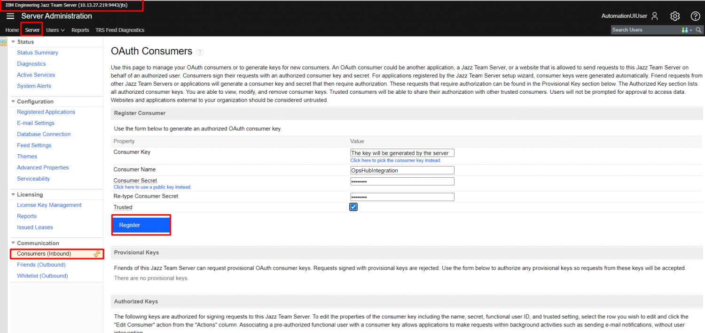
 </p>

- **Generate OAuth Token and OAuth Secret for given consumer key**  
  The following two ways can be used to generate the OAuth token for IBM Engineering Requirements Management DOORS Next system:
  - [Option 1 (Utility)](ibm-rational-doors-next-oauth-generation.md#generate-token-using_doorsng-token-generator-utility): Generate the OAuth token using a stand-alone utility bundled with OpsHub Integration Manager to generate the OAuth token.
  - [Option 2 (Postman)](ibm-rational-doors-next-oauth-generation.md#generate-token-using-rest-client-postman)): Generate an OAuth token using a third-party rest client such as postman.

> **Note**:  
**The behavior of "OAuth" token:**
- The OAuth token will be expired, if it is not used for the time span, which is configured in the "OAuth access token timeout" configuration of IBM Engineering Requirements Management DOORS Next server.
- Suppose the token mentioned in the System Configuration form in the OpsHub Integration Manager gets expired, then it must be updated by reperforming the above steps.
- To avoid the above case, the value of the "OAuth access token timeout" configuration would be larger than the synchronization interval (Integration schedule) of the integration, which is configured with DOORS Next using OAuth authentication.
	- If the configured timeout is not large enough, and the token is not used by OpsHub Integration Manager in the configured timespan for some reason (Inactive integration/Inactive OpsHub Integration Manager server), then token will get expired.

## How to find DOORS Next version

- Log in into DOORS Next.  
- Click on **Help Contents** as shown below. In the drop-down panel, click **About This Application** as shown below.  
 
 <p align="center">
  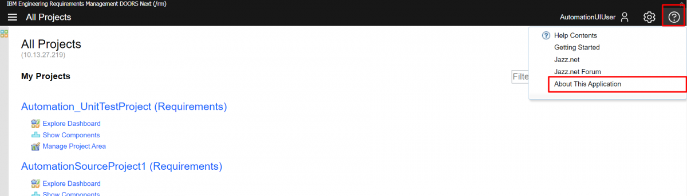
 </p>

- Under section **About the Requirements Management Application**, check **Version** against section **Rational DOORS Next**. Refer to below image.  
  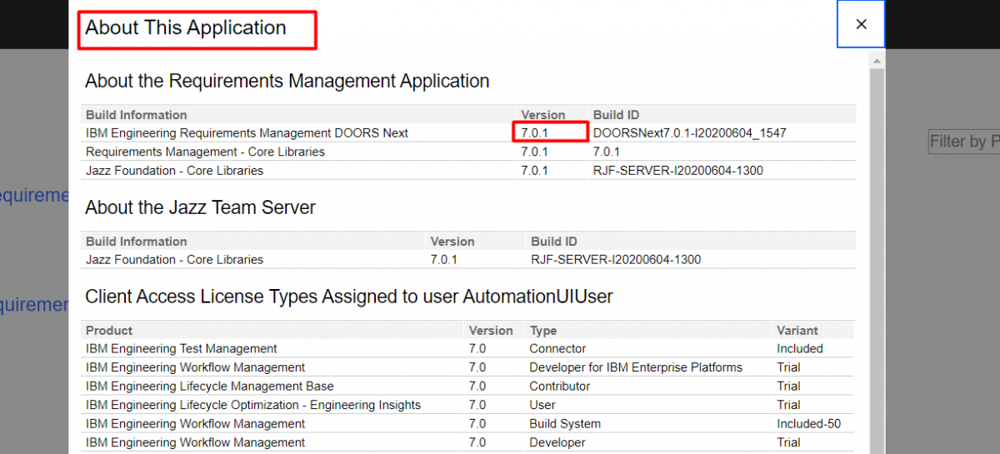

## Enable Configuration Management

- Log in to DOORS Next UI with user who is Project Administrator.
- Go to the project for which **Configuration Management** needs to be enabled. Go to **Manage This Project Area** from **Settings** icon.  
  
  <p align="center">
  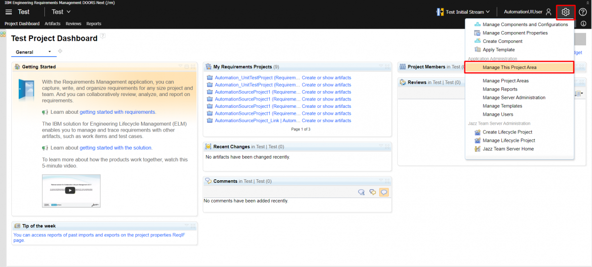
 </p>

- Go to **Configuration Management** and click on **Enable Configuration Management**.  
  
  <p align="center">
  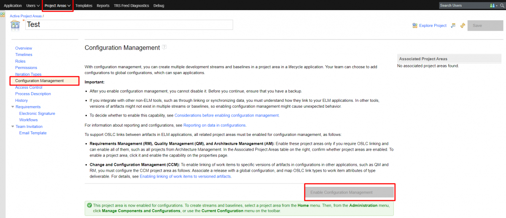
 </p>
 
## How to Create a User

- Login to **Admin panel (`<DOORS Next URL>/JTS/admin`)** with user who has Administrator privileges.
- In **Server Administration**, go to **Users** tab and open **Active Users**.  
	
	<p align="center">
	  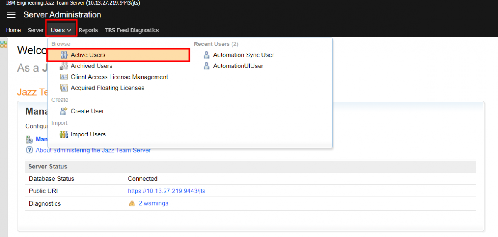
	</p>
	
- On top-right corner, click on **Create User** option.  
  
  <p align="center">
  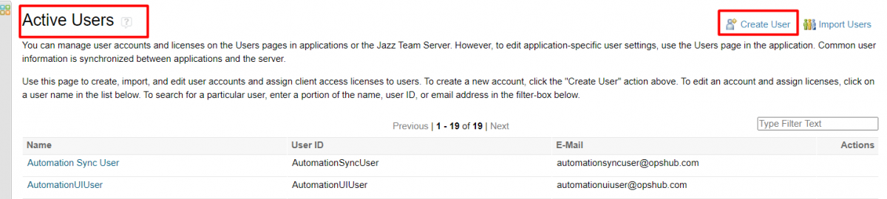
 </p>

- Give your User Name, User ID and E-mail Address as input and click on **Save** on the top-right corner.  
  
  <p align="center">
  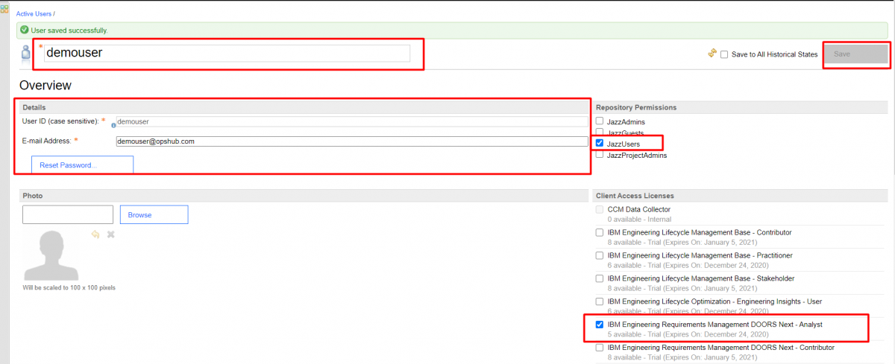
  </p>

> **Note**:  
> The sync user should have **JazzUsers** Repository permissions for both read/write access.  
> Refer to link: [DOORS Next Repository Permissions](https://www.ibm.com/support/knowledgecenter/SSYMRC_6.0.6.1/com.ibm.jazz.repository.web.admin.doc/topics/taddnewuser.html)

**DOORS Next License details for sync user**

| **License** | **Justification** | **Needed When** |
|-------------|-------------------|------------------|
| **IBM Engineering Requirements Management DOORS Next - Contributor** | This is the minimal license required by the user for having read access in DOORS Next | DOORS Next is source system |
| **IBM Engineering Requirements Management DOORS Next - Analyst** | This is the minimal license required by the user for having read/write access in DOORS Next | DOORS Next is target system. Also, when DOORS Next is source system, then this license is required for [Remote Id or Remote Link configuration](../integrate/integration-configuration.md#tracking-id-and-link-of-entities-across-systems) in integration. |

> **Note**:  
Refer to link: [DOORS Next Client access license management](https://www.ibm.com/support/knowledgecenter/SSYMRC_6.0.6.1/com.ibm.jazz.repository.web.admin.doc/topics/c_license_mgmt_over.html) for more information on licenses.

## Access Control

In DOORS Next, the **read access** can be restricted using **Access Control** settings. Access Control settings can be done using following steps.

- Log in to DOORS Next UI with user who is a Project Administrator.
- Go to **Manage This Project Area** from **Settings** icon in your project at top-right corner.  
  
  <p align="center">
  
 </p>

- Under **Project Area**, click on **Access Control**. There is an option for giving **Grant read access to**. For complete information on options available in access control for a project, refer to:  
  [Restricting read access in DOORS Next project](https://www.ibm.com/support/knowledgecenter/SSYMRC_6.0.6/com.ibm.jazz.platform.doc/topics/t_restricting_read_access_to_project_web.html)  
  
  <p align="center">
  
 </p>

- Following is an overview of the options. You can choose any one of them as per your project configuration.
  - **Everyone**
    - If the project's read access setting is set to **Everyone**, then no explicit permissions need to be granted to sync user for reading artifacts from a project.
  - **No one (repository administrators only)**
    - If the project's read access setting is set to **No one (repository administrators only)**, then the sync user must be one of the administrators of the project.
    - Refer to section [Add user as Project administrator](#how-to-add-user-in-a-project-as-administrator)
  - **Members of the project area hierarchy**
    - If the project's read access setting is set to **Members of the project area hierarchy**, then the sync user must be one of the members of the project.
    - Refer to section [Add user as Project member](#how-to-add-user-in-a-project-as-memberhow-to-assign-user-with-specific-role)
  - **Members of the project area hierarchy and users in the access list**
    - If the project's read access setting is set to **Members of the project area hierarchy and users in the access list**, then the sync user must either be one of the members in the project or must be present in the access list (under **Browse Access List**) of the project to be synchronized.
    - Refer to section [Add user as Project member](#how-to-add-user-in-a-project-as-memberhow-to-assign-user-with-specific-role) or  
      [Adding single user in Access List](#how-to-give-read-access-to-single-user)
  - **Users in the access list only**
    - If the project's read access setting is set to **Users in the access list only**, then the sync user must be present in the access list (under **Browse Access List**) of the project to be synchronized.
    - Refer to section [Adding single user in Access List](#how-to-give-read-access-to-single-user)

## How to add User in a Project as Administrator

* Log in to DOORS Next UI with user who is Project Administrator.
* Go to **Manage This Project Area** from **Settings** icon in your project at top-right corner.  

 <p align="center">
  
 </p>

* Go to **Overview** section in left panel. 
 
  <p align="center">
  
 </p>

* There will be a list of **Administrators**. Click on **Add** button to add a new administrator in the project.  
 
 <p align="center">
  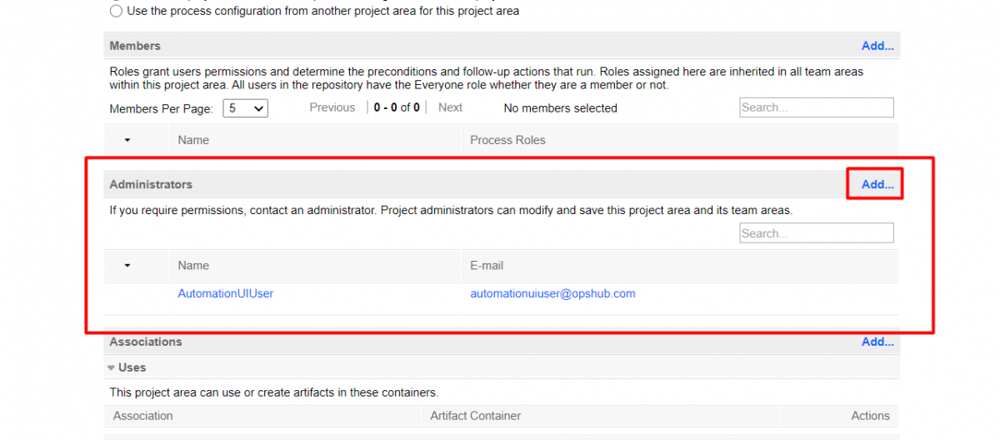
 </p>

* A **Select Users** window will open. Select the user you want to add in the project as administrator from **Matching users** list. Click **Add**.  

 <p align="center">
  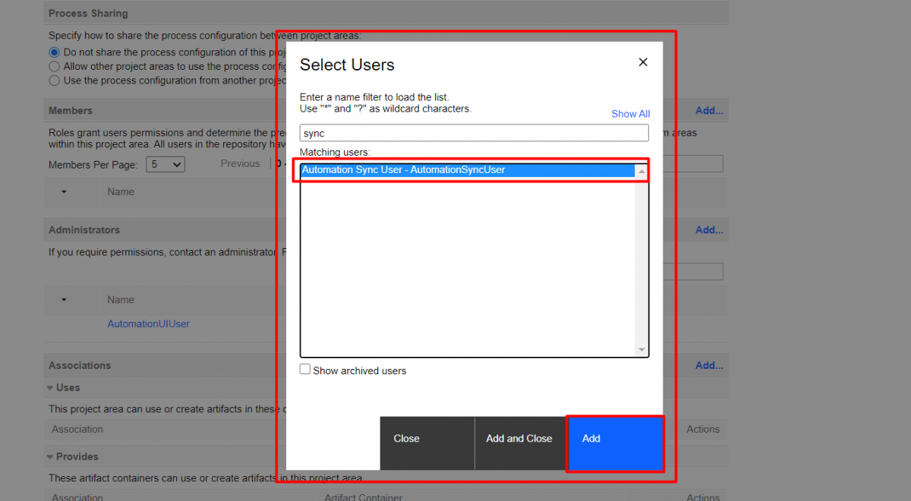
 </p>

* The user will be added in the **Administrators** list as shown below.  

 <p align="center">
  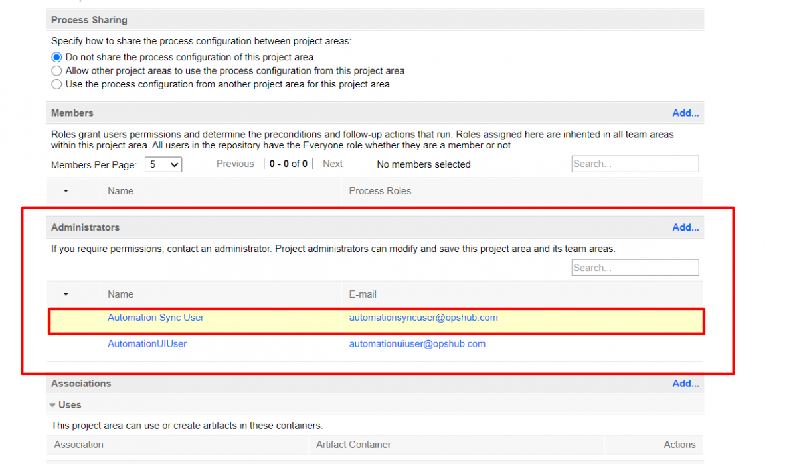
 </p>
 
* Click on **Save** button at the top right corner for saving your changes.  

 <p align="center">
  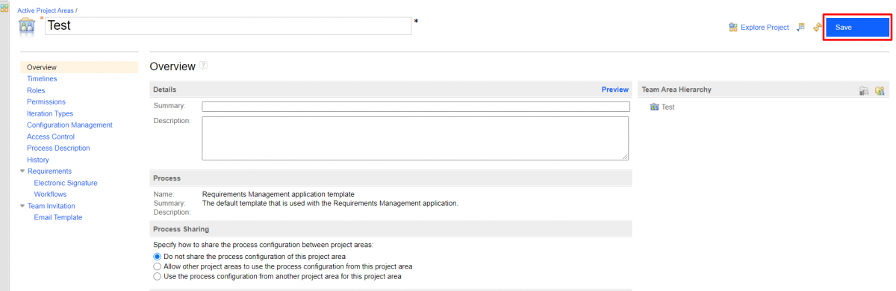
 </p>


## How to add User in a Project as member/How to assign user with specific role

* Log in to DOORS Next UI with user who is Project Administrator.
* Go to **Manage This Project Area** from **Settings** icon in your project at top-right corner.  

<p align="center">
  
</p>

* Go to **Overview** section in left panel.  

<p align="center">
  
</p>

* There will be a list of **Members**. Click on **Add** button to add a new member in the project.  

<p align="center">
  
</p>

* A **Select Users** window will open. Select the user you want to add in the project from **From Matching users** list and click on **Right** arrow as shown in the below image. The user will be added in the **Selected users** list. Click **Next**.  

<p align="center">
  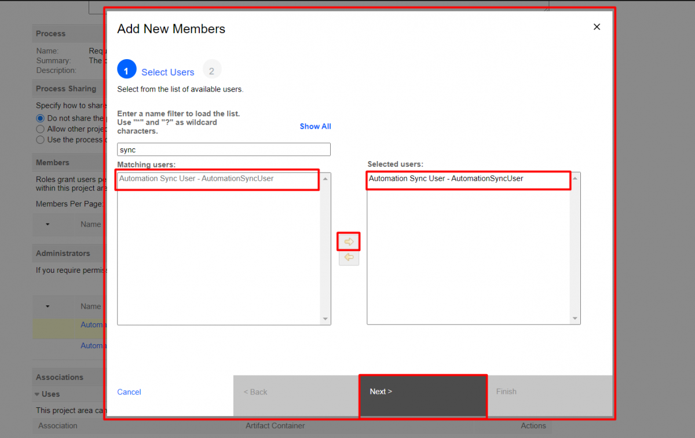
</p>

* Then, a **Select Roles** window will open. Select the role you want to assign to the user from **Available Roles** and click on **Right** arrow as shown in the below image.  

<p align="center">
  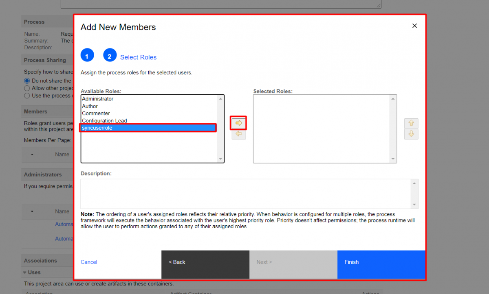
</p>

* The selected role will be added in **Selected Roles** list. Click on **Finish** button.  
<p align="center">
  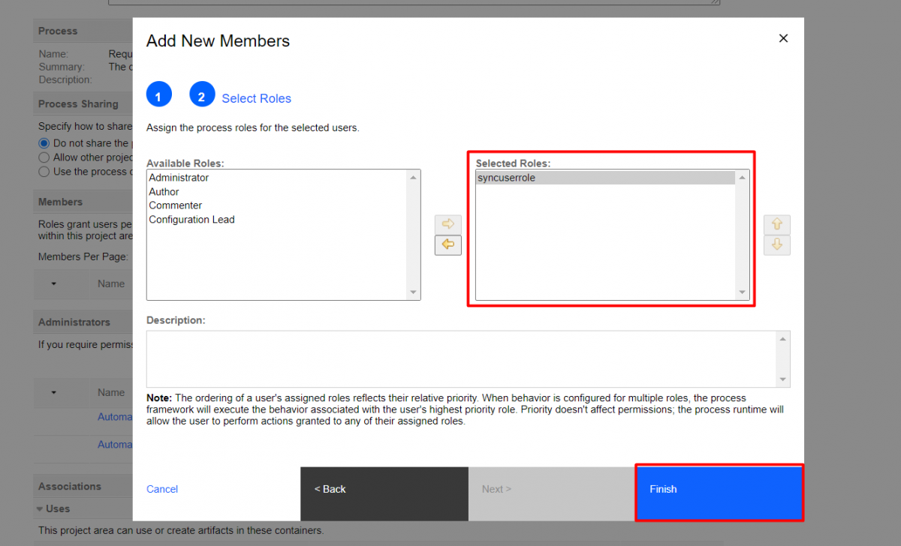
</p>

* The user with the role will be added in the **Members** list.  

<p align="center">
  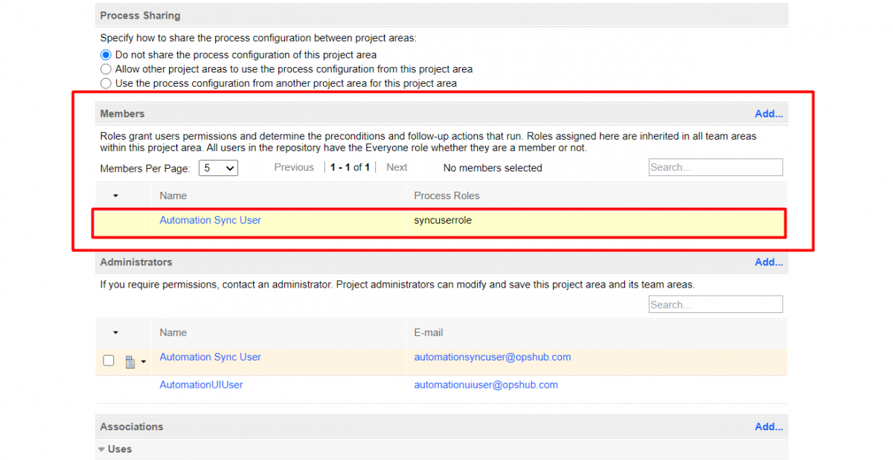
</p>

* Click on **Save** button at the top right corner for saving your changes.  

<p align="center">
  
</p>


## How to give read access to single user

* Select option "Users in access list only" or "Members of the project area hierarchy and users in the access list" under section **Grant read access to** as per your setting for access control. Below steps are the same for any of the option selected.  

<p align="center">
  
</p>

* Under **Users to be Added to the Access List**, there is an option of **Add** in the right panel. Click on **Add**.  

<p align="center">
  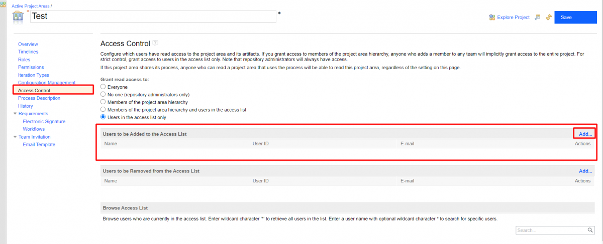
</p>

* Select the sync user to be added. Click **Add** button.  

<p align="center">
  
</p>

* The sync user will be added in list **Users to be Added to the Access List**. Then click **Save**.  

<p align="center">
  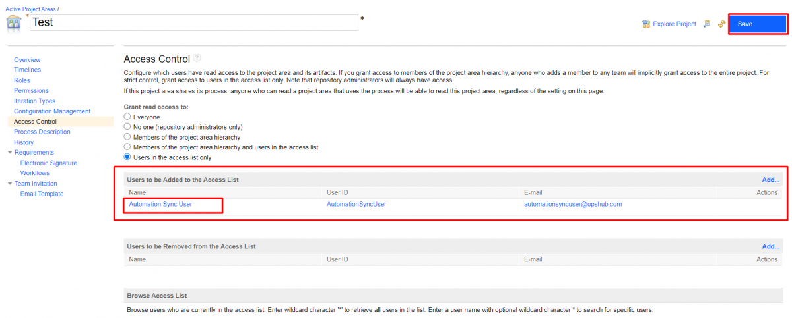
</p>

* The user will be added under **Browse Access List**.  

<p align="center">
  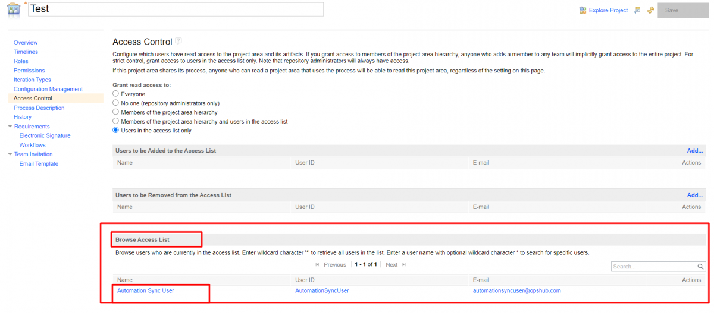
</p>


## Permissions

* In DOORS Next, the permissions can be given to roles, where the specific user can be assigned to one or more roles. Refer to section [Create Role](#how-to-create-a-role--create-role) for steps on creating a role. The role assigned to the user must then be assigned specific permissions.
* Also, such user needs to be added as a member in the project. Refer to section [Add user as Project member with specific role](#how-to-add-user-in-a-project-as-memberhow-to-assign-user-with-specific-role--add-user-as-project-member-with-specific-role).

**Note**: For DOORS Next full guide on role-based permissions, refer to link [Modify Permissions in DOORS Next](https://www.ibm.com/support/knowledgecenter/SSYMRC_6.0.6/com.ibm.jazz.platform.doc/topics/t_mod_permissions_web.html).


### Steps to give Permissions

* Log in to DOORS Next UI with user who is Project Administrator.

* Go to **Manage This Project Area** from **Settings** icon in your project at top-right corner.  
  

* Under **Project Area**, click on **Permissions**. Select option **Show by Role**. Select the role assigned to sync user. All the permissions will be added to this role.  
  
  <p align="center">
  
 </p>

* Select the permission, and click **Allow** to give the specific permissions. A green tick will appear.  
 
 <p align="center">
  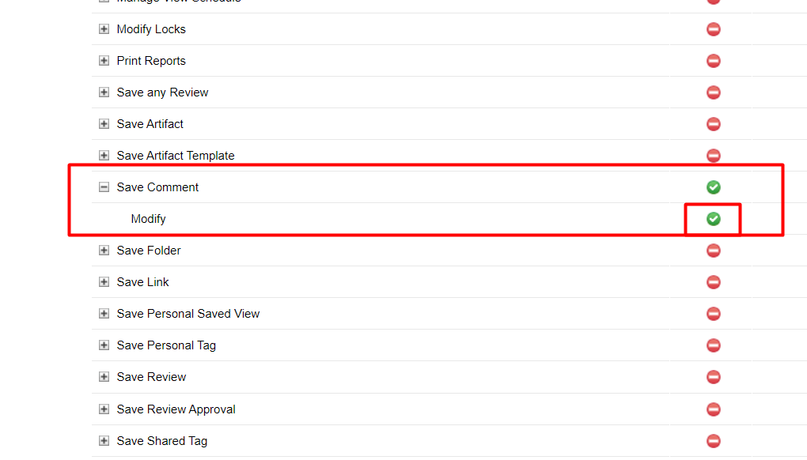
 </p>

  * **Restricting to required Artifact types and Component** – With the above steps, the permissions are given at project-level. In case, you want to restrict it to specific artifact type and/or component wise, you can do that with the help of below steps.  
    > **Note**: Permissions **Save Artifact** and **Save Link** can be restricted to specific artifact type and/or components that are to be synchronized. Permissions **Save comment** and **Save Folder** are not allowed to be restricted to artifact type and/or components. Hence, these permissions must be given at project level.

    * When a specific permission is expanded, different combinations of artifact types and components are shown. The permissions can be enabled for only those artifact types of component which are to be synchronized. Refer to below image for more understanding.  
           <p align="center">
			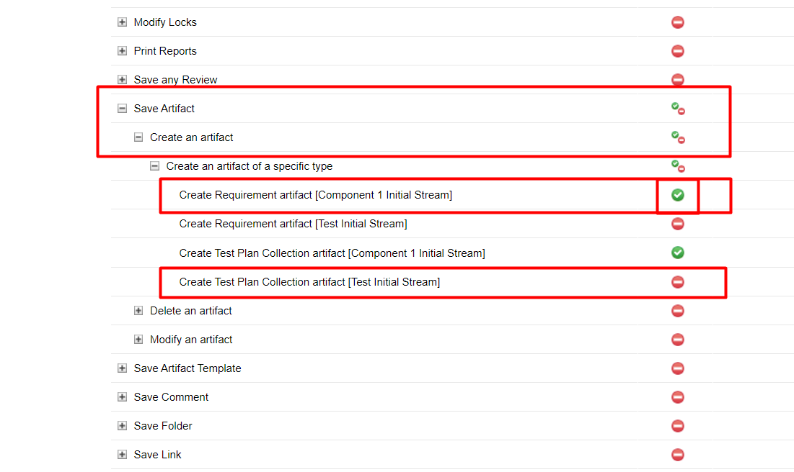
           </p>

* **Restricting to certain time period** – The permissions can be configured for a certain time period. For synchronization, the time period can be set to **Always**. If time period is set to **Iteration Types** or **Timelines**, then the defined timeline must have all the permissions until the synchronization gets completed.

  * Select the **Configure for a time period** option for the sync user's role.  
    
	<p align="center">
     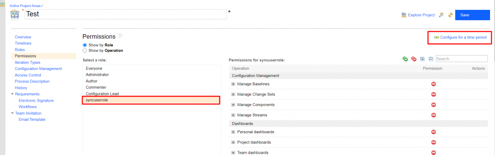
    </p>


  * By default, the time period is set to **Always**. If it is custom, then for the sync user's role, set it to **Always** and click on **Save**.  
    
	<p align="center">
     
   </p>


* Click **Save** button at the top right corner.  
  
  <p align="center">
  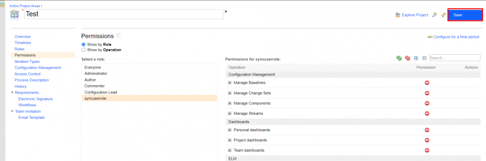
  </p>


## How to Create a Role

* Log in to DOORS Next UI with user who is Project Administrator.
* Go to **Manage This Project Area** from **Settings** icon in your project at top-right corner.  

  <p align="center">
    
  </p>


* Under **Project Area**, click on **Roles**. There will be an icon for **Create Role** above the list of roles. Click on the **Create Role** icon.  
  
  <p align="center">
  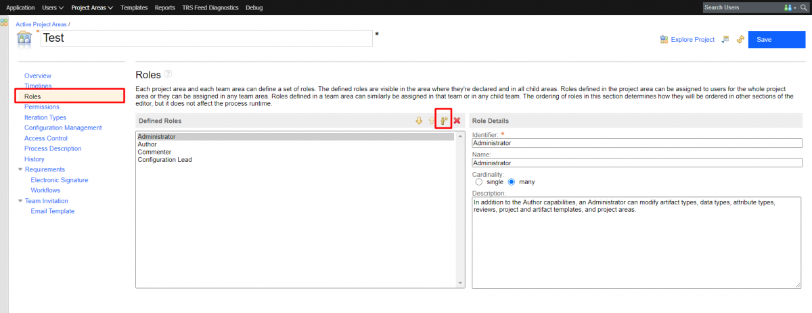
 </p>

* Add the **Role Details**. Add **Identifier**, **Name** and click on **Save** at top-right corner. A new role will be created.  
	
	<p align="center">
	  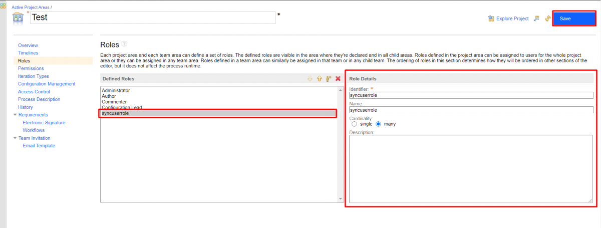
	</p>


# Glossary

* **Stream** – The word **Stream** refers to Projects in terms of OpsHub Integration Manager. For more understanding on streams, refer to document [DOORS Next Streams](https://www.ibm.com/support/knowledgecenter/SSYMRC_6.0.6/com.ibm.jazz.vvc.doc/topics/t_wkspc_crt.html).
* **Changeset** – A change set is a collection of related modifications to artifacts. A change set can be created to group multiple changes. For more understanding, refer to [DOORS Next Change sets](https://www.ibm.com/support/knowledgecenter/SSYMRC_6.0.6/com.ibm.jazz.vvc.doc/topics/t_cset_crt.html).
* **Artifacts** – The word **artifact** is representation of entity in DOORS Next.
  * **Base/Core artifact** – All the artifact(s) in DOORS Next stream which are created in a folder are called base or core artifacts. Those are the artifacts which can be added in a module to create a shared artifact.
  * **Shared/Module artifact**
    * When a base/core artifact is added into module, it creates a replica of artifact in the module. The artifact created in the module is called shared artifact. The identifier of shared artifact and the core artifact is identical. But, their resource id (UUID) are different.
    * A shared artifact is always bounded with a core artifact but a core artifact may or may not have a shared artifact.
    * **Module artifact** – It's an alternate terminology to represent shared artifact.


