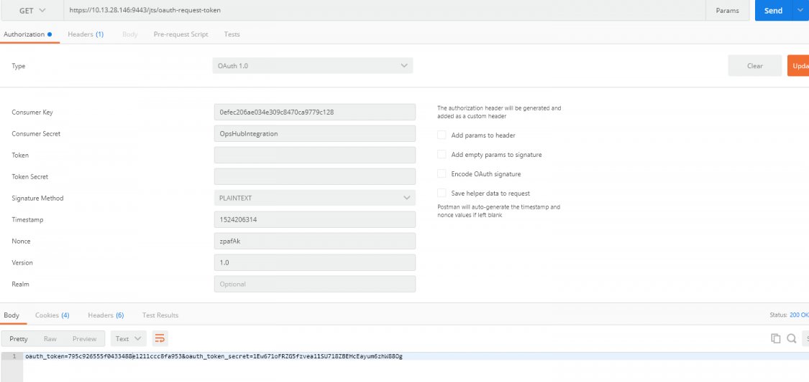
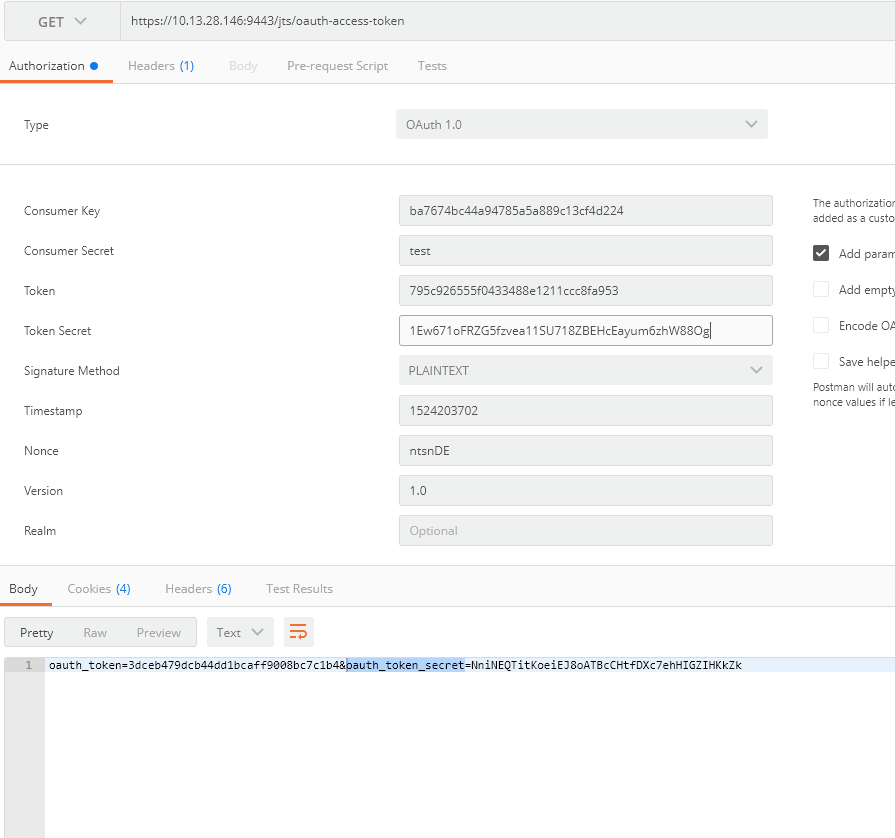

# Overview

*OpsHub Integration Manager supports OAuth-based authentication for IBM Engineering Requirements Management DOORS Next system. OpsHub Integration Manager requires the OAuth token and OAuth token secret.*

*** [Option 1](#generate-token-using-doorsng-token-generator-utility): Use a stand-alone utility bundled with OpsHub Integration Manager to generate the OAuth token.  
*** [Option 2](#generate-token-using-rest-client-postman): Generate an OAuth token using a third-party rest client such as postman.

---

## Generate Token Using DoorsNG Token Generator Utility

*This stand-alone utility automates the OAuth token generation and eases the system configuration in OpsHub Integration Manager for IBM DOORS Next system, supporting OAuth-based authentication.*  
*This utility helps to generate OAuth token and allows the user to push back the generated token back to OpsHub Integration Manager given the push back to OpsHub Integration Manager server option is selected.*

** If push back to OpsHub Integration Manager option is selected and the given IBM DOORS Next system name does not exist in OpsHub Integration Manager, then the utility will create the new system in OpsHub Integration Manager with a given name along with generated token details.  
** If push back to OpsHub Integration Manager option selected and the given IBM DOORS Next system name does exist in OpsHub Integration Manager, then the utility will update the authentication parameter(s) such as consumer key, consumer secret, OAuth token, and OAuth secret against found system in OpsHub Integration Manager.

*This utility can be executed from any machine that has access to the IBM DOORS Next endpoint and OpsHub Integration Manager.*  
**It is required to install python version >=3.7.0 to run this utility.*

*Extract the **DoorsNG_Oauth_Token_Generator.zip** located at `<Installation Directory of OpsHub Integration Manager>/Other_Resources/Resources`.*  
**Execute the command **py token_generator.py** from the command line.*  
**If IBM DOORS Next endpoint is configured with secured connection (HTTPS), then import the SSL certificate to the location `<Extracted Path>/DoorsNG_Oauth_Token_Generator/certificate/doorsnext`.*  
**If OpsHub Integration Manager is configured with secured connection (HTTPS) and push back OAuth token option is selected, then import the SSL certificate to the location `<Extracted Path>/DoorsNG_Oauth_Token_Generator/certificate/opshub`.*  
**Refer README.txt file present inside the extracted zip folder to learn more details about this utility.*

---

## Generate Token Using Rest Client (Postman)

*OAuth token generation is 3 steps once consumer key and consumer secret generated in end system.*

### Get the OAuth Request Token

*Get the OAuth Request Token using the generated **Customer Key** and **Customer Secret** as per the step [Generate Consumer Key](ibm_rational_doors_next_generation#steps_for_oauth_token_generation).*

** Open PostMan or Rest client for sending the request for OAuth Token.  
** Set the Get Method, set the URL as `<DOORS Next URL>/jts/oauth-request-token`, set the Authentication Type as OAuth 1.0.  
** Set **Consumer Key** and **Consumer Secret** in the request.  
** Click *Send*. In the response, OAuth token and OAuth token secret will be generated.*

  

---

### Authorize OAuth Request Token

*Authorize OAuth Token generated in above step.*

** To authorize OAuth Request Token, prepare the request mentioned below and open in the browser. It requires the login with a user who has admin privileges.*  
*** Authorize URL:: `<Server+url>/jts/oauth-authorize?oauth_token=<oauth_token which was generated in previous request>&oauth_consumer_key=<consumer key which was generated in first step>`*  
*** For example: `https://10.13.28.146:9443/jts/oauth-authorize?oauth_token=795c926555f0433488e1211ccc8fa953&oauth_consumer_key=0efec206ae034e309c8470ca9779c128`*

---

### Get final access token

*After authorizing the OAuth Token, send a request to get the final access token.*

** Open PostMan or Rest client for sending the request for OAuth Token.  
** Set the Get Method, set the URL as `<DOORS Next URL>/jts/oauth-access-token`, set the Authentication Type as **OAuth 1.0**. Set the required field for OAuth 1.0 like Customer Key, Customer Key Secret, and provide the OAuth token and OAuth token secret that was generated in step 3.  
** Click *Send* to get final OAuth access token, OAuth token secret for OAuth Authentication.*

  

