# Pre-requisites
## User privileges

*Create one user in Jama that is dedicated to OpsHub Integration Manager. This user should not do any operations from the system's interface.*  
**Please refer to [Add Users](#add-users) section to determine how to create a user in Jama**

* Below are the permissions required for this dedicated user:  
  * For all the supported Jama versions, project **Administration** permission for each project for which the data needs to be synchronized  
  * Additionally, below permissions are required to access User's meta information for specific version(s):  
    * For Jama Cloud version 8.61:  
      * Users **Administration** permission at the organization level to access user's meta information.  
    * For Jama Cloud versions earlier than 8.61 and/or a self-hosted version earlier than 8.62:  
      *  **Read Access** permission at the organization level to access user's meta information.

> **Note**: The behavior of the Rest API(s) was changed from Jama Cloud version 8.61 and self-hosted version 8.62. Hence, there are specific additional permissions required for older versions as mentioned above to access User's meta information.

* Refer to [Grant Project Permissions](https://help.jamasoftware.com/ah/en/administration/project-administrator/view-project-users/grant-project-permissions.html) for details on how to grant project permissions.  
* To validate the permission of the user being used in the OpsHub Integration Manager, please refer to [Access Permission of Jama users](#access-permission-of-jama-users) section.  
* Jama allows granting permissions to user on specific projects and within this projects also, user can limit the access at Component and Set level (user can revoke permissions for specific Component and Set).  
  * In such cases, only the Entities/Component/Set/Folder will be synchronized for which the sync user has access to.

# System Configuration

Before you continue to the integration, you must first configure Jama.

Click [System Configuration](../integrate/system-configuration.md) to learn the step-by-step process to configure a system.

Refer the screenshot given below for reference.

<p align="center">
  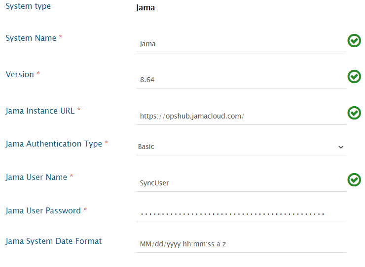
</p>

| **Field Name**          | **When field is visible on the System form** | **Description** |
|-------------------------|----------------------------------------------|-----------------|
| **System Name**         | Always                                       | Provide Jama System Name |
| **Version**             | Always                                       | Provide the version for the Jama system. The version can be determined from the Jama login screen. |
| **Jama Instance URL**   | Always                                       | Set Jama Instance URL to the URL of your Jama instance.<br>Format: https://<instance name>.jamacloud.com |
| **Jama Authentication Type** | Always                               | Select Jama Authentication Type as per your requirement. There are two options to choose from: Basic Authentication and OAuth Authentication. OAuth authentication is only available for Jama Cloud instance. |
| **Jama User Name**      | Authentication type is Basic Authentication | Enter Username. User must have administrator privileges in Project. |
| **Jama User Password**  | Authentication type is Basic Authentication | Enter password of the user added above. |
| **Jama Client Id**      | Authentication type is OAuth Authentication  | Enter Client id of the user. |
| **Jama Client Secret**  | Authentication type is OAuth Authentication  | Enter Client secret of the user added above. |
| **Jama System Date Format** | Always                                  | Add the date format from 'Java Date Time Format' field in the System Properties > General Properties area tab in Root admin panel of Jama. Default value is MM/dd/yyyy hh:mm:ss a z". For more details, refer section [Setting up Date format field for System configuration](#setting-up-date-format-field-for-system-configuration) |

If the system is deployed on HTTPS and a self-signed certificate is used, then you will have to import the SSL Certificate to be able to access the system from OpsHub Integration Manager. Click [Import SSL Certificates](../getting-started/ssl-certificate-configuration.md) to learn how to import SSL certificate.

> **Note**: If you select OAuth for Jama Authentication Type, then you need to provide values for Jama Client Id and Jama Client Secret. Refer the steps in OAuth section of document **Setting up OAuth Credentials in Jama** [here](https://dev.jamasoftware.com/rest#auth) for generating Client Id and Client Secret for OAuth authentication.

# Mapping Configuration

Map the fields between Jama and the other system to be integrated to ensure that the data between both the systems synchronizes correctly.

Click [Mapping Configuration](../integrate/mapping-configuration.md) to learn the step-by-step process to configure mapping between the systems.

<p align="center">
  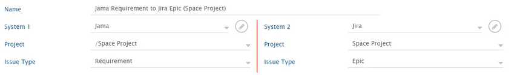
</p>

## Common Fields

### Location/Location Path/Location Related Fields Configuration

* We can use **Location** or **Location Path** fields to define which Set/Component/Folder the entity should go. Location field internally works on location ID, whereas Location Path internally works on location full path name. If the specified path is not found, an error is displayed, and field mapping must be updated.
* By default, **Location** and **Location Path** fields cannot be mapped together.
* For Non-Component, Non-Set and Non-Folder entities:
  * In addition to these **Location** and **Location Path** fields, **Location Related Fields** i.e. **Component**, **Set** and **Folder** fields can be mapped  
  * These can, with/without **Location** and **Location Path** fields, combined to create a valid path for the Jama entity  
  * These three are relative fields, i.e. prior to the additional path, it will construct its relative path  
  * Precedence will be given to the **Location**/**Location Path** fields, followed by **Component**, then **Set**, and lastly the **Folder** field.  
  * Example:
    * **Location Path**: /Component1, **Set**: /Set1, **Folder**: /Folder1/Folder2 → **Final Entity Location**: /Component1/Set1/Folder1/Folder2  
    * **Location Path**: /Component1, **Component**: /Component2, **Set**: /Set1, **Folder**: /Folder1 → **Final Entity Location**: /Component1/Component2/Set1/Folder1  
    * **Set**: /Set1 → **Final Entity Location**: /Set1  
    * **Component**: /Component1, **Set**: /Set1 → **Final Entity Location**: /Component1/Set1  
  * Few examples which will result into errors:
    * **Location Path**: /Component1/Set1/Folder1, **Set**: /Set1, **Folder**: /Folder2 → **Error Cause**: Set1 cannot be found/created under a folder in Jama hierarchy.  
    * **Component**: /Component1, **Folder**: /Folder1 → **Error Cause**: Folder1 cannot be found/created directly under a component in Jama hierarchy.  
  * Additionally, data expected from such fields would also be relative, just as expected data for them is relative  
  * Check and Create Functionality for Location Related Fields:
    * Behavior during create/update:
      * If the provided Component/Set/Folder exists, entity will be added under final entity location  
      * If the provided Component/Set/Folder does not exist:
        * If checkAndCreate is enabled, the component/set/folder will be checked and created and entity will be added under the final entity location  
        * If checkAndCreate is disabled, Processing failure will be observed with error code `[[OH-Jama-0102]]`
    * By default, checkAndCreate will be disabled, to enable the same advance mapping will be required.

        ```xml
        <OH_Set checkAndCreate="true">
          <xsl:value-of select="SourceXML/updatedFields/Property/Custom-space-text"></xsl:value-of>
        </OH_Set>
        ```
> **Note** : If for any of these Location Related fields or Location or Location Path, any change is detected from source system, for Jama as the target system, the whole relative will always be reconstructed from all these fields together.

#### Entity type wise specific configuration

* **Component and Set**  
  * Neither **Location** nor **Location Path** is mandatory.  
  * If either of them is mapped, then the Component or Set will be created under the specified location.  
  * If it's not mapped, then the Component or Set will be created under project.
* **Folder**  
  * Either of **Location** or **Location Path** should be mapped else it will result into error.  
  * **Location** field is by default a mandatory field but if you are mapping **Location Path**, you can ignore the warnings for **Location** field that you get while saving the mapping which states that mandatory fields are not mapped.
* **Other entity types**  
  * Either **Location** or **Location Path** or a combination of **Component**, **Set** and **Folder** with/without **Location Path**/**Location** should be mapped such that a valid path can be created from these fields, else it will result into error.  
  * **Location** field is, by default, mandatory. Still, if you are mapping **Location Path** or a combination of **Component**, **Set** and **Folder** fields with/without **Location Path**, in that case, you can ignore the warnings for the **Location** field you get while saving the mapping, which states that mandatory fields are not mapped.

#### Lookup configuration
* **Location field:**  
  * It internally works on Set/Component/Folder location id.  
  * The advantage of using **Location** field in the field mapping is that there is no further requirement of changing mapping when location name of Set/Component/Folder changes.  
  * For mapping **Location field values**, map the **Location** field.  
  * Here **Location field** is of type 'hierarchy', which means it will load all the projects.  
  * Click the project name for expanding it. It will show all the locations in the project.  
  * Now, you can select the location values for the value mapping.

<p align="center">
  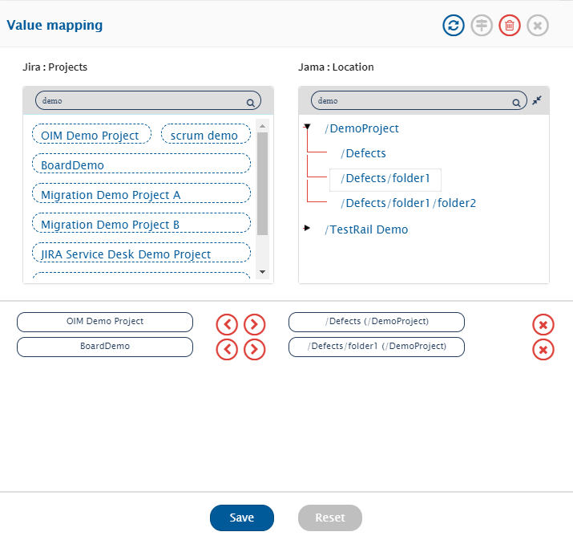 
</p>

> **Note** :The values mapped for location will be project specific. For example, in the image shown above, the location '/Defect' is selected only for '/DemoProject' project.

* **Location Path field:**  
  * It internally works on Set/Component/Folder location path full name. This is specifically added for multiple projects using same field mapping. In this case, the location path mapped will be looked up in the target project and location id will be selected considering:  
    a) the project and  
    b) the location path mapped.  
    If two paths have the same name, then the first one will be considered, and entity will be added at that location.  
  * The disadvantage for using **Location Path field** in field mapping is that mapping will be impacted by the change in the name of any Set/Component/Folder that is part of the location path.

* **Lock State Field**  
  * To denote the status of lock on the item, **OH Lock Status** field is introduced in **OpsHub Integration Manager**.  
  * This field can be used when a user wants to acquire or release the lock on item based on certain conditions, when Jama is configured at the target side in integration.  
    * Set the value to **Locked** to acquire the lock on the synced target item.  
    * Set the value to **Unlocked** to release the lock on the synced target item.  
    * Set the **No Change** value to avoid any modification on item's lock.  
  * If **OH Lock Status** field is mapped at the source side, it will give empty value.

## Set entity type Fields

### Child Item Type field configuration

- For **Set** entity, there is a need to specify the child item types that it can contain.  
- This is a mandatory lookup field.  
- The lookup shows all the entity types for which a set can be created.  
- This field is only supported during **Create**. If any update comes on this field, then the update will fail with error [OH-Jama-0103]. This is due to the fact that Jama itself doesn't support this operation through their REST API.

### Set Key field configuration

- For **Set** entity, we can define set key which uniquely identifies same type of sets.  
- This is a system field and can be set mandatory/non-mandatory in end system.  
- This field must be mapped in OpsHub Integration Manager for integration to synchronize the sets.  
- Jama doesn't provide any revision when Set Key is updated. Due to this, the field in OpsHub Integration Manager also works on current state.  
- Refer to section [Set Key field update](#when-set-integration-is-configured-and-field-set-key-is-updated) for behavior on synchronization when set key field is updated.

## Relationship configuration

In Jama, each entity has a specific location. The location of the entity can be configured using **Location/Location Path/Location Related Fields** or using Parent link. Refer to section [Relationship configuration along with field Location/Location Path/Location Related Fields](#relationship-configuration-along-with-field-locationlocation-pathlocation-related-fields) for behaviors in synchronization.

## Transition/Workflow associated field configuration

- **Transition field** is a look-up type field in Jama that can be configured with transition/workflow such as 'Status'. If we are mapping such a field, then we must provide the same field name during advance configuration [Override parameters for write operations].

<p align="center">
  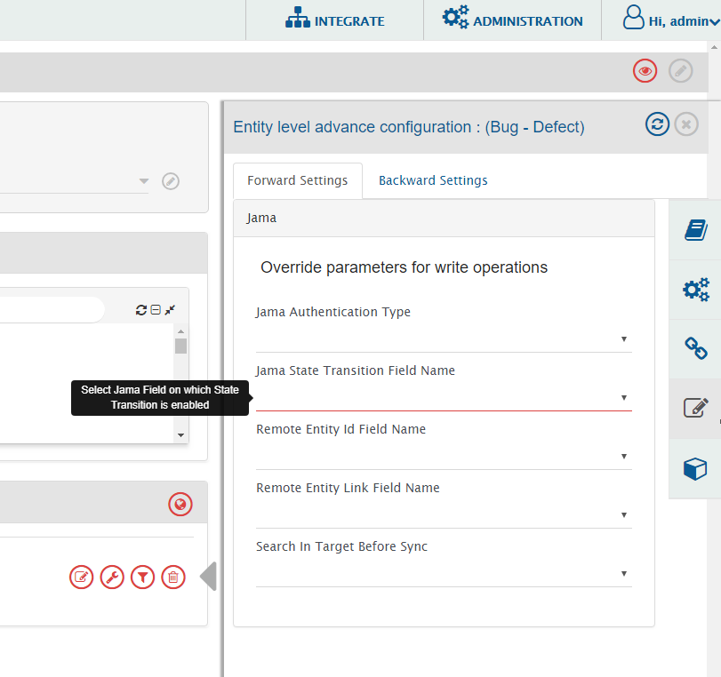
</p>

## Attachment Configuration

Due to Jama Api limitation, for Attachments to sync properly Read-Only check should be enabled. Configuration should be as shown below.

<p align="center">
  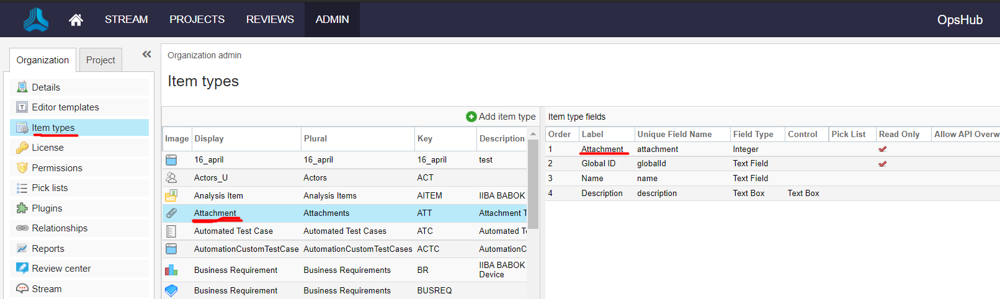
</p>

*When your attachment item type is set to Read Only, you can still add attachments manually through the rich text editor.*
- Open any item's description and select the folder icon in the rich text editor  
- This opens a file browser. At the bottom of this window click the Choose file button, select your attachment, and click Upload  
- The attachment now lives in your project's attachment list and can be called from anywhere in the project.

## Mapping for Soft Delete Configuration

- When Jama is the target system, the Soft delete operation is performed by default in the synchronization of the [Source Delete event](../integrate/source-delete-synchronization.md).  
- After the Soft Delete operation is performed by OpsHub Integration Manager in Jama, the entity will be deleted in Jama. The deleted entity can be found in the "dashboard" of the corresponding project.  
- To only enable the logical delete operation in the target, "OH Soft Delete" field shall be mapped with the default value "No" in the [Delete Mode](../integrate/mapping-configuration.md#delete-mode) mapping.

## Rank

- Jama allows to organize the items in tree structure. To synchronize the items maintaining the tree structure, below configurations need to be performed in OpsHub Integration Manager.  
  - Configure the **Children** and **Parent** relationship as per the standard [relationship configuration](../integrate/mapping-configuration.md#relationships).  
  - Enable the rank synchronization, as described in [Rank configuration](../integrate/mapping-configuration.md#configuration) section.  
    - Here make sure, the overwrite option is enabled for the Jama system for OH ENABLE RANK field.

**Known Limitations:**  
- When Jama is configured as the source system in OpsHub Integration Manager:
  - When rank change is performed on item within same parent item, any field needs to be updated after changing the rank of the item.
    - Reason: When rank is changed for any item within the same parent, neither its **Updated** time is changed nor revision gets generated in jama.

# Integration Configuration

Set a time to synchronize data between Jama and the other system to be integrated. Also, define parameters and conditions, if any, for integration.  
Click [Integration Configuration](../integrate/integration-configuration.md) to learn the step-by-step process to configure integration between two systems.  

<p align="center">
  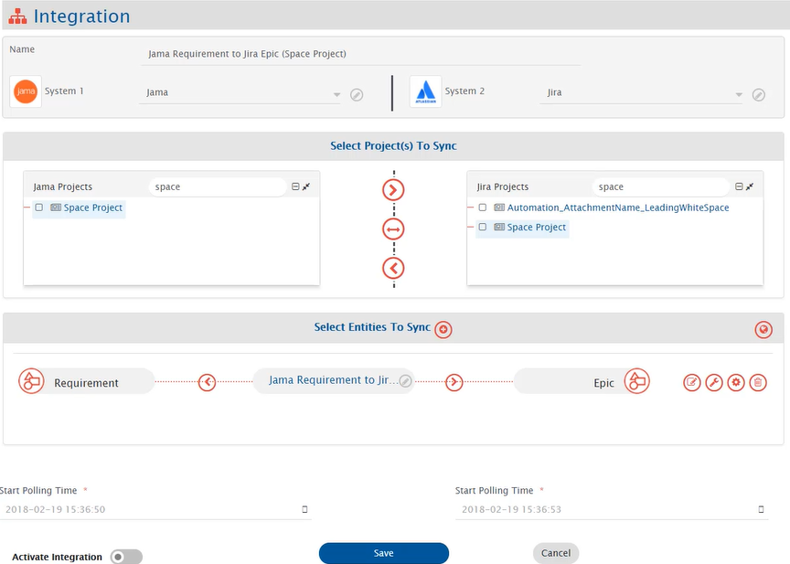
</p>

## Add comment interval

- In case the number of comments to be synced to Jama is high or there is an issue with the ordering of comments in Jama; you can define an interval (in milliseconds) to be added between addition of two comments in Jama(Target).  
- To add this interval, please navigate to 'Override parameters for write operations(Destination)' in Entity level advance configuration.  
- As shown in below image, please specify the interval (in milliseconds) in the field 'Jama add comment interval'. The maximum acceptable value for this field is 2000 (milliseconds).

<p align="center">
  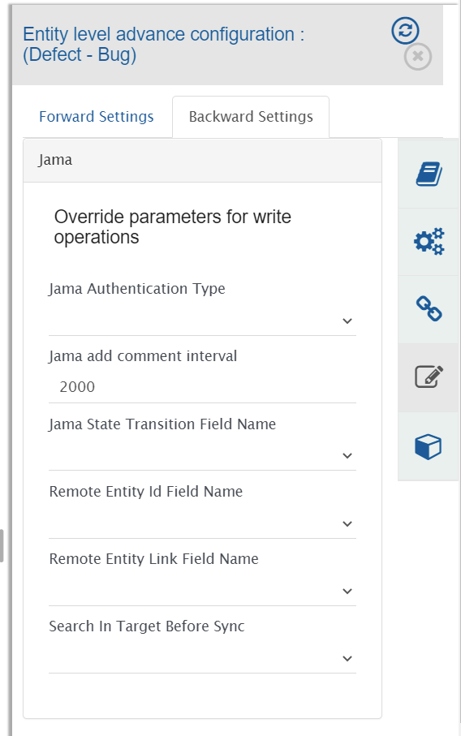
</p>

- The default value for this field is 0 milliseconds.  
- In case you specify this interval in 'Jama add comment interval' field, it will be added only when there are multiple comments to be added to Jama and the time difference (in milliseconds) between the last comment added and the current comment is less than the interval specified in the field. For single comment, this interval won't be added.  
- Please use this field only when necessary as it impacts the overall performance.

# Criteria Configuration

If you want to specify conditions for synchronizing an entity between Jama and the other system to be integrated, you can use the Criteria Configuration feature.

Go to Criteria Configuration section on [Integration Configuration](../integrate/integration-configuration.md) page to learn in detail about Criteria Configuration.

However, you don't need to write any criteria query in OpsHub Integration Manager. Instead, you need to give the filter id for the same.  
The steps given below explain how to make filter in Jama for enabling criteria.

## Create Filter in Jama for enabling criteria

Criteria can be enabled by applying a filter in Jama and passing the filter id in the Query field.  
Follow the steps given below to create the filter in Jama:
- Open Projects panel in Jama.
- Select the project for which you want to configure criteria.
- Select Filters.
- Click **Add Filter**.
- Select **current project** in the option to **Select a project** instead of selecting the actual project name.  
  - For fields, **Location, Planned Release or Release**, select **actual project name** in **Select a project** option. Filters created on **Location, Planned Release or Release** will not work for multi-project integration. Hence, a separate integration configuration should be created for each project you want to synchronize.
- Create the filter in accordance with criteria storage type.  
  - For fields, **Location, Planned Release or Release**, creating a filter is not dependent on criteria storage type.  

> **Note**: Select the **Last Activity Date** and **Descending** option in **Sort order for results by** field for filter with any criteria storage type.

### Filter for Component/Set/Folder

For Component/Set/Folder entities, we can't have specific check for entity types in filter such that only those type of entities are fetched.  
Following needs to be done to configure filter for these entity types:
- Select **All Item Types** in the option **Match** so that Component/Set/Folder can be filtered out. This will filter out all the entities which matches the rules provided.
- One extra set of rule needs to be added to filter out only Components, Folders or Sets.
  - For Component - ID contains word **-CMP-**
  - For Set - ID contains word **-SET-**
  - For Folder - ID contains word **-FLD-**

<p align="center">
  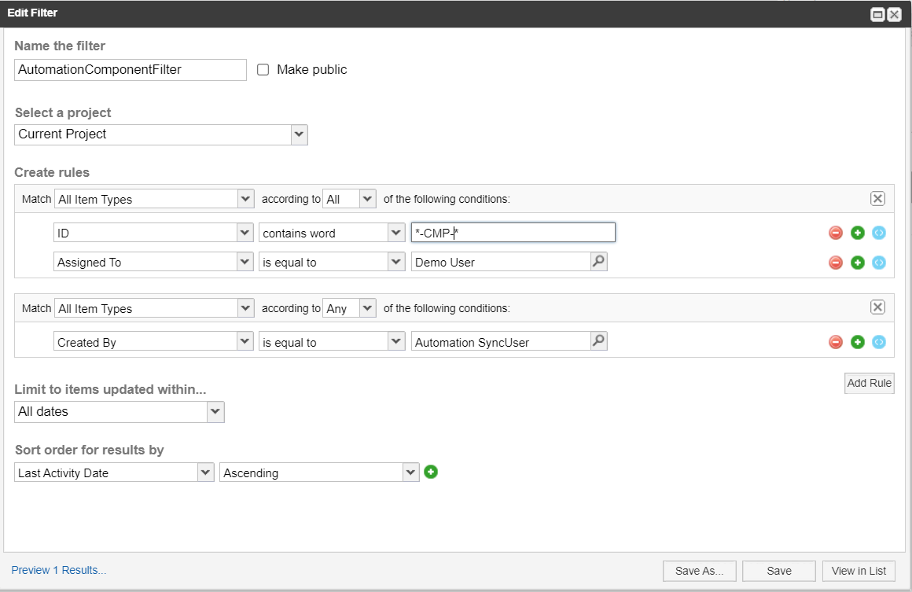
</p>

### Criteria Storage Type

Set Select Criteria Storage Type according to the Integration Requirement. Criteria can be stored in the Database or in the End system.
a) When criteria storage type is Database:
Fill in the details for criteria query as shown in the image given below: 

<p align="center">
  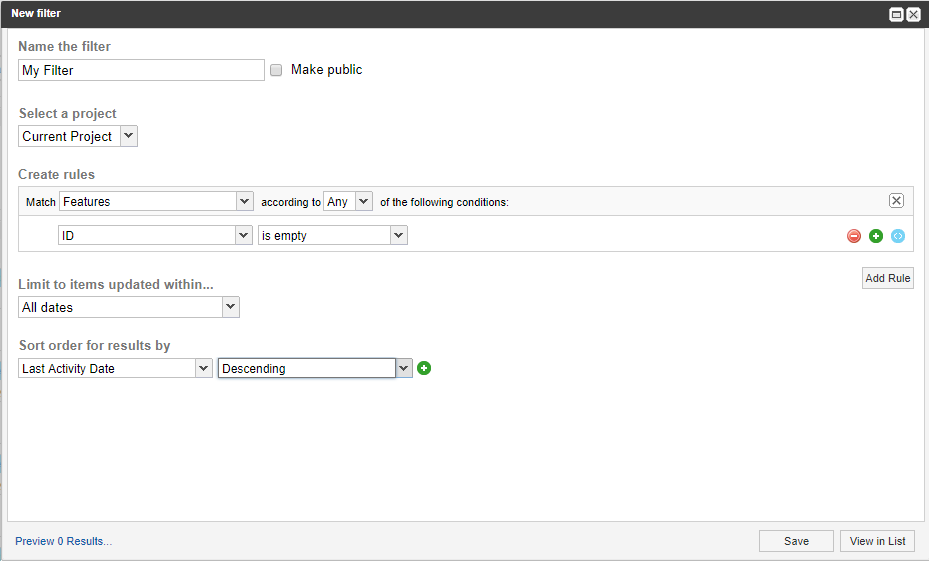
</p>

b) When criteria storage type is End System:

Fill in the details for criteria query as shown in the image below.

Refer [Create Custom Field](#connector-specific-field-custom-field-configuration) for creating a custom field.

<p align="center">
  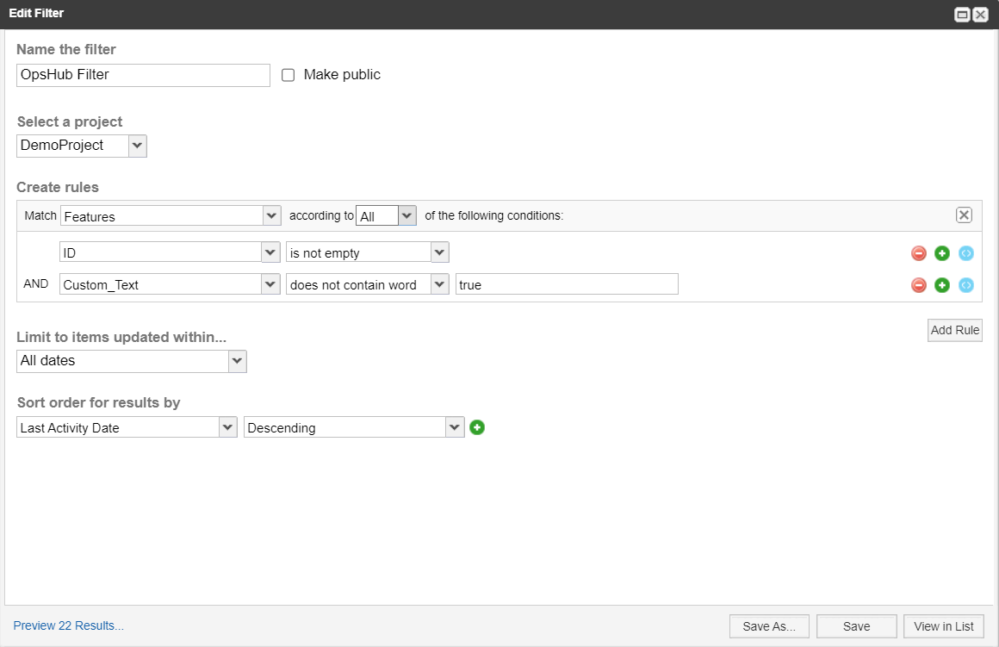
</p>

> **Note**: Make sure you are using the same custom field in filter that is used in "Select where criteria info is to be stored" during advance integration configuration.

Click **Save** to save the filter.

**After creating filter, get the filter id from the URL by clicking created.** For example, if the URL is  
`https://opshub.jamacloud.com/perspective.req#/filters/26?projectId=45`, then the filter id is **26**.

**Now put this filter id in Query field under "Criteria Configuration" as shown in the image given below:**

<p align="center">
  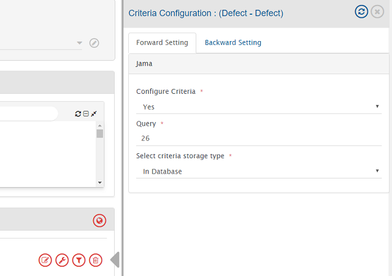
</p>

## Target Search Query

Provide query in Target Search Query such that it is possible to search the entity in the Jama as destination system.

**Syntax:**  
`"[Target Field]:@[Source-Field-Name]@"`

**Sample queries:**

- `Custom_Text:"@oh_internal_id@"`
- `"[Target Field]:$value"`: If the user needs to check for 'contains' in target search query. For example, "ID:100", if there are values such as 100, 1001, 1002 etc. then all three results will come up as all of them contain value 100.
- `"[Target Field]:"$value""`: If the user needs to check for 'equals' in target search query. For example, "ID:"100"" then it will result in only 1 which has ID equals 100.  

> Note: In case target field is a text type of field, then the 'value part' in a query must be enclosed in double quotes.

### Multi-field target lookup query

If the user needs to query on multiple fields, the user can provide multiple field values separated by commas.  
Jama query is based on **OR** condition when there are more than one field.

**Syntax for multiple fields:**  
`"[Target Field1]:@[Source-Field-Name1]@", "[Target Field2]:@[Source-Field-Name2]@"`

**Sample query:**  
`"Custom_Text:@oh_internal_id@","Priority:@priority@"`

> **Note**: Target Search Query is not case sensitive. If there are multiple values having difference in only cases, then it will pick the first entity based on the input provided (in case the user has enabled the option "Continue with the first entity found")

**The above mentioned target search query works for all the entities except the Test Group entity. For Test Group entity, refer to the below section.**

---

### Target Lookup Query syntax for Test Group entity

**Syntax:**

- `"id:testPlanId-testGroupId"` — The prefix 'id' indicates lookup using Test Group id. The delimiter `-` separates Test Plan id and Test Group id. The Test Group id can be fetched via Swagger API. Refer [JAMA REST API](https://rest.jamasoftware.com) for more details.

- `"name:testPlanId-testGroupName"` — The prefix 'name' indicates lookup using Test Group name (case sensitive). The delimiter `-` separates Test Plan id and Test Group name.

**Sample queries:**

- `"id:12345-67890"` where 12345 is Test Plan id and 67890 is Test Group id  
- `"name:12345-default test group"` where 12345 is Test Plan id and 'default test group' is Test Group name

> **Note**: The above mentioned syntax can also be referred for **default link configuration in relationships mapping** for Test Group entity.
> **Note**: The above mentioned syntax is **case sensitive.**

---

# Known Limitations

## Common

- Rich text fields are non-history based fields as their history is not provided by Jama API itself. This means that the fields will always work in the current state.
- Jama end-system supports user mention for comments only.
- The user who is inactive or removed from the project will not be synced to the target system. If you want to sync the removed user, the organization-level permission is required by the integration user. A default user can also be set in the advanced mapping for user field.
- Due to API limitation, the TAGS field is supported in the current state mode for now.
- Update operation is not supported for Jama TestRuns due to unavailability of update API.
- Due to API limitation, Association relationship with the change request is not supported.
- When Jama is the source system:
  - Synchronization of Status field is set to Current State.
- When Jama is the target system:
  - If the attachment file name contains **Windows invalid file name characters** (`<`, `>`, `:`, `"`, `/`, `\\`, `|`, `?`, `*`), then the file will not be added in Jama. Consequently, the user will encounter a processing failure. To avoid this processing failure, it is recommended to follow file naming conventions as mentioned in [Microsoft File Naming Conventions](https://docs.microsoft.com/en-us/windows/win32/fileio/naming-a-file#naming-conventions).  
  Additionally, if the user still wants to synchronize attachments having Windows invalid file name characters, then the user needs to refer to [OH-Jama-0038](../help-center/troubleshooting/errors/jama/oh-jama-0038.md).
  - If conflict detection is enabled on the TAGS field with manual conflict resolution strategy, then in the event of recovery, OpsHub Integration Manager will give a failure. To resolve this failure, conflict resolution strategy should be either of "Endpoint 1 Wins", "Endpoint 2 Wins" or "Custom Strategy".
  - Recovery is not guaranteed for Status field. 
  
 ## Entity Specific

#### Component/Set/Folder

- Jama doesn't have workflow transitions for Component/Set/Folder. Hence, status transition is not supported for these entities.
- Criteria is supported on only system fields in Jama.

### Test Run

- Fields cannot be updated [except Run Result and Status].  
  **Reason:** Unavailability of the Update API.
- When Test Steps are not present in the Test Run, then the Status field can be updated by OpsHub Integration Manager. Otherwise Status field is set according to the status of the steps present.  
  **Reason:** Jama API allows updating of Status field only, when Steps are not present.

---

# Known Behaviors

## Common Behaviours

- It is advisable to have unique display name for each field in Jama.  
  **Reason:** Jama API does not provide way to differentiate changes between fields which share same display name.

- Once the integration is set up for Jama system, it is not advisable to change the **Type Key of Item types**.  
  **Reason:** This may lead to unexpected synchronization behaviour.

- When Jama is the target system:
  - Tags in Jama are case insensitive (Tags "tag1" and "TAG1" are same). If the source system supports case sensitive tags (Tags "tag1" and "TAG1" are different), then the behavior of the TAGS field in different scenarios will be as follows:
    - If from the source system, an entity with a tag having similar name to a tag existing on the Jama project configured in integration but, in different case needs to be synchronized, then the entity will be synchronized with the tag that is already existing on the project.  
      Consider the below mentioned examples:
      - If an entity in the source system having tags named "tag1" and "TAG1" is synchronized, then only one of the tags will be synchronized to the target entity.
      - If in the Jama project configured in integration, a tag named "tag1" already exists, and from the source system an entity with a tag named "TAG1" needs to be synchronized, then the entity will be synchronized with the tag as "tag1".
      - In continuation with the above mentioned point, if "TAG1" is removed from the entity in the source system, then after synchronization, "tag1" present on the entity in Jama will not be removed.
    - If conflict detection is enabled on the TAGS field, then incorrect conflicts will be detected for tags with different case.

  - When working with **Location Related fields**, it is suggested that conflict strategy should not be target wins since a mismatch of these fields is highly likely due to relative behaviour.

- When Jama is the Source system:
  - For Cross Project relationship, if the integration user doesn't have the read permission on the project of the linked entity, the synchronization of that particular link will be skipped.

- When Jama is Source system and integration is configured with Default settings [Sync Only Current State = Select/No](../integrate/integration-configuration.md#sync-only-current-state):
  - From Jama, the revisions information comes as a string which generally follows a predefined format. OpsHub Integration Manager is internally parsing the revisions string to extract the relevant old and new values for each field from this revision string.
  - Hence the revision string is expected to have none of the below tokens in the value of any Text Type of fields, they should just come as separators:
    - [", "], ["\n"], [" changed from "], [" to "]
  - If the following tokens appear as value in any text type fields, then:
    - [", "] - This revision will be skipped from processing
    - ["\n"] - This revision will be skipped from processing
    - [" changed from "] - No impact on revision processing
    - [" to "] - If this token comes in the new value, no impact. But if it appears in the old value, then synchronization of the value may be incorrect.

> **Note**: In case, chances of such tokens is possible in your case, you can choose to have either [Only Current State = Yes configuration](../integrate/integration-configuration.md#sync-only-current-state) or [Overwrite=True](mapping_configuration.md#overwrite) in Field mapping for these fields. Otherwise the revisions and fields details will be synchronized properly when the fields are updated in a revision having the expected format.

---

## Relationship configuration along with field Location/Location Path/Location Related Fields

### Component and Set entities

- **Configuration options:**
  - Field: Location or Location Path (not mandatory)
  - Relationship: Parent Link

- **Behavior during create:**
  - If field is mapped, then Component or Set will be created inside the location coming in field.
  - If field is not mapped, then Component or Set will be created inside project.
  - After create, the Component or Set will be moved to the parent coming from the link configuration.

### Folder entity

- **Configuration options:**
  - Field: Location or Location Path (mandatory)
  - Link: Parent link

- **Behavior during create:**
  - If location is found in both field and link, the folder will be created inside the location coming from link configuration.
  - If location is not found in any, then error is thrown [OH-Jama-0100].

### For other entities

- **Configuration options:**
  - Field: Location or Location Path (mandatory) and Location Related Fields
  - Link: Parent Link

- **Behavior during create:**
  - Entity will always be created under the Aggregated location, i.e. created from Location/Location Path field in addition to Location Related Fields if configured or from Location Related Fields.
  - After create, the entity will be moved under the parent coming from the link configuration.

---

### When Set integration is configured and field Set Key is updated

- Set Key needs to be mapped for Set integration to work. The set key can be updated in Jama.  
  Please refer to [link](https://help.jamasoftware.com/ah/en/administration/organization-administrator/manage-process/item-types/change-a-set-key.html) for more details on Set Key update options and behaviors

- When Jama is Source system and Set Key is updated with option **Regenerate Item IDs**
  - The display id of Jama entity contained in the set gets updated without any revision added to the entity.
  - This impacts **Remote Entity Id** of the Jama entity synchronized in the target system. The remote entity id will get updated in the target system when any update happens on the entity.

- When Jama is Target system and an update comes on **Set Key** field
  - The set key will be updated for the set.
  - Any new entity created inside the set will be created with the new set key.
  - There will be no impact on the existing entities in target.

---

## Attachment Behaviour

- In Jama, referred images/attachments (attachments added to comments or rich-text fields) are not listed under the attachment view for the entity.
  - Referred attachments are maintained at the pool level of the system and attachments are maintained at the entity level in Jama.

- Due to the behaviour mentioned above, when the attachments synchronize to any target system from Jama, both attachments and referred attachments may be displayed under the attachment view depending on the target system's behaviour.
  - Such behaviour is observed during synchronization of Jama to Jira (as target) system combinations.

---

## Entity Scope Movement Behaviour

- Jama will automatically move the child entities associated with that **Component** or **Set**, which is moved to the new project by OpsHub Integration Manager, regardless of whether those child entities are configured within OpsHub Integration Manager.

---

# Appendix

## Add users

- Login to Jama with the Admin User;
- Go to Admin window and select "Users" in the Organization tab;
- Click on **Add User** as shown below:

<p align="center">
  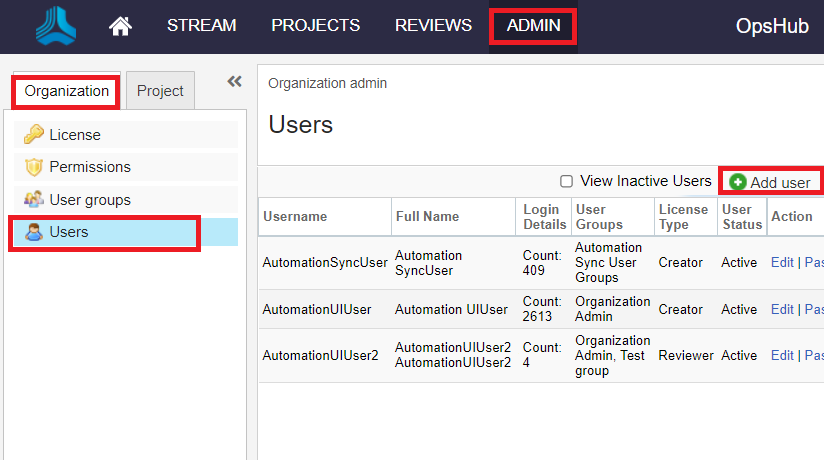
</p>

- It will open a new window as follows:

<p align="center">
  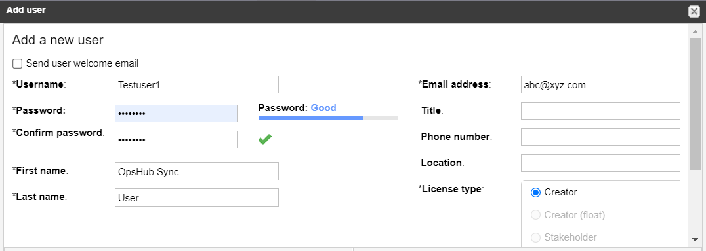
</p>

::Please enter appropriate details in this window and save it.

> **Note**: If the first name/last name details are empty, then revisions/history/user value might be lost during the synchronization.  
For proper synchronization, it is important to fill all the mandatory details while adding the user information in the system.

---

## Access Permission of Jama users

- Login to Jama with the Admin User;
- Go to Admin window;
To provide the permissions at the project level:

- Select the project to be integrated from the **Project** tab;
- Select **Project Permissions**;
- Select **Add Permissions** in the **Access Rights for Project** as shown below:

<p align="center">
  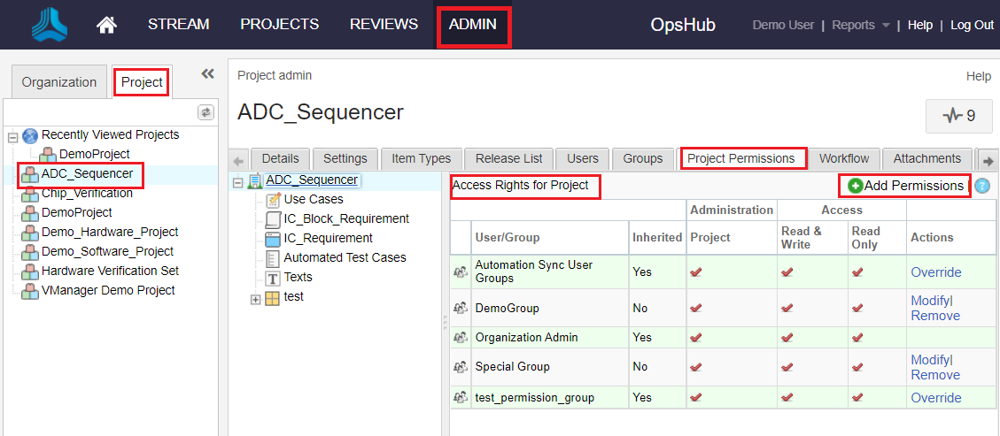
</p>

- Select the user to be mentioned in OpsHub Integration Manager from "Users";
- Select **Project Administration** from the "Permission" and save it as shown below:

<p align="center">
  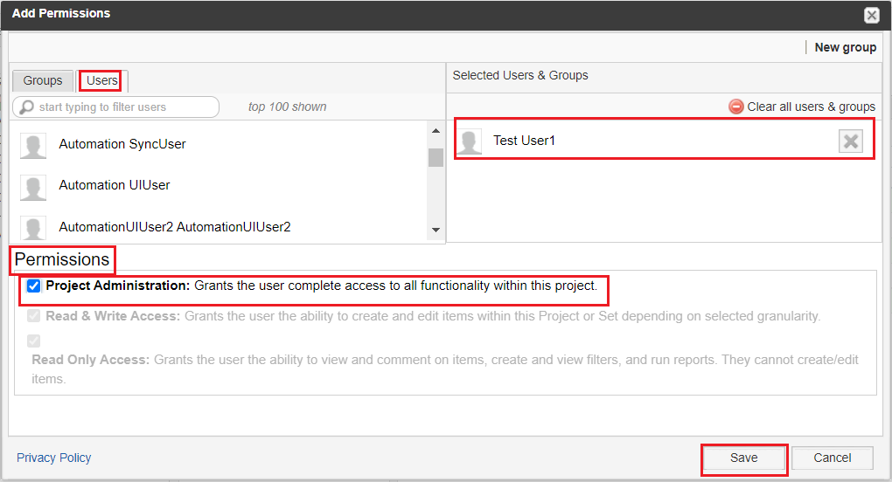
</p>

To provide the permissions at the organization level:

- Select **Permissions** in the Organization tab;
- Select **Add Permissions** in the **Access Rights for Organization** as shown below:

<p align="center">
  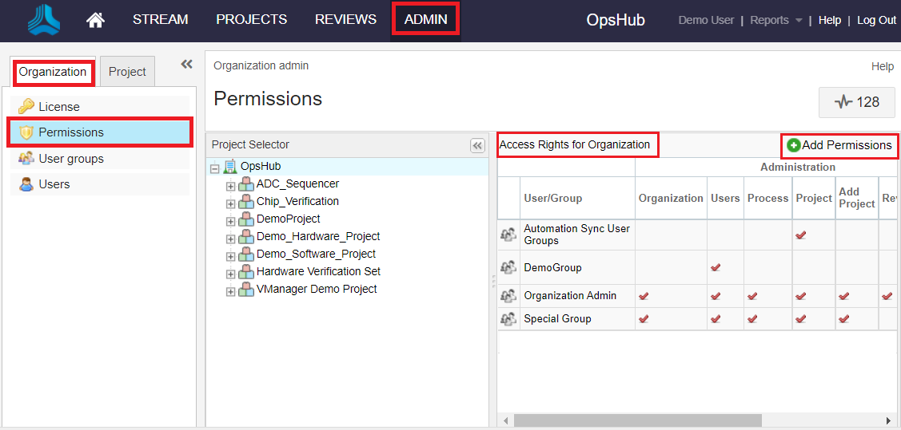
</p>

- Select the user to be mentioned in OpsHub Integration Manager from "Users";

- To provide the **User Administration** permission at the organization level:
  - Select **User Administration** from the "Permission" and save it as shown below:

<p align="center">
  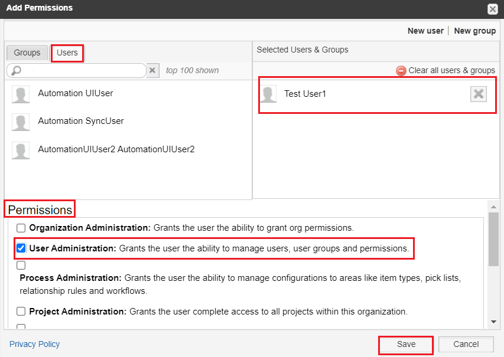
</p>

- Similarly, to provide the **Read Access** permission at the organization level, please select **Read Access** from the "Permission" and save it.

## Connector-specific Field: Custom field configuration

For creating custom field in Jama follow the steps given below:
* Go to Admin window in Jama.
* Select Item Types.
* Select the item for which you want to add custom field.
* Select **config**.

<p align="center">
  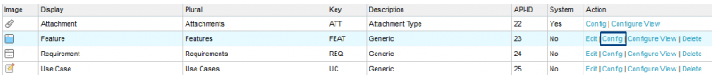
</p>

* Select **Add Field**.

<p align="center">
  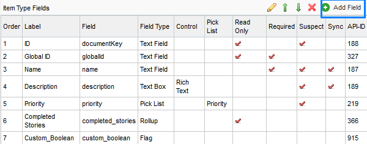
</p>

* Fill in the details for new custom field to be added.

<p align="center">
  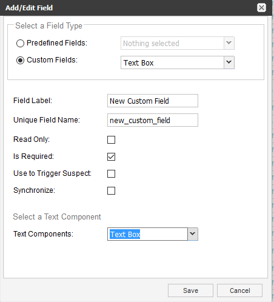
</p>

---

## Setting up Date format field for System configuration

For changing date field display format in Jama end system, follow the steps given below:
* Go to Login page.
* Login using root user.
* Go to System Properties → General Properties.
* Click on "Edit" button.
* Change the date format in field **Java Date Time Format** accordingly.

<p align="center">
  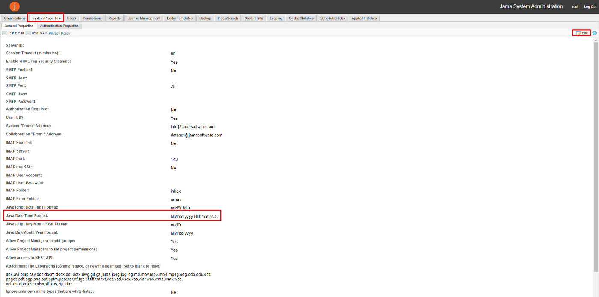
</p>

The recommended date format is the Jama system default date format i.e. `MM/dd/yyyy hh:mm:ss a z`. It is recommended that date format should include timezone.

> **Note**: Any changes in date format will be reflected in the later "Versions" and "Activities" of an entity in Jama. Any versions before date format changes remain unaffected.


