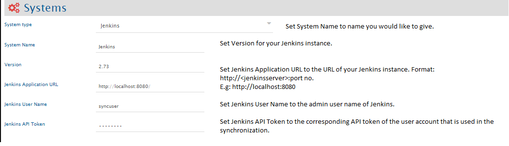
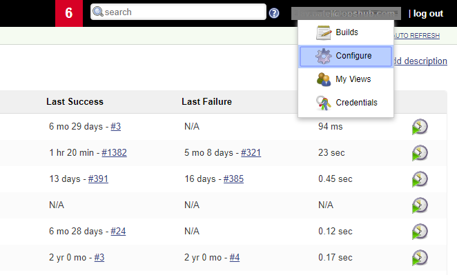
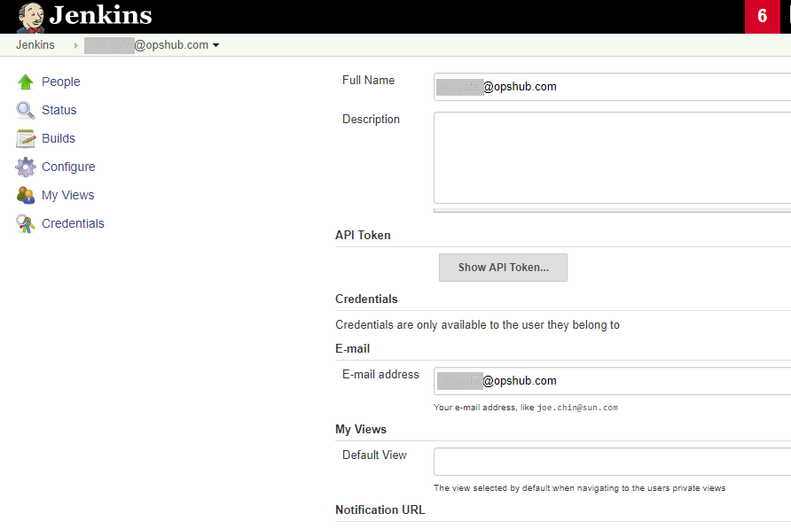

# Prerequisites

## User privileges

* Create the number of user(s) for Jenkins as specified below. The users should be dedicated to OpsHub Integration Manager. User(s) should not be used to do any operations from system's user interface.  
  * For uni-directional integration with Jenkins, create 1 Jenkins user.  
  * For bi-directional integration with Jenkins, in which OpsHub Integration Manager will trigger Jenkins job based on the source system event configured and then that triggered job's build result need to be written back on the source system, create 2 Jenkins users.
* User should have access to all the jobs for which build data need to be synchronized.
* User should have Anonymous authentication or username/password authentication or SAML 2.0 based authentication.

## Parameter configuration

A special parameter needs to be created on all Jenkins projects that need to be synchronized with Jenkins as the target integration so that OpsHub Integration Manager can trigger the build on Jenkins. This parameter usage should be reserved to OpsHub Integration Manager use only. For creating parameter on Jenkins, You can refer the steps mentioned in [how-to-add-parameter-on-jenkins](#how-to-add-parameter-on-jenkins) section in appendix. 

| Parameter Name | Parameter Type |
|----------------|----------------|
| OH_ID          | String          |

# System Configuration

Before you continue to the integration, you must first configure Jenkins. Click [System Configuration](../integrate/system-configuration.md) to learn the step-by-step process to configure a system. Refer the screenshot given below for reference.

  

In order to get the Jenkins API token from Jenkins instance for a given user account, please follow the [how-to-get-api-token-in-jenkins](#how-to-get-api-token-in-jenkins) section in appendix.

If the system is deployed on HTTPS and a self-signed certificate is used, then you will have to import the SSL Certificate to be able to access the system from OpsHub Integration Manager. Click [Import SSL Certificates](../getting-started/ssl-certificate-configuration.md) to learn how to import SSL certificate.

# Mapping Configuration

Map the fields between Jenkins and the other system to be integrated to ensure that the data between both the systems synchronizes correctly.  
Click [Mapping Configuration](../integrate/mapping-configuration.md) to learn the step-by-step process to configure mapping between the systems.

> **Note** : When Jenkins is the target system then a special field called 'Trigger Action' needs to be set accordingly. Based on the source events, you can configure that field to set 'Yes' or 'No'. 'Yes' means build will be triggered on Jenkins and 'No' means build won't be triggered on Jenkins.

# Integration Configuration

Set a time to synchronize data between Jenkins and the other system to be integrated. Also, define parameters and conditions, if any, for integration. Click [Integration Configuration](../integrate/integration-configuration.md) to learn the step-by-step process to configure integration between two systems.

> **Note** : Set **Start Build Id** to the id from which OpsHub Integration Manager has to start polling from Jenkins. The OpsHub Integration Manager integration will use this as the start id to pull data from the source system to the destination system (all builds that were created previously will not be synchronized). 

## Integration recommendations

* **Jenkins Build Management Configuration**: If a Jenkins job is configured to discard old builds and OpsHub Integration Manager has not yet synced those builds, then they would be considered as 'deleted'. So please select the 'Discard Old Builds' option accordingly. You can select those by clicking on Jenkins job > Configure > Discard Old Builds. It will help you manage the duration for which you can keep the record of the build.  
* **Days to keep builds**: Build records are kept to this number of days and Max (#) of builds to keep. It will retain data for only configured number of latest builds.  
* **Jenkins Build Update Events**: If any update is made on build information, it will be updated to the target system only when OpsHub Integration Manager has not synchronized it till that time. So set the 'Associate Schedule' under Advance Configuration accordingly. OpsHub Integration Manager polls only once for any build, once the processing has moved past that build, it will not poll any updates made later on.  
* It is recommended to not reset Build Id in Jenkins.

## Integration assumptions

* Jenkins has various plugins for triggering jobs, because OpsHub Integration Manager relies on the query http://<jenkinsserver>: port no./api/Json?depth=2. Only if this query provides the information then only those data can be accessed.
* For a particular job, field data is loaded based on the previous build information if any, otherwise the predefined set of field data is loaded.
* We only support 'create event' from Jenkins, so for Jenkins, 'conflict detection' setting on mapper is not applicable.
* When Jenkins as a target integration is configured and the source system is back-dated or processing id is set to past processed id such that previously processed events are reprocessed, then on Jenkins new builds are generated.

## Integration limitations

* Jenkins artifacts sync is not supported.
* OpsHub Integration Manager can poll Jenkins child job data if Jenkins API provides the data; however, it will be modelled as a field to populate all child jobs' build results not as 'Issues Relationship' on Field mapping.
* Jenkins jobs that are type of External Job are not supported.
* Currently supported parameter types are: 'String', 'Text', 'Boolean', 'Choice' (Other parameters are not supported, so if other parameters are enabled then it may fail based on Jenkins configurations)

# Appendix

## How to add parameter on Jenkins

* Go to the job on which parameter need to be added.
* Click on **Configure** for that job. Ensure 'This build is parameterized' is checked to 'true'.
* Click on **Add Parameter** and add appropriate parameter as per your need.
* Once parameters are added, save the job.

## How to get API Token in Jenkins

* Go to the Jenkins instance in your browser. For example, the Jenkins instance is http://hostname:8080/.
* Login with the user credentials assigned to you. This will open the home page of the Jenkins account. On the home page, navigate to the top-right corner, and click the dropdown arrow adjacent to the user account's name and select **Configure** from the dropdown menu.

  

It opens a Jenkins Configuration page. On that page in the center, click the **Show API Token** button in the **API Token** section. It will display the Jenkins instance API Token. You can use the same for configuration of Jenkins in OpsHub Integration Manager in the system configuration section.

  

