# Prerequisites

## User privileges

- Create a user in Jira Align that is dedicated for OpsHub Integration Manager. This user shouldn't perform any other action from Jira Align's user interface. This user is now referred as 'Integration User' in the document further.
- The Integration User should be assigned a role that has sufficient permissions to interact with the Jira Align APIs. Below are the details for permissions required for the role assigned to integration user.
  - When Jira Align is the source endpoint:  
    > **Note**: In Jira Align, all the entity types are distributed among different levels called: administration, portfolio, solution, team, program, product. Hence, for different entities, permissions have to be given at different levels, and these levels are called 'Sections'.

- The following table mentions the permissions required for an Integration User to synchronize the entities:

**Access needed for Entity Types**

| **Entity Type**         | **Section**               | **Permission to give in Additional Options**          |
|-------------------------|---------------------------|-------------------------------------------------------|
| **Portfolio**           | Administration            | Add Agile Objects, Manage Agile Objects(Admin)       |
| **Program**             | Administration            | Add Agile Objects, Manage Agile Objects(Admin)       |
| **Region**              | Administration            | Add Agile Objects, Manage Agile Objects(Admin)       |
| **City**                | Administration            | Add Agile Objects, Manage Agile Objects(Admin)       |
| **Customer**            | Administration            | Add Agile Objects, Manage Agile Objects(Admin)       |
| **Ideation**            | Enterprise, Product       | Add Agile Objects, Manage Agile Objects(Admin)       |
| **Theme**               | Portfolio                 | Add Agile Objects, Manage Agile Objects(Admin)       |
| **Initiative**          | Portfolio                 | Add Agile Objects, Manage Agile Objects(Admin)       |
| **Portfolio Objective** | Portfolio, Solution       | Add Agile Objects, Manage Agile Objects(Admin)       |
| **Capability**          | Solution                  | Add Agile Objects, Manage Agile Objects(Admin)       |
| **Value Stream**        | Solution                  | Add Agile Objects, Manage Agile Objects(Admin)       |
| **Epic**                | Program, Product          | Add Agile Objects, Manage Agile Objects(Admin)       |
| **Program Objective**   | Program                   | Add Agile Objects, Manage Agile Objects(Admin)       |
| **Program Increment**   | Program                   | Add Agile Objects, Manage Agile Objects(Admin)       |
| **Story**               | Team                      | Add Agile Objects, Manage Agile Objects(Admin)       |
| **Defect**              | Team                      | Add Agile Objects, Manage Agile Objects(Admin)       |
| **Team Objective**      | Team                      | Add Agile Objects, Manage Agile Objects(Admin)       |
| **Task**                | Team                      | Add Agile Objects, Manage Agile Objects(Admin)       |
| **Sprint**              | Team                      | Add Agile Objects, Manage Agile Objects(Admin)       |

- In the Appendix section, refer to [Grant permissions to Jira Align user](#grant-permissions-to-jira-align-user) for step-wise details on how to grant permissions to a Jira Align user.
- To learn how to add a user in Jira Align, refer to [Add User](#add-user) section.

### Entity Details

| **Entity Type**         | **Project Type** | **projectFieldInternalName** | **Read Support** | **Write Support** | **Reading Mechanism** |
|-------------------------|------------------|-------------------------------|------------------|-------------------|------------------------|
| **Portfolio**           | ENTERPRISE       | -                             | true             | true              | NON_TIMESTAMP          |
| **Program**             | PORTFOLIO        | portfolioId                   | true             | true              | HISTORY                |
| **Region**              | ENTERPRISE       | -                             | true             | true              | NON_TIMESTAMP          |
| **City**                | ENTERPRISE       | -                             | true             | true              | NON_TIMESTAMP          |
| **Customer**            | ENTERPRISE       | -                             | true             | true              | NON_TIMESTAMP          |
| **Ideation**            | ENTERPRISE       | -                             | true             | true              | HISTORY                |
| **Theme**               | ENTERPRISE       | -                             | true             | true              | HISTORY                |
| **Initiative**          | PROGRAM          | primaryProgramId              | true             | true              | HISTORY                |
| **Objectives**          | PROGRAM          | programId                     | true             | true              | HISTORY                |
| **Capability**          | PROGRAM          | primaryProgramId              | true             | true              | HISTORY                |
| **Value Stream**        | ENTERPRISE       | -                             | true             | true              | NON_TIMESTAMP          |
| **Epic**                | PROGRAM          | primaryProgramId              | true             | true              | HISTORY                |
| **Program Increment**   | PORTFOLIO        | portfolioId                   | true             | true              | HISTORY                |
| **Story**               | PROGRAM          | programId                     | true             | true              | HISTORY                |
| **Defect**              | PROGRAM          | programId                     | true             | true              | HISTORY                |
| **Task**                | PROGRAM          | -                             | true             | true              | HISTORY                |
| **Sprint**              | PROGRAM          | programId                     | true             | true              | NON_TIMESTAMP          |

> **Note**: For entity type as objectives, please provide "tier" as 1 for team objective, 2 for program objective, 4 for portfolio objective.

## System Configuration

Before the user starts with the integration configuration, first configure Jira Align system.

Click [System Configuration](../integrate/system-configuration.md) to learn the step-by-step process to configure a system.

Refer the screenshot given below:

  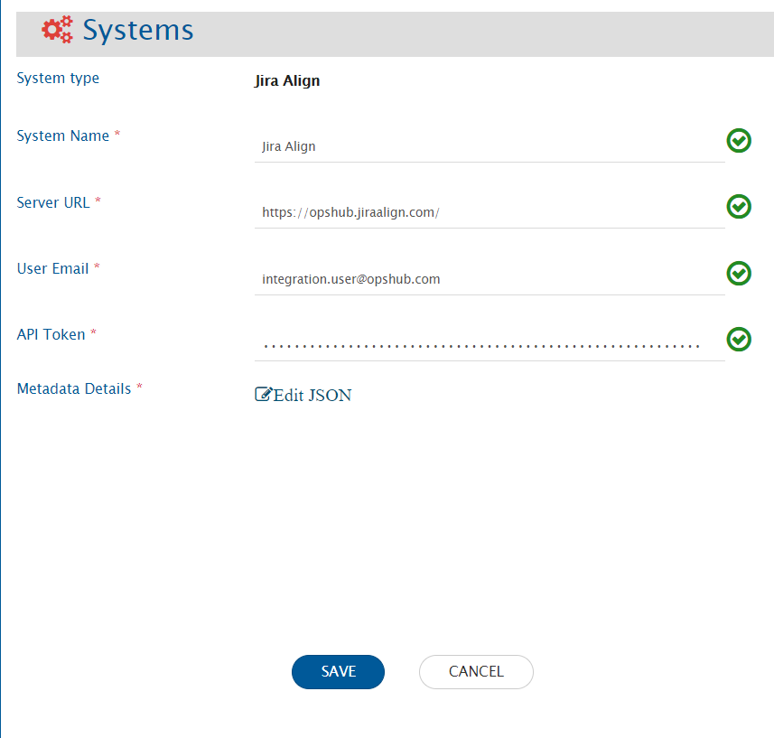

**Jira System form details**

| **Field Name**     | **Description**                                                                                                                                       |
|--------------------|--------------------------------------------------------------------------------------------------------------------------------------------------------|
| **System Name**     | Provide System name                                                                                                                                   |
| **Server URL**      | Provide Server URL of the Jira Align instance. This URL will be used for communicating to Jira Align API. Format: `https://[name].jiraalign.com/`     |
| **User Email**      | Provide the email ID of the integration user. Refer to [User privileges](#user-privileges) for permission details.                                    |
| **API Token**       | Provide the API token generated in Jira Align for the above user.                                                                                     |
| **Metadata Details**| JSON format metadata info (fields, lookups, etc.). Refer to [Understanding JSON Input](#understanding-json-input).                                    |

### Understanding JSON Input

- Field metadata is provided as JSON during system configuration.
- Internal name = API endpoint of the entity (e.g., for "Epic" → `"Epics"`).
- Incorrect internal name causes sync failure.
- "Lookup" fields depend on these names.
- If custom/system field is used, ensure it's activated from Detail Panel Settings.
- If marked mandatory in metadata, ensure it's required in Jira Align.
- Refer to [Understanding JSON Metadata Input](../integrate/system-configuration.md#understanding-json-metadata-input) and [JSON Metadata Sample](sample-json-file-for-jira-align.md).

# Mapping Configuration

Map fields between Jira Align and the other system to ensure accurate synchronization.

  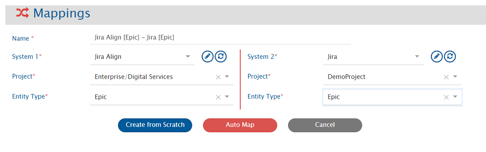

Click [Mapping Configuration](../integrate/mapping-configuration.md) to learn how to configure mappings.

> In Jira Align, entity type selection in mapping depends on the project. See [Project Selection](#project-selection).

# Integration Configuration

Set sync timing and parameters between Jira Align and the target system.

Click [Integration Configuration](../integrate/integration-configuration.md) to follow configuration steps.

  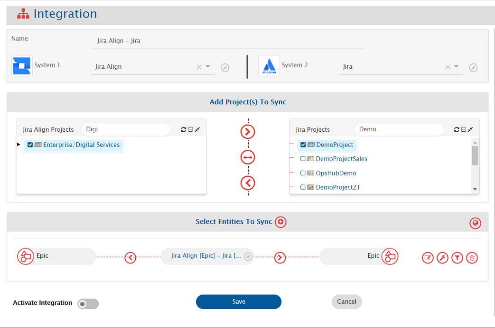

> In Jira Align, entity selection depends on the project. See [Project Selection](#project-selection).

## Criteria Configuration

To specify sync conditions when Jira Align is the source system:

- Go to **Criteria Configuration** section on the [Integration Configuration](../integrate/integration-configuration.md) page.
- Set the `Query` field using Jira Align native query format (e.g., `priority eq 1`).

See [Jira Align Query Documentation](https://help.jiraalign.com/hc/en-us/articles/360048085774-10X-API-2-0-GET-Usage-and-Filters).

**Criteria Samples**

| **Field Type** | **Criteria Description**                                          | **Criteria Snippet**                          |
|----------------|--------------------------------------------------------------------|-----------------------------------------------|
| Lookup         | Synchronize entities with high priority                           | `priority eq 2`                               |
| Date           | Sync entities created after 10 March 2021                         | `createdDate ge 2021-03-10T00:00:00Z`         |
| User           | Sync entities created by user 'ABC'                               | `createdBy eq 1159`                           |
| User + Lookup  | User 'ABC' & Priority 'Critical'                                  | `createdBy eq 1159 and priority eq 1`         |
| Lookup         | Priority is 'Critical' or 'High'                                  | `priority eq 1 or priority eq 2`              |

## Target LookUp Configuration

Specify the `Target Search Query` so OpsHub Integration Manager can search the entity in Jira Align.

> Use `@source_field@` placeholders to reference source values.

Go to **Search in Target Before Sync** on the [Integration Configuration](../integrate/integration-configuration.md) page.

**Target Lookup Query Samples**

| **Field Type** | **Target Lookup Use Case**                                   | **Snippet**                            |
|----------------|---------------------------------------------------------------|----------------------------------------|
| Text           | Match entity having source ID in `description` field          | `description eq '@source_system_id@'`  |

See [Jira Align Query Documentation](https://help.jiraalign.com/hc/en-us/articles/360048085774-10X-API-2-0-GET-Usage-and-Filters) for more details.

# Known Behaviour

## Project Selection

*For Jira Align system, user can organize their data at different levels, i.e., Enterprise, Portfolio or Program [as defined below]. Different entities can reside on different levels, for e.g., the Epic can belong to Program while Objective can belong to Portfolio. For more details on Project entity, please refer to [[#Entity Details | Entity Details]] section.*

* Enterprise  
  ** Portoflio  
  *** Program

And this hierarchy is inclusive of Parent. For example, Epic can be organized at Program level, and the user can create an integration with Program/Portfolio/Enterprise setting for their integration. While Objective can belong to Portfolio level, and user can create an integration with Portfolio/Enterprise setting for their integration.

> **Note**: The information related to the mandatory single field value field is to be given in the JSON input in the section, **entities->systemSpecific->projectEntityType**

# Known Limitations

*Limitations due to the lack of API:*
- Synchronization of comments and attachments is not supported.
- If in the Jira Align more than one user having same full Name then we return the first value that matches the fullName.  
  * **Reason: Jira Align API does not give any identification for two different users having same full name.**
- For user type field synchronization advance mapping would be needed in the below mentioned usecase.  
  * **If the first name or last name of the user is changed.**
- Fields available in the following sections are not supported:
  - Value  
  - Finance  
  - Responsibility Matrix  
  - Skill set  
  - Design  
  - Members  
  - Program, Products and Regions(Section): Regional Allotment(field), Program Allotment(field)
- When Jira Align is target endpoint:
  - Synchronization of Ideation's Category field:
    - The category field should be marked as mandatory in the fields JSON metadata input and in the field mapping.
    - In the field configuration, the **sync when** should be configured to create only.
- When Jira Align is source endpoint:
  - Conflict detection is not supported for 'State' field in the 'Epic' entity type.

*When Jira Align is source endpoint, below entities will be synchronized without history. They will be synchronized with the entity state/details available at the time of synchronization.*
- Product, Value Stream, Release Vehicle, Snapshot, Region, Portfolio, Theme, Program, Program Increment, Team, Sprint

*In case of One to Many links from Epic to Capability and Capability to Feature, configure link from child to parent, that is from Capability to Epic and enable **fail if not found** criteria.*  
**Reason: API limitation from Jira Align.**

*When a link is added from Epic to Feature or vice versa, an additional update is needed as the last updated time of the entity does not change by adding link.*

# Appendix

## Add user

1. Login to Jira Align using the user with privileges to create a new user. 
2. Go to **Administration** Section. 

  

3. Navigate to *People* 

  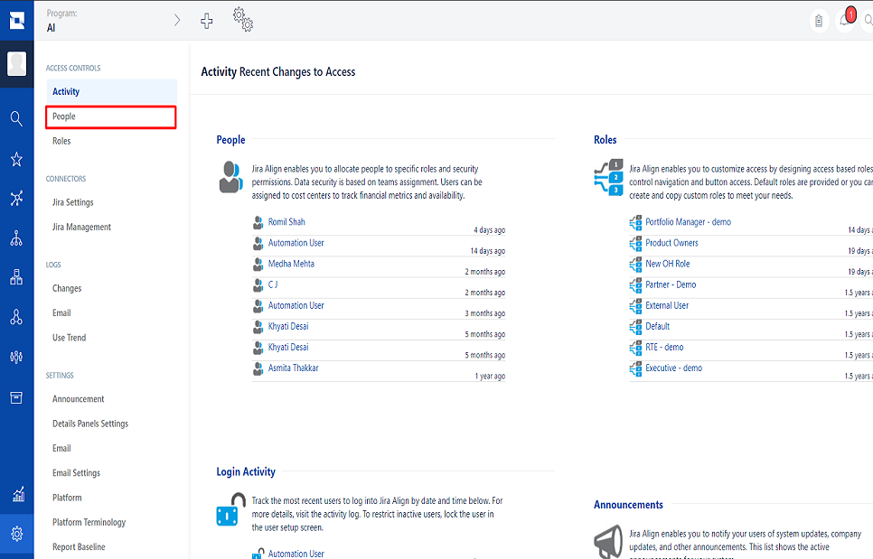

4. Click on the **Add User** button on top right corner of the users' list. 

  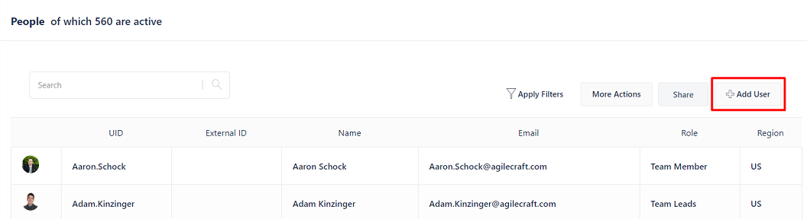

5. Fill the details regarding user. For the 'Role', select the roles having permissions mentioned in [[#User privileges|User privileges]] Section 

  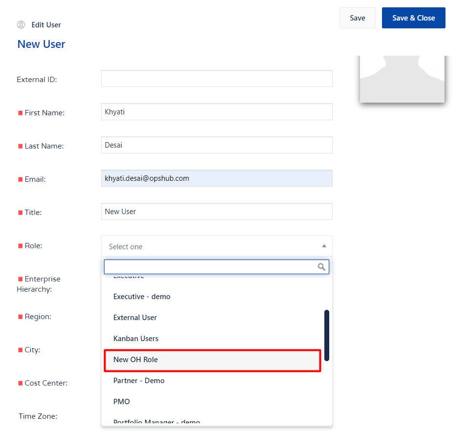

6. Save changes

## Grant permissions to Jira Align user

1. Login to Jira Align using the user with privileges to create a new user. 
2. Go to **Administration->Roles** Section. 

  

  

3. Select a Role you want to give to integration user. 

  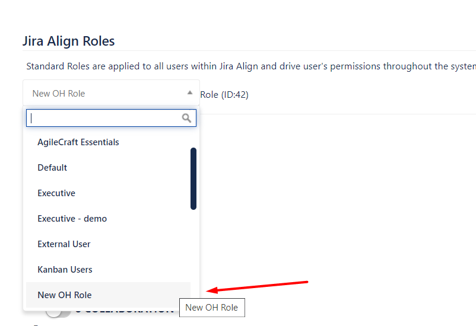

4. Give permissions as per mentioned in the [[#User privileges|User privileges]] Section to this role. 
5. For example, to give Administration access: click the '+' sign on the left side of **Administration** section and enable the needed permissions. 

  

  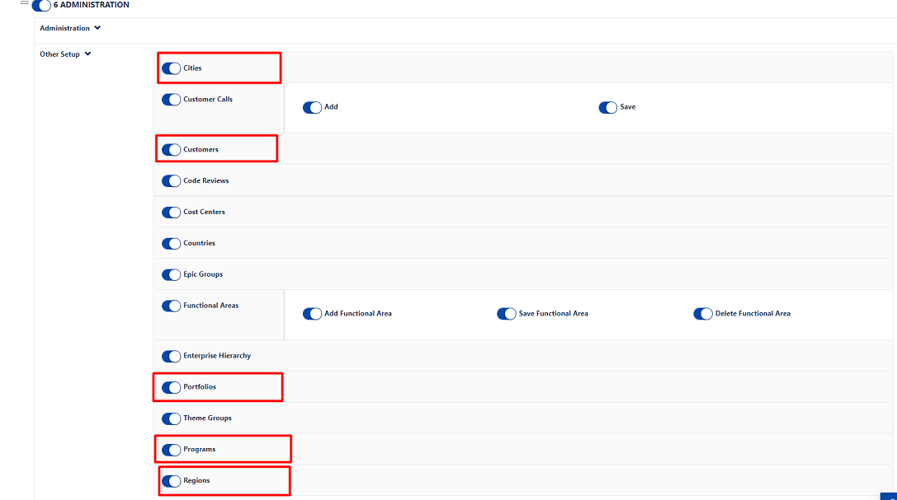

## Steps for generating the Bearer token

1. Go to User menu and then navigate to Edit Profile option. 

  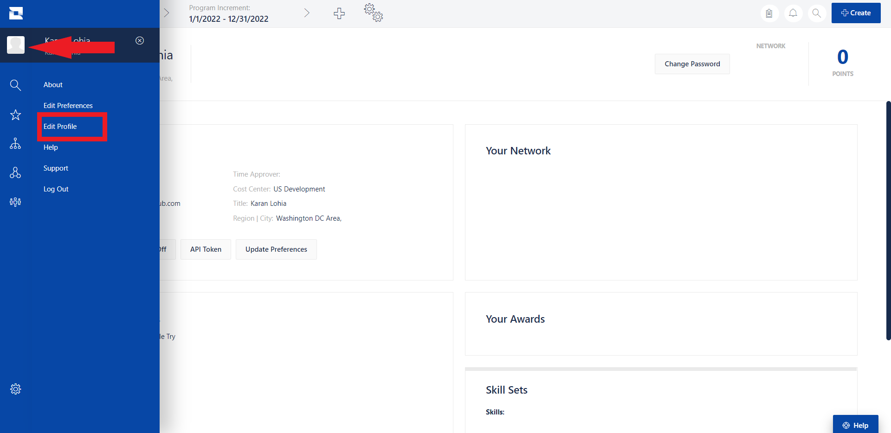

2. In the Account Details section, click API Token. 

  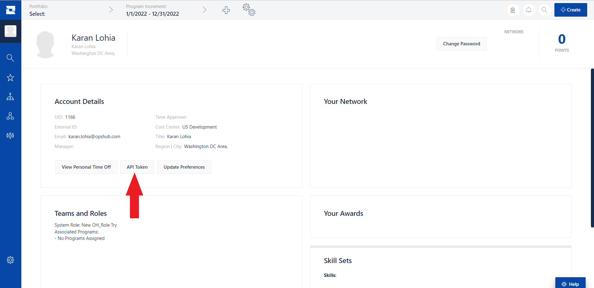

3. Click "Generate new API Token" and copy the "API 2.0 Token". 

  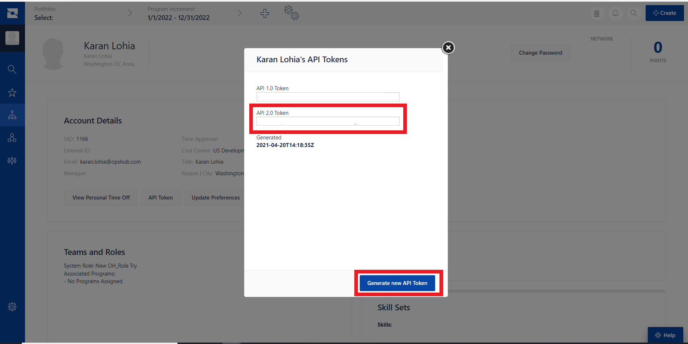

4. Add "Bearer" at the begining of the copied token to make it in the form of `Bearer <API 2.0 Token>`. For example:  
   User Token Copied: `user:1166|{.%Bb8_V6LPX5JY}03j|v+t<#M~V}8r`  
   Change to: `Bearer user:1166|{.%Bb8_V6LPX5JY}03j|v+t<#M~V}8r`

