# jira

## Prerequisites

### User privileges

* Create a user in Jira that is dedicated for \{{ spaceName \}}. This user shouldn't perform any other action from Jira's user interface.\
  **Note** This user can be part of your Jira system's Lightweight Directory Access Protocol (LDAP) or Single sign-on (SSO) provider.
* The user should be a member of the following user groups:
  * **For on-premises instance**:
    * Jira-developers
    * Jira-users
  * **For cloud instance**:
    * Jira-Ops-Users

These are the privileges required for the dedicated integration user to synchronize the entities.\
Refer to [Grant permissions to Jira user](jira.md#grant-permissions-to-jira-user) for step-wise details.

These permissions apply to both Jira On-Premise (self-hosted) and On-Demand (cloud) versions.

**Basic issue-types** can be synchronized by granting:

* Administer Projects (for synchronizing Sprint as field or entity)
* Browse Projects
* View Read-Only Workflow

**Comments Permissions**:

* Add Comments
* Edit All Comments
* Delete All Comments

**Attachments Permissions**:

* Create Attachments
* Delete All Attachments

**Manage Sprints** ((For synchronizing Sprint as field value or as entity))

**Issue Permissions**: Provide the below permissions:

* Assign Issues
* Close Issues
* Create Issues
* Delete Issues
* Edit Issues
* Link Issues
* Modify Reporter
* Move Issues
* Resolve Issues
* Schedule Issues
* Transition Issues

**Voters & Watchers Permissions**: Provide the below permissions when synchronizing Watchers:

* Manage Watchers

For synchronizing the entities listed below, these additional permissions need to be given other than the Basic issue-type permissions listed above.

**For synchronizing the Worklog entity:**

* Edit All Worklogs
* Work On Issues
* Delete All Worklogs

**For synchronizing the Zephyr entities**\
The following permissions are required when Jira is **Self-Managed**:

* Zephyr - Browse Test Cycle
* Zephyr - Create Test Cycle
* Zephyr - Create Test Execution
* Zephyr - Edit Test Cycle
* Zephyr - Edit Test Execution

The dedicated integration user should have permission on projects for which entities are referred in links from the artifacts of the chosen projects (which are to be integrated).\
**For example**: There is an integration for **Story artifact of ProjectA** and the Story artifact is related to any **Epic artifact of ProjectB**, then **sync user must have all the above permissions on ProjectB** for proper synchronization of relationship between these entities. So, in this case if the sync user is not able to access the **Epic artifact of ProjectB**, then it will skip the synchronization of such links from **Story artifact of ProjectA**.

The group that includes the dedicated user should also have the **Browse Users** permission to access the usernames and e-mail ids of all available users.\
In appendix, please refer: [Grant Browse User Global Permission](jira.md#grant-browse-user-global-permission) for step-wise details on how to grant this global permission.

If your Jira system is configured with Single sign-on (SSO), then the above-mentioned User privileges and permissions are sufficient.

### Licenses required

* For Jira on-premises instance, Jira Software license is required. If you want to use Jira Service Desk entities, then make sure that you have an active Jira Service Desk license.
* For Jira cloud instance, Jira Software license is required.
* To add a user to Jira Software or Service Desk app, refer [Grant access to Jira applications to a User](jira.md#grant-access-to-jira-applications-to-a-user)

### API Token

Below are the cases where there is a need to generate an API Token:

* When Jira instance is 'On Demand'. Please refer [this](https://confluence.atlassian.com/cloud/api-tokens-938839638.html) link for generating Jira API Token.
* When Jira instance is 'Self-managed' and user wants to select 'Authentication Mode' as 'API Token' for Integration user:
  * Jira allows to create and use API Token natively or through a third-party plugin.
    * If the user is using **Jira native API Token generation**, refer [this](https://confluence.atlassian.com/enterprise/using-personal-access-tokens-1026032365.html) link for generating Jira API Token.
    * If the user is using **third party plugin for API Token generation**, please refer to the documentation of the third-party plugin for generating the API Token. For example, if the API Token provider is 'API Token Authentication Jira', the documentation for API Token generation is present in their [guide](https://www.resolution.de/post/how-to-create-api-tokens-for-jira-server-s-rest-api/).
      * There are different ways in which the API Token can be generated and used for communication with Jira API through third-party plugins. To check whether the API Token provided by the third-party plugin is supported in \{{ spaceName \}} or not, please check if API Token is authenticated through any of these two 'Authorization' header formats:
        * Authorization **Basic `<credentials>`** - where **`<credentials>`** is the base64 encoding of username: API Token (token generated through third-party plugin).
        * Authorization **Bearer `<API token>`** - where **`<API token>`** is the API Token generated through third-party plugin.

### Other prerequisites

**Synchronize user fields and user mentions**\
For synchronization of a user field or user mention in rich text fields and comments, the user email must be visible to integration user through API. For this, all the concerning users mentioned in such fields that needs to be synchronized must set their email visibility to public. To check this, please follow the steps given below:

* In Jira cloud instance, go to **Your profile and settings** > **Manage Account** > Select **Profile and visibility** tab
* Go to **Contact** section > For **Email Address** set **Who can see this?** to **Anyone**

> **Note**: Alternatively, if the user doesn't want to set email visibility to public, use advanced mapping for one-to-one mapping of user using Excel-based lookup.

**Synchronize an attachment**\
For attachment synchronization, the attachment field must be visible while creating or updating an issue. To check this, please follow the steps given below:

* In Jira, go to **Settings** > **Issues** > Click **Field Configuration** > Select **Default Field Configuration**
* Navigate to the list of fields, check whether **Attachment** field is hidden. If it is hidden, click the **Show** button to make it visible.

<div align="center">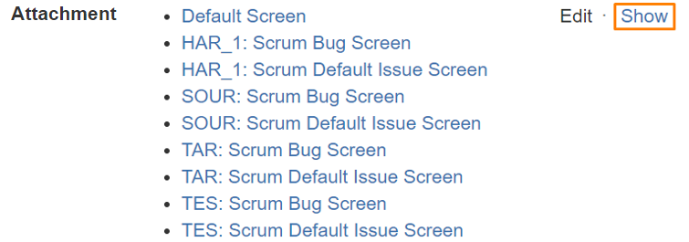</div>

* **Synchronize Relationships**\
  For relationship synchronization of common link types, the Issue Linking settings must be enabled. To check this, please follow the steps given below:
  * In Jira, go to **Settings** > Click **Issues** > Click **Issue Linking** > **Issue Linking is currently ON** \[This message should come].
  * Click **Activate** if that message does not appear.
  * Other special link types, i.e., Epic Link, Sprint Link, etc., will still sync even if the setting is disabled.

<div align="center">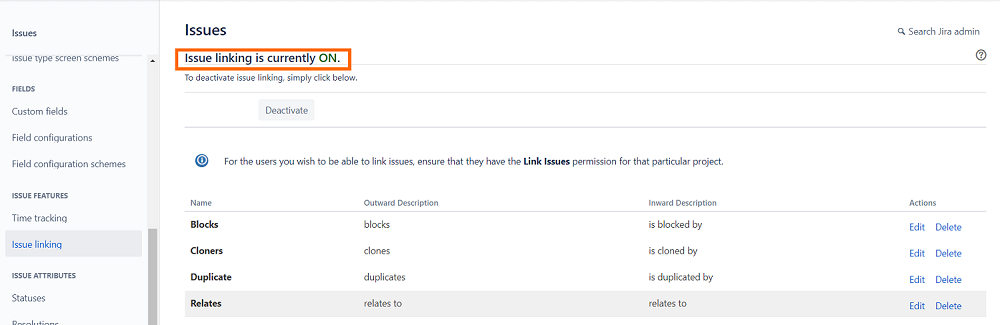</div>

* When synchronizing **Sprint** as an entity, specific board should have filter query with **"ORDER BY RANK ASC"** in it. If rank is disabled for any of the boards, entities will not be polled from or written to such boards.
* Seamless synchronization of 'Status' field can be achieved through these two ways:
  * Workflow transition XML configuration
  * Alternative to workflow transition xml configuration\
    . For more details refer: [Advance Workflow Transition](jira.md#advance-workflow-transition)
* For Jira as target if you are synchronizing both the fields **Original Estimate** and **Remaining Estimate** which is part of **Time Tracking** feature of Jira then the **Legacy Mode** for this field should be **disabled**. This is because in Legacy Mode, the Original Estimate and Remaining Estimate are linked and only one value can be updated at a time. Refer section [Disabling Legacy Mode](jira.md#disabling-legacy-mode) in the Appendix for knowing the steps relating to disabling the Legacy Mode.

\


* **\{{ spaceName \}}** requires one special field to be defined on the entity that is being synchronized. These must be set up so that **\{{ spaceName \}}** can track the integration status of each item.

| Version                         | Type of field                 | Field Name                                               |
| ------------------------------- | ----------------------------- | -------------------------------------------------------- |
| **For Version < 5.0**           | Read only text                | OH\_Last\_Update                                         |
| **For Version >= 5.0 and <6.2** | Text Field (< 255 characters) | OH\_Created\_By                                          |
| **For Version >= 6.2**          |                               | No such fields needs to be added as part of prerequisite |

Refer [Custom field for Jira version < 6.2 section](jira.md#custom-field-for-jira-version-less-than-6.2) in appendix for details on how to create custom fields.

**Synchronize changes in Issue Type**

* When Jira is the target system in **\{{ spaceName \}}**, to modify the issue type of the entity, the "Issue Type" field must be present on the edit screen of the configured entity types in **\{{ spaceName \}}**.

## System Configuration

Before you start with the integration configuration, you must first configure Jira.\
Click [System Configuration](../integrate/system-configuration.md) to learn the step-by-step process to configure a system.

Refer the screenshot given below for reference:

<div align="center">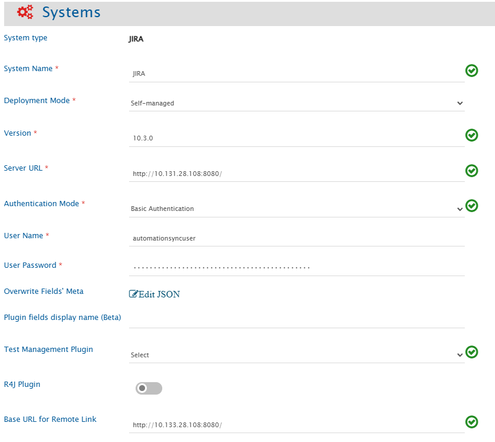</div>

| **Field Name**                        | **When field is visible on the System form**                                                             | **Description**                                                                                                                                                                                                                                                                                                                                                                                                                                                                                                                                                                                                                                                                                     |
| ------------------------------------- | -------------------------------------------------------------------------------------------------------- | --------------------------------------------------------------------------------------------------------------------------------------------------------------------------------------------------------------------------------------------------------------------------------------------------------------------------------------------------------------------------------------------------------------------------------------------------------------------------------------------------------------------------------------------------------------------------------------------------------------------------------------------------------------------------------------------------- |
| **System Name**                       | Always                                                                                                   | Provide System name                                                                                                                                                                                                                                                                                                                                                                                                                                                                                                                                                                                                                                                                                 |
| **Deployment Type**                   | Always                                                                                                   | Select Deployment Type as per the deployed instance. For on-premises instance, you need to select **Self-Managed** and for SaaS (on-demand) instance, you need to select **Cloud** from the list.                                                                                                                                                                                                                                                                                                                                                                                                                                                                                                   |
| **Version**                           | Only when Jira is on premise                                                                             | Provide Version like 5.1, 6.7, 7.0. For knowing your version refer: [Finding Jira's version](jira.md#How-to-find-Jira's-version)                                                                                                                                                                                                                                                                                                                                                                                                                                                                                                                                                                    |
| **Agile Plugin Version**              | Only when Jira is on premise with version less than 7.0                                                  | If the Jira instance has an Agile plugin installed, provide agile plugin version here. For example: 6.7.7                                                                                                                                                                                                                                                                                                                                                                                                                                                                                                                                                                                           |
| **Server URL**                        | Only when Jira is a Cloud instance or an On-Premise instance with a version greater than or equal to 5.0 | Format when On-Premises Instance: http://\[JiraServerHost]:\[JiraServerPort], Format when On-Demand Instance: https://\[nameOfYourJiraInstance].atlassian.net/. Refer [Server URL](jira.md#Server-URL) in appendix to get the server URL.                                                                                                                                                                                                                                                                                                                                                                                                                                                           |
| **Base URL for Remote Link**          | Always                                                                                                   | Provide different Instance URL of the Jira instance. This URL is used for generating the Remote Link. For example, if the Instance URL is http://10.11.156.129:8080/ or any API node URL, but Remote Link needs to be generated with a different Instance URL such as http://domain.com:8080/. **Note**: If "Base URL for Remote Link" is empty, It will use Instance/Server URL to generate Remote Link if configured on Integration.                                                                                                                                                                                                                                                              |
| **Jira Web-service URL**              | Only when Jira is on premise with version less than 5.0                                                  | Format: http://\[JiraServerHost]:\[JiraServerPort]/rpc/soap/jirasoapservice-v2                                                                                                                                                                                                                                                                                                                                                                                                                                                                                                                                                                                                                      |
| **Authentication Mode**               | Only when Jira is 'Self-managed'                                                                         | - For authenticating through API Token, select API Token . For authenticating through user password, select Basic Authentication or Cookie-based Authentication. **Advantage of 'Cookie-based Authentication' over 'Basic Authentication':** If 'Basic Authentication' is selected, Jira will internally generate a login request on every API call integration sends. If 'Cookie-based Authentication' is selected, one-time cookie session will be generated, that will be used for following API requests. This reduces load on Jira on the subsequent API calls. **Note**: From Jira version 10.2.x, refer to [enable cookie based authentication](jira.md#Enable-Cookie-Based-Authentication). |
| **User Name**                         | Only when Jira is on premise                                                                             | Jira User should have administrator privilege to use the Jira API. Please provide the Username of user and not the email id.                                                                                                                                                                                                                                                                                                                                                                                                                                                                                                                                                                        |
| **User Password**                     | Only when Jira is on premise                                                                             | Provide Jira Users' password                                                                                                                                                                                                                                                                                                                                                                                                                                                                                                                                                                                                                                                                        |
| **User Email**                        | Only when Jira is On-Demand                                                                              | Jira User Email should have administrator privilege to use the Jira API. Please provide the UserEmail of user.                                                                                                                                                                                                                                                                                                                                                                                                                                                                                                                                                                                      |
| **API Token**                         | When Jira is On-Demand or Jira is Self-managed and 'Authentication Mode' is selected as 'API Token'      | Please provide API Token generated for the Integration user. Please refer to [API Token](jira.md#API_Token) section for information on how to generate API Token.                                                                                                                                                                                                                                                                                                                                                                                                                                                                                                                                   |
| **Test Management Plugin**            | Always                                                                                                   | Select a Jira plugin for which the test entities are to be synchronized. Test management plugin currently supported by \{{SITENAME\}} are 'Zephyr' and 'Xray'.                                                                                                                                                                                                                                                                                                                                                                                                                                                                                                                                      |
| **ZAPI Plugin Version**               | Only when Zephyr is selected as the Test Management plugin                                               | Provide the plugin version for ZAPI here. For example: 2.1                                                                                                                                                                                                                                                                                                                                                                                                                                                                                                                                                                                                                                          |
| **ZAPI Rest URL**                     | Only when Zephyr is selected as the Test Management plugin                                               | For example: http://localhost:8080/rest/zapi/1.0/                                                                                                                                                                                                                                                                                                                                                                                                                                                                                                                                                                                                                                                   |
| **Overwriting Meta**                  | Always                                                                                                   | You can customize field behavior by providing a minified JSON input to overwrite data types, mark fields or links as mandatory, and skip linking archived entities for specific link types. Refer to [Overwriting Meta](jira.md#Overwriting-Meta) for details.                                                                                                                                                                                                                                                                                                                                                                                                                                      |
| **Plugin fields display name (Beta)** | Always                                                                                                   | Consider this input only if you want to add additional third-party plugin fields for mapping. Provide the input as [Comma-Separated Values](jira.md#Comma-Separated_Values.28CSV.29). Please note: Read support for these fields having base type as string, number and datetime are supported for now.                                                                                                                                                                                                                                                                                                                                                                                             |
| **R4J Plugin**                        | Only when Jira is on premise                                                                             | Enabled when R4J is required during sync.                                                                                                                                                                                                                                                                                                                                                                                                                                                                                                                                                                                                                                                           |
| **Xray Plugin Version**               | Only when Xray is selected as the Test Management plugin and Jira is on premise                          | Provide the plugin version for Xray here. For example: 3.6.0                                                                                                                                                                                                                                                                                                                                                                                                                                                                                                                                                                                                                                        |
| **Access Key**                        | Only when Jira's deployment type is Cloud and Zephyr is selected as the test management plugin           | Provide the Access Key generated for the user \[mentioned in the **User Email** field of system configuration] here. The steps to generate the Access Key in Zephyr are mentioned [here](https://support.smartbear.com/zephyr-squad-cloud/docs/api/api-keys.html).                                                                                                                                                                                                                                                                                                                                                                                                                                  |
| **Secret Key**                        | Only when Jira's deployment type is Cloud and Zephyr is selected as the test management plugin           | Provide the Secret Key generated for the user \[mentioned in the **User Email** field of system configuration] here. The steps to generate the Secret Key in Zephyr are mentioned [here](https://support.smartbear.com/zephyr-squad-cloud/docs/api/api-keys.html).                                                                                                                                                                                                                                                                                                                                                                                                                                  |
| **Metadata Details**                  | Only when Jira's deployment type is Cloud and Zephyr is selected as the test management plugin           | This data is pre-populated in JSON format according to our knowledge of system metadata (entity type, field names, lookup...). The user can edit it based on the Zephyr instance details for system/custom metadata. For the format and guidance related to filling these details in JSON form, please refer to [Understanding JSON Input](jira.md#Understanding-JSON-Input) section.                                                                                                                                                                                                                                                                                                               |
| **AIO API Token**                     | Only when Jira's deployment type is Cloud and AIO is selected as the test management plugin              | Provide the **AIO API Token** generated for the user \[mentioned in the **User Email** field of system configuration]. The steps to generate the API Token in AIO are mentioned [here](https://aiosupport.atlassian.net/wiki/spaces/NAT/pages/1900879166/Access+Token).                                                                                                                                                                                                                                                                                                                                                                                                                             |
| **Client Id**                         | Only when Jira's deployment type is Cloud and Xray is selected as the test management plugin             | Provide the **Client Id** generated for the user \[mentioned in the **User Email** field of system configuration]. The steps to generate the Client Id for Xray are mentioned [here](https://docs.getxray.app/display/XRAYCLOUD/Global+Settings%3A+API+Keys).                                                                                                                                                                                                                                                                                                                                                                                                                                       |
| **Client Secret**                     | Only when Jira's deployment type is Cloud and Xray is selected as the test management plugin             | Provide the **Client Secret** generated for the user \[mentioned in the **User Email** field of system configuration]. The steps to generate the Client Secret for Xray are mentioned [here](https://docs.getxray.app/display/XRAYCLOUD/Global+Settings%3A+API+Keys).                                                                                                                                                                                                                                                                                                                                                                                                                               |
| **Xray API Endpoint**                 | Only when Jira's deployment type is Cloud and Xray is selected as the test management plugin             | Provide the Xray GraphQL API endpoint for API requests. By default, https://xray.cloud.getxray.app API endpoint will be used. The URL must have a prefix for the location where Xray data is hosted. The locations, according to the [XRay documentation](https://docs.getxray.app/display/XRAYCLOUD/Data+Residency#DataResidency-XrayLocations), can be US, Europe, and Australia. Hence, the API URL can be one of these: https://us.xray.cloud.getxray.app, https://eu.xray.cloud.getxray.app, or https://au.xray.cloud.getxray.app.                                                                                                                                                             |
| **Xray Entity Names**                 | Only when Jira's deployment type is Cloud and Xray is selected as the test management plugin             | If any Xray entity is renamed, provide the updated display name in the JSON input. Refer to [Xray entity names](jira.md#Xray-Entity-Names) section for details.                                                                                                                                                                                                                                                                                                                                                                                                                                                                                                                                     |

## Mapping Configuration

Map the fields between Jira and the other system to be integrated to ensure that the data between both the systems synchronizes correctly.

<div align="center"></div>

<div align="center"></div>

Click [Mapping Configuration](../integrate/mapping-configuration.md) to learn the step-by-step process to configure mapping between the systems.

> **Note** As per Jira on demand, Account id is used for user type of field, and hence it will be synchronized as Account id in target system instead of username.

### Prerequisites for mapping a field

* While mapping a field in Jira, make sure that it is part of both Create and Update screen of all the projects for which this field will be synchronized.\
  Also it is imperative to map only those fields (both system and custom) that are visible on the screen at the time of creating/editing an issue on Jira UI.\
  This is to avoid erroneous situation later when the integration starts.

You can ignore the above precaution for 'Status' field as it will be accessible by default to the integration user.

For checking whether the field is accessible by the dedicated integration user, refer [Field Helper](jira.md#Field-Helper).

* If a field is part of field mapping, then make sure that the field is not hidden from the field configuration associated with the issuetype of that project. For making sure that a field is not hidden, follow the steps in [How to check whether the field is not hidden from field configuration](jira.md#How-to-check-whether-the-field-is-not-hidden-from-field-configuration).
* If you want to synchronize the **Epic Link** or **Issue in Epic** links, then you need to add **Epic Link** to the create and update screen. For further details on how to add a field to screen refer [Adding field to Screen](jira.md#Adding-field-to-Screen).\
  If you miss this step you will not be able to see **Epic Link** and **Issue in Epic** as part of 'Link Type' in the 'Relationship Configuration'.

> **Note** In any case you have changed the default name of **Epic**, the name of link type will change.

* If you want to synchronize the **Parent Link** for the portfolio items, then you need to add **Parent Link** to the create and update screens. For more details on how to add a field to screen, refer [Adding field to Screen](jira.md#Adding-field-to-Screen).

### Date (without time) type fields mapping

* In Jira, the time zone is user dependent. Hence, the dates are converted to GMT time zone.
* No time component is included in the field value for the Date (without time) type field; hence, the date will be converted to GMT and shown the same in all time zones.
* If a user wants to synchronize the date to or from Jira without any time zone conversion and preserve the date value similar to the source system, an advanced mapping as per below format can be used.

```xml
<Target_Field_Name>
  <xsl:if xmlns:xsl="http://www.w3.org/1999/XSL/Transform" test="SourceXML/updatedFields/Property/<Source_Field_Name>">
    <xsl:variable name="sourceFormat" select="'<Source_Date_Format>'"/>
    <xsl:variable name="targetFormat" select="'<Target_Date_Format>'"/>
    <xsl:value-of select="utils:transformDate(SourceXML/updatedFields/Property/duedate,$sourceFormat, $targetFormat)"/>
  </xsl:if>
</Target_Field_Name>
```

> **Note** Values for Target\_Field\_Name, Source\_Field\_Name, Source\_Date\_Format, Target\_Date\_Format will be already available in default mapping of the required field.

* No advanced mapping is needed for the Date and Time type fields, as the time would be converted according to the user's time zone.

### SLA Metric fields mapping

**SLA PowerBox** is a plugin in Jira that provides the functionality to create SLA Metric fields. SLA Metric fields have different attributes.\
The **SLA Metric Fields** table describes the attributes of the SLA Metric fields that can be synchronized. Here in this table, 'SLA Metric field' refers to any SLA Metric type of field in Jira.

#### SLA Metric fields

| **Field**                                 | **Field Type** | **Field description**                                                                                                                                                           |
| ----------------------------------------- | -------------- | ------------------------------------------------------------------------------------------------------------------------------------------------------------------------------- |
| **SLA Metric field**                      | Text           | It contains information regarding the raw value that is present in the Jira API response. This can be used to perform advance configuration on the raw SLA Metric field's data. |
| **SLA Metric field.Remaining**            | Time Unit      | This field will contain the 'remaining time'. The value of this field will depend on the state of an entity.                                                                    |
| **SLA Metric field.Remaining percentage** | Text           | This field will contain the 'remaining time in percentage' value.                                                                                                               |
| **SLA Metric field.Exceeded**             | Time Unit      | This field will contain the 'exceeded time'. The value of this field will depend on the state of an entity.                                                                     |
| **SLA Metric field.Exceeded Percentage**  | Text           | This field will contain the 'exceeded time in percentage' value.                                                                                                                |
| **SLA Metric field.Spent**                | Time Unit      | This field will contain the value of the 'time spent'.                                                                                                                          |
| **SLA Metric field.Deadline**             | Date           | This field will contain the 'deadline' of the entity based on the SLA Metric field configuration.                                                                               |
| **SLA Metric field.State**                | Text           | This field will contain information regarding the 'state' attribute of SLA Metric field.                                                                                        |
| **SLA Metric field.Goal Type**            | Text           | This field will contain information regarding the 'goal type' attribute of SLA Metric field.                                                                                    |

**Limitations for SLA Metric field:**

* These fields are read-only fields in Jira.
* There is no history available for these fields. The changes in the attributes of the fields can only be determined if an entry is added in the history of the entity.

***

### Select List (Cascading) Fields Mapping

**Select List (Cascading)** is a field type in Jira that allows users to select multiple values using two select list. This field is supported in `{{ spaceName }}` with advance mapping.

Advance mapping can be done by following the steps given below:

* Edit the field mapping for which you need to map such fields.
* Expand the pop-up by clicking the arrow icon.
* Click  to change the default behavior of a particular field mapping.
* Place advance mapping in this field (There are some examples given below, use them as per your needs).
* Save.

This field will be considered as an array of String that holds the primary and child values in ordered position where index 0 will hold the primary value and index 1 will hold the child value. In this example 'TargetField' is a hierarchy (cascade) field in the target system that accepts array of String.'SourceField' is a hierarchy (cascade) field of source system that accepts array of String.

#### Example: hierarchy (cascade) field to hierarchy (cascade) field

```xml
<TargetField xmlns:xsl="http://www.w3.org/1999/XSL/Transform">
  <xsl:for-each select="SourceXML/updatedFields/Property/SourceField/string">
    <fieldvalue>
      <xsl:value-of select="text()"/>
    </fieldvalue>
  </xsl:for-each>
</TargetField>
```

#### Example: hierarchy (cascade) field to text field

In this example 'TargetField' is a text field of the target system that accepts String.'SourceField' is a hierarchy (cascade) field of the source system that accepts array of String. Multiple source values will be concatenated using '-' separator on the target side. You can change the separator as per your needs.

```xml
<TargetField xmlns:xsl="http://www.w3.org/1999/XSL/Transform">
  <xsl:for-each select="SourceXML/updatedFields/Property/SourceField/string">
    <xsl:choose>
      <xsl:when test="position() = 1">
        <xsl:value-of select="text()"/>
      </xsl:when>
      <xsl:otherwise>
        <xsl:value-of select="concat('-',text())"/>
      </xsl:otherwise>
    </xsl:choose>
  </xsl:for-each>
</TargetField>
```

#### Example: text field to hierarchy (cascade) field

In this example 'TargetField' is a text field of the target system that accepts array of String. 'SourceField' is a String field of the source system that accepts String. Multiple source values will be split using '-' separator from the source side. You can change the separator as per your needs.

```xml
<TargetField xmlns:xsl="http://www.w3.org/1999/XSL/Transform">
  <xsl:variable name="tokenizedLine" select="tokenize(SourceXML/updatedFields/Property/SourceField, '-')" />
  <xsl:for-each select="$tokenizedLine">
    <fieldvalue>
      <xsl:value-of select="."/>
    </fieldvalue>
  </xsl:for-each>
</TargetField>
```

### Advance Workflow Transition

#### Need for handling workflow transition

To understand the need for handling workflow transition in Jira, let us take an example: A 'Defect' in Jira, when created should be in 'New' state. It can then be moved to 'Open' state and then to 'Resolved' state, but it cannot be directly marked as 'Resolved' from 'New' state because of the state transition constraints enforced through Jira workflow configuration.

Here is the diagram for this example:

<div align="center">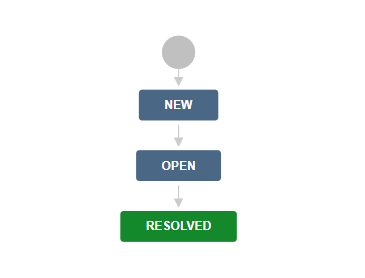</div>

In such scenarios, simply mapping State field and their look-up values can cause failure(s). The possible scenarios in which the failure can happen are listed below.\
Scenario 1: If user tries to create a Jira Issue with 'Open' status, user will get an error that this status transition is not possible and any Jira Issue can only be created in 'New' state.\
Scenario 2: If a Jira Issue is in 'New' state and through the integration the status of it is attempted to be updated to 'Resolved', Jira will throw an error that the possible transition for any Jira Issue is from 'New' to 'Open' and then from 'Open' to 'Resolved'.

#### Solution for handling workflow transition

This issue can be resolved by following any of these approaches:

1. Add/Edit Workflow transition XML in Mapping configuration of \{{ spaceName \}}
2. Change workflow configuration in Jira for sync user

**1. Add/Edit Workflow transition XML in Mapping configuration of \{{ spaceName \}}**

Click [Workflow Transition](../integrate/mapping-configuration.md#workflow-transition) to learn when and how to configure workflow transition xml mapping.\
With this option, \{{ spaceName \}} makes the required intermediate status transition automatically as per the transition(s) configuration on the end system.

**2. Change workflow configuration in Jira for sync user**

Jira allows user/role base transition(s) configuration. Use this configuration to configure any-to-any transition(s) for the integration user on Jira. Workflow transition(s) mapping is not required to be configured in \{{ spaceName \}} if any-to-any transition(s) is configured.\
With this option, \{{ spaceName \}} will be able to perform direct transition of the state field to the desired state as this option works when any-to-any transition is configured for an integration user.\
For step-by-step instructions for configuring any-to-any transition refer: [Configuration to allow all transitions](jira.md#configuration-to-allow-all-transitions).

#### Known Limitation

* The synchronization of Jira **workflow transition configuration** is not supported by \{{ spaceName \}}.

### Inline attachments synchronization

For Fields having **Wiki Style Renderer** enabled, Jira allows to add inline attachments that can be images or any other type of files. Such content can be synchronized for Jira with the following behavior:

* For Jira fields, where inline attachments synchronization is being used, **Detect Conflict** should be kept OFF/Disabled in field mapping
* Below is the synchronization behavior:
  * **When Jira is the source system**\
    Images and other type of files are synchronized to the target system depending on whether the target system supports inline images or not.\
    If the target system supports inline images, all inline files, for example, images or other type of files, are added as attachments for the target entity.\
    Inline image are directly visible and other type of files are visible as href link in the field content.
  * **When Jira is the target system**\
    By default, Jira field comes as a **Text type** field when generating mapping, even if it has **Wiki Style Renderer** enabled. So, to synchronize inline images/attachments to Jira from other systems and supporting inline images, an advance mapping is required.

Given below is a sample advance mapping for Jama to `JIRA_Custom_Field` (Any custom Text type of field in Jira) for synchronization with wiki formatting:

```xml
<JIRA_Custom_Field>
     <xsl:value-of xmlns:xsl="http://www.w3.org/1999/XSL/Transform" select="utils:convertHTMLToWikiKeepImgTag(SourceXML/updatedFields/Property/JamaField)"> </xsl:value-of>
</JIRA_Custom_Field>
```

Above mapping will preserve other wiki formatting as well.

**Known limitations:**

* Jira is not able to display inline images of filenames having special characters or some extensions such as .jfif. For instance, **@#$%^&()**_**+-=,.;'{\[}]\`**_**.jfif** will sync as an attachment but will not be previewed as inline image. As a workaround, modify/remove special characters or extension using advance xsl transformation.
* Synchronization for inline attachment is supported for Jira except version < 5.0
* Inline attachments for **Comments** are not supported currently
* If same image is added in more than one field of Jira while creating an entity, it creates duplicate attachments in the target system (if targets system allows multiple attachments with the same name)
* Such inline attachment synchronization is not supported for configurations when both - source and target - end points are Jira.
* While synchronizing inline images having duplicate names from any system to Jira, actual images will be uploaded in attachments, but the images referred in the field will refer to the image that was uploaded later (out of the images with duplicate names) since Jira allows uploading files having duplicate names but doesn't distinguish between them.

In the image below, inline image added in description field has been added as attachment.

<div align="center"></div>

In the image below, another image has been added as inline image in description field having same name. So that image is also added as attachment.

<div align="center">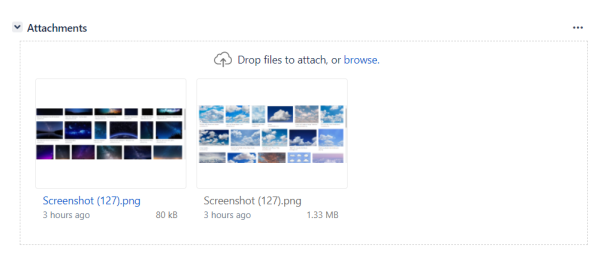</div>

In the image below, inline image added previously in the description field replaced with the latest one having the same name.

<div align="center">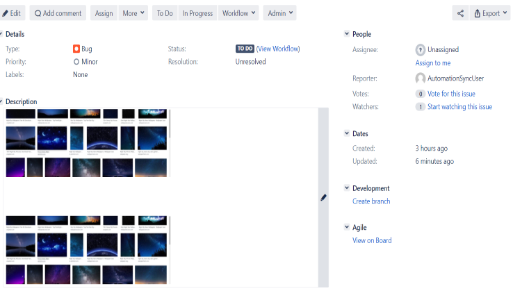</div>

* While synchronizing inline images from Jira to another system, images are visible with their actual size in target synchronized field content, irrespective of their size visible in Jira field content.
* While synchronizing inline images from other systems to Jira, images are visible with their actual size in Jira synchronized field content, irrespective of their size visible in source field content.

### Mapping for Entity mention field

* When Jira is configured as source system in the integration and its field/comment type is WIKI or any external plugin is enabled like Jeditor to render as HTML, then the embedded entity link references will be translated as per mention sync option.
* \{{ spaceName \}} will translate and synchronize those entity link references which are matching following text format as per mention sync option configured in mapping.
  * When field is of Type Wiki and Jira is Cloud then \{{ spaceName \}} will translate those entity link references which are matching text **\[link display|{jira-server-url}/browse/{project-key}-{entityId}|smart-link]**
    * For example Description: "Sample text \[https://opshub.atlassian.net/browse/PROJ1-101|https://opshub.atlassian.net/browse/PROJ1-101|smart-link]"
  * When field is of Type Wiki and Jira is On-Premise then \{{ spaceName \}} will translate those entity link references which are matching text **\[link display|{jira-server-url}/browse/{project-key}-{entityId}]**
    * For example Description: "Sample text \[http://jira-local:8080/browse/PROJ1-101|http://jira-local:8080/browse/PROJ1-101]"
  * When Jeditor plugin is enabled on Jira end system to render field type as HTML then \{{ spaceName \}} will translate those entity link references which are matching text **{jira-server-url}/browse/{project-key}-{entityId}**
    * For example Description is "Sample text" or Description is "Sample text"
* Click on [**Mention Sync Setting**](../integrate/mapping-configuration.md#mention-setting) to know more about entity mention mapping and synchronization behavior in general.

## Relationships

### R4J Plugin

#### Overview

OpsHub Integration Manager supports synchronization for R4J links \[R4J Child Link and R4J Parent Link] so that user can synchronize the relationship similar to how they are in R4J and can achieve the structure for Jira issues similar to what is visible in R4J view.

#### Known behavior

**Common \[Jira Cloud and on Prem]:**

* **When Jira is Source system**: If any change \[Add/Update/Remove] is made to the links \[R4J Child Link and R4J Parent Link], neither it updates the 'field name' of the entity nor it generates a revision. Hence, such changes will be synchronized to target system with next update \[which reflects on 'update on time'] on the entity.
* **When Jira is target system:**
  * If an entity is to be added in R4J view through synchronization, but its Parent entity is still not synchronized through OIM or Parent entity details are not coming from source system, then this entity will not be visible in R4J view. It will only be visible when the Parent entity is synchronized through OIM and added to R4J view. The user can configure 'Default LInk' `<Link>` in case they want to bring such entities under a specific parent in R4J structure.
    * For example, Target Lookup query for Default Link Configuration would be `id=@r4j_folder_id@`. Where the "r4j\_folder\_id" should contain the internal id of the folder which needs to be looked up. In case of root folder the id should be set to `-1_ROOT`.

<div align="center"></div>

* If entity is to be deleted from R4J view through synchronization, that entity will be shifted to Root folder \[i.e., a top most folder which is generally having same name as project name] within R4J view rather than its deletion from view. The removal from R4J view will remove the entity along with all its children from the view. If the user wants to add the removed entity back to the view, they will have to re-add all its child entities again. Hence, adding entity to Root level can save this trouble for user.

***

### Web Link

**Overview**

* \{{ spaceName \}} supports Web Link as External/Hyperlink for synchronization with Jira entities when Jira is Source and/or Target End point.
* In Relationship Mapping, **Web Link** link type needs to be selected for External Link Synchronization.

<div align="center"></div>

**Advance UseCase**

* Following is the working advance relationship configuration for the case when a Standard Link in source is mapped to Web Link in Target.
* For demonstration Jama Connector (does not support External Link) is considered as source and Jira (supports External Link) is considered as target.
* Given below is a **sample advanced mapping** for synchronizing linked entities of type **Defect** as **Web Link** along with additional properties.

```xml
<OHEntityReferences>
  <xsl:variable xmlns:xsl="http://www.w3.org/1999/XSL/Transform" name="nonDefaultLinks" as="item()*">
    <Item targetLinkType="Web-space-Link">Related to (Downstream)</Item>
    <Item targetLinkType="Web-space-Link">Children</Item>
    <Item targetLinkType="Web-space-Link">Caused by (Downstream)</Item>
  </xsl:variable>
  <xsl:variable xmlns:xsl="http://www.w3.org/1999/XSL/Transform" name="entityTypeMapping" as="item()*">
    <Item targetEntityType="Bug">BUG</Item>
    <Item targetEntityType="Bug">STY</Item>
    <Item targetEntityType="Bug">REQ</Item>
  </xsl:variable>
  <xsl:variable xmlns:xsl="http://www.w3.org/1999/XSL/Transform" name="defaultLinkWithSourceLinks" as="item()*"/>
  <xsl:variable xmlns:xsl="http://www.w3.org/1999/XSL/Transform" name="defaultLinkWithOH_DEFAULT" as="item()*"/>
  <xsl:variable xmlns:xsl="http://www.w3.org/1999/XSL/Transform" name="entityReferencecontext" select="/SourceXML/updatedFields/Property/OHEntityReferences/OHEntityReference"/>
  <xsl:variable xmlns:xsl="http://www.w3.org/1999/XSL/Transform" name="linksToBeCarriedFromSourceEvent" as="item()*">
    <xsl:for-each select="$nonDefaultLinks">
      <xsl:variable name="currentLinkType" select="."/>
      <xsl:if test="$entityReferencecontext/linkType[text()=$currentLinkType]">
        <xsl:if test="$entityReferencecontext[linkType[text()=$currentLinkType]]/links/EAILinkEntityItem">
          <Item targetLinkType="{@targetLinkType}">
            <xsl:value-of select="."/>
          </Item>
        </xsl:if>
      </xsl:if>
    </xsl:for-each>
  </xsl:variable>
  <xsl:variable xmlns:xsl="http://www.w3.org/1999/XSL/Transform" name="linksToBeAddedAsDefault" as="item()*">
    <xsl:for-each select="$defaultLinkWithOH_DEFAULT">
      <Item lookupQuery="{@lookupQuery}" entityType="{@entityType}">
        <xsl:value-of select="."/>
      </Item>
    </xsl:for-each>
    <xsl:for-each select="$defaultLinkWithSourceLinks">
      <xsl:variable name="currentLinkType" select="."/>
      <xsl:if test="not($linksToBeCarriedFromSourceEvent[text() = $currentLinkType] = $currentLinkType)">
        <Item lookupQuery="{@lookupQuery}" entityType="{@entityType}">
          <xsl:value-of select="./@targetLinkType"/>
        </Item>
      </xsl:if>
    </xsl:for-each>
  </xsl:variable>
  <xsl:for-each xmlns:xsl="http://www.w3.org/1999/XSL/Transform" select="$linksToBeCarriedFromSourceEvent">
    <xsl:variable name="currentLinkType" select="."/>
    <op_list>
      <xsl:element name="{@targetLinkType}">
        <xsl:for-each select="$entityReferencecontext[linkType=$currentLinkType]/links/EAILinkEntityItem">
          <xsl:element name="{concat('_',position())}">
            <xsl:element name="EntityType">
              <xsl:variable name="sourceEntityType" select="entityType"/>
              <xsl:value-of select="$entityTypeMapping[text()=$sourceEntityType]/@targetEntityType"/>
            </xsl:element>
            <xsl:element name="GlobalId">
              <xsl:value-of select="linkGlobalId"/>
            </xsl:element>
            <xsl:element name="LinkAddedDate">
              <xsl:value-of select="linkAddedDate"/>
            </xsl:element>
            <xsl:element name="LinkedID">
              <xsl:value-of select="concat('https://hostname.jamacloud.com/perspective.req#/items/',entityInternalId,'/?projectId=60')"/>
            </xsl:element>
            <xsl:element name="IsExternalLink">
              <xsl:value-of select="'true'"/>
            </xsl:element>
            <xsl:element name="ExternalLinkUrl">
              <xsl:value-of select="externalLinkUrl"/>
            </xsl:element>
            <xsl:element name="EntityLinkComment">
              <xsl:value-of select="linkComment"/>
            </xsl:element>
			<xsl:element name="relationship">
              <xsl:value-of select="'causes'"/>
            </xsl:element>
			<xsl:element name="application.type">
              <xsl:value-of select="'Jama'"/>
            </xsl:element>
			<xsl:element name="application.name">
              <xsl:value-of select="'Jama'"/>
            </xsl:element>
			<xsl:element name="object.summary">
              <xsl:value-of select="'Jama Entities as external Links'"/>
            </xsl:element>
			<xsl:element name="object.icon.url16x16">
              <xsl:value-of select="'https://upload.wikimedia.org/wikipedia/commons/f/f0/Jama-Logo.png'"/>
            </xsl:element>
			<xsl:element name="object.icon.title">
              <xsl:value-of select="'Jama'"/>
            </xsl:element>
			<xsl:element name="object.status.resolved">
              <xsl:value-of select="'false'"/>
            </xsl:element>
			<xsl:element name="object.status.icon.title">
              <xsl:value-of select="'Object Status Icon Title'"/>
            </xsl:element>
			<xsl:element name="object.status.icon.url16x16">
              <xsl:value-of select="'Object status icon url'"/>
            </xsl:element>
			<xsl:element name="object.status.icon.link">
              <xsl:value-of select="'Object status icon link'"/>
            </xsl:element>
            <xsl:if test="order!=''">
              <xsl:element name="order">
                <xsl:value-of select="order"/>
              </xsl:element>
            </xsl:if>
            <xsl:if test="id!=''">
              <xsl:element name="id">
                <xsl:value-of select="id"/>
              </xsl:element>
            </xsl:if>
            <xsl:for-each select="linkProps/Property">
              <xsl:for-each select="*">
                <xsl:element name="{name(.)}">
                  <xsl:value-of select="."/>
                </xsl:element>
              </xsl:for-each>
            </xsl:for-each>
          </xsl:element>
        </xsl:for-each>
      </xsl:element>
    </op_list>
  </xsl:for-each>
  <xsl:for-each xmlns:xsl="http://www.w3.org/1999/XSL/Transform" select="$linksToBeAddedAsDefault">
    <op_list>
      <xsl:element name="{.}">
        <xsl:element name="_1">
          <xsl:element name="EntityType">
            <xsl:value-of select="@entityType"/>
          </xsl:element>
          <xsl:element name="LookupQuery">
            <xsl:value-of select="@lookupQuery"/>
          </xsl:element>
        </xsl:element>
      </xsl:element>
    </op_list>
  </xsl:for-each>
</OHEntityReferences>
```

**Key Points to be Noted for advance relationship mapping**

* The URL of the incoming entity of Jama needs to be formed with appropriate projectID under the element name **LinkedID**
  * Replace the text **https://hostname.jamacloud.com/** with your instance URL of Jama.
  * Replace the text **/?projectId=60** with your project Id i.e, **/?projectId=**
  * Please note that entityInternalId will be automatically picked up. There is no need to explicitly specify it.
* In order to consider the incoming link as external link, it is mandatory to set property with element name **IsExternalLink** to true.
* Jira expects a title for URL. This can be mentioned under the element name **EntityLinkComment**. In case if this property is not provided then url itself will be considered as title of the Web Link.
* Properties mentioned in \[https://developer.atlassian.com/server/jira/platform/using-fields-in-remote-issue-links/ field's list] can be processed via advance configuration.
* Properties in advance configuration are mentioned in **dot(.)** notation according to JSON Key property as per above mentioned documentation.
* For eg. to set **Application Name** field, find the corresponding JSON Key and replace **Jama** to the desired value in advance configuration.

**Known Behaviour**

* Web Link is not supported for Jira Version < 5.0 and won't be supported for below entities, reason being Jira itself not supporting it.
  * Worklog, Folder(r4j), Zephyr Test Cycle, Zephyr Test Execution, Zephyr Folder, Xray Test Execution, Xray Pre-Condition and Sprint.
* Comment handling in case of Web Link is general and not specific to Web Link.

**Known Limitations**

* If any additional property apart from Link Title and Link URL has to be updated, then along with the additional property any one of Link Title or Link URL needs to be updated
  * This needs to done because Link Title and Link URL combined, defines a unique key for Web Link in \{{ spaceName \}}
* Default Link Feature won't be supported in case of Weblink.
* For Weblink synchronization, in Relationship mapping User needs to map at least one Entity Type pair as its mandatory. This Entity Type mapping won’t have any impact on Web Link synchronization.
* Relationship Mapping for Web Link (as Source) to Standard Link (as Target) won't be supported. \[\{{fullurl:OH-Connector-0078\}} Link To Error Doc ]

#### Stagil Assets Link

**Overview**

* \{{ spaceName \}} supports Stagil Assets links bidirectional synchronization.
* In relationship mapping, Stagil Assets link types need to be mapped for link synchronization.

**Known behavior**

* From Jira UI, the Stagil Assets links are visible in custom fields. However, these custom fields are supported as link types in \{{ spaceName \}}.
* The Stagil Assets links will be synchronized based on current state only.
* Reason: API limitation.

### Rank (R4J Plugin)

* Jira R4j Plugin allows to organize the issues in tree structure through **R4J Child Link** and **R4j Parent Link** relationships. The **R4J Child Link** relationship represents the child issues of the issue and **R4J Parent Link** represents the immediate parent of an issue in Jira R4J view.
* To synchronize the issues maintaining the above structure, the user can configure the **R4j Child Link** and **R4j Parent Link** relationship as per the standard [relationship configuration](../integrate/mapping-configuration.md#relationships) Within this structure, to maintain the rank of issues, the user should enable the Rank Synchronization as described in [Rank configuration](../integrate/mapping-configuration.md#configuration) section.

**Known Limitations**:\


* The 'Folder' entity(which is part of structure within Jira R4j) is not supported as of now.
  * Hence, the tree structure will be considered except for the 'Folder' entity. Although, that structure will be considered, which is within the 'Folder' entity.
  * Therefore, the Rank Synchronization feature is supported for all Jira issues except for the 'Folder' entity.
* When Jira is source end system in synchronization:
  * In Jira R4j, when a rank is changed for any issue, neither its **Updated** time is changed nor revision gets generated. Once the operation of the rank change is performed, it is reflected in the target end system upon the next update on the issue, which leads to the change in the **Updated** time of the issue.

### Mapping for Archive Configuration

* When Jira Data Center is the target system, the Archive operation is performed by default in the synchronization of the [Source Delete event](../integrate/source-delete-synchronization.md).
* After the Archive operation is performed by \{{ spaceName \}} in Jira, the entity will be archived in Jira.
* To only enable the Logical Delete operation in the target, "OH Archive" field should be mapped with the default value, "No" in the [Delete Mode](../integrate/mapping-configuration.md#delete-mode) mapping.

### Mapping limitations

If you have mapped custom fields, then:

* No two fields should have the same display name.
* No custom fields should have a display name which is also the internal name of any system field.
* No custom field should have a display name as 'Fix Version', 'fixVersions', 'Version', 'versions', 'Component' or 'components'.

Jira allows users to translate issue types or fields name through Jira User Interface or using external plugins. However, there are certain behavioral limitations with such translations, which are listed below:

* In case user has translated the issue type's name from 'Epic' to 'Feature'. So, the label 'Issues in Epic' will be translated to 'Issues in Feature' on Jira UI. But in \{{ spaceName \}}, mapping configuration for Issue Relationship, the link type will still remain/labeled as 'Issues in Epic'.
* If a field is part of a synchronization and the user translates it later, then that field needs to be re-mapped in the mapping configuration.
* Fields named **Status Category Changed** and **Status Category** were added as system fields in the On-Demand Jira version. We are checking with Atlassian team for more details, such as data type and values for these fields. As of now, synchronization of these fields is not supported.

If any text type field is mapped for entities which do not support history in a bidirectional integration, additional revisions might be synchronized to the other system.\
&#xNAN;_&#x54;o resolve this issue, the text field should be trimmed in advance mapping configuration while writing to Jira._

If you have enabled either Zephyr or Xray Plugin for Jira either as source or target system in \{{ spaceName \}} and mapped field of type **steps/iterations** during field mapping, then you should be aware of the following limitation:

* For fields of data type **steps/iterations**, \{{ spaceName \}} does not support an auto conversion of rich text content like HTML or Wiki content as per data type of target mapped field unlike supports for HTML or Wiki type of field(s). Hence when this type of field is mapped either as the source or target end point, then \{{ spaceName \}} shows the following warning "Rich text content of HTML or Wiki type of field will not be synchronized to target end point in the correct format." It means that the formatted text is either sync in target along with tag or is rendered in a different format. So, to retain the Rich Text content in the target end point, it is required to perform an advance mapping for the content of steps that could be of types like HTML or Wiki. Advance mapping differs as per the content type of source and target end system for the mapped field.\*

1.  Given below is a **sample advanced mapping** from Jira to RALLY for synchronizing **Manual Steps** of **Xray entity** along with formatting:

    ```xml
    <Steps xmlns:xsl="http://www.w3.org/1999/XSL/Transform" xmlns:utils="http://com.opshub.eai.core.utility.OIMCoreUtility">
      <xsl:for-each xmlns:xsl="http://www.w3.org/1999/XSL/Transform" select="SourceXML/updatedFields/Property/Manual-space-Test-space-Steps/com.opshub.eai.TestStep">
        <xsl:element name="{concat('_',order)}">
          <xsl:element name="order">
            <xsl:value-of select="order"/>
          </xsl:element>
          <xsl:element name="step">
            <xsl:value-of select="step"/>
          </xsl:element>
          <xsl:element name="expected">
            <xsl:value-of select="utils:convertWikiToHTML(expected)"/>
          </xsl:element>
          <xsl:element name="description">
            <xsl:value-of select="utils:convertWikiToHTML(description)"/>
          </xsl:element>
          <xsl:element name="calledTestCaseId">
            <xsl:value-of select="calledTestCaseId"/>
          </xsl:element>
          <OHAttachments>
            <xsl:for-each select="SourceXML/updatedFields/Property/OHAttachments/OHAttachment">
              <xsl:element name="{concat('attachment_',position())}">
                <filename>
                  <xsl:value-of select="fileName"/>
                </filename>
                <addedByUser>
                  <xsl:value-of select="addedByUser"/>
                </addedByUser>
                <contentLength>
                  <xsl:value-of select="contentLength"/>
                </contentLength>
                <contentType>
                  <xsl:value-of select="contentType"/>
                </contentType>
                <contentBase64>
                  <xsl:value-of select="contentBase64"/>
                </contentBase64>
                <attachmentURI>
                  <xsl:value-of select="attachmentURI"/>
                </attachmentURI>
                <updateTimeStamp>
                  <xsl:value-of select="updateTimeStamp"/>
                </updateTimeStamp>
                <label>
                  <xsl:value-of select="label"/>
                </label>
                <fileComment>
                  <xsl:value-of select="fileComment"/>
                </fileComment>
                <attachmentReferenceType>
                  <xsl:value-of select="attachmentReferenceType"/>
                </attachmentReferenceType>
                <uniqueCode>
                  <xsl:value-of select="uniqueCode"/>
                </uniqueCode>
                <attachmentType>
                  <xsl:variable name="xPathVariable" select="attachmentType"/>
                  <xsl:value-of select="attachmentType"/>
                </attachmentType>
              </xsl:element>
            </xsl:for-each>
          </OHAttachments>
        </xsl:element>
      </xsl:for-each>
    </Steps>
    ```

````

2. Given below is a **sample advanced mapping** from Jira to RALLY for synchronizing **Zephyr Test Steps** of **Zephyr entities** along with formatting:

```xml
<Steps xmlns:xsl="http://www.w3.org/1999/XSL/Transform" xmlns:utils="http://com.opshub.eai.core.utility.OIMCoreUtility">
  <xsl:for-each xmlns:xsl="http://www.w3.org/1999/XSL/Transform" select="SourceXML/updatedFields/Property/Zephyr-space-Teststep/com.opshub.eai.TestStep">
    <xsl:element name="{concat('_',order)}">
      <xsl:element name="order">
        <xsl:value-of select="order"/>
      </xsl:element>
      <xsl:element name="step">
        <xsl:value-of select="step"/>
      </xsl:element>
      <xsl:element name="expected">
        <xsl:value-of select="utils:convertWikiToHTML(expected)"/>
      </xsl:element>
      <xsl:element name="description">
        <xsl:value-of select="utils:convertWikiToHTML(description)"/>
      </xsl:element>
      <xsl:element name="calledTestCaseId">
        <xsl:value-of select="calledTestCaseId"/>
      </xsl:element>
      <OHAttachments>
        <xsl:for-each select="SourceXML/updatedFields/Property/OHAttachments/OHAttachment">
          <xsl:element name="{concat('attachment_',position())}">
            <filename>
              <xsl:value-of select="fileName"/>
            </filename>
            <addedByUser>
              <xsl:value-of select="addedByUser"/>
            </addedByUser>
            <contentLength>
              <xsl:value-of select="contentLength"/>
            </contentLength>
            <contentType>
              <xsl:value-of select="contentType"/>
            </contentType>
            <contentBase64>
              <xsl:value-of select="contentBase64"/>
            </contentBase64>
            <attachmentURI>
              <xsl:value-of select="attachmentURI"/>
            </attachmentURI>
            <updateTimeStamp>
              <xsl:value-of select="updateTimeStamp"/>
            </updateTimeStamp>
            <label>
              <xsl:value-of select="label"/>
            </label>
            <fileComment>
              <xsl:value-of select="fileComment"/>
            </fileComment>
            <attachmentReferenceType>
              <xsl:value-of select="attachmentReferenceType"/>
            </attachmentReferenceType>
            <uniqueCode>
              <xsl:value-of select="uniqueCode"/>
            </uniqueCode>
            <attachmentType>
              <xsl:variable name="xPathVariable" select="attachmentType"/>
              <xsl:value-of select="attachmentType"/>
            </attachmentType>
          </xsl:element>
        </xsl:for-each>
      </OHAttachments>
    </xsl:element>
  </xsl:for-each>
</Steps>
````

3. Given below is a **sample advanced mapping** from RALLY to Jira for synchronizing **Steps** of **RallyDev Test Case** to **steps** of **Xray Test entity** along with formatting:

```xml
<steps>
  <xsl:for-each xmlns:xsl="http://www.w3.org/1999/XSL/Transform" select="SourceXML/updatedFields/Property/Steps/com.opshub.eai.TestStep">
    <xsl:element name="{concat('_',order)}">
      <xsl:element name="order">
        <xsl:value-of select="order"/>
      </xsl:element>
      <xsl:element name="id">
        <xsl:value-of select="id"/>
      </xsl:element>
      <xsl:element name="step">
        <xsl:value-of select="step"/>
      </xsl:element>
      <xsl:element name="expected">
        <xsl:value-of select="utils:convertHTMLToWiki(expected)"/>
      </xsl:element>
      <xsl:element name="description">
        <xsl:value-of select="utils:convertHTMLToWiki(description)"/>
      </xsl:element>
      <xsl:element name="calledTestCaseId">
        <xsl:value-of select="calledTestCaseId"/>
      </xsl:element>
      <OHAttachments>
        <xsl:for-each select="attachments/OHAttachment">
          <xsl:element name="{concat('attachment_',position())}">
            <filename>
              <xsl:value-of select="fileName"/>
            </filename>
            <addedByUser>
              <xsl:value-of select="addedByUser"/>
            </addedByUser>
            <contentLength>
              <xsl:value-of select="contentLength"/>
            </contentLength>
            <contentType>
              <xsl:value-of select="contentType"/>
            </contentType>
            <contentBase64>
              <xsl:value-of select="contentBase64"/>
            </contentBase64>
            <attachmentURI>
              <xsl:value-of select="attachmentURI"/>
            </attachmentURI>
            <updateTimeStamp>
              <xsl:value-of select="updateTimeStamp"/>
            </updateTimeStamp>
            <label>
              <xsl:value-of select="label"/>
            </label>
            <fileComment>
              <xsl:value-of select="fileComment"/>
            </fileComment>
            <attachmentReferenceType>
              <xsl:value-of select="attachmentReferenceType"/>
            </attachmentReferenceType>
            <uniqueCode>
              <xsl:value-of select="uniqueCode"/>
            </uniqueCode>
            <attachmentType>
              <xsl:variable name="xPathVariable" select="attachmentType"/>
              <xsl:value-of select="attachmentType"/>
            </attachmentType>
          </xsl:element>
        </xsl:for-each>
      </OHAttachments>
    </xsl:element>
  </xsl:for-each>
</steps>
```

## Integration Configuration

Set a time to synchronize data between Jira and the other system to be integrated. Also, define parameters and conditions, if any, for integration.

Click [Integration Configuration](../integrate/integration-configuration.md) to learn the step-by-step process to configure integration between two systems.

<div align="center"></div>

### Criteria Configuration

If you want to specify conditions for synchronizing an entity between Jira and the other system to be integrated, you can use the Criteria Configuration feature.\
Go to Criteria Configuration section on [Integration Configuration](../integrate/integration-configuration.md) page to learn in detail about Criteria Configuration.

To configure criteria in Jira, integration needs to be created with Jira as the source system. Set the **Query** as per Jira JQL Format. For example: **Priority = "Must"**

* To know more about JQL query in Jira refer this link: [JQL in Jira](https://confluence.atlassian.com/jirasoftwareserver0713/advanced-searching-965542847.html)
* See the sample snippets below of how the JQL queries can be used as criteria in \{{ spaceName \}}.

**Criteria samples**

| **Field Type**      | **Criteria Description**                                      | **Criteria Snippet**                           |
| ------------------- | ------------------------------------------------------------- | ---------------------------------------------- |
| **Lookup**          | Synchronize all entities which have certain value in Lookup   | `Priority = "Critical"`                        |
| **Date**            | Synchronize all entities created after certain date           | `created >= "2018-04-14"`                      |
| **Text**            | Synchronize all entities which contains 'UI' in Summary field | `summary ~ "UI"`                               |
| **User**            | Synchronize all entities which was created by user 'Robert'   | `creator = "Robert"`                           |
| **User and Lookup** | Created by 'Robert' and has 'Priority' as 'Critical'          | `creator = "Robert" and Priority = "Critical"` |
| **Lookup or Text**  | Has Priority 'Critical' or has 'UI' in 'Summary'              | `Priority = "Critical" or summary ~ "UI"`      |

### Target LookUp Configuration

Provide Query in Target Search Query field such that it is possible to search the entity in the Jira as a destination system.\
In the target search query field, you can provide a placeholder for the source system's field value in the `@` symbol.

Go to **Search in Target Before Sync** section on [Integration Configuration](../integrate/integration-configuration.md) page for more details.

**Example**:\
If `TargetCustomField = "@source_system_id@"`, `@source_system_id@` will be substituted with the actual source value before querying Jira.

**Target lookup query samples**

| **Field Type**      | **Target Lookup Use Case**                     | **Snippet**                                                                                               |
| ------------------- | ---------------------------------------------- | --------------------------------------------------------------------------------------------------------- |
| **Text**            | Source ID in `RemoteEntityIdFieldText` field   | `"RemoteEntityIdFieldText" ~ "@source_system_id@"`                                                        |
| **Lookup**          | Source ID in `RemoteEntityIdFieldLookup` field | `"RemoteEntityIdFieldLookup" = "@source_system_id@"`                                                      |
| **Lookup or Text**  | Source ID in either field                      | `"RemoteEntityIdFieldLookup" = "@source_system_id@" or "RemoteEntityIdFieldText" ~ "@source_system_id@"`  |
| **Lookup and Text** | Source ID in both fields                       | `"RemoteEntityIdFieldLookup" = "@source_system_id@" and "RemoteEntityIdFieldText" ~ "@source_system_id@"` |

#### Target Lookup Query for R4J Folder Entity

* \{{ spaceName \}} supports target lookup query on folder internal ID.
* Format: `id=@other_system_field@`
* For root folder, use: `-1_ROOT`

#### Target Lookup for Zephyr Entities

Target Lookup is supported for **Test**, **Test Cycle**, and **Test Execution** entities when Jira's deployment type is **Cloud**.

* **Test Entity**\
  Refer to [Target LookUp Configuration](jira.md#target-lookup-configuration)
* **Test Cycle Entity**
  * Target lookup on cycle internal ID
  * Format: `id=@cycleId@`
  * Refer to [Find Test Cycle Id](jira.md#find-test-cycle-id)
* **Test Execution Entity**
  * Limited parameters supported
  * Example: `executionStatus=@State@`
  * [Zephyr ZQL Parameters](https://support.smartbear.com/zephyr-squad-cloud/docs/execute/zql.html)

#### Target Lookup for QMetry Entities

Target Lookup is supported for **Test Case**, **Test Run**, **Test Scenario**, and **QMetry Test Execution** entities.

* **Test Case, Test Run, and Test Scenario**\
  Refer to [Target LookUp Configuration](jira.md#target-lookup-configuration)
* **QMetry Test Execution Entity**\
  Example:

```json
{
  "Test Run": {
    "key": "summary",
    "operator": "~",
    "value": "'@Name@'"
  },
  "Test Case": {
    "key": "key",
    "operator": "=",
    "value": "@Remote ID@"
  }
}
```

### Add comment interval

* In case the number of comments to be synchronized to Jira is high or you observe issues with ordering of comments in Jira, you can define an interval (in milliseconds) to be added between addition of two comments in Jira.
* To add this interval, please navigate to **Override parameters for write operations(Destination)** in Entity level advance configurations.
*   As shown in below image, please specify the interval (in milliseconds) in field **Jira add comment interval**. The maximum acceptable value for this field is 2000 (milliseconds).

    
* Default value for this field is 0 milliseconds.
* Even though you specify this interval in **Jira add comment interval** field, it will be added only when there are multiple comments to be added to Jira and the time difference (in milliseconds) between the last comment added and the current comment is less than the interval specified in the field. For single comment, this interval won't be added.
* Please use this field only if absolutely necessary since it will impact overall performance.

### Fetch Mapped Data Only

If you want to fetch only those fields and data which are used in mapping configurations for synchronizing an entity between Jira and the other system to be integrated, you can use the **Fetch Mapped Data Only** feature.\
Go to **Fetch Mapped Data Only** section on [Integration Configuration](../integrate/integration-configuration.md) page to learn in detail about this configuration.

### Integration limitations

* Jira allows users to translate issue types or fields name through Jira User Interface or using external plugins. However, there are certain behavioral limitations with such translations, which are listed below:
  * History synchronization will not be maintained for the changes done prior to the last translation, for the translated fields/Link type.
* OIM does not support projects with `" and \` characters in their project names.
* Jira version 8.7.0 onwards, [user can be anonymized](https://confluence.atlassian.com/adminjiraserver/anonymizing-users-992677655.html). So **\{{ spaceName \}}** can't synchronize data of such users based on their information that existed before user was anonymized. For example: If a Jira user 'John Doe' was anonymized, Jira will convert its username to an alias such as 'jirauser1001'. Hence, email or user-based lookup won't work for user fields with such user value.
* When R4J plugin is enabled for your project, an additional field named **Path(R4J)** will be available (as a ReadOnly Field) for synchronization. Editing this field will be only synchronized to target with Next Update on Issue which modifies Issue's 'Updated'.
* In Jira, if the project key of the project \[configured for synchronization] has been changed, **\{{ spaceName \}}** server needs to be restarted.
* When Jira is the source system and Jira's deployment mode is **Cloud**:
  * Synchronization of **Child issues** link type is not supported.
    * Reason: API limitation

## Entity specific information

### Sprint entity

In case of Sprint entity:

* There are two lookup fields available for mapping the boards:
  * **Origin Board ID**
  * **Origin Board Name**
* **\{{ spaceName \}}** allows for the selection of either field separately, but not both concurrently.
* If you have unique board names, it is easy to use the Origin Board Name field for mapping as you can directly match the board name without the need for additional value mapping.
* However, if there are multiple boards with the same name, you can use the Origin Board ID field, which contains values in form of `"BoardId:::BoardName"`, uniquely identifying the boards based on their ID.
* Select boards from the list for which Sprints will be polled and synchronized to the target system. For doing so:
  * Select the **Entity level mandatory settings** 
  * From the advanced configuration, search and then select the boards for which the sprint needs to be synchronized.
  * When `-All Boards-` has been selected then all sprints of all boards will be polled and synchronized to the target system.

### Folder(R4J) entity \[Jira On Premise]

#### Overview

* The [R4J plugin](https://easesolutions.atlassian.net/wiki/spaces/REQ4J/pages/5406729/User+Guide) allows user to organize entity within Folder to achieve a tree structure for Jira issues.
* **\{{ spaceName \}}** supports synchronization of this Folder entity \[which will be visible as entity type `Folder(R4J)` while user is configuring an integration with Jira system].
* The entity type `Folder(R4J)` will be visible only for Jira on-premise instances.
* To achieve the tree structure, through synchronization user needs to configure the [Relationships (R4J Plugin)](jira.md#relationships-r4j-plugin) and [Rank (R4J Plugin)](jira.md#rank-r4j-plugin) as well.

#### Root Folder synchronization

* When R4J plugin is enabled in a project, a root folder with the same name as the project is automatically created and visible on Jira R4J view.
* The root folder ID in **\{{ spaceName \}}** is `-1_ROOT`.
*   **\{{ spaceName \}}** synchronizes the root folder similar to any other folders available/created within R4J. In below example, 'TestR4J' is a Root Folder and rest are the custom folders created by User.

    
*   If no new entity needs to be created in the target corresponding to the root folder, then, one can configure target lookup query in the target system to synchronize the root folder with the existing entity in target. The structure will be created as shown below.

    

#### Prerequisites

* `Folder(R4J)` entity will be only available for synchronization if R4J plugin is enabled for project.\
  To enable R4J plugin for your project please refer [steps](https://easesolutions.atlassian.net/wiki/spaces/REQ4J/pages/40599560/Managing+Projects).

#### Known limitations

Below functionality is not available for Folder(R4J) on end system itself, hence they are not supported for synchronization:

Comment

* Synchronization of below functionality is not supported due to API limitations/issues:
* History/Revisions, Criteria-based synchronization, Inline image, Numbering values\
  (_To understand what does numbering mean for a folder please refer_ [_R4J Folder numbering_](jira.md#r4j-folder-numbering)).
* Target Lookup is supported only on Folder internal ID and `=` operator.\
  For more information refer [Target lookup query for R4J Folder Entity](jira.md#target-lookup-query-for-r4j-folder-entity). Limitations of relationship between Folder(R4J) entity and Jira issues:
* From Issues synchronization, **Cross Project relationship is not supported**.\
  So if an Issue is added/linked into a Folder of a different Project, synchronization will consider the folder of same project \[Corresponding ID of same project will be considered].\
  To avoid such issue, you can synchronize the relationship from Folder synchronization.
* For synchronization of Relationship from Issues, the Issue needs to be updated. Other Limitations:
* The statistics of child issues status and issue types available within folder is not supported currently.

***

### Worklog entity

Jira's time tracking feature enables users to record the time they spend working on issues by creating worklogs.

#### Ways to sync worklog

**Sync worklog as fields of the parent entity**

If you want to sync worklog as fields of the parent entity, then use the following fields during field mapping of the parent entity:

| **Worklog Field Name** | **Data Type** | **Is Read-Only?** | **Description**                             |
| ---------------------- | ------------- | ----------------- | ------------------------------------------- |
| Original Estimate      | Timeunit      | No                | Time estimated to complete the work         |
| Remaining Estimate     | Timeunit      | No                | Hours left to complete the work             |
| Time Spent             | Timeunit      | No                | Time spent working on one Worklog           |
| Worklog Author         | User          | Yes               | User who logged the work                    |
| Worklog Date Started   | Date          | No                | Date to start tracking time spent on issues |
| Worklog Date Created   | Date          | Yes               | Date when Worklog was created               |
| Worklog Date Updated   | Date          | Yes               | Date when Worklog was updated               |

> **Note**: Turn off the **Conflict Detection** flag for these fields and turn on the **Overwrite** flag when configuring field mapping.

**Known Limitation of this approach**

* Conflict Detection will not work on worklog fields.
* Overwrite flag should be turned on for worklog fields during field mapping configuration.
* In this approach, Worklog fields are not synchronized one-to-one, but an overall roll-up effect is maintained.\
  This means the total time spent will be matching the parent entity level.
* This approach can be used only for **uni-directional sync**.\
  Bi-directional sync with this approach may result in inconsistent state in end-systems for worklog-related data.
* Update on worklog fields will be synchronized only when there is change in **Time Spent** field.\
  This means, updating only worklog author will not trigger any update.

**Sync worklog as different entity**

Worklog is a dependent entity; therefore, it always requires a parent entity.\
So, field mapping and integration configuration need to be done as described in the subsequent section.

#### Field mapping and integration

If you want to sync worklog as a different entity then use the following fields during field mapping of worklog entity:

| **Worklog Field Name** | **Data Type** | **Is Read-Only?** | **Description**                                     |
| ---------------------- | ------------- | ----------------- | --------------------------------------------------- |
| Worklog Create Author  | User          | Yes               | User who logged the work                            |
| Worklog Date Created   | Date          | Yes               | Date when Worklog was created                       |
| Worklog Date Started   | Date          | No                | Date to start tracking time spent working on issues |
| Worklog Date Updated   | Date          | Yes               | Date when Worklog was updated                       |
| Projects               | Lookup        | No                | All Jira projects accessible to user                |
| Time Spent             | Timeunit      | No                | Time spent working on one Worklog                   |
| Worklog Update Author  | User          | Yes               | User who updated the work                           |
| Work Description       | Text          | No                | Description of logged work                          |
| Worklog.Parent         | Text          | Yes               | Display id of worklog's parent entity               |

> When it is required to sync the worklog as different entity, Jira mandatorily asks for parent entity. For this mandatory requirement, we need to do the parent linkage during mapping creation as given in the screenshots below.

 

> During integration configuration when **worklog** is selected as the entities to sync, choose **Entity level mandatory settings** to select parent entity/entities whose Worklogs need to be synchronized.

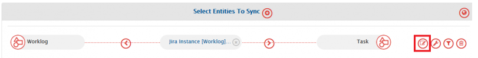 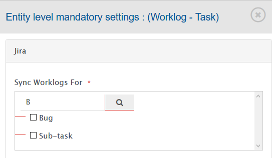

***

#### Synchronize Deleted Worklogs

Create a separate field mapping for synchronizing deleted worklogs with only one field, such as **Time Spent**. Please do not map other fields. Change the workflow related configuration of the integration by going to **Workflow Association** of **Entity level mandatory settings** as shown in the screenshot below.


***

#### Known Limitation of this Approach

* Worklogs do not support Criteria configuration.
* 'Delete Worklog' is not supported for Jira as a target system.
* Jira accepts only positive numbers for **Time Spent** field. Sync will result in failure when `0` or negative values are passed.
* Deleted worklogs will synchronize only after some other update.
* Synchronization of deleted worklogs is supported for versions greater than or equal to 7.0.0 due to Jira's API limitations. It means, worklog efforts will not match for Jira versions older than 7.0.0. We recommend not to delete the worklogs or not to upgrade to newer versions.

***

#### Default Behavior

* When Jira is the target system, worklog will be created by the integration user.
* If **Worklog Start Date** is not mapped and Jira is the target system, time tracking will start from the current date and time.

***

### Zephyr Plugin Entities

* \{{ spaceName \}} supports three Zephyr entities: Test, Test Cycle, Test Execution, Folder.
* The supported versions of Zephyr plugin with ZAPI plugin are specified in [Systems Supported List](../systemsupported/systems-supported-list.md)).

> **Note** For Zephyr Cloud, ZAPI plugin is not required.

#### Prerequisites

**Synchronization of Zephyr entities with Zephyr plugin version 5.4.0.x and above**

* **Applicable When:** If integration is configured with an instance of Jira system (with Zephyr plugin version 5.4.0.x and above) for **Test Cycle** entity.
* **Reason:** There has been sorting related changes in Zephyr plugin due to which some specific changes are required in Zephyr's general configuration.\
  For more details, refer to [Zephyr 5.4.0 Release Notes](https://zephyrdocs.atlassian.net/wiki/spaces/ZFJ0500/pages/1061421110/All+Release+Notes)
* **Actions:** Change the configuration for Zephyr plugin in Jira and set option **Sort cycles and folder order** to **Custom order**.\
  Refer to this document: [Reorder Test Cycles and Folders](https://zephyrdocs.atlassian.net/wiki/spaces/ZFJ0500/pages/1247739905/Reorder+Test+Cycles+and+Folders#Change-Reorder-Option)

**Synchronization of Zephyr Cloud entities**

* SmartBear provides \[a jar] for the authentication of Zephyr entities via JWT token.\
  Follow the steps below for placing this jar in OpsHub Installation Directory:
  * Navigate to `<OpsHub Installation Directory>/OpsHubServer/bundle_config/ZEPHYR_LIB`.
  * Place `[this jar]` in the `ZEPHYR_LIB` folder.

***

#### Supported Relationships

Below are the supported relationships for **Zephyr** entities:

| <p><strong>Mapped Entity Type</strong><br>[Link From]</p> | <p><strong>Entity Type in Relationship Configuration</strong><br>[Link To]</p> | **Relationship Type**             |
| --------------------------------------------------------- | ------------------------------------------------------------------------------ | --------------------------------- |
| Test Cycle                                                | Test                                                                           | Test-Case Linkage                 |
| **Test Execution**                                        | Test                                                                           | Test-Case Linkage **(Mandatory)** |
|                                                           | Test Cycle                                                                     | Parent **(Mandatory)**            |
|                                                           | Folder (Zephyr only, Jira Cloud)                                               | Parent **(Mandatory)**            |
|                                                           | Entity (Any issue type)                                                        | Defect-Linkage                    |
| **Folder (Zephyr)**                                       | Test Cycle                                                                     | Parent **(Mandatory)**            |
|                                                           | Test                                                                           | Test-Case Linkage                 |

> **Note**: Test entity and either Test Cycle or Folder (Zephyr) entity linkages must be configured to synchronize the Test Execution entity.

***

#### Test Execution

* The Test Execution entity consists of **Step Results**.
* The formatted text will not come in the target during the synchronization of Step Results' comment.
* The advanced mapping is required to be performed for synchronization of formatted text.
* Below is a **sample advanced mapping** from Jira to Jira for synchronizing **Step Results** of **Test Execution** entity along with formatting:

```xml
<stepResult xmlns:xsl="http://www.w3.org/1999/XSL/Transform" xmlns:utils="http://com.opshub.eai.core.utility.OIMCoreUtility">
   <xsl:for-each select="SourceXML/updatedFields/Property/stepResult/Property/*">
   <xsl:element name="{concat('_',position())}">
   <xsl:element name="position">
    <xsl:value-of select="position()" />
   </xsl:element>
   <xsl:if test="Property/status">
   <xsl:element name="status">
    <xsl:value-of select="Property/status" />
   </xsl:element>
   </xsl:if>
   <xsl:if test="Property/id">
   <xsl:element name="id">
    <xsl:value-of select="Property/id" />
   </xsl:element>
   </xsl:if>
   <xsl:if test="Property/executedBy">
   <xsl:element name="executedBy">
    <xsl:value-of select="Property/executedBy" />
   </xsl:element>
   </xsl:if>
   <xsl:if test="Property/executionId">
   <xsl:element name="executionId">
    <xsl:value-of select="Property/executionId" />
   </xsl:element>
   </xsl:if>
   <xsl:if test="Property/stepAttachments">
   <xsl:element name="OHAttachments">
   <xsl:for-each select="Property/stepAttachments/OHAttachment">
   <xsl:element name="{​​​​concat('attachment_',position())}​​​​">
    <xsl:element name="fileName">
     <xsl:value-of select="fileName" />
    </xsl:element>
    <xsl:element name="addedByUser">
     <xsl:value-of select="addedByUser" />
    </xsl:element>
    <xsl:element name="updateTimeStamp">
     <xsl:value-of select="updateTimeStamp" />
    </xsl:element>
    <xsl:element name="contentLength">
     <xsl:value-of select="contentLength" />
    </xsl:element>
    <xsl:element name="attachmentURI">
     <xsl:value-of select="attachmentURI" />
    </xsl:element>
    <xsl:element name="fileComment">
     <xsl:value-of select="fileComment" />
    </xsl:element>
    </xsl:element>
    </xsl:for-each>
    </xsl:element>
    </xsl:if>
    <xsl:if test="Property/htmlComment">
     <xsl:element name="htmlComment">
      <xsl:value-of select="utils:convertHTMLToWiki(Property/htmlComment)" />
     </xsl:element>
    </xsl:if>
    <xsl:if test="Property/comment">
     <xsl:element name="comment">
      <xsl:value-of select="Property/comment" />
     </xsl:element>
    </xsl:if>
    <xsl:if test="Property/defects">
    <xsl:element name="OHEntityReferences">
    <xsl:element name="links">
    <xsl:for-each select="Property/defects/links/EAILinkEntityItem">
    <xsl:element name="{​​​​concat('_',position())}​​​​">
    <xsl:element name="entityType">
     <xsl:value-of select="entityType" />
    </xsl:element>
   <xsl:element name="entityScopeId">
    <xsl:value-of select="entityScopeId" />
   </xsl:element>
   <xsl:element name="entityCreatedBy">
    <xsl:value-of select="entityCreatedBy" />
   </xsl:element>
    <xsl:element name="entityInternalId">
     <xsl:value-of select="entityInternalId" />
    </xsl:element>
    <xsl:element name="isExternalLink">
     <xsl:value-of select="isExternalLink" />
    </xsl:element>
    <xsl:element name="isProcessed">
     <xsl:value-of select="isProcessed" />
    </xsl:element>
   </xsl:element>
   </xsl:for-each>
   </xsl:element>
   <xsl:element name="removedLinks">
    <xsl:value-of select="OHEntityReference/removedLinks" />
   </xsl:element>
   </xsl:element>
   </xsl:if>
   <xsl:if test="Property/stepId">
    <xsl:element name="stepId">
     <xsl:value-of select="Property/stepId" />
   </xsl:element>
   </xsl:if>
   </xsl:element>
   </xsl:for-each>
  </stepResult>
```

#### Criteria Configuration

**Test Entity**

* Criteria feature is supported for Test entity when Jira's deployment type is **Self-Managed** or **Cloud**.
* To synchronize Test entity based on a criteria, refer to [Criteria Configuration](jira.md#criteria-configuration) section.

**Test Execution Entity**

* Criteria feature is supported for Test Execution entity when Jira's deployment type is **Cloud** only.
  * Navigate to Criteria Configuration section on [Integration Configuration](../integrate/integration-configuration.md) page to learn in detail about Criteria Configuration.
*   To configure criteria in Jira, integration needs to be created with Jira as the source system. Set the **Query** as per **Zephyr ZQL** format. For example, **executionStatus=PASS**.

    * Refer [this](https://support.smartbear.com/zephyr-squad-cloud/docs/execute/zql.html) link to know more about ZQL query in Zephyr.

    > **Note** Only **In Database** criteria storage type is supported for Test Execution entity.

#### Target Lookup

For Target Lookup Configuration of Zephyr entities, refer to [Target lookup for Zephyr Entities](jira.md#target-lookup-for-zephyr-entities) section.

#### Understanding JSON Input

* If the name of Zephyr Test issue type is different than **Test**, change the `displayName` parameter in the JSON input \[provided in the system configuration's Metadata details field].
* Consider the following sample JSON input:

```json
{
	"entities": [
		{
			"internalName": "Test", // If the name of Zephyr Test issue type is different than "Test", then change the displayName accordingly.
			"displayName": "Test",
			"readMechanism": "HISTORY",
			"hasReadSupport": true,
			"hasWriteSupport": true,
			"entityScope": "Global",
			"fields": {
				"system": [],
				"custom": [
					{
						"internalName": "Zephyr Teststep",
						"displayName": "Zephyr Teststep",
						"dataType": "test-step",
						"mandatory": false,
						"historyEnabled": false
					}
				]
			}
		}
	],
	"projects": []
}
```

* Please refer to [Understanding Json Metadata Input](../integrate/system-configuration.md#understanding-json-metadata-input) section for more details on the JSON input.

**Synchronize Custom Fields**

**Test Execution**

* To synchronize custom fields of the Test Execution entity, custom field details should be provided in the JSON input \[provided in the system configuration's Metadata details field].
  * Refer to [Find Zephyr Custom Field Id](jira.md#find-zephyr-custom-field-id) section for the custom field details.
* Consider the following sample JSON input:

```json
{
	"entities": [
		{
			"internalName": "Test", // If the name of Zephyr Test issue type is different than "Test", then change the displayName accordingly.
			"displayName": "Test",
			"readMechanism": "HISTORY",
			"hasReadSupport": true,
			"hasWriteSupport": true,
			"entityScope": "Global",
			"fields": {
				"system": [],
				"custom": [
					{
						"internalName": "Zephyr Teststep",
						"displayName": "Zephyr Teststep",
						"dataType": "test-step",
						"mandatory": false,
						"historyEnabled": false
					}
				]
			}
		},
		{
			"internalName": "Test Execution",
			"displayName": "Test Execution",
			"readMechanism": "NON_TIMESTAMP",
			"hasReadSupport": true,
			"hasWriteSupport": true,
			"entityScope": "Global",
			"fields": {
				"system": [],
				"custom": [ 	// Provide the custom field details of the Test Execution.
					{
						"internalName": "2f73f23b-9da7-497e-b39a-f9cb11842af6", // Provide the "id" of the custom field.
						"displayName": "Zephyr_Text_Field",	  // Provide the "name" of the custom field.
						"dataType": "text",	 // Provide the "dataType" of the custom field. Datatype can be either "text","numeric","date", or "lookup".
						"mandatory": false,
						"historyEnabled": false
					},
					{
						"internalName": "080251ff-b328-491c-8dc1-bc9f45641dbe",
						"displayName": "Zephyr_Multi_Valued_Field",
						"dataType": "lookup",
						"mandatory": false,
						"multiselect": true,		// Set this parameter if the type of field is "Checkbox" or "Select List(multiple choices)"
						"lookUpValues": {
							"1": "Option A",       // Provide the list of available lookup values.
							"2": "Option B",
							"3": "Option C"
						}
					},
					{
						"internalName": "d19ecc14-03a9-4756-ba73-3d66cec71aae",
						"displayName": "Zephyr_DateTime_Field",
						"dataType": "date",
						"mandatory": false,
						"dateFormat": "MM/dd/yyyy HH:mm:ss"  // Date format is required for date type of field. The date format for Date Picker and Date Time Picker is "MM/dd/yyyy" and "MM/dd/yyyy HH:mm:ss" respectively.
					}
				]
			}
		}
	],
	"projects": []
}
```

* Please refer to [Understanding Json Metadata Input](../integrate/system-configuration.md#understanding-json-metadata-input) section for more details on the JSON input.

#### Test Steps

* To synchronize custom fields of Test Steps (field of Test entity), custom field id should be provided in the advance mapping of the Zephyr Teststep field.
* Refer to [Find Zephyr Custom Field Id](jira.md#find-zephyr-custom-field-id) section for the custom field id.
* Given below is a sample advance mapping from Jira to Jira for synchronizing Zephyr Teststep field, including its custom fields:

```xml
<Zephyr-space-Teststep>
	<xsl:for-each xmlns:xsl="http://www.w3.org/1999/XSL/Transform" select="SourceXML/updatedFields/Property/Zephyr-space-Teststep/com.opshub.eai.TestStep">
		<xsl:element name="{concat('_',order)}">
			<xsl:element name="order">
				<xsl:value-of select="order"/>
			</xsl:element>
			<xsl:element name="step">
				<xsl:value-of select="step"/>
			</xsl:element>
			<xsl:element name="expected">
				<xsl:value-of select="expected"/>
			</xsl:element>
			<xsl:element name="description">
				<xsl:value-of select="description"/>
			</xsl:element>
			<xsl:element name="calledTestCaseId">
				<xsl:value-of select="calledTestCaseId"/>
			</xsl:element>
			<xsl:element name="customFieldValues"> <!-- create an element named "customFieldValues" -->
				<xsl:element name="_OHPaddingForInitialInvalidChar_44304f57-1bd4-4fae-9001-f711ae962033">  <!-- If the first character of the custom field id is not an alphabet, "_OHPaddingForInitialInvalidChar_" keyword needs to be added in front of the custom field id. -->
					<xsl:value-of select="additionalFields/__OHPaddingForInitialInvalidChar__44304f57-1bd4-4fae-9001-f711ae962033"/> <!-- This is to get value of the custom field value from source. Here, "__OHPaddingForInitialInvalidChar__" is required. -->
				</xsl:element>
				<xsl:element name="d19ecc14-03a9-4756-ba73-3d66cec71aae">
					<xsl:value-of select="additionalFields/d19ecc14-03a9-4756-ba73-3d66cec71aae"/>
				</xsl:element>
				<xsl:element name="_OHPaddingForInitialInvalidChar_429c5df3-2b3a-479e-bb8f-ee6bf6b694bf">
					<xsl:for-each select="additionalFields/__OHPaddingForInitialInvalidChar__429c5df3-2b3a-479e-bb8f-ee6bf6b694bf/string"> <!-- This block is needed for the custom multi-select and checkbox fields. -->
						<fieldvalue>
							<xsl:value-of select="text()"/>
						</fieldvalue>
					</xsl:for-each>
				</xsl:element>
			</xsl:element>
			<xsl:element name="multiSelectFields">
				080251ff-b328-491c-8dc1-bc9f45641dbe,429c5df3-2b3a-479e-bb8f-ee6bf6b694bf    <!-- Provide comma separated custom multi select and checkbox field ids. -->
			</xsl:element>
			<OHAttachments>
				<xsl:for-each select="SourceXML/updatedFields/Property/OHAttachments/OHAttachment">
					<xsl:element name="{concat('attachment_',position())}">
						<filename>
							<xsl:value-of select="fileName"/>
						</filename>
						<addedByUser>
							<xsl:value-of select="addedByUser"/>
						</addedByUser>
						<contentLength>
							<xsl:value-of select="contentLength"/>
						</contentLength>
						<contentType>
							<xsl:value-of select="contentType"/>
						</contentType>
						<contentBase64>
							<xsl:value-of select="contentBase64"/>
						</contentBase64>
						<attachmentURI>
							<xsl:value-of select="attachmentURI"/>
						</attachmentURI>
						<updateTimeStamp>
							<xsl:value-of select="updateTimeStamp"/>
						</updateTimeStamp>
						<label>
							<xsl:value-of select="label"/>
						</label>
						<fileComment>
							<xsl:value-of select="fileComment"/>
						</fileComment>
						<attachmentReferenceType>
							<xsl:value-of select="attachmentReferenceType"/>
						</attachmentReferenceType>
						<uniqueCode>
							<xsl:value-of select="uniqueCode"/>
						</uniqueCode>
						<attachmentType>
							<xsl:variable name="xPathVariable" select="attachmentType"/>
							<xsl:value-of select="attachmentType"/>
						</attachmentType>
					</xsl:element>
				</xsl:for-each>
			</OHAttachments>
		</xsl:element>
	</xsl:for-each>
</Zephyr-space-Teststep>
```

#### Known Limitations

* When Zephyr plugin is enabled, please ensure you do not have issue-types with the names **Test Execution** or **Test Cycle** or **Folder(Zephyr)** in Jira as they conflict with Zephyr entities name.
* For changes in the test steps to get synchronized, update some basic fields in Jira such as **Summary**.
* Synchronization of attachment of Test Steps (field of Test entity) is not supported.
* For Zephyr as the target system, if the attachment filename contains Windows special characters(/,,",:,\*,?,<,>,|), then attachment will not be added in Zephyr. As a result, the user will encounter a processing failure. This is because Zephyr does not support Windows special characters in filename.
* When Jira's deployment type is **Self-Managed**:
* Synchronization of custom fields of Test Execution entity and Test Steps (field of Test entity) is not supported.
* When Jira's deployment type is **Cloud**:
* Synchronization of attachments of **Test Execution** entity is not supported. This feature will be supported in the upcoming versions of \{{ spaceName \}}.
* Write side support for attachments in the **Step Results** field (part of the **Test Execution** entity) is not available.
* To synchronize custom fields in Zephyr Cloud, custom field id is required.
* **Reason**: Zephyr doesn't provide an API to get the custom field details. Therefore, user needs to provide custom field id to synchronize custom fields. Refer to [Find Zephyr Custom Field Id](jira.md#find-zephyr-custom-field-id) section for the custom field ids.
* To synchronize custom fields of Test Execution entity, refer to \[\[#Test Execution|Synchronize Custom Fields of Test Execution]] section.
* To synchronize custom fields of Test Steps (field of Test entity), refer to [Synchronize Custom Fields of Test Steps](jira.md#test-steps) section.
* Due to API limitation, if the project configured in integration has more than 10000 Test Execution entities, \{{ spaceName \}} will only synchronize the first 10000 entities based on creation date of the Test Execution entity.
* **Folder(Zephyr) entity**
* Target lookup is not supported for Jira cloud. Criteria, Target and Remote Link sync are not supported for Jira on premise.
  * Reason: Zephyr API unavailability.
* Default Link Configuration for link type **Test Cycle Linkage** is not supported.
* **Sprint Id** field synchronization is not supported.
* Folders can be moved across different Test Cycles in Zephyr. However, the synchronization of the movement is not supported by \{{ spaceName \}}. Hence, if any folder movement will occur, then the synchronization will be failed.

### Xray plugin entities

* \{{ spaceName \}} supports following Xray entities:
  * For self-managed system: Test, Test Set, Test Plan, Test Execution, Sub Test Execution, Pre-Condition.\

  * For cloud system: Xray Test, Test Set, Test Plan, Test Execution, Test Run, Precondition.\

* The supported versions of Xray plugin are specified in [Systems Supported List](../systemsupported/systems-supported-list.md).\


#### Jira Self-managed Instance

**Test Entity**

* In Jira Xray, the \[https://docs.getxray.app/display/XRAY/Test test] is a test case. It may either be manual or automated, composed of multiple steps, actions and expected results.

&#x20; **Test Repository Path field**

* Xray v3.0 introduces the \[https://docs.getxray.app/display/XRAY/Test+Repository Test Repository] concept that enables the organizing tests in test repositories(which are same as folders) within a project.
* User can synchronize the tests inside specific test repositories by mapping 'Test Repository Path' field in the mapping configuration. If this field is mapped, the test will be synchronized within selected test repository.
* For the location of Test within test repository, user can map 'Test Repository Path' field in mapping configuration. If Jira \[Xray] is the target system, the Test will be synchronized within the selected test repository path when the 'Test Repository Path' field is mapped.
* The behavior details of 'Test Repository Path' with reference to configuration and synchronization are given below:
* **1-1 value mapping:**
  * The user can do one to one mapping of source and target repositories by configuring the [value mapping](../integrate/mapping-configuratio.md#view-edit-xslt-configurations-options) of Test Repository Path field.
* **When Jira\[Xray] is the source system**, 'Test Repository Path' will contain the test repository full path with '' for hierarchy.
* **When Jira\[Xray] is the target**, the test will get synchronized to the selected test repository if it exists in Xray. If it does not exists on Xray side, it will be automatically created by \{{ spaceName \}}. This is default behavior of Xray plugin which can be changed using the advanced mapping as described [below](jira.md#turn-off-auto-creation-of-folders-repository) .

**Turn off Auto-Creation of Folders/Repository**

\*If the user wants to turn off the auto-creation of the repository in the target system, he/she needs to make a few changes in the [advanced xsl](..integrate/mapping-configuration.md#view-edit-xslt-configurations-options). Scenarios and steps applicable for each scenario are mentioned below:

* **Scenario 1:** For turning off the auto-creation of test repositories, the user can check if the test repository path exists on Jira(Xray) side or not. Based on that, the user can set the value for test repository path. On the contrary, if the path does not exist, the user can use the default repository path. A sample [Advance mapping](../integrate/mapping-configuration.md#view-edit-xslt-configurations-options) for similar case that can be tweaked as required is given below:

```xml
<Test-space-Repository-space-Path xmlns:xsl="http://www.w3.org/1999/XSL/Transform"
  xmlns:lookupUtils="http://com.opshub.eai.mapper.utils.LookupUtility">
    <xsl:variable name="repoPath" select="SourceXML/updatedFields/Property/Test-space-Repository-space-Path"/>
    <xsl:choose>
        <xsl:when test="lookupUtils:isLookupValueValid($workflowId, 'Test Repository Path', $repoPath, null, false(), true(), false())">
            <xsl:value-of select="$repoPath"/>
        </xsl:when>
        <xsl:otherwise>
            <xsl:value-of select="'Default Folder'"/>
        </xsl:otherwise>
    </xsl:choose>
</Test-space-Repository-space-Path>
```

Description

* The XSL mentioned above will synchronize the Test entity in the repository with the same name as that of the source repository only when the repository with the same name and path also exists in the target project, otherwise it will synchronize the Test entity in a repository called "Default Folder".

Also, the user can rename the "Default Folder" as per his/her liking.

* Scenario 2: The user wants to synchronize tests of specific repository and the Tests of remaining repositories should be synchronized to a default repository. For example, the user has configured one-to-one [value mapping](../integrate/mapping-configuration.md#value-mapping) of a few repositories, and the tests that are a part of repositories which are not mapped should move to the default repository.
* To do so, the user can simply set a default repository in the [Default value configuration](../integrate/mapping-configuration.md#default-mapping).

**Manual Test Steps field**

* In the Test entity of Xray, the user can add [test steps](https://docs.getxray.app/pages/viewpage.action?pageId=62267955) which specify the steps to be performed while executing the test case. To synchronize test steps using \{{ spaceName \}}, the user can map the 'Manual Test Steps' field.

**Changes required to synchronize Manual Test Steps**

* When Jira is the source system, a change is required in the advanced mapping of the Manual Test Steps field to synchronize test steps attachments. The steps are given below:

1. Click the  icon of Test Repository Path field to open its [advanced xsl](../integrate/mapping-configuration.md#view-edit-xslt-configurations-options).
2. Replace the following line: \<xsl:for-each select="SourceXML/updatedFields/Property/OHAttachments/OHAttachment"> with this line: \<xsl:for-each select="attachments/OHAttachment">

**Known Limitations**

**When Jira\[Xray] is source system:**

1. For 'Manual Test Step' and 'Test Repository' fields, only current values (present at the time of synchronization) will be synchronized. Historic (Audit/Revisions) values will not be synchronized to target system.
2.  An additional update to any Jira field is required in the following cases:

    * The [test repository](https://docs.getxray.app/display/XRAY/Test+Repository) of a test is updated by dragging and dropping the test into a different repository.
    * When an attachment is added to a manual test step.

    The additional update is required because the history is not generated by Jira when test repository is changed by dragging the test into a different repository (this is not applicable if you manually change the test repository directly from the test by typing the test repository path) or when an attachment is added to Manual Test Step.

* Due to API limitation, synchronization of the 'Parameter' (which can be used in the 'Manual Test Step' field) is not possible.

### Jira Cloud Instance

**Prerequisites**

* When synchronizing Xray Cloud entities, if default name of any of Xray entity is changed, the same information must be provided in system configuration. For more details, refer to [System Configuration](jira.md#system-configuration) section.
  * Default Xray entity names are: Test, Test Set, Test Plan, Test Execution, Test Run, Precondition
* In the Jira Xray, it is recommended not to create any new links with the below-mentioned names. Additionally, any existing link names should not have the below-mentioned link name (in this case, the link type name needs to be changed).
  * Link types: tests, preconditions, testExecutions, testSets, testPlans, testRuns, Xray Test, Test Execution
    * **Reason:** The links above are reserved for the relationship sync in `{{ spaceName }}`.

**Xray Test Entity**

* In Jira, Xray Test is a test case. It can be of three types: Manual, Generic or Cucumber. The manual test case can be composed of multiple steps, and each step can contain actions, data & expected results.
* The manual test steps can be synced through the `steps` field available on the `{{ spaceName }}` field configurations. Refer to [Mapping limitations](jira.md#mapping-limitations) section for reference.
* The calculated value for the status of the Xray Test entity can be synchronized through the `OH_Xray_Test_Status` field, available on `{{ spaceName }}`'s mapping configuration screen.
*   Test Repository paths can be synced using the `folder` field available on the `{{ spaceName }}` field configurations.

    **When Xray entity is the target system:**

    * The `folder` is a lookup field and user can do one-to-one mapping if the repository path is available in the target system. If the repository path is not available, it will be created in the end system and a test entity will be linked to it.
    * To ensure smooth and accurate synchronization of test step results, the `OH_Test_Step_Id` field must be populated in the test case before syncing step results. This step is crucial for correctly mapping and updating step-level results to Xray.

**Test Run Entity**

* In Jira, Test Run is used to sync the test case execution results.
* To sync the step level results in case of the manual test steps, user must configure the `iterations` field available on the `{{ spaceName }}` field configurations.

**Known Limitations**

* **Due to API limitation:**
  * Synchronization of the 'Parameter' (which can be used in the 'steps' field in Xray Test entity) is not possible.
  * Synchronization of the Sub Test Execution entity is not supported.
  * Iteration level status update synchronization is not supported as of now for Test Run entity when the test type is Generic or Cucumber.
* **When Jira \[Xray] is source system:**
  * For Xray Test, Test Execution, Test Set, Test Plan and Precondition entities, criteria will not work on Xray fields. Criteria can be given only on Jira fields as JQL query for these entities.
  * Criteria is not supported for Test Run entity.
  *   For all the Xray fields, only current values (present at the time of synchronization) will be synchronized. Historic (Audit/Revisions) values will not be synchronized to target system.

      * An additional update to any Jira field is required in the following cases:
        * Any Xray field updated in the source system.
        * When an attachment is added to a test step with manual test type.

      An additional update is required because the history is not generated by Jira when the Xray's specific fields are updated in Jira.

      * Test Run entity will be synced without history.
* **When Jira \[Xray] is target system:**
  * If an in-flight failure occurs for the Xray fields during an Xray Test, Precondition, Test Plan, Test Set, or Test Execution entity synchronization, `{{ spaceName }}` will overwrite the data in the target system. Therefore, it is necessary to enable conflict resolution for these fields to ensure proper synchronization.
  * Below links are not supported for create & update. They are only available for read operation:
    * Test Run entity – link types: Xray Test & Test Execution
    * Test Execution entity – link types: testRuns
    * Xray Test entity - link types: testRuns
  * For syncing the `Test Run` entity's step Results, the user should create below custom field of type `Text (Single Line)` with the specific given name in the Xray Test Step which is: `OH_Test_Step_Id`. Refer to [Project Settings: Test Step Fields](https://docs.getxray.app/display/XRAYCLOUD/Project+Settings%3A+Test+Step+Fields) section for details.
  * For syncing the Test Run, this custom field of type `Text (Single Line)` needs to be created in the Test Run: `OH_Last_Update`. Make sure to select all the test types in the `Test Type` selection while creating this field. Refer to [Project Settings: Test Run Custom Fields](https://docs.getxray.app/display/XRAYCLOUD/Project+Settings%3A+Test+Run+Custom+Fields) section for details.
  * For Xray Test, Test Execution, Test Set, Test Plan and Precondition entities, target lookup will not work on Xray fields. Target lookup can be given only on Jira fields as JQL query for these entities.
  * Target lookup is not supported for Test Run entity.

**Known Behavior**

**When Jira \[Xray] is target system:**

* To synchronize the `steps` of the `Xray Test` entity, the `testType` field of the Xray Test must be set to `Manual` type.
  * **Reason:** Test steps can only be added in the Xray Test from UI and API when the test type is set to Manual.
* For Test Run synchronization, the user must configure `Xray Test` & `Test Execution` links and sync these entities (associated with Test Run) before running Test Run integration. Without it, the syncing process cannot be completed.
* For Test Run entities, in `iteration` field, step result `Defects` type of links from source will be synced at the entity level in target system.
* For `Xray Test` and `Test Run` entities, step-level inline attachments/images will be synced at entity level when Jira is the target system.
* For `Xray Test` and `Test Run` entities, step-level attachments will be synced at entity level when Jira is the target system.

### QMetry plugin entities

* `{{ spaceName }}` supports four QMetry entities: Test Case, Test Scenario, Test Run, QMetry Test Execution (Only for QMetry Self-Managed).
* For the supported versions of QMetry plugin, refer to \[../systemsupported/systems-supported-list.md].

### Supported Relationships

Following are the relationships that are supported for **QMetry Self-Managed** entities:

| **Mapped Entity Type** (Link from) | **Entity Type in Relationship Configuration** (Link to) | **Relationship Type** |
| ---------------------------------- | ------------------------------------------------------- | --------------------- |
| Test Scenario                      | Test Case                                               | QMetry TestCase       |
| Test Run                           | Test Case                                               | QMetry TestCase       |
| Test Run                           | Test Scenario                                           | QMetry TestScenario   |
| QMetry Test Execution              | Test Case                                               | QMetry TestCase       |
| QMetry Test Execution              | Test Run                                                | QMetry TestRun        |

#### Default Behavior

* When Jira is the target system in \{{ spaceName \}}, to synchronize the QMetry Test Execution, either Target Lookup or 'QMetry TestCase' linkage with Test Case Entity, and 'QMetry TestRun' linkage with Test Run Entity must be configured.

#### Criteria Configuration

**Test Case, Test Run, and Test Scenario entities**

* Criteria feature is supported for Test Case, Test Run, and Test Scenario entities.
* For more information on how to synchronize Test Case, Test Run, and Test Scenario entities based on criteria, refer to [#Criteria Configuration](jira.md#criteria-configuration) section.

#### Target Lookup

For Target Lookup configuration of QMetry entities, refer to [#Target lookup for QMetry Entities](jira.md#target-lookup-for-qmetry-entities) section.

#### Known Limitations

* When QMetry plugin is enabled, ensure you do not have issue-types with the names **Test Case**, **Test Run**, or **Test Scenario** in Jira as they would conflict with QMetry entities' names.
* To synchronize the changes in test steps field, update some basic fields in Jira.
* To get the changes synchronized in QMetry linkages, update some basic fields in Jira.
* For QMetry Test Execution:
  * When Jira is the source system in \{{ spaceName \}}:
    * Synchronization is not supported.
  * When Jira is the target system in \{{ spaceName \}}:
    * Synchronization of step level result, Bug linkages are not supported.
    * [#Target LookUp Configuration](jira.md#target-lookup-configuration) is only supported to find the unique Test Execution Id.

***

### AIO plugin entities

* \{{ spaceName \}} supports three AIO entities: AIO Test Case, AIO Test Cycle, AIO Test Run.
* The supported versions of the AIO plugin are mentioned in [Systems Supported List](../systemsupported/systems-supported-list.md)).

#### Supported Relationships

Following are the relationships supported for **AIO** entities:

| **Mapped Entity Type** \[Link from] | **Entity Type in Relationship Configuration** \[Link to] | **Relationship Type**                  |
| ----------------------------------- | -------------------------------------------------------- | -------------------------------------- |
| AIO Test Case                       | Entity (Any Jira issue type)                             | Jira issue linkage                     |
|                                     | Jira Sprint                                              | Name of Custom Field for Jira Sprint   |
| AIO Test Cycle                      | Entity (Any Jira issue type)                             | Jira issue linkage                     |
|                                     | Jira Sprint                                              | Name of Custom Field for Jira Sprint   |
|                                     | AIO Test Case                                            | AIO Test Case linkage                  |
|                                     | AIO Test Run                                             | AIO Test Run linkage                   |
| AIO Test Run                        | Entity (Any Jira issue type)                             | Jira issue linkage                     |
|                                     | Jira Sprint                                              | Name of Custom Field for Jira Sprint   |
|                                     | AIO Test Case                                            | AIO Test Case linkage (**Mandatory**)  |
|                                     | AIO Test Cycle                                           | AIO Test Cycle linkage (**Mandatory**) |
|                                     | AIO Test Run                                             | Parent Test Run linkage                |
|                                     | AIO Test Run                                             | Child Test Run linkage                 |

#### Criteria Configuration

**AIO Test Case and AIO Test Cycle entities**

* Navigate to Criteria Configuration section on [Integration Configuration](../integrate/integration-configuration.md) page to learn in detail about criteria configuration.
* Set the **Query** in JSON format. Refer to the sample snippets below to know how JSON queries can be used as criteria in \{{ spaceName \}}.

**Criteria samples**

| **Field Type** | **Syntax for datatype**                                                                                                                    | **Description**                                                                                                                                                                                        |
| -------------- | ------------------------------------------------------------------------------------------------------------------------------------------ | ------------------------------------------------------------------------------------------------------------------------------------------------------------------------------------------------------ |
| **Boolean**    | `"fieldName" : { "value" : "true or false" }`                                                                                              | Pass the true or false for a Boolean field.                                                                                                                                                            |
| **Date**       | `"fieldName": { "comparisonType": "EMPTY, BEFORE, AFTER, EQUALS, BETWEEN", "value1": "date or timestamp", "value2": "date or timestamp" }` | Dates can be specified either using Unix timestamp in milliseconds (e.g., `1574416800000`) OR using standard date time format (e.g., `2019-11-22T10:00:00.000Z` or `Fri, 23 April 2021 23:59:59 HST`). |
| **List**       | `"fieldName" : { "comparisonType": "IN", "list": [ list of values ] }`                                                                     | Pass the comma-separated values within the brackets.                                                                                                                                                   |
| **Number**     | `"fieldName": { "comparisonType": "EMPTY, GREATER_THAN, LESS_THAN, EQUALS, BETWEEN", "number1": number, "number2": number }`               | Use number values. `value1` is required for most operations, `value2` only for BETWEEN.                                                                                                                |
| **Text**       | `"fieldName": { "comparisonType": "EXACT_MATCH, CONTAINS", "value": "any text" }`                                                          | Pass text inside quotes.                                                                                                                                                                               |

> Custom field format: `"customFields":[ { "name": "Custom field name", "value": JSON object }, "ID": ID of custom field ]`

***

#### AIO Test Case

* The criteria query can be applied on the fields mentioned in the below snippet:

```json
{
  "key": {
    "comparisonType": "IN",
    "list": ["string"]
  },
  "title": {
    "comparisonType": "CONTAINS",
    "value": "Regression"
  },
  "folderID": {
    "comparisonType": "IN",
    "list": [5002, 5612, 5650, 5651]
  },
  "ownedByID": {
    "comparisonType": "IN",
    "list": ["string"]
  },
  "jiraComponentID": {
    "comparisonType": "IN",
    "list": [5002, 5612, 5650, 5651]
  },
  "jiraReleaseID": {
    "comparisonType": "IN",
    "list": [5002, 5612, 5650, 5651]
  },
  "statusID": {
    "comparisonType": "IN",
    "list": [5002, 5612, 5650, 5651]
  },
  "priorityID": {
    "comparisonType": "IN",
    "list": [5002, 5612, 5650, 5651]
  },
  "typeID": {
    "comparisonType": "IN",
    "list": [5002, 5612, 5650, 5651]
  },
  "tag": {
    "comparisonType": "IN",
    "list": ["string"]
  },
  "automationKey": {
    "comparisonType": "CONTAINS",
    "value": "Regression"
  },
  "automationStatusID": {
    "comparisonType": "IN",
    "list": [5002, 5612, 5650, 5651]
  },
  "requirementID": {
    "comparisonType": "IN",
    "list": ["string"]
  },
  "createdDate": {
    "comparisonType": "BETWEEN",
    "value1": "2019-11-10T07:30:00Z",
    "value2": "2019-11-20T07:30:00Z"
  },
  "updatedDate": {
    "comparisonType": "BETWEEN",
    "value1": "2019-11-10T07:30:00Z",
    "value2": "2019-11-20T07:30:00Z"
  },
  "isArchived": {
    "value": "true"
  },
  "customFields": [
    {
      "name": "Environment",
      "value": {
        "comparisonType": "IN",
        "list": ["string"]
      },
      "ID": 10113
    },
    {
      "name": "Environment",
      "value": {
        "comparisonType": "IN",
        "list": [5002, 5612, 5650, 5651]
      },
      "ID": 10113
    },
    {
      "name": "Environment",
      "value": {
        "comparisonType": "BETWEEN",
        "value1": "2019-11-10T07:30:00Z",
        "value2": "2019-11-20T07:30:00Z"
      },
      "ID": 10113
    },
    {
      "name": "Environment",
      "value": {
        "comparisonType": "BETWEEN",
        "number1": 54,
        "number2": 100.05
      },
      "ID": 10113
    }
  ],
  "ID": {
    "comparisonType": "IN",
    "list": [5002, 5612, 5650, 5651]
  }
}
```

#### AIO Test Cycle

* The criteria query can be applied on the fields mentioned in the below snippet. Users can take the required field on which they want to apply the criteria as shown in the below snippet:

```json
{
  "key": {
    "comparisonType": "IN",
    "list": [
      "string"
    ]
  },
  "title": {
    "comparisonType": "CONTAINS",
    "value": "Regression"
  },
  "folderID": {
    "comparisonType": "IN",
    "list": [
      5002,
      5612,
      5650,
      5651
    ]
  },
  "jiraComponentID": {
    "comparisonType": "IN",
    "list": [
      5002,
      5612,
      5650,
      5651
    ]
  },
  "jiraReleaseID": {
    "comparisonType": "IN",
    "list": [
      5002,
      5612,
      5650,
      5651
    ]
  },
  "startDate": {
    "comparisonType": "BETWEEN",
    "value1": "2019-11-10T07:30:00Z",
    "value2": "2019-11-20T07:30:00Z"
  },
  "endDate": {
    "comparisonType": "BETWEEN",
    "value1": "2019-11-10T07:30:00Z",
    "value2": "2019-11-20T07:30:00Z"
  },
  "closeDate": {
    "comparisonType": "BETWEEN",
    "value1": "2019-11-10T07:30:00Z",
    "value2": "2019-11-20T07:30:00Z"
  },
  "tag": {
    "comparisonType": "IN",
    "list": [
      "string"
    ]
  },
  "taskID": {
    "comparisonType": "IN",
    "list": [
      "string"
    ]
  },
  "isLockedForEdit": {
    "value": "true"
  },
  "isClosed": {
    "value": "true"
  },
  "isArchived": {
    "value": "true"
  },
  "customFields": [
    {
      "name": "Environment",
      "value": {
        "comparisonType": "IN",
        "list": [
          "string"
        ]
      },
      "ID": 10113
    },
    {
      "name": "Environment",
      "value": {
        "comparisonType": "IN",
        "list": [
          5002,
          5612,
          5650,
          5651
        ]
      },
      "ID": 10113
    },
    {
      "name": "Environment",
      "value": {
        "comparisonType": "BETWEEN",
        "value1": "2019-11-10T07:30:00Z",
        "value2": "2019-11-20T07:30:00Z"
      },
      "ID": 10113
    },
    {
      "name": "Environment",
      "value": {
        "comparisonType": "BETWEEN",
        "number1": 54,
        "number2": 100.05
      },
      "ID": 10113
    }
  ],
  "ID": {
    "comparisonType": "IN",
    "list": [
      5002,
      5612,
      5650,
      5651
    ]
  }
}
```

### Known Behavior and Limitations

#### Common

* AIO Test Entities' read only is supported in \{{ spaceName \}}.
* AIO Test Entities' history-based sync is not supported due to API unavailability.
* Comments and Attachments' sync are not supported.

#### AIO Test Case

* The sync of the relationship/links' changes requires the updating of any field of Test Case entity.

#### AIO Test Run

* For AIO Test Run, the sync of Executed Date/Time is not supported, as AIO does not provide any Execute Date/Time field from UI/API.
* Criteria-based sync is not supported due to API unavailability.

## Jira Service Management (Formerly known as Jira Service Desk) plugin entities

The configuration of Jira Service Desk is similar to Jira. The things that are different are listed in this section.

* In Jira Service Desk, there are 2 types of comments:
  * **Share with customer**: This is referred as public comments in field mapping advance configuration of comments
  * **Comment internally**: This is referred as private comments in field mapping advance configuration of comments

For getting more information regarding field mapping configuration, refer to the **Map Comments** section on [Mapping Configuration](../integrate/mapping-configuration.md) page.

**Known limitations**\
The known limitations for Jira Service Desk are:

**Related to SLA type of fields**:

* Jira Service Desk doesn't provide history for SLA type of fields. So, history state synchronization is not posisble for these fields. Also, as the historic values for SLA type of fields are not supported, conflict detection feature for SLA type of fields should be disabled during mapping configuration.
* Advance mapping should be done for polling properties of these fields.

**Related to Service Desk Request Status field**:

* Jira Service Desk doesn't provide history for **Service Desk Request Status** field. So, history state synchronization is not possible for this field. And, as the historic values for **Service Desk Request Status** field is not supported, conflict detection feature for this field should be disabled during mapping configuration.

## Jira Elements Connect Plugin

* With Jira Elements Connect plugin, the user can add custom fields which uses data from external data sources.
* \{{ spaceName \}} supports all the variations of the field types supported by Elements Connect.

| **Elements Connect Field** |
| -------------------------- |
| Live text                  |
| Live user                  |
| Snapshot text              |
| Snapshot date              |
| Snapshot datetime          |

* Live text and snapshot text fields are considered as lookup fields in \{{ spaceName \}}. To configure value mappings of these type of fields, enable "include field values in /createmeta response" option from the field's advanced configuration of Elements Connect.

<div align="center"></div>

* If the above option is not enabled in Jira, the fields can still be mapped in \{{ spaceName \}}, but value mapping cannot be done. In such cases, \{{ spaceName \}} will sync the exact same value as it is retrieved from the end system.

### Known behaviors and limitations

* Elements Connect plugin provides different types of fields such as radio button, check box, multi-select list, etc. However, all these types of fields will appear as multi valued fields in \{{ spaceName \}} due to Jira API limitation.
  * Read only fields:
    * Read only fields will appear as writeable fields in \{{ spaceName \}}.
      * Reason: Jira does not provide any way to identify the read only fields. Additonally, Jira API allows to update read only fields.
  * Single valued fields:
    * Single valued fields will appear as multi valued field in \{{ spaceName \}}.
    * In this case, \{{ spaceName \}} sends mutliple values to Jira but the Jira UI will show only a single value of the field. However, The reverse sync will work properly in this case.
      * Reason: Jira does not provide any way to differentiate between single valued and multi valued fields. Additonally, Jira API allows to update single valued field with multiple values.
* Dependent fields:
  * All the dependent fields are considered as Text type fields in \{{ spaceName \}} and value mapping cannot be performed for these fields.
    * In case value mapping is required, the advanced mapping can be configured in the \{{ spaceName \}}.
      * Reason: Jira API does not return lookup values for dependent fields even if the "include field values in /createmeta response" option is enabled in Jira.
* Data source as Jira REST API:
  * In the below mentioned use case, the lookup values will not be loaded for the Elements Connect field. Hence, the user will not able to perform value mappings in \{{ spaceName \}}.
    * Jira REST API is used as data source for Elements Connect field. The authentication type configured in Jira system configuration form of \{{ spaceName \}} is not cookie-based authentication. In such case, Jira API does not return any lookup values even if the "include field values in /createmeta response" option is enabled in Jira.
    * It is recommended to configure the cookie-based authentication for value mapping in \{{ spaceName \}} for Jira system. However, if the cookie-based authentication is not possible and value mapping is still required, here is an alternative way to use 'Jira REST API' as data source:
      * Create a custom 'URL' data source having the URL field as the base URL of the in-built 'Jira REST API'.
      * For the fields to be mapped in \{{ spaceName \}}, select the above created custom Jira REST API data source from the drop down available in the fields configuration on Elements Connect's screen.

## Known Behaviours

### Dependent timespent field in status transition

* When the timespent field is mentioned as a dependent field in status transition XML in \{{ spaceName \}}, the timespent field value only gets added in Jira due to its API. Hence, whenever a timespent value is provided as a dependent field, the field value gets increased cumulatively.
  * For example, if the timespent field value of Jira is X, and the Y value is synced to that field, the final value of that field will become X+Y.
* However, due to Jira's timespent field behavior, it is recommended to set the default value for the timespent field as 0 in transition XML to keep the field value unchanged.

### Wiki Fields

*   If there is any formatting that is present inside HTML `<pre>` tag, then that formatting will be converted into corresponding formatting inside wiki tag `{noformat}`. But, the formatting will not be rendered properly as per wiki `{noformat}` tag behavior, which doesn't allow adding any formatting inside `{noformat}`. Thus, the formatting will be displayed as part of content.

    **For example -**\
    For HTML text `<pre><b>Test No Format</b></pre>`, the content "Test No Format" is displayed in bold style.\
    It's corresponding wiki conversion is `{noformat}*Test No Format*{noformat}`.\
    But, in Jira, the content will be displayed as "_Test No Format_" as the styling inside `{noformat}` is ignored by default.
*   In HTML, we can indent the text inside `<pre>` or `<code>` tag using `style=margin-left:40px` inside tag. Such leading indentation (using margin-left:40px) inside `<pre>` or `<code>` tag will not be rendered in wiki format.

    **For example -**\
    For HTML text `<pre style="margin-left:40px"><b>Test No Format</b></pre>`,\
    This will indent the text "Test No Format" 40px to the right when viewed in HTML.\
    Such indentation will not be rendered correctly in wiki format after HTML to wiki conversion.
*   Any leading space gets trimmed by default from Jira rest api.

    **For example -**\
    Wiki text `"     Test No Format"` → will be rendered as `"Test No Format"` (without space)

### For Team-Managed type of Projects in Jira Cloud

* User can't create single Integration for Multiple Projects synchronization \[i.e. Multiproject Integration]. Multi project integration can be configured for projects having same Templates \[i.e. Same/Shared Issue Types, Fields details etc...] whereas Team-Managed Project type is explicitly designed for teams who want to control their own working processes and practices in a self-contained space. Which leads to different configurations for different project as well as different entity types. Hence for Team Managed projects, user need to configure individual integrations for each projects as per their Template.
* To know which project type is currently being used, please refer this link:\
  [How to check Project Type](https://support.atlassian.com/jira-service-management-cloud/docs/how-can-i-tell-if-im-in-a-classic-and-next-gen-project/)

### Duplicate Fields with Same Display Names in Jira

* In Jira, we can add a field with the same display name.
* When a field is added at project level and is configured on the create/edit screen:
  * Only one field with the same name must be there on the create and edit screen.
  * For the other fields at global level having the same names, the field's internal id will be appended to the field name.
* When a field is added at global level and is not configured with the project:
  * The field's internal id will be appended to the duplicate fields with same display names.

### Issue linkages

* Jira allows users to define their own issue link types. This issue link types should have unique link names, but there are no similar constraint for inward and outward description.
  * For example, here there are two issue link types 'Relates' and 'is related to' and both link type shared 'relates to' in inward/outward description

<div align="center"></div>

* In this case following things are expected:
  1. In relationship mapping screen you get unique list of all inward and outward description. Hence, relation configuration will only have one 'relates to' as link type which will be associated with both link type 'is related to' and 'Relates'.
  2. When Jira is configured as source endpoint and linkages are fetched, all linkages that are under 'relates to' description will be synchronized to target. This includes linkages with link type 'is related to' and 'Relates'.
  3. When Jira is configured as target endpoint, when adding link 'relates to' between two issues we'll add linking entity under 'Relates' link type and outward issue.
     * As ordering system selects the link type that is first in admin panel. If first link type has same inward and outward name then linked item is added as outward issue.
  4. When Jira is configured as target endpoint, when removing link 'relates to' between two issues we'll remove a linkage that comes first in as per ordering received from jira administration panel. We'll only remove one 'relates to' linkage.

## Known Limitations

* Impersonation is not supported in \{{ spaceName \}}.
* Read Only fields in \{{ spaceName \}} will not be writable due to end system API limitations/behaviours.
  * E.g., Created date, Creator, Modified Date, Modified by, etc.
* To load all the custom fields associated with the selected project and issue type in \{{ spaceName \}} mapping, there must be at least one entity present (of selected entity type in the given project of \{{ spaceName \}} mapping) in Jira.
  * In case, the above mentioned entity is not present in Jira, the fields associated with the create screen will only be loaded in \{{ spaceName \}} mapping.
* Custom look up field must be present on create/edit screen to perform value mappings in \{{ spaceName \}}.
  * If the field is not present in create/edit screen, advanced mapping needs to be configured in \{{ spaceName \}} to sync custom look up field values.
* "Sprint Details" field will be synced based on the current state only. Its historic values will not be synced due to the end system API limitations/behaviors.
* In Jira On-Premise, updating the mandatory "Sub Task Parent" link for the "SubTask" entity is not possible due to limitations in the REST API.
  * It is recommended to configure "Sub Task Parent" link with the settings, **Fail if not found** and no default link. It ensures that incorrect link associations are avoided during entity creation via integration.
  * Reason : Rest API Limitation

## Appendix

### Add user

To add a Jira user:

* Log in into Jira as a user with the Jira Administrators global permissions.
* Click the **Administration** link on the top bar and select 'User Management'.


* On User Management page, click on 'Create User' button. This will display the **Create New User** form

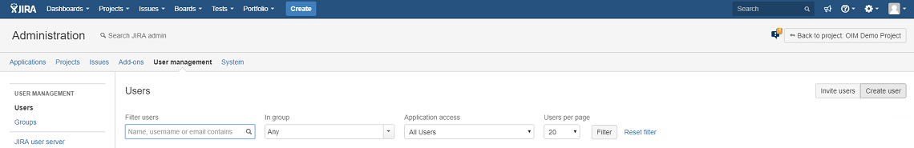

* Enter the requisite details, such as Username, Password, Full Name and Email Address.
* Optionally, tick the **Send Notification Email** box to send the user an email containing:\
  a. Their login name\
  b. A link via which to set their password (this link is valid for 24 hours).
* Click the **Create User** button.


This will create the newly added user.\
For Jira Version Specific Guide, Refer [Managing Users - Atlassian](http://confluence.atlassian.com/display/JIRA/Managing+Users#ManagingUsersAddingaUser)

***

### Assigning a user to a group

When a user is created, they will be added to all groups that are configured to have new users automatically added to them.

Steps to change a user's group membership:

* Log in into Jira as a user with the Jira administrators global permissions.
* Click the **Administration** link on the top bar and select 'User Management'.


* On User Management page, click on 'Users' option. This will display all the available users.
* Select the user for which the group membership needs to be changed.
* Click on 'Manage groups' button at the bottom right corner of the page.

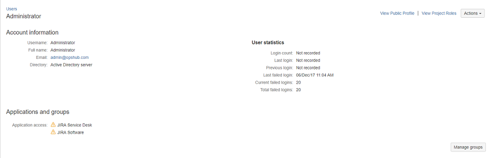

* In the **Manage User Groups** section, you can select/deselect the groups that you want to associate/disassociate from the user's profile.


***

### Grant permissions to Jira user

Following are the steps to grant the permissions:

* Log in into Jira as a user with the Jira administrators role.
* From the top right corner, **Jira ADMINISTRATION** menu, select **Projects**.
* From the Projects list, select the project for which you want to grant permission.
* Click on 'Project Settings' at the bottom of the page.

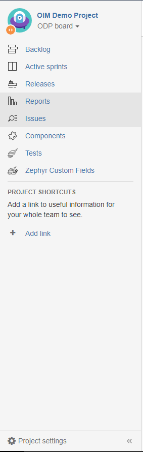

* Click on 'Permissions' on the Project Settings page.

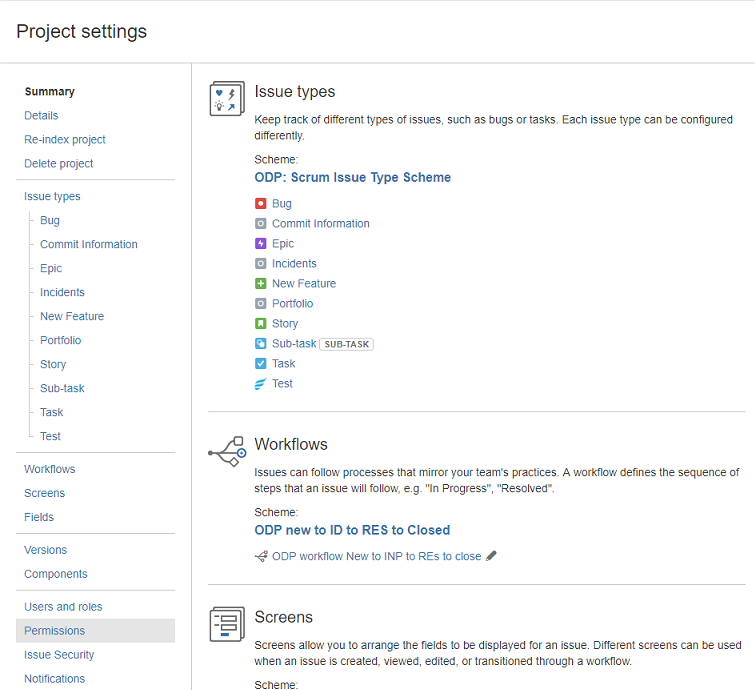

* Click the **Actions** button and select **Edit Permissions**.

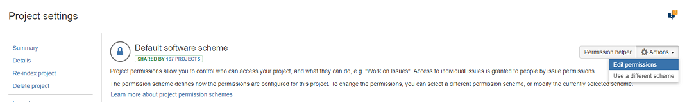

* Click the **Grant Permission** link.
* Here select the permission and then select the attribute to which this permission is to be granted.
* For example select **Administer Projects** and select the user after choosing the **Single User** radio button as shown in the screenshot below.
* Click the **Grant** button.

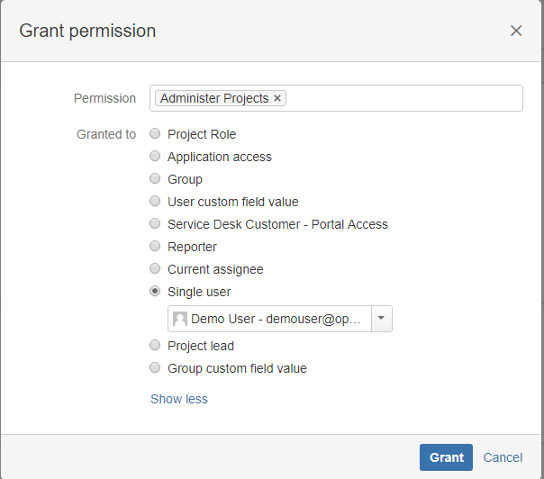

***

### Grant access to Jira applications to a User

Before granting access or verifying that you have access, make sure you are logged in from the Admin account.

**For Jira on-premise instance:**

* To grant access or verify that a user has access to Jira Software or Jira Service Desk, click the **Settings** button and open the **User Management** tab.
* Navigate to the user you want to grant access to or verify access for.
* As shown in the screenshot below, verify that the user has access to **Jira Software**.
* If the user does not have the access to Jira Software, grant access by checking the checkbox.

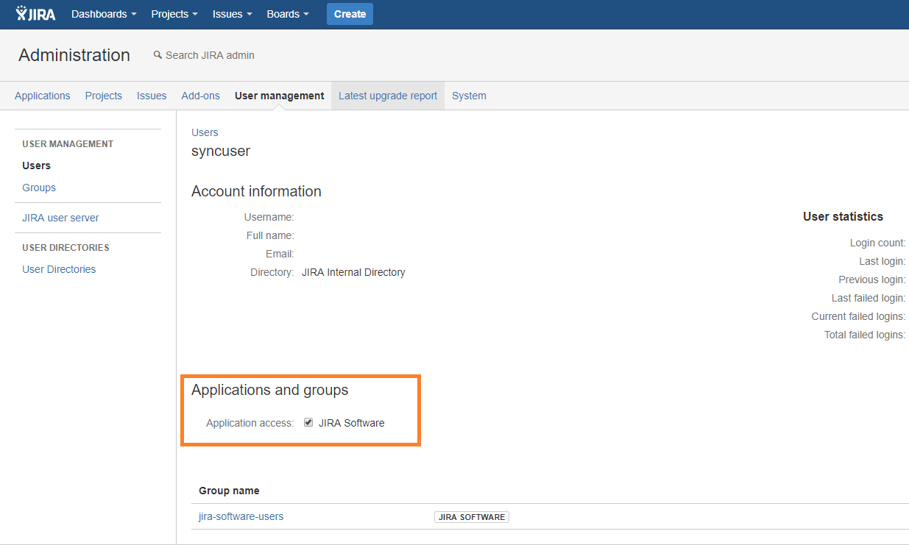

**For Jira cloud instance:**

* Open **User Management** tab from **Settings**.
* Navigate to the user to grant/verify access.
* If the user doesn't have access, click the slider button to enable access.

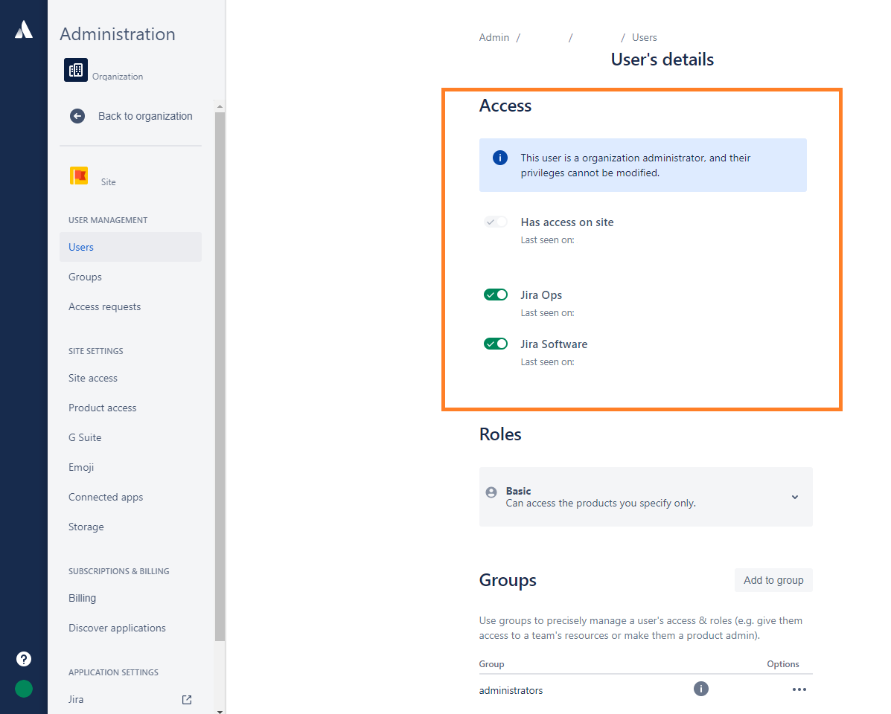

***

### Grant Browse User Global Permission

* The group that includes the dedicated user should also have the **Browse Users** permission to access the usernames and e-mail ids of all available users.
* To enable this permission, navigate to **Systems** > **Global Permissions** > **Add Permission**

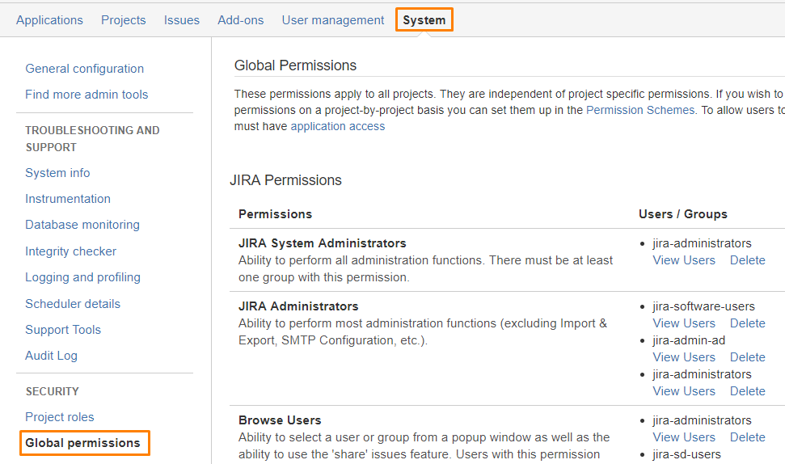

* Select **Browse User** and assign the permission to the group where integration user is present.

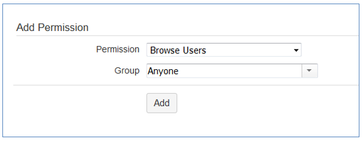

***

### Field Helper

You can use the Field Helper to determine why a custom or system field is not appearing on a screen.

* Log in with the dedicated integration user in Jira.
* Try to create an issue for the project/issuetype where the field is missing.
* Click **Where is my field?**
* Type the field name; the helper will guide you how to make it visible.

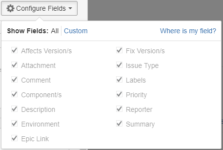\
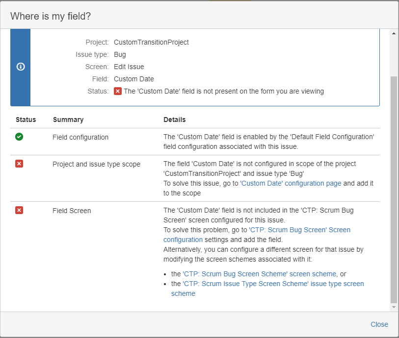

***

### Adding field to Screen

Steps to add a field to screen associated with a project:

* Select **Projects** > **View All Projects**\
  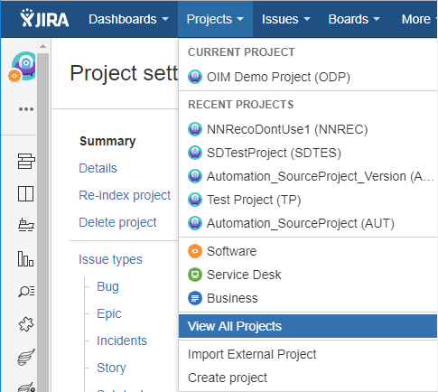
* Search and select the desired project
* Click 
* Select **Screens** from the left nav
* You'll see screen associations for Create, Edit, View operations\
  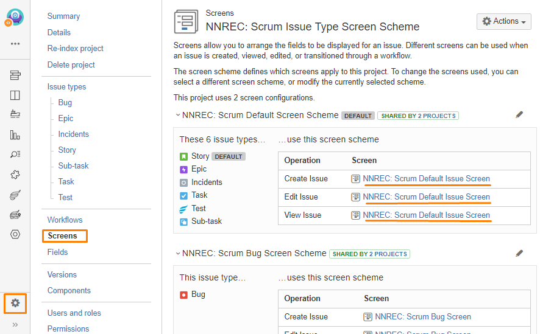
* Select the screen to edit, scroll to the end and add the field\
  

***

#### How to check whether the field is not hidden from field configuration

1. Login to Jira as admin
2. Go to **Settings** > **Projects**\
   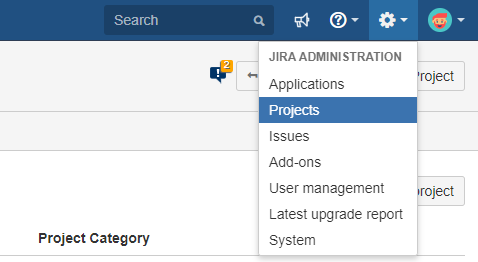
3. Choose the project
4. Click **Project Settings**\
   
5. Click **Fields**\
   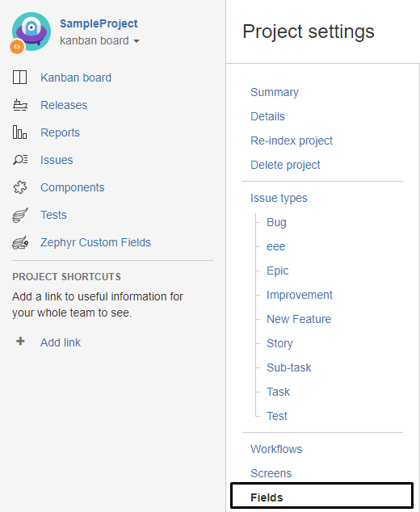
6. Click the pencil icon beside the field configuration\
   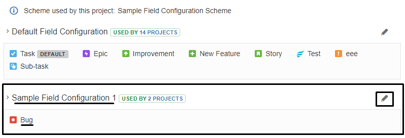
7. Check if the field is hidden
8. If yes, click **Show**\
   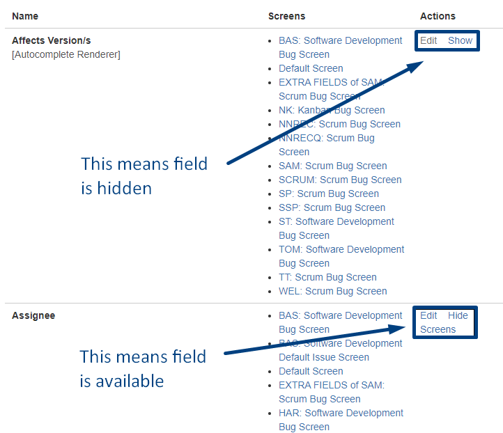

***

#### Disabling Legacy Mode

Follow these steps:

* Click on Jira settings icon
* Select **Issues**
* From the left panel, select **Time tracking**
* Click **Deactivate** to disable Time Tracking\
  
* Ensure **Legacy Mode** is disabled
* Click **Activate** to re-enable Time Tracking

### Server URL

* Log in to Jira as a user with the Jira administrators global permissions.
* Click the **Administration** link on the top bar and select **System**.\
  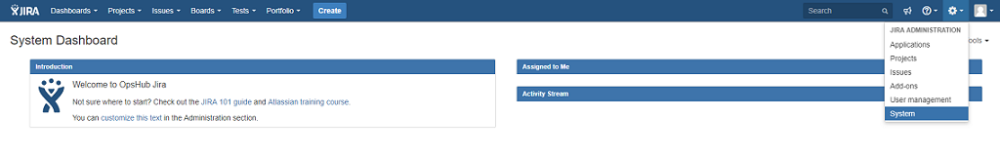
* From **General configuration**, get the **Base URL**.\
  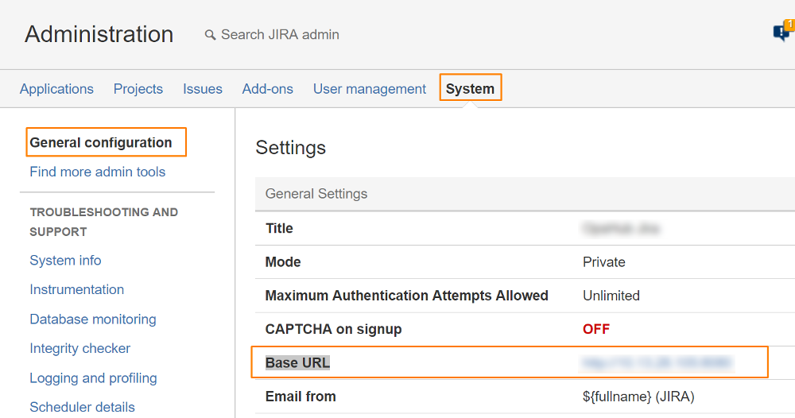

***

### Custom field for Jira version < 6.2

To create a new custom field:

* Log in to Jira with Jira administrators global permissions.
* Click the **Administration** link on the top bar.
* Under **Issue Fields**, click **Custom Fields**.
*   Click **Add Custom Field**.

    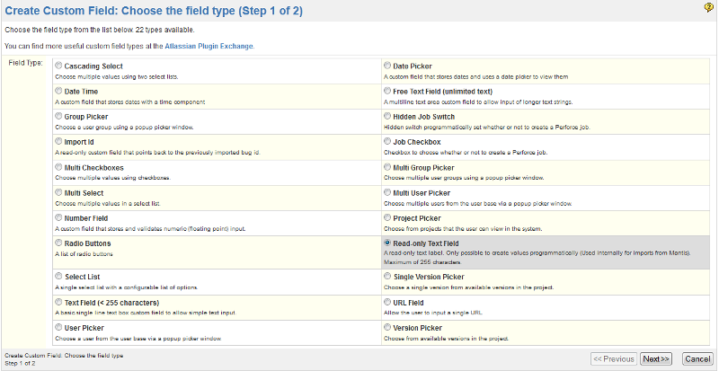
* From the **Field Type** list, select the appropriate field. For \{{ spaceName \}}, select **Read-only Text Field**.
* Click the **Next >>** button.
* Add a field name and optionally a description.
* Select **Free Text Searcher** as the **Search Template** for \{{ spaceName \}}.
* Select applicable **Issue Types** or choose **Any issue type**.
* Select a **Project context** or use **Global context**.
* Click **Finish**, then associate the field with screens (at minimum, the Default Screen).

For details, refer to [Atlassian: Adding a Custom Field](http://confluence.atlassian.com/display/JIRA/Adding+a+Custom+Field)

***

### Database Information

* Log in to Jira with Jira administrators global permissions.
* Click the **Administration** link and select **System**.\
  
* In the left menu, under **System**, click **System Info**.
* Under **System Info**, find **Database Type** and **Database URL**.\
  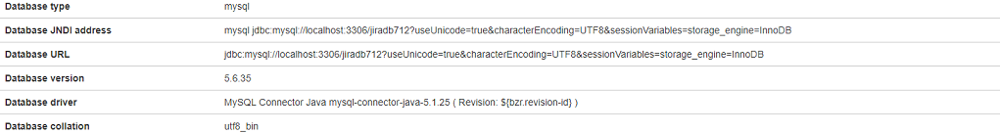

***

### How to Find Jira Version

* Log in to Jira with Jira administrators global permissions.\
  
* In the left menu under **System**, click **System Information**.
* Under **Jira Info**, find the **Version**.\
  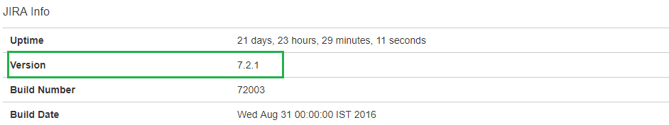

***

### Comma-Separated Values (CSV)

To format CSV field names correctly:

* **Commas** in field names: Use quotes.\
  Example: `"Field Name2,with comma"`
* **Quotes** in field names: Escape using double quotes.\
  Example: `"Field name3 ""with quote"""`
* **No escaping** needed for simple names:\
  Example: `Field Name1`
* Full example combining all:\
  `"Field Name1","Field Name2,with comma","Field name3 ""with quote"""`

***

### Configuration to Allow All Transitions

Steps to allow any-to-any state transitions:

1. Create a user group, e.g., `integration-users`.
2. Add the integration user to this group (see: [Assigning a user to a group](jira.md#assigning-a-user-to-a-group))
3. Edit the project's workflow:
   * Go to **Administration** > **Projects**
   * Click the pencil icon on the workflow\
     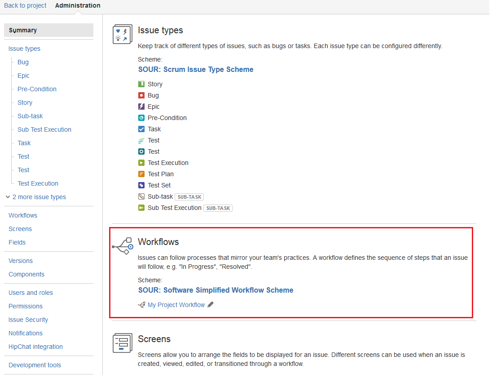
4. Existing transitions example:\
   
5. Add restricted transition (e.g., TODO → Completed) for integration user:
   * Click **Add Transition**\
     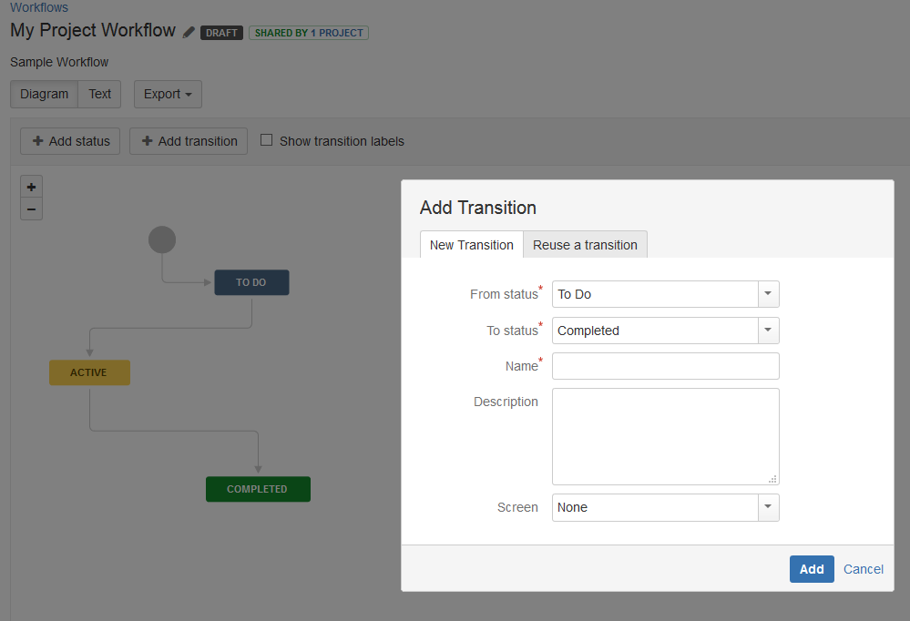
   * Click **Conditions**\
     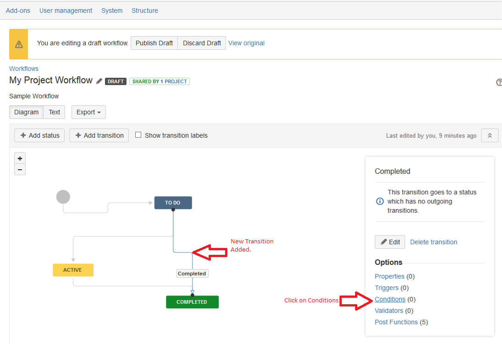
   * Select **User Is In Group**\
     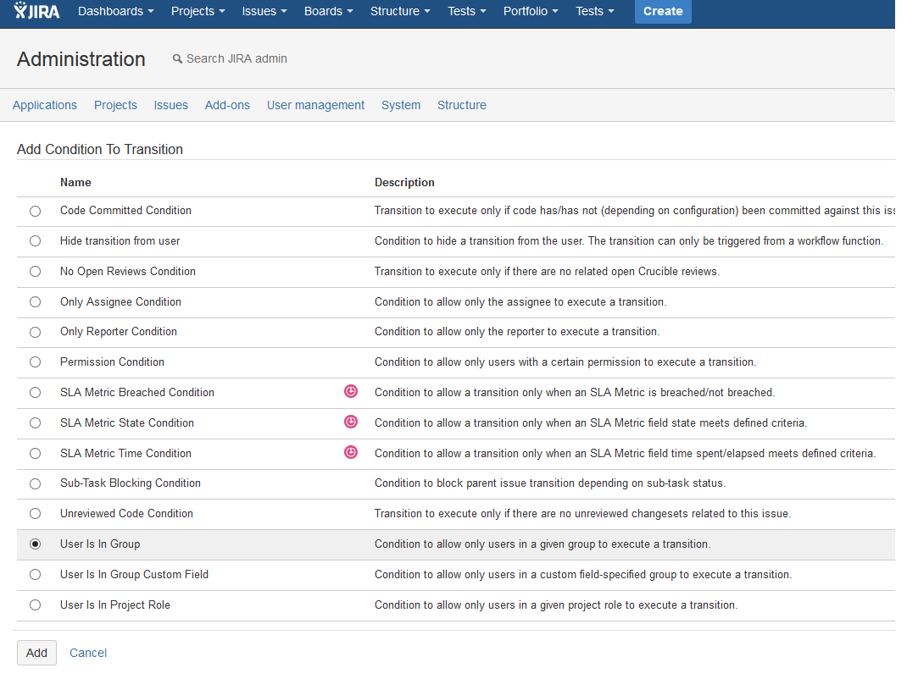
   * Choose the `integration-users` group\
     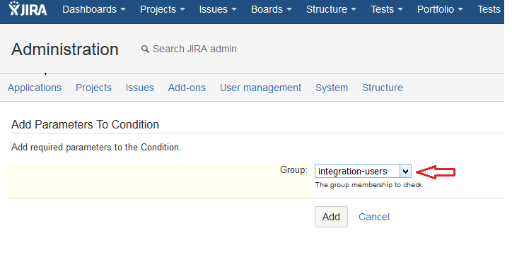
6. Transition is now restricted to the integration user only.\
   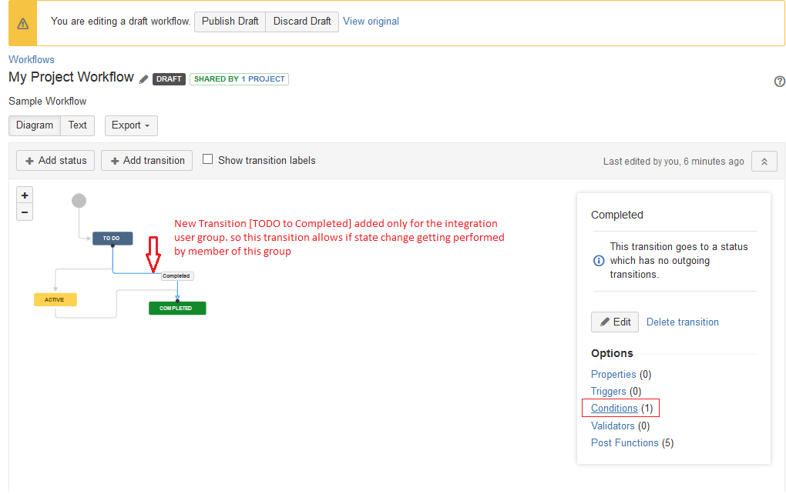
7. Repeat for all required transitions.
8. Click **Publish Draft** to save.

> **Note:** This approach is valid if you do not wish to configure advanced workflow mapping in \{{ spaceName \}}.

***

### Overwriting Meta

Use this feature to:

* Override field data types (e.g., text, HTML, wiki)
* Mark links or fields as **mandatory**
* Skip linking **archived entities** if Jira blocks them

**Important:**

* Use only for multi-line text fields like _Description_ or _Environment_.
* If using a plugin like [JEditor](https://marketplace.atlassian.com/apps/1210768/jeditor-rich-text-editor-for-jira), ensure data types match what Jira expects.

If you overwrite a field data type used in mappings, you must **remap** that field manually.

#### JSON Format Example:

```json
{
  "common": {
    "fields": {
      "system": [
        {
          "displayName": "Description",
          "dataType": "wiki"
        },
        {
          "displayName": "Custom Text",
          "dataType": "html",
          "mandatory": true
        }
      ]
    },
    "relationship": {
      "linkTypes": [
        {
          "linkType": "Parent Link",
          "mandatory": true,
          "archivedItemLinkSettings": {
            "skip": "true",
            "skipForIssueTypes": ["Bug", "Epic"]
          }
        }
      ]
    }
  },
  "specific": [
    {
      "entityType": "Bug",
      "fields": {
        "system": [
          {
            "displayName": "Custom Text",
            "dataType": "html"
          }
        ]
      }
    },
    {
      "project": "WP",
      "fields": {
        "system": [
          {
            "displayName": "RichTextArea",
            "dataType": "html"
          }
        ]
      }
    },
    {
      "entityType": "Story",
      "project": "TES",
      "fields": {
        "system": [
          {
            "displayName": "Description",
            "dataType": "html",
            "mandatory": true
          },
          {
            "displayName": "Comments",
            "dataType": "text"
          }
        ]
      },
      "relationship": {
        "linkTypes": [
          {
            "linkType": "Epic Link",
            "mandatory": true,
            "archivedItemLinkSettings": {
              "skip": "true",
              "skipForIssueTypes": ["Epic"]
            }
          }
        ]
      }
    }
  ]
}
```

* There are a few things to be taken care of while inputting the JSON data:
  * As shown in the example, the project should be provided in form of Project Key. The user can get the project Key of a Project in Jira by looking at any entity's ID created in a Project. Let's say there is an entity called WP-23, then the Project Key for that project will be WP.
  * The Project keys, Entity type names and Field names are all case sensitive. Their case should be exactly seen as it is on the Jira UI.
  * Field Metadata Configuration:
    * Only three data types are supported to be overwritten as of now: html, wiki and text.
    * The **fields** in json structure supports two field metadata nodes:
      * **system**: This node contains metadata for system fields that are standard fields within Jira.
      * **custom**: This node contains metadata for custom fields created specifically for a Jira instance.
      * The **system** or **custom** JSON node can contain only the field's "displayName", "dataType", and "mandatory" information.
  * Link Metadata Configuration:
    * The **relationship** node is used to mark the specific link types as mandatory.
    * Overwrite is allowed only for standard Jira link types, including Epic Link, Parent Link, Sprint Link and Jira issue linkage (e.g. cloned, is cloned by, blocks, is blocked by). > **Note** The JSON input does not support Jira plugin-based links for marking them as mandatory.
    * If the **skipForIssueTypes** field is specified, issue linking will be skipped only for the mentioned archived issue types when the end system returns an error during linking; if it is not specified, the skipping behavior will apply to all issue types by default in such cases.
* At least one key, either entity type or project is mandatory in each **specific** JSON key node. Notice how in the above example, in all 3 **specific** child nodes, there is at least **entityType** key or Project Key **present**.
  * If either of the nodes, **common** or **specific** is not required then one of them can be omitted.
  * Metadata configuration provided in the **specific** node will overwrite the metadata specified in the **common** node. For example, if the Description field is using a Wiki renderer in all projects but is using a HTML renderer for a specific project, then the user can keep the data type for Description as wiki in the **common** node and as html in the **specific** node for the respective projects.
* Here are a few JSON inputs for some use cases as examples:

| **Scenario**                                           | **Minified JSON to Input**                                                                            |
| ------------------------------------------------------ | ----------------------------------------------------------------------------------------------------- |
| **Change data type for all projects and entity types** | \`{"common":{"fields":{"system":\[{"dataType":"html","displayName":"Description"}]\}},"specific":\[]} |

```json
{
  "common": {
    "fields": {
      "system": [
        {
          "dataType": "html",
          "displayName": "Description"
        }
      ]
    }
  },
  "specific": []
}
```

| **Scenario**                                                     | **Minified JSON to Input**                                                                                                                                           |
| ---------------------------------------------------------------- | -------------------------------------------------------------------------------------------------------------------------------------------------------------------- |
| **Change data type for a specific entity type for all projects** | `{"common":{},"specific":[{"entityType":"Bug","fields":{"system":[{"dataType":"html","displayName":"Description"},{"dataType":"html","displayName":"Comments"}]}}]}` |

```json
{
  "common": {},
  "specific": [
    {
      "entityType": "Bug",
      "fields": {
        "system": [
          {
            "dataType": "html",
            "displayName": "Description"
          },
          {
            "dataType": "html",
            "displayName": "Comments"
          }
        ]
      }
    }
  ]
}
```

***

| **Scenario**                                                                   | **Minified JSON to Input**                                                                                                                                                                |
| ------------------------------------------------------------------------------ | ----------------------------------------------------------------------------------------------------------------------------------------------------------------------------------------- |
| **Change data type of field for a specific entity type of a specific project** | `{"common":{},"specific":[{"entityType":"Story","project":"AUT","fields":{"system":[{"dataType":"html","displayName":"Description"},{"dataType":"html","displayName":"Environment"}]}}]}` |

```json
{
  "common": {},
  "specific": [
    {
      "entityType": "Story",
      "fields": {
        "system": [
          {
            "dataType": "html",
            "displayName": "Description"
          },
          {
            "dataType": "html",
            "displayName": "Environment"
          }
        ]
      },
      "project": "AUT"
    }
  ]
}
```

***

| **Scenario**                                                           | **Minified JSON to Input**                                                                                                                                                                                                                      |
| ---------------------------------------------------------------------- | ----------------------------------------------------------------------------------------------------------------------------------------------------------------------------------------------------------------------------------------------- |
| **Mark link as mandatory for a specific entity type for all projects** | `{"common":{},"specific":[{"entityType":"Bug","fields":{"system":[{"dataType":"html","displayName":"Description"},{"dataType":"html","displayName":"Comments"}]},"relationship":{"linkTypes":[{"linkType":"Parent Link","mandatory":true}]}}]}` |

```json
{
  "common": {},
  "specific": [
    {
      "entityType": "Bug",
      "fields": {
        "system": [
          {
            "dataType": "html",
            "displayName": "Description"
          },
          {
            "dataType": "html",
            "displayName": "Comments"
          }
        ]
      },
      "relationship": {
        "linkTypes": [
          {
            "linkType": "Parent Link",
            "mandatory": true
          }
        ]
      }
    }
  ]
}
```

### Xray Entity Names

* This field is used to determine the changed entity names for Xray Cloud. This field is not mandatory.
* The input includes entity's original display name (default name when plugin was installed) and the corresponding current display name.
* Change the **currentEntityDisplayName** field in case of entity rename.

> **Note** The values for defaultEntityName field are pre-defined. Do not change its value.

* Here is the structure of the JSON input:

```json
[
    {
        "defaultEntityName": "Test",
        "currentEntityDisplayName": "Test"
    },
    {
        "defaultEntityName": "Precondition",
        "currentEntityDisplayName": "Precondition"
    },
    {
        "defaultEntityName": "Test Set",
        "currentEntityDisplayName": "Test Set"
    },
    {
        "defaultEntityName": "Test Plan",
        "currentEntityDisplayName": "Test Plan"
    },
    {
        "defaultEntityName": "Test Execution",
        "currentEntityDisplayName": "Test Execution"
    },
    {
        "defaultEntityName": "Test Run",
        "currentEntityDisplayName": "Test Run"
    }
]
```

* When no JSON input is provided:
  * The current entity display names will be determined based on the entity descriptions provided in Jira.
  * The description must be in this format: **This is the Xray Issue Type**.
    * Example: If the entity name is 'Precondition', the description must contain the text, **This is the Xray Precondition Issue Type**.

### R4J Folder numbering

* In R4J tree, numbering of folders is present in each folder name. The synchronization of this numbering is not supported due to API unavailability. For information on numbering please refer. In the following image, '1)' and '1.1)' numbers will not get synchronized.

<div align="center"></div>

### Find Zephyr Custom Field Id

* Log in into Jira with a user having the Jira administrator's global permissions.
* Click Settings -> Apps. Under **Zephyr Squad** section, click **Custom Fields**.

<div align="center"></div>

\* Press F12 to open the developer tools window and switch to \*\*Network\*\* tab. Reload the web page. \* To find custom field id of Test Execution entity: \* There should be a request named \*\*customField?entity=EXECUTION\*\* under the \*\*Name\*\* section in the developer tools window. \* To find custom field id of Test Step (field of Test entity): \* Click on the \*\*Test Steps\*\* section. \* There should be a request named \*\*customField?entity=TESTSTEP\*\* under the \*\*Name\*\* section in the developer tools window. \* Select the request and switch to \*\*Response\*\* tab.

<div align="center"></div>

\* This would be a JSON response of the custom field details. Here is an example:

```json
{
    "2f73f23b-9da7-497e-b39a-f9cb11842af6": {
        "id": "2f73f23b-9da7-497e-b39a-f9cb11842af6",
        "name": "Zephyr_Text_Field",
        "description": "This field is used in the project. Don't delete this field.",
        "entity": "EXECUTION",
        "customFieldType": "TEXT"
    }
}
```

* From the above JSON response, get the **id** parameter of the required custom fields.

### Find Test Cycle Id

* Log in to Jira.
* Create a Test entity and add it to the Test Cycle whose internal id is required.
* On the **Cycle Summary** window, click the **Detail** view highlighted in the image below.
* Click the Test Cycle **name** highlighted in the image below:

<div align="center"></div>

\* Test Cycle id should be available in the URL of the browser as the value of \*\*cycle.id\*\* parameter. Here is an example of the URL:

```
<SERVER_URL>/projects/NNREC?version.id=10676&cycle.id=4235b429-3c90-4f3a-99d2-db0156faa501&selectedItem=com.thed.zephyr.je__cycle-summary
```

### Enable Cookie Based Authentication

* From Jira version 10.2.x onward, if cookie-based authentication is enabled, you need to add a new JVM argument and set its value to "true".
* For the detailed steps, refer here: https://confluence.atlassian.com/adminjiraserver/setting-properties-and-options-on-startup-938847831.html
  * For example, use the argument: `-Datlassian.authentication.legacy.mode=true`.
* **Reason**: Jira has introduced an additional authentication layer starting with version 10.2.x. For more details, refer to [upgrade notes](https://confluence.atlassian.com/jirasoftware/jira-software-10-2-x-upgrade-notes-1455425770.html).
