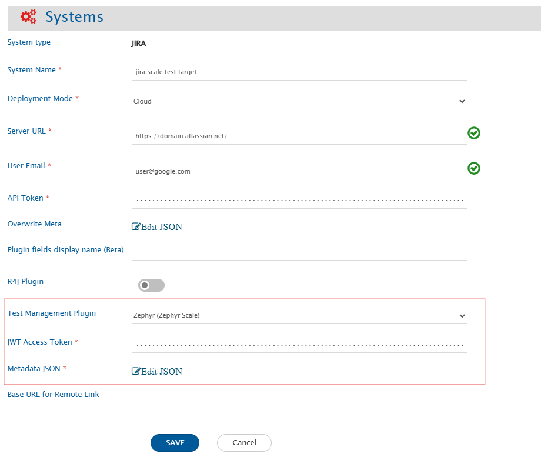
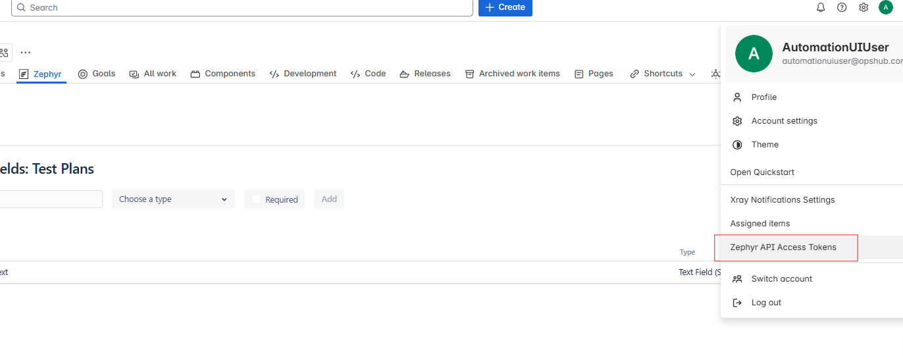

**Zephyr (formerly known as Zephyr Scale)**

# Prerequisites

* Zephyr (formerly known as Zephyr Scale) must be installed on your Jira Cloud domain.  
* A user access token for integration user is required to synchronize any entities from the Zephyr plugin. Check [User Token Generation](#user-token-generation).  
>**Note**: Make sure the Zephyr service account is the same as the Jira system service account.

# System Configuration

Before you start with the integration configuration, you must first set up the [Jira system](jira.md#system-configuration) in <code class="expression">space.vars.SITENAME</code>.

Click [System Configuration](../integrate/system-configuration.md) to learn the step-by-step process to configure a system.

Refer the screenshot given below for reference.

<p align="center">
  
</p>

| **Field Name** | **When field is visible on the System form** | **Description** |
|----------------|--------------------------------------------|----------------|
| **JWT Access Token** | Only when Jira's deployment type is Cloud and Zephyr (Zephyr Scale) is selected as the test management plugin | Provide the access token generated in Zephyr for the user given in the "User Email" field. For more details on Access Token, please refer to [User Token Generation](#user-token-generation) |
| **Metadata JSON** | Only when Jira's deployment type is Cloud and Zephyr (Zephyr Scale) is selected as the test management plugin | This data is in JSON format according to our knowledge of system metadata (entity type, field names, lookup...), the user can edit it based on his/her Jira Zephyr instance details for system/custom metadata. For the format and guidance related to filling these details in JSON form, please refer to **Understanding JSON Input** section. |

## Understanding JSON Input

* The field metadata details needed for integrating Jira Zephyr system with other systems are provided at the time of system configuration in the field 'Metadata JSON' in the form of JSON.  
* If the internal name is not given correctly, it will lead to failures in the integration.  
* Refer to [Understanding JSON Metadata Input](../integrate/system-configuration.md#understanding-json-metadata-input) for more details on the JSON inputs.  
* Refer to [JSON Metadata Sample](sample-json-file-for-jira-zephyr.md) for a sample JSON for Jira Zephyr entities.  
* Users can change the display name of the entities.  
* The internal name of each system field must match exactly as shown in the template JSON.  
* The internal name of a custom field must match the one defined in the end system. For how to find custom field name, refer [Find Custom Field Names](#find-custom-field-names).

## Mapping Configuration

* If the Folder entity is configured in <code class="expression">space.vars.SITENAME</code> as a separate entity, map the Folder in a link relationship with Test Plan, Test Case, and Test Cycle entities.  
  * The **folderType** field is mandatory in folder synchronization.  
* If the Folder entity is not configured separately, use the check-and-create functionality with the **OH_Folder_path** field.  
  * <code class="expression">space.vars.SITENAME</code> uses the "/" character to separate folders in a folder path. If the source system uses a different path separator, users must create advanced mapping to convert that separator to the "/" string.  
  * For example: if the Source system gives "\\" as path separator, then advance XSLT for this field will be as follows:

```xml
<OH_Folder_Path>
  <xsl:value-of
      select="replace(SourceXML/updatedFields/Property/Subject, '\\', '/')"
      xmlns:xsl="http://www.w3.org/1999/XSL/Transform"/>
</OH_Folder_Path>
```

* <code class="expression">space.vars.SITENAME</code> supports synchronization of test steps through the field '''OH_Test_Steps'''.
* Custom field of test steps will be synced with additional fields as bellow:

```xml
<OH_Test_Steps>
	<xsl:for-each xmlns:xsl="http://www.w3.org/1999/XSL/Transform" select="SourceXML/updatedFields/Property/OH__Test__Steps/com.opshub.eai.TestStep">
		<xsl:element name="{concat('_',order)}">
			<xsl:element name="order">
				<xsl:value-of select="order"/>
			</xsl:element>
			<xsl:element name="id">
				<xsl:value-of select="id"/>
			</xsl:element>
			<xsl:element name="step">
				<xsl:value-of select="step"/>
			</xsl:element>
			<xsl:element name="expected">
				<xsl:value-of select="expected"/>
			</xsl:element>
			<xsl:element name="description">
				<xsl:value-of select="description"/>
			</xsl:element>
			<xsl:element name="calledTestCaseId">
				<xsl:value-of select="calledTestCaseId"/>
			</xsl:element>
			<OHAttachments>
				<xsl:for-each select="attachments/OHAttachment">
					<xsl:element name="{concat('attachment_',position())}">
						<filename>
							<xsl:value-of select="fileName"/>
						</filename>
						<addedByUser>
							<xsl:value-of select="addedByUser"/>
						</addedByUser>
						<contentLength>
							<xsl:value-of select="contentLength"/>
						</contentLength>
						<contentType>
							<xsl:value-of select="contentType"/>
						</contentType>
						<contentBase64>
							<xsl:value-of select="contentBase64"/>
						</contentBase64>
						<attachmentURI>
							<xsl:value-of select="attachmentURI"/>
						</attachmentURI>
						<inlineAttachmentURI>
							<xsl:value-of select="inlineAttachmentURI"/>
						</inlineAttachmentURI>
						<updateTimeStamp>
							<xsl:value-of select="updateTimeStamp"/>
						</updateTimeStamp>
						<label>
							<xsl:value-of select="label"/>
						</label>
						<fileComment>
							<xsl:value-of select="fileComment"/>
						</fileComment>
						<attachmentId>
							<xsl:value-of select="attachmentId"/>
						</attachmentId>
						<attachmentReferenceTypes>
							<xsl:for-each select="attachmentReferenceTypes/com.opshub.eai.AttachmentReferenceType">
								<op_set>
									<com.opshub.eai.AttachmentReferenceType>
										<xsl:value-of select="."/>
									</com.opshub.eai.AttachmentReferenceType>
								</op_set>
							</xsl:for-each>
						</attachmentReferenceTypes>
						<uniqueCode>
							<xsl:value-of select="uniqueCode"/>
						</uniqueCode>
						<attachmentType>
							<xsl:variable name="xPathVariable" select="attachmentType"/>
							<xsl:value-of select="attachmentType"/>
						</attachmentType>
					</xsl:element>
				</xsl:for-each>
			</OHAttachments>
			<xsl:element name="additionalFields">
				<xsl:element name="customCheckBox">
					<xsl:value-of select="additionalFields/customFields/customCheckBox"/>
				</xsl:element>
				<xsl:element name="customUser">
					<xsl:value-of select="additionalFields/customFields/customUser"/>
				</xsl:element>
				<xsl:element name="customMultiSelect">
					<xsl:for-each xmlns:xsl="http://www.w3.org/1999/XSL/Transform" select="additionalFields/customFields/customMultiSelect/string">
						<fieldvalue>
							<xsl:variable name="xPathVariable" select="text()"/>
							<xsl:choose>
								<xsl:when test="$xPathVariable='red'">
									<xsl:value-of select="'red'"/>
								</xsl:when>
								<xsl:when test="$xPathVariable='green'">
									<xsl:value-of select="'green'"/>
								</xsl:when>
								<xsl:when test="$xPathVariable='blue'">
									<xsl:value-of select="'blue'"/>
								</xsl:when>
								<xsl:when test="$xPathVariable='yello'">
									<xsl:value-of select="'yello'"/>
								</xsl:when>
							</xsl:choose>
						</fieldvalue>
					</xsl:for-each>
				</xsl:element>
				<xsl:element name="customText">
					<xsl:value-of select="additionalFields/customFields/customText"/>
				</xsl:element>
				<xsl:element name="customMultiText">
					<xsl:value-of select="additionalFields/customFields/customMultiText"/>
				</xsl:element>
				<xsl:element name="customDesi">
					<xsl:value-of select="additionalFields/customFields/customDesi"/>
				</xsl:element>
				<xsl:element name="customNumber">
					<xsl:value-of select="additionalFields/customFields/customNumber"/>
				</xsl:element>
				<xsl:element name="customSelect">
					<xsl:value-of select="additionalFields/customFields/customSelect"/>
				</xsl:element>
				<xsl:element name="customDate">
					<xsl:value-of select="additionalFields/customFields/customDate"/>
				</xsl:element>
			</xsl:element>
		</xsl:element>
	</xsl:for-each>
</OH_Test_Steps>
</pre>
```

# Integration Configuration

## Criteria Configuration & Target Lookup
* <code class="expression">space.vars.SITENAME</code> supports criteria and target lookups for the entity types Test Case, Test Cycle, and Test Plan via a private API.  
  * The criteria query can be obtained by inspecting the browser’s developer tools (Inspect tab).
* <code class="expression">space.vars.SITENAME</code> supports criteria and target lookups for the Test Folder entity type on only one **folderType** field.

# Known Behavior/ Limitations

* Polling for all entity types requires a full scan of all records; therefore, choose the polling frequency judiciously. Refer [Best Practices for Polling Frequency](../integrate/best-practises.md#polling-frequency-scheduling)
* Shared Step is not supported.
* The following limitations exist in <code class="expression">space.vars.SITENAME</code> due to API restrictions:
* Delete and Archive functionality is not supported.
* For Test Execution,  
  * Criteria and target lookup are not supported.  
  * The **Release Version** and **Environment** fields cannot be modified.
* For Test Environment,  
  * Criteria and target lookup are not supported.  
  * Updates to the **Description** field will not work and will return the error _An environment with this name already exists._
* For Test Cycle,  
  * The **Iteration** field is not synchronized.  
    * **Reason:** Zephyr API does not provide or handle any information related to this field.

# Appendix

## User Token Generation

* To generate the token, navigate to your user profile → Zephyr API Access Token section.
* Click **Create Access Token**, then copy and save the generated token.

<p align="center">
  
</p>

## Find Custom Field Names

* To get the custom field information go to **Zephyr** → **Configuration** → **CUSTOM FIELDS** subsection.

<p align="center">
  
</p>

* For example, in the above image, **reviewer (Custom)** is the internal name of a custom field.
