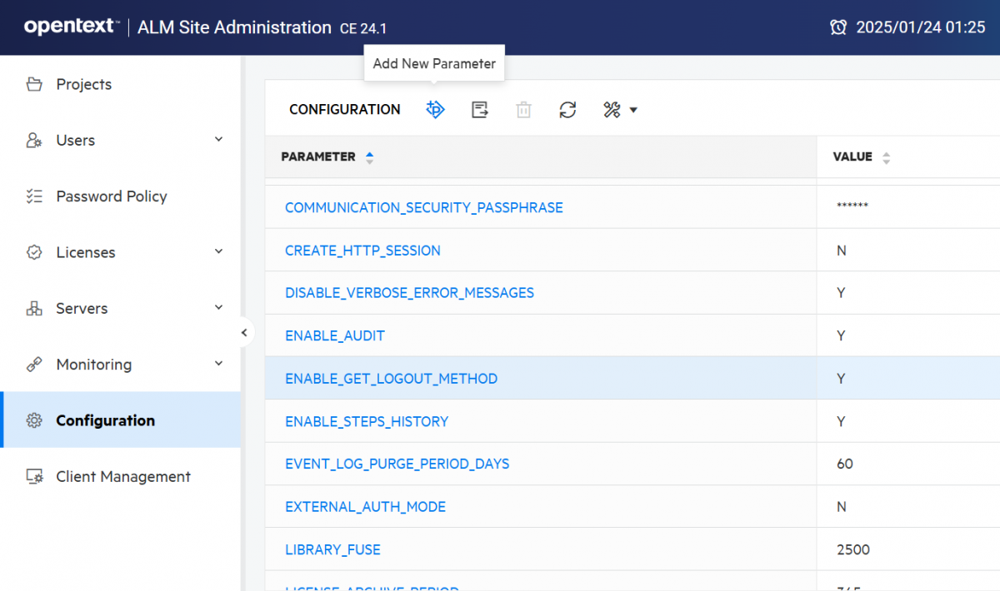
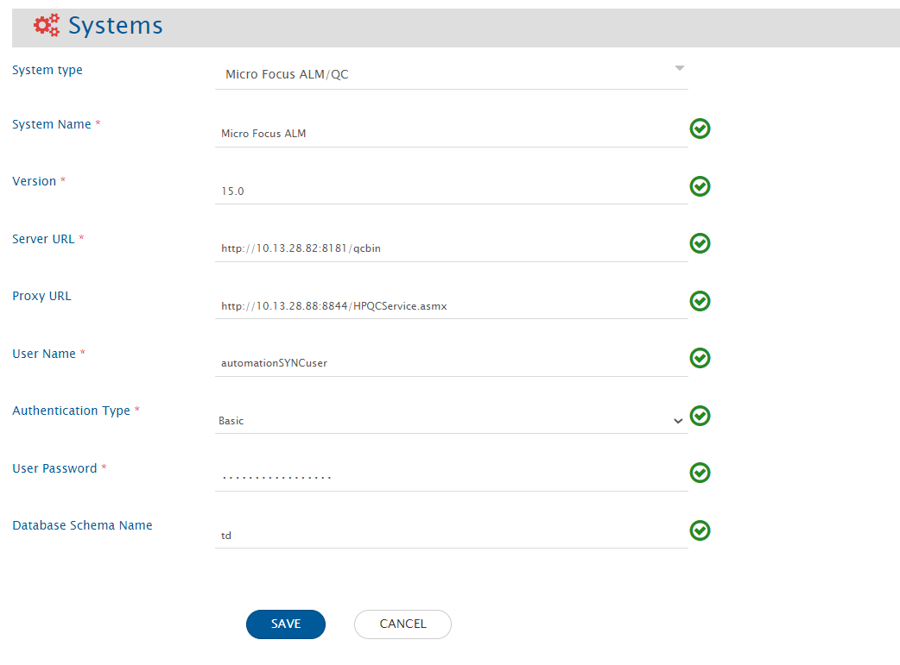

# Pre-requisites

## User privileges
* Create one user for Micro Focus ALM/QC, dedicated to {{SITENAME}}. This user should not do any other operations from the Micro Focus ALM/QC's user interface. For creating user, please refer [Add User to Project](https://admhelp.microfocus.com/alm/en/12.60/online_help/Content/Admin/cust_users_add_to_proj.htm). 
* Micro Focus ALM/QC user must be an **Active site user** in Micro Focus ALM/QC. If the user is deactive user in Micro Focus ALM/QC, then activate the user. For help on how to activate the user, please refer [Activate the User](#Activate-the-User-as-a-Site-User) in Appendix.
* To use a particular project in Micro Focus ALM/QC, the user must be present as a **Project User** for that project. For help on how to add a project user in the project, please refer [Add project user in project](#Add-project-user-in-project) in Appendix.
* Micro Focus ALM/QC user must have **Project Administrator** rights on the Project that is to be synchronized. For help on how to set the access rights on project, please refer [Add Permissions To Project](#Add-permissions-to-project) in Appendix.  
>**Note**: In case your Micro Focus ALM/QC is configured with SSO, then the above mentioned User privileges and permissions are sufficient.

## Database prerequisites
* For Micro Focus ALM/QC Quality Center 10 and 11, supported database types are: MS SQL Server and Oracle.

## System prerequisites
* For OpenText ALM Quality Center version 24.x:
  * Add the site parameter **ENABLE_GET_LOGOUT_METHOD** and its value to **Y**. To perform this action, go to `http://IP:PORT/qcbin/webadmin/#/configuration` and click on **Add New Parameter**.
    * Reason: Logout user API will not work without this site parameter.  

<p style="center">
  
</p>

## Proxy configuration
For certain Micro Focus ALM/QC versions, proxy configuration is required only for specific types of data synchronization, such as:  
* For version 10.0, 11.0, and 11.5: Required only when design steps or requirement traceability need to be synchronized.  
* For version 12.0: Required only when design steps need to be synchronized.  

**Required for all versions:**  
* To synchronize test set execution.  
* To synchronize attachments in cycle entity.  
* To read actual values of parameters for different test configurations in test entity.

| **CPU** | Core duo 1.6 Ghz (or higher) or equivalent compatible processor |
|---------|----------------------------------------------------------------|
| **Memory (RAM)** | 4 GB (recommended) |
| **Operating system (Tested On)** | Windows 7, Windows 10, Windows Server 2008, Windows Server 2012, Windows Server 2016, Windows Server 2019 |
| **Software** | * Visual C++ 2005 SP1 ATL Security Update Redistributable <br> * Microsoft .NET Framework 4.5 (SP1) <br> * IIS 7.0 with ASP.NET configured <br> * Micro Focus ALM/QC Connectivity Add-in (Download from: `http://<Micro Focus ALM/QC host>:<port>/qcbin/addins.html`) |
>**Note**:  For Test Set Execution Request integration, the OpsHub ALM/QC Proxy must be configured on a machine on which UFT has been installed.  
Click here for [Proxy Configuration steps](#Proxy-Configuration-steps).

## Configurations required to copy QTP script
Following additional configurations are required to copy QTP script:  
* **Quick Test Professional** and appropriate **QuickTest Professional Add-In** must be installed on the machine on which OpsHub ALM/QC proxy is configured. To download QuickTest Professional Add-In, please follow [this link](https://hpln.hp.com/page/quicktest-professional-add).

## Enable history of fields to be mapped
* It is recommended to enable history at least on those fields that are going to be mapped in the integration for {{SITENAME}} and on **Modified** field to ascertain whether any modifications are made on a particular field. Click [Enable history of fields to be mapped](#How-to-enable-history-of-fields-to-be-mapped) to learn the steps.  
* If Micro Focus ALM/QC is the target system, then integration recovery will not work if the history has not been enabled. The integration recovery can, in fact, create duplicate entities in Micro Focus ALM/QC. Integration will throw error before performing create/update if history has not been enabled on any mapped field.  
* If Micro Focus ALM/QC is the source system and history has not been enabled, then integration needs to be configured in **Current State Sync** mode only. You can learn about **Current State Sync** mode from [here](../integrate/integration-configuration.md#sync-only-current-state).

## Associate a custom field with the Requirement
* For the **Requirement** entity, if user wants to use a custom field in mapping, then the custom field must be associated with all the Requirement Types that will be used in the mapping.  
* Click [How to associate a custom field with Requirement](#How-to-associate-a-custom-field-with-Requirement) to know the steps.

# System Configuration
Before you continue to the integration, you must first configure Micro Focus ALM/QC.  
Click [System Configuration](../integrate/system-configuration.md) to learn the step-by-step process to configure a system.  
Refer the screenshot given below for reference.

<p align="center">
  
</p>


| **Micro Focus ALM/QC System Form Details** |  |  |
|-------------------------------------------|--|--|
| **Field Name** | **When Field is Visible on the System Form** | **Description** |
| System Name | Always | Provide Micro Focus ALM/QC System Name. |
| Version | Always | Put the version for the Micro Focus ALM/QC. |
| Server URL | Always | Provide server URL of the Micro Focus ALM/QC instance. This URL will be used for connecting to Micro Focus ALM/QC API. Format: `http://<host name>:<port no>/qcbin` Example: `http://myopshub:1234/qcbin`. |
| OpsHub ALM/QC Web Service proxy URL | Always | Proxy configuration is required only for specific types of data synchronization. For more details navigate to [proxy configuration](#Proxy-configuration). Format for URL: `http://<host name>:<port no>/HPQCService.asmx`. |
| User Name | Always | Provide a dedicated user (enter User Name in this field) for API communication with your Micro Focus ALM/QC instance. This user should have the required privileges to use the Micro Focus ALM/QC API. |
| Password | Authentication Type is Basic | Provide the password for the user given in "User Name" field. |
| Client ID | Authentication Type is API key | Provide 'Client ID' of dedicated user (provided above) for API communication with your ALM/QC instance. This user should have the required privileges to use the Micro Focus ALM/QC API. Refer [Create API Key](https://admhelp.microfocus.com/alm/en/15.5-15.5.1/online_help/Content/Admin/api_keys_task.htm) to learn about how to create Client ID and API key secret. |
| API Key Secret | Authentication Type is API key | Provide the 'API key secret' for the Client ID provided above. Refer [Create API Key](https://admhelp.microfocus.com/alm/en/15.5-15.5.1/online_help/Content/Admin/api_keys_task.htm) to learn about how to create Client ID and API key secret. |
| Database Schema Name | Always | For certain Micro Focus ALM/QC versions, Database Schema Name is required only for specific types of data synchronization, such as: For version 11.0 and 11.5: Required only when requirement-traceability or design-steps needs to be synchronized. For version 12.0: Required only when design steps need to be synchronized. |
| Case Sensitive | Always | Set the case sensitive to specify whether Micro Focus ALM/QC User Name is case sensitive or not. |


# Mapping Configuration

Map the fields between Micro Focus ALM/QC and the other system to be integrated to ensure that the data between both the systems synchronizes correctly.

Click [Mapping Configuration](../integrate/mapping-configuration.md) to learn the step-by-step process to configure mapping between the systems.

## Mapping Checkpoints for Micro Focus ALM/QC as the source system

* When Micro Focus ALM/QC is the source system, to get the full path of the folder in a field of Test Plan Folder or Release Folder entity, the following XSLT can be used:

```xml
<xsl:value-of select="utils:getEntityFieldValue($workflowId,$sourceSystemId,SourceXML/opshubProjectKey,SourceXML/opshubEntityId,'folder_path')"/>
```
## Mapping Checkpoints for Micro Focus ALM/QC as the target system

* **Req Full Path** field needs to be mapped for requirement entity to synchronize requirement under a specific requirement folder. When this field is mapped and incoming requirement path that is mapped with the target Micro Focus ALM/QC field does not exist in Micro Focus ALM/QC, then we can create the same hierarchy in Micro Focus ALM/QC as a requirement folder tree by mapping one more extra boolean field. This field is **Req Folder Auto Create** with default value `true`.  
* **Release Full Path** is a mandatory field while mapping Release entity as target. Release entity will be created under the path provided here.  
* **Test Configurations** is dependent on the Test entity. To sync Test Configurations, it is necessary to map link type **Test** and link entity type as **tests** in Relationship section. As it is mandatory, it also requires providing the default link settings for this relationship. Please refer to [Default Link Settings](../integrate/default-link-settings.md) to learn about default link usage and mapping configuration in general.  
* Synchronization for data-related fields for Test Configurations entity is not supported. Data-related fields are Data Object, Data State, and Data Filtering.  
  * When Micro Focus ALM/QC is target, the **Data State** field is mandatory to synchronize Test Configuration entity despite it being unsupported with data. So, set this field value using default value in mapping with numeric value 0, 1, or 2 as per the **Test Type**. For example, if test type of test configuration is **MANUAL**, then set numeric zero.

### Mandatory Links

* For Cycle type of entities, Release is a mandatory relationship linkage as Cycle can only be created inside the Release.  
<p></p>  
Configure the default link only if Releases are not being synchronized to the OpenText ALM Quality Center or if you want to sync all Cycles under a single parent release, due to the limitation in the end system where the release link cannot be modified after Cycle creation.

## Mapping Target Release and Target Cycle fields

When Micro Focus ALM/QC is the target system, the following points need to be taken care of if the entity we are synchronizing has **Target Release** and **Target Cycle** as fields. Both the fields can be mapped with any multi-valued or single-valued text fields.

**For Target Release field:**  
When the 'Target Release' field is on the target side, create a new Release entity if the incoming release entity does not exist. If the entity exists, use the existing one. In such cases, the following XSLT can be used:

```xml
<Target-space-Release xmlns:xsl="http://www.w3.org/1999/XSL/Transform" xmlns:hputils="http://com.opshub.eai.qualitycenter.adapter.HPQCAdapterUtility">
  <xsl:variable name="project" select="'<<project>>'"/>
  <xsl:variable name="system-name" select="'HP TestDirector For Quality Center'"/>
  <xsl:variable name="start-date" select="'<<start-date>>'"/>
  <xsl:variable name="end-date" select="'<<end-date>>'"/>
  <xsl:variable name="source-data" select="SourceXML/updatedFields/Property/<<source-field>>"/>
  <xsl:for-each select="$source-data">
    <xsl:variable name="release-path-with-release-name" select="."/>
    <xsl:if test="$release-path-with-release-name != ''">
      <xsl:variable name="release-name" select="hputils:getCheckAndCreateReleaseName($workflowId, $system-name, $project, $release-path-with-release-name, $start-date , $end-date)"/>
      <xsl:variable name="release-path" select="hputils:getReleaseOrCyclePathFromFullPath($workflowId, $system-name, $project, $release-path-with-release-name)"/>
      <op_list>
        <xsl:element name="name">
          <xsl:value-of select="$release-name"/>
        </xsl:element>
        <xsl:element name="release-path">
          <xsl:value-of select="$release-path"/>
        </xsl:element>
      </op_list>
    </xsl:if>
  </xsl:for-each>
</Target-space-Release>
```

Above XSLT will check for Release entity in the `<<project>>`. If it is not present, then a new Release entity will be created.
**Placeholders in the above XSLT**

* `<<project>>` is the project where you want to check for or create the Release entity. The value can be given as `DOMAIN::PROJECT`.
* `<<start-date>>` and `<<end-date>>` are the values for Start Date and End Date fields of the Release entity if a new Release entity needs to be created.
* `<<source-field>>` is the source system field's internal name.

If the source field is a string and single-valued, a separator can be used to separate multiple Releases. For example, if `,` is used as a separator, replace the line:

```xml
<xsl:variable name="source-data" select="SourceXML/updatedFields/Property/<<source-field>>"/>
```
with the following line:
  ```xml
 <xsl:variable name="source-data" select="tokenize(SourceXML/updatedFields/Property/<<source-field>>,',')"/>
  ```
There is no need to create a new Release entity if a release entity already exists. In such a case, the following XSLT can be used:  
   ```xml
  <Target-space-Release xmlns:xsl="http://www.w3.org/1999/XSL/Transform" xmlns:hputils="http://com.opshub.eai.qualitycenter.adapter.HPQCAdapterUtility">
    <xsl:variable name="project" select="'<<project>>'"/>
    <xsl:variable name="system-name" select="'HP TestDirector For Quality Center'"/>
    <xsl:variable name="source-data" select="SourceXML/updatedFields/Property/<<source-field>>"/>
    <xsl:for-each select="$source-data">
	  <xsl:variable name="release-path-with-release-name" select="."/>
      <xsl:if test="$release-path-with-release-name != ''">
        <op_list>
          <xsl:element name="name">
            <xsl:value-of select="hputils:getReleaseOrCycleNameFromPath($release-path-with-release-name)"/>
          </xsl:element>
          <xsl:element name="release-path">
            <xsl:value-of select="hputils:getReleaseOrCyclePathFromFullPath($workflowId, $system-name, $project, $release-path-with-release-name)"/>
          </xsl:element>
        </op_list>
      </xsl:if>
    </xsl:for-each>
  </Target-space-Release>
```
### For Target Cycle field

When the `Target Cycle` field is on the target side, similar XSLT as for Target Release can be used with minor modifications. Create a new Cycle entity if a cycle entity does not exist. In such a case, the following XSLT can be used:

```xml
<Target-space-Cycle xmlns:xsl="http://www.w3.org/1999/XSL/Transform" xmlns:hputils="http://com.opshub.eai.qualitycenter.adapter.HPQCAdapterUtility">
  <xsl:variable name="project" select="'<<project>>'"/>
  <xsl:variable name="system-name" select="'HP TestDirector For Quality Center'"/>
  <xsl:variable name="start-date" select="'<<start-date>>'"/>
  <xsl:variable name="end-date" select="'<<end-date>>'"/>
  <xsl:variable name="source-data" select="SourceXML/updatedFields/Property/<<source-field>>"/>
  <xsl:for-each select="$source-data">
    <xsl:variable name="cycle-path-with-cycle-name" select="."/>
    <xsl:if test="$cycle-path-with-cycle-name != ''">
      <xsl:variable name="cycle-path" select="hputils:getReleaseOrCyclePathFromFullPath($workflowId, $system-name, $project, $cycle-path-with-cycle-name)"/>
      <xsl:variable name="cycle-name" select="hputils:getCheckAndCreateCycleName($workflowId, $system-name, $project, $cycle-path-with-cycle-name, $start-date , $end-date)"/>
      <op_list>
        <xsl:element name="name">
          <xsl:value-of select="$cycle-name"/>
        </xsl:element>
        <xsl:element name="cycle-path">
          <xsl:value-of select="$cycle-path"/>
        </xsl:element>
      </op_list>
    </xsl:if>
  </xsl:for-each>
</Target-space-Cycle>
```
There is no need to create a new Cycle entity if a cycle entity already exists. In such cases, the following XSLT can be used:
```xml
<Target-space-Cycle xmlns:xsl="http://www.w3.org/1999/XSL/Transform" xmlns:hputils="http://com.opshub.eai.qualitycenter.adapter.HPQCAdapterUtility">
  <xsl:variable name="project" select="'<<project>>'"/>
  <xsl:variable name="system-name" select="'HP TestDirector For Quality Center'"/>
  <xsl:variable name="source-data" select="SourceXML/updatedFields/Property/<<source-field>>"/>
  <xsl:for-each select="$source-data">
    <xsl:variable name="cycle-path-with-cycle-name" select="."/>
    <xsl:if test="$cycle-path-with-cycle-name != ''">
      <op_list>
        <xsl:element name="name">
          <xsl:value-of select="hputils:getReleaseOrCycleNameFromPath($cycle-path-with-cycle-name)"/>
        </xsl:element>
        <xsl:element name="cycle-path">
          <xsl:value-of select="hputils:getReleaseOrCyclePathFromFullPath($workflowId, $system-name, $project, $cycle-path-with-cycle-name)"/>
        </xsl:element>
      </op_list>
    </xsl:if>
  </xsl:for-each>
</Target-space-Cycle>
```
>**Note**: The Release and Cycle's full paths mentioned in the methods used in advanced mapping above should have backward slash (`\`) as the separator.

## Synchronize Responsible Tester field of Test Instance

* Test Instance is a relationship/link between `Test Set`, `Test`, and `Test Configurations` entities.  
* {{SITENAME}} supports above relationship synchronization using the following link type(s):  
  * `TEST_INSTANCE`  
    * Map this linkage to synchronize association between Test Set and Test entities.  
  * `TEST_INSTANCE(Configuration)`  
    * Map this linkage to synchronize association between Test Set and Test Configurations entities.  

* To synchronize the Responsible Tester field of the above Test Instance linkage(s), advanced XSLT needs to be written in the relationship mapping of {{SITENAME}}.  
* In the advanced mapping, the Responsible Tester field will be referred to as `owner`.  

>**Note**: The advanced mapping can be customized as per the target system.

### Default mapping of link relationship:

```xml
<xsl:for-each select="linkProps/Property">
  <xsl:for-each select="*">
    <xsl:element name="{name(.)}">
      <xsl:value-of select="."/>
    </xsl:element>
  </xsl:for-each>
</xsl:for-each>
```
The above mapping can be changed to the  below mentioned advanced mapping to synchronize the Responsible Tester.
```xml
 <xsl:for-each select="linkProps/Property">
  <xsl:for-each select="*">
   <xsl:element name="{name(.)}">
    <xsl:choose>
     <xsl:when test="name(.)='owner'">
      <xsl:value-of select="userName"/>
     </xsl:when>
     <xsl:otherwise>
      <xsl:value-of select="."/>
     </xsl:otherwise>
    </xsl:choose>
   </xsl:element>
  </xsl:for-each>
 </xsl:for-each>
```

# Integration Configuration  
Set a time to synchronize data between Micro Focus ALM/QC and the other system to be integrated. Also, define parameters and conditions, if any, for integration.

Click [Integration Configuration](../integrate/integration-configuration.md) to learn the step-by-step process to configure integration between two systems. 

## Criteria Configuration
If you want to specify conditions for synchronizing an entity between Micro Focus ALM/QC and the other system to be integrated, you can use the Criteria Configuration feature.

Go to the **Criteria Configuration** section on the [Integration Configuration](../integrate/integration-configuration.md) page to learn in detail about Criteria Configuration. 

**Configure**  
To configure criteria in Micro Focus ALM/QC, integration needs to be created with Micro Focus ALM/QC as the source system. 

**Query**  
Query in Micro Focus ALM/QC is the valid SQL (version 10.0) / REST (version 11.x, 12.x) query that can contain any column property name (internal name of fields) available in Micro Focus ALM/QC.

### Sample Queries
* **Micro Focus ALM/QC 10:**  
  `BG_PRIORITY='1-Low'` (Steps given above are applicable for version 10.0 only)
* **Micro Focus ALM/QC 11.x / 12.x:**  
  * `priority[1-Low];status[Open]` (REST-based queries do not allow `or` condition)  
  * `creation-time[>2017-11-02]`  
  * Search for custom field `User_02` with value `80`. The front-end name of `User_02` is `Remote Id`:  
    `user-02[=80]`

Criteria with value containing `"` is not supported in Integration Configuration.  

Learn [How to find out internal name/key in versions](#how-to-find-out-internal-namekey-in-version).

## Supported Target Lookup Queries
* Search for custom field `User_02`. The front-end name of `User_02` is **Remote Id**.  
* Query format is:  
  `user-02[=@RemoteID@]`  
  where **RemoteID** is a field of the source.  
* For query format based on different Micro Focus ALM/QC versions, please refer [Criteria Configuration](#criteria-configuration) on this page.  


# known Behaviour
* Micro Focus ALM/QC 11 allows creating entities even when mandatory fields are not specified.  
* Micro Focus ALM/QC 10 truncates data of custom fields if the data size is greater than field length.  
* The usage of Micro Focus ALM/QC comments is based on certain assumptions. Click [Micro Focus ALM/QC Comments](#micro-focus-almqc-comments) to learn more.  
* In Micro Focus ALM/QC, the details of the user who has updated the entity is known through history. Hence, the **OH_UpdatedBy** field information can be synchronized only if the information related to history is present at the time of synchronization for a given entity.  
  * For checking if the history is present or not for an entity, refer to [Check if entity has history](micro_focus_almqc.md#check-if-entity-has-history).  
  * **OH_UpdatedBy**: This is a field provided by {{SITENAME}} for synchronization of the user details who updated the given entity.  
* **User field synchronization**: For Micro Focus ALM/QC version ≥ 15.0, the user email address detail can be accessed only by site administrator users. Therefore, to synchronize the User field, one of the following must be done:  
  * The sync user must be a site administrator for user field sync to work on email (with default mapping).  
  * If sync user can't be given site administrator rights, then user field sync will work if the **Usernames are the same** in both the end systems with default mapping. If the Usernames are not the same, the user can do advanced mapping to achieve one-to-one mapping on username.  
* For cycle entity, attachments will be synchronized only when there will be an update on any other history-enabled field.  
* A **Root** folder is available for every project by default in Micro Focus ALM for Test Set Folder entity. Hence, when Micro Focus ALM is the target system and synchronizes the Test Set Folder entity, the test set folders will be created inside the **Root** folder.  
  * If you want to create the Test Set Folder under any other Test Set Folder, you can achieve that using the parent/child [Relationship Configuration](mapping_configuration.md#relationships).  
* When Micro Focus ALM is the target system (Test Set Folder entity), if the Test Set Folder being synchronized has the same name as an already present Test Set Folder (at the same level), then you will receive a processing failure message, [OH-Micro_Focus_ALM/QC-012656](oh-micro_focus_almqc-012656.md).  
  * **Reason:** Micro Focus ALM doesn't allow a Test Set Folder with the same name under a parent.  
* While getting baseline name for an entity, if {{SITENAME}} encounters an error like `Item does not exist`, the synchronization of the Baseline field will be skipped for that entity. However, this information will be added to the logs.  
* The Test Set Folder and Test Plan Folder entities do not have history. Hence, they can be synchronized in **current state only**.  
* **Design steps and Parameters sync:**  
  * For versioned projects, Design steps and Parameters will be synced along with the history.  
  * For non-versioned projects, they will sync with the current state only.  
  * In the below-mentioned scenarios, discrepancies may be observed in the sync of Design steps and Parameter values:  
    * If a versioned project is changed to a non-versioned project in Micro Focus ALM, discrepancies may be observed in the Design Steps and Parameters sync.  
    * For versioned projects, when a Test entity with unchecked design steps is executed: In that case, the Test Run entity will be generated with incorrect test version and unchecked design steps.  
    * When a parameter of a Design Step with uppercase letters is created directly by placing it in between `<<<` and `>>>`, then a parameter gets generated with lowercase by Micro Focus ALM itself. It can result in discrepancies while syncing the parameters to the end systems having a parameter-name with case sensitivity.  

      **Snippet to handle case sensitivity issue:**
      ```xml
      <xsl:element name="description">
        <xsl:value-of select="string:toLowerCase(utils:replace(utils:replace(utils:convertHTMLToPlainText(Property/Description),'#OH_START_PARAM#','[~'),'#OH_END_PARAM#',']'))"/>
      </xsl:element>
      ```

* **Release Folder:**  
  * In bidirectional integration, to sync the root folder, the user needs to configure the target lookup between the source's root entity and the target's root entity to avoid a hierarchy mismatch.  
  * In case there is no need to sync the root folder, the user can configure criteria to avoid the sync. For example, if the root folder id of HPQC Release folder is `1`, the sample query would be:  
    `id[<>1]`  

## Known Limitations
* For Cycle entities, the link to the Release cannot be modified after creation.  


