# Prerequisites

## User privileges

* Create one application in Azure Active Directory. Add new Client Secret for this application. Need to add this user to the "Application Users" from the power apps admin portal under the MS Dynamics environment.
* The above user in MS Dynamics 365 is dedicated for OpsHub Integration Manager. This user shouldn't perform any other action from MS Dynamics 365's user interface. This user is referred as 'Integration User' in the document.
  * Refer to [Add User](#add-user) section to create a user in MS Dynamics 365.
    * While creating or updating a user's email in Dynamics 365 system, ensure that the provided email address is unique among all the existing users.
* To bidirectionally synchronize entities [as source or target systems] to MS Dynamics 365, the integration user must have the following security roles. Refer to [Grant Permissions to MS Dynamics 365 User](#grant-permissions-to-ms-dynamics-365-user) section for details on how to grant permissions to an MS Dynamics 365 user.
  * System Customizer
  * Service Reader
  * Service Writer
  * Service Deleter
* Create one custom security role with the below privileges. Refer to [Add Security Role in MS Dynamics 365](#add-security-role-in-ms-dynamics-365) section for details on how to add security role in the MS Dynamics 365.
  * `prvOverrideCreatedOnCreatedBy`  
    * To sync the **Record Created On** or **Created By(Delegate)** fields.
  * `prvReadAuditSummary`  
    * To sync the data with **Audit History**.
  * `prvControlDecrementTerm`  
    * To sync the **Decrement Entitlement Terms** field of the Case entity.
  * `prvApproveKnowledgeArticle`  
    * To sync the **Knowledge Article** entity.

> **Note**: Entity specific privileges should be given to the entity requiring specific privileges for synchronization purpose.

## Custom Field Configuration for Recovery Handling

* If the audit is disabled from MS Dynamics 365 UI:
  * OpsHub Integration Manager requires a custom field of **Text** type for entities where audit history is disabled in MS Dynamics 365 system for recovery purpose.
  * Field with the name **oh_last_update** needs to be created for the following entities:
    * For the entity type, which is configured in OpsHub Integration Manager for the sync purpose.
    * For the entity type, which is configured in the default link configuration.
  * Refer to [Add Custom Fields](#add-custom-fields) section in Appendix for details on how to create custom fields.

## Synchronization of Secure Fields

* Create one custom proOpsHub Integration Manager in the **Column Security ProOpsHub Integration Manager**. Give the **Read**, **Update** and **Create** permissions to the same secure fields. 
* The integration user must be added in the Users section of the above profile. Refer to [Add New Profile in Column Security Profile](#add-new-profile-in-column-security-profile) section for details on how to add new profile in column security profile in the MS Dynamics 365 for the integration user. 

## Impersonation

### User Permissions for Achieving Impersonation

* The impersonator must have the privilege, **Act on Behalf of Another User** (`prvActOnBehalfOfAnotherUser`) or the **Delegate** security role. 
* The impersonator user should have the same set of permission that the impersonated user has. 

### Date Impersonation

* The Field "Record Created On" is utilized to achieve the Date Impersonation in Dynamics 365. 
  * For Dynamics 365 as the target, user needs to map the "Record Created On" field with the source system's field. 
* The value of the "Record Created On" cannot be set to future date time value. It can only be set to a past or current date time value.  
  * If it is set to any future date and time, then a sync failure will be observed in OpsHub Integration Manager.  
    * **Reason**: Dynamics 365 does not allow future date and time for "Record Created On" field.

### User Impersonation

* The fields, **Created By (Delegate)** and **Modified By (Delegate)** is utilized for achieving the User Impersonation.  
* The **Created By (Delegate)** is used to achieve impersonation at create time of entity.  
* The **Modified By (Delegate)** will be used to achieve impersonation at the update time of the entity.  
  * Here, the **Overwrite** configuration needs to be enabled on this field to achieve the update time impersonation. 
* Below is the example of enabling the overwrite configuration for the "Modified By (Delegate)" field in OpsHub Integration Manager mapping.  

  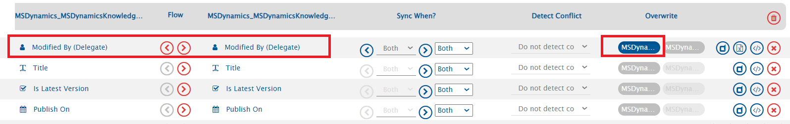

* Refer to the following documentation link of Dynamics 365 system for details:  
  [Add Dynamics Impersonation Documentation](https://learn.microsoft.com/en-us/power-apps/developer/data-platform/impersonate-another-user)

# System Configuration

- As you kickstart the integration, you must first configure MS Dynamics 365 system on OpsHub Integration Manager.
- Click [System Configuration](../integrate/system-configuration.md) to learn the step-by-step process to configure a system.

Refer to the following screenshot:

  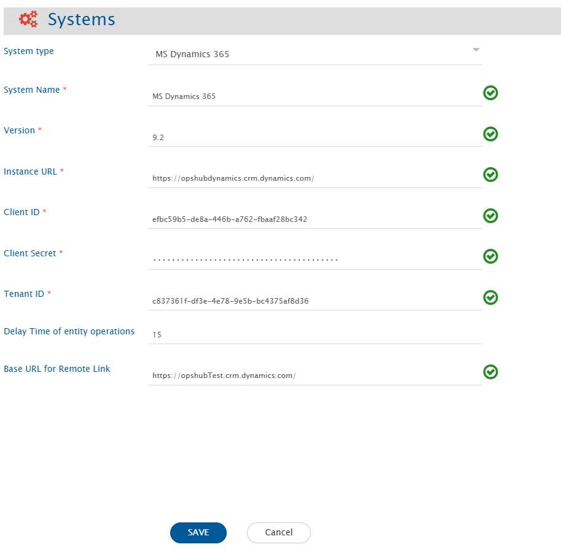

**MS Dynamics 365 system form details**

| **Field Name**              | **Description**                                                                                                                                                                                                                         |
|----------------------------|-----------------------------------------------------------------------------------------------------------------------------------------------------------------------------------------------------------------------------------------|
| **System Name**            | Provide the system's name                                                                                                                                                                                                              |
| **Version**                | Provide the version for MS Dynamics 365 instance. Example: 9.2                                                                                                                                                                         |
| **Instance URL**           | Provide instance URL of MS Dynamics 365 environment. This URL will be used for communicating to MS Dynamics 365 API. The format of the URL is: `https://<environment_url>.crm.dynamics.com` Example: `https://opshubdynamics.crm.dynamics.com` |
| **Client ID**              | Provide the Client ID (Application ID) for the application registered on the Azure Active Directory platform for generating the authentication. This application user will be used for communicating with MS Dynamics 365 API. This user should have the required privileges to use the MS Dynamics 365 API. Refer to [User privileges](#user-privileges) section for more details. Refer to [Register an App in Azure Active Directory](#register-an-app-in-azure-active-directory) section for getting the Client ID. |
| **Client Secret**          | Provide the Client Secret for the application registered on the Azure Active Directory platform for generating the authentication. Refer to [Steps for Generating the Client Secret](#steps-for-generating-the-client-secret) section for generating the Client Secret. |
| **Tenant ID**              | Provide the Tenant ID for the organization registered on the Azure Active Directory platform. Refer to [Register an App in Azure Active Directory](#register-an-app-in-azure-active-directory) section for getting the Tenant ID.       |
| **Base URL for Remote Link** | Provide different Instance URL of the MS Dynamics 365 instance. This URL is used for generating the Remote Link. E.g., if the Instance URL is `https://testdynamics.crm.dynamics.com/` or any API node URL, but Remote Link needs to be generated with a different Instance URL such as `https://opshubTest.crm.dynamics.com/`.  If "Base URL for Remote Link" is empty, it will use Instance/Server URL to generate Remote Link if configured on Integration. |

# Mapping Configuration

Map the fields between MS Dynamics 365 and the other system to be integrated to ensure that the data between both the systems synchronize correctly.

  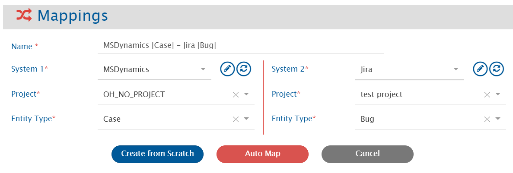

Click [Mapping Configuration](../integrate/mapping-configuration.md) to learn the step-by-step process to configure mapping between the systems.

In MS Dynamics 365, selecting the entity type in mapping configuration does not depend on the project selection as there is no concept of project in the system. So, the user needs to select `OH_NO_PROJECT` in the projects' tab.

> **Note**: If your entity is not visible in the entity list, enable "Appear in search results" from the entity settings. Refer to [Enable Search Result](#enable-search-result) section to know how to enable entity for synchronization with OpsHub Integration Manager.

## Comments Configuration

- When MS Dynamics 365 is the source system:
  - If comments are mapped in Mapping Configuration, then all the comments will be synchronized to the target system. Additionally, the attachments and inline images from the comment will sync to the target system based on its attachment behaviour. 
    - If the target system [such as Codebeamer] contains the comment with attachment functionality, the attachment will sync to attachment section and the reference to that attachment will be added to the comment. 
    - If the target system [such as Jira] contains the comment and attachment separately, the attachment will sync to attachment section and the comment will sync to comment section.
- When MS Dynamics 365 is the target system:
  - If comments are mapped in Mapping Configuration, comments will be synced to Notes section in MS Dynamics 365 system. 
    - For example, if the source system contains comment with attachment, in MS Dynamics 365 system, attachments will be added in one Note and reference to that attachment & comment content will be added to the another Note after synchronization.

## Attachments Configuration

- Each **File** and **Image** type field supports attachments in MS Dynamics 365. 
- MS Dynamics 365 as source system:
  - Attachments from all Notes, File fields & Image fields will sync to the target system.
- MS Dynamics 365 as target system:
  - Attachment mapping can be configured to decide the field of MS Dynamics 365 to which the attachment needs to be synced. 
    - If the attachment mapping toggle is enabled but the attachment type mapping is not configured, attachment will sync to the Notes of MS Dynamics 365 as a part of default attachment behavior.

  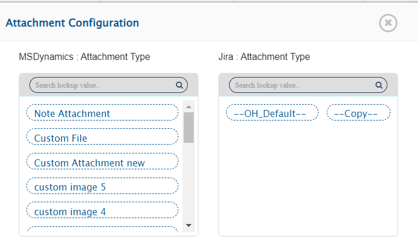

## Relationship Configuration

- In MS Dynamics 365, Lookup Reference fields will be supported as relationships.

### Lookup Reference Fields

- Lookup Reference fields are the fields that refer to some other MS Dynamics 365 entities which are supported by OpsHub Integration Manager. 
- Lookup Reference fields [System/Custom fields] will be synchronized through relationships. Here, the **Relationship name** of the reference field will be shown in link type in the mapping of the Relationship Configuration as shown in the screenshot below (the highlighted one is the Relationship Name of Lookup field):

  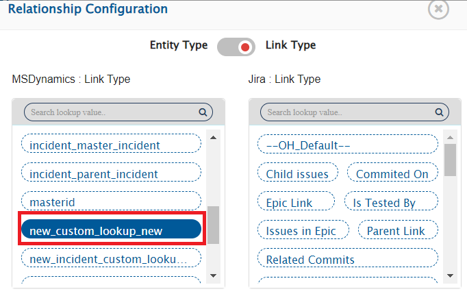

### Mandatory Links

- For **Case** entity, the user needs to configure the **Account** as the mandatory linkage in the OpsHub Integration Manager.
  - Reason: Case can be created inside the Account/Contact only.

# Integration Configuration

Set a time to synchronize data between MS Dynamics 365 and the other system to be integrated. Also, define parameters and conditions (if any) for integration. Refer to [Integration Configuration](../integrate/integration-configuration.md) to learn the step-by-step process to configure the integration between two systems. Refer to the screenshot below:

  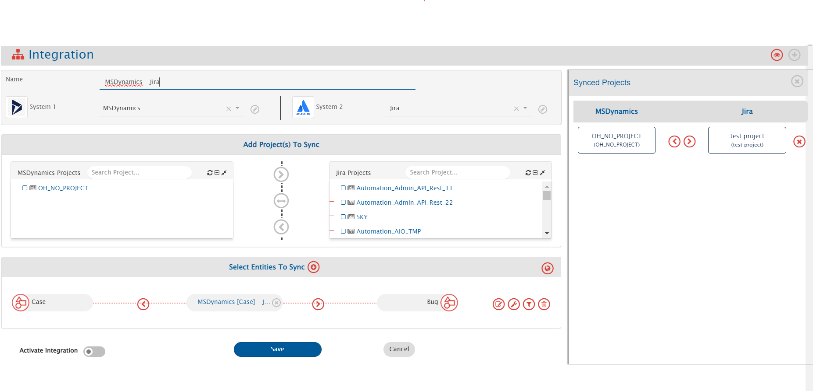

In MS Dynamics 365, selecting the entity type in integration configuration does not depend on the project selection.

## Entity Level Advance Configuration

- Display ID Field:
  - To configure the Display id field for an MS Dynamics 365 entity, user can select the field from the dropdown menu.
  - The selected field will be considered the "Display ID" in OpsHub Integration Manager and will be visible in the remote Id and sync report. Example, for the **Case** entity, user can select the **Case Number** in the Display ID Field as it is unique and considered as the Display id in MS Dynamics 365.
  - If the user does not select a field in the Display ID Field, the internal id of the MS Dynamics 365 entity (part of the entity URL) will be considered as the Display ID in OpsHub Integration Manager and will be displayed in the "remote Id" and "sync report".

  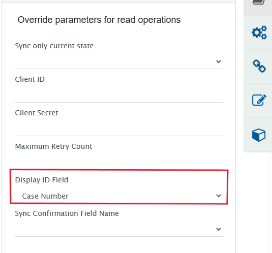

## Criteria Configuration

If the user wants to specify conditions for synchronizing an entity from MS Dynamics 365 as source system to the other system, the criteria must be configured. Navigate to Criteria Configuration section on [Integration Configuration](../integrate/integration-configuration.md) page to learn in detail about Criteria Configuration.  
Set the **Query** as per MS Dynamics 365 encoded query format. Given below are the sample snippets of how the MS Dynamics 365 queries can be used as criteria query in OpsHub Integration Manager:

**Criteria samples:**

| **Field Type**     | **Criteria Description**                                       | **Criteria snippet**                                                                 |
|--------------------|---------------------------------------------------------------|--------------------------------------------------------------------------------------|
| **Text**           | Synchronize all entities named as 'test feature'              | `name eq 'test feature'`                                                            |
| **Lookup**         | Synchronizes all the entities having priority as "High".      | `priority eq 'High'`                                                                 |
| **Date**           | Synchronize all entities updated after March 10, 2021         | `modifiedon gt '2021-03-10T00:00:00Z'`   Format: `yyyy-MM-dd'T'HH:mm:ss'Z'`       |
| **Lookup or Text** | Entities with Priority as 'High' or 'item' in Title           | `priority eq 'High' or title eq 'item'`                                              |
| **User**           | Entities modified by user 'ABC'                               | `modifiedby eq 'be4b12a8-e31f-ee11-9cbd-120d3a9d33d6'`   (`ABC`'s user ID)        |

## Target Lookup Configuration

- Provide query in Target Search Query field such that it is possible to search the entity in the MS Dynamics 365 as the target system. In the target search query field, the user can provide a placeholder for the source system's field value in the `@` symbol.

- Go to **Search in Target Before Sync** section on [Integration Configuration](../integration/integration-configuration.md) page to learn in detail about how to configure Target Lookup.

- Target Lookup Query is similar to [Criteria Configuration](#criteria-configuration), except that the value part contains a field name with `@` instead of a static value.

**Target Lookup query samples:**

| **Field Type**      | **Target Lookup usecase**                                                                 | **Snippet**                                                 |
|---------------------|-------------------------------------------------------------------------------------------|-------------------------------------------------------------|
| **Text**            | Lookup on entity where `name` matches source entity's ID                                  | `name eq '@oh_internal_id@'`                               |
| **Lookup and Text** | Lookup where `priority` and `name` match source's priority and ID                         | `priority eq '@priority' and name eq '@oh_internal_id@'`   |

# Known Behaviour

## Common

* From MS Dynamics Customer Service Hub UI, user can change the entity type.  
  ** In this case, OpsHub Integration Manager will create a new entity in the target and the previous one gets orphaned. 

* User can add custom entities in the end system. To sync that entity with OpsHub Integration Manager, user needs to enable "Appear in search results" in the entity settings. Refer to [Enable Search Result](#enable-search-result) section to know how to enable an entity for synchronization with OpsHub Integration Manager.

* Those entities will be synced that are within the polling time criteria and is created by a valid user. 

## History-based Sync

* User needs to enable the audit history in the end system for entity and fields to perform the history-based sync. Refer to [Enable Audit History](#enable-audit-history) section to know how to enable the audit history. 
* If the audit history is disabled, entities will be synced in the current state only.
* MS Dynamics 365 as source system:  
  ** When the user turns on the audit history for any entity from the end system settings after starting the sync, conflicts can be generated if the conflict detection setting is enabled in the OpsHub Integration Manager mapping.
* MS Dynamics 365 as target system:  
  ** When the user turns off the audit history for any entity from the end system settings after starting the sync, the recovery will not be handled for the entities [which are synced before enabling the history].

  
It is recommended to enable the history in MS Dynamics 365 before starting the sync.

## Entity Specific

### Knowledge Article

* Whenever a Knowledge Article entity is created from Dynamics 365 UI, the system creates an extra Root Knowledge article. Due to such behavior of Dynamics 365, OpsHub Integration Manager will create two Knowledge Articles for a single source entity when Dynamics 365 is the target system.
* To avoid such behavior when Dynamics 365 is target system, "Root Article" field can be mapped in OpsHub Integration Manager with value true which would ensure that only single root knowledge article is created.

  
By default, the above field value is false and OpsHub Integration Manager will follow the default behavior of Dynamics 365, if this field is not mapped.

# Known Limitations

## Common

* The following type of entities and the reference fields related to these entities are not supported by OpsHub Integration Manager:  
  ** Activity  
  ** Virtual  
  ** Elastic

* The following field type is not supported by OpsHub Integration Manager:  
  ** Formula type field

* Field type of attachments with size greater than 128 MB are not supported by OpsHub Integration Manager.  
  ** If more than 128 MB sized attachment is coming for the sync, then the processing failure will be observed in the attachment sync due to dynamics API limitation.

* For comment & attachment synchronization, when the user add/modify any comment/attachment, the user needs to update one field [System/Custom field] to sync the comment & the attachment.  
  ** Reason: In MS Dynamics 365, entity modified time does not get updated with inline image/attachment addition in Note or when a Note is added.

* Integration is configured with history, the configured entity supports history however for its any X field the history is not enabled separately:  
  ** If X field [history is disabled] gets changed then it will not synced till any other field [history is enabled] gets changed by dynamics user. 

## Entity Specific

### Case

* The Resolved type of fields will be synchronized without history.  
  ** Reason - Dynamics 365 API limitation.

### Opportunity

* The Closed type of fields will be synchronized without history.  
  ** Reason - Dynamics 365 API limitation.

# Appendix

## Register an App in Azure Active Directory

1. Log into Azure Active Directory using the user with privileges to create a new application.   
2. Navigate to App registrations Settings to add the application.   

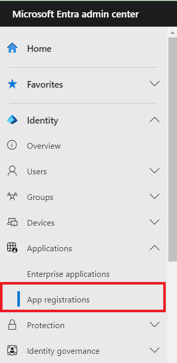
  
3. Click on the add **New registration** as shown in the screenshot below.   

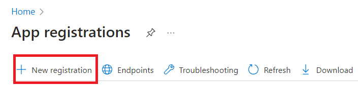
  
4. Give the right application name and Select the **Single tenant** option while creating the application. Click on Register as shown in the screenshot below.    

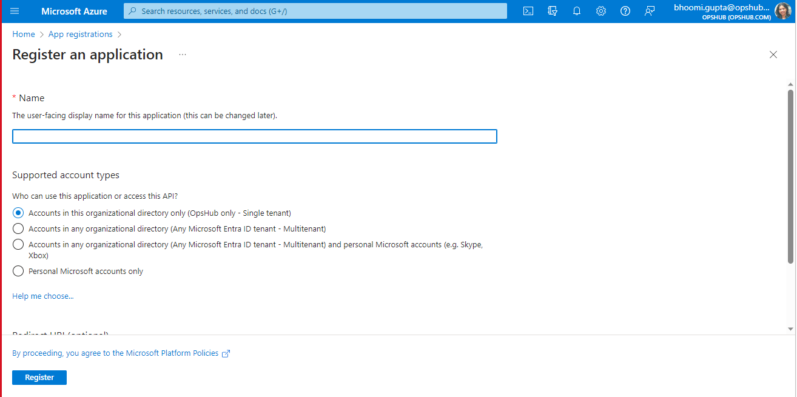
  
5. After registering an app, the user will be redirected to the application overview page where the user can find the Client ID and Tenant ID.    

## Steps for Generating the Client Secret

1. Register an application in Azure Active Directory. Refer to [Register an App in Azure Active Directory](#register-an-app-in-azure-active-directory) section.    
2. Navigate to the **Certificates & secrets** section from the left panel as shown in the screenshot below.    

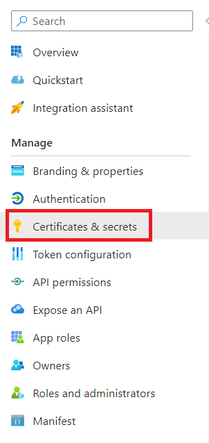
  
3. Navigate to **Client secrets** and click on **New client secret** to add the new secret.    

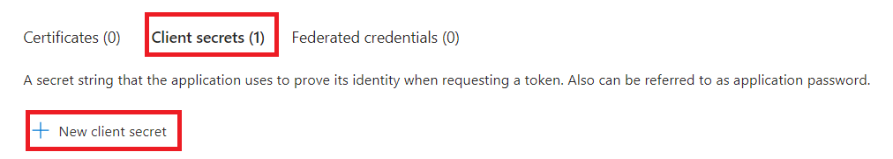
  
4. Add the secret description and expiration details. Click on Add as shown in the screenshot below.    

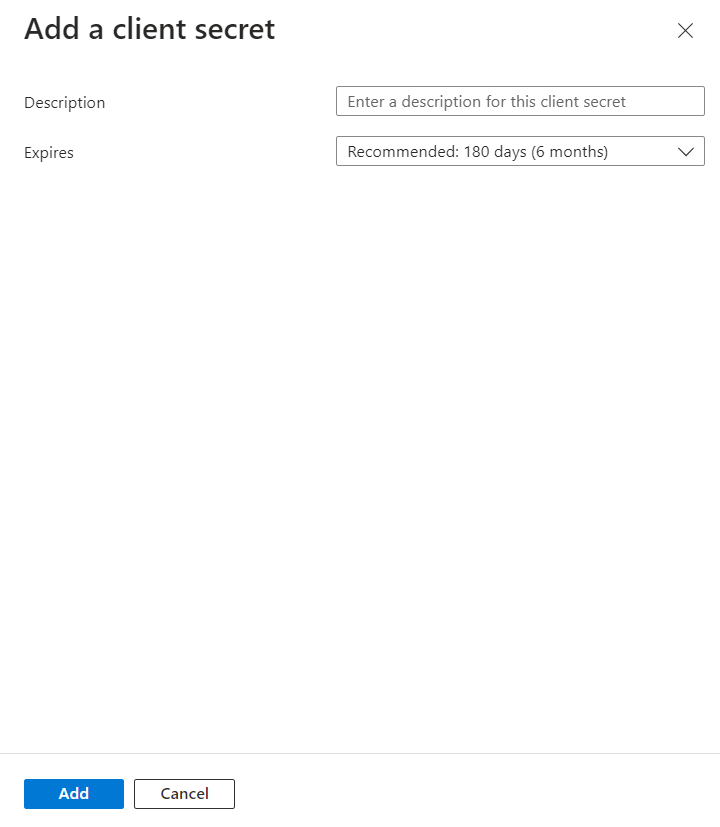
  
5. The user must save the secret value when created before leaving the page. As client secret value can only be visible immediately after its creation.  

## Add User

1. Register an application in Azure Active Directory. Refer to [Register an App in Azure Active Directory](#register-an-app-in-azure-active-directory).
2. Generate the Client secret in that application. Refer to [Steps for Generating the Client Secret](#steps-for-generating-the-client-secret).
3. Login to the Power Apps Admin portal.  
4. Go to the Environment in which your MS Dynamics 365 system is running.  

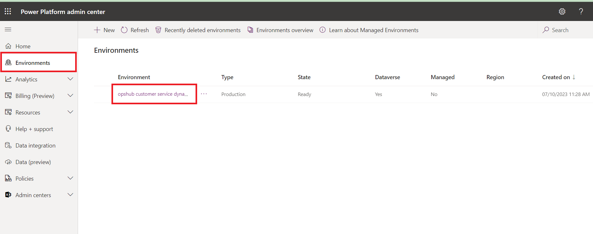

5. Navigate to the settings from the top.  

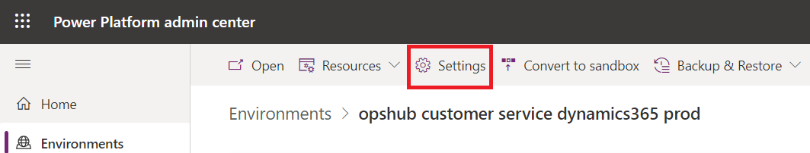

6. Navigate to the **Application users** under *Users + permissions* section as shown in the screenshot below.  

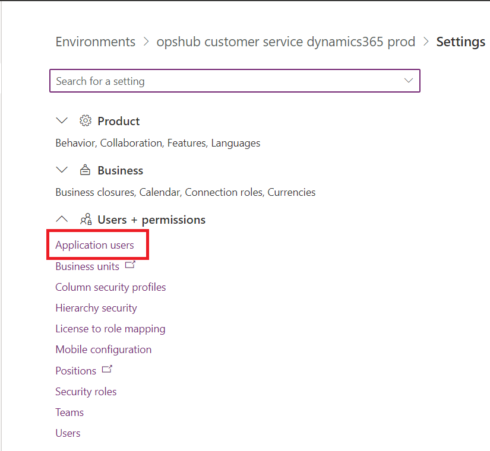

7. Click on the **New app user** from the top to add the application user.  

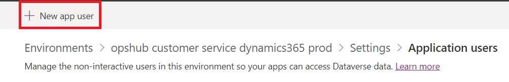

8. Click on **Add an app** and select the application created in AAD. Select your **Business Unit**.  

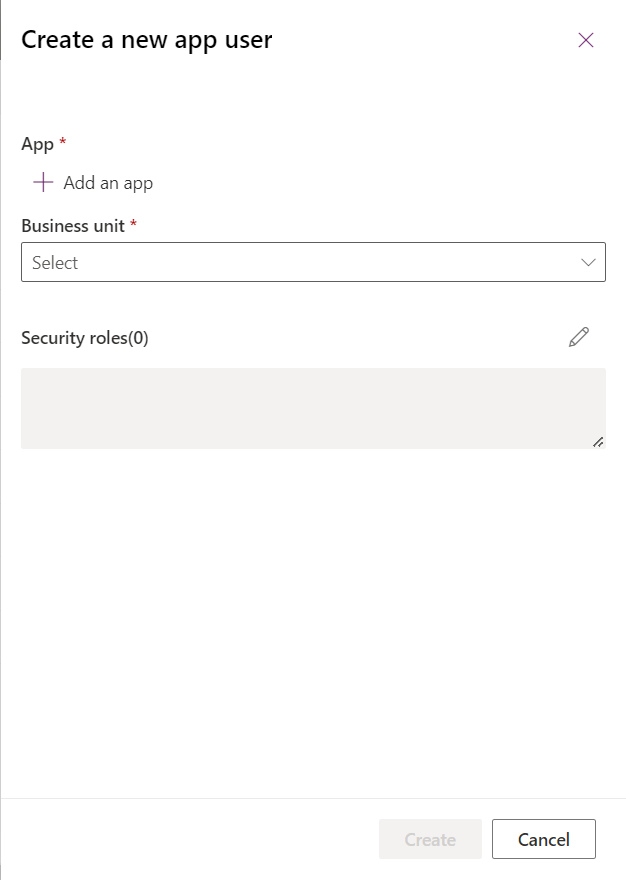

9. Fill the details regarding the user security role. Select the above mentioned security roles from the list of security roles.  
10. Click on **Create** to add the user.  

## Grant Permissions to MS Dynamics 365 User

1. Log into the Power Apps Admin portal.  
2. Go to the Environment in which your MS Dynamics 365 system is running.  

3. Navigate to the settings from the top.  

4. Navigate to the **Application users** under *Users + permissions* section.  

5. Select the user for which you want to change the permissions and click on **Edit security roles** from the top as shown in the screenshot below.  

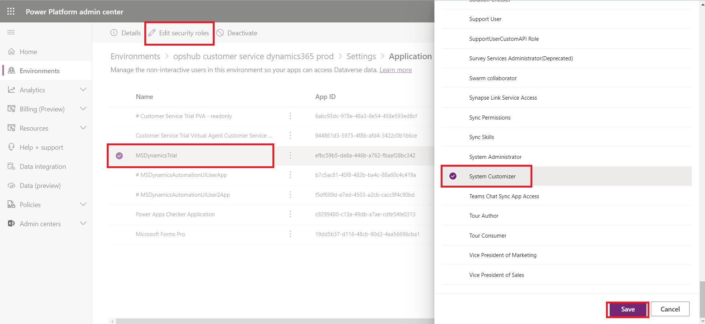

6. Select above mentioned security roles from the list of roles.  
7. Save the changes.  

## Add Security Role in MS Dynamics 365

1. Log into the Power Apps Admin portal.  
2. Go to the **Environments** in which your MS Dynamics 365 system is running as shown below:  

3. Navigate to the **Settings** as shown below:  

4. Navigate to the **Security roles** under *Users + permissions* section.  

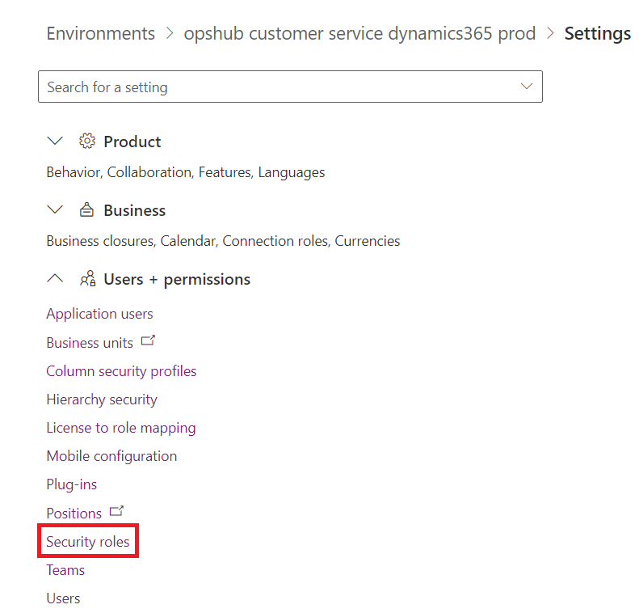

5. Add the **New role**.  

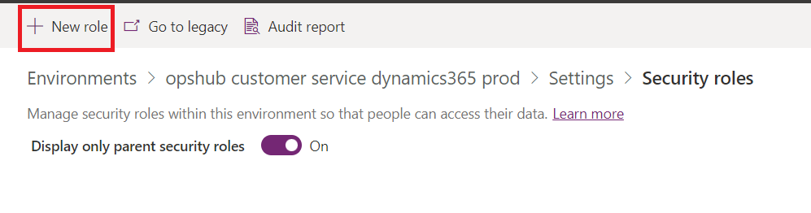

6. Give a proper security **Role Name**. Similarly, select a proper organization name.  

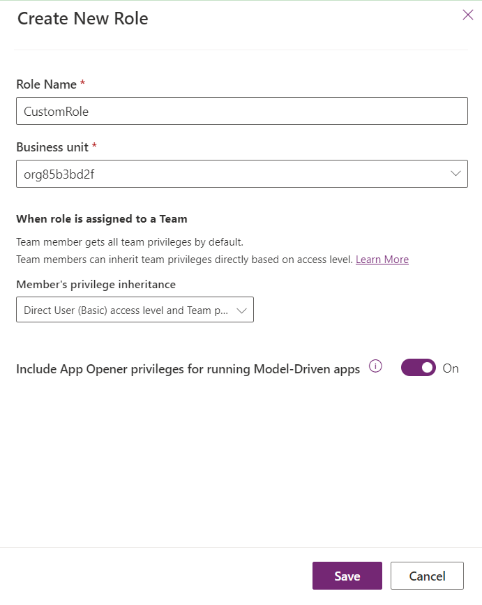

7. Add the privileges for this security role and **Save** the changes.  

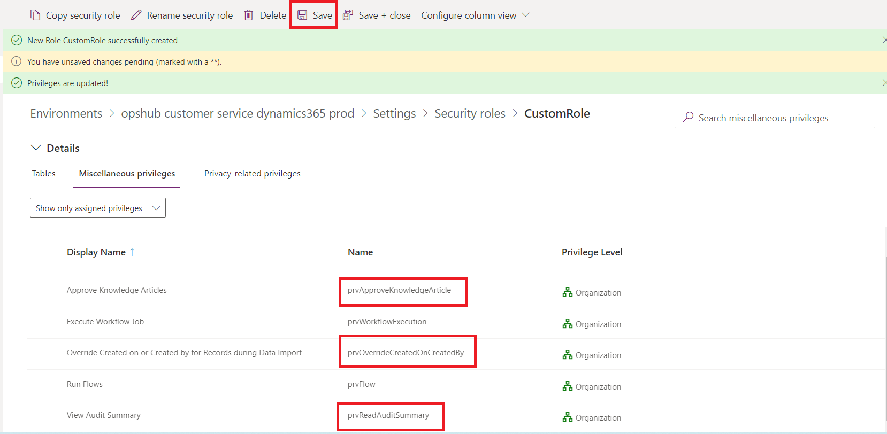

## Add New Profile in Column Security Profile

1. Log into the Power Apps Admin portal.  
2. Go to the **Environments** in which your MS Dynamics 365 system is running as shown below:  

3. Navigate to the **Settings** as shown below:  

4. Navigate to the **Column security profiles** under *Users + permissions* section.  

5. Add the **New Profile**.  

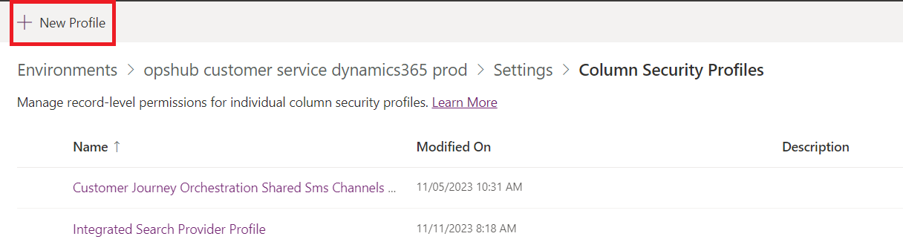

6. Give a proper profile name and click on **Save** to create.  

7. Click on the created profile. Select the column for which permission needs to be added. Click on **Edit**.  

8. Allow **Read**, **Update** and **Create** permissions. **Save** the changes.  

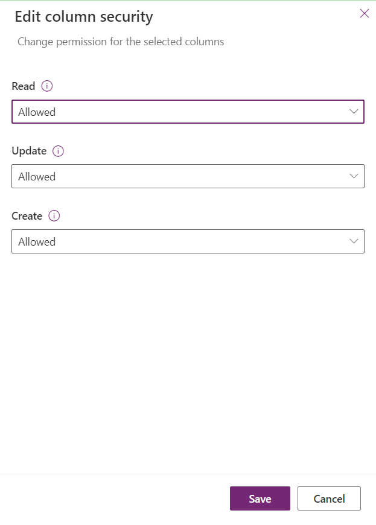

9. Select the **Users** tab and click **Add Users** to add the integration user in the search window as shown below:  

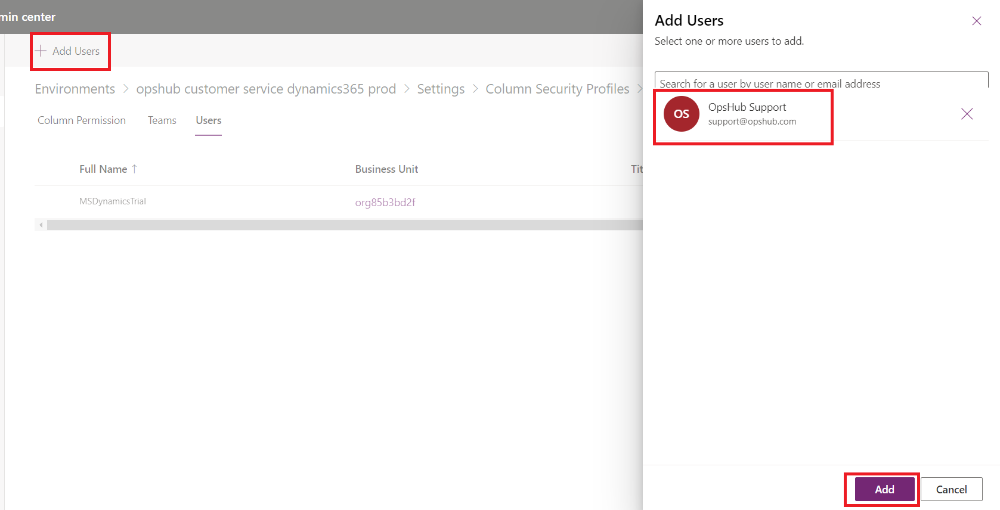

## Enable Search Result

1. Log into the Power Apps portal.  
2. Navigate to **Tables** present in sidebar and select the entity table in which the user wants to enable the search results.  

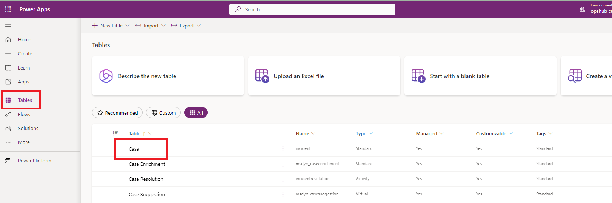

3. Click on the **Properties** section from the top as shown in the screenshot below.  

4. In the newly opened menu, select the "Appear in search results" checkbox from the advanced options.  

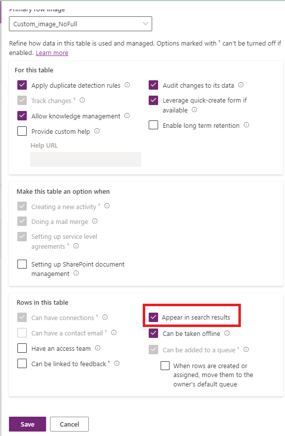

5. Save the changes.  

## Enable Audit History for MS Dynamics 365 Environment

1. Log into the Power Apps Admin portal.  
2. Go to the Environment in which your MS Dynamics 365 system is running.  

3. Navigate to the settings from the top.  

4. Navigate to the **Audit settings** under the *Audit and logs* section.  

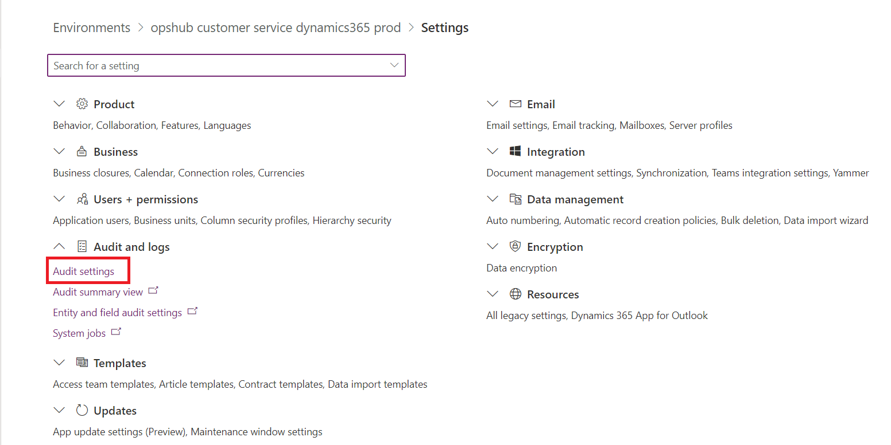

5. Select the **Start Auditing** checkbox from the list and select the proper log retention period.  

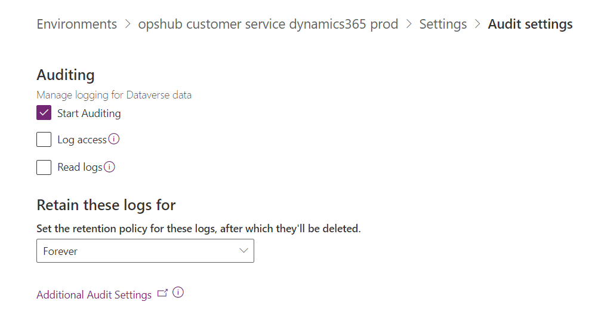

## Enable Audit History

1. Firstly, enable the **Start Auditing** for the environment because entity auditing won't work if auditing is turned off at the environment level. Refer to [Enable Audit History for MS Dynamics 365 Environment](#enable-audit-history-for-ms-dynamics-365-environment).  
2. Login to the Power Apps portal.  
3. Navigate to **Tables** section in the sidebar and select the entity table in which you want to enable the search results.  

4. Click on the **Properties** section from the top as shown in the screenshot below.  

5. In the newly opened menu, select the **Audit changes to its data** checkbox from the advanced options.  

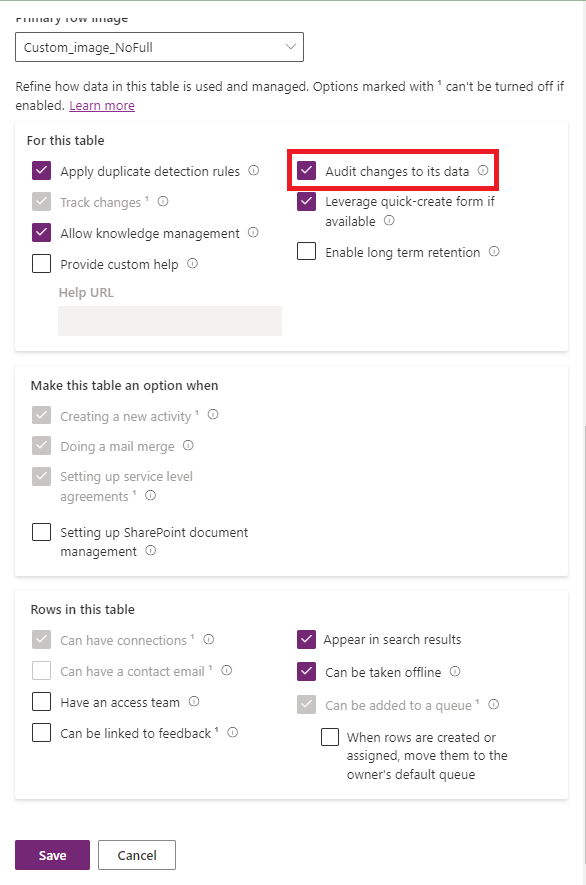

6. Save the changes.  

## Add Custom Fields

1. Log into the Power Apps portal.  
2. Navigate to **Tables** section in the sidebar and select the entity table in which you want to add the custom field.  

3. Navigate to **Schema** and select the **Columns**.  

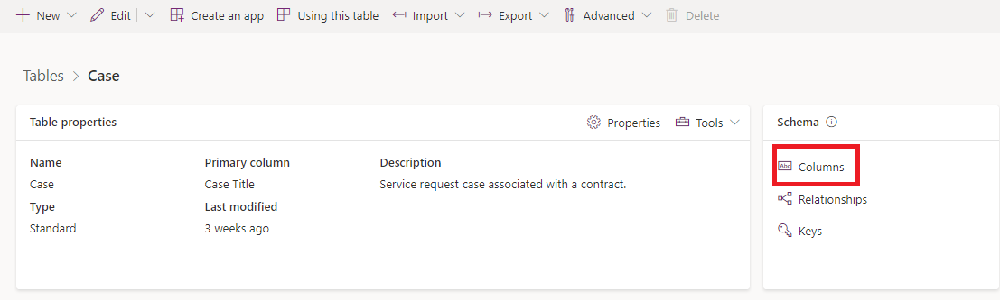

4. Click on the **New Column** from the top to add the new custom field.  

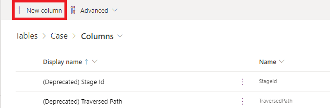

5. Fill the details for creating the custom field as shown in the screenshot below.  

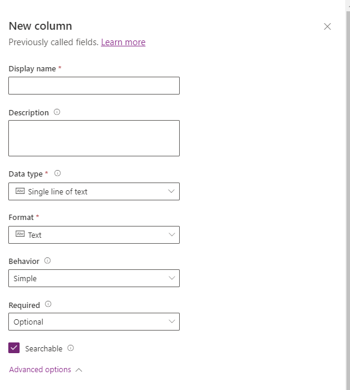

6. Remember to enable the auditing from the *Advanced options* to maintain the audit history for the field.  

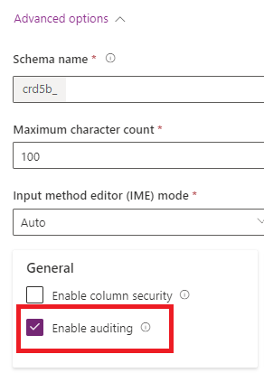

7. Save the changes.  
8. To add the created custom field to the current layout, open the MS Dynamics 365 App and navigate to the Application name given at the top on the page.  

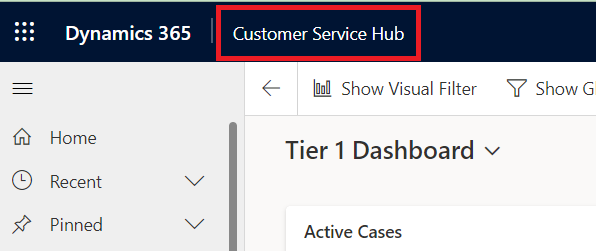

9. Navigate to your current App and select the **OPEN IN APP DESIGNER** option.  

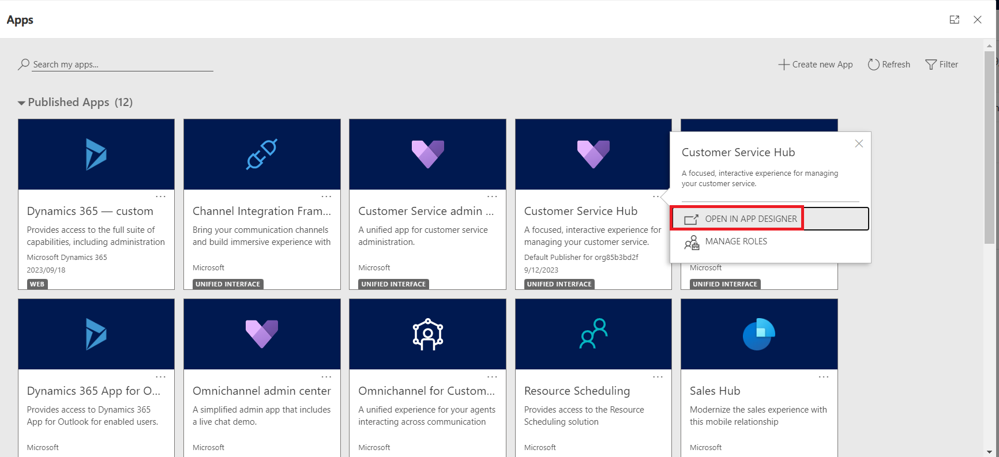

10. Navigate to the entity for which the user has created the custom field. Select any one entity from the list.  

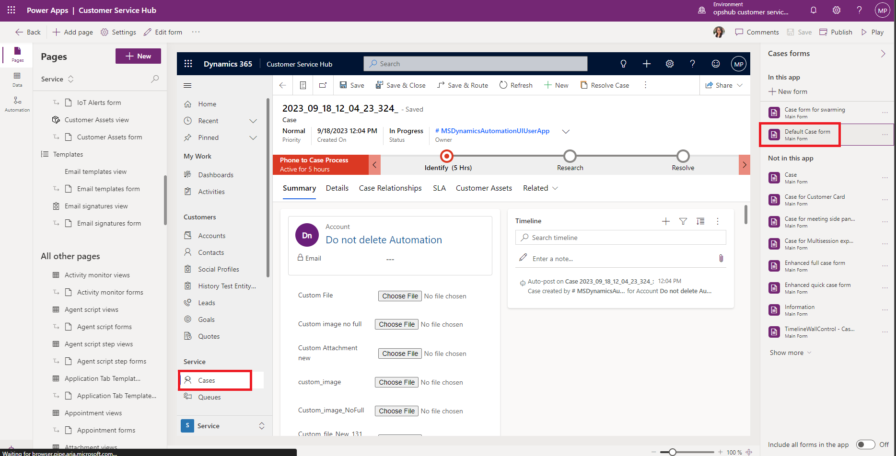

11. From the right menu, select the form and click on **Edit**.  

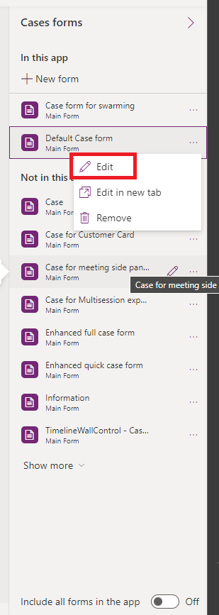

12. It will open the entity form. Now add the custom field visible on the left panel to the form.  

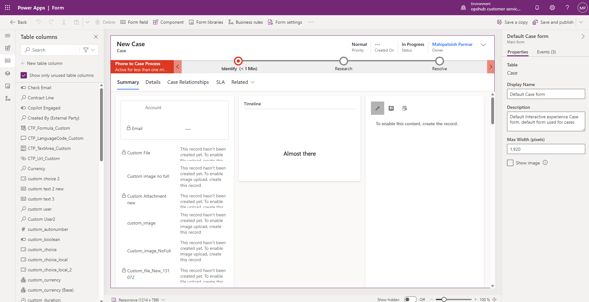

13. **Save and publish** the changes as shown in the screenshot below.  

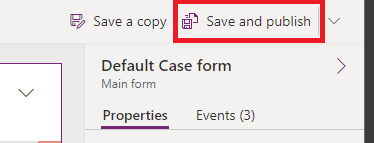

## Add Custom Layout

1. Open the MS Dynamics 365 App and navigate to the Application name given at the top on the page.  

2. Navigate to your current App and select the **OPEN IN APP DESIGNER** option.  

3. Select the entity for which you want to create the custom layout, and select any one entity from the list.  

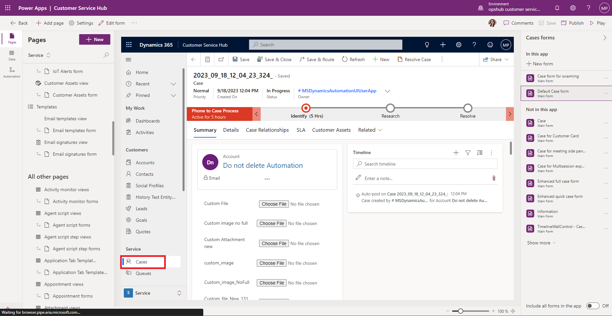

4. From the right menu click on **New form** to create the new layout.  

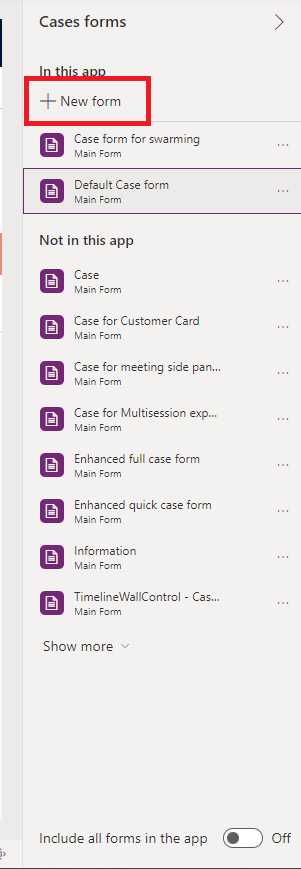

5. It will open the new entity form. Give the name to the form and add the field visible on the left panel to the form.  

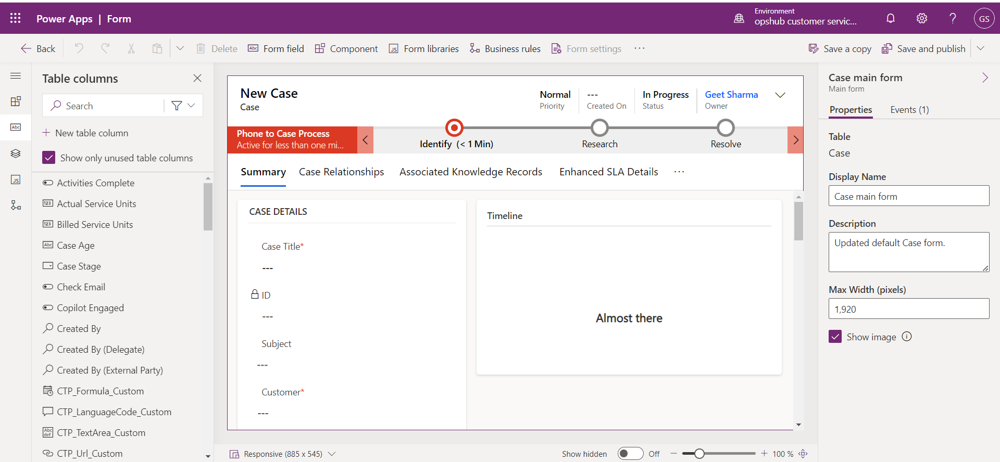

6. **Save and publish** the changes as shown in the screenshot below.  

