# Prerequisites

## User Privileges

1. Create a user in PagerDuty that is dedicated for OpsHub Integration Manager. This user shouldn't perform any other action from PagerDuty's user interface. We will refer to this user as IntegrationUser further in the document. For the steps to add user, please see [Steps to Add User](#steps-to-add-a-user).

2. For authenticating the above user, we would need an API token. For the steps to generate an API token, please see [How to Generate API token](#how-to-generate-api-token) section.

### Roles and Permissions

* **When PagerDuty is only source end point (Only Read)**  
  * Assign **Observer** role to IntegrationUser.  
  * If you want to configure [Remote Entity Fields](../integrate/integration-configuration.md#tracking-id-and-link-of-entities-across-systems), please refer to **Read & Write** section below.

* **When PagerDuty is destination end point (Read & Write)**  
  * Assign **Responder** role to IntegrationUser.

In PagerDuty, permissions can be assigned in either of the three ways:

1. **Permission at Instance level**: If you want to assign permissions for the incidents of all the public services, please refer to [Permission at instance level](#instance-level-permission) section for step-by-step guide on how to assign these permissions.

2. **Permission at Service level**: If you want to assign permissions for incidents in a particular service, please refer to [Permission at service level](#service-level-permission) section for step-by-step guide on how to assign these permissions.

3. **Permission at Team Level**: If you want to group services into teams and assign permissions to the team instead of assigning the same permission at multiple services, please refer to [Permission at team level](#team-level-permission) section for step-by-step guide on how to assign these permissions. Refer to [How to group services into teams](https://support.pagerduty.com/docs/teams) for help around grouping the services into teams.

# System Configuration

Before you continue with the integration, you must first configure PagerDuty system onto OpsHub Integration Manager.

Click [System Configuration](../integrate/system-configuration.md) to learn the step-by-step process to configure a system.

Refer to the screenshot given below:

  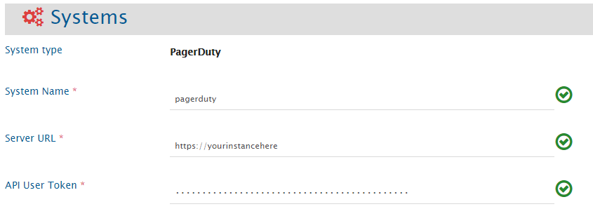

| **Field Name**       | **When field is visible on the System form** | **Description**                                                                                                                                            |
|----------------------|----------------------------------------------|------------------------------------------------------------------------------------------------------------------------------------------------------------|
| **System Name**      | Always                                       | Provide PagerDuty System Name                                                                                                                              |
| **Server URL**       | Always                                       | Set the URL of PagerDuty instance.                                                                                                                         |
| **API User Token**   | Always                                       | Add the User API token generated for the dedicated user for OpsHub Integration Manager. Please refer to [How to Generate API token](#generateapitoken).   |

# Mapping Configuration

Map the fields between PagerDuty and the other system to be integrated to ensure that the data between both the systems synchronize correctly.

Click [Mapping Configuration](../integrate/mapping-configuration.md) to learn the step-by-step process to configure mapping between the systems.

  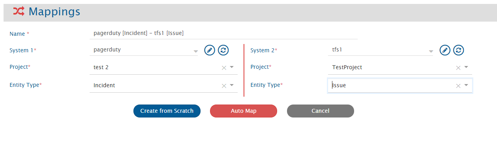

> **Note** : **While configuring mapping, the details appearing in the 'Projects' drop-down are services in PagerDuty.**

> **Note** : **Refer to the table given below to see which fields are supported when PagerDuty is Source and Target.**

| **Field Name**       | **DataType** | **Is supported when PagerDuty is Source?** | **Is supported when PagerDuty is Target?** |
|----------------------|--------------|--------------------------------------------|--------------------------------------------|
| Incident Key         | Text         | ✅                                         | ❌                                         |
| Incident Number      | Numeric      | ✅                                         | ❌                                         |
| Incident Id          | Text         | ✅                                         | ❌                                         |
| Title                | Text         | ✅                                         | ✅                                         |
| Description          | Text         | ✅                                         | ✅                                         |
| Status               | Look-up      | ✅                                         | ✅                                         |
| Priority             | Look-up      | ✅                                         | ✅                                         |
| Conference Number    | Text         | ✅                                         | ✅                                         |
| Conference URL       | Text         | ✅                                         | ✅                                         |

## Comments

There are two types of comments in PagerDuty:
* Notes
* Status Updates

Synchronization for both of these comment types is supported.

By default, **Notes** in PagerDuty is synchronized to and from the other end system.

User should change the comments mapping manually to synchronize **Status Updates** in PagerDuty to and from the other end system.

To learn how to configure comment mapping, refer: [Map Comments](../integrate/mapping-configuration.md#comments)

**Comment Mapping for synchronizing Status Update as Comment:**

  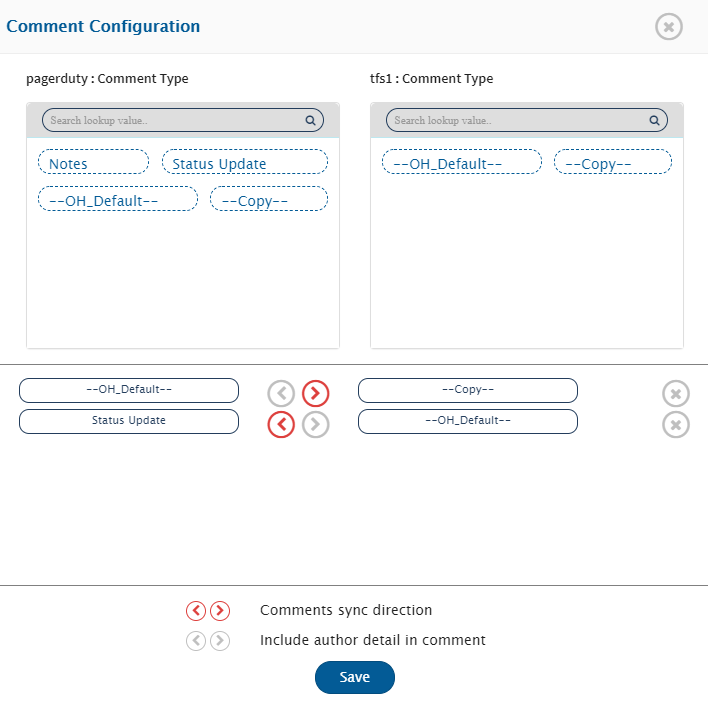

# Integration Configuration

In this step, set a time to synchronize data between PagerDuty and the other system to be integrated. Also, define parameters and conditions, if any, for integration.

Click [Integration Configuration](../integrate/integration-configuration.md) to learn the step-by-step process to configure integration between two systems.

  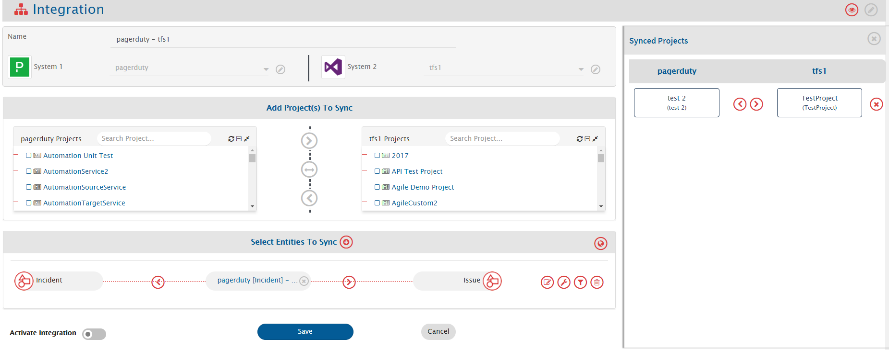

> **Note** : **While configuring integration, the details appearing in the 'Projects' drop-down are services in PagerDuty.**

## Criteria Configuration

If you want to specify conditions for synchronizing an entity between PagerDuty and the other system to be integrated, you can use the **Criteria Configuration** feature.

To learn how to configure criteria, refer: [Configure Criteria](../integrate/integration-configuration.md#criteria-configuration) page.

In PagerDuty, criteria can be configured on the fields: **Status** and **Incident Key**.

| **Field Name** | **Criteria Description**                                  | **Criteria Example**                             |
|----------------|------------------------------------------------------------|--------------------------------------------------|
| Status         | Status is *acknowledged*                                   | statuses[]=acknowledged                          |
| Status         | Status is *acknowledged* or *triggered*                   | statuses[]=acknowledged&statuses[]=triggered     |
| Incidence Key  | Incidence key is *abc* (here, abc is just example, you can get incidence key of an incident after creating it)       | incident_key=abc                                 |

## Target LookUp Configuration

Provide query in Target Search Query field such that it is possible to search the entity in the PagerDuty as a destination system.

To learn how to configure Target Lookup, refer: [Configure Target Lookup](../integrate/integration-configuration.md#search-in-target-before-sync)

In PagerDuty, Target Lookup can be configured on 3 fields: **Incident Number**, **Incident Id**, and **Incident Key**.

| **Field Name**     | **Target Lookup Query Syntax**              |
|--------------------|---------------------------------------------|
| Incident Key       | incident_key=@Source_System_Field_name@    |
| Incident ID        | ID=@Source_System_Field_name@              |
| Incident Number    | ID=@Source_System_Field_name@              |

# Known Limitations

**When PagerDuty is Source**
* For below fields, revision details are not available. Hence, only the state of these fields at the time of synchronization will get synchronized, and the states before the time of synchronization will not be synchronized.
  * **Status**, **Conference Number**, and **Conference URL**
* **Criteria** is not fully supported in PagerDuty. An entity is considered as qualified only if it meets the criteria and is **created** after the polling time.

**When PagerDuty is Target**
* **Description** cannot be updated. So, to avoid failure, keep the 'Sync When?' to 'Create' while mapping from other end point to PagerDuty in **Advanced Settings**. To learn about Advanced Settings, refer: [Advanced Settings](../integrate/mapping-configuration.md#advance-settings)
* **Status** cannot be changed from ‘Acknowledged’ to ‘Triggered’ through integration. If it is tried to be changed, then failure would be generated.
* **Conference** fields unset is not possible. If user tries to unset it, then no failure occurs, but it will not be unset as well.

## Best Practices

**When PagerDuty is Source**
* Having single integration for two services will give more performance than having two integrations for each service. If you configure two different integrations for two services, then one will not slow down the performance of other, but if you know the services upfront, configuring it in one go will give high performance. But, what if a user later wants to add a service to an integration?  
  **Ans**: The user should create separate integration first, integrate past data and then merge both the services in one integration.

# Appendix

## Add User

To perform synchronization with PagerDuty, add a user for integration to the PagerDuty System. This user should not perform any task from UI.  
Login to the PagerDuty system with base role **Admin**, **Global Admin**, or **Account Owner** to add a new user.

## Steps to Add a User

1. Go to **Configuration** → **Users**

  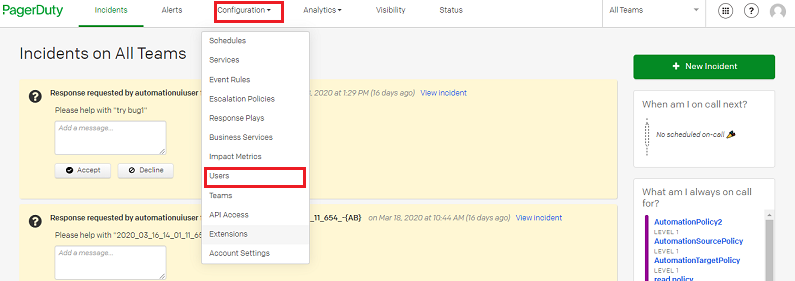

2. Click **Add Users** on the top right corner of the page.

  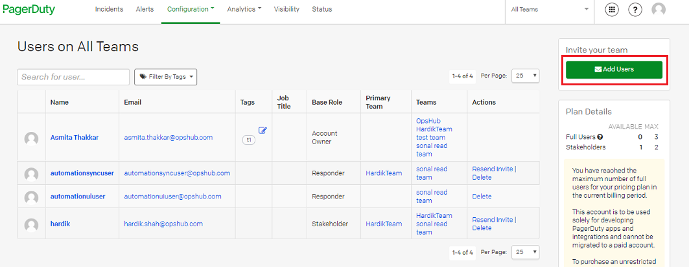

3. Enter the user details and select **Base Role** for the user.

  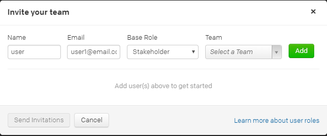

4. Click **Send Invitations**

  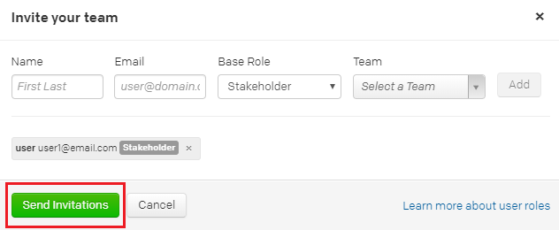

5. An invitation will be received on the email provided in the details above. Accept the invitation from the email. Thus, the user will be added.

## Assign Roles to User

### Instance Level Permission

**Read**  
* To read incidents from all the public services, assign **Observer** base role to the IntegrationUser.

**Read & Write**  
* To read incidents from all the public services, and to write to all the public services, assign **Responder** base role to the IntegrationUser.

*For better understanding of **User Roles** at instance level from PagerDuty context, refer: [User roles at Instance level](https://support.pagerduty.com/docs/advanced-permissions)*

### Steps to assign a Base Role

1. Login to PagerDuty from an account having user role **Admin**, **Global Admin** or **Account Owner**  
2. Go to **Configuration** → **Users**

  

3. Click user which is used for synchronization and go to **Permissions and Teams** tab:

  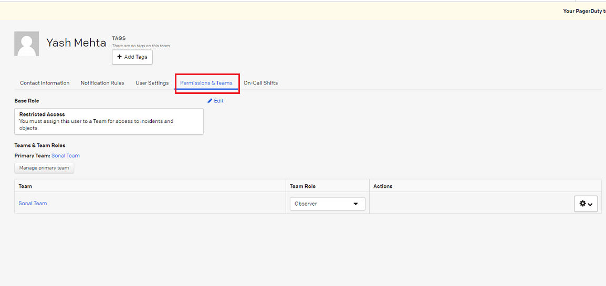

4. Select **Edit** option beside Base role:

  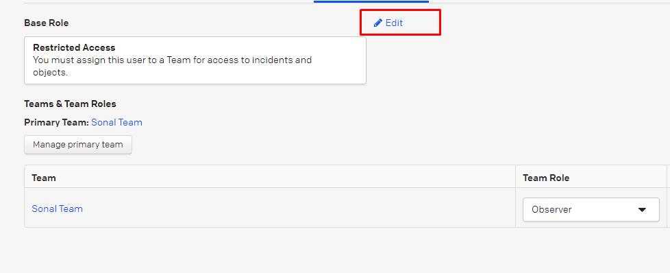

5. Select **Observer** role under **flexible** roles and then **Save** the configuration. You can assign **Responder** role in the same way.

  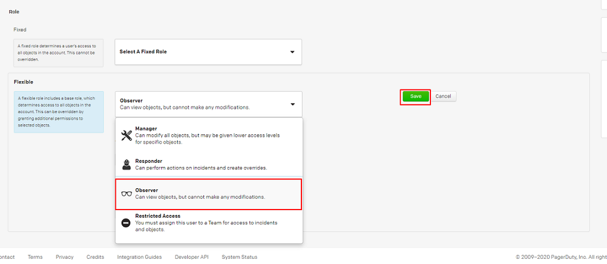

### Service Level Permission

#### Read

* To read incidents from a particular service, set **Observer** role at service level for the IntegrationUser.

#### Read & Write

* To read incidents from a particular service and to write to it, assign **Responder** role at service level for the IntegrationUser.

*For better understanding of **User Roles** at service level from PagerDuty context, refer: [User roles at Service level](https://support.pagerduty.com/docs/advanced-permissions)*

#### Steps to Set a Role at Service Level

1. Login to PagerDuty from an account having user role **Admin**, **Global Admin** or **Account Owner**

2. Go to **Configuration** → **Users**

  

3. Click user which is used for synchronization and go to **Permissions and Teams** tab:

  

4. Select **Edit** option beside Base role:

  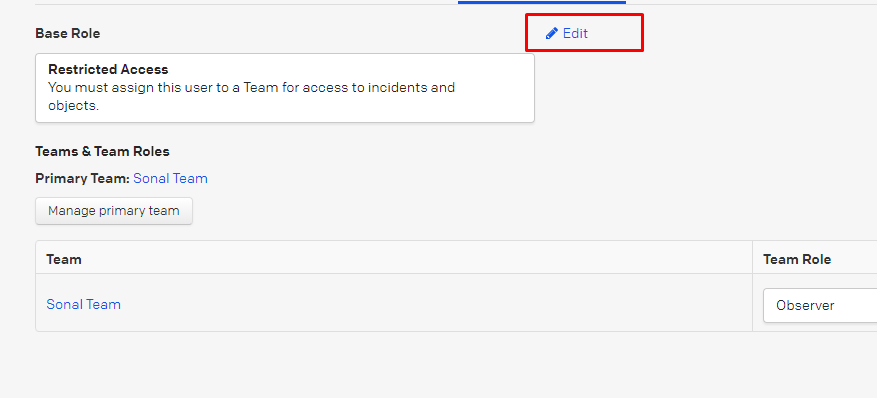

5. Select services under **Responder Access To** for which you want to assign the Responder role. You can give Observer access in the same manner.

  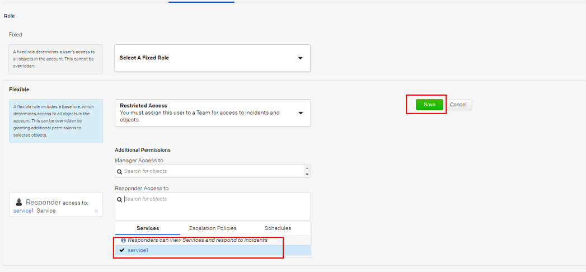

### Team Level Permission

#### Read

* To read incidents from a particular team, set **Observer** role at team level for the IntegrationUser.

#### Read & Write

* To read incidents from a particular team and to write to it, assign **Responder** role at team level for the IntegrationUser.

*For better understanding of **User Roles** at team level from PagerDuty context, refer: [User roles at Team level](https://support.pagerduty.com/docs/advanced-permissions)*

#### Steps to set a role at Team Level

1. Login to PagerDuty from an account having user role **Admin**, **Global Admin** or **Account Owner**

2. Go to **Configuration** → **Users**

  

3. Click user which is used for synchronization and go to **Permissions and Teams** tab:

  

4. Select Team Role to **Observer**. Here, you can select the role that you want to assign:

  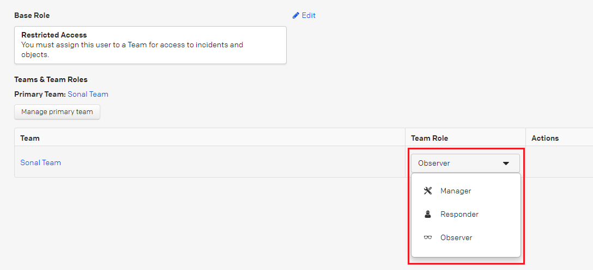

## How to Generate API token

1. Login to PagerDuty from 'IntegrationUser' account.

2. Go to **User** → **My Profile**

  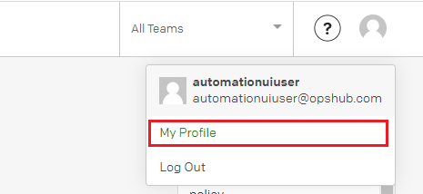

3. Go to **User Settings** tab

4. Click **Create API User Token**

  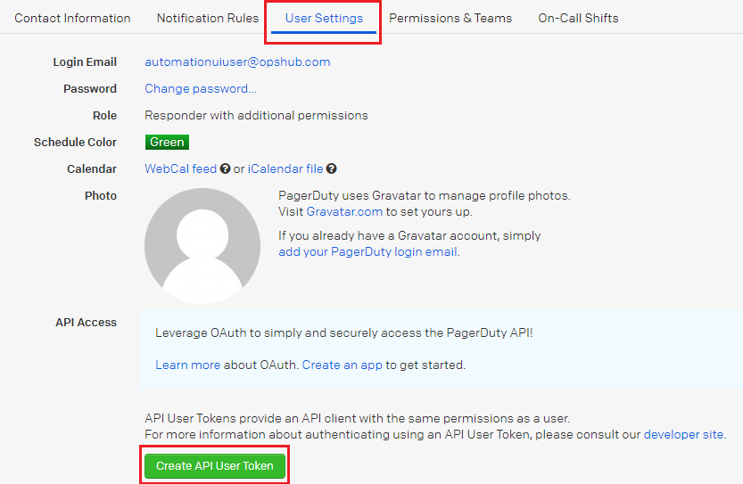

Thus, an API token will be generated for the integration user.

Copy and save this API token, as it will not be fully visible again.

