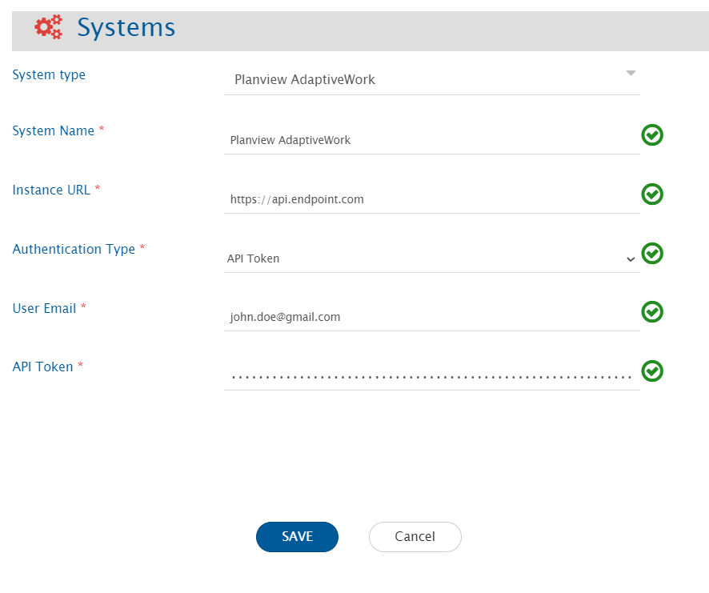
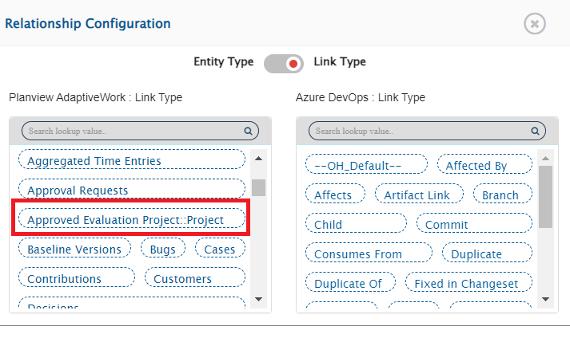
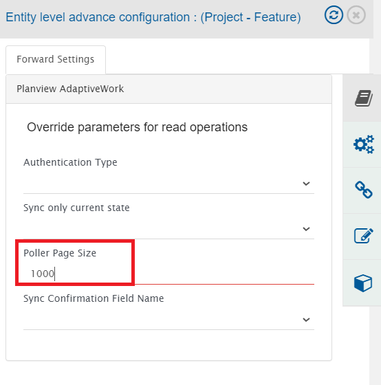
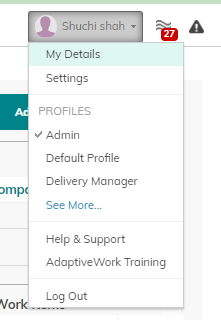
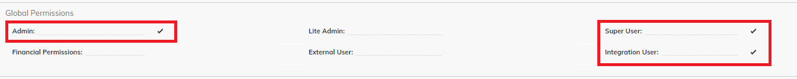
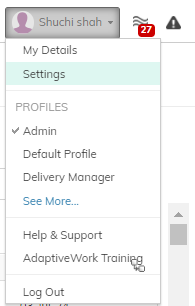
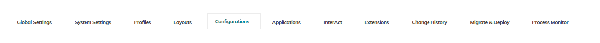
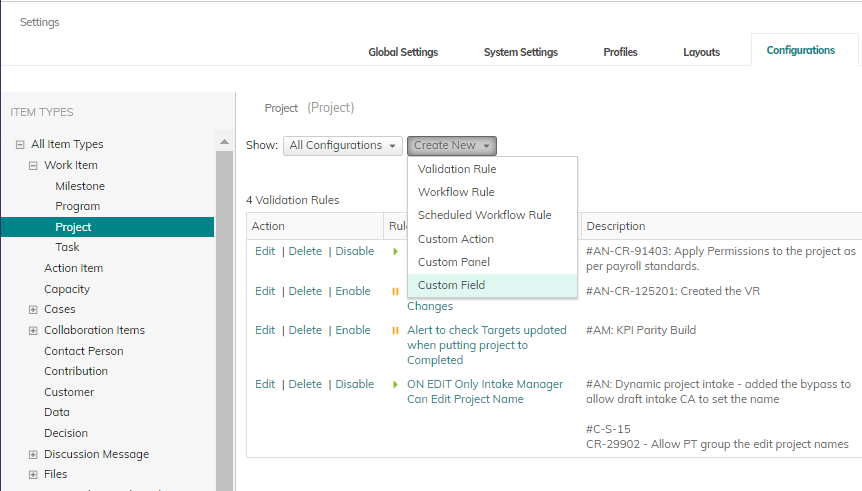
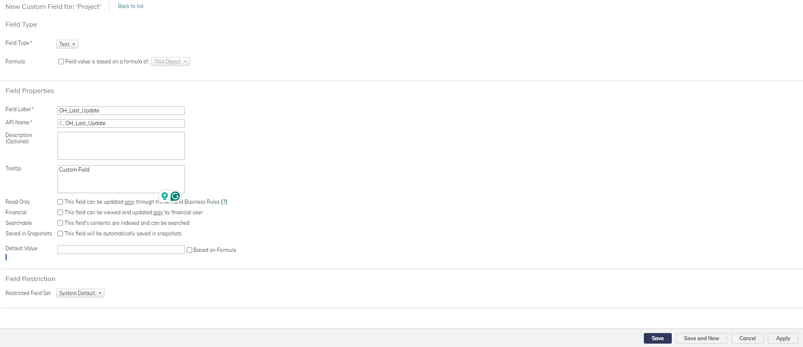
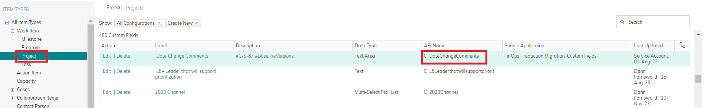

# Prerequisites

## User Privileges

* Create one user in Planview AdaptiveWork that is dedicated for OpsHub Integration Manager. This user shouldn't perform any other action from Planview AdaptiveWork's user interface. This user is referred as 'Integration User' in the document.
* To synchronize entities from any system to Planview AdaptiveWork, the integration user must have **Super User**, **Admin User** & **Integration User** permissions  [which can be configured on the People screen by the admin user]. Refer to [grant-permissions-to-planview-adaptivework-user](planviewadaptivework.md#grant-permissions-to-planview-adaptivework-user) section for details on how to grant permissions to a Planview AdaptiveWork user.

# System Configuration

* As you kickstart with the integration, you must first configure Planview AdaptiveWork system in OpsHub Integration Manager.
* Click [System Configuration](../integrate/system-configuration.md) to learn the step-by-step process to configure a system.

Refer to the following screenshot:

**Planview AdaptiveWork System form details**

| **Field Name**          | **Description**                                                                                                                                                                                                                                                                                               |
| ----------------------- | ------------------------------------------------------------------------------------------------------------------------------------------------------------------------------------------------------------------------------------------------------------------------------------------------------------- |
| **System Name**         | Provide the system's name                                                                                                                                                                                                                                                                                     |
| **Instance URL**        | 
Provide API URL of the Planview AdaptiveWork instance. This URL will be used for communicating to Planview AdaptiveWork API. The format of the URL is: https://api.&#x3C;instance_name>.com Example: https://api.clerizentb.com
                                                                     |
| **Authentication Type** | Select authentication type from **API Token** or **Session based Authentication**.                                                                                                                                                                                                                            |
| **User Email**          | Provide the email id of the dedicated user who will communicate with the Planview AdaptiveWork API. This user should have all the required privileges to use the Planview AdaptiveWork API. For more details, refer to [user-privileges](planviewadaptivework.md#user-privileges) section.                    |
| **Password**            | Provide the password generated in Planview AdaptiveWork for the user given in "User Email" field. This field is required when Authentication Type is selected as "Session based Authentication".                                                                                                              |
| **API Token**           | Provide the API Token generated in Planview AdaptiveWork for the user given in "User Email" field. This field is required when Authentication Type is selected as "API Token". Refer to [this section](https://success.planview.com/Planview_AdaptiveWork/API/API_Keys_Support) for generating the API token. |

# Mapping Configuration

Map the fields between Planview AdaptiveWork and the other system to be integrated to ensure that the data between both the systems synchronize correctly.

Click [Mapping Configuration](../integrate/mapping-configuration.md) page to learn the step-by-step process to configure mapping between the systems.

> **Note** In Planview AdaptiveWork, selecting the entity type in mapping configuration does not depend on the project selection as 'Project' works as an entity in the end system. So, the user needs to select OH_NO_PROJECT in the projects' tab.

## Relationship Configuration

In Planview AdaptiveWork, Reference fields will be supported as Relationships.

**Reference Fields**

* Reference fields: These fields refer to Planview AdaptiveWork entities that are supported by OpsHub Integration Manager.
* Reference fields (System/Custom fields) will be synchronized through relationships. In the Relationship Configuration, the link type mapping will display the names of the Reference fields along with their references.

# Integration Configuration

Set a time to synchronize data between Planview AdaptiveWork and the other system to be integrated. Also, define parameters and conditions (if any) for integration. Refer to [Integration Configuration](../integrate/integration-configuration.md) page to learn the step-by-step process to configure the integration. Refer to the following screenshot:

In Planview AdaptiveWork, the entity type selection in integration configuration does not depend on the project selection.

## Advanced Configuration

To overwrite the default behavior, **Poller Page Size** may be updated in the **Entity level advance configuration** as shown below. The Poller Page Size is used for getting the entities from the end system in a single API call. The default value is 500.

## Criteria Configuration

If the user wants to specify conditions for synchronizing an entity from Planview AdaptiveWork (source system) to the target system, the criteria must be configured. Navigate to [Criteria Configuration](../integrate/integration-configuration.md#criteria-configuration) section on [Integration Configuration](../integrate/integration-configuration.md) page for details.

Set the **Query** as per Planview AdaptiveWork query format which is **CZQL**. Here, **API Name** from the **Field Properties** should be used in the query. Refer to [steps-to-identify-the-api-name](planviewadaptivework.md#steps-to-identify-the-api-name) section for identifying the API name for the field. Given below are the sample snippets of how the Planview AdaptiveWork queries can be used as criteria query in OpsHub Integration Manager:

**Criteria samples:**

| **Field Type**                 | **Criteria Description**                                                                        | **Criteria snippet**                                                                                                                                                      |
| ------------------------------ | ----------------------------------------------------------------------------------------------- | ------------------------------------------------------------------------------------------------------------------------------------------------------------------------- |
| **Name**                       | Synchronize all entities named as 'test feature'                                                | Name='test feature'                                                                                                                                                       |
| **Last Updated On**            | Synchronize all entities updated after March 10, 2021                                           | 
LastUpdatedOn>'2021-03-10T00:00:00.000' Format of date in Planview AdaptiveWork is: yyyy-MM-dd'T'HH:mm:ss.SSS'Z'
                                                |
| **Custom Text**                | Synchronize all entities not associated with the Custom Text 'need review' or may be kept empty | not C _CustomText='need review' OR C _CustomText=null                                                                                                                     |
| **Created By**                 | Synchronize all entities created by user 'ABC'                                                  | 
A filter can be applied on User ID. Example, CreatedBy='User/784iubjgs0manj5hb0ilt345h6' Here, 784iubjgs0manj5hb0ilt345h6 is the External ID of the user 'ABC'.
 |
| **Last Updated On** & **Name** | Synchronize all entities named as 'test r &d', and are updated on or after March 10, 2021       | LastUpdatedOn>='2021-03-10T00:00:00.000' AND Name='test r &d'                                                                                                             |
| **State**                      | Synchronize all entities whose State is 'Active' or 'Draft'                                     | State IN ('Active','Draft')                                                                                                                                               |

# Known Behaviour

* **Notes** will be synchronized as **Comments** through OpsHub Integration Manager.
* **Files** will be synchronized as **Attachments** through OpsHub Integration Manager.
* **Duration** field synchronization:
  * For mapping the Duration field, user needs to map one more field which appears as “name of field” + “ _OH _DurationUnit”. This field comprises the duration unit value for the duration field.
  * The Duration field comprises the value in minutes. User can map it to the relevant target field to synchronize it.
* Criteria query limiting: The total number of conditions (OR/AND, etc.) under one API call must not exceed 200.
  * If this query limit is exceeded, an error message is thrown: `"errorCode": "General", "message": "CZQL query has a maximum limit of 200 conditions"`.

## API Rate Limitation in Planview AdaptiveWork

* Planview AdaptiveWork has a limit on API access per paid license per day. As a result, OpsHub Integration Manager can access the Planview AdaptiveWork API within this limit. When the limit is exceeded, the Planview AdaptiveWork API stops responding for a certain period of time, and no API calls can be made by OpsHub Integration Manager during that period until the limit for that user is reset by Planview AdaptiveWork.
  * 1,000 API calls per paid license per day with a maximum of 1,000,000 calls per day are allowed in Planview AdaptiveWork.
  * The rate limit allows up to 25 requests per second. The quota is global for the organization and not per user in Planview AdaptiveWork.
* To address this issue, the wait time (given by Planview AdaptiveWork API) will be considered for entity synchronization. Thus, there might be some delay in synchronization if it reaches maximum API rate limit.

# Known Limitations

* For the entities, only the "Read" operation is supported by the Planview AdaptiveWork connector. The "Write" operation is not supported.
* The criteria storage type, **In End System** is not supported by OpsHub Integration Manager for Planview AdaptiveWork connector.
* For **Remote Link** and **Remote ID**, the "Write" operation is not supported by OpsHub Integration Manager for Planview AdaptiveWork connector.
* For Comment synchronization, when user adds a Note to any entity, the user needs to update one field  [System/Custom field] to sync the note.
  * Reason: In Planview AdaptiveWork, the entity's modified time does not get updated with the addition of Note to any entity.
* For Attachment synchronization, when user adds a File to any entity, the user needs to update one field  [System/Custom field] to sync the file.
  * Reason: In Planview AdaptiveWork, the entity's modified time does not get updated with the addition of File to any entity.
* **Limitations due to lack of Planview AdaptiveWork API:**
  * Entities will be synced without history.
  * Only **Public Notes** will be synchronized as comments through OpsHub Integration Manager.
    * Reason: Private Notes are accessible only to the user who adds it. So, the integration user won’t have access to the private notes added by other users.
  * OpsHub Integration Manager supports only **Files** with storage type **File** and **Local File** as attachments.
    * Reason: For other storage types, file content is not available through API.

# Appendix

## Grant permissions to Planview AdaptiveWork User

1. Log in to Planview AdaptiveWork using the user for which privileges need to be assigned. 

2. Navigate to top right corner and select **My Details** from the user profile as shown in the screenshot below: 

3 . Enable **Admin**, **Super User** and **Integration User** toggle button from the Global Prermissions section. 

4 . Changes will be auto saved.

## Add Custom Fields

1. Select the option **Settings** given at the top right corner under the user profile as shown in the screenshot below: 

2 . Navigate to the **Configurations** section as shown in the screenshot below:

3 . Select the Item type/Entity for which the user wants to create the custom field. Select **Custom Field** from **Create New** as shown in the screenshot below: 

4 . Choose custom field type from the list and fill the details as shown in the screenshot below. 

5 . Save the changes.

## Steps to Identify the API Name

1. Select the option **Settings** given at the top right corner under user profile as shown in the screenshot below: 

2 . Navigate to **Configurations** section as shown in the screenshot below: 

3 . Select the Item Type/Entity for which the user wants to get the API Name.  
4 . Search for the field name and get the API Name from the table as shown in the screenshot below:

