# rally

## Prerequisites

### User privileges

* Create one user in Rally that is dedicated to **OpsHub Integration Manager**. This user should not do any operations from the Rally's interface.
* This dedicated user must be at least **Project Admin** for each project for which the data needs to be synchronized. But if Rally is the target endpoint and the user wants to synchronize Attachments, then this dedicated user must be **Workspace Admin** for the workspace where these projects belong.

> **Note**: For details on how to assign privileges to a user, refer to the section [Adding permission to user](rally.md#adding-permission-to-user).

* If the user wants to use the 'API Key' Authentication mode to authenticate this user in OpsHub Integration Manager, then the API Key should have the following permissions on the particular workspace or project:
  * If Rally is the source system, then 'Read only' grant is required for the API key. If the user wants to write back the Remote Link/ID to Rally, then 'Full Access' grant is required.
  * If Rally is the target system, then 'Full Access' grant is required for the API key.

> **Note**: Please refer to the section [How to generate Rally API key](rally.md#how-to-generate-rally-api-key).

### Workitem prerequisite

Workitems in the Rally project to be integrated should not contain the following substrings in any field:

"], " , " changed from \[" , " added \[" , "removed \[" , "RANK moved up," , "RANK moved down,"

### Test Case Result prerequisite

Integration requires the user-defined field given below to be configured in the Rally project if Test Case Result is the target entity. This field is required by integration to track the status of entities in synchronization.

| **Property Name** | **Type** |
| ----------------- | -------- |
| OHLastUpdate      | String   |

For more details on adding custom fields, refer to the section [Custom Fields](rally.md#create-custom-field).

## System Configuration

Before you continue to the integration, you must first configure Rally onto OpsHub Integration Manager.

Click [System Configuration](../integrate/system-configuration.md) to learn the step-by-step process to configure a system.

Refer to the following screenshot for reference:

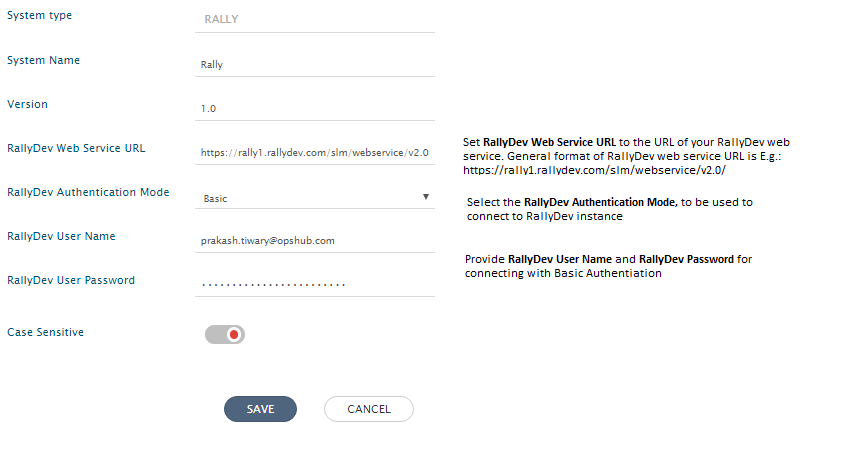

If the system is deployed on HTTPS and a self-signed certificate is used, then you will have to import the SSL Certificate to be able to access the system from OpsHub Integration Manager. Click [Import SSL Certificates](../getting-started/ssl-certificate-configuration.md) to learn how to import SSL certificate.

## Mapping Configuration

Map the fields between Rally and the other system to be integrated to ensure that the data between both the systems synchronizes correctly.\


Click [Mapping Configuration](../integrate/mapping-configuration.md) to learn the step-by-step process to configure mapping between the systems.

### Mapping Web Link type custom fields

Suppose there is a field called **OpsHubWebLink** of type Web Link in Rally, then under Fields metadata, it will display two values for one field as below:

* OpsHubWebLink.LinkName
* OpsHubWebLink.ID

> **Note**: Under OpsHubWebLink.LinkName, provide the label for the field to display.\
> **Note**: Under OpsHubWebLink.ID, provide the replacement string.

When Rally is the source system, the value for the same will be in above format. Display string will come under OpsHubWebLink.LinkName and replacement ID under OpsHubWebLink.ID.

### Test Case Result mapping

For Test Case Result, it is mandatory to specify the test case under which the result needs to be added. Mapping provides two ways to do that:

* Search by name and add:
  * You need to provide the name of test case under the mapping field 'Test Case'. Integration will look for the test case with the given name and will add test case result under that ::test case. If multiple test cases are found with the same name, then first name from the list will be picked.
* Search by OpsHub event id:
  * To link a test case by event id, map the field 'Test Case.OpsHubEventId' with the eventid of the test case you want to synchronize.

### Map Changes field for Change Set

Changes field is collection of changes. Change is an entity that contains Action, Base, Extension, PathAndFilename (Required), Uri.

The user needs to do advanced mapping for field changes. Advanced mapping uses [XSLT](../integrate/mapping-configuration.md#view-edit-xslt-configurations-options) to fetch required data from SourceXML and perform required operations on it.

#### XSLT for fetching data from SourceXML

*   Fetch Commit ID from SourceXML

    ```
    <xsl:value-of select="SourceXML/updatedFields/Property/CommitId"/>
    ```

    **Description:**\
    It will find Commit ID of SCM commit.

#### Commonly used fields and their address of SourceXML

| **Field name**    | **Address**                                                                          |
| ----------------- | ------------------------------------------------------------------------------------ |
| Commit ID         | SourceXML/updatedFields/Property/CommitId                                            |
| Branch space name | SourceXML/updatedFields/Property/Branch-space-Name                                   |
| File name         | SourceXML/updatedFields/Property/FileLogMessageBeans/OHFileLogBean/fileName          |
| File operation    | SourceXML/updatedFields/Property/FileLogMessageBeans/OHFileLogBean/FileOperationType |
| Line changes      | SourceXML/updatedFields/Property/FileLogMessageBeans/OHFileLogBean/lineChanges       |

Example of XSLT for GitHub commit information to Change Set Changes:

```xml
<Changes>
  <xsl:for-each xmlns:xsl="http://www.w3.org/1999/XSL/Transform" select="SourceXML/updatedFields/Property/FileLogMessageBeans/OHFileLogBean">
    <xsl:element name="{concat('change_',position())}">
      <Uri>
        <xsl:value-of select="concat('&lt;github repository's address&gt;/commit/', ../../CommitId)"/>
      </Uri>
      <PathAndFilename>
        <xsl:value-of select="fileName"/>
      </PathAndFilename>
      <Action>
        <xsl:value-of select="FileOperationType"/>
      </Action>
      <Extension>
        <xsl:value-of select="substring-after(fileName, '.')"/>
      </Extension>
      <Base>
        <xsl:value-of select="../../Branch-space-Name"/>
      </Base>
    </xsl:element>
  </xsl:for-each>
</Changes>
```

### Mapping for Soft Delete Configuration

* When Rally is the target system in the integration, the Soft delete operation is performed by default in the synchronization of the [Source Delete event](../integrate/source-delete-synchronization.md)
* After the soft delete operation is performed by OpsHub Integration Manager in Rally, the entity will be deleted in the Rally, and it can be found in the "Recycle bin" of the corresponding project, where it existed earlier.
* To only enable the logical delete operation in the target, "Recycled" field shall be mapped with the default value "No" in the [Delete Mode](../integrate/mapping-configuration.md#delete-mode)

### Mapping for Entity mention field

* When Rally is configured as source system in the integration and its field/comment type is rich text (HTML), then the embedded entity link references will be translated as per mention sync option.
  * Rally do not have different tag format for the entity mention tag, rather rally support the insertion of entity link in rich text field.
  * OpsHub Integration Manager will translate and synchronize those entity link references which are matching text `/#/?detail=/{entityType}/{entityId}&fdp=true` as per mention sync option configured in mapping.
    * Description: "Sample text https://{rally-server-url}/#/?detail=/defect/722340630099\&fdp=true
* Click on [**Mention Sync Setting**](../integrate/mapping-configuration.md#mention-setting) to know more about entity mention mapping and synchronization behavior in general.

### Relationship Configuration

* For **User Story** entity, either User Story or Feature can be linked as a Parent in Rally:
  * For synchronizing **User Story** entity to/from Parent field, **Parent** link type needs to be mapped in OpsHub Integration Manager.
  * For synchronizing **Feature** entity to/from Parent field, **PortfolioItem** link type needs to be mapped in OpsHub Integration Manager.

## Integration Configuration

Set a time to synchronize data between Rally and the other system to be integrated. Also, define parameters and conditions, if any, for integration.&#x20;

Click [Integration Configuration](../integrate/integration-configuration.md) to learn the step-by-step process to configure integration between two systems.

<div align="center">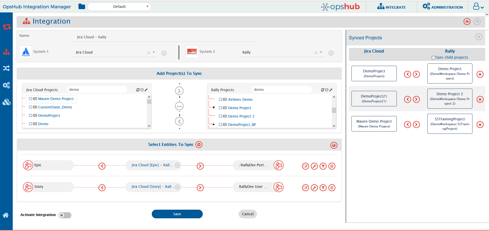</div>

### Criteria configuration

**Query**: Rally supports query on all the fields that are supported by Rally query API. If query name of field is used, name should not contain any special characters and should not start with any digit.\
**Query Format**: Please refer to [Rally documentation](https://techdocs.broadcom.com/us/en/ca-enterprise-software/agile-development-and-management/rally-platform-ca-agile-central/rally/extending-rally-with-apps/using-rally-apps/build-app-queries.html).

> **Note**:\
> If criteria is to be applied on an 'attribute' that is also an entity in Rally, then append '.Name' with the 'attribute' in the Criteria Query. For example, if Rally 'Defect' has an 'attribute' named 'Release' — which is also an entity in Rally — and criteria is to be applied on 'Release', then the Query Format is:\
> `(Release.Name = "value")` instead of `(Release = "value")`.

#### Sample Queries

* Criteria on multiple fields\
  `(((Severity = Cosmetic) and (Ready = false)) or (Priority = Normal))`
* An example of criteria with one 'Lookup field (System Lookup field)'\
  `(ScheduleState = "Defined")`
* An example of criteria with one custom Lookup field and one date field\
  `((CustomStartDate = "2010-09-24T14:35:35.041") and (CustomEffort = "1"))`
* Name contains "development or automation area" and priority is high\
  `((Name contains "development or automation area") and (Priority = "High"))`
* An example of criteria with 'contains on text field or created by (or some other user field) = some user'\
  `(CreatedBy = "syncuser")`

### Target LookUp Configuration

Provide Query in **Target Search Query** field so that it is possible to search the entity in the Rally when it is a target system.\
Go to **Search in Target Before Sync** section on [Integration Configuration](../integrate/integration-configuration.md) page to learn in detail about how to configure target lookup.\
Target LookUp configuration is similar to the Criteria Configuration where in the target search query field, you can provide a placeholder for the source system’s field value in-between ‘@’.

#### Sample Queries

* Target Lookup Query for the constraint on a **single field**:\
  `(Name = @Title@)`\
  **Description:**\
  It represents the query, which will select only those entities, whose "Name" field value is same as the value of the Source system's "Title" field value.
* Target Lookup Query for the constraint on **multiple fields**:\
  `((ScheduleState = @State@) and (Name = @Title@))`\
  **Description:**\
  It represents the query, which will select only those entities, whose "ScheduleState" field value is same as the value of the Source system's "State" field value and "Name" field value is same as the value of the Source system's "Title" field value.

### Synchronize SCM commit information to Change Set Workitem

OpsHub Integration Manager supports synchronization of commit information from Source Control Management (SCM system) to Rally Change Set. These Change Set can also be linked to artifacts (for example, User Story, Defect, etc.) by integration.

For viewing Change Sets from Rally UI, build and change set configuration should be enabled. For enabling this, you can refer to [Enable Build and ChangeSet](https://techdocs.broadcom.com/content/broadcom/techdocs/us/en/ca-enterprise-software/agile-development-and-management/rally-platform-ca-agile-central/rally/using-top/check-status/view-build-status.html/#concept.dita_80d8f1075ec66fb17a4878cb3c466c4b77bb9b62_BuildandSCMTraceability-enable).

Creating Change Set is not possible from the Rally UI; therefore OpsHub Integration Manager does not support polling of Change Set, only creating Change Set is supported with Rally as the target system.

<div align="center">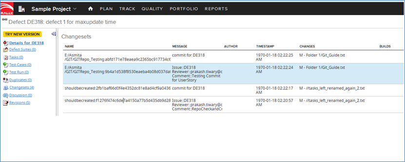</div>

### Child Project Sync

Enabling this feature will synchronize entities from selected projects and their child projects to other system.

Refer to document [Child Project Synchronization](../integrate/integration-configuration.md#child-project-synchronization) for more information on this feature.

If the parent project is mapped, then the child project should not be mapped in the Integration configuration. When a child project is mapped, its data can be repolled.

> **Note**:\
> For this feature to work properly, all the child projects must have the same permission as the parent project. i.e. all the prerequisites that are applicable for parent projects must also be applicable to child projects.

### Watchers Field Sync

* Following synchronization's behavior is applicable only when Watchers field is mapped and Authentication mode of integration user gets changed from API Key to Base:
  * If the Watchers is mapped as the source end system's field and authentication mode gets changed to the Base, then the field will be shown as a not available field in mapping. Henceforth, the Watchers field is not applicable for further synchronization of integration. So either remove the field from mapping or switch back to API Key mode to keep Watchers field in sync.
  * If the Watchers is mapped as the target end system's field and authentication mode gets changed to the Base, then the field will be shown as a not available field in mapping and any further update from source end system corresponding to the Watchers field results in a failure indicating Watchers field is not present in fields. So either remove the field from mapping or refer to the [Skip Absent Field](../integrate/integration-configuration.md#skip-absent-field) of integration. In order to keep Watchers field in sync, it is required to switch back to API Key mode for integration user.

## Known Behaviors

### Tasks link sync for User story and Defect Entities

* For Rally as the target system, OpsHub Integration Manager will not remove the task link from the User Story and Defect entities. In this case, OpsHub Integration Manager will log a warning in the sync logs to indicate that the Remove Link operation is not supported.\
  **Reason:** Rally does not allow removing the task links from the User Story and Defect entities.

### Accommodate Subscription, Workspace, or User (configured in Rally system/ Integration override user of OpsHub Integration Manager) updates in Rally

* In case the Rally subscription, or workspace, or user (configured in the Rally system/integration override user in OpsHub Integration Manager) is updated. To reflect these changes in OpsHub Integration Manager, the configured Rally system \[in which changes have been made] in OpsHub Integration Manager needs to be edited.
  * **Reason:** OIM cached the above type of data for optimized performance. To accommodate the above Rally updates \[for example, any new Workspace addition/Subscription name changed/user attributes' change], this data needs to be refreshed via editing the Rally system in OpsHub Integration Manager.
  * **Note:** If multiple systems are configured against the same Rally instance, any one of the systems can be updated in this scenario.

## Limitations

* When Rally is the target system in integration and the **Rally Project** field is mapped then there shouldn't be any update on any other field along with the update on the **Rally Project**, otherwise the revision where only project field is updated will be skipped.
* The custom date value from Rally can vary for time zone other than MDT as Rally does not support other time zones currently.
* Watchers Field synchronization is only supported when 'Authentication mode' of integration user is the 'API Token'.
* Watchers field synchronization is not supported for the Test Case Result entity.
* Criteria query is not supported for the "Watchers" field. In case configured with the "Watchers" field then query execution will result in the error such as "Could not parse: Could not find attribute 'Watchers'".
* For Rally as the source system, below are the limitations for 'Watchers' field synchronization due to the end system behavior which is 'No Revisions' are being generated for any updates of Watchers on Rally.\
  &#xNAN;**-** Any updates performed for Watchers, will not get synchronized to the target system unless there is another update performed to the same entity, which generates a Revision for Rally.\
  &#xNAN;**-** Watchers field will get synchronized with current value(s) only which are present at the time of synchronization, as no revisions available for the Watchers on the entity.
* For Rally as the source system, the HTML fields (like Description) containing more than 1985 characters are considered long descriptions. While synchronizing long description, the following issues may occur:\
  &#xNAN;**-** Conflict will not be detected correctly.\
  &#xNAN;**-** Intermediary revisions may not sync correctly. It may show that the value synced is "value too long to display" instead of actual value. However, the latest state of such fields will sync correctly. This issue is faced because revision history retrieved from the end system provides value as "value too long to display" instead of actual data (as shown in the example given below):

<div align="center">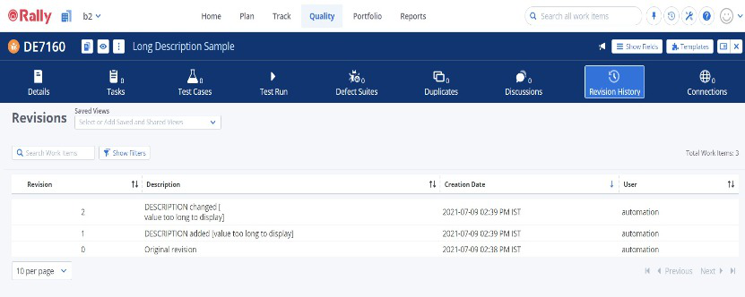</div>

* Conflict detection is not supported for numeric field, when we set value such as "1234" to numeric field from UI, its API will return "1234.0" and conflict will be detected everytime.
* Conflict detection is not supported for decimal field, when we set value such as "2345" to decimal field from UI, its API will return "2.345E" and conflict will be detected everytime.
* Conflict detection is not supported for date field, because for any date you pass, API will return the date in the current workspace timezone and conflict will be detected everytime.\
  **Example:** If the date value passed to Rally (Current Workspace timezone is GMT +9) is `2020-10-14T23:00:00.000Z` then API will return `2020-10-14T15:00:00.000Z`. As we can see the time returned from the API is in GMT+9.
* OpsHub Integration Manager doesn't support synchronization of **Closed** projects and hence only **Open** projects will be visible in the list of available projects for configuration. This implies that any entity which is a part of or is linked to a project that is in the 'closed' state will not be picked for synchronization. To overcome this limitation, reopen the project and it will be available for configuration.
* **Milestone** entity of Rally is an exception for the above-mentioned case. Since the scope for the Milestone is Workspace rather than the project, it will be synchronized even if it is associated with only a closed project.\
  **However**, the associated projects field will only have a list of open projects, as Rally API doesn't provide any information regarding closed projects.
* For Rally as the target system, if the source system has the rich text type of Wiki, then font color, background color, font family & font size will not be synced to the rich text (HTML type) fields (such as Description).
  * **Reason:** Rally API limitation for the rich text field.
* To sync the above type of formatting, the below advanced mapping needs to be configured in the OpsHub Integration Manager:

```xml
<Description  xmlns:xsl="http://www.w3.org/1999/XSL/Transform">
  <xsl:variable name="htmltext" select="utils:convertWikiToHTML(SourceXML/updatedFields/Property/description)"/>
  <xsl:variable name="replacedHTMLText" select="replace($htmltext,'&lt;div','&lt;span')" />
  <xsl:variable name="replacedHTMLText1" select="replace($replacedHTMLText,'&lt;/div&gt;','&lt;/span&gt;')" />
  <xsl:value-of select="$replacedHTMLText1" />
</Description>
```

* If the mapping configuration includes portfolio items as linked entity types in the relationship configuration in OpsHub Integration Manager, the workspace of the projects to be integrated in the integration configuration must be same as the workspace of the project used in the mapping configuration.
  * **Reason:** Portfolio Items are defined at the workspace level in Rally.

### Milestone synchronization

* When Rally is configured as one of the systems and Milestone is configured in the integration, do not club any other entity in the same Milestone entity integration.
  * **Reason:** Milestone is a workspace level entity and other entities are project level entities which requires project to be selected at the integration level. For the Milestone entity, workspace needs to be selected at the integration level.
* When Rally is configured as one of the systems and Milestone is configured in the integration, do not enable the child project sync in the integration.
  * **Reason:** Milestone is a workspace level entity and Rally does not have the child workspace concept.

## Appendix

### Adding permission to user

For giving privileges to a user, follow the steps given below:

* Log into Rally instance with **Administrator** privileges.
* Navigate to **Setup** link on top right of Rally web interface.

<div align="center">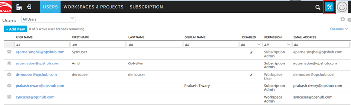</div>

* Click the **Users** tab.
* Make sure that All Users are selected in the dropdown list located at the top in the User panel.
* Click the **Configuration** button located in the **left-most side** of the user you want to edit.
* Now, click **Edit**.

<div align="center">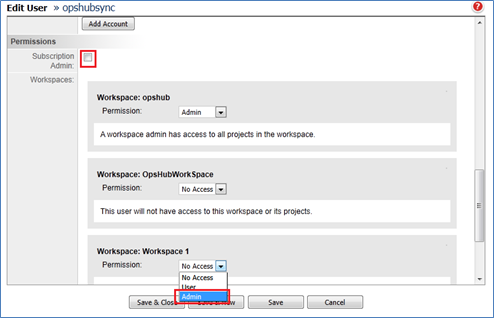</div>

* If **Subscription Admin** checkbox is checked under **Permissions**, then there is no need to set permission. In this case, the given user already has admin permission on all the workspaces. If it is not checked, then either check it or go to the **Workspace** used in integration to synchronize entities and select **Admin** from **Permission** dropdown list.

<div align="center">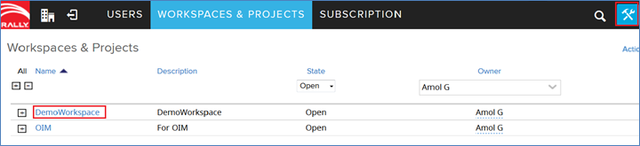</div>

### Create custom field

Integration requires a few special fields to be defined on the workitem that is being synchronized. These must be set up so that integration can track the integration status of each item.

* Log into Rally instance with **Administrator** privileges.
* Navigate to **Setup** link on top right of Rally web interface.

<div align="center">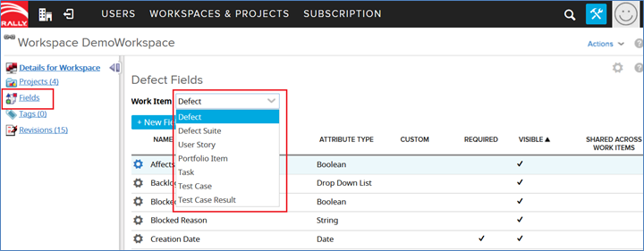</div>

<p align="center"><em>Rally Custom Fields</em></p>

* Click the **Workspaces & Projects** tab.
* Click the **Workspace** from the **Workspaces & Projects** list in which you want to create custom fields.

<div align="center">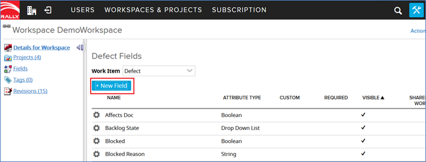</div>

* In the left panel, click **Fields**.
* Select **Work Item** (workitem which has to be synchronized by integration) from the dropdown list.

<div align="center">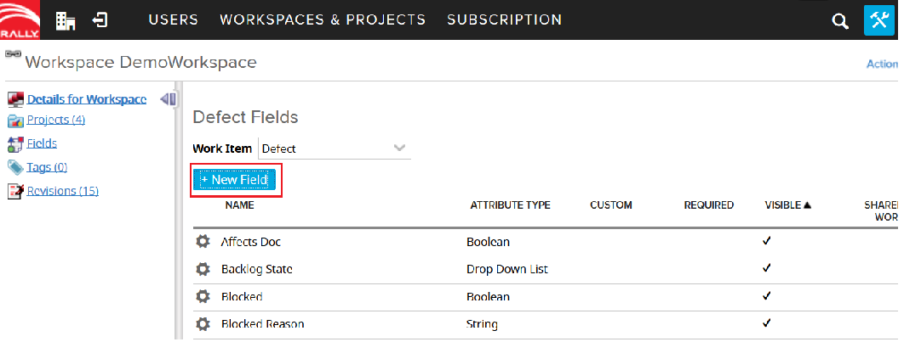</div>

* Select **New Field** to create custom field.
* Set **Name** of custom field.
* Set **Display Name** of custom field.

> **Note**:\
> **Display Name** should not contain a special character or start with a digit.

* Select **Type** to create the new custom field.
* Click **Save & Close**.

<div align="center">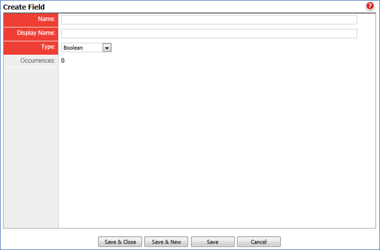</div>

### Find custom field internal name

* Go to:\
  `https://hostname:port/slm/webservice/1.43/typedefinition?query=(Name = entityname)&fetch=true&stylesheet=/slm/doc/webservice/browser.xsl`
* Replace hostname and port in the above URL with the valid ones for Rally.
* Replace the workitem as follows:
  * For **Defect**, replace it with `Defect`
  * For **User Story**, replace it with `HierarchicalRequirement`
  * For **Testcase**, replace it with `Test Case`
  * For **Task**, replace it with `Task`
  * For **Test set**, replace it with `TestSet`
* Go to the attribute definition where `Name` = the field that you want to use.
* `Element Name` for that attribute definition is the internal name for that particular field.

### Find subscription name

* Log into Rally instance with **Administrator** privileges.
* Navigate to **Setup** link on top right of Rally web interface.
* Click on **SUBSCRIPTION** tab.

<div align="center"></div>

<div align="center">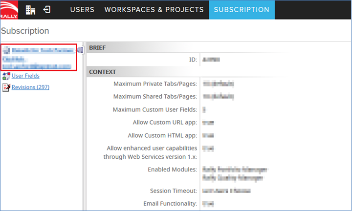</div>

* **Subscription Name** is specified on the left panel of the **Subscription page** as shown in the image.

### How to generate Rally API key

Following are the steps to generate the Rally API key from any user account. If user has API key already generated then that API key can be used in Rally system form but that API Key should have sufficient privileges as required as mentioned in [User Privileges](rally.md#user_privileges).

* Open the Rally URL:\
  [https://rally1.CA Agile Central.com/login](https:/rally1.CA%20Agile%20Central.com/login/)
* Login to the account by providing a valid Rally username and password.

<div align="center">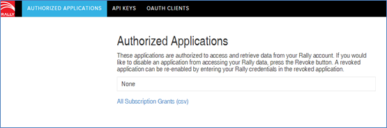</div>

* Open the **API KEYS** tab (second tab).

<div align="center">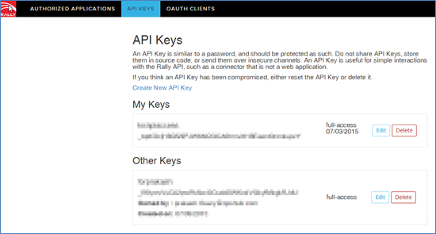</div>

* Click the **Create New API** key.

<div align="center">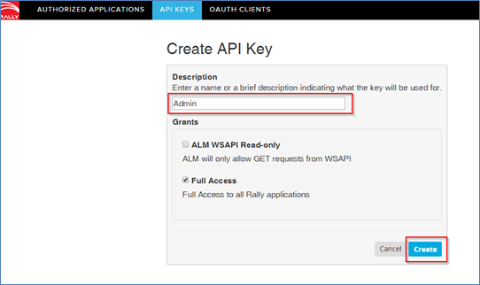</div>

* Provide the appropriate description.
* Select the full access and click the create button.

### External input of additional date formats for parsing revisions

When Rally is the source system of the integration:\
In situations when synchronization is failing due to unparseable date error, it is because the date value mentioned in the **description** of revisions is in a format that is not handled in integration. Therefore, from preventing the whole synchronization to fail and synchronization to stop completely, there is a workaround that enables the user to enter the date format for which integration is failing and continue the synchronize. The steps for this workaround are given below:

* Inactivate the integration that is failing and stop **OpsHub Integration Manager** server.
* Create a new **environment variable** under **system variables** with:
  * **Variable name:** `OH_Rally_PortfolioItem_DateFormat`
  * **Variable value:** the date format of the date value for which polling is failing.\
    For example, if the date value is `Wed May 20 07:24:46 MDT 2015` then the variable will have:\
    `EEE MMM dd HH:mm:ss z yyyy` as the variable value.

> If there are multiple date formats that are not handled by integration, then provide them inside the same environment variable separated by `;` (semi-colon), for example:\
> `EEE MMM dd HH:mm:ss z yyyy;yyyy-MM-dd HH:mm:ss.SSS`

* Save the environment variable and start the **OpsHub Integration Manager** server.
* Now, start the integration that was stuck due to date parsing failure.
