# Prerequisites

## User Privileges

- Create a user in ReadyOne that is dedicated for OpsHub Integration Manager. The user shouldn't perform any other action from ReadyOne user interface. Refer to [Add User in ReadyOne](#add-users) section to learn how to add a new user in ReadyOne.
- The user identity of the user dedicated for OpsHub Integration Manager must have the following permissions for the 'item type' to be integrated:

| **Permission Types**         | **Justification**                                                                                                                                                                                        | **Needed When**                                                                                                                                                | **How To**                                                                                                                           |
|-----------------------------|-----------------------------------------------------------------------------------------------------------------------------------------------------------------------------------------------------------|----------------------------------------------------------------------------------------------------------------------------------------------------------------|---------------------------------------------------------------------------------------------------------------------------------------|
| Get                         | To get values of each field for particular item of 'item type' to be integrated                                                                                                                           | ReadyOne is source system,target system or both.                                                                                                               | To learn how to provide user with the Get permission, refer to [Give Necessary Permissions to User for Itemtype](#give-necessary-permissions-to-user-for-itemtype)         |
| Can Discover                | To get the list of items present for a given itemtype.                                                                                                                                                     | ReadyOne is source system,target system or both.                                                                                                               | To learn how to provide user with the Can Discover permission, refer to [Give Necessary Permissions to User for Itemtype](#give-necessary-permissions-to-user-for-itemtype) |
| Update                      | To update an item.                                                                                                                                                                                         | ReadyOne is target system. Also, when ReadyOne is source system and Update Permission is required for Remote Id or Remote Link configuration in Integration. | To learn how to provide user with the Update permission, refer to [Give Necessary Permissions to User for Itemtype](#give-necessary-permissions-to-user-for-itemtype)       |
| Can Add                     | To create an item: The user is allowed to create record from the ReadyOne System (through the UI and API both) only when the user's identity is allowed in the "Can Add" tab                             | ReadyOne is target system.                                                                                                                                      | To learn how to assign "Can Add" permission to user's identity on particular itemtype, refer to [Allow Can Add permission to User](#assign-identity-in-can-add-tab-of-item-type) |
| Life Cycle State Transition | To update the state during transition, the role in Life Cycle transition needs to be set as **Administrators** for the Integration User [configured in the OpsHub Integration Manager].                                | When ReadyOne is the target system.                                                                                                                             | To learn how to provide user with the Lifecycle State Transition permission, refer to [Assign Life Cycle Transition Permission for Item Type](#assign-life-cycle-state-transition-permissions-for-item-type)      |

## Versionable Item Type

- For any Item Type in ReadyOne, the versions/history for the item gets generated only when the item is versionable. Hence for OpsHub Integration Manager to synchronize the items with their revisions, they need to be versionable.
- In case they are not versionable, OpsHub Integration Manager will synchronize the item as per the current state of that item, available at the time of synchronization.
Follow [Make Item Type Versionable](#make-item-type-versionable) in the Appendix section to learn how to make item types versionable.

## Hosting Opshub ReadyOne Service

- OpsHub Integration Manager requires this service to communicate with ReadyOne server. It acts as a communication layer between ReadyOne and OpsHub Integration Manager.

### System Prerequisites

- Configure OpsHub Integration Manager Aras Service on a machine that has .NET Framework version 4.7.2 or a higher version installed.
- Please refer to the following link for information on software and hardware requirements for installing .NET Framework 4.7.2:  
  https://docs.microsoft.com/en-us/dotnet/framework/get-started/system-requirements

### Installation Steps

{{Aras_Installation_Steps}}


# System Configuration

Before the user continues with the integration, he/she must first configure ReadyOne System. Refer to [System Configuration](../integrate/system-configuration.md) to learn step-by-step process to configure a system. See the screenshot given below for reference:

<p align="center">
  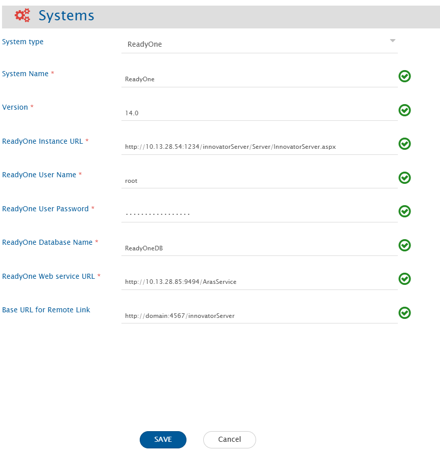
</p>

| **Field Name**                  | **Description**                                                                                                                                                         |
|--------------------------------|-------------------------------------------------------------------------------------------------------------------------------------------------------------------------|
| **System Name**                | Provide a unique name to the ReadyOne System                                                                                                                           |
| **Version**                    | Provide version for ReadyOne Instance. Check [Get ReadyOne Version](#get-readyone-version) in the Appendix section to learn how to get ReadyOne version              |
| **ReadyOne Instance URL**     | Provide URL for ReadyOne Instance. Example:- <hostname>/InnovatorServer/Server/InnovatorServer.aspx                                                                  |
| **ReadyOne User Name**        | Provide username of the user dedicated for OpsHub Integration Manager. Please ensure that user has the necessary permissions. Refer to [User privileges](#user-privileges)          |
| **ReadyOne User Password**    | Provide password of user dedicated for OpsHub Integration Manager.                                                                                                                    |
| **ReadyOne Database name**    | Provide ReadyOne Database name to which the connection needs to be done. Refer to [Get Database Name](#get-database-name) to learn how to get Database name          |
| **ReadyOne Web Service URL**  | Provide URL for the hosted OpsHubArasService. Refer to [Hosting opshub Aras service](#hosting-opshub-readyone-service)                                                 |
| **Base URL for Remote Link**  | Provide different Instance URL of the ReadyOne Instance. This URL is used for generating the Remote Link. <br>If empty, the Server URL will be used.                |

- If the system is deployed on HTTPS and a self-signed certificate is used, then the user should import the SSL Certificate to be able to access the system from OpsHub Integration Manager. Check [Import SSL Certificates](../getting-started/ssl-certificate-configuration.md) to learn how to import SSL certificate.


# Mapping Configuration

Map the fields between ReadyOne and the other system to be integrated to ensure that the data between both the systems synchronize correctly.  
Check [Mapping Configuration](../integrate/mapping-configuration.md) to learn the step-by-step process to configure mapping between the systems.

<p align="center">
  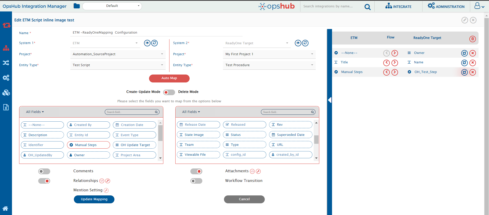
</p>


# Integration Configuration

Set polling time as the time after which the user wants to synchronize data between ReadyOne and the other system to be integrated. Also, define parameters and conditions, for integration, if any. Check [Integration Configuration](Integration Configuration) to learn the step-by-step process.

<p align="center">
  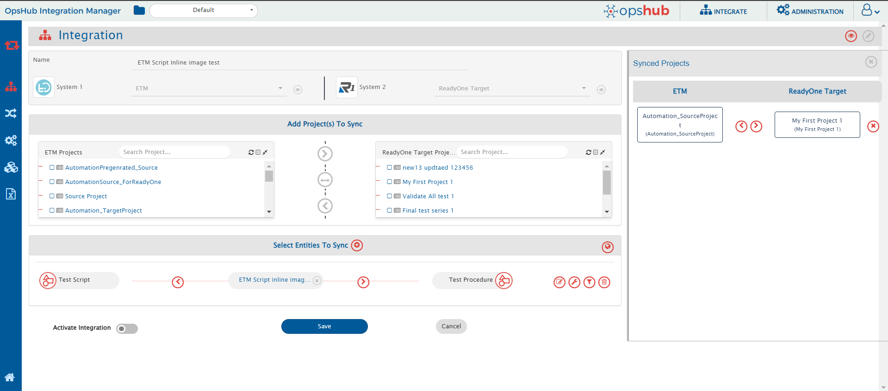
</p>

## Criteria Configuration

- If the user wants to specify conditions for synchronizing an entity between ReadyOne and the other system to be integrated, refer to this **Criteria Configuration** feature section.  
- To configure criteria in ReadyOne, integration needs to be created with ReadyOne as the source system. The user can set a query on a particular ItemType.
- Go to Criteria Configuration section on [Integration Configuration](../integrate/integration-configuration.md) page to learn more.
- ReadyOne Query format is:

```json
[{"condition":"EQUALS","field":"field_name","value":"field_value"}]
```

* To learn how to form a query in above format in detail, please refer to this [OpsHub-Query-format](../integrate/opshub-query-format.md).

### Criteria Samples

| **Field Type**              | **Criteria Description**                                               | **Criteria snippet**                                                                                                                                       |
|----------------------------|------------------------------------------------------------------------|-----------------------------------------------------------------------------------------------------------------------------------------------------------|
| **Lookup**                 | Synchronize all entities having priority set to 'High'                 | `[{"condition":"EQUALS","field":"priority","value":"High"}]`                                                                                               |
| **Date**                   | Synchronize all entities created after certain date                    | `[{"condition":"GREATER_THAN","field":"created_on","value":"2020-01-31T00:00:00"}]`                                                                        |
| **Text**                   | Synchronize all entities with Title Demo entity                        | `[{"condition":"EQUALS","field":"title","value":"Demo entity"}]`                                                                                           |
| **Text** and **Lookup**    | Synchronize all entities with title Demo entity and status set to New  | `{"condition": "and","criterias":[{"field": "title","condition": "EQUALS","value": "Demo entity"},{"field": "status","condition": "EQUALS","value": "New"}]}` |
| **Lookup** or **Date**     | Synchronize all entities with priority set to High or Effective Date greater than | `{"condition": "or","criterias":[{"field": "priority","condition": "EQUALS","value": "High"},{"field": "effective_date","condition": "GREATER_THAN","value": "2020-01-31T00:00:00"}]}` |


# Target LookUp Configuration

* Provide Query in **Target Search Query** field so that it is possible to search the entity in ReadyOne when it is the target system.  
* Go to **Search in Target Before Sync** section on [[Integration Configuration]] page to learn in detail about how to configure Target LookUp.  
* Target LookUp configuration is similar to the [[Criteria Configuration](#criteria-configuration) where in the Target Search Query field, the user can provide a placeholder for the source system’s field value in-between `@`.

**Example** — Target Look Up Query based on internal id of source itemtype:  
```json
[{"condition":"EQUALS","field":"custom_testing_text","value":"@oh_internal_id@"}]
```

# Known Behaviors

**Remote ID Synchronization**  
* In ReadyOne, custom entity types don't have an *Item Number* (which stores Display Id) field by default.  
  → In such cases, `OpsHub Integration Manager` will use the entity's **Internal Id** as **Remote Id**.  
  → To show the Display Id as Remote Id, add the **Item Number** field in ReadyOne. Refer to [Add Item Number Field](#set-item-number-for-custom-entity) for more details.  
* In ReadyOne, the *project concept* is only supported for the `Requirement` Item Type (`req_Requirement`).

# Known Limitations

* Only English alphabets (A–Z, a–z), numeric digits (0–9), and special characters (e.g., `:`, `<`, `?`, `>`, `]`, `[`, `!`, `@`) are supported in Criteria Configuration.
* **Attachment** as a field is not supported.
* `"No Related"` Relationship Type is not supported.
* If the attachment filename contains **Windows special characters** (`/`, `\`, `"`, `:`, `*`, `?`, `<`, `>`), then the file will not be added in ReadyOne (processing failure occurs).  
  → This is a ReadyOne limitation.  
  → See [[OH-Aras-1502|Synchronise file with Windows special characters]] for how to handle such attachments.


## Limitations to be Resolved in Upcoming Releases of `OpsHub Integration Manager`

* To synchronize **File as Attachment** to an ItemType, there must be a **unique relationship type** between ItemType and File.
* **Comments with attachments** are not supported.
* Synchronization of **Inline image** in a **Formatted text field** is:
  - ✅ **Supported** for **External Files of Image type**
  - ❌ **Not supported** for **ReadyOne's Internal Images**


# Appendix

## Add Users

1. Login to ReadyOne with **Administrator Privileges** (default: `root/admin`).
2. Navigate to `Administration → Users → Create New User`.  
   Refer to [Check Administration Tab](#check-administration-tab) for UI location.
3. Fill mandatory fields like Login Name, Password, First Name, etc.
4. Check **Logon Enabled**.

<p align="center">
  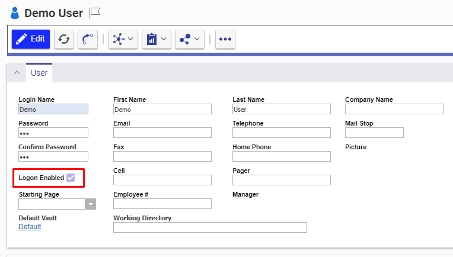
</p>

---

## How to Change the Port of Service

1. Open File Explorer → Go to folder:  
   `C:\Program Files\OpsHub\Other_Resources\Resources\OpsHubArasService`
2. Open `ArasService.exe.config` in a text editor.
3. Find `<baseAddresses>` section.  
   Modify the port number inside `<add baseAddress>` (e.g., change `9494` to your desired port), then save.

<p align="center">
  
</p>

---

## How to Check Availability of Port 9494

1. Open **Command Prompt** as administrator.
2. Run:  
   ```sh
   netstat -ano | findStr "9494"
   ```
3. If output is empty → port is available.  
   If output shows a process → check the **PID** in the last column to identify the app.

---

## Assign Identity in “Can Add” Tab of Item Type

1. Login to ReadyOne with administrator privileges.
2. Go to `Administration → ItemTypes`.
3. Search and open the ItemType to edit.
4. Open the **Can Add** tab.
5. Click the ➕ icon.
6. Select the desired identity from the pop-up.

<p align="center">
  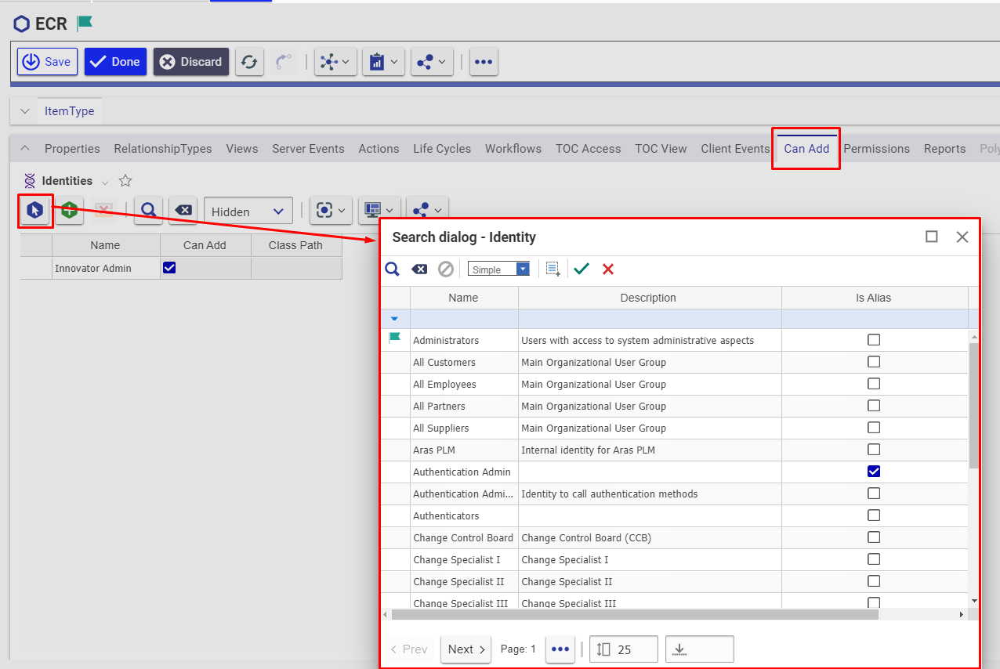
</p>

---

## Assign Life Cycle State Transition Permissions

1. Login to ReadyOne with administrator privileges.
2. Go to `Administration → ItemTypes`.
3. Find and open your ItemType.
4. Open the **Life Cycles** tab.
5. Open the desired Life Cycle.

<p align="center">
  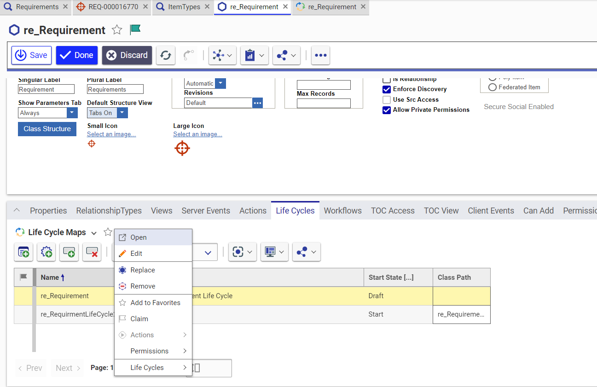
</p>

6. Click the arrow of the state transition to edit.

<p align="center">
  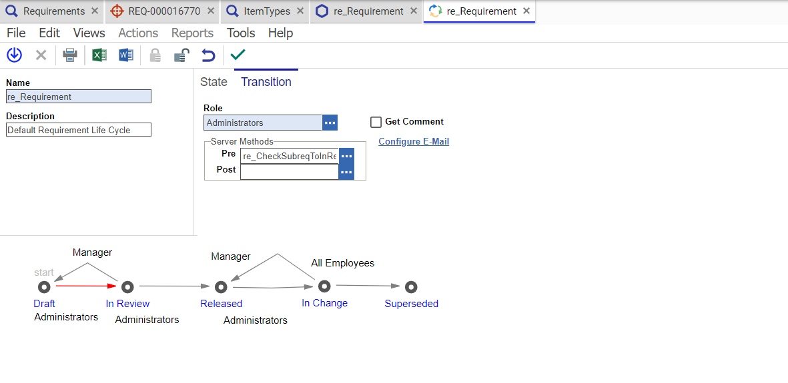
</p>

7. Change the **Role** to `Administrators`.
8. Save changes.

---

## Give Necessary Permissions to User for ItemType

1. Login to ReadyOne as Administrator.
2. Go to `Administration → ItemTypes`.
3. Open your ItemType and go to the **Permissions** tab.
4. Use:
   - ➕ to select existing permission
   - ➕ to create new permission
5. See [Add Identities to Permissions](#add-identities-to-permissions) for identity assignment.

<p align="center">
  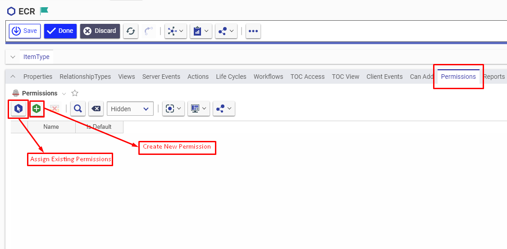
</p>

## Add Identities to Permissions

1. Double-click permission or click ➕ in Permission tab.
2. Give a name (for new permission).
3. Click ➕ to select identity.
4. Check **Get**, **Update**, **Can Discover**.
5. Click **Done** to apply.

<p align="center">
  
</p>

---

## Make Item Type Versionable

1. Login to ReadyOne as Administrator.
2. Go to `Administration → ItemTypes`.
3. Search and open your ItemType.
4. In edit mode, check the **Versionable** checkbox.

<p align="center">
  
</p>

---

## Create Custom Entity

1. Login to ReadyOne as Administrator.
2. Go to `Administration → ItemTypes → Create New ItemType`.
3. Fill mandatory fields and mark it versionable.
4. Assign **TOC View** and **TOC Access**.

<p align="center">
  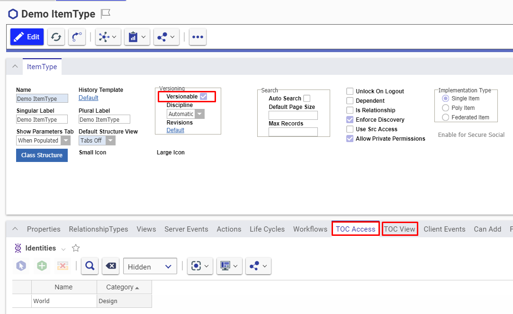
</p>

→ After creation, refer to [Create custom property](#create-custom-property) to add properties.

---

## Set Item Number for Custom Entity

1. Go to Dashboard.
2. Open `ItemTypes` page.
3. Open desired Entity Type in edit mode.
4. Under **Properties**, add a new row:
   - Name: `item_number`
   - Data type: `Sequence`
   - `Keyed Name Order`: `1`

---

## Create Custom Property

1. Login to ReadyOne as Administrator.
2. Go to `Administration → ItemTypes`.
3. Open your ItemType.
4. Go to the **Properties** tab.
5. Click ➕ icon to add property.
6. Assign name, data type, data source, etc.

<p align="center">
  
</p>

---

## Get Database Name

1. Open ReadyOne client login page.
2. The **database name** appears in the dropdown or login details.

<p align="center">
  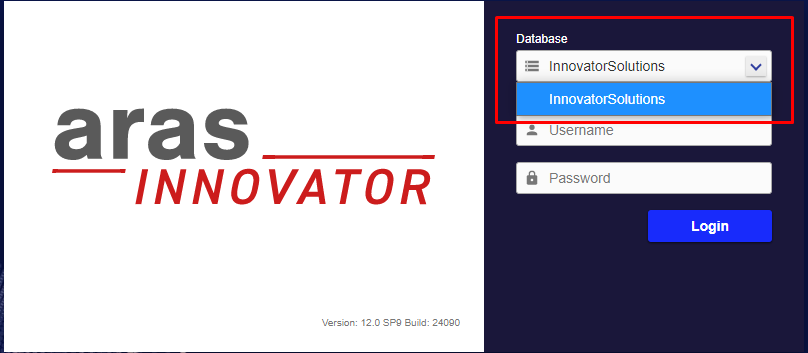
</p>

---

## Get ReadyOne Version

1. Open ReadyOne client login page.
2. The **ReadyOne version** is displayed on screen.

<p align="center">
  
</p>

---

## Check Administration Tab

1. Login to ReadyOne.
2. Click the **TOC** button (top-left).
3. Expand **Administration** tab to access `ItemTypes`, `Users`, `Identities`, etc.

<p align="center">
  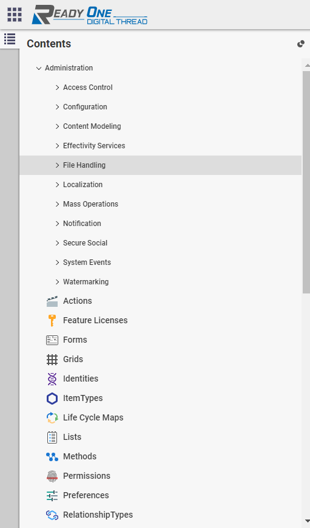
</p>
