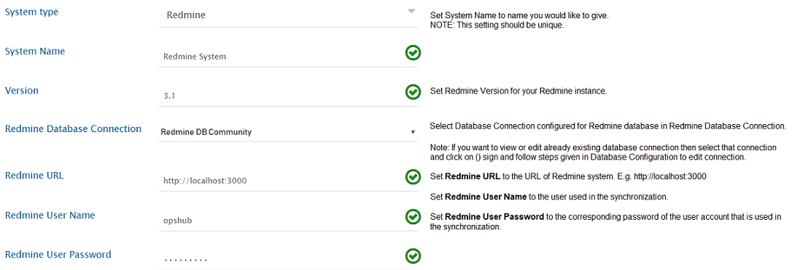
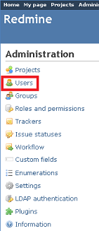
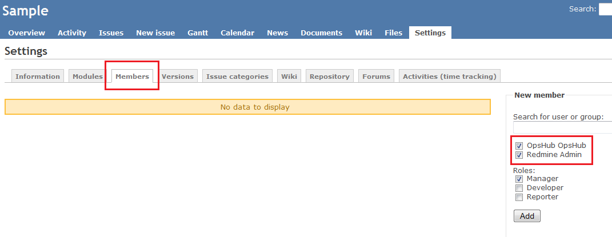
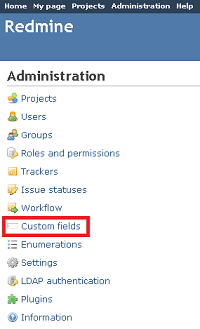
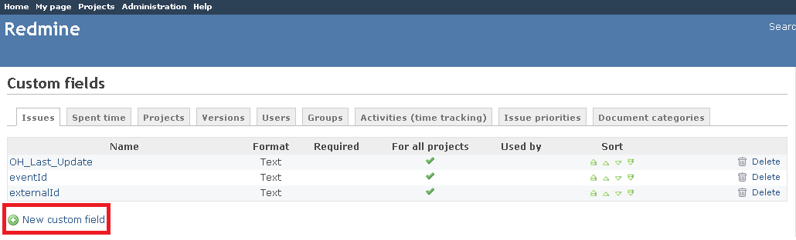
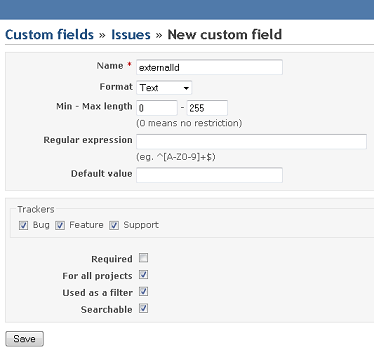
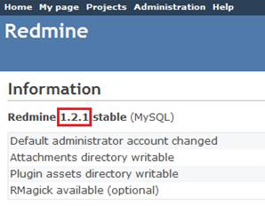
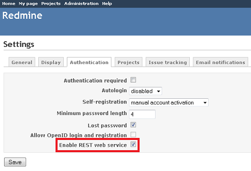

# Prerequisites

## User Privileges
* Create one Redmine user dedicated to OpsHub Integration Manager. User should not do any operations from system's user interface. 
* The user created for synchronization should have access to the project that will be configured for synchronization. This user should have both administrator rights as a user and reporter rights at the project level. For detailed information on how to add a user, refer to the [Add User](#add-user) section. For further details on how to assign users to the projects, refer to the [Assigning User to Projects](#assigning-user-to-projects) section.
* Enable REST API service for Redmine, if it is not already enabled. For further details, refer to the [Redmine Configuration](#redmine-configuration) section.

## End System Storage Criteria
* To configure the End System Storage Criteria with the Custom Field in OpsHub Integration Manager, the  "Used as a filter" option needs to be enabled for this selected Custom Field. For more details, refer to [Custom Field Configuration](#custom-field-configuration).

## Redmine Database Information
Given below are the configuration parameters for the Redmine database to create an integration configuration. 
* Redmine Database Type 
* Redmine Database Host 
* Redmine Database Port 
* Redmine Database Name 
* Redmine Database Username 
* Redmine Database Password 

# System Configuration
Before you continue to the integration, you must first configure Redmine. Click [System Configuration](../integrate/system-configuration.md) to learn the step-by-step process to configure a system. Refer the screenshot given below for reference.

**Redmine System form details**

| **Field Name**              | **When field is visible on the System form** | **Description** |
|----------------------------|----------------------------------------------|-----------------|
| **System Name**            | Always                                       | Provide system name |
| **Version**                | Always                                       | Provide version like 3.1.2, 3.4.5. To know your version, refer to [How to find Redmine's version](#find-version) section. |
| **Redmine Database Connection** | Always                                | Select an already created Database connection or if the Database connection is not configured for Redmine, then click the + sign and follow steps given on the [Database Configuration](../.gitbook/includes/database-configuration.md) page to create database connection. |
| **Redmine URL**            | Always                                       | Format: [http/https]://[RedmineServerHost]/[RedmineServerPort] |
| **Redmine User Name**      | Always                                       | Provide the username of the Redmine user created for OpsHub Integration Manager. Please refer to  [User Privileges](#user-privileges) for more details. |
| **Redmine User Password**  | Always                                       | Provide Redmine Users password |

If the system is deployed on HTTPS and a self-signed certificate is used, then you will have to import the SSL Certificate to be able to access the system from OpsHub Integration Manager Click [Import SSL Certificates](../getting-started/ssl-certificate-configuration.md) to learn how to import SSL certificate.

# Mapping Configuration
Map the fields between Redmine and the other system to be integrated to ensure that the data between both the systems synchronizes correctly. Click [Mapping Configuration](../integrate/mapping-configuration.md) to learn the step-by-step process to configure mapping between the systems.

# Integration Configuration
In this step, set a time to synchronize data between ServiceNow and the other system to be integrated. Also, define parameters and conditions, if any, for integration.  
Click [Integration Configuration](../integrate/integration-configuration.md) to learn the step-by-step process to configure integration between two systems.  
Refer [Custom Field](#custom-field-configuration) section in appendix to learn how to create custom fields.

# Criteria Configuration
* If you want to specify conditions for synchronizing an entity between Redmine and the other system to be integrated, you can use the Criteria Configuration feature.  
* Go to Criteria Configuration section on [Integration Configuration](../integrate/integration-configuration.md) page for further details.  
* To configure criteria in Redmine, integration needs to be created with Redmine as the source system. OpsHub Integration Manager supports criteria on native queries which are supported by Redmine Rest API. The format of criteria query is [Internal Name] = [Value of Id for desired property]

* Some of the properties on which OpsHub Integration Manager support queries are as follows:
  * Tracker
  * Status
  * Assigned To
  * Priority
  * Custom Fields

The relative ids for the properties are given in the table below:

| **Property Name** | **Internal Name** | **Description** |
|------------------|-------------------|-----------------|
| Tracker          | tracker_id        | [More info](https://www.redmine.org/projects/redmine/wiki/Rest_Trackers) |
| Status           | status_id         | [More info](https://www.redmine.org/projects/redmine/wiki/Rest_IssueStatuses) |
| Assigned To      | assigned_to_id    | [More info](https://www.redmine.org/projects/redmine/wiki/Rest_Users) |
| Priority         | priotity_id       | [More info](https://www.redmine.org/projects/redmine/wiki/Rest_Enumerations) |
| Custom Fields    | cf_x              | [More info](https://www.redmine.org/projects/redmine/wiki/Rest_CustomFields) |

### Sample Query
* Polling all the issues with status 'Closed'.  
  - Let the id of status closed under issue_statuses table be 3. So, query formed will be: `status_id=3`

* Polling the issues with custom description having value 'hello'.  
  - Let the id of custom description field be 3. So, query formed will be: `cf_3=hello`

* Polling the issues with more than one criteria (e.g., status as 'Closed' and custom description as 'hello')  
  - Query: `cf_3=hello&status_id=3`  
  - [More info](https://www.redmine.org/projects/redmine/wiki/Rest_Issues)

# Target Lookup Configuration
Provide Query in Target Search Query field so that it is possible to search the entity in Redmine when it is the target system.  
Go to **Search in Target Before Sync** section on [Integration Configuration](../integrate/integration-configuration.md) page to learn in detail about how to configure Target Lookup.  
Target LookUp configuration is similar to the Criteria Configuration where in the target search query field, you can provide a placeholder for the source system’s field value in-between ‘@’.

| **Property Name** | **Internal Name** | **Description** |
|------------------|-------------------|-----------------|
| Tracker          | tracker_id        | [More info](https://www.redmine.org/projects/redmine/wiki/Rest_Trackers) |
| Status           | status_id         | [More info](https://www.redmine.org/projects/redmine/wiki/Rest_IssueStatuses) |
| Assigned To      | assigned_to_id    | [More info](https://www.redmine.org/projects/redmine/wiki/Rest_Users) |
| Priority         | priotity_id       | [More info](https://www.redmine.org/projects/redmine/wiki/Rest_Enumerations) |
| Custom Fields    | cf_x              | [More info](https://www.redmine.org/projects/redmine/wiki/Rest_CustomFields) |

### Sample Queries

* Target Lookup Query for a constraint on a **single field**:  
  `(subject=@Title@)`  
  **Description:** Selects only entities that have the same "subject" as the source system's "title".

* Target Lookup Query for **multiple fields**:  
  `(status_id=@State@&subject=@Title@)`  
  **Description:** Matches both "status" and "subject" fields from source system values.

# Known Behaviour
* **Comments Synchronization:** Notes in the Redmine will be synchronized as comments at the other end point.
* **Issues Synchronization:** OpsHub Integration Manager supports synchronization of the trackers under the issues type.
* **SubTask Synchronization:** Relationship should be configured in mapping with link type as ParentChild.
* **Version Type Field:**  
  - Values must be the same across all syncing projects.  
  - Project must be selected at the mapping level.  
  - Redmine API does not provide fields project-wise; all fields are shown.

# Known Limitations
* **Related Issues changes not synced if only relation links are updated:**  
  - Reason: Redmine does not update the entity’s updated time.  
  - Solution: Make any additional field update in Redmine.

* **Inline images synchronization:**  
  - Depends on support from target system.  
  - Case mismatch between inline image reference and attachment filename may cause issues.

* **Unsupported plugin-based field types.**

* **At least one issue of any type must exist in Redmine before mapping configuration.**

# Appendix

## Add User
1. Log in to Redmine as a user with **Administrator** rights.  
2. Click on **Administration**.  
3. Select **Users**.  
4. Click the **+** sign to add a new user.  
5. Enter **Login**, **First Name**, **Last Name**, **E-mail**, and **Password**.  
6. Check the **Administrator** box.  
7. Click the **Create** button.

## Assigning User to Projects
1. Log in as Administrator.  
2. Go to **Administration > Projects**.  
3. Select the project and click **Members**.  
4. Select the user and assign the **Role**.  
5. Click **Add**.

## Custom Field Configuration
OpsHub Integration Manager needs special fields to track integration status.

1. Log in as Administrator.  
2. Click **Custom fields**.

3. Click **+** to add a new custom field.  
4. Enter field name, select format **Text**, set max length to 255.  
5. Attach to all Tracker types.  
6. Check **For all Projects**, **Used as a Filter**, **Searchable**.  
7. Click **Save**.

## Find Version
1. Log in as Administrator.  
2. Go to **Administration > Information**.  
3. The version will be displayed.

## Redmine Configuration
By default, **Enable REST API** is disabled.

To enable it:

1. Log in as Administrator.  
2. Go to **Settings > Authentication** tab.  
3. Check **Enable REST web service**.  
4. Click **OK**.

