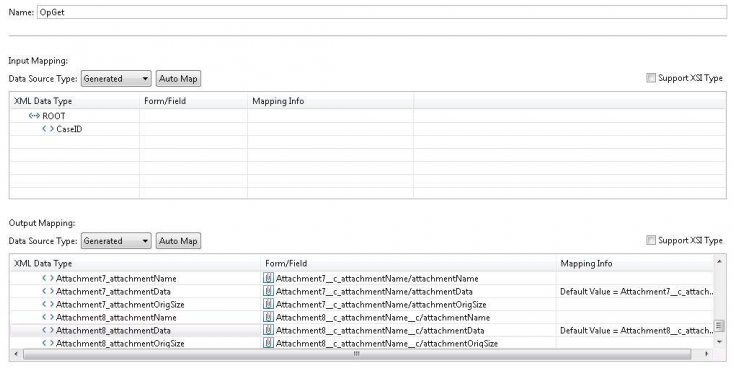
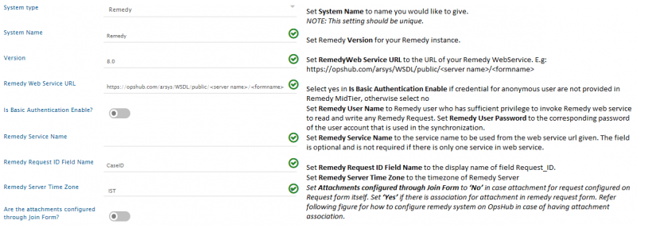
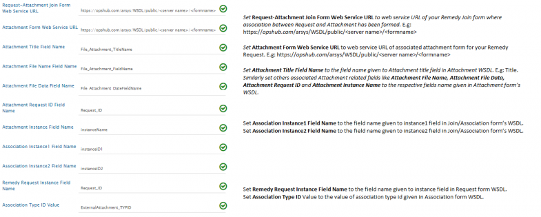
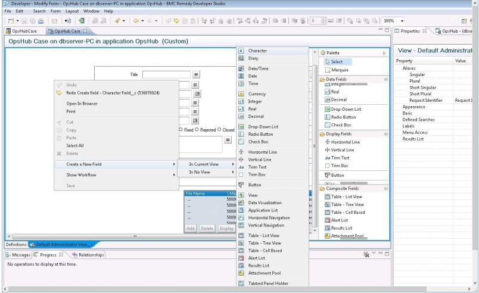
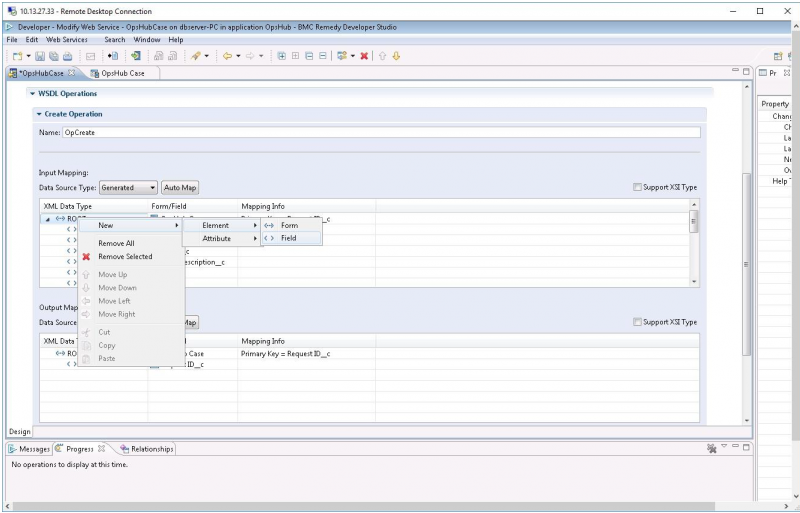
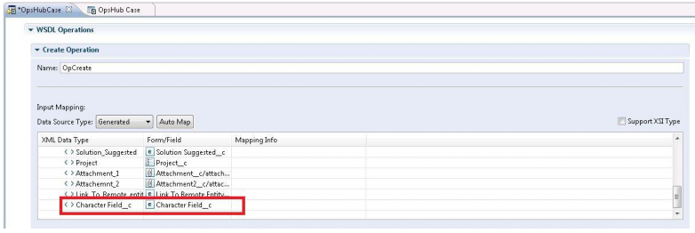

# Prerequisites
## User Privileges

No user is required for Remedy connector.

## Custom Field Configuration

The <code class="expression">space.vars.SITENAME</code> requires one special field to be defined on the entity that is being synchronized. This must be set up so that it can track the integration status of each item:

| **Property Name**   | **Type** |
|---------------------|----------|
| OH_Last_Update      | Text     |

### Web Service Checks

* Create one new web service `OpGetListID` of type `OpGetList` with Qualification as input and the following fields in output:
  * Request_ID
  * Arrival_Time
  * Modified_Date/Modified_Time
* Operation name in web service should be `OpGet`, `OpGetListID`, `OpSet`, and `OpCreate`.
* `Arrival_Time/Create_Time` and `Modified_Time` should be mapped to the output result in `OpGet` and `OpGetListID` operation.
* `OpGetListID`'s output type should be unbounded.
* There should be no default qualification set for `OpGetListID`.

### Web Service Checks for Attachment Synchronization

If attachments in Remedy form are configured within the form, then make sure you have the right configuration in Remedy web-service for `OpGet` and `OpSet` operation.

Attachment name, data, and size field should be configured in the following format in `OpGet` and `OpSet` operation of Remedy:

* Attachment name field: `Attachment<Attachment_number>_attachmentName` with data type `String`.
* Attachment data field: `Attachment<Attachment_number>_attachmentData` with data type `base64binary`.
* Attachment size field: `Attachment<Attachment_number>_attachmentOrigSize` with data type `int`.
* For example:  
  `Attachment1_attachmentName`,  
  `Attachment1_attachmentData`,  
  `Attachment1_attachmentOrigSize`.

  

# System Configuration

Before you continue to the integration, you must first configure Remedy onto <code class="expression">space.vars.SITENAME</code>.  
Click [System Configuration](../integrate/system-configuration.md) to learn the step-by-step process to configure a system.

Refer the screenshot given below for reference:

  

  

If the system is deployed on HTTPS and a self-signed certificate is used, then you will have to import the SSL Certificate to be able to access the system from <code class="expression">space.vars.SITENAME</code>.  
Click [Import SSL Certificates](../getting-started/ssl-certificate-configuration.md) to learn how to import SSL certificate.

# Mapping Configuration

Map the fields between Remedy and the other system to be integrated to ensure that the data between both the systems synchronizes correctly.  
Click [Mapping Configuration](../integrate/mapping-configuration.md) to learn the step-by-step process to configure mapping between the systems.

# Integration Configuration

Set a time to synchronize data between Remedy and the other system to be integrated. Also, define parameters and conditions, if any, for integration.  
Click [Integration Configuration](../integrate/integration-configuration.md) to learn the step-by-step process to configure integration between two systems.

# Criteria Configuration

## Query

Remedy query can be formed using the name given to field at the time of creating it (e.g., Priority, Status, Create Time, Modified Time).  
The Query Format is: `'Field Name' [Supported Operator] value`  
Supported Operators: `>`, `<`, `=`, `!=`, `AND`, `OR`, `>=`, `<=`  
Value: If the field type is string, then the value should be enclosed in double quotes.

## Sample Query

Examples:  
`'Priority' = "Must"`  
`'Priority' = "Must" AND 'Status' = "New"`  
`'Create Time' > "12/12/2013"`

# Appendix

## Create Custom Field

To create a new custom field in Remedy, follow the steps given below:

* As shown in the image below, right click **Remedy** form to add a new field.

  

* Add mapping for that field in web-service's operations: `OpGet`, `OpSet`, `OpCreate`.
  

  

  

* Save web-service and the form.
* Restart the Remedy Tomcat Server.

