## Prerequisites

## User privileges

* Create a dedicated OpsHub Integration Manager user in Salesforce. This user shouldn't perform any other action from Salesforce's UI. For more details on creating a new user, refer to the [New User](#new-user) section.
* The following permissions should be enabled in OpsHub Integration Manager's dedicated user's profile (For details on creating a new profile, refer to the [New Profile](#new-profile) section) to synchronize object in OpsHub Integration Manager:

| **Profile Section** | **Permission**        | **Description**                                    |
|---------------------|------------------------|----------------------------------------------------|
| Administrative Permissions | API Enabled          | To access Salesforce through their standard API    |
|                     | View All Data          | To read private notes                              |
|                     | Modify All Data        | To edit private notes                              |
| Standard/Custom Object Permissions | Read             | To view records                                    |
|                     | Create                 | To read and create records                         |
|                     | Edit                   | To read and update records                         |
| Field-Level Security | Read Access           | To read a field                                    |
|                     | Edit Access            | To read and update a field                         |

* No Sharing Rules should be configured for the objects (need to be synchronized) through which the user permissions can be revoked.
* User must have the 'write permission' of the entities that are mapped in the **Relationship Configuration** setting of OpsHub Integration Manager.

## Custom field configuration

OpsHub Integration Manager requires one special field to be defined on the entity that is being synchronized. These must be set up so that OpsHub Integration Manager can track the integration status of each item:

| **Property Name**   | **Type** | **Size** |
|---------------------|---------|----------|
| OH_Last_Update      | Text    | 255      |

For more details on adding custom fields, refer to [Custom Field](#custom-field) in appendix.

# System Configuration

Before you start with the integration configuration, you must first configure Salesforce.

Click [System Configuration](../integrate/system-configuration.md) to learn the step-by-step process to configure a system.

Refer to the screenshot below:

<p align="center">
  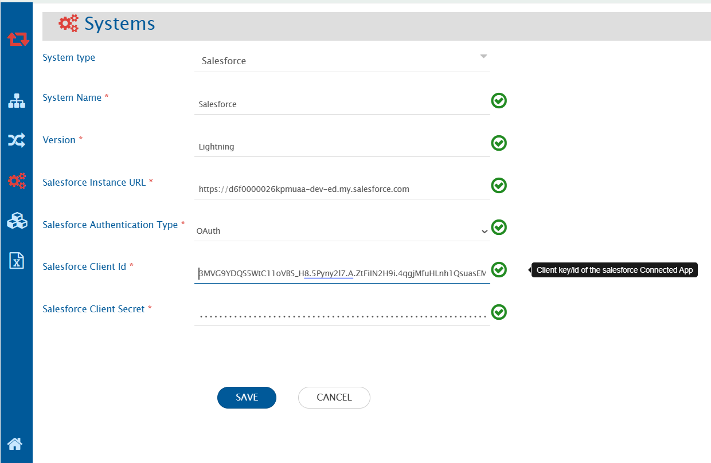
</p>


| **Field Name**                  | **When is the field visible**               | **Description**                                                                                                                                                                                |
|--------------------------------|---------------------------------------------|------------------------------------------------------------------------------------------------------------------------------------------------------------------------------------------------|
| **System Name**                | Always                                      | Provide a name to the Salesforce system                                                                                                                 |
| **Version**                    | Always                                      | Provide the version for the Salesforce system. The version can be either Lightning or Classic                                                           |
| **Salesforce Instance URL**    | Always                                      | Set the URL of your Salesforce instance<br>Format: `https://MyDomainName.my.salesforce.com`<br>To learn how to get the domain name URL, go to [Get MyDomain Name URL](#steps-to-get-mydomain-name-url) |
| **Salesforce Authentication Type** | Always                                  | Select Salesforce Authentication Type as per your requirement. There are two options to choose from:  <br>1. Basic Authentication<br>2. OAuth Authentication (To learn how to enable OAuth Settings in Salesforce System, go to [Steps to enable OAuth settings in Salesforce](#steps-to-enable-oauth-settings-in-salesforce)) |
| **Salesforce Username**        | Basic Authentication                        | Enter Username. User must have administrator privileges to use Salesforce API                                                                         |
| **Salesforce User Password**   | Basic Authentication                        | 	Enter password of the user added above. The value for password must be in the format of password+security token(To learn how to get the security token, click [here](#get-security-token)) |
| **Salesforce Consumer Key**    | OAuth Authentication                        | Enter Consumer Key of the user. To learn how to get the Consumer Key in Salesforce system, click [Get Client Id/ Consumer key and Client Secret for user in Connected APP](#steps-to-get-consumer-key-and-consumer-secret-for-user-in-connected-app) |
| **Salesforce Consumer Secret** | OAuth Authentication                        | Enter Consumer Secret of the user added above.To learn how to get the Consumer Secret in Salesforce system, click[Get Client Id/ Consumer key and Client Secret for user in Connected APP](#steps-to-get-consumer-key-and-consumer-secret-for-user-in-connected-app)|

If the system is deployed on HTTPS and a self-signed certificate is used, import the SSL Certificate. Click [Import SSL Certificates](../getting-started/ssl-certificate-configuration.md) to learn more.

# Mapping Configuration
Map the fields between Salesforce and the other system to be integrated to ensure that the data between both the systems synchronizes correctly. Click [Mapping Configuration](../integrate/mapping-configuration.md) to learn the step-by-step process to configure mapping between the systems.

## Configure Assignment Rules from Field Mapping

* When Salesforce is your target system, you can specify whether to use Assignment Rule from field mapping by specifying an XSLT Attribute in the field mapping XSLT. To read about Assignment Rules in Salesforce, refer https://help.salesforce.com/articleView?id=customize_leadrules.htm&type=5.
* Assignment Rules can be configured and used for Account, Case and Lead entity type and will be used at the time of creating or updating an entity in Salesforce or when Salesforce is your target system.
* If this attribute is not given, then by default the active Assignment Rule will be applied on any create or update performed on Account, Case and Lead. This is the default Salesforce behavior.
* In case you do not want to apply any Assignment Rule at the time of create or update, then you can use the advanced mapping to either disable the Assignment Rule or use a specific Assignment Rule ID.
* Here is an example how you can set Assignment Rule input from field mapping. Consider you have mapped the Owner ID field, then your default field mapping for Owner ID would be something like:

```xml
<OwnerId>
    <xsl:choose xmlns:xsl="http://www.w3.org/1999/XSL/Transform">
        <xsl:when test="SourceXML/updatedFields/Property/OwnerId/userEmail">
            <xsl:variable name="emailTarget" select="userUtils:getUserNameFromEmail($workflowId, $targetSystemId, SourceXML/updatedFields/Property/OwnerId/userEmail, 'false', 'false')"/>
            <xsl:choose>
                <xsl:when test="$emailTarget!=''">
                    <xsl:value-of select="$emailTarget"/>
                </xsl:when>
                <xsl:otherwise>
                    <xsl:value-of select="SourceXML/updatedFields/Property/OwnerId/userName"/>
                </xsl:otherwise>
            </xsl:choose>
        </xsl:when>
        <xsl:otherwise>
            <xsl:value-of select="SourceXML/updatedFields/Property/OwnerId/userName"/>
        </xsl:otherwise>
    </xsl:choose>
</OwnerId>
```
* Add an XSLT attribute in the <OwnerId> tag with name assignmentRuleHeader and input value to this attribute. Value can be either 'TRUE', 'FALSE' or a specific Assignment Rule ID. To get an Assignment Rule ID * for an Assignment Rule, refer [Get Assignment Rule ID](#get-assignment-rule-id). This attribute is only used when Salesforce is a target system.
* Here is a sample XSLT:

### Sample XSLT

```xml
<OwnerId assignmentRuleHeader="TRUE">
  <xsl:choose xmlns:xsl="http://www.w3.org/1999/XSL/Transform">
    <xsl:when test="SourceXML/updatedFields/Property/OwnerId/userEmail">
      <xsl:variable name="emailTarget" select="userUtils:getUserNameFromEmail($workflowId, $targetSystemId, SourceXML/updatedFields/Property/OwnerId/userEmail, 'false', 'false')"/>
      <xsl:choose>
        <xsl:when test="$emailTarget!=''">
          <xsl:value-of select="$emailTarget"/>
        </xsl:when>
        <xsl:otherwise>
          <xsl:value-of select="SourceXML/updatedFields/Property/OwnerId/userName"/>
        </xsl:otherwise>
      </xsl:choose>
    </xsl:when>
    <xsl:otherwise>
      <xsl:value-of select="SourceXML/updatedFields/Property/OwnerId/userName"/>
    </xsl:otherwise>
  </xsl:choose>
</OwnerId>
```

- If you want to assign the value of this attribute according to some custom logic, then you can refer section to [Write Custom logic to configure Assignment Rules](#write-custom-logic-to-configure-assignment-rules).

## Configure Post As Comment

* Two types of **Posts** are available in Comment mapping configuration:
  1. Private Text Post: This includes posts having visibility to only **Internal Users**.
  2. Public Text Post: This includes posts having visibility to **All Users**.

<p align="center">
  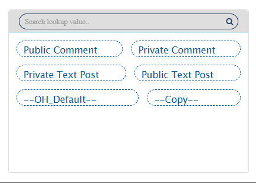
</p>


## Mapping for Soft Delete Configuration

* When Salesforce is the target system, the Soft delete operation is performed by default in the synchronization of the [Source Delete event](../integrate/source-delete-synchronization.md).
* After the Soft Delete operation is performed by OpsHub Integration Manager in Salesforce, the entity will be deleted in Salesforce. The deleted entity goes to the "Recycle Bin".
* To only enable the logical delete operation in the target, "OH Soft Delete" field shall be mapped with the default value "No" in the [Delete Mode](..integrate//mapping-configuration.md#delete-mode) mapping.

# Integration Configuration

Set a time to synchronize data between Salesforce and the other system to be integrated. Also, define parameters and conditions, if any, for integration. Click [Integration Configuration](../integrate/integration-configuration.md) to learn the step-by-step process to configure integration between two systems.

## Entity Level Advance Configuration

**Display ID Field:**

* For the Salesforce entity, user can select the field (considered as display id in Salesforce UI) from the dropdown menu.
* The above selected field value is considered as a display id in OpsHub Integration Manager's sync report. For example, for **Case** entity, user can select **Case Number** in Display ID Field as it is unique and is considered as display id in Salesforce UI.
* If the field is not selected in the Display ID Field, the Salesforce entity's internal id (which is a part of the entity URL) will be visible in OpsHub Integration Manager's sync report.

<p align="center">
  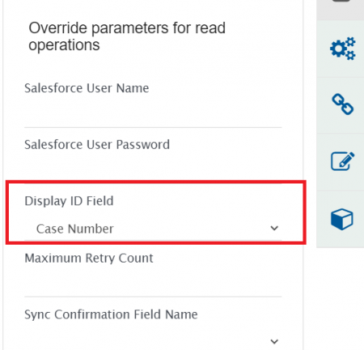
</p>

**Post as Comment:**

* For the Salesforce entity, the post can be synchronized as comment to the target system. To enable this feature, user needs to select "Yes" for Post as Comment field that is configured at the integration level.

<p align="center">
  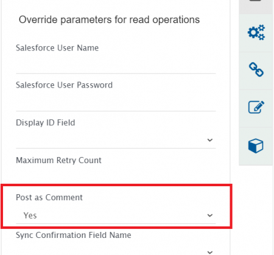
</p>

# Criteria Configuration

## Query

If you want to specify conditions for synchronizing an entity between SalesForce and the other system to be integrated, you can use the Criteria Configuration feature.
Salesforce query is a normal SQL type query wherein you can frame simple queries on the basis of field names. For more details on writing a query, please refer to this [link](https://developer.salesforce.com/docs/atlas.en-us.soql_sosl.meta/soql_sosl/).

## Sample Query

* Search entities with **High** Priority:
  * `Priority='High'`
* Search entities with **New** Status:
  * `Status='New'`
* Search entities based on a Salesforce object. For example, search entities (Cases) with Record Type as **Problem**:
  * `RecordTypeId='012280000002IUU'` where `012280000002IUU` is the ID of **Problem** Record Type.  
  > **Note** : Please refer Salesforce document [link](https://help.salesforce.com/articleView?id=000321696&language=en_US&type=1&mode=1) to learn how to get the ID of a Salesforce object (Record Type).

* Search entities created by user. You need to specify ID of the user in criteria query as shown below:
  * `CreatedById='0056F000009QhnoQAC'`  
  > **Note**: User's ID will be available in the URL when you open user's profile page in Salesforce. Visit [link](https://help.salesforce.com/articleView?id=rss_user_profile.htm&type=5) to learn how to open the user profile.

* Search entities with multiple criteria:
  * `Priority='High' and Status='New'`

## Target Lookup Configuration

Provide Query in Target Search Query field to be able to search the entity in Salesforce when it is the target system. Go to [Search in Target Before Sync](../integration-configuration#search-in-target-before-sync) section on Integration Configuration page to learn in detail about how to configure the Target Lookup functionality. The Target LookUp configuration is similar to the Criteria configuration where in the target search query field, you can provide a placeholder for the source system’s field value between ‘@’ and '@'. Refer to the examples below:

### Sample Query

* Target Lookup Query for the constraint on a **single field**: Name = @Title@
**Description:**  
It represents the query, which will select only those entities whose "Name" field value is same as the source system's "Title" field value.

* Target Lookup Query for the constraint on **multiple fields**: (Status = @Status@ and Priority = @Priority@)
**Description:**  
It represents the query, which will select only those entities whose "Status" field value is same as source system's "Status" field value. Similarly, the "Priority" field value should be same as the value of the source system's "Priority" field value.

# Known Behavior and Limitations

## Post as Comment sync
* Post and Post replies (i.e., post comments) will be sync as separate comments to the target system.
* The Post is supported as normal text. Hence, the formatting, user mention and inline images is not supported.
* Salesforce as the source system:
  * Supported posts: **Text** post (TextPost), Post replies (TextComment), and Post with attachment (ContentPost).
  * To sync the post attachment, it is required to enable attachment mapping OpsHub Integration Manager.
  * If a Post reply is edited after being synced, an additional field update is necessary to sync the edited reply as a new comment.
* Salesforce as the target system:
  * Supported posts: **Text** post.
  * The Post with attachment is not supported. In this case, the attachment will be added to the Salesforce object, however, it will not be referred in Post.
* Salesforce's Chatter API has a limit of 2000 requests per hour and per user. Hence, Integrations that has enabled **Post as Comment** field, would come to a pause after reaching the request limit.

## Remote Link
* The remote link URL contains the URL of the Classic version only irrespective of any Salesforce version(Classic or Lightning).

## Field with Reference datatype
* If the **Reference field** is referring to multiple entities of Salesforce, then only the first referred entity will be supported as **Link**.
  * For example, if the **Related field** refers to the Enhancement and User Story entities, then only Enhancement will be supported as the **Link** in OpsHub Integration Manager.

## Chatter Feed types
* OpsHub Integration Manager supports only **Post** type from all Chatter feed types.

## Inline Image Sync
* To enable Inline Image Sync in OpsHub Integration Manager, you need to enable the **Content Deliveries and Public Links** Settings in your Salesforce Instance. The steps to enable **Content Deliveries and Public Links** is mentioned in [Steps to enable Content Deliveries and Public Links in Salesforce](#steps-to-enable-content-deliveries-and-public-links-in-salesforce)  
   * Click here to learn how to enable Content deliveries and Public links in the Salesforce system** [Steps to enable Content Deliveries and Public Links in Salesforce](#steps-to-enable-content-deliveries-and-public-links-in-salesforce)

# Appendix

## New User
* Log into Salesforce.
* Go to **Setup** -> **Users** -> **Users**.
* Click **New User** and provide the required information.
* Select a **User License**. The user license determines which profiles that are available to the user.
* Select a **Profile**, specifing the user’s minimum permissions and access settings.

<p align="center">
  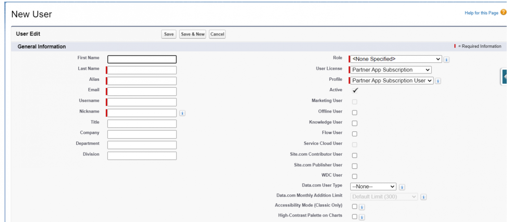
</p>

* Check **Generate new password and notify user immediately** to have the user’s login name and a temporary password will be emailed to the new user.

## New Profile
* Log into Salesforce.
* Go to **Setup** -> **Users** -> **Profiles**.
* Click **New Profile**.
* Select an existing profile which you want to clone and enter the profile name and click **Save**.

<p align="center">
  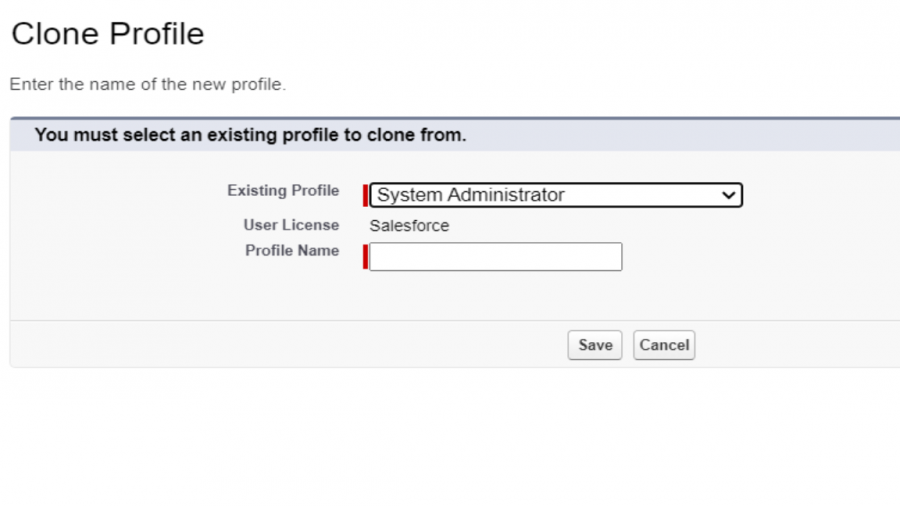
</p>


Once the profile is created, click **Edit** to set the permissions  
* Under **Standard Object Permissions** and **Custom Object Permissions** sections, select the necessary permissions for objects and click **Save**.  
<p align="center">
  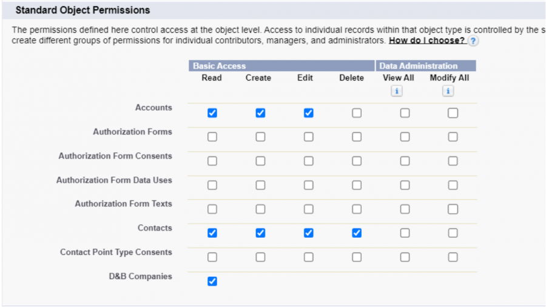
</p>

<p align="center">
  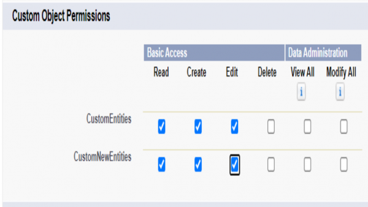
</p>


* Under **Field-Level Security** section, click **View** against the object for which you want to change the permission. Click **Edit** to select the necessary permissions for fields and click **Save**.  
<p align="center">
  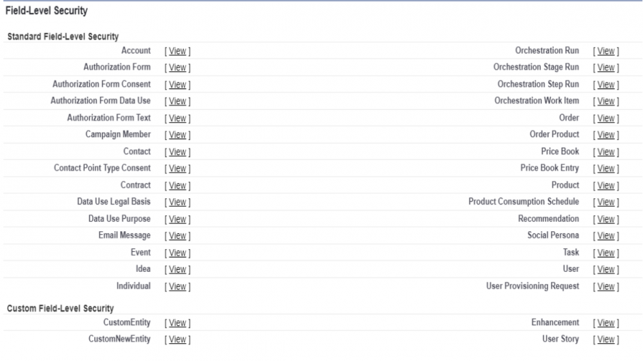
</p>

## Custom field
* Login to Salesforce.
* Go to **Setup** -> **Customize** -> (Entity for which you want to add field) -> **Fields**.
* Scroll down to **Custom Fields** and **Relationships** section and click **New**.
* Choose the **Field Type**, a page will appear. Select appropriate field type and click **Next**.

<p align="center">
  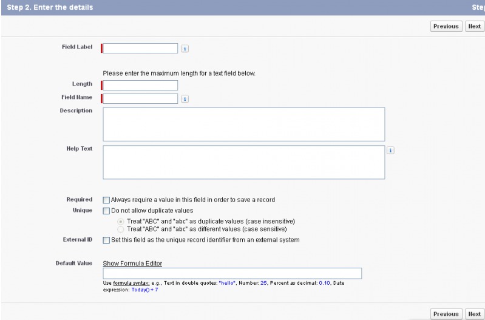
</p>

* On next page, fill in all the field details. Keep Length to 255. Click **Next**.
* Next page is **Choose Field Level Security**. Change the **visibility** setting as per your convenience and keep **Read-only** unchecked. Click **Next**. 
* Select the page layout and click **Save**.

## Get Security Token

* Security token is mailed to a user when his/her account is created in Salesforce.
* In case you don't have the Security Token, then go to **Setup** -> **My Personal Information** -> **Reset Security Token**.

<p align="center">
  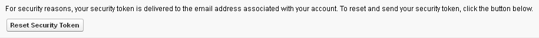
</p>

* Click **Reset Security Token**. New security token will be mailed to the user's email id.

## Get Assignment Rule ID

* To get Assignment Rule ID for a specific Assignment Rule, navigate to the Assignment Rule configuration page in Setup. Refer [Salesforce Help](https://help.salesforce.com/articleView?id=editing_assignment_rules.htm&type=5) for more details.
* Navigate to the Assignment Rule that you want triggered for create/update or the active Assignment Rule.
* In the address bar for your browser, copy the 15 digit ID after `?id=`. The Assignment Rule ID will be the part after the `?id=<assignment_rule_id>` in the URL. For example, `?id=01Q6F000001N3Xk`. Here, `01Q6F000001N3Xk` is the Assignment Rule ID.

### Write Custom logic to configure Assignment Rules

* You can write custom XSLT to set the value of `assignmentRuleHeader` according to some custom logic. Here is a sample XSLT to not use Assignment Rules for **Create** events and Rule ID `01Q6F000001N3Xk` for **Update** events.

```xml
<OwnerId>
    
    <!-- XSLT to add attribute according to custom logic -->
    <xsl:attribute xmlns:xsl="http://www.w3.org/1999/XSL/Transform" name="assignmentRuleHeader">
        <xsl:choose>
            <xsl:when test="SourceXML/opshubEventType = 'Create'">
                <xsl:value-of select="'FALSE'"/>
            </xsl:when>
            <xsl:otherwise>
                <xsl:value-of select="'01Q6F000001N3Xk'"/>
            </xsl:otherwise>
        </xsl:choose>
    </xsl:attribute>
    
    <!-- Default XSLT -->
    <xsl:choose xmlns:xsl="http://www.w3.org/1999/XSL/Transform">
        <xsl:when test="SourceXML/updatedFields/Property/OwnerId/userEmail">
            <xsl:variable name="emailTarget" select="userUtils:getUserNameFromEmail($workflowId, $targetSystemId, SourceXML/updatedFields/Property/OwnerId/userEmail, 'false', 'false')"/>
            <xsl:choose>
                <xsl:when test="$emailTarget!=''">
                    <xsl:value-of select="$emailTarget"/>
                </xsl:when>
                <xsl:otherwise>
                    <xsl:value-of select="SourceXML/updatedFields/Property/OwnerId/userName"/>
                </xsl:otherwise>
            </xsl:choose>
        </xsl:when>
        <xsl:otherwise>
            <xsl:value-of select="SourceXML/updatedFields/Property/OwnerId/userName"/>
        </xsl:otherwise>
    </xsl:choose>
</OwnerId>
```
## Steps to get MyDomain Name URL

* Log into Salesforce.
* Type **My Domain** in **Quick Find** textbox in **Setup**.
* The domain name URL can be found on the following path:
  * **My Domain Settings** -> **My Domain Details** -> **Current My Domain URL**.
* Refer to the screenshot below:

<p align="center">
  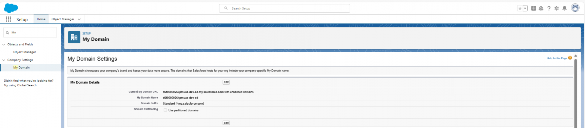
</p>

## Steps to enable OAuth settings in Salesforce

* Log into Salesforce.
* **To create a New Connected App, the Salesforce user should have the following permissions:**  
  **https://help.salesforce.com/s/articleView?id=sf.connected_app_client_credentials_setup.htm&type=5**

* For Lightning version:
  * Go to **Setup** -> **Platform Tools** -> **Apps** -> **App Manager** -> **New Connected App** as shown in screenshot below:

<p align="center">
  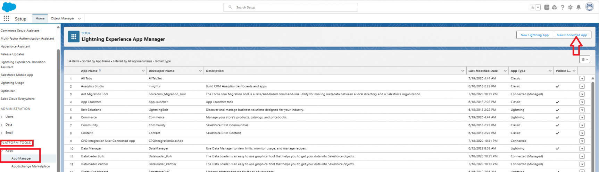
</p>

* For Classic version:
  * Go to **Setup** -> **Build** -> **Create** -> **Apps** -> **Connected Apps** -> **New**, Apps page in Setup as shown in the screenshot below:

<p align="center">
  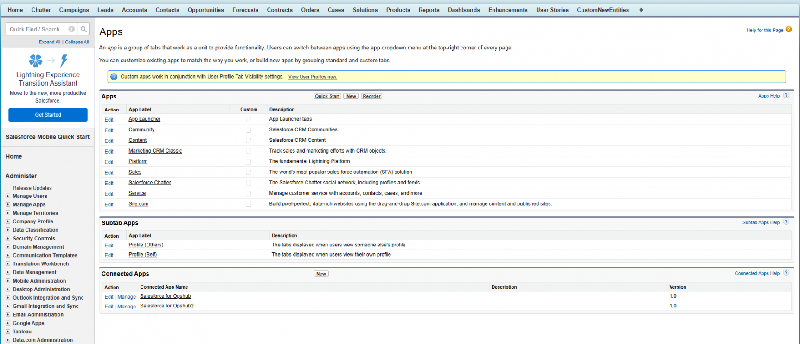
</p>

* The configuration page of Connected App is shown in the screenshot below:

<p align="center">
  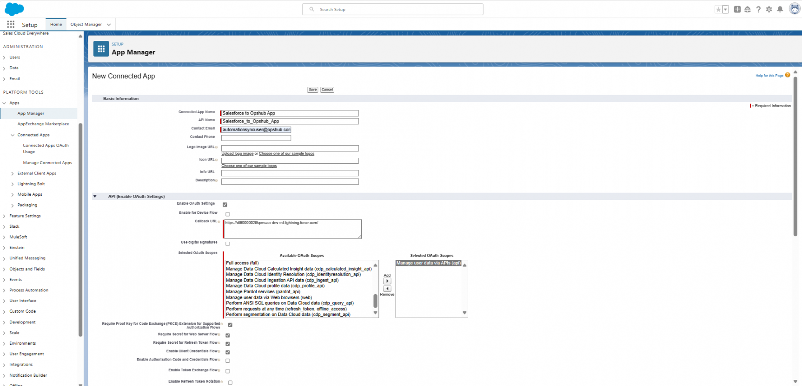
</p>

* Configure the basic information for newly created Connected App:
  * For the connected app, define the basic information, including the app’s name, logo, and contact information.
* Enable OAuth Settings for API integration:
  * Enter the callback URL (endpoint) that Salesforce calls back to your application during OAuth. It’s the same as the OAuth redirect URI.  
    **Note** It is recommended to add instance URL as the call back url.
* In Selected OAuth Scopes section, select and add **Manage user data via APIs(api)** from the list.
  * Enable Client Credentials Flow.
* Click on **Save** button to create the Connected App.
* On the Connected App page, Click on **Manage** option to select an execution user for the client credential
  * Click on **Edit Policies** option as shown in the screenshot below:

<p align="center">
  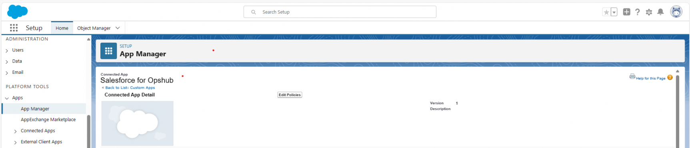
</p>

* In the Client Credential Flow section in the Run As text box, find the user that you want to assign the client credentials flow. Refer to the screenshot below:

<p align="center">
  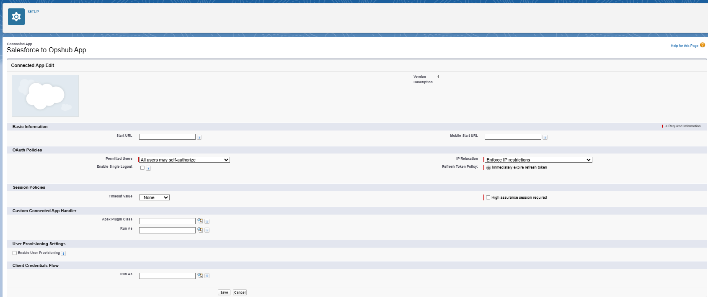
</p>

* For Enterprise Edition orgs, Salesforce recommends that to select an execution user having the API Only User permission.
  * Salesforce can return access tokens on behalf of this execution user.
* For Lightning version:
  * Go to **Setup** -> **Identity** -> **OAuth and OpenID Connect Settings** and enable Allow Authorization Code and Credentials Flows
* For Classic version:
  * Go to **Setup** -> **Security Controls** -> **OAuth and OpenID Connect Settings** and enable the Allow Authorization Code and Credentials Flows. Refer to the screenshot below:

<p align="center">
  
</p>

## Steps to get Consumer key and Consumer Secret for user in Connected APP

* Log into Salesforce.
* For Lightning version:
  * Go to **Setup** -> **Platform Tools** -> **Apps** -> **App Manager** -> your connected app
* For Classic version:
  * Go to **Setup** -> **Create** -> **Apps**, click on your connected app.
* Click on **View** from the drop-down menu present on the right side of Salesforce UI.
* In API(Enable OAuth Settings) section, go to **Consumer Key and Secret** and click **Manage Consumer Details**  
  Refer to the screenshot below:

<p align="center">
  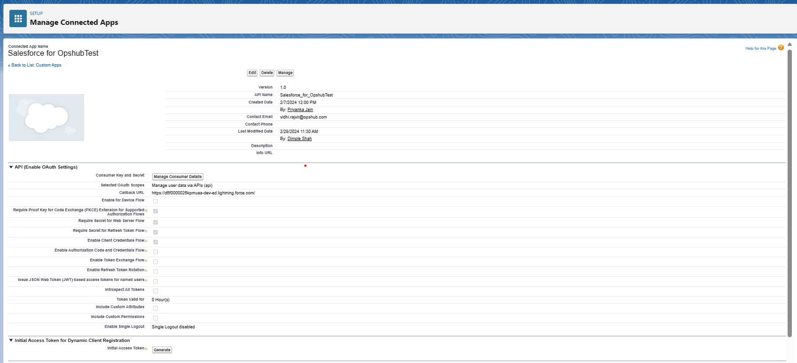
</p>

* Enter the verification code sent to the email id associated with the Salesforce account to verify the identity.
* Upon entering the verification code, it will redirect to the Consumer details page.
* Use the **Consumer Key** and **Consumer Secret** to configure the Salesforce system in OpsHub Integration Manager with Oauth authentication type.

## Steps to enable Content Deliveries and Public Links in Salesforce

* Log into Salesforce.
* Go to **Setup** -> type in **Quick Find** textbox -> **Content Deliveries and Public Links**
* Click **Edit** and enable the "Content Deliveries" feature and "Public Links".
  * Content Deliveries and Public Links convert files into an online format available via a link, which you can send to people inside or outside your organization.
* **Select Password protection** configuration as **optional** and default value as **OFF**.  
  Refer to the screenshot below:

<p align="center">
  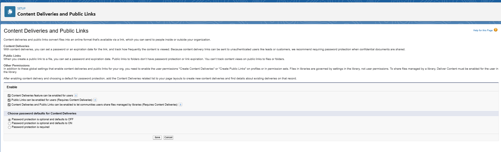
</p>


