# Prerequisites

## Pre-loaded Dependency

* Sap connector depends on 'Sapjco3.dll' (for Windows) and 'libSapjco.so' (for Linux).
* These files can be downloaded from [Sap Connector](https://support.Sap.com/en/product/connectors/jco.html) by the user with a valid Sap license/subscription.
* Place the dependency in a path available in the machine's environment variables. Restart the <code class="expression">space.vars.SITENAME</code> service after placing the dependency.
* The following table shows one of the paths available in the environment variables:

| OS Type | Dependency   | Path                   |
|---------|--------------|------------------------|
| Windows | Sapjco3.dll  | C:\Windows\System32     |
| Linux   | libSapjco.so | \usr\lib               |

## User Privileges

* Create a technical ABAP user in the Sap ECC or Sap S/4HANA technical instance dedicated to <code class="expression">space.vars.SITENAME</code>. This user shouldn't perform any other action from Sap GUI. This user is referred to as the 'Integration User' in this document.
* A Sap user can only be created by the Sap BASIS administrator.
* To integrate Sap entities using <code class="expression">space.vars.SITENAME</code>, the user must be a technical ABAP user with:
  * RFC read and execute permissions.
  * SE80 read, write, and execute permissions.

## Enable API for 'Linkages'

* <code class="expression">space.vars.SITENAME</code> uses the RFC 'CRMOST_WHERE_USED_LIST' to fetch the linkages for each entity type except the 'Transport Request' entity.
* After Sap ECC 6.0 and in Sap S/4HANA, this API is set to **normal-enabled** in the Sap end system.
* To sync any entity type other than 'Transport Request', it is mandatory to:
  * Ask the Sap BASIS administrator to make the API **RFC-enabled** in the end system.
  * Or plug in the custom API 'ZCRMOST_WHERE_USED_OPSHUB' in the end system. Refer to [Configure Custom Linkage API](#configure-custom-linkage-api) for details.

## Enable API for 'Usage Details'

* Due to the lack of available API in Sap, the user must configure the custom API in Sap end system to fetch the Usage Details entity for synchronization.
* Refer to [Configure Custom Linkage API](#configure-custom-linkage-api) for details.

# System Configuration

* To start the integration, configure the Sap system in <code class="expression">space.vars.SITENAME</code>.
* Refer to [System Configuration](../integrate/system-configuration.md) page to learn the stepwise process. Refer to the following screenshot:

<p align="center">
  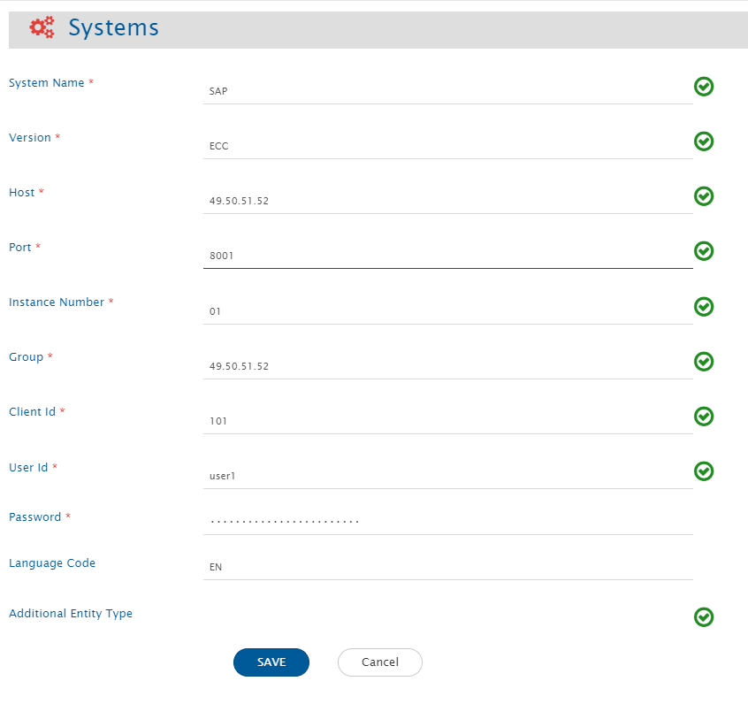
</p>

**Sap System form details**

| Field Name                | Description                                                                                         |
|---------------------------|-----------------------------------------------------------------------------------------------------|
| **System Name**            | Provide the system's name.                                                                          |
| **Version**                | Provide the version of the Sap instance: ECC or HANA.                                              |
| **Host**                   | Specify the host where the Sap system is deployed. For example: 49.50.51.52                        |
| **Port**                   | Specify the port where the Sap system is deployed. Usually, it is 80XX, where XX is the instance number.|
| **Instance Number**        | Specify the instance number of the Sap system. It is a two-digit number indicating the Id of the Sap instance.|
| **Group**                  | Provide the Group IP for the Sap system. If there is no group, enter the same value as Host.         |
| **Client Id**              | Specify the Sap Client Id. It is a three-digit number to identify the Sap Client.                  |
| **User Id**                | Provide the user id of a dedicated user for communicating with the system API. This user should have the required privileges as mentioned in [User Privileges](#user-privileges) |
| **Password**               | Provide the password for the user.                                                                  |
| **Language Code**          | Specify the language code of the Sap system. For example: EN (for English). The language code must be only two characters. The default language code is EN. |
| **Additional Entity Type** | This is an optional field to specify the list of entity type(s), other than the supported ones for integration. Each additional entity type must be a valid Object Type of the TADIR table in Sap. Refer to [Additional Entity Type JSON](#additional-entity-type-json) to understand the input template. |

**Additional Entity Type JSON**

> **Note** :For the additional entity types, certain advanced features may not operate as intended. The purpose of this field is to offer users the flexibility to sync entity types beyond the default options.
* In Sap, all the objects' entries are available in the TADIR table, along with their Object Type. This document will use the word 'Entity Type' for Object Types in Sap. Out of the available entity types in TADIR, <code class="expression">space.vars.SITENAME</code> supports limited entity types by default.
* If there are entity types present in the TADIR table but not included in the supported list of <code class="expression">space.vars.SITENAME</code>, the user can integrate them by registering their details in the Additional Entity Type field in the Sap system form. This can be done using the following JSON template:

```json
[
        {
          "displayName": "Mention the display name of the entity type.",
          "objectTypeInTADIR":"Mention the entity type from 'OBJECT' column of the TADIR table in the Sap instance.",
          "relatedSapTables": [
            {
                "SapTableName":"Mention additional Sap table name (if any), having more details about the entity type.",
                "joinColumnName": "Mention the column name of the above table, having the identifier value same as 'OBJ_NAME' column of TADIR table."
            },
            ...
            {

            }
          ]
        },
        ...
        {

        }
]
```
* Multiple additional entity types can be added in the same field. Refer to the below example:
  
```json
    [
        {
          "displayName": "View Cluster",
          "objectTypeInTADIR":"VCLS",
          "relatedSapTables": [
            {
                "SapTableName":"VCLSTRUCT",
                "joinColumnName": "VCLNAME"
            }
          ]
        },
        {
          "displayName": "View Maintenance",
          "objectTypeInTADIR":"VDAT",
          "relatedSapTables": [
            {
                "SapTableName":"",
                "joinColumnName": ""
            }
          ]
        }

    ]
```

# Mapping Configuration

> **Note** :In <code class="expression">space.vars.SITENAME</code>, the Sap system supports only read-only functionality.

- Map the fields between Sap and the other system to be integrated to ensure data synchronization between both systems.
- Here is an example of Sap's Enhancement and Azure DevOps' User Story integration:

<p align="center">
  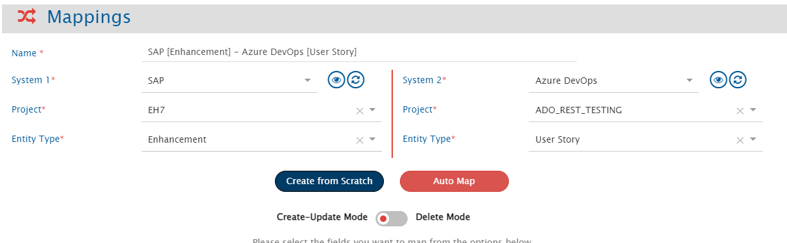
</p>

Refer to the [Mapping Configuration](../integrate/mapping-configuration.md) page to learn the steps to configure mapping between the systems.

In Sap, there can be only one project representing the object repository of the instance.

# Integration Configuration

Set a time to synchronize data between Sap and the other system to be integrated. Also, define parameters and conditions (if any) for integration. Refer to the [Integration Configuration](../integrate/integration-configuration.md) page to learn the steps to configure the integration between two systems. Refer to the screenshot below:

<p align="center">
  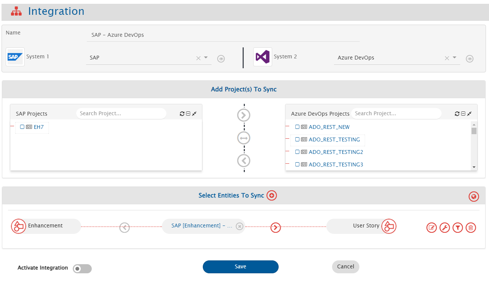
</p>

## Criteria Configuration

If the user wants to specify conditions for synchronizing an entity from Sap as the source system to the other system (target system), criteria must be configured. Navigate to the [Criteria Configuration](../integrate/integration-configuration.md#criteria-configuration) section on the [Integration Configuration](../integrate/integration-configuration.md) page for more details.

- Set the **Query** as per the Sap native query format.
- Criteria configuration is not supported by the 'Usage Details' entity type.
- However, criteria can be applied to the below fields for the 'Transport Request' entity type:

<span style="color:blue"> **Criteria samples for 'Transport Request' entity:** </span>

| **Field Internal Name** | **Field Display Name** | **Criteria snippet** | **Description** |
|-------------------------|----------------------|-------------------|----------------|
| **TRKORR** | Request/Task | TRKORR LIKE 'EH%' | Query to get the results only for TRs starting with 'EH'. |
| **TRFUNCTION** | Type of request/task | TRFUNCTION NE 'D' | Query to get the results only for TRs with function type D. |
| **TRSTATUS** | Status of request/task | TRSTATUS EQ 'R' | Query to poll only released TRs. |
| **TARSYSTEM** | Transport Target of Request | TARSYSTEM LIKE 'AB%' | Query to poll TRs meant for target system starting with 'AB'. |
| **KORRDEV** | Request or task category | KORRDEV EQ 'ZTES' | Query to poll TRs of the 'ZTES' category. |
| **AS4USER** | Owner of a Request or Task | AS4USER EQ 'USER1' | Query to poll TRs whose owner is 'USER1'. |
| **AS4DATE** | Date of Last Change | AS4DATE GE '20240809' AND AS4DATE LE '20240909' | Query to poll TRs between given the time interval. Time is given in the 'yyyyMMdd' format. |
| **STRKORR** | Higher-Level Request | STRKORR LIKE 'Z%' | Query to poll TRs with higher-level request names starting with Z. |


- For all other entity types (including additional types), criteria can be applied to any of the fields corresponding to the columns in the TADIR table in Sap. Refer to the [TADIR Columns](#tadir-columns) section for more details.

# Known Behaviour

## Dynamically changing poller type of an entity

In Sap environments running versions below ECC 6.0 with NetWeaver 7.5, certain Sap tables used for polling do not contain date columns for entity creation. This limitation affects the ability of the poller to function based on timestamps.

### Behavior and Impact

- If the expected time field is unavailable in the Sap end system, the poller switches to a non-timestamp-based mode.
- In non-timestamp-based polling, the poller retrieves all entities, regardless of their creation time.
- Due to this, it is recommended to increase the 'Associate Schedule' available in 'Global level advance configurations' while configuring integration to optimize the performance and reduce unnecessary processing.
- By default, the poller operates as a current-state poller.

### API rate-limit in Sap

- The Sap system uses `Sapjco3.dll` to communicate with the end system. Hence, there is no specific limitation in terms of calling APIs.
- However, if there is an idle wait time-out configured in the Sap GUI, the same is applicable for the system in <code class="expression">space.vars.SITENAME</code>.
- The wait time-out can be changed/disabled only by the Sap BASIS administrator.

## Limitations

- Entities will be synced without history.
- Comments and Attachments are not supported for any entity type of Sap.

## Limitations specific to Usage Details entity

- Metadata of the system fields is not available for the 'Usage Details' entity type. However, static metadata is provided for the same.
- Recovery cannot be performed for the 'Usage Details' entity type, as the data for this entity expires every 48 hours in the end system. This expiration time is configurable in the end system and can only be done by the Sap BASIS administrator.
- Integration for syncing the 'Usage Details' entity type does not work in parallel with other entity types' integrations using the same Sap system. However, the use case can be achieved by configuring two separate systems for Usage Details and any other entity types. This behavior is because of the difference in time formats for the 'Usage Details' entity and other supported entity types.

# Appendix

## TADIR Columns

- TADIR is a master table in Sap storing the system and custom object types of the given Sap instance.
- Refer to the following list of the column names corresponding to the fields of entity types other than 'Transport Request' for Sap ECC:

<p align="center">
  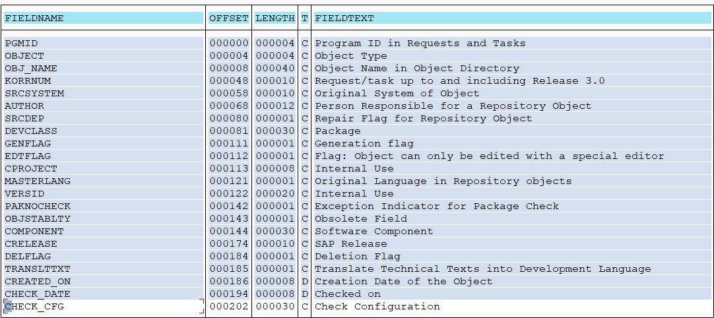
</p>

> **Note** :Display names of the fields might vary in different versions of Sap. The above table is for reference only.

## Configure Custom Linkage API

1. Open 'Object Navigator' using SE80 TCode in Sap GUI.

<p align="center">
  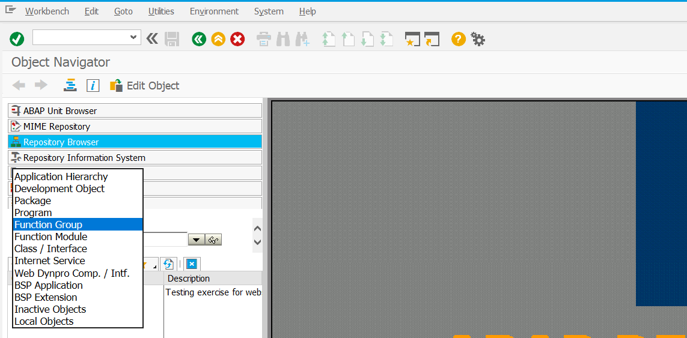
</p>

2. Select 'Function Group' from the object drop-down.

<p align="center">
  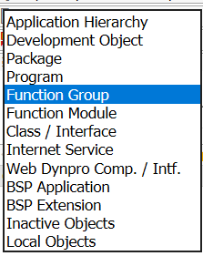
</p>

3. Type 'ZMYOPSHUB' and press Enter. If the Function Group exists, skip this step. Click 'Yes'.

<p align="center">
  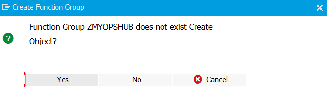
</p>

4. Add a description and click 'Save'. Click 'Local Object' in the pop-up window.

<p align="center">
  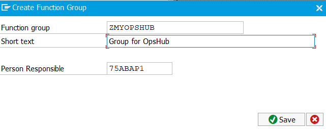
</p>

<p align="center">
  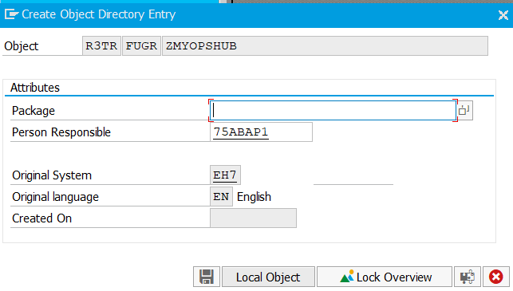
</p>

5. Right-click 'ZMYOPSHUB' and select 'Function Module'.

<p align="center">
  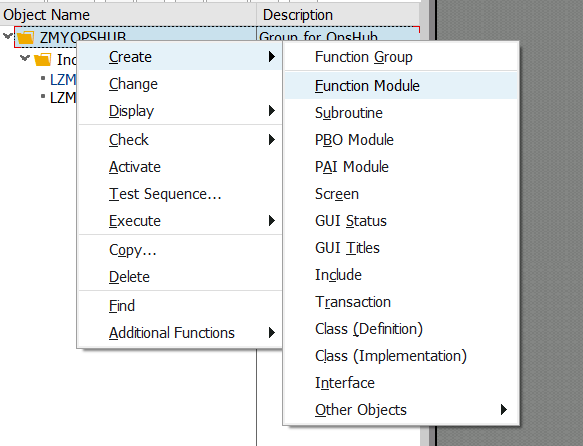
</p>

6. Enter the name as 'ZCRMOST_WHERE_USED_OPSHUB', add a short description and click 'Save'.

<p align="center">
  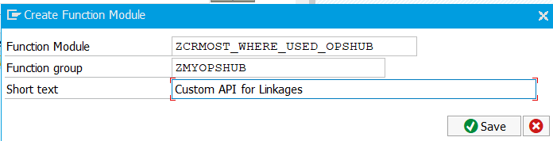
</p>

7. Double-click the function module and go to Utilities->More Utilities->Upload/Download->Upload. Browse the API file and upload.

<p align="center">
  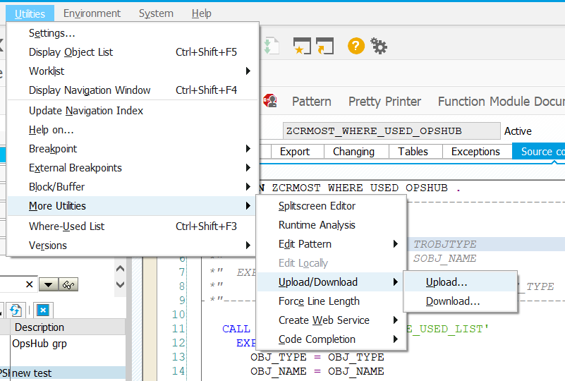
</p>

8. If the upload option is not working, copy-paste the code in the IDE and add the following import and export variables.

<p align="center">
  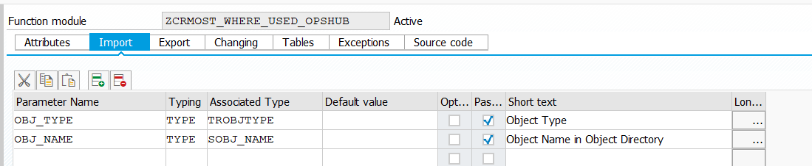
</p>

<p align="center">
  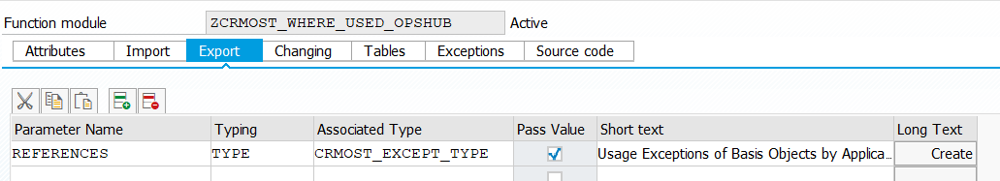
</p>

9. Go to 'Attributes' and select the Remote-Enabled Module radio button.

<p align="center">
  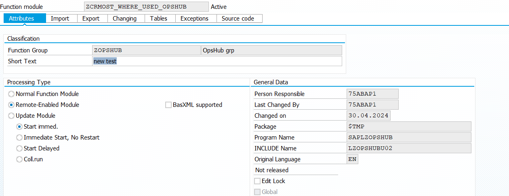
</p>

10. Save and activate the Function Module. Click the green tick mark in the pop-up window.

<p align="center">
  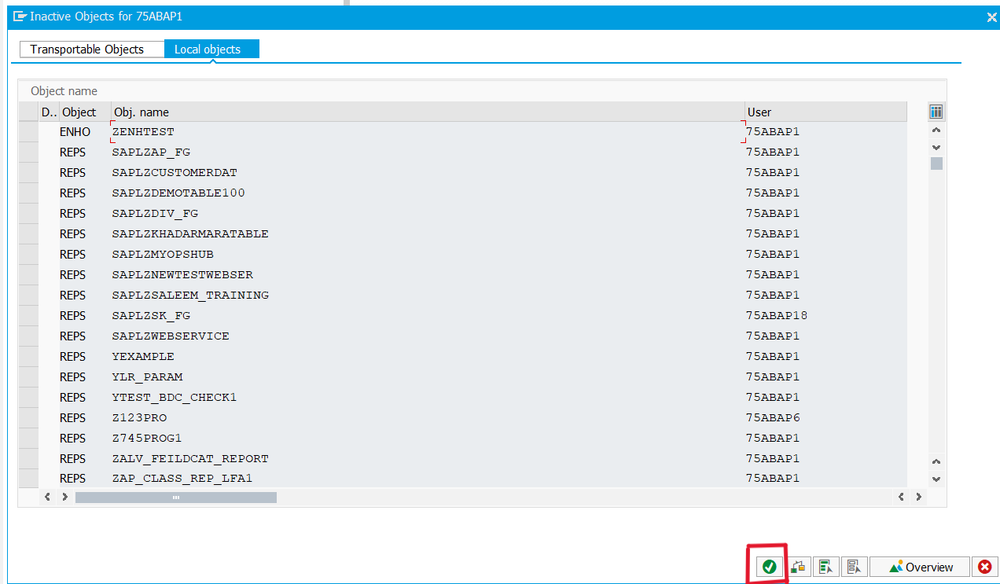
</p>

## Configure Usage Details API

- Follow steps 1 to 7 from [Configure Custom Linkage API](#configure-custom-linkage-api) by replacing the name of the API with 'Z_MY_RSSTAT27_LATEST'.
- After step 7:
  - If the upload option is not working, copy-paste the code in the IDE and add the following import and export variables.

<p align="center">
  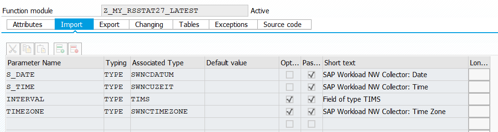
</p>

<p align="center">
  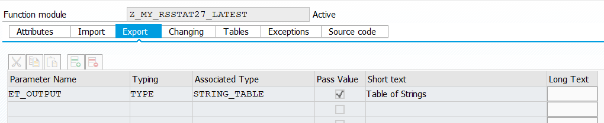
</p>

- Go to 'Attributes' and select the Remote-Enabled Module radio button.
- Save and activate the Function Module. Click the green tick mark in the pop-up window.


