# Prerequisites

## User Privileges

* Create one administrator user of ServiceNow system (please refer [Add User](#add-user) section for creating a new user), dedicated to OpsHub Integration Manager. User should not be used to do any operations from ServiceNow User-Interface.  
   In case your ServiceNow is configured with SSO, you will have to create a normal service user account in ServiceNow and use that user in integration.
* In case if administrator user is not available, dedicated user should have access to tables mentioned below. Please note that Read, Write, Delete, etc mentioned in brackets beside table names, are the access permissions required on respective table. Refer [Add user access for table](#add-user-access-for-table) for providing required permissions to the user.
  * sys_attachment (Read, Write, Delete) 
  * sys_audit (Read, Read.*) 
  * sys_db_object (Read, Read.*) 
  * sys_dictionary (Read, Read.*)  
  * sys_choice (Read, Read.*) 
  * ecc_queue (Write) 
  * sys_attachment_doc (Read) 
  * sys_user (Read) 
  * sys_journal_field (Read,Write,Delete)
  * sys_Transform_map (Read) 
  * sys_transform_entry (Read) 
  * sys_glide_object (Read) 
  * task (Read, Read.*) 
  * sys_import_set_row (Read, Write)
  * User should have Read access to all the entity table that needs to be synchronized along with Read, Write access to its import set table. For example, if you want to integrate Problem, then integration must have read ACL on Problem table and Read,write ACL on its import set table.

   In above permissions, Read.* means there an ACL with * selected in columns with Read permission is required. Please refer [Add user access for table](#add-user-access-for-table) for providing Read.* permission on a table.

* In case you want to use fields of type 'Reference' (e.g. Assignment group, Category, etc), some extra permissions need to be provided. Please refer [Syncing reference fields](#syncing-fields) section for providing the required permissions.

* In addition to tables, here are the roles that integration user should be assigned to:
  * import_set_loader 
  * import_transformer

    &nbsp;&nbsp;&nbsp;&nbsp;This is ServiceNow API requirement in order to use import set tables.

* Integration User time zone must be **GMT**. Please refer to [Change integration user time zone](#change-user-time-zone) section to learn how to change Integration User time zone.

* Please note, in addition to **Read.\*** ACL on a table (wherever applicable in the above list), to get access to all the fields you must ensure that each field of the table meets the following conditions:
  * Field should be marked 'Active' (Active column of the field should be set to 'True').
  * If read ACL is applied on the field, you will get access to the field only when you meet all the below-mentioned criteria associated with the ACL:
    * The condition associated with ACL must evaluate to 'true'.
    * The script associated with ACL must evaluate to 'true' or return an answer variable with the value of 'true'.
    * You must have one of the roles in the required roles list associated with ACL. If the list is empty, this condition evaluates to 'true'.

## Syncing fields

* Reference fields are the fields that are referring to some other ServiceNow entity i.e. fields whose values are the records of some other entity. e.g. Assignment Group field in Incident entity refers to Group entity.
* To sync such reference fields, the integration user must have 'read' permission for the columns sys_id and name or number (whichever is available) of the table/entity that is being referred by the field. The **Allow access to this table via web services** check-box should be checked for allowing the access via REST API to the table being referred by the field.

   The user must not change the field types of out of the box system fields.

## Turning on auditing (history) for a table

ServiceNow tracks incident, change, and problem history in the sys_audit table. Enabling auditing tracks the creation and update of audited records. Audit must be enabled on the entity table (for example, not to its import set table but to the actual entity table like incident, problem, etc). To enable audit for a table, please refer [Enabling audit for a table](#turn-on-auditing-history-for-a-table).

## Enable OpsHub Integration Manager for ServiceNow instance

* OpsHub Integration Manager must be enabled for the ServiceNow instance. You can get this app from ServiceNow appStore: [ServiceNow App Store](https://store.servicenow.com/sn_appstore_store.do#!/store/application/8e6f0b610f8ce6001f6fc3ace1050ebb)

  

* On the OpsHub Integration Manager App page, click on **Get** and provide your ServiceNow HI Credentials. 

* You will see OpsHub Integration Manager for ServiceNow in Downloads tab by navigating **System Applications -> Applications** in your ServiceNow instance [The example below shows OpsHub Integration Manager for ServiceNow Enterprise]. Click on Install for OpsHub Integration Manager for ServiceNow applications.

  

* On successful installation, OpsHub Integration Manager for ServiceNow application will be available.

## Configure import set table and transformation map

If user wants to skip the prerequisite of 'Import Set Table and Transformation map configuration' and they are integrating tables extending task and knowledge, then he/she can select the [ServiceNow Quick Connect].

### Create and configure import set table

* Import set table must be created for each entity that needs to be synchronized.
* For a given actual table, only one import-set table should exist under OpsHub Integration Manager for ServiceNow application.
* Select OpsHub Integration Manager for ServiceNow application in Settings, as shown below:

  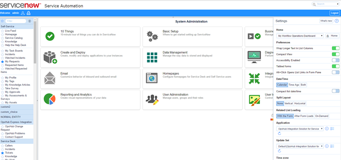

* Type tables in navigator of ServiceNow.
* Click on tables.

  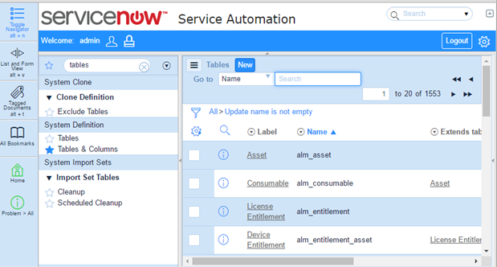

* Click on New.

  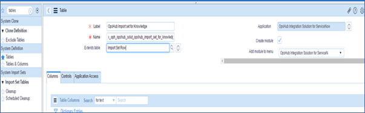

* Create New Import set table as shown above.
* Import set table internal name should start with 'x_oph'.
* Make sure you are creating import set table under OpsHub Integration Manager for ServiceNow application.
* Make sure you are extending Import Set Row (sys_import_set_row) table.
* For every field in original table that needs to be written through synchronization, create one field in your import set table as shown below (No field is required for synchronizing attachment and comment. For work notes though, you need to create a field in import set table).

  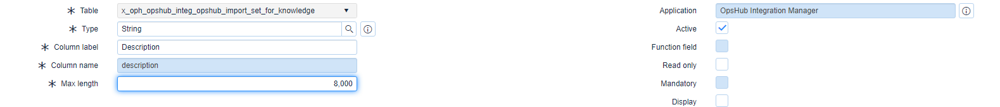

* For all the fields that are added to the import set table, please set the type to 'String'.
* Make sure to provide enough "max length" value in import set table for fields where large data is expected, such as multi-valued user, text, rich text type of fields.
* Create a field 'target_sys_id' of type 'String' in the import set table.
* Given below is the sample view of how the import set tables will look like:

  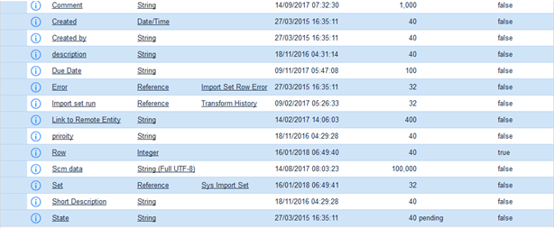

#### Create/Update import set through data source

ServiceNow provides the option of creating import set table (along with the required fields) using data source. Here, data source is an Excel sheet which has the list of all fields to be added to the import set table. This can be particularly useful when number of fields to be added to the import set table is high. Please follow the steps below to create import set table using data source:

* Prepare an Excel sheet by listing the names of all fields (to be added to import set table) horizontally in the first row as shown in the screenshot below (No field is required for synchronizing attachment and comment, so there is no need to add these in excel sheet. For work notes though, you need to create a field in import set table, so you need to add it to the excel sheet).

  

* Ensure you are adding 'target_sys_id' to the Excel sheet.
* Now, please go back to ServiceNow, type 'Data source' in the navigator and click 'Data Sources' under 'System Import Sets'.
* Click on New. Make sure you are creating the import set table under OpsHub Integration Manager for ServiceNow application.

  

* Select type as 'File', format as 'Excel' and file retrieval method as 'Attachment' as shown below.

  

* Click 'Manage attachments' button and attach the Excel sheet prepared in the above step.

  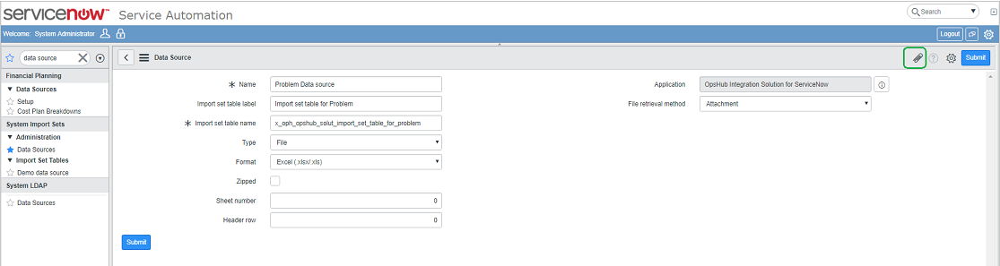

* Once you click on the Submit button, an import set table will be created and all the fields mentioned in the excel sheet will be added to the table.

> Please note that, the fields added using above method will have max. length set to default value i.e. 40 characters. For fields such as description where the content can be more, please set the max. length for the field to an appropriate value in the import set table.

If you want to update (add/remove fields) the import set created using above method, please follow the steps below:

* Update the excel sheet by adding or removing the field names.
* Type 'Data source' in navigator and click 'Data Sources' under 'System Import Sets'.
* Open the data source you want to update.
* Click 'Manage attachments' and remove the existing excel sheet attached to the data source.

  

* Attach the updated excel sheet to the data source and click 'Update'.

This will update the import set table as per the updated excel attached to the data source.

### Create and configure transform map

* Create Transform Map - Type 'transform' in the Navigator as shown below:

  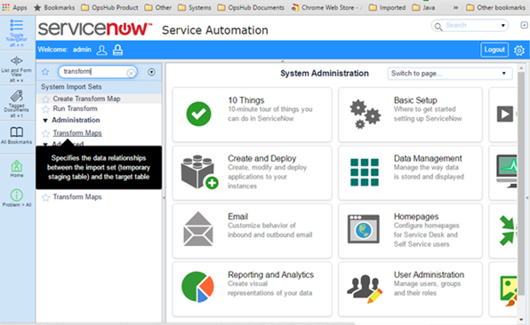

* Create 'New Transform Map' as shown below:

  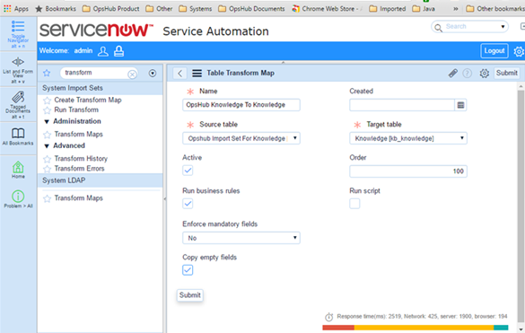

* Map fields as per your requirement - Click 'New' after submitting the above in the Field Map.

  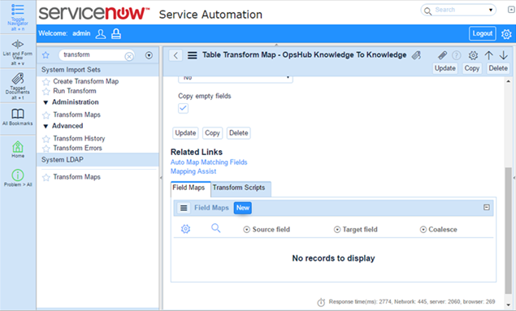

* Map 'target_sys_id' to 'Sys ID' and make Coalesce "True".

  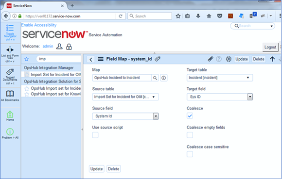

### Configure reference type fields

* To sync reference type fields, add a field in the import set table and give it a meaningful name.
* Set the 'type' of field added in the above step to 'String'.
* In transform map table, add a mapping for this field to map it to the field in actual table.

### Configuring comments and work notes in Import set table

* For comments, no extra field needs to be added to Import set table as 'Comment' field is already available in the Import set row (table which is extended by the import set table you created).

  

* In transform map, you need to map the available 'Comment' field in Import set table (source) with the 'Additional Comments' field of actual entity table (target).

  

* For work notes, add a field to the import set table (you can set any meaningful name for this field) and ensure its type to be the same as given in the entity's actual table.

  

* In transform map, map the work notes field added in Import set table (source) to the 'Work Notes' field of actual entity table. You can refer below screenshots for reference.

  

## Configure Attachment or HTML/Rich type field

If attachments or HTML/Rich type supported fields are mapped, then keep the attachment filename's length to the maximum characters possible in ServiceNow. For configuring the attachment filename(maximum characters), refer to [How to change attachment table configuration](#how-to-change-attachment-table-configuration).

# System Configuration

Before you continue to the integration, you must first configure ServiceNow system. Click [System Configuration](../integrate/system-configuration.md) to learn the step-by-step process to configure a system. Refer the screenshot given below for reference.

  

# Mapping Configuration

Map the fields between ServiceNow and the other system to be integrated to ensure that the data between both the systems synchronizes correctly.  
Click [Mapping Configuration](../integrate/mapping-configuration.md) to learn the step-by-step process to configure mapping between the systems.

## Mapping reference fields

* All the fields of type reference i.e. the fields that are referring to some other ServiceNow entity will be treated as look-ups in OpsHub Integration Manager.
* For such reference fields, you can define value mapping using either name or number.
* A maximum of 1000 lookup values will be loaded for a reference field. If you are not able to find your value in the look-up values loaded, you can map values using advance mapping.
* Look-up values will be loaded only if the entity being referred by a field has name or number columns.
* If lookups cannot be loaded due to any reason, you can still do advance mapping to map the fields.
* If you want to do a direct mapping i.e if values in ServiceNow and other systems are same, then you need to use utility. Currently, OIMCoreUtility getEntityFieldValue is being used, which will give the display name corresponding to the internal id of the look-up value.

**Known limitation**:  
* Multi-select type of fields that do not have reference to any other type of field (e.g. string type multi-select field) are not supported as the target fields in mapping.

# Integration Configuration

In this step, set a time to synchronize data between ServiceNow and the other system to be integrated. Also, define parameters and conditions, if any, for integration.  
Click [Integration Configuration](../integrate/integration-configuration.md) to learn the step-by-step process to configure integration between two systems.

## Integration recommendations & assumptions

For Issue Relationship configuration for a given entity type (e.g. incident), only those entity types (e.g. problem) will be shown to which any reference type of field exists in the given type (e.g. incident).  
* For example, if you are generating mapping for **Incident** entity type then **Problem** will be available under the section system entity types in Issue Relationship because in **Incident**, there is a field of reference type which refers to **Problem**. But if you are generating mapping for **Problem** then **Incident** won't be available under the section system entity types in Issue Relationship, because in **Problem**, there is no field of reference type that refers to 'Incident'.  
* From UI related incidents. list will be visible for a given **Problem**, but that's not considered as field.

For ServiceNow as a source system, any event pertaining to attachment (add/delete), it is imperative to update at least one field for that particular entity for it to reflect in the sys_audit (history) table and to ascertain event change.

* To overcome manual overhead of updating entity to reflect attachment changes immediately then, it is require to configure following business rule which will generate an audit(s) on the particular field whenever attachment being added or deleted.
  * Navigate to **System Definition** > **Business Rules** and click on new to define the business rule for attachment.
  * **For Add Attachment Business Rule**: Create a Business Rule on the "sys_attachment" table. This will update the particular field (custom field in this sample) in the record upon the attachment add.
    * Name: "Insert Attachment - Update Record"
    * When: After
    * Insert: true
    * Advance: enable advance setting to define the script to update the particular field upon add operation. Refer following sample business rule script.
  * **For Delete Attachment Business Rule**: Create a Business Rule on the "sys_attachment" table. This will update the particular field (custom field in this sample) in the record upon the attachment delete.
    * Name: "Delete Attachment - Update Record"
    * When: After
    * Delete: true
    * Advance: enable advance setting to define the script to update the particular field upon add operation. Refer following sample business rule script.
  * **Sample Business Rule Script**

    

  *  Refer to [Business Rules](https://docs.servicenow.com/bundle/quebec-application-development/page/script/business-rules/concept/c_BusinessRules.html) for more information about the ServiceNow's business rule configuration.
  *  Refer to [Community Blog](https://community.servicenow.com/community?id=community_blog&sys_id=ee6e22eddbd0dbc01dcaf3231f96196c) for more information about how to generate audit on field/notes upon attachment operation.

## Target LookUp Configuration

Provide query in 'Target Search Query' such that it is possible to search the entity in the ServiceNow as destination system. General query Syntax: `[Target_System_Field_Referance_Name] operators( =, !=, starts with, contains, etc...) @Source_System_Field_name@`. Here are some sample queries:

* Target lookup query based on Description field  
  `Description=@description@`

* Target lookup query based on State field  
  `State!=@status@`

* Target lookup query based on Number field  
  `Number=@RemoteID@`

## Criteria Configuration

**Query**

* **Criteria to get entities whose state is Open**  
  Example: `state=1`

* How to get value 1 for the state Open?

  

  Right click on state field and click on **Show Choice** List.

  

  Here we can see the internal value **1** for **Open** state.

* **An example of criteria with one 'Lookup field'**  
  `state=1^priority=1`  
  `state=1^ORstate=2`

* **An example of criteria with one 'Lookup field and one Date field'**  
  `state=1^date_time>2018-01-31 08:00:00`

* **An example of criteria with 'contains on text field or created by (or some other user field) = sys_id of some user'**  
  `sync=true^ORassigned_to=2a6e8a480fcee600fd4ec3ace1050e20`

## Entity Level Advance Configuration

### Audit Filter Query

* The filter query helps to selectively process audits when fetching **update revisions** from ServiceNow.
* This query will be used to filter audits from the **sys_audit** table in ServiceNow.
  * To understand the syntax, refer to [Criteria Configuration](#criteria-configuration).
  * Example: Below is the query to filter out delete audits and audits made by John.  
    ```
    record_checkpoint!=-1^sys_created_by!=John
    ```
* Here make sure field names used in this query are of sys_audit table.
* This field only filters update revisions.

# Known Limitations

* Only comments and work_notes type comments are supported.
* Only name or number would be supported as display values for the look-up values of a reference field i.e. if any field is marked for display in reference table then instead of that field either Name or Number will be shown. Look-up values will be loaded only if the response contains name or number.
* Look-up values will be loaded only when the integration user has the requisite 'read' permission on the required fields (sys_id, name and number) of the reference table.
* Field of type 'Duration' is not supported.
* Catalog variable is not supported.
* To integrate a ServiceNow entity, it is mandatory to create import set table for the entity and at least one field of the entity needs to be mapped in transform map.
* During write operation, if attachment/Inlinefile's name is greater than configured attachment filename's length in ServiceNow, it will result in processing failure or sync duplicate attachments.
* Synchronization of any entity type created under a private application scope is not supported.
* For history based synchronization, auto purging should be disabled for the sys_audit table.
* In ServiceNow, system administrators can configure the specific attachment types that users are allowed to upload on the records of the instance. If an attachment with an extension from the source system is not allowed in ServiceNow, it can cause a processing failure for the entity to which the attachment belongs. (Refer to [Enable specific filename extension to upload](#enable-specific-filename-extension-to-upload))
* If the image is copied from an entity to another entity's field, there should not be more than one copied image in the field with the same name to sync such inline images.

   If ServiceNow Quick Connect is one of the systems in bidirectional integration and the user has more than one copied image with the same name in the field, it will be synchronized to the target system correctly. However, if the target system's field gets updated, those changes will replace all the images with the first copied image in the ServiceNow Quick Connect.

# Appendix

## Add User

* Open ServiceNow.
* Filter **Users** and click on **Users**.
* Click on **New**.


* Fill the details in the form and make sure that active checkbox is enabled.


* Open created user and click on **Edit Roles**.


* Add **admin** privileges from Collection and click on **Save**. In case you cannot provide admin privileges, please refer [User Privileges](#user-privileges) section for providing required permissions to the user.


---

## Add user access for table

In ServiceNow, permissions are provided to a role which is assigned to user. Create a new role for your user. Refer [Create role](#create-role) for creating a new role and assigning it to your user.  

For reference, we are taking example of sys_audit table. Below steps are applicable for all the tables for which access needs to be provided to a user role.  

**Provide 'read' access to a table**

* Navigate to System Definition > Tables and open the definition for sys_audit table.


* Click on 'add' button in the 'Access Controls' section.
* Select 'read' option in the 'Operation field'.
* Under 'Requires role' section, add the role for which read access needs to be provided.


* Click on 'Submit' and then click on 'Update' to update the table access controls.

**Provide 'write' access to a table**

* Navigate to System Definition > Tables and open the definition for sys_audit table.
* Click on 'add' button in the 'Access Controls' section.
* Select 'write' option in the 'Operation field'.
* Under 'Requires role' section, add the role for which read access needs to be provided.


* Click on 'Submit' and then click on 'Update' to update the table access controls.

**Provide 'delete' access to a table**

* Navigate to System Definition > Tables and open the definition for sys_audit table.
* Click on 'add' button in the 'Access Controls' section.
* Select 'delete' option in the 'Operation field'.
* Under 'Requires role' section, add the role for which read access needs to be provided.


* Click on 'Submit' and then click on 'Update' to update the table access controls.

**Provide 'read.*' access to a table**

* Navigate to System Definition > Tables and open the definition for sys_audit table.
* Click on 'add' button in the 'Access Controls' section.
* Select 'read' option in the 'Operation field'.
* In the 'name' field, select table name in the first input box and '*' in the second input box.
* Under 'Requires role' section, add the role for which read access needs to be provided.


* Click on 'Submit' and then click on 'Update' to update the table access controls.

---

## Create role

* Navigate to User administration > Roles.


* Click on 'New'.
* Fill the required details and click on submit.


* This will create a new role. Now you need to assign this role to your user.
* Navigate to User Administration > Users.
* Open the user for which this role needs to be assigned.
* Click on 'Edit' under the 'Roles' section.


* Select the role from the left section and click on the 'Add' button to add the role.


* Click on 'Save'.

---

## Turn on auditing (history) for a table

* Navigate to System Definition > Dictionary.
* Select the table to audit.
* Select the dictionary entry for the table. The table name always has an empty column name and 'Type' 'Collection'.


* Set the value for the 'Audit' column to 'true'.

---

## Change user time zone

* Login into ServiceNow with Integration User.
* Click username and then select the **Profile** option to access the user profile.
* Select **GMT** from the dropdown menu in the Time zone setting and click the update option.

---

## How to change attachment table configuration

1. Click **Tables** from **System Definition** on left side panel. It will display list of tables as per next step.  
   

**For specific versions of ServiceNow (aspen, berlin, calgary, dublin, eureka, fuji):**

2. Click **ECC Queue** table from the displayed list.  
   

3. Double click "Max Length" cell of the "Name" column.  
   

**For other versions:**

2. Click **Attachment** table from the displayed list.  
   

3. Double click "Max Length" cell of the "File Name" column.  
   

4. Change value to maximum possible length and click the save icon.  
   

---

## Enable specific filename extension to upload

* Log into the ServiceNow instance with an account having admin rights to the instance.
* Once logged into the instance, using the Menu Navigator, navigate to **System Properties -> Security**.
* The Security System Properties page will appear for the instance. Locate the property with the heading highlighted in the screenshot below. Enter file type extensions in the text field excluding the dot (.) e.g. xls,xlsx,doc,docx.

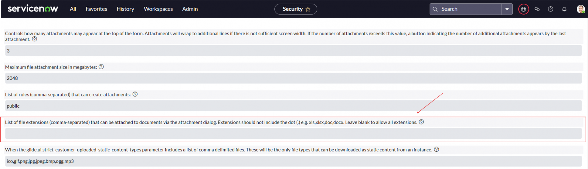
