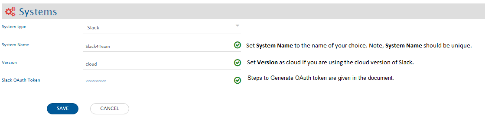
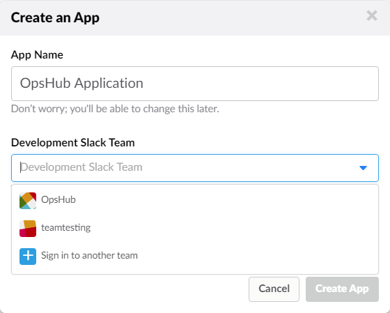
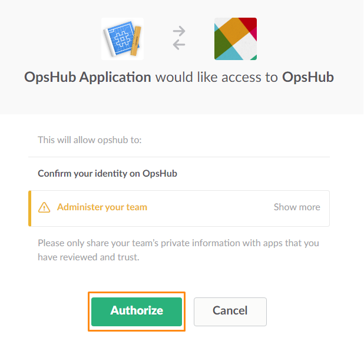
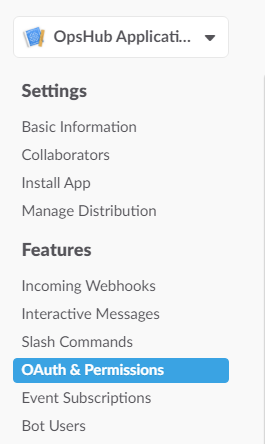
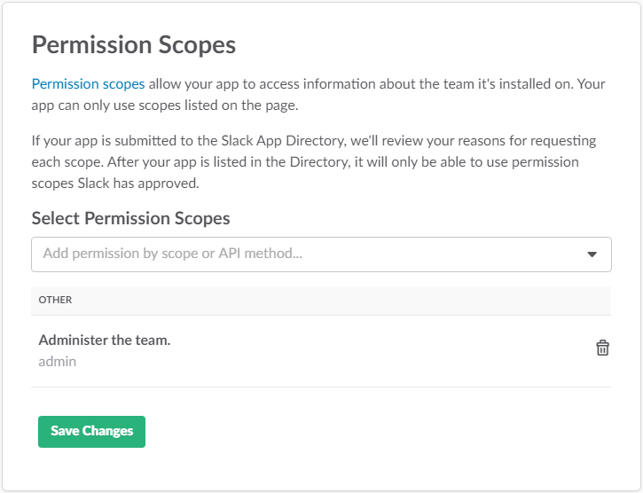

# Prerequisites

## Slack Token

OpsHub Integration Manager Integration Configuration requires access to Slack API through OAuth token.  
Refer [Generating Slack OAuth token](#generating-slack-oauth-token) in appendix for the steps to generate OAuth token.

## Permission Scopes

The permissions scopes required for OpsHub Integration Manager are:

* channels:read  
* groups:read  
* channels:history  
* search:read  
* files:write:user  
* chat:write:user  
* files:read  

Refer [Editing Permission and Scope](#editing-permission-and-scope) in appendix for the steps to edit permission scopes.

# System Configuration

Before you continue to the integration, you must first configure Slack.  
Click [System Configuration](../integrate/system-configuration.md) to learn the step-by-step process to configure a system.  

Refer the screenshot given below for reference. 

  

If the system is deployed on HTTPS and a self-signed certificate is used, then you will have to import the SSL Certificate to be able to access the system from OpsHub Integration Manager. Click [Import SSL Certificates](../getting-started/ssl-certificate-configuration.md) to learn how to import SSL certificate.

# Mapping Configuration

In this step, map the fields between Slack and the other system to be integrated to ensure that the data between both the systems synchronizes correctly.  
Click [Mapping Configuration](../integrate/mapping-configuration.md) to learn the step-by-step process to configure mapping between the systems.

# Integration Configuration

In this step, set a time to synchronize data between Slack and the other system to be integrated. Also, define parameters and conditions, if any, for integration.  

>**Note**:  Set the Slack Channel to which the Post, Comments and Attachments should get synchronized.  
>**Note**:  Set Slack Entity to Post.

Click [Integration Configuration](../integrate/integration-configuration.md) to learn the step-by-step process to configure integration between two systems.

## Advance Settings

### Finding the target entity id when Slack is the source system

Regex of Target Entity Id will contain the regular expression needed to find the Target Entity Id from the simple comments, comments from the posts and initial comments from attachments (initial comments are comments added while adding the attachment).  

For finding the target entity id, Regex of Target Entity Id of Default Integration Parameters will be used. Identifier is a part of Regex of Target Entity Id that needs to be removed for getting the Target Entity Id to match with the target system's entity.  

For example: The Target Entity Id to which the comment is to be added is OP-422. In Slack, a comment is added with target entity id: 'Add this comment to ##OP-422##'.  
Here ## is used in the start and end of the target entity id to identify the target entity id from the entire string. This is the identifier for the target entity id. For extracting the target entity id, Regex of Target Entity Id is `\#\#(OP)(\-){1}\d+\#`. Now, as the Regex provides with '##OP-422##' part of the comment, remove the Identifier part of the Target Entity Id. So, for this identifier is '##', which gets removed from the string matched to give the target entity id as: OP-422.  

>**Note**:  Identifier is a string/simple text and not defined as Regular expression.  
>**Note**:  Default behavior: If Regex can directly match the Target Entity Id, there is no need for an Identifier, and there is no need to remove any part of the string matched for target entity id.  

For example: The target entity id to which the comment has to be added is OP-422. In Slack, a comment is added with target entity id: 'Add this comment to OP-422'. For extracting the target entity id, Regex of Target Entity Id is `(OP)(\-){1}\d+`. Now Regex will directly provide the target entity id as: OP-422. Here, you can directly get the target entity id through the Regex of Target Entity Id. So, there is no need for an Identifier.

### Destination Advance Setting for setting Target Entity Lookup

Set Target Search Query as `<key of target system> =@TargetEntityID@` (Without quotes). The Lookup field for Slack is 'Target Entity Id'.

# Known Limitations

* **Slack as a source system:**
  * Out of order synchronization: When Slack is the source system and there are events in the order E1, E2, and E3 to be synchronized in the target, and E2 fails - then other events will not necessarily be written to the target system in order in which they are received. This means E1 and E3 will be synchronized in the target even though there is a failure for E2.
  * Target Entity Lookup configuration is required for synchronization when Slack is the source system. Reference to this configuration is given in Destination Advance configuration for setting Target Entity Lookup.
  * In an integration in which Slack is the source system, in Advance Configuration → Source Configuration(Tab) → Other configuration, the features through some configurations are not supported. The configuration that are not supported are: Criteria based polling, Skip absent field, Sync Configuration Field Name, and Action on entity deleted in the target.
  * In fields, mapping configuration and integration configuration, 'Post' should be selected as source entity type.
  * Post cannot be polled when Slack is a source system, even though we select Post as an entity.

* **Limitations of Slack as a source system or a target system:**
  * Remote entity link and Remote entity Id configuration features are not possible for Slack as a source or Slack as a target system. (For Slack as target system, it can be configured as a part of Advance Mapping)
  * Slack to Slack integration is not possible.

# Appendix

## Generating Slack OAuth token

* For generating Slack token for the OpsHub Application perform the following steps:
* Login to your team domain by a dedicated integration user. (This integrated user will be a user that is dedicated for OpsHub Integration Manager).
* Now go to: https://api.slack.com/apps/newlink from the same browser you have logged in with the admin user. Click 'Create New App' will show the dialog box as described in the image below.
* Give any application name and then, select the team for which the integration will be made. Now, click 'Create App'.  

>**Note**:  This user should be part of the Channel for which the integration is to be created.

  

* Now from side-bar, select 'OAuth & Permissions' under 'Features'. Under 'OAuth & Permissions', go to: Permission Scopes and provide the required privileges to the application.
* The permission scopes required by OpsHub application are defined in [Permission Scopes](#permission-scopes).
* Save the changes.  

  

* Inside OAuth & Permissions → OAuth Tokens & Redirect URLs select  **Install App to Team**.  

  

* It will ask you to provide the access to OpsHub Application. Click Authorize.  

  

* The token gets generated under: Features → OAuth & Permission → Tokens for your Team. See the figure.  

  

## Editing Permission and Scope

Steps to edit permission and scopes: Login to your team domain by a dedicated integration user. This integrated user will be a user that is dedicated for OpsHub Integration Manager.  

>**Note**:  This user should be part of the Channel for which the integration is to be created.

* Now go to: https://api.slack.com/apps link from the same browser you have logged in with the integration user.
* From 'Your Apps', select the application for which you want to change the permission and scope.
* From side-bar, select 'OAuth and Permissions' under 'Features'.  

  

* Under 'OAuth and Permissions', go to: Permissions Scope and provide permissions scope. The required permissions for integration are defined in [Permission Scopes](#permission-scopes).
* Now, save the changes.  

  

* Now in Features → OAuth & Permissions → OAuth Tokens & Redirect URLs → Tokens for Your Team Click **Reinstall App**.

