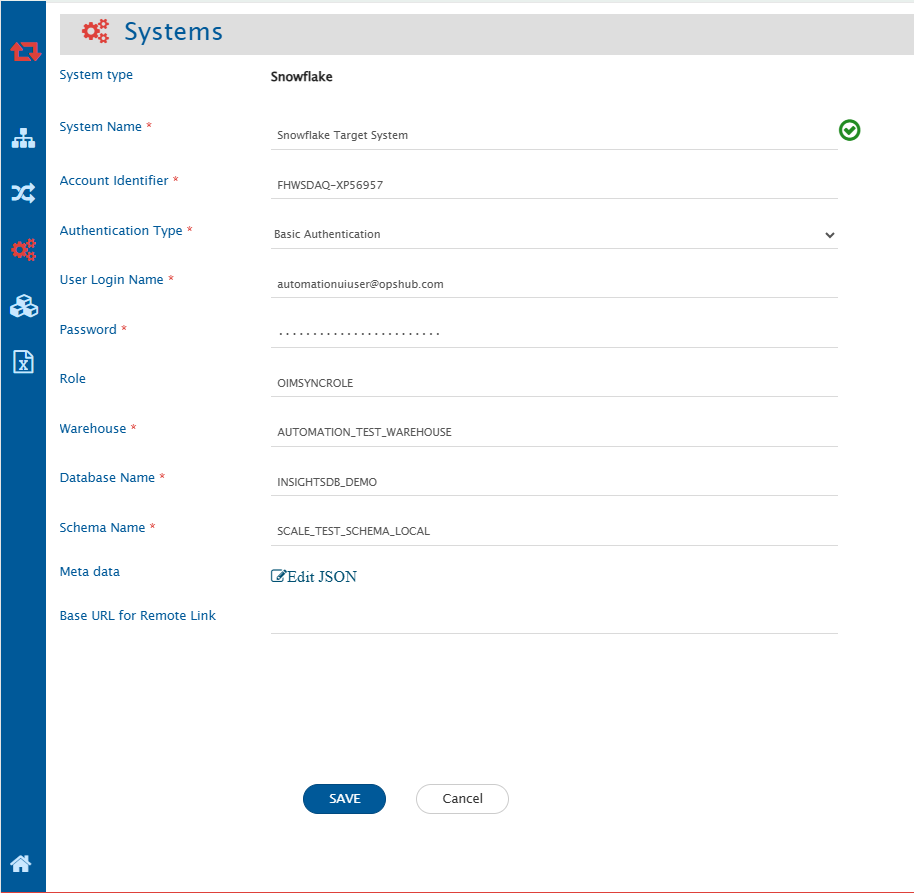
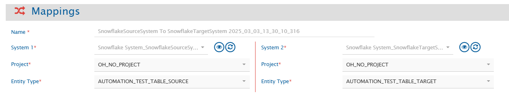
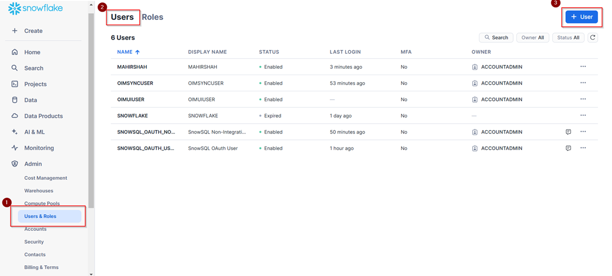
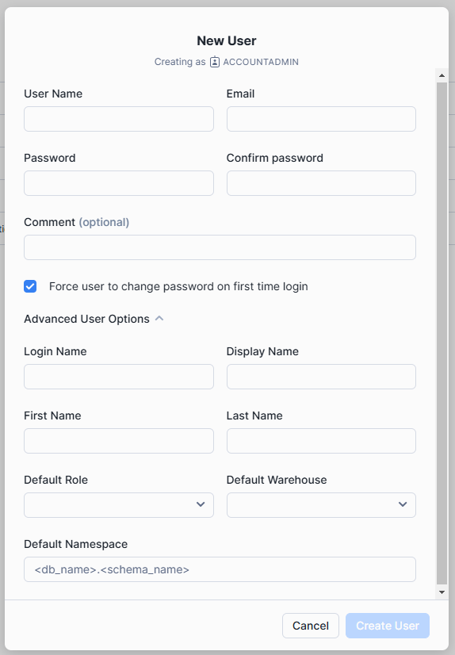
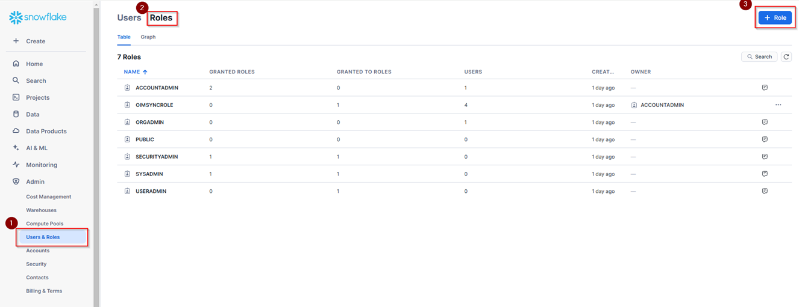
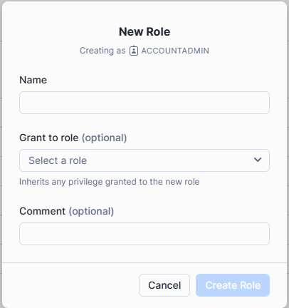

# Prerequisites
## User Privileges

* A **dedicated user** should be created for the Snowflake integration. This user should be assigned a role with **SELECT**, **INSERT**, **UPDATE**, **DELETE**, and **TRUNCATE** privileges on the relevant database tables, and **SELECT** privilege on the necessary views.
* **Privileges** should be assigned to a **role** rather than directly to the user and the role should be granted to the integration user. Snowflake uses a role-based access control (RBAC) model for better security and management.
* This dedicated user must not be used for any other operations on the Snowflake database.

## Fields Requirements

The following columns should exist in the Snowflake's tables and views for OpsHub Integration Manager to ensure seamless data synchronization.

| **Column Name**      | **Column Type**                 | **Description**                                           |
| -------------------- | ------------------------------- | --------------------------------------------------------- |
| **Primary-key**    | Numeric or Text                 | There must be an ID field to uniquely identify the record |
| **CREATED_TIME**    | TIMESTAMP_TZ or TIMESTAMP_LTZ | To store the creation time of the record                  |
| **UPDATED_TIME**    | TIMESTAMP_TZ or TIMESTAMP_LTZ | To store the updated time of the record                   |
| **CREATED_BY**      | TEXT                            | To store the username of the user who created the record  |
| **UPDATED_BY**      | TEXT                            | To store the username of the user who updated the record  |
| **OH_LAST_UPDATE** | TEXT                            | To store the required information for recovery            |

( *) For Primary-key field, name of the column can be anything with following constraints:

* **For tables**: Primary Key constraint should have been defined on the column.
* **For views**: There should be a column having unique and not null values.

# System Configuration

* Before you start the integration configuration, you must first configure Snowflake system.
* Click [System Configuration](../integrate/system-configuration.md) to learn the step-by-step process to configure a system.
  Here is the screenshot:
  
<p align="center">
  
</p>

## Snowflake System Form Details

| **Field Name**             | **Description**                                                                                                                                                                                                                                                                  |
|----------------------------|----------------------------------------------------------------------------------------------------------------------------------------------------------------------------------------------------------------------------------------------------------------------------------|
| **System Name**            | Provide the system's name                                                                                                                                                                                                                                                       |
| **Account Identifier**     | Provide the Account Identifier of the Snowflake account. It should be in the form of <orgname>-<account_name>. For more details, refer to [Snowflake Account Identifier](https://docs.snowflake.com/en/user-guide/admin-account-identifier).                                   |
| **Authentication Type**    | Select the Authentication type to connect with Snowflake instance. Supported authentication types: <br> 1. Basic Authentication: Using username and password of the user. <br> 2. Key Pair Authentication: Using key pair (private key and public key) authentication. Refer to [Snowflake Key Pair Authentication](https://docs.snowflake.com/en/user-guide/key-pair-auth). <br> 3. OAuth 2.0 Authentication: Using external OAuth client credentials. To set up the OAuth with external applications, refer to [Snowflake External OAuth](https://docs.snowflake.com/en/user-guide/oauth-ext-overview). <br> 4. Native SSO - (using Okta only): Using Okta credentials after setting up the SAML authentication in Snowflake. To set up the native SSO, refer to [Snowflake native SSO](https://docs.snowflake.com/en/user-guide/admin-security-fed-auth-configure-idp). |
| **User Login Name**        | For Basic Authentication: Provide the Snowflake user login name. <br> For Native SSO (Okta): Provide the Okta username.                                                                                                                  |
| **Password**               | Provide the password for the username given in user login name.                                                                                                                                                                           |
| **Okta URL**               | For Native SSO - (using Okta only): Provide Okta URL endpoint for your Okta account, typically in the form of https://<okta_account_name>.okta.com                                                                                         |
| **Private Key File Path**  | For Key Pair Authentication: Provide the file path of private key generated corresponding to public key assigned to Snowflake User                                                                                                       |
| **Encrypted Key Password** | For Key Pair Authentication along with encrypted keys: Provide the encryption password for the private key                                                                                                                               |
| **Client Id**              | For OAuth Authentication: Provide the Identifier of the client requesting the token                                                                                                                                                       |
| **Client Secret**          | For OAuth Authentication: Provide the secret of the client requesting the token                                                                                                                                                          |
| **OAuth Token Endpoint**   | For OAuth Authentication: Provide the authorization server token endpoint                                                                                                                                                                |
| **Role**                   | Name of the role of user need to be used. If no role is specified, the default role will be used                                                                                                                                          |
| **Warehouse**              | Name of the virtual warehouse to be used for performing all required computations                                                                                                                                                         |
| **Database Name**          | Name of the database to connect with                                                                                                                                                                                                      |
| **Schema Name**            | Default schema of the database to connect with                                                                                                                                                                                            |
| **Metadata**               | Provide the table name and column which is used to sync links, comments, or attachments. Refer to the [Understanding Metadata JSON Input](#understanding-metadata-json-input) section for details on format and JSON structure.           |

   
### Understanding Metadata JSON Input

* You can provide metadata for complex data types, such as links, comments, and attachments associated with a record, in JSON format here.
* If a view is used as the source endpoint for integration, an ID field name must be provided. The view should have at least one column with unique records that can be considered as the ID field. Provide a list in the format `"view_name": "id_field_name"` for all views used in the integration.

An example input for the metadata JSON:
```json
{
  views: {
    "ohrv_an_workitem_wise_dcc": "ID",
    "ohrv_an_wi_dcc_impactdcc": "primary_id"
    },
```


}

>**Note**:  All the names of table or field mentioned here will be treated as case-sensitive and should match the actual names in Snowflake instance.

# Mapping Configuration

* Map the fields between Snowflake and the other system to be integrated to ensure that data between both the systems synchronize correctly.
* Refer to [Mapping Configuration](../integrate/mapping-configuration.md) page to learn the step-by-step process to configure mapping between the systems.

Here is the screenshot:

<p align="center">
  
</p>


>**Note**:  Field having foreign key constraint will be shown as Reference type of field. It should contain valid ID value of the table it refers to. 
>**Note**:  Workflow Transition is not applicable for Snowflake connector.

# Integration Configuration

* In this step, set a time to synchronize data between Snowflake and the other system to be integrated. Also, define parameters and conditions, if any, for integration.
* Refer to [Integration Configuration](../integrate/integration-configuration.md) page to learn the step-by-step process to configure integration between two systems.

Here is the screenshot:

<p align="center">
  
</p>


## Criteria Configuration

* If the user wants to specify conditions for synchronizing an entity from Snowflake as source system to the other system, the criteria must be configured. Refer to [Criteria Configuration](../integrate/integration-configuration.md#criteria-configuration) section on [Integration Configuration](../integrate/integration-configuration.md) page for more details on how to configure the criteria.
* Set the query as per Snowflake supported SQL query format. Criteria is applicable to any column in table. Only the where clause part of the SQL query is supported.

**Criteria query samples**

| **Field Name**              | **Criteria query use case**                                                                         | **Snippet**                                      |
| --------------------------- | --------------------------------------------------------------------------------------------------- | ------------------------------------------------ |
| ORDER_VALUE                | Need to fetch only those records having ORDER_VALUE higher than 5000                               | ORDER_VALUE > 5000                              |
| ORDER_STATUS               | Need to fetch only those records having ORDER_STATUS as 'Active'                                   | ORDER_STATUS = 'Active'                         |
| ORDER_DATE                 | Need to fetch only those records for which ORDER_DATE is after the given date                      | ORDER_DATE >= '2024-08-15 12:00:00'             |
| ORDER_VALUE, ORDER_STATUS | Need to fetch only those records having ORDER_STATUS as 'Active' and ORDER_VALUE higher than 5000 | ORDER_VALUE > 5000 and ORDER_STATUS = 'Active' |

>**Note**:  The name of the field mentioned in criteria query should be same as the actual name of the field in table. **If field name contains lower case characters, wrap the field name within "", such as "order_value" > 5000**

## Target LookUp Configuration

* Provide query in Target Search Query field such that it is possible to search the entity in the Snowflake as the target system. In the target search query field, the user can provide a placeholder for the source system's field value between the '@'.
* Go to [Search in Target Before Sync](../integrate/integration-configuration.md#search-in-target-before-sync) section on [Integration Configuration](../integrate/integration-configuration.md) page for details on how to configure Target LookUp.
* Overall, the Target LookUp Query is similar to  [Criteria Configuration] (#Criteria Configuration), except that the value part contains a field name between '@' instead of static value.
* Following is the sample snippet of how the database queries can be used as target entity lookup query in OpsHub Integration Manager:
**Target LookUp query sample**

| **Field Name** | **Target lookup use case**                                                     | **Snippet**                        |
| -------------- | ------------------------------------------------------------------------------ | ---------------------------------- |
| ORDER_ID      | Target lookup on the entity having the source entity's id in 'ORDER_ID' field | ORDER_ID = '@source_entity_id@' |

>**Note**:  The name of the field mentioned in target lookup query should be same as actual name of the field in table. **If field name contains lower case characters, wrap the field name within ", such as "order_id" = '@source_entity_id@'**

# Known Behavior and Limitations

* The "id" field can be mapped to any other field in another system. However, when Snowflake is the target system, mapping the "id" field of a database table to a field may generate duplicate values. As a result, it causes an error since duplicate values are not expected in ID column.
* When Snowflake is the source system, it will fetch the records from table based on id and the UPDATED_TIME field. A record will be fetched from the table only if its UPDATED_TIME value meets one of the these conditions:
  * It is greater than or equal to the time of the last processed record.
  * It is greater than or equal to the time specified in the "Start Polling Time" field on the advance integration configuration.
* If a table's CREATED_BY or UPDATED_BY field value matches the username in the Snowflake system form, the corresponding records will be skipped during polling.
* For any data record of a table more than one attachment with same file name is not supported. If two attachments with same file name for same record is found, the second attachment will override the first attachment file in local system.
*   Ensure that you enter valid user credentials in the Snowflake system form in OpsHub Integration Manager. If incorrect credentials are used, Snowflake may temporarily lock the OpsHub dedicated user account. When this happens, OpsHub Integration Manager will be unable to perform any operations using that user. 
    If the user gets locked, you can either wait until Snowflake automatically unlocks the account or ask the account admin to remove the lock immediately by running the following command:

    ```sql
    ALTER USER <username> SET MINS_TO_UNLOCK= 0;
    ```
* For Attachment sync, attachment file names must not contain characters that are unsupported by the operating system on which the  {{SITENAME }} is installed. For example, on Windows, characters such as   / :  * ? " < > | are not allowed in file names.

# Appendix

## Add User

1. Log in to Snowflake instance using the admin user with privileges to create a new user and role.
2. Navigate to **Users and Roles** in admin section and select **Users**.
3. Click **+ User** button to create a new user.
   
  <p align="center">
     
  </p>

4. Enter the user details. The value provided in Login Name will be used later for login using that user. Default Role can also be set. If the **Force user to change password on first login** checkbox is selected, the user must change their password on first login.
   
   <p align="center">
     
   </p>

5. Save changes.

## Add Role

1. Navigate to **Users and Roles** in admin section and select **Roles**.
2. Click **+ Role** button to create a new role.

   <p align="center">
      
   </p>

4. Enter the **New Role** details. 

   <p align="center">
     
   </p>

5. Save changes.

## Grant Role and Grant Privileges on Role

* An existing role can be granted to a user using the following command:

```sql
GRANT ROLE <ROLE_NAME> TO USER <USER>;
```

* To grant the required privileges on Snowflake's entities to a specific role, use the following command:

```sql
GRANT <PRIVILEGES> ON DATABASE <DATABASE_NAME> TO <ROLE_NAME>;
GRANT <PRIVILEGES> ON SCHEMA <SCHEMA_NAME> TO <ROLE_NAME>;
GRANT <PRIVILEGES> ON TABLE <TABLE_NAME> TO <ROLE_NAME>;
GRANT <PRIVILEGES> ON VIEW <VIEW_NAME> TO <ROLE_NAME>;
```
