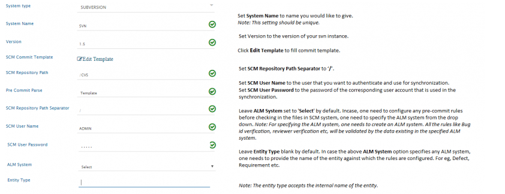
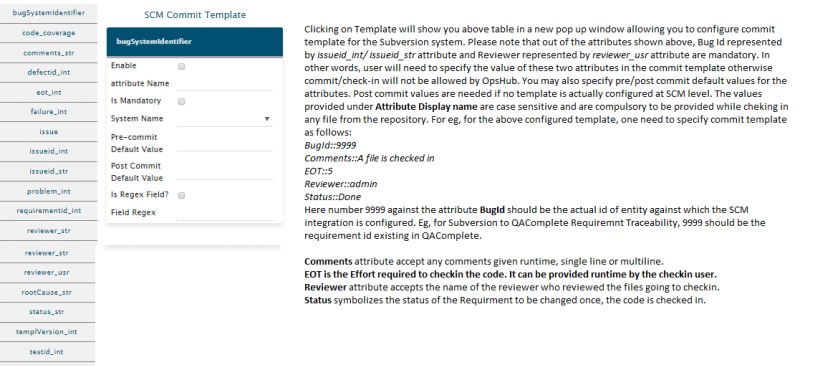
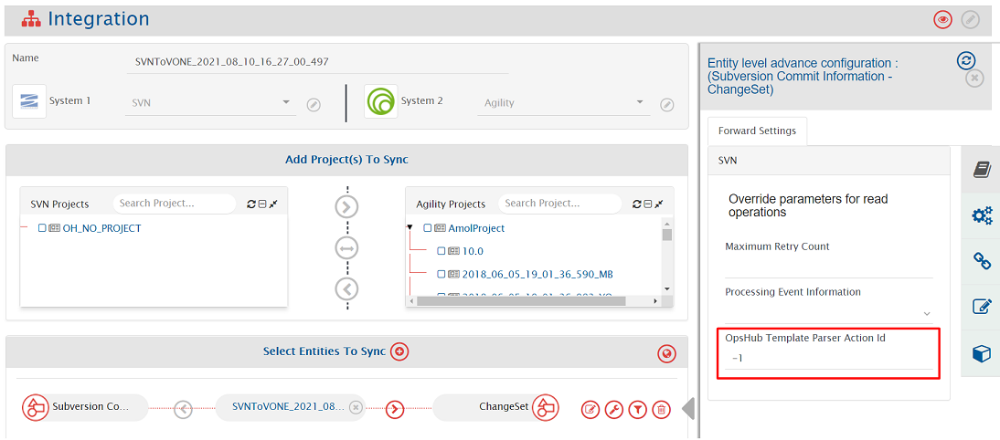
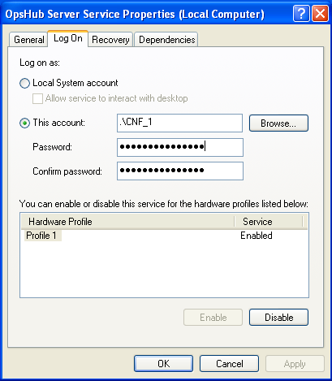

# Prerequisites

## User Privileges

For integration, OpsHub Integration Manager requires user that is authorized to connect to Subversion server URL and can read check-in information.

## Subversion Client

Subversion client must be installed on the machine on which server is running.  
>**Note**:  For installing Subversion client, refer the steps given in [Installing Subversion Client](#installing-subversion-client) under Appendix.  
For basic Python installation, refer [Python Configuration](#configuration-python-260) under Appendix.

# System Configuration

Before you continue to the integration, you must first configure Subversion onto OpsHub Integration Manager.  
Click [System Configuration](../integrate/system-configuration.md) to learn the step-by-step process to configure a system.  
Refer the screenshot given below.

<p align="center">
  
</p>


If the system is deployed on HTTPS and a self-signed certificate is used, then you will have to import the SSL Certificate to be able to access the system from OpsHub Integration Manager. Click [Import SSL Certificates](../getting-started/ssl-certificate-configuration.md) to learn how to import SSL certificate.

Clicking the Template will bring up the table shown above in a new pop-up window. It will allow you to configure commit template for the Subversion system. Please note that out of all the attributes shown above, Bug Id represented by issueid_int/ issueid_str attribute and Reviewer represented by reviewer_usr attribute are mandatory. In other words, user will need to specify the value of these two attributes in the commit template otherwise commit/check-in will not be allowed. You may also specify pre/post commit default values for the attributes. Post commit values are needed when no template is configured at the SCM level. The values provided under Attribute Display name are case sensitive and are compulsory to be provided while checking-in any file from the repository. For example, for the above configured template, you need to specify the commit template as follows:

* BugId::9999
* Comments::A file is checked in
* EOT::5
* *Reviewer::admin*
* *Status::Done*

<p align="center">
  
</p>


Here number 9999 against the attribute BugId should be the actual id of the entity against which SCM integration is configured. For example, for Subversion to QAComplete Requirement Traceability, 9999 should be the requirement id existing in QAComplete.  

* Comments attribute accept any comments given runtime, single line or multiline.  
* EOT is the Effort required to check-in the code. It can be provided runtime by the check-in user.  
* Reviewer attribute accepts the name of the reviewer who reviewed the files going to be checked-in.  
* Status symbolizes the status of the Requirement to be changed once, the code is checked in.

# Mapping Configuration

Map the fields between Subversion and the other system to be integrated to ensure that the data between both the systems synchronizes correctly. Note that, the workflow for the mapping here will be SCM to ALM.  
Click [Mapping Configuration](../integrate/mapping-configuration.md) to learn the step-by-step process to configure mapping between the systems.

# Integration Configuration

Set a time to synchronize data between Subversion and the other system to be integrated. Also, define parameters and conditions, if any, for integration.  
Click [Integration Configuration](../integrate/integration-configuration.md) to learn the step-by-step process to configure integration between two systems.

## Advanced Integration Configuration

In the Advanced Integration Configuration section, there is a field **OpsHub Template Parser Action Id** when Subversion is the source system.  
The value of this field should be changed to parse the commit message of the Commit Info entity that is being synchronized.  
If Regex is configured on commit message to synchronize commit on mentioned IssueId in the target. Refer to the below information on how the value of **OpsHub Template Parser Action Id** determines the commits getting synchronized to the target system:

* If the value of **OpsHub Template Parser Action Id** is:
  * **-1**, it means all the commit messages will be parsed as Regex, i.e., all the commits will be synchronized to the mentioned backlog in commit message.
  * **any number**, it means all the commit messages having commit id <= value will be parsed as Regex, i.e., only these commits will be synchronized to the mentioned backlog in commit message. Other commits will be parsed as per the template defined in the system configuration form. If the commit message is not as per the template format, then the commit will be synchronized to default backlog mentioned in the mapping.
  * **0**, it means no commit messages will be parsed as Regex, i.e., all the commits will be synchronized to default backlog mentioned in mapping.

<p align="center">
  
</p>


# Appendix

## Installing Subversion Client

If Subversion client is not installed on the machine, then please follow the steps given below for installing Subversion Client of version 1.5 or above:

* Please go to link: http://www.sliksvn.com/en/download
* Download the latest version of Subversion from there and install the software by double clicking on the application.
* This will automatically set the PATH for Subversion into the system PATH variable.
* For checking whether Subversion client is properly installed, and its path is set into system PATH variable, fire command `svn` on command prompt.
* If it is recognized as a command, then it is installed properly and is working.

## Find Version

Following are the steps to know the version of your Subversion instance.

* Open command prompt and fire command `svn version`.
  >**Note**:  For Linux, fire the command on terminal.
* This will display the version of the Subversion server installed on your machine.

## Subversion Hook Configuration

* Navigate to `<OpsHub_Installation_Directory>\Other_Resources\Hooks` directory.
* Extract `Hooks_SVN.zip` from above directory to some directory.

(Scripts directory is referred as `PATH_TO_OpsHub_Script_folder` later in this document). The hooks for SVN have to be configured/extracted inside the Subversion repository hooks directory.

For example:

* Login to the SVN server.
* Navigate to the folder where the SVN repository is located i.e. `/svn/svn_sample_repository/hooks`.
* The contents of the extracted hooks of SVN in step number 2 have to be copied in the hooks folder of SVN repository mentioned in step b.
* Copy the file `property.txt.sample` as `property.txt`.
* Open `property.txt` file and edit the value of the properties. The default value should work most of the times.

But it is recommended to reset these one by one:

* `url`:= WSDL url of OpsHubwebservice. Edit localhost by OpsHub Integration Manager server name/server ip.
* `url`:= http://<OpsHubHost>:<opshubport>/OpsHubWS/services/CommitVerify?wsdl
* `logfile`:= Place to write the logfile. Make sure the SVN user has right permission.
* `loglabel`:= Different values of log, leave the default.
* `CompanyId`:=1 Company id, leave the default 1.
* `Debug`:=Debug level, leave the default `remote`.
* `username`:= Webservice user name, leave the default value `admin`
* `password`:= Password for above.
* `commitOnConnectionFailure`:= True, if it makes SCM working even in the absence of OpsHub Integration Manager server, otherwise False.
* `repositoryId`:= Display Name of the system given during System Configuration.

## Creating the Hook

### Unix System

```sh
su - svn
```
* Execute commands as user svn
```sh
cd PATH_TO_REPOS/hooks
```

* Change to the hooks directory, where PATH_TO_REPOS is the repository directory
```sh
cp pre-commit.tmpl pre-commit
```

* Create a pre-commit script
```sh
emacs pre-commit
```

* For edit purpose
```sh
chmod u+x pre-commit
```

* It needs to be executable, so give executable permission

### Windows System

* Go to SVN Repository.  
* From Repository, go to the folder hooks and make a copy of file pre-commit.tmpl.  
* Change the name and extension of this pre-commit.tmpl to pre-commit.bat.

## Configuring and Installing the hook

### Unix System

* Edit `pre-commit` and add the following script:
```sh
#!/bin/sh
REPOS="$1"
TXN="$2"
exec 1>&2
python PATH_TO_OpsHub_Script_folder/precommit.py "$REPOS" "$TXN" || exit 1
```

### Windows System

* Open the file `pre-commit.bat` for editing.
* Add the following lines of code to the top of the file:

```bat
python PATH_TO_OpsHub_Script_folder\precommit.py %1 %2
if errorlevel 1 goto :ERROR
exit 0
:ERROR
echo Error found in commit 1>&2
exit 1
```
* With the above scripts, the hook is ready to act.  
>**Note**:  In PATH_TO_OpsHub_Script_folder, mention the full path till script folder.

## Steps to import Certificate of Subversion

* Run the following command: `svn info https://<your.repository.url>` in command prompt.
* Provide the SVN password.
* You will get the option to accept the certificate permanently. Accept it permanently.
* If your Operating System is Windows, then please follow the steps given below:
  * Go to start -> run.
  * Write `services.msc` and click OK.
  * Go to server service.
  * Stop service if it's already started.
  * Right click and select properties and then, select the **Log On** tab.
  * Select **'This account'** check box for Log on as and provide the username and password of the user for which the certificate was imported.
  * Restart server.



## Configuration python 2.6.0

Download, install, and configure of Python 2.6.0 along with SOAPpy, fpconst and pyXml.

### Download Links

* Python 2.6.6  
  http://www.python.org/download/releases/2.6.6/
* PyXML-0.8.4  
  ftp://mirror.rit.edu/gentoo/distfiles/PyXML-0.8.4.tar.gz
* SOAPPy 0.12.0  
  http://sourceforge.net/projects/pywebsvcs/files/SOAP.py/0.12.0_rc1/
* fpconst-0.7.2  
  http://pypi.python.org/pypi/fpconst

### Installation Instruction

*Install Python 2.6.2*

1. Set the environment variable for class path:  
   Example: `classpath="c:\python26"`

2. **Install fpconst**
   1. Extract the zip file `fpconst-0.7.2.tar.gz`.
   2. Open command prompt and go to the folder till where fpconst is extracted.
   3. `cd fpconst-0.7.2`
   4. Execute command: `python setup.py install`

3. **Install PyXML**
   1. Extract the zip file `PyXML-0.8.4.tar.gz`
   2. Open command prompt and go to the folder until where PyXML is extracted.
   3. `cd PyXML-0.8.4`

4. **Install SOAPpy**
   1. Extract the zip file `SOAPpy-0.12.0.zip`
   2. Open command prompt and go to the folder till where SOAPpy is extracted.
   3. `cd SOAPpy-0.12.0`
   4. Go to the `SOAPpy-0.12.0\SOAPpy` directory.
   5. Edit the `Client.py` file.
      * Find `"from __future__ import nested_scopes"` line.
      * Cut it and paste it in the first line of file.
   6. Edit the `Server.py` file.
      * Find `"from __future__ import nested_scopes"` line.
      * Cut it and paste it in the first line of file.
   7. Edit the `Types.py` file.
      * Find `"from __future__ import nested_scopes"` line.
      * Cut it and paste it in the first line of file.
   8. Execute command: `python setup.py install`

### Verifications

Open python (type: `python` on command line)

1. **Verify PyXml**
   ```python
   >>> import xml
   >>> xml.__version__
   '0.8.4'
   ```
   
2. **Verify fpConstants**
   ```python
   >>> import fpconst
   >>> fpconst.__version__
   ```


