# Prerequisites

## Privileges for User


## Service configuration


## Internet Information Services(IIS) Configurations


# System Configuration

Before you continue to the integration, you must first configure Azure DevOps.

Click [System Configuration](../integrate/system-configuration.md) to learn the step-by-step process to configure a system.

Refer the screenshot given below for reference.

<div align="center">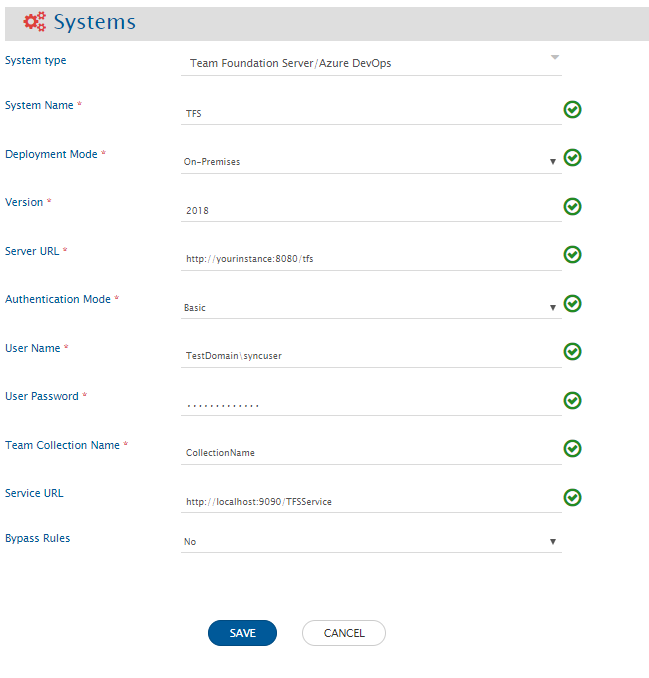</div>

<div align="center">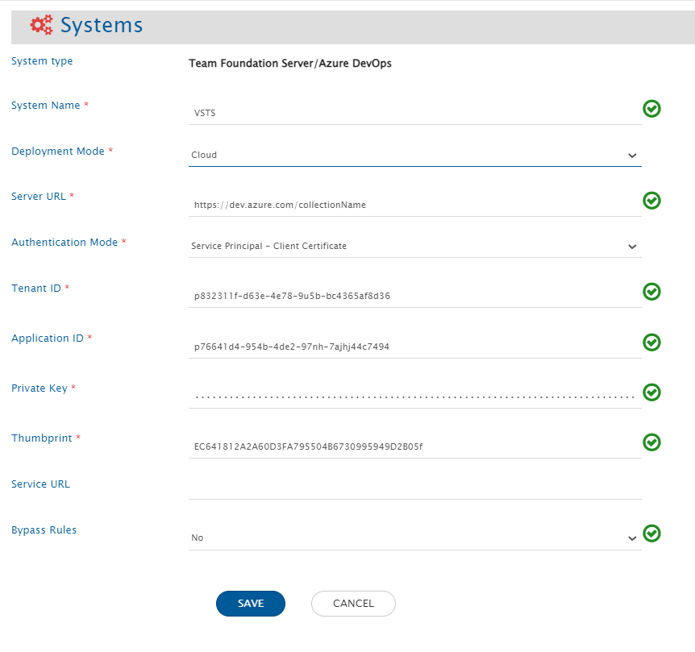</div>

**Azure DevOps System Form Details**

| **Field Name**            | **When field is visible on the System form**                                                                                     | **Description**                                                                                                                                                                                                                                                                                                                                                                                                                                                                                                                                                                                                                                                                                   |
| ------------------------- | -------------------------------------------------------------------------------------------------------------------------------- | ------------------------------------------------------------------------------------------------------------------------------------------------------------------------------------------------------------------------------------------------------------------------------------------------------------------------------------------------------------------------------------------------------------------------------------------------------------------------------------------------------------------------------------------------------------------------------------------------------------------------------------------------------------------------------------------------- |
| **System Name**           | Always                                                                                                                           | Provide Azure DevOps System Name                                                                                                                                                                                                                                                                                                                                                                                                                                                                                                                                                                                                                                                                  |
| **Deployment Mode**       | Always                                                                                                                           | Choose the deployment type of server.                                                                                                                                                                                                                                                                                                                                                                                                                                                                                                                                                                                                                                                             |
| **Version**               | Deployment type is On-Premises                                                                                                   | Put the version for the Team Foundation Server. Refer section [How to find Team Foundation Server's version](team-foundation-server.md#how-to-find-team-foundation-servers-version) to learn how to find version of installed Team Foundation Server.                                                                                                                                                                                                                                                                                                                                                                                                                                             |
| **Server URL**            | Always                                                                                                                           | In case of On-Premises deployment, set the URL to: `http://<host name>:<port no>/tfs`; in case of Visual Studio Team Services (VSTS On-Cloud) instance, set the URL to: `https://<instance name>.visualstudio.com`; and for a new Azure DevOps (On-Cloud) instance, set the URL to: `https://dev.azure.com/<organization name>`.                                                                                                                                                                                                                                                                                                                                                                  |
| **Authentication Mode**   | Always                                                                                                                           | Select the authentication mode you would like to use for communicating with Azure DevOps systems API.                                                                                                                                                                                                                                                                                                                                                                                                                                                                                                                                                                                             |
| **User Name**             | Deployment type is On-Premises                                                                                                   | Enter a primary username with the user domain (if there is any). User must have administrator privileges in Project Administrators user group or Project Collection Administrators user group. Please make sure this user has a unique display name across the instance. Refer to the [Add User in Group](team-foundation-server.md#how-to-add-user-or-service-principal-in-group) section to learn how to add user in user group list.                                                                                                                                                                                                                                                           |
| **User Email**            | Deployment type is On-Cloud                                                                                                      | Enter User Email Address. User must have administrator privileges in Project Administrators user group or Project Collection Administrators user group.                                                                                                                                                                                                                                                                                                                                                                                                                                                                                                                                           |
| **User Password**         | Authentication mode is Basic                                                                                                     | In On-Premises deployed server, enter the primary password.                                                                                                                                                                                                                                                                                                                                                                                                                                                                                                                                                                                                                                       |
| **Personal Access Token** | Authentication mode is Personal Access Token                                                                                     | Enter the Personal Access Token generated for the integration user in the Azure DevOps. Refer [Create Personal Access Token](team-foundation-server.md#create-personal-access-token) section to learn about how to create Personal Access Token.                                                                                                                                                                                                                                                                                                                                                                                                                                                  |
| **Tenant ID**             | Deployment type is On-Cloud & Authentication mode is Service Principal - Client Secret or Service Principal - Client Certificate | Enter the Tenant Id of Azure Active Directory to which organization is connected. This can be found in the Microsoft Entra (Azure Active Directory).                                                                                                                                                                                                                                                                                                                                                                                                                                                                                                                                              |
| **Application ID**        | Deployment type is On-Cloud & Authentication mode is Service Principal - Client Secret or Service Principal - Client Certificate | Enter the Application (client) ID of a dedicated application for API communication with your Azure DevOps instance. This can be found in the Microsoft Entra (Azure Active Directory).                                                                                                                                                                                                                                                                                                                                                                                                                                                                                                            |
| **Secret Value**          | Deployment type is On-Cloud & Authentication mode is Service Principal - Client Secret                                           | Provide the Secret Value generated in Azure Active Directory for the application given in "Application ID" input. This can be found in the Microsoft Entra (Azure Active Directory) while generating secret key.                                                                                                                                                                                                                                                                                                                                                                                                                                                                                  |
| **Private Key**           | Deployment type is On-Cloud & Authentication mode is Service Principal - Client Certificate                                      | Provide the Private Key of a certificate uploaded in Azure Active Directory for the application given in "Application ID" input.                                                                                                                                                                                                                                                                                                                                                                                                                                                                                                                                                                  |
| **Thumbprint**            | Deployment type is On-Cloud & Authentication mode is Service Principal - Client Certificate                                      | Provide the Thumbprint of a certificate uploaded in Azure Active Directory for the application given in "Application ID" input. This can be found in the Microsoft Entra (Azure Active Directory) in "Certificates & secrets" section.                                                                                                                                                                                                                                                                                                                                                                                                                                                            |
| **Team Collection Name**  | Deployment type is On-Premises                                                                                                   | Enter the Collection name. For example, PrimaryCollection.                                                                                                                                                                                                                                                                                                                                                                                                                                                                                                                                                                                                                                        |
| **Service URL**           | Always                                                                                                                           | Provide the Service URL where the Service is installed. For example: `http://<service_host>:<port>/TFSService`. The Service URL is mandatory for all versions of Azure DevOps Server below 2020, regardless of the work item being integrated. For 2020 and above versions of Azure DevOps Server and Azure DevOps Service, the Service URL is mandatory for these work items: Area, Iteration Team, Group, User, Test Run, Test Suite, Test Result, Test Plan, Query, Dashboard, Widget, and Pull Request.                                                                                                                                                                                       |
| **Bypass rules**          | Always                                                                                                                           | Setting Bypass Rules to 'Yes' means disabling the rules while writing the changes to the system. This change will allow users to write invalid value(s) to any field in the system. For over writing, 'Changed By', 'Changed Date', etc. fields, enable the Bypass rules. Refer [Bypass Rule with User Impersonation](team-foundation-server.md#bypass-rule-with-user-impersonation) in the appendix section to learn in detail about User Impersonation and ByPass Rule. **Note** If Bypass Rules is set to 'Yes' in the system configuration, make sure the user or Service Principal has the 'Bypass rules on work item updates permission' set to Allow at the project level in Azure DevOps. |

# Mapping Configuration

Map the fields between Azure DevOps and the other system to be integrated to ensure that the data between both the systems synchronizes correctly.

Click [Mapping Configuration](../integrate/mapping-configuration.md) to learn the step-by-step process to configure mapping between the systems.

<div align="center"></div>

* For **Changed By** and **Changed Date** synchronization please marked _overwrite true_ in the mapping (For source system). Refer [Overwrite](../integrate/mapping-configuration.md#overwrite) section to learn how to marked field overwrite.
*   When Azure DevOps Server or Services is the target system and Iterations and Area Paths are not considered separate entities, the default behavior is to verify and create these entities within the Azure DevOps system if they are mapped as fields in work items or test entities.

    * If the iteration and area path do not already exist in the target system, they will be created without start and end dates unless the checkAndCreate property is either not specified or set to 'true'. If these entities already exist, the new entity will be placed under the designated Area Path or Iteration.
    * If the user wants to disable this "Check and Create" behavior, they can set the checkAndCreate property to false. This will prevent the creation of new iterations or area paths in the ADO system if they do not already exist.
    * In such cases, processing will fail for any work item or test entity that references non-existent area paths or iterations.

    ```xml
    <Area-space-Path checkAndCreate="false">
      <xsl:value-of xmlns:xsl="http://www.w3.org/1999/XSL/Transform" select="SourceXML/updatedFields/Property/Area-space-Path"/>
    </Area-space-Path>
    ```
* For Azure DevOps to Azure DevOps integration, if source and target project names are different, then, for Path field, advance mapping is to be done. The mapping is as follows:


```xml
<xsl:choose xmlns:xsl="http://www.w3.org/1999/XSL/Transform">
  <xsl:when test="SourceXML/updatedFields/Property/Path !='<Source Project Name>'">
    <Path>
      <xsl:value-of select="concat('<Target Project Name>', substring-after(SourceXML/updatedFields/Property/Path ,'\'))"/>
    </Path>
  </xsl:when>
  <xsl:otherwise>
    <Path>
      <xsl:value-of select="'<Target Project Name>'"/>
    </Path>
  </xsl:otherwise>
</xsl:choose>
```

* If you want to create mapping between HP Test and TFS Test case with HP Test Parameters and TFS Parameters, then few changes needs to be done in the Parameter default mapping. Find field mapping between HP **''Test Parameters''** field and TFS **''Parameter''**, then click **''View/Edit XSLT Configuration''** to open advance mapping, and do following changes:
  * In case of HP to TFS mapping, find **`<xsl:value-of select="value"/>`** in default mapping and replace with **`<xsl:value-of select="utils:convertHTMLToPlainText(value)"/>`**.
  * In case of HP to TFS mapping, find **`<xsl:value-of select="parameterName"/>`** in default mapping and replace with **`<xsl:value-of select="utils:replace(parameterName,' ','_')"/>`**. Here in replace method, you can use any character which will be replaced in place of space.
  * In case of Bi-directional configuration from TFS to HP, find **`<xsl:value-of select="parameterName"/>`** in default mapping and replace with **`<xsl:value-of select="utils:replace(parameterName,'_','')"/>`**. Here character provided in second parameter of replace method should be same which is given in previous configuration, during HP to TFS mapping.
* To synchronize **Steps** field [having "Shared Steps"] of Test Case entity to other systems, the advanced mapping needs to be configured in <code class="expression">space.vars.SITENAME</code> to convert Shared Steps to single level steps.
  *Given below is a sample advanced mapping from TFS to Jira to synchronize Steps field [having "Shared Steps"] of Test Case entity to Zephyr Teststep field of Test entity along with formatting:**

```xml
<Zephyr-space-Teststep xmlns:xsl="http://www.w3.org/1999/XSL/Transform">
  <xsl:variable name="testCaseId" select="SourceXML/opshubEntityId"/>
  <xsl:variable name="orderedSteps" select="utils:getSharedStepsInSingleLevel($workflowId,$sourceSystemId,$testCaseId)"/>
  <xsl:for-each xmlns:map="http://java.util.Map" select="$orderedSteps">
    <xsl:variable name="testStep" select="."/>
    <xsl:variable name="position">
      <xsl:value-of select="map:get($testStep,'position')"/>
    </xsl:variable>
    <xsl:variable name="action">
      <xsl:value-of select="map:get($testStep,'action')"/>
    </xsl:variable>
    <xsl:variable name="expectedResult">
      <xsl:value-of select="map:get($testStep,'expectedResult')"/>
    </xsl:variable>
    <xsl:variable name="description">
      <xsl:value-of select="map:get($testStep,'description')"/>
    </xsl:variable>

    <xsl:element name="{concat('_',$position)}">
      <xsl:element name="order">
        <xsl:value-of select="$position"/>
      </xsl:element>
      <xsl:element name="step">
        <xsl:value-of select="utils:convertHTMLToPlainText($action)"/>
      </xsl:element>
      <xsl:element name="expected">
        <xsl:value-of select="utils:convertHTMLToPlainText($expectedResult)"/>
      </xsl:element>
      <xsl:element name="description">
        <xsl:value-of select="utils:convertHTMLToPlainText($description)"/>
      </xsl:element>
    </xsl:element>
  </xsl:for-each>
</Zephyr-space-Teststep>
```

## Test Point Advance Mapping Configuration

* **Test Point** is an association between Test Suite and Test Case with configuration and tester. This association is synchronized by configuring the **Test-Case linkage** with Test Suite integration.

<div align="center">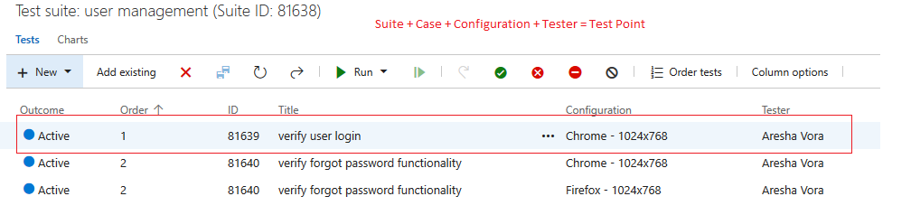</div>

* The **Advance Mapping** required for synchronizing configuration/tester with **Test-Case linkage** is given in the snippet below:

```xml
<OHEntityReferences>
  <xsl:variable xmlns:xsl="http://www.w3.org/1999/XSL/Transform" name="nonDefaultLinks" as="item()*">
    <Item targetLinkType="Test-Case-space-Linkage">Test-Case Linkage</Item>
    <Item targetLinkType="Tested-space-By">Tested By</Item>
    <Item targetLinkType="Test-space-Suite-space-Child">Test Suite Child</Item>
    <Item targetLinkType="Test-space-Case">Test Case</Item>
    <Item targetLinkType="Test-space-Suite-space-Parent">Test Suite Parent</Item>
    <Item targetLinkType="Tests">Tests</Item>
  </xsl:variable>

  <xsl:variable xmlns:xsl="http://www.w3.org/1999/XSL/Transform" name="entityTypeMapping" as="item()*">
    <Item targetEntityType="Test Case">Test Case</Item>
    <Item targetEntityType="Test Suite">Test Suite</Item>
    <Item targetEntityType="Test Result">Test Result</Item>
  </xsl:variable>

  <xsl:variable xmlns:xsl="http://www.w3.org/1999/XSL/Transform" name="defaultLinkWithSourceLinks" as="item()*" />
  <xsl:variable xmlns:xsl="http://www.w3.org/1999/XSL/Transform" name="defaultLinkWithOH_DEFAULT" as="item()*" />

  <xsl:variable xmlns:xsl="http://www.w3.org/1999/XSL/Transform" name="entityReferencecontext" select="/SourceXML/updatedFields/Property/OHEntityReferences/OHEntityReference" />

  <xsl:variable xmlns:xsl="http://www.w3.org/1999/XSL/Transform" name="linksToBeCarriedFromSourceEvent" as="item()*">
    <xsl:for-each select="$nonDefaultLinks">
      <xsl:variable name="currentLinkType" select="." />
      <xsl:if test="$entityReferencecontext/linkType[text()=$currentLinkType]">
        <xsl:if test="$entityReferencecontext/links/EAILinkEntityItem">
          <Item targetLinkType="{@targetLinkType}">
            <xsl:value-of select="." />
          </Item>
        </xsl:if>
      </xsl:if>
    </xsl:for-each>
  </xsl:variable>

  <xsl:variable xmlns:xsl="http://www.w3.org/1999/XSL/Transform" name="linksToBeAddedAsDefault" as="item()*">
    <xsl:for-each select="$defaultLinkWithOH_DEFAULT">
      <Item lookupQuery="{@lookupQuery}" entityType="{@entityType}">
        <xsl:value-of select="." />
      </Item>
    </xsl:for-each>
    <xsl:for-each select="$defaultLinkWithSourceLinks">
      <xsl:variable name="currentLinkType" select="." />
      <xsl:if test="not($linksToBeCarriedFromSourceEvent[text() = $currentLinkType] = $currentLinkType)">
        <Item lookupQuery="{@lookupQuery}" entityType="{@entityType}">
          <xsl:value-of select="./@targetLinkType" />
        </Item>
      </xsl:if>
    </xsl:for-each>
  </xsl:variable>

  <xsl:for-each xmlns:xsl="http://www.w3.org/1999/XSL/Transform" select="$linksToBeCarriedFromSourceEvent">
    <xsl:variable name="currentLinkType" select="." />
    <op_list>
      <xsl:element name="{@targetLinkType}">
        <xsl:for-each select="$entityReferencecontext[linkType=$currentLinkType]/links/EAILinkEntityItem">
          <xsl:element name="{concat('_',position())}">
            <xsl:element name="EntityType">
              <xsl:variable name="sourceEntityType" select="entityType" />
              <xsl:value-of select="$entityTypeMapping[text()=$sourceEntityType]/@targetEntityType" />
            </xsl:element>
            <xsl:element name="GlobalId">
              <xsl:value-of select="linkGlobalId" />
            </xsl:element>
            <xsl:element name="LinkAddedDate">
              <xsl:value-of select="linkAddedDate" />
            </xsl:element>
            <xsl:element name="LinkedID">
              <xsl:value-of select="entityInternalId" />
            </xsl:element>
            <xsl:element name="IsExternalLink">
              <xsl:value-of select="isExternalLink" />
            </xsl:element>
            <xsl:element name="EntityLinkComment">
              <xsl:value-of select="linkComment" />
            </xsl:element>
            <xsl:if test="order!=''">
              <xsl:element name="order">
                <xsl:value-of select="order" />
              </xsl:element>
            </xsl:if>
            <xsl:if test="id!=''">
              <xsl:element name="id">
                <xsl:value-of select="id" />
              </xsl:element>
            </xsl:if>
            <config>
              <xsl:for-each select="linkProps/Property/config/string">
                <fieldvalue>
                  <xsl:value-of select="." />
                </fieldvalue>
              </xsl:for-each>
            </config>
            <testers>
              <xsl:for-each select="linkProps/Property/testers/Property/*">
                <xsl:element name="{name()}">
                  <xsl:for-each select="com.opshub.eai.metadata.UserMeta">
                    <fieldvalue>
                      <xsl:variable name="tgtUserOutput" select="userUtils:getUserNameFromEmail($workflowId, $targetSystemId, SourceXML/updatedFields/Property/testers, 'false', 'false')" />
                      <xsl:choose>
                        <xsl:when test="$tgtUserOutput != ''">
                          <xsl:value-of select="$tgtUserOutput" />
                        </xsl:when>
                        <xsl:otherwise>
                          <xsl:value-of select="userName" />
                        </xsl:otherwise>
                      </xsl:choose>
                    </fieldvalue>
                  </xsl:for-each>
                </xsl:element>
              </xsl:for-each>
            </testers>
          </xsl:element>
        </xsl:for-each>
      </xsl:element>
    </op_list>
  </xsl:for-each>

  <xsl:for-each xmlns:xsl="http://www.w3.org/1999/XSL/Transform" select="$linksToBeAddedAsDefault">
    <op_list>
      <xsl:element name="{.}">
        <xsl:element name="_1">
          <xsl:element name="EntityType">
            <xsl:value-of select="@entityType" />
          </xsl:element>
          <xsl:element name="LookupQuery">
            <xsl:value-of select="@lookupQuery" />
          </xsl:element>
        </xsl:element>
      </xsl:element>
    </op_list>
  </xsl:for-each>
</OHEntityReferences>
```

* To preserve **Test Case order**, the `OH Enable Rank` field must be configured in the Test Suite mapping.

## Lookup Fields Configuration

* In Azure DevOps, if any lookup field contains the value which is same as one of the values of "State" field [case is not same], the lookup field value will not sync to the target. For example, if one of the states is "In Progress" and lookup field value is also "in progress", then the "In Progress" (instead of "in progress") will be present in the mapping of lookup field. Hence, the lookup field value "in progress" will not sync to the target.

> **Note**: For the above mentioned case, if the lookup field of Azure DevOps is mapped to the mandatory field of the target, the processing failure will be generated during the synchronization.

* The images below show that value list of State field and one of the lookup fields. In both the lists, the "In progress" option is common but alphabetical case is different.

<div align="center">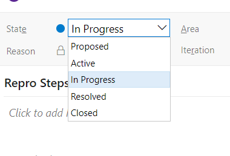</div>

<div align="center">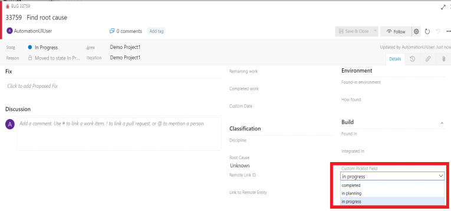</div>

* The images below depicts the sample mapping which will be generated, when the lookup field contains the "in progress" option. The "In Progress" value is visible in the mapping.

<div align="center"></div>

<div align="center"></div>

* Corrective actions to be taken to configure the advanced mapping and replace the current value in the mapping with the actual field value of the lookup field of Azure DevOps. For example, to sync the lookup field value "in progress" to the target, update the advance XSLT as given below:

```xml
<xsl:variable xmlns:xsl="http://www.w3.org/1999/XSL/Transform" name="xPathVariable" select="SourceXML/updatedFields/Property/Lookup_Field_Name"/>
<xsl:choose xmlns:xsl="http://www.w3.org/1999/XSL/Transform">
  <xsl:when test="$xPathVariable='in progress'">
    <xsl:value-of select="'target_field_option'"/>
  </xsl:when>
</xsl:choose>
```

## Relationship Configuration

### Git Commit/Branch Link Configuration

* To synchronize **Git Commit/Branch** links of an entity to other systems, the Commit/Branch links need to be mapped in <code class="expression">space.vars.SITENAME</code> relationship mapping.
* When the **Git Commit/Branch** links are mapped in <code class="expression">space.vars.SITENAME</code>:
  * While synchronizing a workitem, if any GIT artifact's project or repository is not found in the target system, this artifact will get skipped by `<code class="expression">space.vars.SITENAME</code>`.
  * If any GIT artifact is missing in target repository, workitem's artifact link will be synced with the missing object. On syncing delta changes, those links will be re-establised with an artifact object if it is found in target repository.
  * To sync delta changes from source repository to target repository, refer to this link for more details: https://docs.github.com/en/repositories/creating-and-managing-repositories/duplicating-a-repository#mirroring-a-repository.
* For syncing the link **Git Commit/Branch** with a workitem to target [TFS/VSTS] systems, you must import source repository into target repository to bring all the Git commit and branch links into target repository.
* If Commit/Branch link has a different project name or a different repository name:
  * Provide the respective project's name or repository's name using advance XSLT.
  * For example, if source commit is found in project, 'project-xyz' and repository, 'repository-xyz', corresponding in target this commit is found in project, 'project-abc' and repository, 'repository-abc'. Therefore, to sync commit link of an entity, update the advance XSLT from this:

```xml
<xsl:for-each select="linkProps/Property">
 <xsl:for-each select="*">
  <xsl:element name="{name(.)}">
   <xsl:value-of select="."/>
  </xsl:element>
 </xsl:for-each>
</xsl:for-each>
```

to this:

```xml
 <xsl:for-each select="linkProps/Property">
  <xsl:for-each select="*">
   <xsl:element name="{name(.)}">
    <xsl:choose>
     <xsl:when test="name(.)='GitProject'">
      <xsl:if test=".='project-xyz'">
       <xsl:value-of select="'project-abc'"/>
      </xsl:if>
     </xsl:when>
     <xsl:when test="name(.)='GitRepository'">
      <xsl:if test=".='repository-xyz'">
       <xsl:value-of select="'repository-abc'"/>
      </xsl:if>
     </xsl:when>
     <xsl:otherwise>
      <xsl:value-of select="."/>
     </xsl:otherwise>
    </xsl:choose>
   </xsl:element>
  </xsl:for-each>
 </xsl:for-each>
```

## Mapping for Entity mention field

* When Team Foundation Server ALM/Azure Devops service is configured as source system in the integration and its field/comment type is rich text (HTML), then the entity mention synchronization is supported.
* Click on [**Known Behaviors & Limitation**](team-foundation-server.md#known-behaviors-and-limitations) to know about entity mention sync limitation for this system.
* Click on [Rank configuration](../integrate/mapping-configuration.md#configuration) to know more about entity mention mapping and synchronization behavior in general.

## Mapping for Soft Delete Configuration

* When Team Foundation Server is the target system, the Soft delete operation is performed by default in the synchronization of the [Source Delete event](../integrate/source-delete-synchronization.md).
* After the Soft Delete operation is performed by OpsHub Integration Manager in Team Foundation Server, the entity will be deleted in the Team Foundation Server, and it can be found in the "Recycle bin" of the corresponding project, where it existed earlier.
* To only enable the logical delete operation in the target, "OH Soft Delete" field shall be mapped with the default value "No" in the [Delete Mode](../integrate/mapping-configuration.md#delete-mode) mapping.

> **Note**: The above behavior is supported only for Workitems. Additionally it is supported from Team Foundation Server 2017 and above.

## Kanban Board Field Configuration

* To sync the Kanban Board field, advanced mapping is required in <code class="expression">space.vars.SITENAME</code>.
* Below is the sample advanced mapping for syncing Kanban Board field between Azure DevOps to Azure DevOps systems.

```xml
<Kanban-space-Board>
  <xsl:for-each xmlns:xsl="http://www.w3.org/1999/XSL/Transform"  select="SourceXML/updatedFields/Property/Kanban-space-Board/list">
    <op_list>
      <xsl:element name="teamName">
        <xsl:value-of select="Property/teamName"/>
      </xsl:element>
      <xsl:element name="boardRef">
        <xsl:value-of select="Property/boardRef"/>
      </xsl:element>
      <xsl:element name="column">
        <xsl:value-of select="Property/column"/>
      </xsl:element>
      <xsl:element name="columnDone">
        <xsl:value-of select="Property/columnDone"/>
      </xsl:element>
      <xsl:element name="lane">
        <xsl:value-of select="Property/lane"/>
      </xsl:element>
    </op_list>
  </xsl:for-each>
</Kanban-space-Board>
```

## Pipeline Variables Advance Mapping Configuration

* To sync variables of pipeline, advance mapping is required in <code class="expression">space.vars.SITENAME</code>.
* Below is the sample advanced mapping for syncing Variables field:

```xml
<variables>
  <xsl:for-each xmlns:xsl="http://www.w3.org/1999/XSL/Transform" select="SourceXML/updatedFields/Property/variables/Property/*">
    <xsl:element name="{name()}">
      <xsl:for-each select="./Property/*">
        <xsl:element name="{name()}">
          <xsl:value-of select="."/>
        </xsl:element>
      </xsl:for-each>
    </xsl:element>
  </xsl:for-each>
</variables>
```


### Comments Field Advance Mapping Configuration for Pipeline Entity

* By default, the comments field is synchronised, as it is, for each revision in the pipeline entity.
* If there is a need to add actual revision time and user email with each revision comment, the following XSLT can be used:

```xml
<comment xmlns:xsl="http://www.w3.org/1999/XSL/Transform">
  <xsl:variable name="date" select="SourceXML/updatedFields/Property/createdDate"/>
  <xsl:variable name="user" select="SourceXML/updatedFields/Property/authoredBy/userEmail"/>
  <xsl:variable name="info" select="concat('[ Originally changed by ',$user,' on ', $date, ' ]')"/>
  <xsl:variable name="comment" select="SourceXML/updatedFields/Property/comment"/>
  <xsl:value-of  select="concat($comment, ' ',$info)"/>
</comment>
```


## Perform check & create for Variable Groups in Pipeline

* To perform check & create for **Variable Groups** in pipeline, **Variable Group details** field should be mapped.
* Advanced mapping is required for the same in <code class="expression">space.vars.SITENAME</code>. Below is the sample advanced mapping:

```xml
<Variable-space-group-space-details>
  <xsl:for-each xmlns:xsl="http://www.w3.org/1999/XSL/Transform"  select="SourceXML/updatedFields/Property/Variable-space-group-space-details/list">
    <op_list>
      <xsl:element name="variables">
        <xsl:for-each select="Property/variables/Property/*">
          <xsl:element name="{name()}">
            <xsl:for-each select="./Property/*">
              <xsl:element name="{name()}">
                <xsl:value-of select="."/>
              </xsl:element>
            </xsl:for-each>
          </xsl:element>
        </xsl:for-each>
      </xsl:element>
      <xsl:element name="type">
        <xsl:value-of select="Property/type"/>
      </xsl:element>
      <xsl:element name="name">
        <xsl:value-of select="Property/name"/>
      </xsl:element>
      <xsl:element name="description">
        <xsl:value-of select="Property/description"/>
      </xsl:element>
      <xsl:element name="id">
        <xsl:value-of select="Property/id"/>
      </xsl:element>
    </op_list>
  </xsl:for-each>
</Variable-space-group-space-details>
```

* While configuring integration for the same, **Default Integration Workflow Pipeline** should be selected to perform check & create for variable groups. For more details, refer to [Workflow Association](../integrate/integration-configuration.md#workflow-association).

# Integration Configuration

In this step, set a time to synchronize data between Azure DevOps and the other system to be integrated. Also, define parameters and conditions, if any, for integration.
Click [Integration Configuration](../integrate/integration-configuration.md) to learn the step-by-step process to configure integration between two systems.

<div align="center"></div>

## Criteria Configuration

If you want to specify conditions for synchronizing an entity between Azure DevOps and the other system to be integrated, you can use the **Criteria Configuration** feature.

To configure criteria in Azure DevOps, integration needs to be created with Azure DevOps as the source system. Query in Azure DevOps system is a valid Azure DevOps project query that contains a reference column as criteria available in the Azure DevOps system for a project. Values for the criteria fields are same as display value in Azure DevOps system's UI.

**How to get the reference name for Azure DevOps work-item fields**:
To know the reference name of Azure DevOps work-item fields refer section [Find Reference name of field](team-foundation-server.md#find-reference-name-of-field). It will open a window in which you can find the Ref Name for the field for which you want to enter query.

> **Note**: Table Sample Criteria Examples include examples for all work-items except Test Suite (TFS<2013), Build entity and Pull Request for which separate tables have been included below.

### Sample Criteria Examples

| **Field Type**  | **Criteria Description**                                                                | **Criteria Snippet**                                                                 |
| --------------- | --------------------------------------------------------------------------------------- | ------------------------------------------------------------------------------------ |
| Lookup          | Synchronize all entities which have priority value as '1'                               | `[Microsoft.VSTS.Common.Priority] = '1'`                                             |
| Lookup          | Synchronize all entities which have backlog status value 'Active' or 'Done'             | `[Microsoft.VSTS.Common.State] in ('Active', 'Done')`                                |
| Text            | Synchronize all entities which contain 'Bug Title' in title field                       | `[System.Title] = 'Bug Title'`                                                       |
| User            | Synchronize all entities which are created by 'user@domain.com' user                    | `[System.CreatedBy] = 'user@domain.com'`                                             |
| Lookup and User | Synchronize all entities which are created by 'user@domain.com' user and primary as '1' | `[System.AssignedTo] = 'user@domain.com' and [Microsoft.VSTS.Common.Priority] = '1'` |

### Sample Criteria Examples for 'Test Suite' entity (Team Foundation Server version < 2013)

| **Field Type** | **Criteria Description**                                               | **Criteria Snippet**                      |
| -------------- | ---------------------------------------------------------------------- | ----------------------------------------- |
| User           | Synchronize all entities which are updated by 'TestUser'               | `LastUpdatedBy='TestUser'`                |
| Text           | Synchronize all entities whose title contains 'Demo'                   | `Title contains 'Demo'`                   |
| Text           | Synchronize all entities whose status is 'In Progress'                 | `Status = 'In Progress'`                  |
| Date           | Synchronize all entities which are updated before 01 Jan 2020          | `LastUpdated < '2020-01-01 00:00:00.000'` |
| Text           | Synchronize entity whose id is 10                                      | `SuiteId = '10'`                          |
| Text           | Synchronize all entities whose description contains 'Test Description' | `Description Contains 'Test Description'` |

> **Note**: Please refer to table **Sample Criteria Examples** for Team Foundation Server version >= 2013 or Azure DevOps

### Sample Criteria Examples for 'Build' entity

| **Field Type**       | **Criteria Description**                                             | **Criteria Snippet**                            |
| -------------------- | -------------------------------------------------------------------- | ----------------------------------------------- |
| Lookup               | Synchronize builds data including the deleted builds                 | `deletedFilter=includeDeleted`                  |
| Lookup               | Synchronize builds data with the specific result                     | `resultFilter=failed`                           |
| Multiple lookup      | Synchronize builds where result is succeeded and status is completed | `resultFilter=succeeded&statusFilter=completed` |
| Text multivalue list | Only synchronize builds with id 38 and 39                            | `buildIds=38,39`                                |
| User                 | Synchronize all builds requested for user 'test@domain.com'          | `requestedFor=test@domain.com`                  |

You can refer to [Microsoft API documentation](https://docs.microsoft.com/en-us/rest/api/azure/devops/build/builds/list?view=azure-devops-rest-5.1#uri-parameters) to check all the possible criterias available for the build entity.
Special symbols \[%, $, !, |] are not supported in criteria.

### Sample Criteria Examples for 'Pull Request' entity

| **Field Name**                | **Criteria Description**                                                           | **Criteria Snippet**                                                           |
| ----------------------------- | ---------------------------------------------------------------------------------- | ------------------------------------------------------------------------------ |
| Status                        | Synchronize only active state Pull Requests                                        | `searchCriteria.status=active`                                                 |
| Status                        | Synchronize only completed state Pull Requests                                     | `searchCriteria.status=completed`                                              |
| Source Branch Name            | Synchronize all Pull Requests having the "main" source branch name                 | `searchCriteria.sourceRefName=refs/heads/main`                                 |
| Target Branch Name and Status | Synchronize all completed state Pull Requests having the "main" source branch name | `searchCriteria.targetRefName=refs/heads/main&searchCriteria.status=completed` |

> **Note**: If we do not use `searchCriteria.status` in the query, it assumes active state automatically.

You can refer to [Microsoft API documentation](https://docs.microsoft.com/en-us/rest/api/azure/devops/git/pull%20requests/get%20pull%20requests?view=azure-devops-rest-4.1) to check all the possible criterias available for the Pull Request entity.

### Sample Criteria Examples for 'Pipeline' entity

| **Field Name**                    | **Criteria Description**                                                                  | **Criteria Snippet**                                 |
| --------------------------------- | ----------------------------------------------------------------------------------------- | ---------------------------------------------------- |
| Name                              | Synchronize all entities with the name 'TestPipeline'                                     | `name=TestPipeline`                                  |
| path                              | Synchronize all entities present on the Folder path "/Pipeline"                           | `path=%5CPipeline`                                   |
| Repository Id and Repository Type | Synchronize all entities with repository Id "$/" and repository Type "TfsVersionControl". | `repositoryId=$%2F&repositoryType=TfsVersionControl` |

> **Note**: Set the query as per Native ADO URL encoded query format.

Refer to [Microsoft API documentation](https://learn.microsoft.com/en-us/rest/api/azure/devops/build/definitions/list?view=azure-devops-rest-7.0) to check all the possible criterias available for the Pipeline entity.

You can find more Criteria Configuration details on [Integration Configuration](Integration_Configuration/) page.

## Target LookUp Configuration

#### Target Lookup Queries for Work Items

Provide a query in **Target Search Query** such that it is possible to search the entity in the Azure DevOps as destination system.

**General syntax:**
`[Target_System_Field_Referance_Name]` operators (`=`, `in`, `under`, `not under`, `<`, `>`, `<>`, etc...) `@Source_System_Field_name@`

**Sample queries for work items:**

* Target Lookup query based on title field:
  `[System.Title] = '@Title@'`
* Target Lookup query based on AreaPath field:
  `[System.AreaPath] under '@AreaPathValue@'`


### Supported Target Lookup Query for Query Entity

The query must be in the format:
`Path=@path@/@name@`

Here, `@path@` and `@name@` are internal field names (`Folder` and `Name` respectively), and are dynamically replaced from the source query.

If a query named `TestQuery` exists in the folder `Shared Queries/FolderA`, then the target lookup query becomes:\
`Shared Queries/FolderA/TestQuery`


### Supported Target Lookup Query for Pipeline Entity

The query must be in the format:
`name=@name@`


### Supported Target Lookup Queries for Other Entities

* **Users:** Supported user attributes and their equivalent queries:
  * Username: `UserName=@FullUserName@`
  * Display Name: `UserDisplayName=@UserDisplayName@`
  * Email address: `UserEmail=@UserEmail@`
* **Groups:** Only supported on the group name attribute:
  `GroupName=@Name@`
* **Teams:** Teams can only be queried by name:
  `Name=@Name@`


## Meta Entities

OpsHub Integration Manager supports migration of meta-entities including **Users, Groups, Teams, Areas, Iterations & Security Permissions** for Team Foundation Server and Azure DevOps.

Supported versions of Team Foundation Server are listed in the [Systems Supported List](../supported-connectors/systems-supported.md).


### Users

* **Pre-requisite:** Same set of users must exist in both source and target systems and domain names must match for successful migration.
* **Behavior:**
  Users are not created in the target system but rather linked to their equivalents.
  This enables <code class="expression">space.vars.SITENAME</code> to use source user equivalents during other migrations (e.g., assign work-items, impersonation).
* **Known Issues:**
  If a user exists in the source but not in the target, the migration user (i.e., the integration user) will be assigned to all related changes.

### Groups

*   **Pre-requisite:**
    Source and target should either use the same Active Directory or have AD groups with identical names.\
    AD groups in the source must exist as members in at least one native group in the target.

    Example target lookup query:
    `GroupName=@Name@&Requestor=@Requestor@`
* **Behavior:**
  * Default Collection/Project group(s) is not duplicated on the target side. They will be auto-detected, and their hierarchy and permission will be updated as per source. 'Members' and 'Member of' relationships will be set as source.
  * For Collection Level Group synchronization, the integration user must be a '''Project Collection Administrator''' to sync 'Members' and 'Member of' relationships. Otherwise, synchronization may fail due to insufficient permissions.
* **Active Directory Groups:**
  * Active directory group(s) will not be duplicated or created on the target side due to unavailability of the APIs.
  * They will be auto-detected, and their hierarchy and permission will be updated as per source via {{SITENAME\}}.
  * If groups are missing in the target:
    * **Same AD:** Add AD groups to a native group in the target.
    * **Different AD:** Create groups with matching names in the target AD and assign them as needed.

### Teams

* **Behavior:**
  Collection/Project teams are not duplicated.
  Hierarchy and permissions are updated based on the source system.


#### Areas & Iterations

* **Behavior:**
  Default project-level nodes are not duplicated.
  Existing nodes are updated.
  Hierarchical Area and Iteration nodes are created to match the source.

## Security Permissions

* **Pre-requisite:**
  The migration user must have permissions to read security namespaces and user/group permissions in the source.
*   **Behavior:**
    Permissions are migrated for:

    * Collection level (Users & Groups)
    * Project level (Users, Groups & Teams)
    * Area & Iteration nodes
    * Version Control paths
    * Build definitions

    If a security namespace is missing in the target, related permissions are ignored.
* **Known Issues:**
  * Permissions with value `Not Set` in source overwrite target values.
  * To retain existing values in target, remove the `Permissions` field from mapping configuration.
  * The following collection-level permissions are not supported:
    * Delete team project (unless at user/group level)
    * Delete team project collection

## Widgets

Widgets can refer to various items like Queries, Teams, Projects. To resolve the correct references in the target:

* A **JSON input** is required that defines:
  * Referenced item types per widget
  * Their location within the API response

If not provided, <code class="expression">space.vars.SITENAME</code> uses a default JSON.

<div align="center">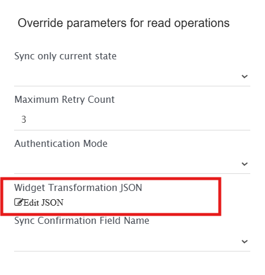</div>

### JSON Structure Overview

The JSON input consists of the following sections:

* **generic**: Defines a set of default reference rules for widgets that do not have specific configurations in the JSON input. Each object in this section contains:
  **referenceTypes** (array of strings): Specifies the types of referenced items (e.g., "Query", "Team"). Other than the entities synced by <code class="expression">space.vars.SITENAME</code>, it can have following values - Release (for Release Pipelines), Project, Repository (for Git Repos).
  **jsonPath** (string): A valid JSON Path expression to locate values in the API response. Either **jsonPath** or **regex** must be provided.
  **regex** (string): A regular expression to search for referenced IDs within the API response. When combined with **jsonPath**, the search is confined to values found at the specified path.
* **widgetSpecific**: Defines widget-specific reference rules for certain widget types. Each object in this section contains:
  **widgetType** (string): Specifies the widget type, corresponding to the contributionId key in the widget API response.
  **referenceInformation** (array of objects): A list of reference rules specific to this widget type. Each object in this list contains:
  * **referenceTypes** (array of strings): Same as described above.
  * **regex** (string): Same as described above.
  * **jsonPath** (string): Same as described above.

> **Note** :Using jsonPath is preferred for accurate transformation of referenced IDs.

A sample snippet of JSON is given below:

```json
{
  "generic": [
    {
      "referenceTypes": [
        "Team",
        "Query",
        "Project"
      ],
      "regex": "[0-9a-fA-F]{8}\\-[0-9a-fA-F]{4}\\-[0-9a-fA-F]{4}\\-[0-9a-fA-F]{4}\\-[0-9a-fA-F]{12}"
    }
  ],
  "widgetSpecific": [
    {
      "widgetType": "ms.vss-dashboards-web.Microsoft.VisualStudioOnline.Dashboards.QueryScalarWidget",
      "referenceInformation": [
        {
          "referenceTypes": [
            "Query"
          ],
          "jsonPath": "$.queryId"
        }
      ]
    }
  ]
}
```

# Known Behaviors & Limitations

## Common


## Work Item Entities (Bug, User Story, Task, etc)


## Test Entities (Test Case, Test Plan, Test Suite, Test Result, Test Run)


## Meta Entities (User, Group and Team, Area, Iteration)


## Dashboard/Query/Widgets Entities


## Pull Request


## Pipeline Entity


# Appendix

## Query Synchronization

* The Query entity has a field **WIQL** that represents the actual criteria that has been given in the Query. The **WIQL** follows a specific format for which you can refer to [https://docs.microsoft.com/en-us/azure/devops/boards/queries/wiql-syntax?view=azure-devops WIQL syntax].
  As WIQL is an internal format of Team Foundation Server/Azure DevOps, it will contain details of source end point in a pre-defined format.
  **For example** field names being in form of [System.Id] and user values being in form of 'automationsyncuser [automationsyncuser@opshub.com](mailto:automationsyncuser@opshub.com)'.
  With the synchronization, such details need to be transformed to the corresponding detail of target end point for the fields and user. Below is the detailed information around this transformation.

### **Field names in WIQL**

* Team Foundation Server/Azure DevOps End point Format - [Field internal name]. **Example :** [System.ID]
* Format being used for processing/synchronization - [Field display name]. **Example :** [ID]

**For example**
Consider a WIQL:
`select [System.Id], [System.WorkItemType], [System.Assigned To] from WorkItems where [System.TeamProject] = @project and [System.RemoteLink] = '[System.TestField]'`
This will be transformed internally to:
`select [ID], [Work Item Type], [Assigned To] from WorkItems where [Team Project] = @project and [Remote Link] = [Test Field]`
for processing.

{}

> **Note**: If field name is present in WIQL, which is not in this format, then <code class="expression">space.vars.SITENAME</code> will not do any transformation and the details will be available as stated in the "Team Foundation Server/Azure DevOps End point Format" only. In such case, if any transformation is needed, you can do it with the help of advance mapping as per the expected format.

* **What happens when the source field is not present in target system**
  During synchronization, failures will occur for the entities to which the missing target field is referred.
  To resolve these failures, any one of the following configurations can be done:
  * Create the missing field with the same datatype in any unused template in the target system.
    For adding the field, refer to [https://docs.microsoft.com/en-us/azure/devops/organizations/settings/work/add-custom-field?view=azure-devops-2020 Add custom field].
  * Replace the missing field names with the matching existing field name of the same datatype using advanced XSLT.

```xml
<wiql>
	<xsl:variable xmlns:xsl="http://www.w3.org/1999/XSL/Transform" name="wiqlUpdatedValue" select="SourceXML/updatedFields/Property/wiql"/>
	<xsl:value-of xmlns:xsl="http://www.w3.org/1999/XSL/Transform" select="replace(replace(replace(replace(replace($wiqlUpdatedValue,'\[Custom_Field\]','[ID]'),'\[Custom_Date_Field\]','[ID]'),'\[Custom_Integer_Field\]','[ID]'),'\[Custom Date 2\]','[ID]'),'\[Custom Field\]','[ID]'),"/>
</wiql>
```

{}

> **Note**: The behavior is the same for the missing field values in the target. **For example:** If WIQL refers to area path 'Area1' in the source which is not present in the target, then advance mapping can be done to transform the source area path to the corresponding target area path.

**User values mentioned in WIQL**

* Team Foundation Server/Azure DevOps End point Format - User Display Name .
  **Example:** demouser1 [demouser1@opshub.com](mailto:demouser1@opshub.com)
* Format being used for processing/synchronization - User Display Name .
  **Example:** demouser1 [demouser1@opshub.com](mailto:demouser1@opshub.com)
  [No change is done here and hence it's expected that User Display Name is same in Source and Target End Point and based on that the user values will be synchronized in the target end point]
  * In case the user with same display name is not available in target end point then the source user display name will be synchronized as text in the WIQL field in the target end system.\
    **For example -**
    Consider a WIQL :
    `select [System.ID], [System.WorkItemType] from WorkItems where [System.State] = 'Active' and [System.AssignedTo] in ('demouser1 <demouser1@opshub.com>', 'demouser2 <demouser2@opshub.com>')`
    This will be synchronized as :
    `select [System.ID], [System.WorkItemType] from WorkItems where [System.State] = 'Active' and [System.AssignedTo] in ('demouser1 <demouser1@opshub.com>', demouser2)`,
    if no user with user name **demouser2** exists in target end system.

**Id values mentioned in WIQL**
In WIQL, an id of a work item can be referred in the field value.

* Team Foundation Server/Azure DevOps End point Format -
  `[ID] [=, <, >, <=, >=, <>, in] [Source entity id]`.
  **Example:** `[ID] = [12345]`
* Format being used for processing/synchronization -
  `[ID] [=, <, >, <=, >=, <>, in] [Source entity id]`.
  **Example:** `[ID] = [12345]`
  [No change is done here and hence the source work item id will be synchronized/visible in the target end point]
  
{} 
* In case, you want the Source workitem id to be replaced with its corresponding target id \[Which is synchronized by <code class="expression">space.vars.SITENAME</code>], please use a customized workflow - **Default Integration Workflow - TFS to TFS - Query.xml**.
{}

 **For example -**
  Consider a WIQL :
  `select [System.ID], [System.WorkItemType] from WorkItems where [System.ID] = 1234 and [System.AssignedTo]`
  This will be synchronized as :
  `select [System.ID], [System.WorkItemType] from WorkItems where [System.ID] = 6789 and [System.AssignedTo]`
  Here, "1234" is the source workitem id and "6789" is the corresponding target work item id.

## Create Personal Access Token

* Log in with the integration user in AzureDevOps server.
* Click on your user name at the top-right corner and select **Security** option.

<div align="center">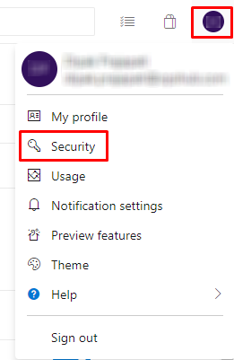</div>

* Select **Personal Access Tokens** and click on **New Token** option.

<div align="center"></div>

* Provide the name for the token and select **All accessible organizations** option for the Organization. Then choose the scope for the Personal Access Token, and click on the **create** button.

<div align="center"></div>

* Copy the token value.

<div align="center"></div>

## Proxy settings for the Service

1. Click [Proxy Setting](../manage/administrator/proxy-setting.md) to see step by step details about how to configure proxy in <code class="expression">space.vars.SITENAME</code>. After configuring the proxy in <code class="expression">space.vars.SITENAME</code> please follow given steps.
2.  Open file explorer and navigate to the service installation folder (Ex: `<OPSHUB_INSTALLATION_PATH>\Other_Resources\Resources\OpsHubTFSService`) and open file named **OpsHubTFSService.exe.config** in any text editor. Un-comment the following code from **OpsHubTFSService.exe.config** file:

    ```xml
    <!--
    <system.net>
      <defaultProxy enabled="true" useDefaultCredentials="false" >
        <module type="com.opshub.tfs.test.Proxy, opshubtfsservice" />
      </defaultProxy>
    </system.net>
    -->
    ```
3. Open run in machine (You can open it by pressing **Windows + R** button).
4. Type `services.msc` and click OK.
5. Find service name **OpsHubTFSService** and click on Restart.

## Find Reference name of field

1. Log in Team Foundation Server with a user having administrative rights.
2. Select the **'Open WIT from Server'** menu item under the Tools > Process Editor > Work Item Types menu.
   Note : Please make sure Microsoft Visual Studio has been installed with extension **'Process Template Editor'** to see above options.

<div align="center">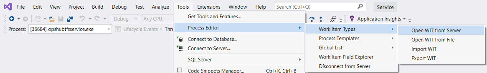</div>

3. Select the Team Foundation Server collection which contains the project to synchronize.
4. Expand the project and then select the entity which is used for synchronization(in this case Bug).
5. Click **'OK'** to open the Work Item Type Fields screen.

<div align="center"></div>

6. Here the user will see the list of all the fields with it's data-type and reference name for selected work-item.

<div align="center">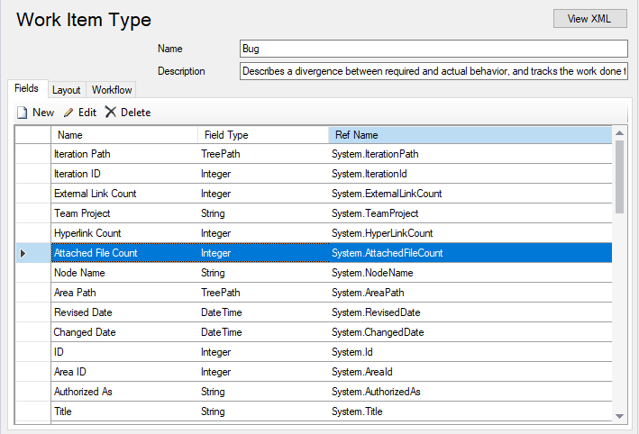</div>

## How to change the port of service

* Open file explorer and navigate to the service installation folder (Ex: C:\Program Files\OpsHub\Other_Resources\Resources\OpsHubTFSService).
* Open the file named "opshubtfsservice.exe.config" in any text editor.
* Search **`<baseAddresses>`** tag in the file. In **`<add baseAddress`** tag change the **<9090>** with the port on which you want to deploy service. Save the changes. Refer the image below for reference.

<div align="center"></div>

* Open the command prompt as **'Run As Administrator'** and navigate to the service installation folder (Sample Path: C:\Program Files\OpsHub\Other_Resources\Resources\OpsHubTFSService).
* Run "registerTFSWCFService.bat".
* Once the command is executed, go to Windows Services and look for a service with the name "OpsHubTFSService". Check if the service has started or not. If it has not started, then start the service.
* Test the web service by opening this URL in browser: `http://<hostname>:<port>/TFSService`.
  E.g. `http://localhost:<port>/TFSService`.
  For Troubleshooting, refer [Service Troubleshooting](service-troubleshooting.md) section.

## How to add a user in Collection/Organization

### Add User in Team Foundation Server Collection

1. Open Team Foundation Server Administration Console.
2. Click "Team Foundation Collection" under "Application Tier".
3. Select Collection and click "Administer Security".

<div align="center">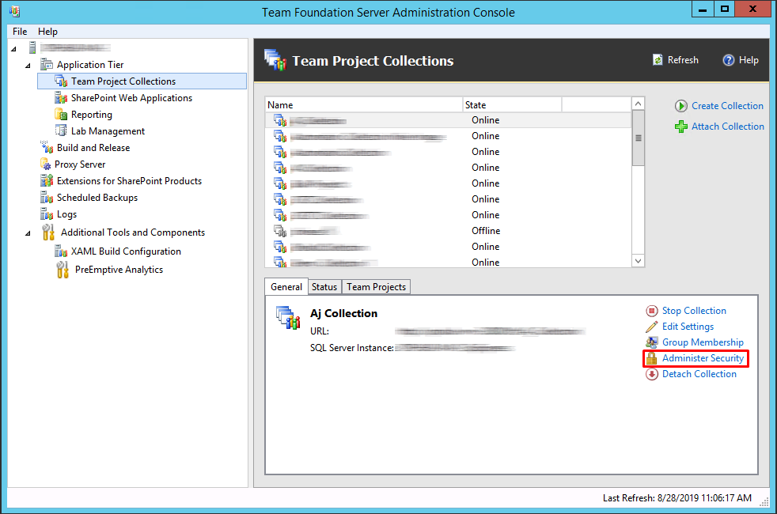</div>

4. Under "Add Users and Groups", select "Windows User or Group" option and Click "Add".

<div align="center"></div>

5. Enter the name of the user and then click "Check Names" to check user existence.

<div align="center">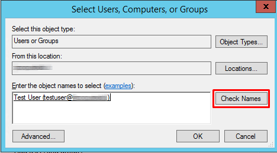</div>

6. Click "Ok". This will add the user in the selected collection.

### Add User in Azure DevOps Organization

1. Login into Azure DevOps with a user having administrative rights.

2. Click the "Organization Settings".

<div align="center">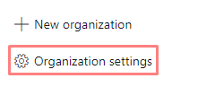</div>

3. In the left panel, under "General" option, click "Users" option and then click "Add New Users".

<div align="center">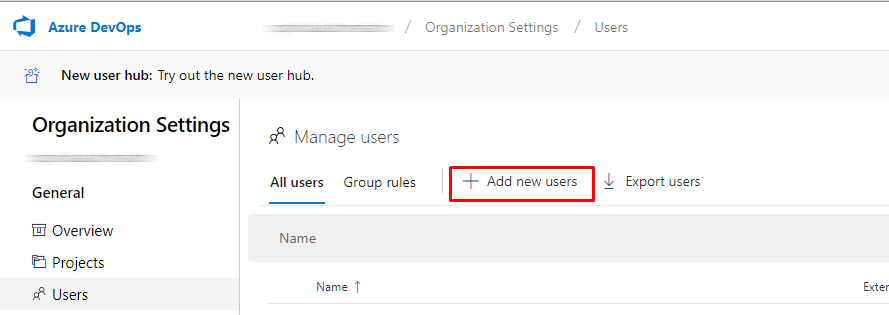</div>

4. Add the email address of the user/s under "Users" field and select "Access Level".


<div align="center">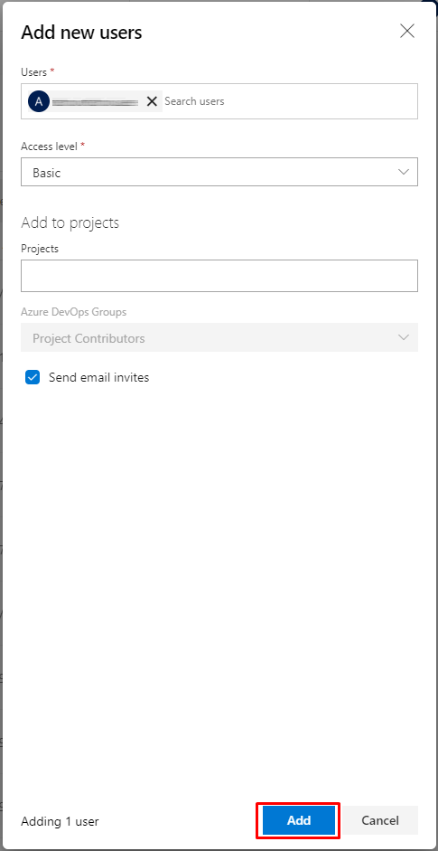</div>

5. Click "Ok".


## How to add user or Service Principal in group

### Add User or Service Principal in Collection Administration Group

1. Login into Azure DevOps with the user having administrative rights.

2. For Azure DevOps system click on the "Organization Settings"

<div align="center"></div>

For Team Foundation Server click on "Settings".

<div align="center">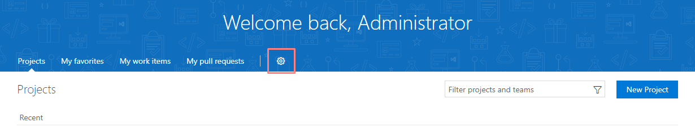</div>

3. Click on the "Security" option.

<div align="center"></div>

4. Click on the "Project Collection Administrators" group. Then click on "Members".

<div align="center">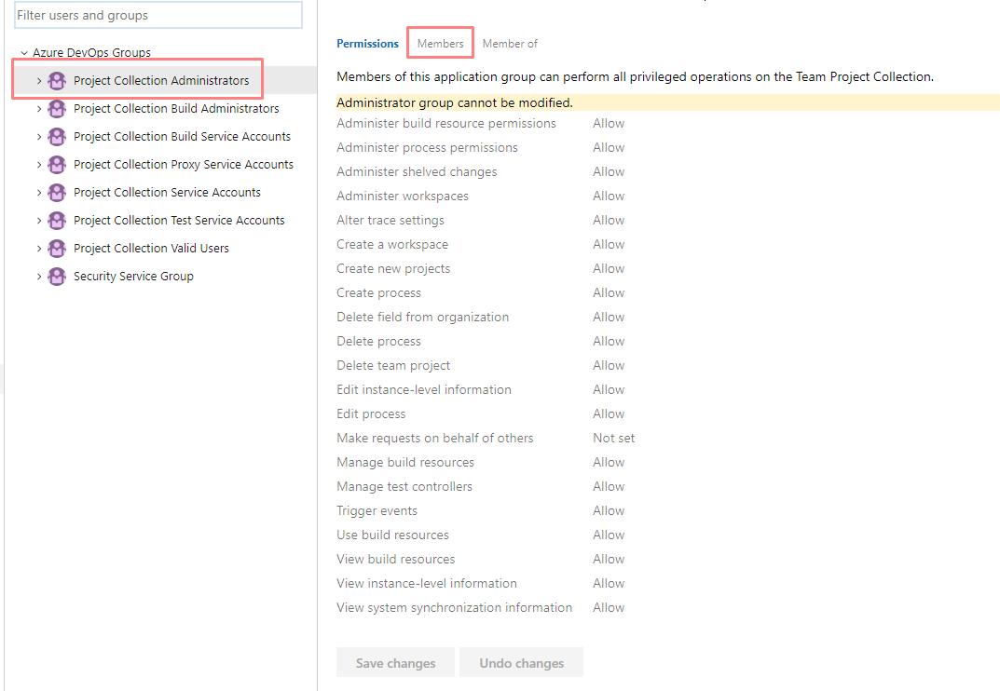</div>

5. Click on "+ Add" button.

<div align="center"></div>

6. Search the User or Service Principal or user group name in searchbox. Then click on "Save Changes" button.

<div align="center"></div>

### Add User or Service Principal in Project Administration Group

1. Login into Azure DevOps with the user having administrative rights.

2. Navigate to the project. Then click on "Settings" icon and select "Security" option.

<div align="center"></div>

3. Select "Project Administration" group and select members.

4. Follow number 5 to 7 point of section Add User in Collection Administration Group to add a User or Service Principal in "Project Administration".

## Secret key & Certificate in Microsoft Entra (Azure Active Directory)

### Generate Secret key in Microsoft Entra (Azure Active Directory)

1. Log into Microsoft Entra (Azure Active Directory) with the administrative user.

2. Navigate to **Microsoft Entra Id** -> **Applications** and select application added as Service Principal in Azure DevOps collection -> **Certificates & secrets**.

3. Navigate to **Client secrets** tab and add a new client secret.

<div align="center">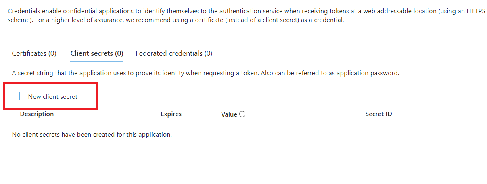</div>

### Upload Certificate in Microsoft Entra (Azure Active Directory)

1. Log into Microsoft Entra (Azure Active Directory) with the administrative user.

2. Navigate to **Microsoft Entra Id** -> **Applications** and select application added as Service Principal in Azure DevOps collection -> **Certificates & secrets**.

3. Navigate to **Certificates** tab and upload a new certificate.

<div align="center">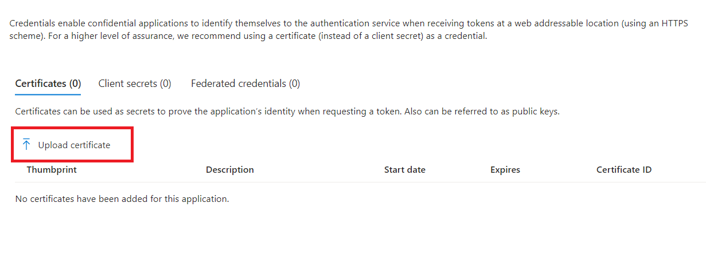</div>

## How to find Team Foundation Server's version

please follow given steps fo find Team Foundation Server version.

* Open **Team Foundation Server Administration Console**.
* You can see the Team Foundation Server instance version detila in right side of panel. Please refere given screenshot for reference.

<div align="center">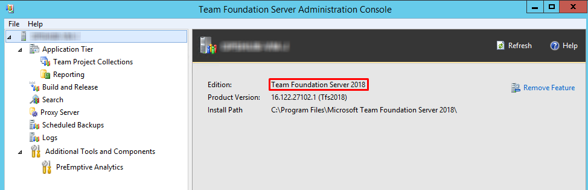</div>

## QTP MTM Test Extension Installation and Configuration

1. QtpMtmTestInstall.zip is bundled with the <code class="expression">space.vars.SITENAME</code> installation.
2. On <code class="expression">space.vars.SITENAME</code> installation machine, navigate to: `<OpsHub_Installation_Directory>\Other_Resources\Resources` and copy and extract QtpMtmTestInstall.zip to machine where QTP MTM Test Extension has to be installed (i.e. MTM Test Agent, MTM Test Controller, etc.).
3. For installation of QTP MTM Test Extension for MTM 2010 launch `Install QTP MTM Test Extension - MTM 2010.bat`.

> **Note**: Launch as Administrator

4. For installation of QTP MTM Test Extension for MTM 2012 launch `Install QTP MTM Test Extension - MTM 2012.bat`.

> **Note**: Launch as Administrator

## Test Storage File Configuration

1. Copy default.qtpmtm Test Storage file `QtpMtmTestInstall > QtpMtmTestExtension` directory into your Team Foundation Server source project.
2. Open default.qtpmtm Test Storage file in Notepad.
3. Provide the QTP Test Case Storage directory windows share path in the `default.qtpmtm` file in the first line. All the QTP Test available in the given directory will be discoverable by the QTP MTM Test Extension.
4. Save the default.qtpmtm file and check into the Team Foundation ServerProject.

### Azure DevOps Web Hook Support

Web Hooks provides functionality to trigger synchronization process on create/update of any workitem on Azure DevOps. This enables real-time synchronization of any changes made on Azure DevOps to any target system. For more details on Azure DevOps Web Hooks, please refer the following document link for configuring web hook:
[https://docs.microsoft.com/en-us/azure/devops/service-hooks/services/webhooks?view=azure-devops](https://docs.microsoft.com/en-us/azure/devops/service-hooks/services/webhooks?view=azure-devops)

<code class="expression">space.vars.SITENAME</code> supports the following workitem events:

* Work item created
* Work item updated
* Comments added to a work item

> **Note**: OpsHub supports web hook for Azure DevOps instance only.

While configuring web hook on Azure DevOps, provide URL in this pattern:
`http://[Opshub_Path]/OpsHubWS/ServiceHook/tfs` for sending Web Hook request to valid OpsHub instance. Provide the URL of OpsHub which is accessible from Visual Studio Team Services instance. Refer following figure for URL configuration of Web Hook for OpsHub Service.

<div align="center">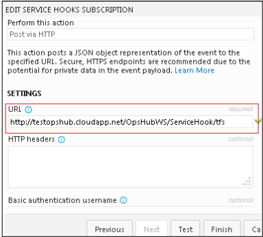</div>

## Bypass Rule with User Impersonation

* If an integration is configured to Azure DevOps from any other system with 'Bypass Rule' option enabled, <code class="expression">space.vars.SITENAME</code> will consider the audit revision's author as the user on the basis of which impersonation is to be performed.
* Link impersonation will be supported between Azure DevOps systems. When two entities are linked then on Azure DevOps side, only one entity will contain actual linked added by user while on another entity link will be added by default integration user.
* Bypass rules also allow Azure DevOps system to write any data ( valid or invalid ) data into server. <code class="expression">space.vars.SITENAME</code> can create data on past dates as well by enabling this feature.
* In case of Current State Synchronization/ Reconciliation:
  * Fields and Attachments:
    * They will be impersonated with the **last changed by user** of source entity.
  * Comments:
    * They will be impersonated with the comment user of source entity

## Bypass Rule with Time Impersonation

* If an integration is configured to Azure DevOps from any other system with 'Bypass Rule' option enabled, <code class="expression">space.vars.SITENAME</code> will consider the audit revision's timestamp as the timestamp on the basis of which impersonation is to be performed.
* In case of Current State Synchronization/ Reconciliation:
  * Fields, Comments and Attachments will be impersonated with the **last changed time** of source entity.

## State Transitions known behavior

* For Team Foundation Server system, state transitions is performed implicitly by OIM using API, given no customization has been done for dependent fields of state transitions. If a user-defined field is configured as a dependent field for the state transition, then it would require configuring the state transitions using mapping XML.*

How to configure transitions XML using mapping? Refer this: [Transition Section (../integrate/mapping-configuration.md#attachments-comments-relationships-and-workflow-transition).

* Following is the example of a transition script for the Team Foundation Server:*

Particular field "customblock" is required in the end system when state is changed from 'Active' to 'Block', otherwise its hidden. Other dependent field(s) are system defined, for example 'Reasons' field. As the user-defined field configure for transition field, we must configure transitions in the mapping as shown below:

```xml
<FieldTransitions>
  <FieldTransition>
    <transitionName>transitionName 1</transitionName>
    <fromField>State</fromField>
    <toField>State</toField>
    <sourceValue/>
    <targetValue>Proposed</targetValue>
    <defaultTransition>true</defaultTransition>
  </FieldTransition>
  <FieldTransition>
    <transitionName>transitionName 2</transitionName>
    <fromField>State</fromField>
    <toField>State</toField>
    <sourceValue>Proposed</sourceValue>
    <targetValue>Active</targetValue>
    <dependentFields>
      <dependentField>
        <fieldName>Reason</fieldName>
        <possibleTargetValues>
          <possibleValue>Approved</possibleValue>
        </possibleTargetValues>
        <defaultValue>Approved</defaultValue>
      </dependentField>
    </dependentFields>
  </FieldTransition>
  <FieldTransition>
    <transitionName>transitionName 3</transitionName>
    <fromField>State</fromField>
    <toField>State</toField>
    <sourceValue>Active</sourceValue>
    <targetValue>Block</targetValue>
    <dependentFields>
      <dependentField>
        <fieldName>Reason</fieldName>
        <possibleTargetValues>
          <possibleValue>Fixed</possibleValue>
        </possibleTargetValues>
        <defaultValue>Fixed</defaultValue>
      </dependentField>
      <dependentField>
        <fieldName>customblock</fieldName>
        <possibleTargetValues>
        </possibleTargetValues>
      </dependentField>
    </dependentFields>
  </FieldTransition>
</FieldTransitions>
```

# Troubleshoot

## **Test Point does not exist failure**

* For detailed understanding of Test Point, please refer to [Test Point Advance Mapping Configuration](team-foundation-server.md#test-point-advance-mapping-configuration) section.
* Some possible scenarios that may cause this failure:
  1. **Test point is yet not synchronized in target system**
     * To resolve this issue do following. Let first TestCase then TestSuite sync with **Test-Case linkage** configuration prior to Test Run sync or failure retry. For synchronizing configuration/tester with **Test-Case linkage** advance mapping is required. For advance mapping, please refer [Test Point Advance Mapping Configuration](team-foundation-server.md#test-point-advance-mapping-configuration) section.
  2. **TestPoint is deleted from Target System**
     * TestPoint can be deleted with either of following ways:
       * TestCase Linkage will remove from TestSuite. In such case all TestPoint corresponds to that TestCase will deleted. For example, If we remove TestCase 81639 this will remove the first TestPoint shown in above screenshot. Whereas if we remove TestCase 81640 then it will remove both the TestPoints belong to TestCase 81640 i.e. 2nd and 3rd both TestPoints will removed.
       * Remove/change the configuration of particular TestPoint. For example, change the configuration for first TestPoint to Firefox instead Chrome, then it will create new TestPoint and remove old TestPoint.
       * Deleting the TestCase will remove all TestPoints corresponds to that TestCase.
       * Deleting the TestSuite itself will remove all TestPoints corresponds to that TestSuite.
     * In such cases the failure remains for Test Run until the required TestPoint not added back to TestSuite in target system.
  3. **TestCase can be added in Query-Based Suite or Requirement-Based suite after TestSuite synced in target system, or **Test-Case Linkage** configured after synchronization.**
     * Perform following steps to resolve failure due to this scenario:
       * Update the TestSuite of source end system for which failure is generated.
       * Execute the TestSuite Integration.
       * Once updates of TestSuite synced to target end system the retry then Test-Run failure.
