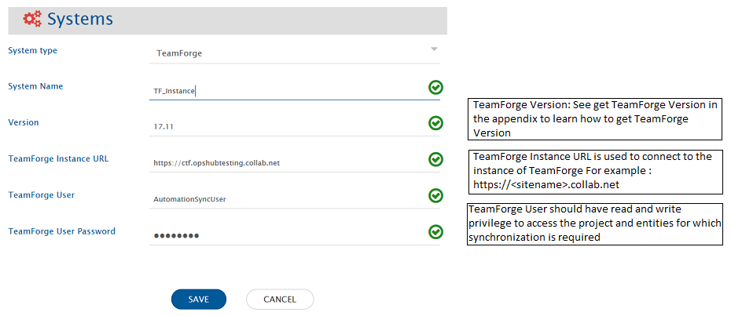
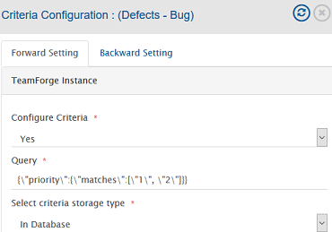
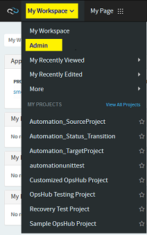
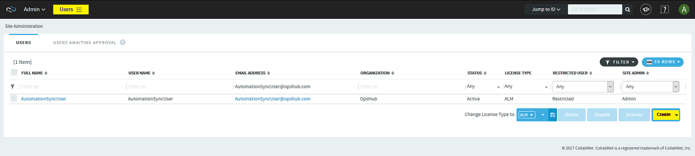
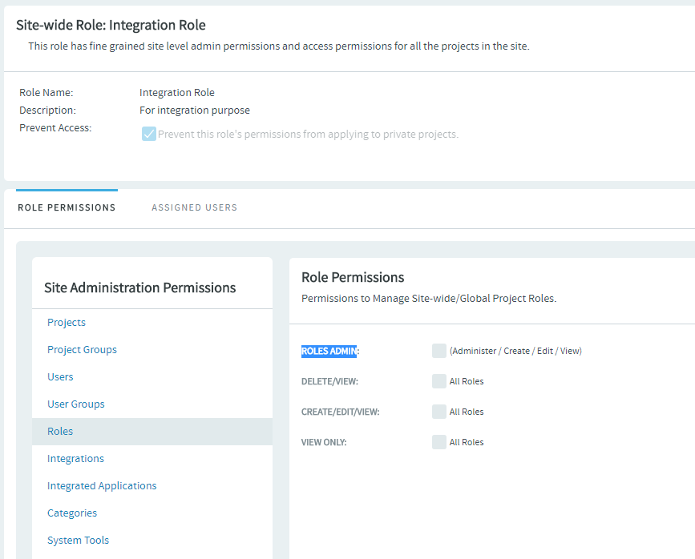

# Pre-requisite

## User privileges

* User must be a member of the project that you want to integrate.  
* In addition to that, some specific permissions will be required for the integration user depending on the entity types that you want to synchronize. Following are the required user permissions for each type of entity:  
  * **Tracker**:
    * **SUBMIT/VIEW** & **EDIT/VIEW** permissions should be there on the Tracker type that you want to sync.
    * **VIEW ONLY** permissions are required on All Roles under Site-wise Roles.
  * **Planning Folders**:
    * **PLANNING FOLDER ADMIN** permission is required.
    * **VIEW ONLY** permission is required on File Releases.
  * **Team**:
    * **PROJECT ADMIN PERMISSIONS** required at the project level.

Click "[Add Users](#add-users)" and "[Site-wise Roles](#assign-site-wise-roles-to-a-user)" in the Appendix section to learn how to add user and how to assign site-wise roles to a user.

# System Configuration

Before you continue to the integration, you must first configure TeamForge. Click [System Configuration](../integrate/system-configuration.md) to learn the step-by-step process to configure a system. Refer the screenshot given below.

<p align="center">
  
</p>


If the system is deployed on HTTPS and a self-signed certificate is used, then you will have to import the SSL Certificate to be able to access the system from OpsHub Integration Manager. Click [Import SSL Certificates](../getting-started/ssl-certificate-configuration.md) to learn how to import SSL certificate.

# Mapping Configuration

Map the fields between TeamForge and the other system to be integrated to ensure that the data between both the systems synchronizes correctly. Click [Mapping Configuration](../integrate/mapping-configuration.md) to learn the step-by-step process to configure mapping between the systems.

# Integration Configuration

Set a time to synchronize data between TeamForge and the other system to be integrated. Also, define parameters and conditions, if any, for integration. Click [Integration Configuration](../integrate/integration-configuration.md) to learn the step-by-step process to configure integration between two systems.

<p align="center">
  
</p>


# Integration behavior

* For meta entities like **Planning Folders** and **Teams**, a field **Path** is available in the list of fields. This field can be mapped for the hierarchy details of the given entity.  
  Like when Teamforge is the source system, this field will contain the path where the entity resides and when TeamForge is the target system, this field can be used to decide/set location of the entity.  
  This field expects/provides the path including the entity title and the separator used here is `\`
* Planning Folders can be of different types such as Release/Iteration/Folder. Planning Folder type can be set and retried with field **Planning Folder Type**. If this field is not mapped, Planning Folders will be created with Type "Folder".
* For **Planning Folders**, summary details are available in terms of read-only fields such as **actualEffort**, **openPoints**, **estimatedEffort** etc.

# Criteria Configuration

If you want to specify conditions for synchronizing an entity between TeamForge and the other system to be integrated, you can utilize the **Criteria Configuration** feature.

To configure criteria in TeamForge, integration needs to be created with TeamForge as the source system. You can set query on a particular ItemType.

TeamForge Query format is:

```
{"fieldName":{"matches":[array of values to be allowed to poll]}}
```

* An example of criteria for 'Lookup field'  
  **Sample Query:** Polling entities where priority is either 1 or 2.  
  **Example query:** `{"priority":{"matches":["1", "2"]}}`

* An example of criteria for 'User field'  
  **Sample Query:** Polling entities which are assigned to integration user or testuser.  
  **Example query:** `{"assignedToUsername":{"matches":["@self","testuser"]}}`

* An example of criteria for 'More than one field'  
  **Sample Query:** Polling entities with Priority 1 or 2 and Status is Open.  
  **Example query:** `{"priority":{"matches": ["1", "2"]},"status":{"matches": ["Open"]}}`

>**Note**:  You can see an example in below image.

<p align="center">
  
</p>

* For **Planning Folders**, criteria-based integration is supported only with **Planning Folder Type** field.  
  Example query: `planningFolderType=standard`
* For **Teams**, criteria-based integration is not supported.

# Known Limitations

* When TeamForge is the target system and comment or attachment is mandatory while changing the state, the synchronization generates the failure.
* **Status** and **Display Effort In** fields of **Planning Folders** will come as Text field and in case of different values in the other end system. You need advance mapping for synchronization. (Mapping will be on display name based for Status. Display Effort needs trackerunitid to write data).
* When TeamForge is target system, Special characters (such as 아티팩트) in attachment file name will appear as question marks.
* Since TeamForge version 18.1, **Description** and **Comments** are supported as **Markdown**, but these will be synchronized as plain text.
* Synchronization of Actions or State Transition configuration is not supported by OpsHub Integration Manager.
* Impersonation is not supported by OpsHub Integration Manager.
* Read Only fields in OpsHub Integration Manager will not be writable due to end system API limitations/behaviours.  
  * E.g., Created, Creator, Date Updated, etc.

# Appendix

## Add Users

* Login in to the TeamForge with root/admin user (which has Administrator privileges).
* Navigate My Workspace → Admin as shown in the screenshot.
  
<p align="center">
  
</p>

* Now from menu select **Users** and click on **Create**.
  
 <p align="center">
  
</p>

* Do provide necessary details in fields such as User Name, Email, Full Name and so on.
* Click **Create** and it will create the user.

## Get TeamForge Version

* Login into the TeamForge system
* Click on the '?' icon in right upper corner and select **About TeamForge**. It will show the version details.

## Assign Site-wise Roles to a User

* Login in to TeamForge with root/admin user (which has Administrator privileges).
* Navigate to My Workspace → Admin → Roles.
* Click **Create** button to create a new role. (You can use an existing role as well)
* Give role name, description, and click **Create** button.
* Select **Roles** from the left panel and check **ROLES ADMIN** in the right panel (As shown in the screenshot below).
* Save **Role**.
* Open that **Role** again to assign the user to the role.
* Navigate to the **Assigned Users** tab and add user that you want to use for integration in this role.
  
<p align="center">
  
</p>


