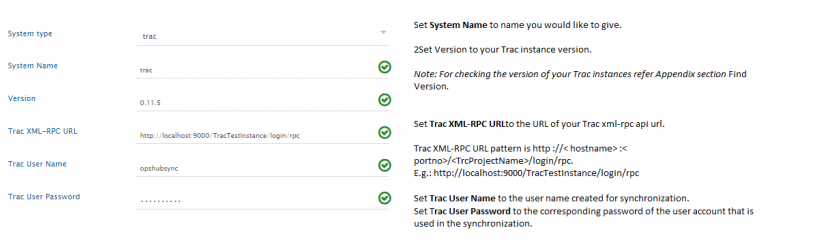
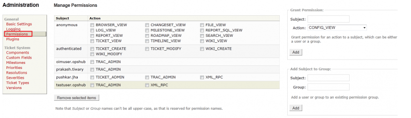
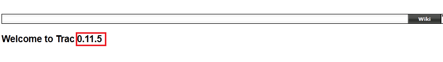
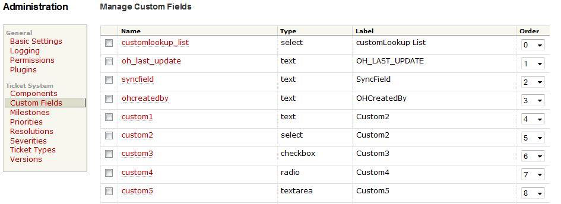

# Prerequisites

## Trac Configuration

In Trac, we need to install xmlrpc plugin. Then we need to enable that in the `trac.ini` file located in `Trac project/conf` folder.  
  
```
[Components]

tracrpc.* = enable
```

## User Privileges

* Create one user of Trac, dedicated to <code class="expression">space.vars.SITENAME</code>. User should not be used to do any operations from System's User-Interface. 
* User must have all privileges to call its web-service and permissions to read, write, and edit the entity. 
* Following are the privileges required in Trac for the user of <code class="expression">space.vars.SITENAME</code>. 
  * TICKET_ADMIN 
  * XML_RPC 

For privilege management, please refer appendix [User Privileges](#user-privileges).

## Custom Fields Configuration

In Trac, following custom fields are required. For creating custom fields, please refer appendix [Custom Field Configuration](#custom-field-configuration).

| **Name**     | **Type** | **Label Name**   |
|--------------|----------|------------------|
| ohcreatedby  | text     | OH_CREATED_BY    |

# System Configuration

Before you continue to the integration, you must first configure Trac.  

Click [System Configuration](../integrate/system-configuration.md) to learn the step-by-step process to configure a system.  

Refer the screenshot given below for reference.

<p align="center">
  
</p>


If the system is deployed on HTTPS and a self-signed certificate is used, then you will have to import the SSL Certificate to be able to access the system from <code class="expression">space.vars.SITENAME</code>. Click [Import SSL Certificates](../getting-started/ssl-certificate-configuration.md) to learn how to import SSL certificate.

# Mapping Configuration

Map the fields between Trac and the other system to be integrated to ensure that the data between both the systems synchronizes correctly.  

Click [Mapping Configuration](../integrate/mapping-configuration.md) to learn the step-by-step process to configure mapping between the systems.

# Integration Configuration

Set a time to synchronize data between Trac and the other system to be integrated. Also, define parameters and conditions, if any, for integration.  

Click [Integration Configuration](../integrate/integration-configuration.md) to learn the step-by-step process to configure integration between two systems.

# Criteria Configuration

## Query

Query in Track system is valid for any filed available in trac as follows:  
`<filedname(internal name)><operator(!=,=)><filedvalue(displayvalue)>`  

Please note, all the query string should be in small letters.  

## Sample Query

```
status!=closed or status!=open  
priority!=must or priority!=major  
reporter=xyz
```

# Appendix

## User Privileges

* In **Admin** tab, select **Permission** from the left panel. 
* In **Subject** of **Grant Permission** option named the resource to which you want to give privilege. For Example, 'oimuser'. 
* In **Action** of **Grant Permission** options, select the permission you want to give to the selected Subject. For Example, 'XML_RPC'. 
* Click **Add** to give the permission.
  
<p align="center">
  
</p>

## Custom Field Configuration

* If "**traccustomfieldadmin**" plug-in is installed, then the custom field can be added by the Trac UI itself. 
* Give the name, type, label name and the default value for custom field and click **"Add"** to create the custom field. 
* If "**traccustomfieldadmin**" plug-in is installed, we need to enable it from `trac.ini` file located in `Trac Project/conf` folder as follows:  
  ```
  [components]
  customfieldadmin.* = enabled
  ```
  For adding the custom field give the **Name, Type, Label** and **Default value** and then click on **Add**.  
* If "**traccustomfieldadmin**" plug-in is not installed, we can configure the `trac.ini` file located in `Trac Project/conf` directory for adding the custom filed.  
  Syntax of adding the custom field is as follows:
  ```
  [ticket-custom]
  customField = text
  customField.format = plain
  customField.label = SyncField
  customField.options =
  customField.order = 2
  customField.value =
  ```
<p align="center">
  
</p>


## Version

* Open the tracurl : `http://<hostname>:<portno>/<TrcProjectName>` 
* Click on Wiki tab.  

<p align="center">
  
</p>


## Custom Field Internal Name

* Log in into Trac with the administrator user. 
* Navigate to the **Admin** menu on the top of the page. 
* From the page displayed, click on **Custom Field** link on the left menu. It will show list of custom fields if any configured with a link to **Add a new custom field** at the end. 
* **Edit Custom Field** shows custom field **Internal Name**.

<p align="center">
  
</p>


