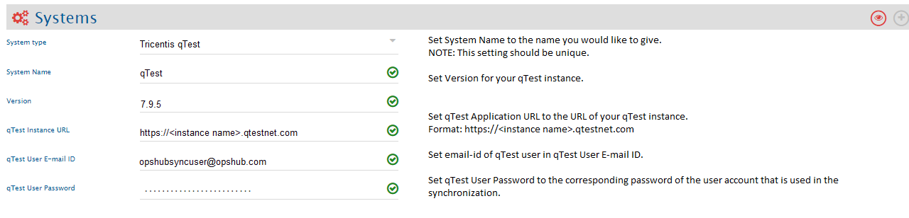
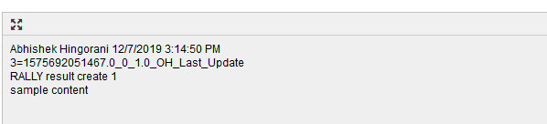
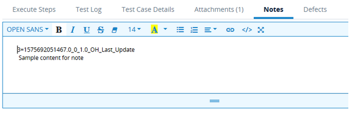
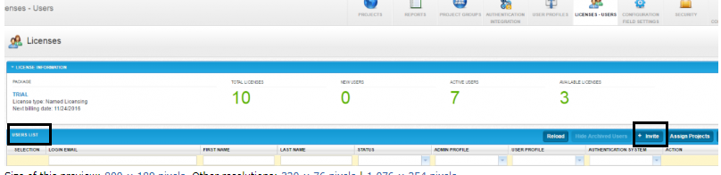
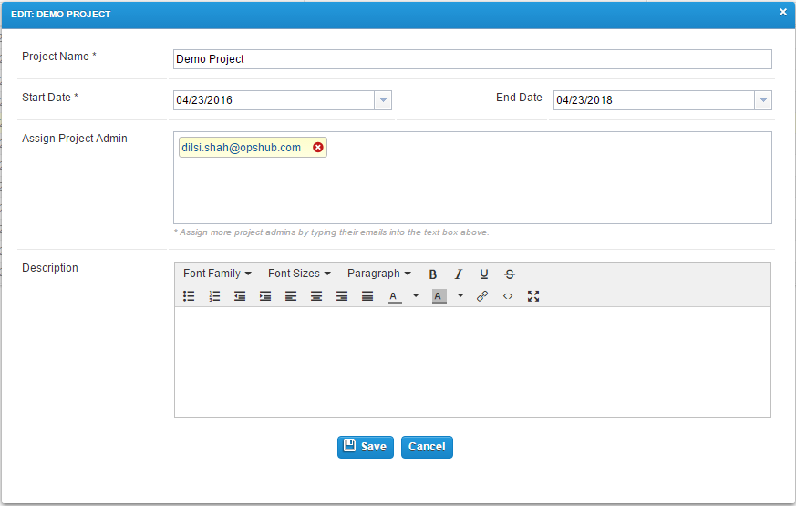
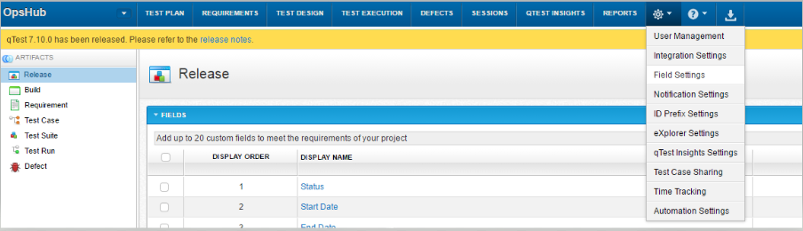

# Pre-requisite

## User privileges

- Create one Tricentis qTest user for Project Admin role to the project which needs to be integrated. User should be dedicated to **<code class="expression">space.vars.SITENAME</code>** and should not be used to do any operations from system's User-Interface.
- User should have access to all the entities that need to be synchronized.

## Fields Pre-requisites

- For the synchronization of the Requirements and Defects, the below field types need to be created in the qTest.
  - OH_Last_Update: Text box type
  - OH_CreatedBy: User list type

# System Configuration

Before you continue to the integration, you must first configure Tricentis qTest system. Click [System Configuration](../integrate/system-configuration.md) to learn the step-by-step process to configure a system. Refer the screenshot given below for reference.

<p align="center">
  
</p>

If the system is deployed on HTTPS and a self-signed certificate is used, then you will have to import the SSL Certificate to be able to access the system from **<code class="expression">space.vars.SITENAME</code>**. Click [Import SSL Certificates](../getting-started/ssl-certificate-configuration.md) to learn how to import SSL certificate.

# Mapping Configuration

Map the fields between Tricentis qTest and the other system to be integrated to ensure that the data between both the systems synchronizes correctly. Click [Mapping Configuration](../integrate/mapping-configuration.md) to learn the step-by-step process to configure mapping between the systems.

## Mapping for Soft Delete Configuration

- When Tricentis qTest is the target system in the integration, the Soft delete operation is performed by default in the synchronization of the [Source Delete event](../integrate/source-delete-synchronization.md).
- After the Soft Delete operation is performed by **<code class="expression">space.vars.SITENAME</code>** in Tricentis qTest, the entity will be deleted in Salesforce. The deleted entity goes to the "Recycle Bin".
- To only enable the logical delete operation in the target, "OH Soft Delete" field shall be mapped with the default value "No" in the [Delete Mode](../integrate/mapping-configuration.md#delete-mode) mapping.

# Integration Configuration

In this step, set a time to synchronize data between Tricentis qTest and the other system to be integrated. Also, define parameters and conditions, if any, for integration. Click [Integration Configuration](../integrate/integration-configuration.md) to learn the step-by-step process to configure integration between two systems.

## Criteria Configuration

If you want to specify conditions for synchronizing an entity between Tricentis qTest and the other system to be integrated, you can use the Criteria Configuration feature. Go to Criteria Configuration section on the [Integration Configuration](../integrate/integration-configuration.md) page to learn in detail about Criteria Configuration.  

To configure an integration based on criteria, follow the steps given below:
- In **<code class="expression">space.vars.SITENAME</code>**, on your integration form select **Advance Configuration**.
- Under **Other Configurations** section in the Source Configuration tab, set Configure Criteria as **Yes**.
- And in the **Query** text box, write the query which you want to execute while polling entities.  
  - Format: 'FieldName' = 'FieldValue'

**Examples**
- 'Status' = 'Ready for Baseline'
- 'Status' = 'Ready for Baseline' and 'Priority' = 'Medium'
- ('Status' = 'Ready for Baseline' or 'Priority' = 'Medium')
- Created Date = '06/06/2018 2:30:00 PM'

### Module entity

*For the Module entity, the criteria query can be applied to the 'Name' field using search query parameters. Additionally, the expand and parentId parameters can also be utilized for filtering.
* Here's a brief overview of the three query parameters used in the QTest module API:
  - **search**: The case-sensitive free-text to search for modules by names.
  - **parentId**: If ID of a parent module is specified, it will only search for sub-modules under this parent module. If not, the response will include the modules located directly under root.
  - **expand**: If you set expand=descendants, the response will include the modules that meet the search criterion and their parent and grand parent modules.

* In the case of criteria configuration, **<code class="expression">space.vars.SITENAME</code>** functions like a search. The query should be provided in JSON format. For example, if the query is `{"search":"test"}`, it will retrieve all modules containing the word 'test' in the specified field or name.

**Criteria configuration query sample:**

| Field Type         | Criteria configuration usecase                                                                 | Snippet                                           |
|--------------------|-----------------------------------------------------------------------------------------------|---------------------------------------------------|
| **Text**           | It performs a like search on the modules and return all modules with name similar to "Module Name". | `{"search":"Module Name"}`                          |
| **Text and Integer** | It retrieves the module with the specified parent Id and returns its child and descendant modules. | `{"parentId":54115370,"expand":"descendants"}`      |

## Target LookUp Configuration

* Provide Query in Target Search Query field such that it is possible to search the entity in the qTest as the target system. In the target search query field, the user can provide a placeholder for the source system's field value in the '@'

* Go to **Search in Target Before Sync** section on [Integration Configuration](../integrate/integration-configuration.md) page to learn in detail about how to configure Target LookUp.

* Overall, Target LookUp Query is similar to [Criteria Configuration](#criteria-configuration), except the value part contains a field name with '@' instead of static value.

* Given below is the sample snippet of how the qTest query can be used as a Target Entity LookUp query in **<code class="expression">space.vars.SITENAME</code>**:

**Target LookUp query samples:**

| Field Type | Target lookup usecase                                                  | Snippet                                 |
|------------|-------------------------------------------------------------------------|-----------------------------------------|
| **Text**   | Target lookup on the entity having the source entity's id in 'name' field | `'Name' = '@source_system_id@'`           |
| **Lookup** | Target lookup on the entity having the source entity's status in 'status' field | `'Status' = '@source_system_status@'`     |

### Module entity

* For the Module entity, the lookup query can be applied to the 'Name' field using search query parameters. For other query parameters and its usage, refer to the [criteria configuration](#criteria-configuration) section for module entity.
* In the case of Target Lookup Configuration, **<code class="expression">space.vars.SITENAME</code>** performs an exact search. For example, if the query is `{"search":"test"}`, it will fetch the module that has the name, 'test'.

**Target LookUp query sample:**

| Field Type         | Target lookup usecase                                                        | Snippet                                                           |
|--------------------|------------------------------------------------------------------------------|-------------------------------------------------------------------|
| **Text**           | The system will search for a module having exact name in root hierarchy.    | `{"search":"@source_name@"}`                                        |
| **Text and Integer** | The system will only search for sub-modules under specified parent module having exact name match | `{"search":"Module Name", "parentId":54115370, "expand":"descendants"}` |

* It is recommended to use additional query parameters to narrow down the results if there are more than one with the same name, ensuring only one item is returned. If more than one match is found, **<code class="expression">space.vars.SITENAME</code>** will proceed with the first match.

# Known Behaviour

## Requirement and Test Case

* For Requirement and Test Case sync, the Module entity needs to be configured as a **mandatory Parent link** in the relationship mapping of the 'Requirement' and 'Test Case' entities.  
    * **Reason:** In qTest, the Requirement and Test Case can only be created inside the Module.  
    * **Note**: It is recommended to have the "Fail event if linked entity does not exist" option enabled in the Relationship mapping of the Requirement and Test Case entities.
 As from the Module entity, there is no way to sync the link to Requirement and Test cases, due to qTest APIs. Hence, if the Module is not synced yet and for Requirement or Test Case the linkage gets updated, then this action can cause the wrong Module linkage sync. By enabling the "Fail event if linked entity does not exist" option the wrong linkages sync can be prevented in case of parallel sync of the Module and Requirement/Test Cases.

* For qTest as the target system and the Test Case entity, if the user wants to approve the Test Case based on pre-condition, user needs to map Boolean field `OH_Approve_Test_Case` in <code class="expression">space.vars.SITENAME</code>. Here, the user needs to provide true/false value based on the use case.

* If the above-mentioned field is not mapped, Test Case will be approved after every revision [including the create operation].  
  **Note**: `OH_Approve_Test_Case` should not be mapped as the source field for this is a virtual field and not an actual field in Test Case.

* Example: Based on the version changes detected in Micro Focus ALM, if user wants to approve the Test case from Micro Focus ALM to qTest. Below is the sample advance mapping for approval in qTest.

```xml
<OH_Approve_Test_Case>
  <xsl:variable name="modified" xmlns:xsl="http://www.w3.org/1999/XSL/Transform" select="translate(SourceXML/updatedFields/Property/Modified,' ','')"/>
  <xsl:variable name="checkInDataTime" xmlns:xsl="http://www.w3.org/1999/XSL/Transform" select="concat(SourceXML/updatedFields/Property/Version-space-Check-space-In-space-Date, SourceXML/updatedFields/Property/Version-space-Check-space-In-space-Time)"/>
  <xsl:choose xmlns:xsl="http://www.w3.org/1999/XSL/Transform">
    <xsl:when test="$modified = $checkInDataTime">
      <xsl:value-of select="'true'"/>
    </xsl:when>
    <xsl:otherwise>
      <xsl:value-of select="'false'"/>
    </xsl:otherwise>
  </xsl:choose>
</OH_Approve_Test_Case>
```

* If the Module entity is configured in <code class="expression">space.vars.SITENAME</code> as a separate entity, map the Parent in a link relationship with Requirement and Test Case entities.  
  * The module is mandatory in Requirement and Test Case synchronization.
* If the Module entity is not configured separately, use the check-and-create functionality with the **Module Path** field  
  * To create the module hierarchy, you need to configure the **checkAndCreate** flag. If **checkAndCreate** is not configured and the module hierarchy does not exist, an error will be thrown.  
  * For example, if the module path is set to "Default/Test/Test1" and the checkAndCreate option is not configured, then <code class="expression">space.vars.SITENAME</code> will attempt to locate the specified path.  
    * If the path exists, it will be used for create/update operations.  
    * If the path does not exist, an error will be thrown.
* <code class="expression">space.vars.SITENAME</code> uses the "/" character to separate modules in a '''Module Path'''. If the source system uses a different path separator, users must create advanced mapping to convert that separator to the "/" string.
    ```xml
   <Module-space-Path>
     <xsl:value-of xmlns:xsl="http://www.w3.org/1999/XSL/Transform" select="replace(SourceXML/updatedFields/Property/Subject, '\\', '/')"/>
   </Module-space-Path>
    ```
    
  * Please refer sample mapping below:  
    ```xml
    <Module-space-Path>
      <xsl:value-of xmlns:xsl="http://www.w3.org/1999/XSL/Transform" select="replace(SourceXML/updatedFields/Property/Subject, '\\', '/')"/>
    </Module-space-Path>
    ```

* Please refer another sample mapping below:  
  ```xml
  <Module-space-Path checkAndCreate="true">
    <xsl:value-of xmlns:xsl="http://www.w3.org/1999/XSL/Transform" select="SourceXML/updatedFields/Property/Module-space-Path"/>
  </Module-space-Path>
  ```
## Module

* The Module can have sub-modules in the qTest. Hence to sync the modules' hierarchy, the 'Parent' or 'Child' linkages needs to be configured in the relationship mapping of the Module.
* For the Module entity, "Requirement" is used as the default tab in the case of a Remote link URL sync. Hence, the user needs to switch tabs from the UI if they want to see the Test Cases associated with the Module.

## Build

* Build can be created under the 'Release' entity in qTest. Hence, when qTest is the target system in the <code class="expression">space.vars.SITENAME</code>, then it is required to configure a mandatory "Parent" link to the Release entity in <code class="expression">space.vars.SITENAME</code> mapping to sync the Build entity.
* Build can be linked with the Requirements, (which are already linked to the parent Release entity), as part of the "BUILD SCOPE" configuration in qTest. To synchronize this link, the `build_scope_includes` can be configured in the <code class="expression">space.vars.SITENAME</code> mapping.
* If an error is observed with the error message:  
  `"No links were created. Please review your input, make sure they are valid id and able to link"`  
  while synchronizing the Requirement link with the Build entity. A possible cause could be:
  * The Requirement to be linked with the build is not linked with its parent Release. In qTest, the Requirement can only be linked with build if it is linked with Parent Release.

# Known Limitations

* Testlog step polling is not supported.
* Testlog steps' result update is not supported.
* Synchronizing empty values to the 'Combo-Box' and 'Date' type of system fields are not supported due to Qtest API limitation.
* Link to 'Testlog from Defect' is not supported.
* Parent Release can be set at the creation time of the Build only; it cannot be changed via <code class="expression">space.vars.SITENAME</code> afterwards due to an API limitation.
* Requirements and Defect entities will be synchronized without history. They will be synchronized with the entity state/details available at the time of synchronization.
* If user is editing the existing comment or removing/deleting the attachment from Defect/Requirement entity, then to sync such changes, the user needs to update one field on Defect/Requirement entity.
* Attachments with non-ASCII characters in file name are not fully supported by Tricentis qTest API, so the file name may change during synchronization if it contains non-ASCII characters. This also limits the bi-directional sync of those files.
* In-line images are not supported as a part of HTML type of fields.
* Reconciliation is not supported for Requirement and Test Case type of entities.
* For Test Cycle entity, Criteria, Test Run linkage & Reconciliation is not supported.
* Note field of Testlog entity is also used by OIM to store the recovery marker for the entity as the end system is not supporting the custom field configuration for test-log entity. Basically, note field will have both recovery marker information generated by OIM along with actual note content. The first line of the Note field has the recovery marker, and the second line will have the actual note information. Refer the below screenshot for more clarity.
   
 <p align="center">
  
</p>

<p align="center">
  
</p>


* For Tricentis qTest as the target system, the Submitter field will not be updated for the Defect entity by <code class="expression">space.vars.SITENAME</code>.  
  **Reason:** Tricentis qTest API does not allow to update the Submitter field.
* Entities like Builds, Release, Requirement, Module, Test Case, Test Suite, Test Cycle, and Test Run support the Soft Delete operation in Tricentis qTest. For other entities, Logical Delete will be performed.

# Appendix

## Add user

* Open Tricentis qTest.
* Go to **Site Administration** window.
* Go to **License   Users** tab and click **Invite** to send invitation to new user to be added.
  
  <p align="center">
  
</p>

* After adding new user, add the user to project.
* Go to Project tab.  

 <p align="center">
  
</p>

* Click on the project name in which user needs to be added and add user in **Assign Project Admin** field.

## Create custom field

For creating custom field in Tricentis qTest, follow the steps given below:

* Navigate to project where you want to create a custom field.
* Click on **Settings** dropdown menu (as shown in the image below) and select **Field Settings**.
  
<p align="center">
  
</p>

* In Field Settings, click the entity type to which custom field is to be added (Example: Requirement). Click on **Add Custom Field** button to add new custom field.  

 <p align="center">
  
</p>

* Save the changes.


