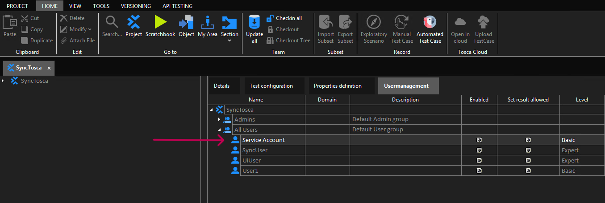
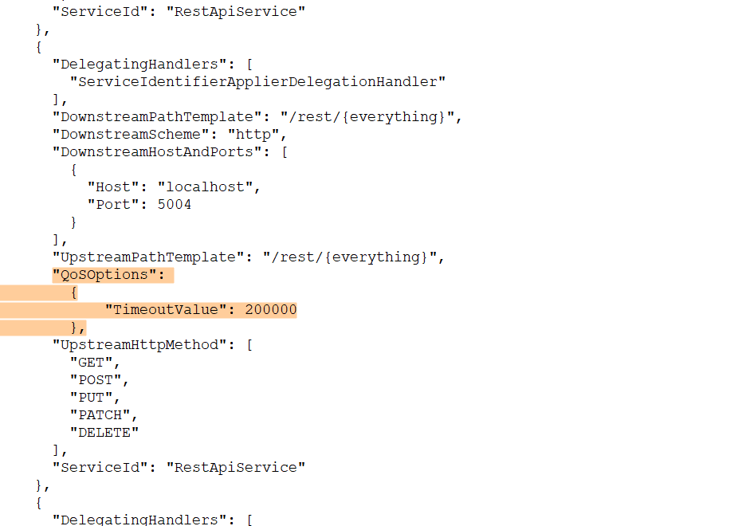
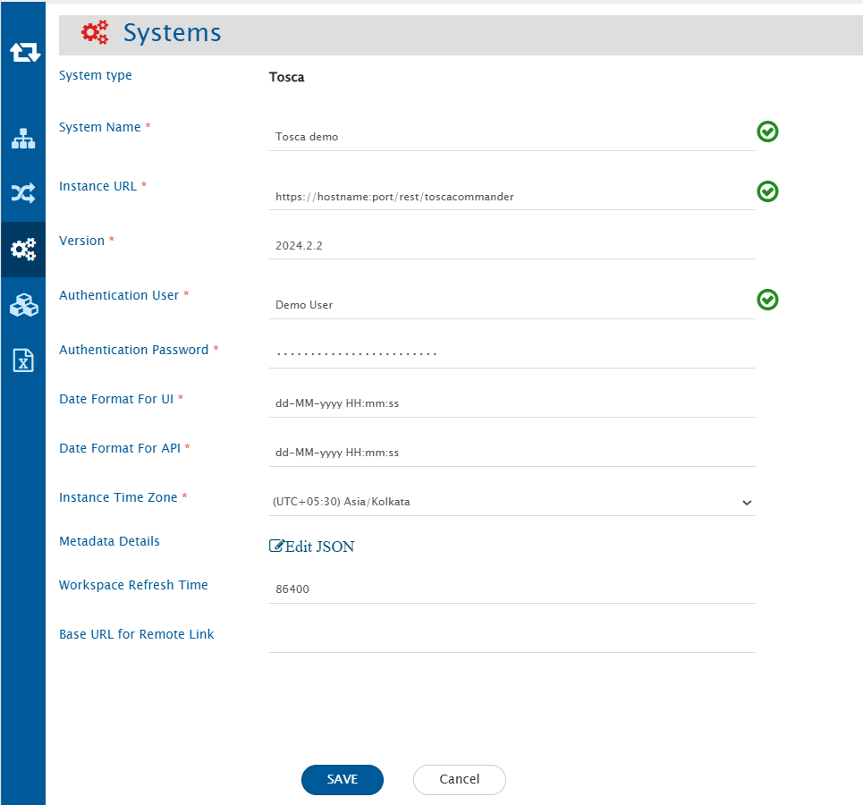
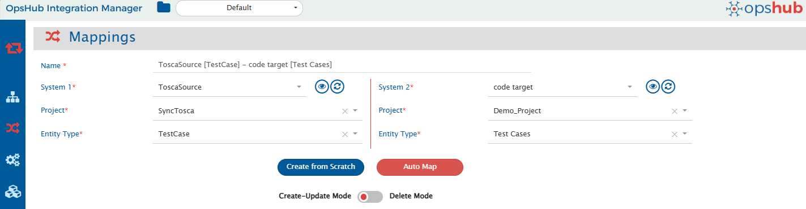
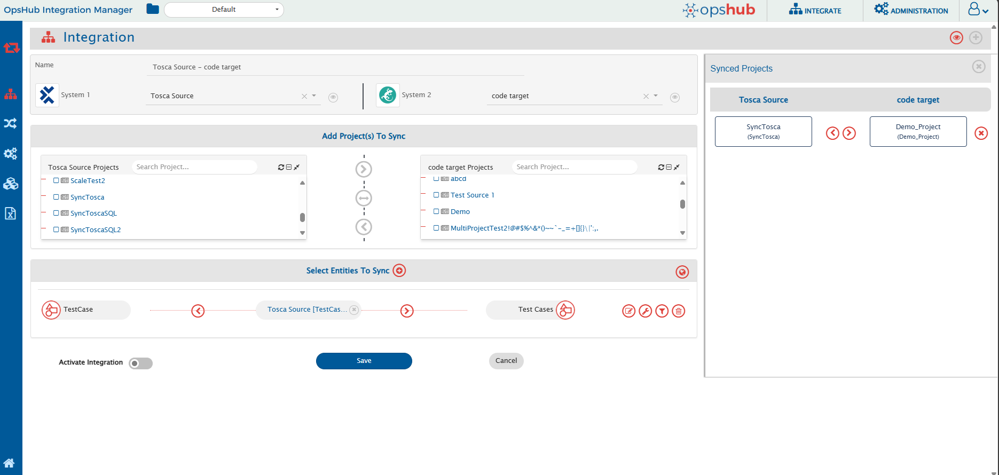
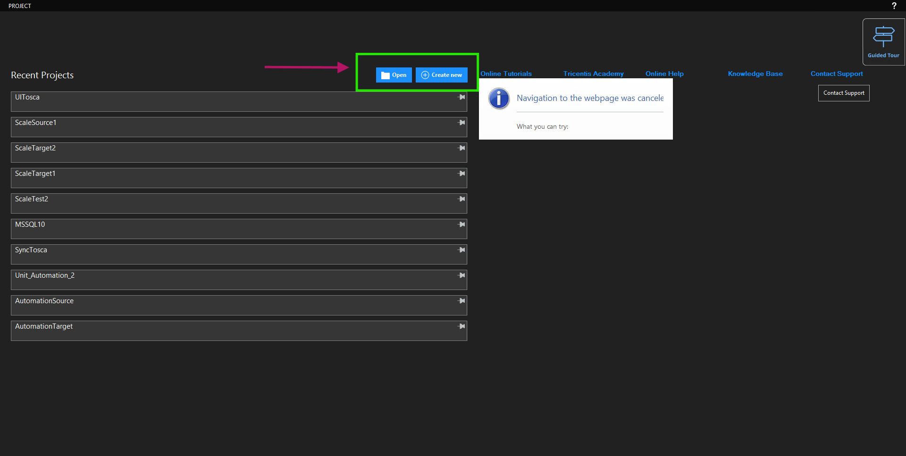
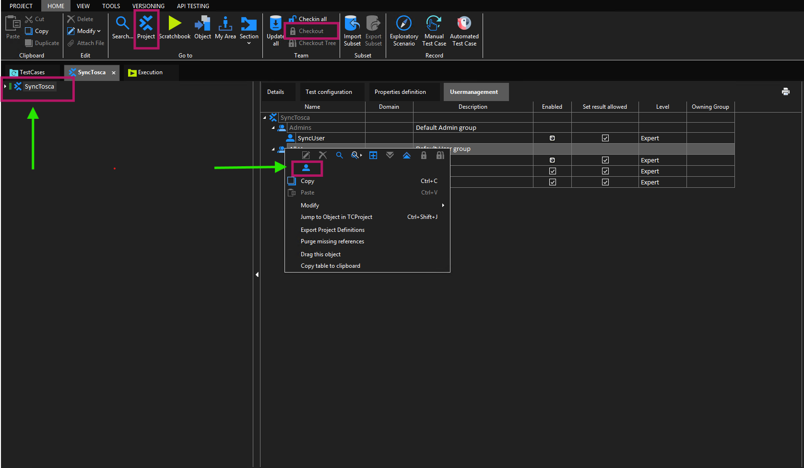
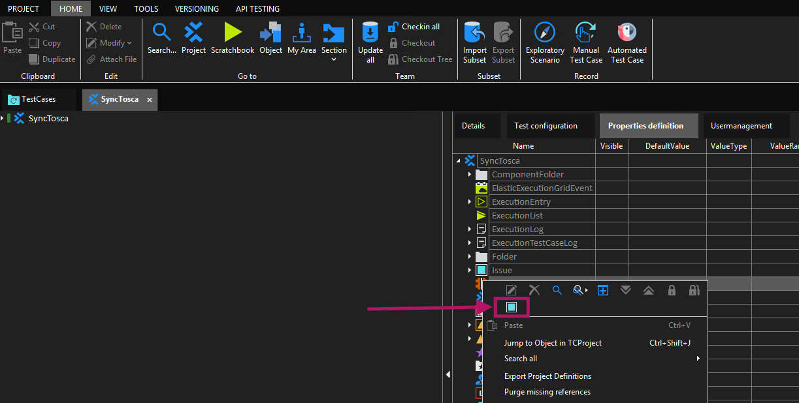
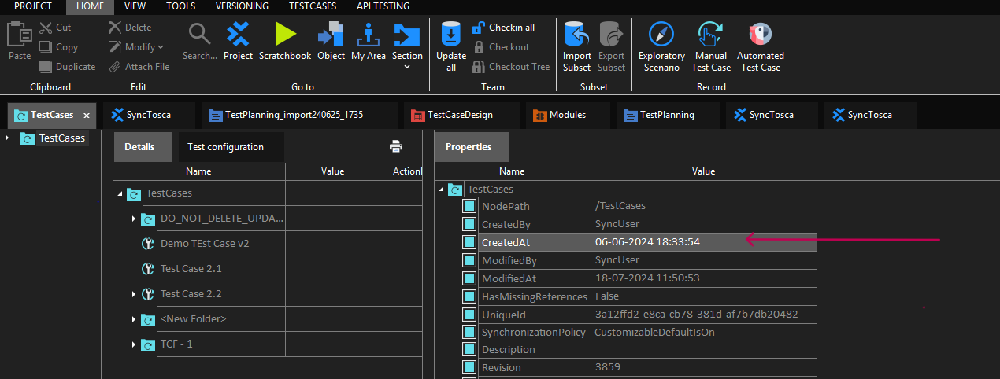

# Prerequisites

## User Permissions

* Basic-level access must be granted to the service account for synchronization as shown in the screenshot below.
* 
<p align="center">
  
</p>

* To know how to add a user, refer to [Add Users](#add-users) section in Appendix.

## Custom Field

OpsHub Integration Manager requires one special field to be defined on the entity that is being synchronized to Tosca. It must be set up so that OpsHub Integration Manager can track the integration status of each item:

| **Property Name** | **Type** |
|-------------------|----------|
| OH_Last_Update    | String   |

For more details on adding custom fields, refer to [Create Custom Property](#create-custom-property) section in Appendix.

## Dedicated Workspace

* To synchronize data from a specific Tosca workspace, the user needs to create a cloned workspace of the original one for integration through OpsHub Integration Manager.
* Ensure that both the original and cloned workspaces point to the same repository.
* For more details on creating/cloning a workspace, refer to [Create or Clone Workspace](#create-or-clone-workspace) section in Appendix.

## Configuring the Timeout Setting

Based on our observations of the timeout behavior from the Tosca server, we recommend adjusting the timeout value to prevent server errors. To configure the timeout value, please follow the steps below:

1. Go to the `%tosca_server_home%\Gateway` directory.  
2. Create a backup of the `ocelot.json` file.  
3. Open the `ocelot.json` file for editing.  
4. Locate the line with `"UpstreamPathTemplate": "/rest/{everything}"`.  
5. Append the following JSON snippet immediately after this line:
```json
{
  "QoSOptions": {
    "TimeoutValue": 200000
  }
}
```
6. Save and close the `ocelot.json` file.  
7. After the changes it should look like as shown in the screenshot below.
   
<p align="center">
  
</p>

8. Restart both the **Tricentis.GatewayService** and **Tricentis.Tosca.RestApiService** for the changes to take effect.

# System Configuration

Before you start with the integration configuration, you must first configure Tosca.

Refer to [System Configuration](../integrate/system-configuration.md) page to learn the steps to configure a system.

Refer to the screenshot below:  

<p align="center">
  
</p>


| **Field Name** | **Description** |
|----------------|-----------------|
| **System Name** | Provide a unique name to Tosca system |
| **Instance URL** | Provide URL for Tosca instance. Example: <hostname>/rest/toscacommander |
| **Username** | Provide username of the dedicated user for OpsHub Integration Manager. Ensure that the dedicated user has the necessary permissions |
| **Password** | Provide password of the dedicated user for OpsHub Integration Manager |
| **Date Format For API** | Provide the date format of Tosca instance in which date appears in API response for CreatedAt And ModifiedAt Fields (Refer to [Select Date Format For API](#select-date-format-for-api) section in Appendix for more information) |
| **Date Format For UI** | Provide date format of Tosca instance in which the date appears in CreatedAt And ModifiedAt Fields (Refer to [Select Date Format For UI](#select-date-format-for-ui) section in Appendix for more information) |
| **Instance Time Zone** | Provide time zone of Tosca instance |
| **Metadata Details** | This data is pre-populated in JSON format based on system metadata (entity type, field names, etc.). You can edit entity types based on your Tosca instance's details for system metadata. Refer to [Understanding JSON Input](#understanding-json-input) section for format and JSON form details |
| **Workspace Refresh Time** | Enter the time in seconds for the workspace refresh interval. OpsHub Integration Manager will update the cloned workspace according to this interval. |

## Understanding JSON Input

* The entity metadata details can be provided at the time of system configuration in the field 'Metadata details' in JSON format in the below mentioned example:
```json
{
        "projects": [
            {
                "entities": [
                    {
                        "internalName": "TCComponentFolder",
                        "displayName": "TCComponentFolder",
                        "readMechanism": "NON_HISTORY",
                        "hasReadSupport": true,
                        "hasWriteSupport": true,
                        "fields": {}
                    },
                    {
                        "internalName": "XModule",
                        "displayName": "XModule",
                        "readMechanism": "NON_HISTORY",
                        "hasReadSupport": true,
                        "hasWriteSupport": true,
                        "fields": {}
                    }
                ],
                "internalName": "Automation_Source_2"
            }
        ]
    }
```

# Mapping Configuration

Map the fields between Tosca and the other system to be integrated to ensure that the data between both the systems synchronize correctly. Refer to [Mapping Configuration](../integrate/mapping-configuration.md) page to learn the step-by-step process to configure mapping between the systems.  

<p align="center">
  
</p>


## Relationship Configuration

In Tosca, Associations will be supported as Relationships.

### Mandatory Links

* For TestCase, Issue, TCFolder and RequirementSet type of entities, the TCFolder is a mandatory relationship linkage as those entities can only be created inside the TCFolder.
* For ExecutionEntry type of entities, TCFolder And TestCase are the mandatory relationship linkages as ExecutionEntry can only be created under TCFolder by giving TestCase reference.
* For Requirement type of entities, RequirementSet is the mandatory relationship linkage as Requirement can only be created inside the RequirementSet.

# Integration Configuration

Set polling time as the time after which the user wants to synchronize data between Tosca and the other system to be integrated. Also, define parameters and conditions for integration (if any). Refer to [Integration Configuration](../integrate/integration-configuration.md) page to learn the step-by-step process to configure integration between two systems.  

<p align="center">
  
</p>


# Criteria Configuration

* If the user wants to specify conditions for synchronizing an entity between Tosca and the other system to be integrated, refer to this Criteria Configuration section on [Integration Configuration](../integrate/integration-configuration.md) page.  
* To configure criteria in Tosca, integration needs to be created with Tosca as the source system. The user can set a query on a particular ItemType.
* Tosca Query format will be same as the **TQL (Tosca Query Language)**.
* Please refer [this](https://documentation.tricentis.com/tosca/1500/en/content/tosca_commander/tql_search.htm) link To learn how to form a query in TQL format.

**Criteria samples**

| **Field Type** | **Criteria Description** | **Criteria snippet** |
|----------------|--------------------------|-----------------------|
| **Lookup** | Synchronize all entities having priority set to 'High' | priority =? "High" |
| **Date** | Synchronize all entities created after certain date | created_on > "2020-01-31T00:00:00" |
| **Text** | Synchronize all entities with Name Demo entity | Name =? "Demo" |
| **Text** and **Lookup** | Synchronize all entities with Name Demo entity **and** status set to 'IN-PROGRESS' | Name =? "Demo" And status =? "IN-PROGRESS" |
| **Text** or **Lookup** | Synchronize all entities with Name Demo entity **or** status set to 'IN-PROGRESS' | Name =? "Demo" Or status =? "IN-PROGRESS" |

# Target LookUp Configuration

* Provide query in Target Search Query field to be able to search the entity in Tosca when it is the target system.  
* Go to **Search in Target Before Sync** section on [Integration Configuration](../integrate/integration-configuration.md) page to learn how to configure Target LookUp.  
* Target LookUp configuration is similar to the [Criteria Configuration](#criteria-configuration) where in the Target Search Query field, the user can provide a placeholder for the source system’s field value in-between ‘@’.  
* For example there is a use case to search an entity in Tosca (Destination system), which has the entity id of the source system in a field named 'TargetCustomField'. The source system's entity id is stored in 'source_entity_id'. If the Target Search Query is given as:  
  `TargetCustomField =? "@source_entity_id@"`, then while processing this query @source_entity_id@ will be substituted with the value of source_system_id from the source system's entity and then the query will be made to Tosca.

# Known Behaviors

* Remote Link synchronization:  
  * In Tosca, because it is a desktop application, Remote Link is not supported.
* Tosca's entities will be synchronized without history because of API limitation.
* Attachment synchronization:  
  * Support for write attachments is not available due to API limitation.  
  * Read support for only embedded types of attachments.

# Known Limitations

* Only for Issue-ExecutionTestCaseLog and TestCase-Requirement, write relationship is supported.  
  * Other types of relation links are not supported due to API limitation.
* Test-step field write is not supported.
* Synchronisation of control flow diagram field is not supported.  
  * Fetching the control flow diagram field details is not possible due to API limitation.
* Only read support for ExecutionTestCaseLog is available because of API limitation.

# Appendix

## Create or Clone Workspace

1. Open Tosca Commander -> Create New option for creating a new workspace.  
2. You can select database (Repository) as per your use case.
   
<p align="center">
  
</p>


## Add Users

1. Log in to the Tosca Commander with the user having administrator privileges (by default admin user has administrator privileges).  
2. Navigate to WorkSpace -> Checkout -> Usermanagement.  
3. Provide necessary details for the fields such as Login Name, Password, etc.  

<p align="center">
  
</p>


## Create Custom Property

1. Log in to the Tosca Commander with the user having administrator privileges (by default admin user has administrator privileges).  
2. Navigate to Project -> Properties definition. Now, checkout on project -> select entity in which you want to add custom field -> select create property  

<p align="center">
  
</p>


## Select Date Format

#### Select Date Format for API

* You can identify API date format from one of the CreatedAt And ModifiedAt Field responses from API.
* To get API response follow these steps:  
  * Retrieve any record through API (`<hostname>/rest/toscacommander/<Any Workspace name>/object/<Any Object Id>`).
  * Get the value of one of **CreatedAt** And **ModifiedAt** fields from the response as shown below:
  * According to below example, date format will be **dd-MM-yyyy HH:mm:ss**

```json
{
        "Attributes": [
            {
                "Name": "Description",
                "Value": "2024_08_22_17_27_44_"
            },
            {
                "Name": "Name",
                "Value": "2024_08_22_17_27_44_"
            },
            {
                "Name": "CreatedAt",
                "Value": "22-08-2024 17:27:49"
            },
            {
                "Name": "ModifiedAt",
                "Value": "22-08-2024 17:27:56"
            },
            {
                "Name": "ModifiedBy",
                "Value": "UIUser"
            },
            {
                "Name": "UniqueId",
                "Value": "3a148c20-132d-6d85-99a1-3ff060f10af8"
            },
            {
                "Name": "Revision",
                "Value": "3224"
            }
        ],
        "TestConfigurationParameters": [],
        "TypeName": "XModule",
        "UniqueId": "3a148c20-132d-6d85-99a1-3ff060f10af8"
    }
```
### Select Date Format for UI

* You can identify UI date format from one of the CreatedAt And ModifiedAt fields from Tosca Commander as shown below.
* According to below example, date format will be **dd-MM-yyyy HH:mm:ss**  

<p align="center">
  
</p>


